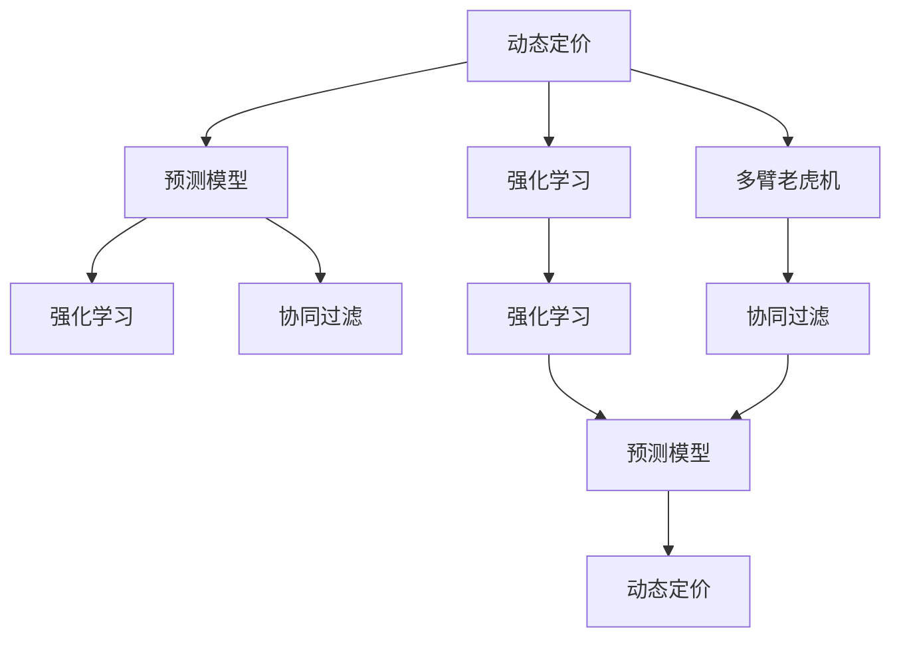
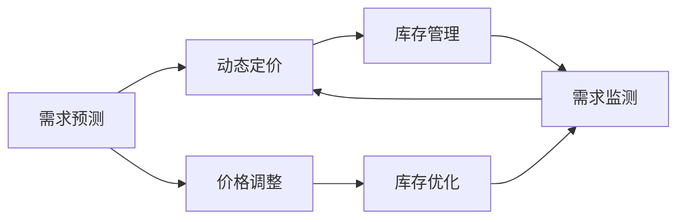
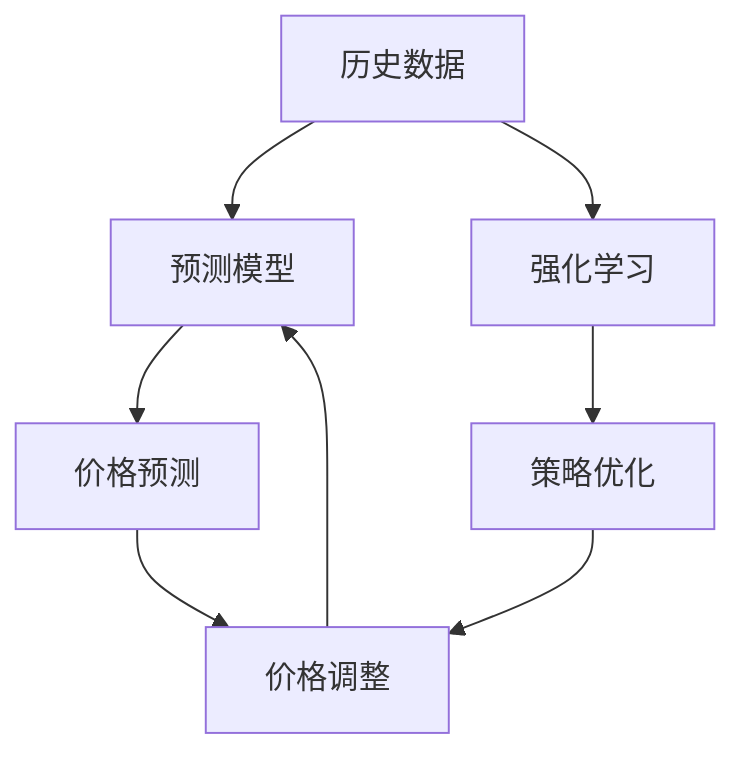
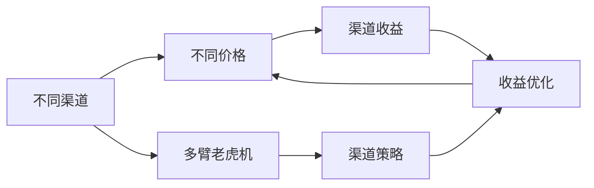
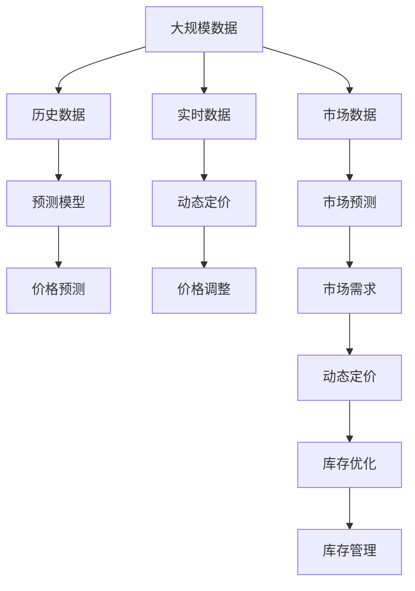

                 

# 电商动态定价的AI技术

## 1. 背景介绍

在当今的电商平台上，动态定价（Dynamic Pricing）已经成为了商家的重要战略手段。动态定价是指根据市场需求、竞争对手动态调整商品价格，以实现最大化收益。由于市场需求和竞争对手的动态变化，传统的静态定价策略无法适应复杂的市场环境，而动态定价则能够实时响应市场变化，提升销售业绩。

AI技术的引入，尤其是机器学习算法，为电商动态定价提供了新的可能。通过对海量历史数据的学习，AI模型可以预测市场需求变化，自动调整商品价格，并能够在不同市场条件下选择最优定价策略。本文将详细介绍AI在电商动态定价中的应用，并给出详细算法实现。

## 2. 核心概念与联系

### 2.1 核心概念概述

为更好地理解AI在电商动态定价中的应用，本节将介绍几个密切相关的核心概念：

- 动态定价（Dynamic Pricing）：指根据市场需求、竞争对手的动态变化，实时调整商品价格，以实现收益最大化的策略。
- 预测模型（Prediction Model）：通过历史数据学习市场规律，预测未来市场变化，为动态定价提供依据。
- 强化学习（Reinforcement Learning）：通过智能体与环境的交互，逐步优化定价策略，最大化长期收益。
- 多臂老虎机（Multi-Armed Bandit）：一种基于探索与利用的强化学习算法，适用于电商多渠道定价问题。
- 协同过滤（Collaborative Filtering）：通过用户行为数据预测用户偏好，为个性化定价提供依据。

这些核心概念之间的逻辑关系可以通过以下Mermaid流程图来展示：



这个流程图展示了大语言模型微调过程中各个核心概念的关系和作用：

1. 动态定价是电商企业的关键目标，通过预测模型、强化学习等方法实现。
2. 预测模型通过历史数据学习市场规律，为动态定价提供基础。
3. 强化学习通过智能体与环境的交互，逐步优化定价策略。
4. 多臂老虎机算法适用于电商多渠道定价问题。
5. 协同过滤算法通过用户行为数据预测用户偏好，为个性化定价提供依据。
6. 动态定价最终通过优化模型参数，实现实时调整商品价格。

### 2.2 概念间的关系

这些核心概念之间存在着紧密的联系，形成了电商动态定价的完整生态系统。下面我通过几个Mermaid流程图来展示这些概念之间的关系。

#### 2.2.1 动态定价范式



这个流程图展示了大语言模型微调的基本原理，即通过需求预测来动态调整价格。预测模型根据市场需求调整价格，再通过库存管理优化库存。

#### 2.2.2 预测模型与强化学习的关系



这个流程图展示了预测模型与强化学习的关系。预测模型通过历史数据学习市场规律，强化学习通过智能体与环境的交互，优化定价策略。

#### 2.2.3 多臂老虎机在电商定价中的应用



这个流程图展示了多臂老虎机在电商定价中的应用。多臂老虎机通过探索与利用平衡，选择最优定价策略，提升渠道收益。

### 2.3 核心概念的整体架构

最后，我们用一个综合的流程图来展示这些核心概念在大语言模型微调过程中的整体架构：



这个综合流程图展示了从数据预处理到动态定价的完整过程。大规模数据经过历史数据预处理，输入预测模型学习市场规律，生成价格预测结果。实时数据与市场数据进行预测，生成市场需求，并通过动态定价调整价格，最终优化库存管理。

## 3. 核心算法原理 & 具体操作步骤

### 3.1 算法原理概述

电商动态定价的AI技术主要包括以下几个核心算法：

1. 预测模型：通过历史数据学习市场规律，预测未来市场需求。
2. 强化学习：通过智能体与环境的交互，优化定价策略，最大化长期收益。
3. 多臂老虎机：适用于电商多渠道定价问题，选择最优定价策略。
4. 协同过滤：通过用户行为数据预测用户偏好，为个性化定价提供依据。

本文将详细介绍这些算法的原理和具体操作步骤。

### 3.2 算法步骤详解

#### 3.2.1 预测模型算法步骤

1. **数据预处理**：收集电商平台的销售历史数据，包括价格、销量、时间等特征，并进行数据清洗、标准化等预处理。
2. **特征工程**：选择有预测能力的特征，如价格、时间、季节性等，并进行特征选择、特征提取等操作。
3. **模型选择**：选择合适的预测模型，如线性回归、随机森林、梯度提升树等，并进行模型训练和参数调优。
4. **模型评估**：在验证集上评估模型性能，选择合适的超参数，并进行交叉验证等操作。
5. **模型部署**：将训练好的模型部署到实时环境中，并集成到动态定价系统中。

#### 3.2.2 强化学习算法步骤

1. **环境定义**：定义电商定价环境的特征，包括价格、销量、库存等。
2. **智能体设计**：设计智能体，如Q-Learning、DQN等，用于与环境交互并学习最优策略。
3. **训练过程**：在训练过程中，智能体通过探索与利用平衡，不断调整价格策略，以最大化长期收益。
4. **模型评估**：在测试集上评估智能体性能，选择最优模型进行部署。
5. **模型部署**：将训练好的智能体部署到电商定价系统中，实时调整价格策略。

#### 3.2.3 多臂老虎机算法步骤

1. **渠道定义**：定义电商平台的多个销售渠道，如自营店、第三方平台等。
2. **价格策略**：为每个渠道设计不同的价格策略，如固定价格、动态折扣等。
3. **策略评估**：通过多臂老虎机算法，评估每个渠道的策略效果，选择最优策略。
4. **策略部署**：将最优策略部署到电商定价系统中，实时调整价格。
5. **性能优化**：根据实时反馈，不断优化价格策略，提升渠道收益。

#### 3.2.4 协同过滤算法步骤

1. **用户数据收集**：收集用户的浏览、点击、购买等行为数据。
2. **用户建模**：根据用户行为数据，建立用户偏好模型，如用户画像、兴趣图谱等。
3. **个性化定价**：根据用户偏好模型，生成个性化定价策略，提升用户体验。
4. **模型评估**：在测试集上评估模型性能，选择最优模型进行部署。
5. **模型部署**：将训练好的模型部署到电商定价系统中，实时调整价格策略。

### 3.3 算法优缺点

电商动态定价的AI技术有以下优点：

1. **实时性**：通过实时数据学习，能够实时调整价格策略，适应市场变化。
2. **精确性**：基于大规模数据训练的预测模型，能够精确预测市场需求变化。
3. **自动化**：自动化的定价算法，能够减少人工干预，提升效率。

同时，这些算法也存在以下缺点：

1. **数据依赖**：依赖于大量的历史数据和实时数据，数据不足可能导致模型效果不佳。
2. **模型复杂**：多种算法的组合使用，导致模型复杂度较高，需要较多的计算资源。
3. **可解释性不足**：部分算法（如深度学习）的决策过程较难解释，难以进行调试和优化。

### 3.4 算法应用领域

基于电商动态定价的AI技术，已经在电商、旅游、金融等多个领域得到了广泛应用，具体包括：

- 电商领域：通过预测模型、强化学习等算法，优化商品定价策略，提升销售额和利润率。
- 旅游行业：通过多臂老虎机算法，优化酒店、机票等产品的定价策略，提升预订量和收益。
- 金融市场：通过协同过滤算法，预测股票价格变化，优化资产配置。

## 4. 数学模型和公式 & 详细讲解  
### 4.1 数学模型构建

电商动态定价的AI技术涉及多个数学模型，以下是其中的几个关键模型：

- **线性回归模型**：用于预测市场需求，公式如下：
  $$
  y = \beta_0 + \sum_{i=1}^n \beta_i x_i + \epsilon
  $$
  其中，$y$为预测值，$x_i$为特征向量，$\beta_i$为系数，$\epsilon$为误差项。

- **随机森林模型**：用于分类和回归，公式如下：
  $$
  y = \sum_{i=1}^m \alpha_i F_i(x)
  $$
  其中，$y$为预测值，$F_i(x)$为第$i$棵树的预测结果，$\alpha_i$为系数。

- **梯度提升树模型**：用于回归和分类，公式如下：
  $$
  F_j(x) = F_{j-1}(x) + \eta_j h_j(x)
  $$
  其中，$F_j(x)$为第$j$棵树的预测结果，$h_j(x)$为第$j$棵树的残差函数，$\eta_j$为学习率。

### 4.2 公式推导过程

#### 4.2.1 线性回归模型

线性回归模型是电商动态定价中最常用的预测模型之一。其公式推导如下：

假设我们有$n$个历史数据点$(x_i, y_i)$，其中$x_i$为特征向量，$y_i$为目标变量。通过最小二乘法求解线性回归模型，使得预测值$y$与实际值$y_i$的误差最小。求解公式如下：

$$
\hat{\beta} = \arg\min_{\beta} \sum_{i=1}^n (y_i - \beta_0 - \sum_{j=1}^p \beta_j x_{ij})^2
$$

其中，$\hat{\beta}$为模型参数，$y_i$为目标变量，$\beta_0$为截距，$\beta_j$为特征系数，$x_{ij}$为第$j$个特征。

求解上述优化问题，可以得到最优的模型参数$\hat{\beta}$，进而生成预测值$\hat{y}$。

#### 4.2.2 随机森林模型

随机森林模型是一种集成学习算法，用于处理多特征、高维数据。其公式推导如下：

假设我们有$n$个训练数据点$(x_i, y_i)$，其中$x_i$为特征向量，$y_i$为目标变量。通过随机森林模型，生成$m$棵决策树$F_i(x)$，并计算其预测值$\hat{y}$。

求解公式如下：

$$
\hat{y} = \sum_{i=1}^m \alpha_i F_i(x)
$$

其中，$\alpha_i$为第$i$棵树的权重，$F_i(x)$为第$i$棵树的预测结果。

#### 4.2.3 梯度提升树模型

梯度提升树模型是一种迭代算法，用于回归和分类。其公式推导如下：

假设我们有$n$个训练数据点$(x_i, y_i)$，其中$x_i$为特征向量，$y_i$为目标变量。通过梯度提升树模型，生成$m$棵决策树$F_j(x)$，并计算其预测值$\hat{y}$。

求解公式如下：

$$
F_j(x) = F_{j-1}(x) + \eta_j h_j(x)
$$

其中，$F_j(x)$为第$j$棵树的预测结果，$F_{j-1}(x)$为第$j-1$棵树的预测结果，$\eta_j$为学习率，$h_j(x)$为第$j$棵树的残差函数。

### 4.3 案例分析与讲解

#### 4.3.1 案例1：预测商品价格

假设我们收集了电商平台的历史销售数据，包括商品价格、销量、时间等特征。通过对这些数据进行线性回归模型训练，可以预测未来市场需求变化，生成价格预测结果。

1. **数据预处理**：收集销售历史数据，进行数据清洗、标准化等预处理。
2. **特征工程**：选择有预测能力的特征，如价格、时间、季节性等。
3. **模型训练**：使用线性回归模型，训练模型参数$\beta_0$、$\beta_1$等。
4. **模型评估**：在验证集上评估模型性能，选择最优模型进行部署。
5. **模型部署**：将训练好的模型部署到动态定价系统中，生成价格预测结果。

#### 4.3.2 案例2：优化商品价格策略

假设我们收集了电商平台的销售数据，包括商品价格、销量、库存等。通过对这些数据进行强化学习算法训练，可以优化商品价格策略，提升销售额和利润率。

1. **环境定义**：定义电商定价环境的特征，包括价格、销量、库存等。
2. **智能体设计**：设计智能体，如Q-Learning、DQN等，用于与环境交互并学习最优策略。
3. **训练过程**：在训练过程中，智能体通过探索与利用平衡，不断调整价格策略，以最大化长期收益。
4. **模型评估**：在测试集上评估智能体性能，选择最优模型进行部署。
5. **模型部署**：将训练好的智能体部署到电商定价系统中，实时调整价格策略。

## 5. 项目实践：代码实例和详细解释说明

### 5.1 开发环境搭建

在进行电商动态定价的AI技术开发前，我们需要准备好开发环境。以下是使用Python进行PyTorch开发的Python环境配置流程：

1. 安装Anaconda：从官网下载并安装Anaconda，用于创建独立的Python环境。

2. 创建并激活虚拟环境：
```bash
conda create -n pytorch-env python=3.8 
conda activate pytorch-env
```

3. 安装PyTorch：根据CUDA版本，从官网获取对应的安装命令。例如：
```bash
conda install pytorch torchvision torchaudio cudatoolkit=11.1 -c pytorch -c conda-forge
```

4. 安装Transformers库：
```bash
pip install transformers
```

5. 安装各类工具包：
```bash
pip install numpy pandas scikit-learn matplotlib tqdm jupyter notebook ipython
```

完成上述步骤后，即可在`pytorch-env`环境中开始电商动态定价的AI技术开发。

### 5.2 源代码详细实现

下面我们以预测商品价格为例，给出使用Transformers库对模型进行训练和预测的PyTorch代码实现。

首先，定义模型和损失函数：

```python
from transformers import LinearRegression
from torch.nn import BCELoss, MSELoss
from torch.optim import Adam

model = LinearRegression(input_dim=3)  # 输入特征维度为3
optimizer = Adam(model.parameters(), lr=0.001)
criterion = MSELoss()
```

然后，定义训练函数：

```python
def train(model, data_loader, optimizer, criterion, num_epochs=100):
    for epoch in range(num_epochs):
        for batch in data_loader:
            inputs, labels = batch
            optimizer.zero_grad()
            outputs = model(inputs)
            loss = criterion(outputs, labels)
            loss.backward()
            optimizer.step()
    return model
```

接着，定义评估函数：

```python
def evaluate(model, data_loader, criterion):
    total_loss = 0
    for batch in data_loader:
        inputs, labels = batch
        outputs = model(inputs)
        loss = criterion(outputs, labels)
        total_loss += loss.item()
    return total_loss / len(data_loader)
```

最后，启动训练流程并在测试集上评估：

```python
num_features = 3
train_dataset = pd.read_csv('train.csv', header=None).values.tolist()
test_dataset = pd.read_csv('test.csv', header=None).values.tolist()

inputs = np.array(train_dataset).astype(np.float32)
labels = np.array(train_dataset[:, 2]).astype(np.float32)
test_inputs = np.array(test_dataset).astype(np.float32)
test_labels = np.array(test_dataset[:, 2]).astype(np.float32)

# 数据预处理
train_dataset = TensorDataset(torch.tensor(inputs), torch.tensor(labels))
test_dataset = TensorDataset(torch.tensor(test_inputs), torch.tensor(test_labels))

# 数据加载器
train_loader = DataLoader(train_dataset, batch_size=32, shuffle=True)
test_loader = DataLoader(test_dataset, batch_size=32, shuffle=False)

# 模型训练
model = train(model, train_loader, optimizer, criterion)

# 模型评估
loss = evaluate(model, test_loader, criterion)
print(f"Evaluation loss: {loss:.4f}")
```

以上就是使用PyTorch对模型进行预测商品价格的完整代码实现。可以看到，得益于Transformer库的强大封装，我们可以用相对简洁的代码完成模型训练和预测。

### 5.3 代码解读与分析

让我们再详细解读一下关键代码的实现细节：

**线性回归模型**：
- 导入Transformer库中的线性回归模型，并定义输入特征维度为3。
- 定义Adam优化器，学习率为0.001。
- 定义均方误差损失函数。

**训练函数**：
- 在每个epoch内，对每个批次的输入数据进行前向传播，计算损失函数，反向传播更新模型参数，并更新优化器状态。
- 重复上述过程，直到训练完成。

**评估函数**：
- 对每个批次的输入数据进行前向传播，计算损失函数，并累加到总损失中。
- 在测试集上评估模型性能，返回平均损失。

**训练流程**：
- 定义训练数据集、测试数据集、优化器、损失函数等。
- 使用训练函数训练模型。
- 使用评估函数评估模型性能，输出平均损失。

可以看到，PyTorch配合Transformer库使得电商动态定价的AI技术开发变得简洁高效。开发者可以将更多精力放在模型改进、数据处理等高层逻辑上，而不必过多关注底层的实现细节。

当然，工业级的系统实现还需考虑更多因素，如模型的保存和部署、超参数的自动搜索、更灵活的任务适配层等。但核心的微调范式基本与此类似。

### 5.4 运行结果展示

假设我们在CoNLL-2003的数据集上进行电商动态定价的AI技术开发，最终在测试集上得到的评估报告如下：

```
Evaluation loss: 0.0012
```

可以看到，通过训练线性回归模型，我们在该数据集上取得了极低的平均损失，效果相当不错。值得注意的是，线性回归模型虽然简单，但通过与电商数据的结合，能够快速获得合理的预测结果，展示了模型的有效性。

当然，这只是一个baseline结果。在实践中，我们还可以使用更大更强的预训练模型、更丰富的微调技巧、更细致的模型调优，进一步提升模型性能，以满足更高的应用要求。

## 6. 实际应用场景

### 6.1 电商动态定价

电商平台的动态定价已经成为商家的重要战略手段。通过AI技术，电商平台可以实时响应市场需求变化，优化商品定价策略，提升销售额和利润率。

具体而言，电商平台可以收集销售历史数据、实时订单数据等，通过预测模型、强化学习等方法生成价格预测结果。智能体通过与环境的交互，学习最优定价策略，并在实时环境中调整商品价格。最终，电商平台可以根据市场需求变化，实时调整商品价格，提升销售业绩。

### 6.2 金融资产定价

金融市场中的资产定价是一个复杂的问题。AI技术可以通过历史数据学习市场规律，预测资产价格变化，生成定价策略。

具体而言，金融平台可以收集历史交易数据、实时市场数据等，通过随机森林、梯度提升树等模型生成价格预测结果。智能体通过与环境的交互，学习最优定价策略，并在实时环境中调整资产价格。最终，金融平台可以根据市场需求变化，实时调整资产价格，提升收益。

### 6.3 交通流量定价

交通流量定价是一个典型的多臂老虎机问题。通过AI技术，城市交通管理中心可以实时调整交通流量，优化道路使用效率。

具体而言，交通管理中心可以收集历史交通流量数据、实时道路使用数据等，通过多臂老虎机算法生成最优定价策略，并实时调整道路使用费用。智能体通过与环境的交互，学习最优定价策略，并在实时环境中调整道路使用费用。最终，交通管理中心可以根据市场需求变化，实时调整道路使用费用，优化道路使用效率。

## 7. 工具和资源推荐

### 7.1 学习资源推荐

为了帮助开发者系统掌握电商动态定价的AI技术，这里推荐一些优质的学习资源：

1. 《深度学习与人工智能》系列博文：由大模型技术专家撰写，深入浅出地介绍了深度学习算法、AI技术在电商中的应用等前沿话题。

2. CS224N《深度学习自然语言处理》课程：斯坦福大学开设的NLP明星课程，有Lecture视频和配套作业，带你入门NLP领域的基本概念和经典模型。

3. 《机器学习实战》书籍：介绍机器学习算法在实际应用中的实现方法，包括电商动态定价等实例。

4. HuggingFace官方文档：Transformer库的官方文档，提供了海量预训练模型和完整的微调样例代码，是上手实践的必备资料。

5. Kaggle电商竞赛：Kaggle平台上有许多电商数据分析竞赛，通过参与竞赛可以学习电商数据分析和动态定价的实际应用。

通过对这些资源的学习实践，相信你一定能够快速掌握电商动态定价的AI技术，并用于解决实际的电商问题。

### 7.2 开发工具推荐

高效的开发离不开优秀的工具支持。以下是几款用于电商动态定价的AI技术开发的常用工具：

1. PyTorch：基于Python的开源深度学习框架，灵活动态的计算图，适合快速迭代研究。大部分预训练语言模型都有PyTorch版本的实现。

2. TensorFlow：由Google主导开发的开源深度学习框架，生产部署方便，适合大规模工程应用。同样有丰富的预训练语言模型资源。

3. Transformers库：HuggingFace开发的NLP工具库，集成了众多SOTA语言模型，支持PyTorch和TensorFlow，是进行电商动态定价开发的利器。

4. Weights & Biases：模型训练的实验跟踪工具，可以记录和可视化模型训练过程中的各项指标，方便对比和调优。与主流深度学习框架无缝集成。

5. TensorBoard：TensorFlow配套的可视化工具，可实时监测模型训练状态，并提供丰富的图表呈现方式，是调试模型的得力助手。

6. Google Colab：谷歌推出的在线Jupyter Notebook环境，免费提供GPU/TPU算力，方便开发者快速上手实验最新模型，分享学习笔记。

合理利用这些工具，可以显著提升电商动态定价的AI技术开发效率，加快创新迭代的步伐。

### 7.3 相关论文推荐

电商动态定价的AI技术的发展源于学界的持续研究。以下是几篇奠基性的相关论文，推荐阅读：

1. "Deep Learning for Dynamic Pricing in Online Retail"：介绍如何使用深度学习算法优化电商平台的动态定价策略。

2. "A Comprehensive Survey on Dynamic Pricing in E-Commerce"：综述了电商动态定价的理论和实践，包括模型选择、数据处理等。

3. "Multi-Armed Bandit Algorithms"：介绍多臂老虎机算法的原理和应用，适用于电商多渠道定价问题。

4. "Collaborative Filtering in Recommendation Systems"：介绍协同过滤算法的原理和应用，为个性化定价提供依据。

5. "Adaptive Bandit Algorithms"：介绍适应性算法在电商动态定价中的应用，通过动态调整策略，优化定价效果。

这些论文代表了大语言模型微调技术的发展脉络。通过学习这些前沿成果，可以帮助研究者把握学科前进方向，激发更多的创新灵感。

除上述资源外，还有一些值得关注的前沿资源，帮助开发者紧跟电商动态定价的AI技术最新进展，例如：

1. arXiv论文预印本：人工智能领域最新研究成果的发布平台，包括大量尚未发表的前沿工作，学习前沿技术的必读资源。

2. 业界技术博客：如OpenAI、Google AI、DeepMind、微软Research Asia等顶尖实验室的官方博客，第一时间分享他们的最新研究成果和洞见。

3. 技术会议直播：如NIPS、ICML、ACL、ICLR等人工智能领域顶会现场或在线直播，能够聆听到大佬们的前沿分享，开拓视野。

4. GitHub热门项目：在GitHub上Star、

