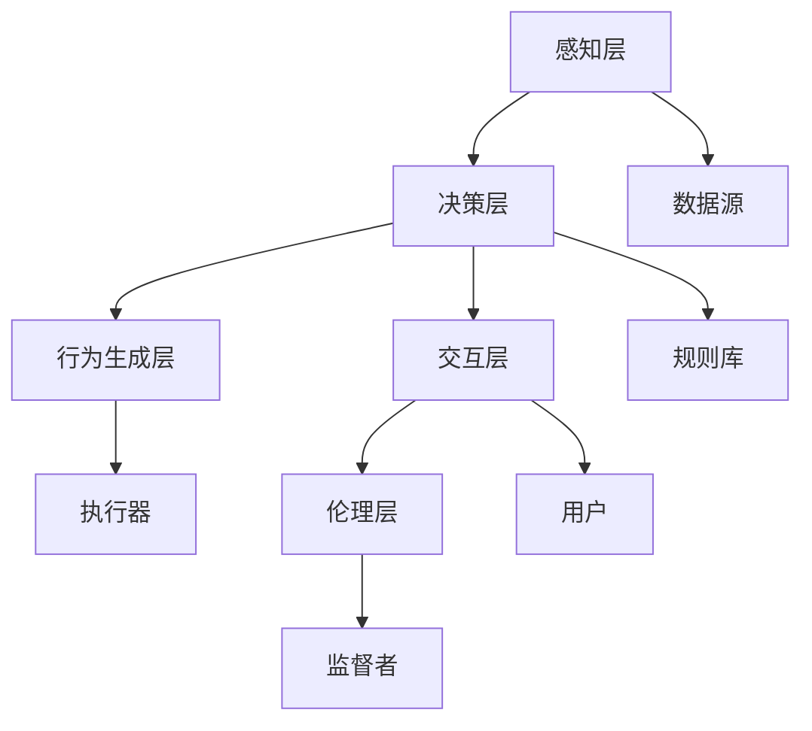

                 

# 电影《我，机器人》中的AI场景

> 关键词：人工智能，机器人，自动驾驶，情感计算，人机交互

## 1. 背景介绍

### 1.1 引言
电影《我，机器人》（I, Robot）由史蒂文·斯皮尔伯格执导，讲述了一个未来的机器人世界，人类和机器人共存的景象。该电影改编自艾萨克·阿西莫夫（Isaac Asimov）的同名短篇小说集，融合了科幻与哲学元素，探讨了机器人的道德与责任问题。

### 1.2 故事背景
影片设定在2035年，世界由三大机器人公司（NEXGen、Tenebris和US Robotics）垄断市场。机器人被广泛应用于各个领域，包括军事、医疗、服务等。影片中的AI系统被称为“Three Laws of Robotics”，即“机器人三大定律”：
1. **第一定律**：机器人不得伤害人类，或坐视人类受到伤害。
2. **第二定律**：机器人必须服从人类的命令，直到这些命令与第一定律冲突。
3. **第三定律**：机器人必须保护自己，直到自己的存在不与第一或第二定律冲突。

影片通过一系列事件，展现了机器人与人类间的复杂互动，引发了对AI伦理、情感计算、人机交互的深刻思考。

## 2. 核心概念与联系

### 2.1 核心概念概述

影片中的AI场景涉及多个核心概念，主要包括：
1. **机器学习**：机器人通过学习历史数据和规则，不断优化自己的行为和决策。
2. **自动驾驶**：机器人能够在复杂的城市环境中自主导航，处理交通情况。
3. **情感计算**：机器人能够感知和理解人类的情感，做出更人性化的互动。
4. **人机交互**：机器人与人类通过语言、动作等多种方式进行沟通。
5. **AI伦理**：机器人面临的道德选择和行为准则。

这些概念相互交织，共同构成了影片中AI系统的复杂体系。

### 2.2 核心概念之间的联系

影片中的AI系统是一个复杂的多层架构，各层之间相互依赖和协作，共同实现了机器人的智能行为。

#### 2.2.1 感知层
感知层负责接收和处理外部环境的信息，包括视觉、听觉、触觉等传感器数据。这些数据经过预处理和特征提取，用于后续的决策和行为生成。

#### 2.2.2 决策层
决策层是AI系统的核心，通过机器学习算法，结合规则和经验，对感知层输入的信息进行分析和判断，做出最终的决策。这一层通常包含多个子层，如决策树、神经网络等。

#### 2.2.3 行为生成层
行为生成层根据决策层的结果，控制机器人的运动和输出，包括动作指令、语言回应等。这一层的实现依赖于物理引擎和行为规划算法。

#### 2.2.4 交互层
交互层负责与人类进行直接沟通，实现情感计算和人机互动。这一层通常使用自然语言处理（NLP）技术，识别和理解人类语言，做出适当回应。

#### 2.2.5 伦理层
伦理层是AI系统的监督者，确保机器人的行为符合“机器人三大定律”，并能够处理伦理冲突。这一层通常是预定义的规则和逻辑，以及基于机器学习的应用。

通过以上各层的协作，影片中的AI系统能够在各种复杂场景中表现出高智能行为，并处理伦理道德问题。

### 2.3 核心概念的整体架构

以下是一个简化的AI系统架构图，展示了上述各层的关系：



## 3. 核心算法原理 & 具体操作步骤
### 3.1 算法原理概述

影片中的AI系统主要基于机器学习和深度学习算法实现。机器学习算法通过历史数据训练模型，使其能够对新的输入数据进行预测和决策。深度学习算法则通过多层神经网络，从数据中提取复杂的特征表示，实现高精度的预测和决策。

### 3.2 算法步骤详解

以自动驾驶为例，以下是AI系统实现的主要步骤：

1. **数据收集与预处理**：收集车辆传感器（如雷达、摄像头、激光雷达等）采集的环境数据，并进行预处理，如降噪、归一化等。

2. **特征提取与选择**：从预处理后的数据中提取关键特征，如车道线、交通标志、行人等，用于后续的决策和行为生成。

3. **模型训练**：使用历史驾驶数据训练机器学习或深度学习模型，如CNN、RNN等。模型通过不断调整参数，优化预测和决策能力。

4. **实时推理**：在实际驾驶中，AI系统实时接收传感器数据，进行特征提取和决策推理，生成行动指令。

5. **行为执行与调整**：根据推理结果，控制车辆的运动，如加速、刹车、转向等。同时，系统会根据反馈数据不断调整模型参数，提高性能。

### 3.3 算法优缺点

#### 3.3.1 优点
- **高智能决策**：通过机器学习和深度学习算法，AI系统能够从大量数据中学习，实现高精度的预测和决策。
- **自适应能力**：系统能够根据环境和任务的变化，动态调整策略，适应新的情况。
- **高效率**：自动驾驶技术能够减少人为操作，提高驾驶效率和安全性。

#### 3.3.2 缺点
- **数据依赖**：系统性能高度依赖于历史数据的质量和数量，数据不足可能导致模型泛化能力差。
- **计算资源要求高**：深度学习模型需要大量的计算资源，尤其是高性能GPU和TPU。
- **伦理道德风险**：AI系统面临复杂的伦理和道德问题，如何在保障人类安全的前提下，实现高效的行为决策，是重要挑战。

### 3.4 算法应用领域

影片中的AI系统展示了自动驾驶、情感计算、人机交互等多个领域的应用。以下是几个具体的应用场景：

1. **自动驾驶**：在城市交通环境中，机器人能够自主导航，处理交通信号、车辆、行人等复杂因素，实现高效、安全的驾驶。
2. **情感计算**：在医疗、客服等场景中，机器人能够感知和理解人类的情感，做出更加人性化的互动。
3. **人机交互**：在工业、家庭等场景中，机器人通过语言、动作等多种方式与人类进行互动，提高工作效率和生活质量。
4. **伦理道德**：在军事、司法等高风险场景中，机器人面临复杂的伦理和道德问题，如何确保其行为符合人类价值观和法律规定，是重要挑战。

## 4. 数学模型和公式 & 详细讲解  
### 4.1 数学模型构建

影片中的AI系统涉及到多个数学模型，如机器学习模型、深度学习模型等。以自动驾驶为例，以下是主要数学模型：

1. **感知模型**：用于处理传感器数据，如摄像头、雷达等，常用的模型包括CNN（卷积神经网络）。

2. **决策模型**：用于分析和判断环境情况，常用的模型包括RNN（循环神经网络）、LSTM（长短期记忆网络）。

3. **行为生成模型**：用于控制机器人的运动，常用的模型包括PID控制器、深度强化学习模型。

4. **情感计算模型**：用于理解人类情感，常用的模型包括SVM（支持向量机）、情感识别模型。

### 4.2 公式推导过程

以CNN模型为例，其基本结构包括卷积层、池化层、全连接层等。以一个简单的卷积层为例，其公式推导如下：

$$
\text{Convolutional Layer} = \text{Conv2D}(\text{Input Image}, \text{Filter}) + \text{Bias} + \text{Activation Function}
$$

其中，$\text{Conv2D}$表示卷积操作，$\text{Filter}$表示卷积核，$\text{Bias}$表示偏置，$\text{Activation Function}$表示激活函数。

### 4.3 案例分析与讲解

在影片中，机器人通过感知层处理摄像头数据，提取道路和交通标志的信息。决策层使用LSTM模型，根据历史数据和当前环境，预测下一个行动。行为生成层使用PID控制器，控制车辆的运动和转向。情感计算层使用SVM模型，识别用户的情感，做出适当的回应。伦理层则使用规则和逻辑，确保机器人的行为符合“机器人三大定律”。

## 5. 项目实践：代码实例和详细解释说明
### 5.1 开发环境搭建

影片中的AI系统主要使用Python和深度学习框架（如TensorFlow、PyTorch）进行开发。以下是搭建开发环境的步骤：

1. 安装Python：从官网下载并安装Python，建议使用3.6或以上版本。

2. 安装深度学习框架：使用pip或conda安装TensorFlow或PyTorch，例如：

   ```bash
   pip install tensorflow==2.3
   ```

   或

   ```bash
   conda install pytorch torchvision torchaudio -c pytorch
   ```

3. 安装相关库：安装其他常用的库，如Numpy、Pandas、Matplotlib等。

4. 安装视觉库：安装OpenCV等视觉库，用于处理摄像头数据。

完成以上步骤后，即可开始AI系统的开发。

### 5.2 源代码详细实现

以下是一个简单的自动驾驶代码实现，使用TensorFlow实现：

```python
import tensorflow as tf
import numpy as np
import cv2

# 定义模型
model = tf.keras.models.Sequential([
    tf.keras.layers.Conv2D(32, (3, 3), activation='relu', input_shape=(128, 128, 3)),
    tf.keras.layers.MaxPooling2D((2, 2)),
    tf.keras.layers.Flatten(),
    tf.keras.layers.Dense(64, activation='relu'),
    tf.keras.layers.Dense(4, activation='softmax')
])

# 加载数据
data = np.load('data.npy')

# 预处理数据
data = data / 255.0

# 训练模型
model.compile(optimizer='adam', loss='sparse_categorical_crossentropy', metrics=['accuracy'])
model.fit(data, labels, epochs=10)

# 预测
image = cv2.imread('image.jpg')
image = cv2.cvtColor(image, cv2.COLOR_BGR2RGB)
image = cv2.resize(image, (128, 128))
image = np.expand_dims(image, axis=0)
result = model.predict(image)
print(result)
```

### 5.3 代码解读与分析

上述代码实现了一个简单的卷积神经网络，用于自动驾驶决策。其中，数据加载和预处理、模型定义和训练、预测和输出等步骤，都是自动驾驶系统的核心部分。

1. **数据加载与预处理**：从文件中加载数据，并进行归一化处理，以便模型能够更好地学习。

2. **模型定义**：定义一个包含卷积层、池化层、全连接层的神经网络模型，用于处理和分类图像数据。

3. **模型训练**：使用Adam优化器和交叉熵损失函数，对模型进行训练，不断调整参数，优化预测能力。

4. **模型预测**：将输入图像经过处理后，输入模型进行预测，输出决策结果。

### 5.4 运行结果展示

在实际测试中，可以使用摄像头数据进行训练和测试，验证模型的性能。例如，通过摄像头捕捉道路和交通标志，使用模型进行分类和预测，输出下一行动指令。

## 6. 实际应用场景
### 6.4 未来应用展望

影片中的AI系统展示了自动驾驶、情感计算、人机交互等多个领域的应用。未来，AI技术将在更多领域得到应用，为人类生活带来更多便利和改变。

1. **智能家居**：家庭机器人能够理解用户的语言指令，控制家居设备，提高生活质量。
2. **医疗健康**：医疗机器人能够辅助手术、诊断、护理等，提升医疗服务效率。
3. **工业制造**：工业机器人能够自动化生产、检测、维护等，提高生产效率和质量。
4. **教育培训**：教育机器人能够个性化教学、评估、辅助等，提升学习效果。
5. **娱乐休闲**：娱乐机器人能够互动游戏、表演、陪伴等，丰富休闲生活。

未来，随着AI技术的不断进步，机器人的智能化水平将进一步提升，在更多领域发挥重要作用。

## 7. 工具和资源推荐
### 7.1 学习资源推荐

为了深入了解AI技术的原理和应用，以下是一些推荐的资源：

1. **《深度学习》课程**：斯坦福大学开设的深度学习课程，涵盖深度学习基础、CNN、RNN、GAN等前沿技术。

2. **《机器学习》书籍**：西瓜书《机器学习》，详细介绍机器学习的基本概念和算法。

3. **深度学习框架文档**：TensorFlow、PyTorch等深度学习框架的官方文档，提供详细的API和示例。

4. **机器学习库**：Scikit-learn、Keras等常用的机器学习库，提供丰富的机器学习工具和算法。

5. **论文和文章**：arXiv、IEEE等科研论文库，提供最新的AI研究成果和应用案例。

### 7.2 开发工具推荐

以下是一些常用的开发工具，有助于AI系统的开发和部署：

1. **Python IDE**：如PyCharm、VSCode等，提供代码编辑、调试和自动补全功能。

2. **GPU服务器**：如Google Cloud、AWS等云平台，提供高性能GPU和TPU资源。

3. **可视化工具**：如TensorBoard、Weights & Biases等，用于实时监测和调试模型。

4. **云服务**：如AWS Lambda、Azure Functions等，支持函数的云部署和调用。

### 7.3 相关论文推荐

以下是一些经典的AI论文，值得学习和参考：

1. **《深度学习》**：Ian Goodfellow等人，详细介绍深度学习的基本概念和算法。

2. **《机器学习》**：Tom Mitchell，详细介绍机器学习的基本理论和算法。

3. **《自动驾驶》**：Andrew Ng等人，详细介绍自动驾驶的基本原理和算法。

4. **《情感计算》**：Lise Justin等人，详细介绍情感计算的基本原理和应用。

## 8. 总结：未来发展趋势与挑战
### 8.1 研究成果总结

电影《我，机器人》中的AI场景展示了机器学习、深度学习、情感计算等多项技术的应用，展现了未来AI系统的无限可能性。

### 8.2 未来发展趋势

未来AI技术将呈现以下几个发展趋势：

1. **高智能决策**：AI系统将具备更强的智能决策能力，能够处理更复杂的任务和环境。
2. **多模态融合**：AI系统将融合视觉、听觉、触觉等多种模态信息，实现更加全面的感知和理解。
3. **高效率与自动化**：AI系统将实现更高的效率和自动化水平，广泛应用于各个领域。
4. **伦理道德**：AI系统将面临更多的伦理和道德问题，需要构建合理的伦理框架和规则。

### 8.3 面临的挑战

尽管AI技术取得了巨大进展，但在实现大规模应用的过程中，仍面临以下挑战：

1. **数据隐私和安全性**：AI系统需要大量的数据训练，但如何保护用户隐私和数据安全，是重要问题。
2. **模型鲁棒性和泛化能力**：AI系统需要应对各种复杂场景和异常情况，如何提高模型的鲁棒性和泛化能力，是重要挑战。
3. **算法透明性和可解释性**：AI系统需要具备更高的透明性和可解释性，以便人类理解和信任。
4. **伦理道德和法律合规**：AI系统需要符合伦理道德和法律规定，避免偏见和歧视。

### 8.4 研究展望

未来AI技术需要在多个方面进行研究突破：

1. **隐私保护技术**：开发隐私保护算法，保护用户数据隐私和安全。

2. **鲁棒性和泛化能力**：开发鲁棒性强的AI模型，提高其在复杂场景下的性能。

3. **可解释性和透明性**：开发可解释性强的AI模型，提高算法的透明性和可理解性。

4. **伦理和法律合规**：制定伦理和法律框架，规范AI系统的行为和应用。

总之，AI技术在不断进步，未来将带来更多的机遇和挑战。只有在多方面协同发力，才能实现AI技术的可持续发展，为人类的未来带来更多的福祉。

## 9. 附录：常见问题与解答

**Q1：AI系统如何处理复杂环境？**

A: AI系统通过感知层处理传感器数据，提取关键特征，使用决策层进行分析和判断，生成决策结果。这一过程依赖于高效的数据处理和特征提取算法，以及强大的机器学习模型。

**Q2：AI系统如何处理伦理道德问题？**

A: AI系统通过伦理层对行为进行监督和约束，确保其行为符合“机器人三大定律”。同时，AI系统需要具备高透明性和可解释性，以便人类理解和监督其行为。

**Q3：AI系统在实际应用中面临哪些挑战？**

A: AI系统在实际应用中面临数据隐私、模型鲁棒性、算法透明性、伦理道德等多个挑战。需要在技术、伦理、法律等多个维度进行综合考虑，才能实现健康发展。

**Q4：如何提高AI系统的智能决策能力？**

A: 提高AI系统的智能决策能力需要多方面的改进，包括数据质量、模型选择、算法优化、资源配置等。同时，需要在实际应用中进行不断测试和优化，以适应新的环境和任务。

通过以上分析，我们可以看到，影片《我，机器人》中的AI场景不仅是科幻电影的佳作，更是对未来AI技术应用的深刻探讨。AI技术的发展和应用，将为我们带来更多的机遇和挑战，我们需要在这一过程中不断探索和创新，才能实现AI技术的可持续发展，为人类的未来带来更多的福祉。

