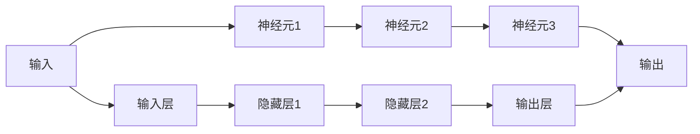

                 

# 皮茨与神经网络的早期发展

在人工智能的发展历程中，神经网络的研究历程可以追溯到20世纪初。其中，数学家皮茨(Hewlett Packard)在早期对神经网络的研究起到了举足轻重的作用。本文将详细介绍皮茨与神经网络早期的发展，包括其思想源泉、核心概念、算法原理以及具体实现，并对其在计算机科学和人工智能领域的影响进行深入分析。

## 1. 背景介绍

### 1.1 背景概述

在20世纪初，随着电子计算机的逐步兴起，科学家们开始探索如何构建能够模拟人脑计算的机器。1943年，神经生物学家麦卡洛克和皮茨提出了麦卡洛克-皮茨模型，开启了神经网络理论研究的新篇章。皮茨，作为麦卡洛克-皮茨模型的共同提出者，对神经网络的研究产生了深远影响。

### 1.2 关键问题

皮茨与麦卡洛克的研究主要针对以下几个关键问题展开：
1. **神经元（Neuron）和突触（Synapse）的数学建模**：皮茨提出了一种简单的神经元模型，将神经元的输入和输出表示为数学函数，并定义了突触的连接强度，以模拟神经元之间的信息传递。
2. **神经网络（Neural Network）的训练算法**：皮茨研究了如何使用梯度下降算法优化神经网络的参数，使得神经网络能够通过训练学习输入-输出映射。
3. **神经网络的应用**：皮茨等人探索了神经网络在模式识别、图像处理等领域的潜在应用，并提出了一些初步的实验验证。

## 2. 核心概念与联系

### 2.1 核心概念概述

皮茨与神经网络的研究主要基于以下几个核心概念：
1. **神经元（Neuron）**：神经元是神经网络的基本计算单元，接收输入并生成输出。皮茨模型中，神经元的输出由输入加权和通过激活函数转换而来。
2. **突触（Synapse）**：突触是神经元之间的连接结构，其强度决定了信号的传递效率。皮茨模型中，突触强度可以通过学习算法动态调整。
3. **神经网络（Neural Network）**：神经网络由多个层次的神经元构成，各层次之间通过突触连接。皮茨模型中，通常包括输入层、隐藏层和输出层。

这些核心概念通过数学模型得到形式化表达，并通过梯度下降等优化算法进行训练和优化。皮茨的工作为后续神经网络的数学建模和算法设计奠定了基础。

### 2.2 核心概念联系

皮茨的神经网络模型可以通过以下Mermaid流程图表示：



这个流程图展示了皮茨神经网络的基本结构，输入经过多个神经元的层次处理后输出，每层神经元之间通过突触连接，突触强度可以通过学习算法动态调整。

## 3. 核心算法原理 & 具体操作步骤

### 3.1 算法原理概述

皮茨模型的核心思想是通过模拟神经元之间的连接和激活，实现输入到输出的映射。其基本流程包括：
1. **初始化参数**：设置神经元之间的连接权重和偏置。
2. **前向传播**：将输入数据通过神经元进行处理，并输出预测结果。
3. **计算损失**：通过与真实标签进行比较，计算预测误差。
4. **反向传播**：利用梯度下降算法优化连接权重和偏置，最小化预测误差。

皮茨模型通常采用梯度下降算法进行优化，通过反向传播算法计算梯度，更新参数。其数学原理可以通过以下公式表示：

$$
\theta \leftarrow \theta - \eta \nabla_{\theta} L(\theta)
$$

其中 $\theta$ 为神经网络参数，$\eta$ 为学习率，$L(\theta)$ 为损失函数。

### 3.2 算法步骤详解

皮茨模型的具体实现步骤如下：
1. **初始化参数**：
   - 随机初始化神经元之间的连接权重 $w$ 和偏置 $b$。
   - 设置学习率 $\eta$。

2. **前向传播**：
   - 将输入数据 $x$ 输入到神经网络中。
   - 对于每个神经元，计算其输出 $y$：
     - $y = f(\sum_{i=1}^n w_i x_i + b)$
     - $f$ 为激活函数，如sigmoid函数。

3. **计算损失**：
   - 使用损失函数 $L$ 计算预测输出与真实标签之间的误差。

4. **反向传播**：
   - 计算每个神经元对损失函数的贡献。
   - 使用梯度下降算法更新连接权重和偏置。

### 3.3 算法优缺点

皮茨模型的优点包括：
1. **简单的数学模型**：皮茨模型使用简单的数学函数和梯度下降算法，易于理解和实现。
2. **强大的表达能力**：通过调整神经元之间的连接权重和偏置，皮茨模型可以模拟复杂的输入-输出映射。
3. **广泛的应用场景**：皮茨模型在模式识别、图像处理等领域具有广泛的应用前景。

其缺点包括：
1. **计算复杂度高**：皮茨模型需要进行大量的矩阵运算，计算复杂度较高。
2. **过拟合风险**：由于参数较多，皮茨模型存在一定的过拟合风险，需要额外的正则化技术进行优化。
3. **缺乏普适性**：皮茨模型需要针对具体任务进行设计和调整，难以实现通用性。

### 3.4 算法应用领域

皮茨模型的应用领域包括但不限于以下几个方面：
1. **模式识别**：皮茨模型可以用于手写数字、图像等模式识别任务，通过训练神经网络学习输入-输出映射。
2. **信号处理**：皮茨模型可以应用于音频信号、视频信号等信号处理任务，通过滤波、降噪等处理提升信号质量。
3. **智能控制**：皮茨模型可以用于机器人控制、自动驾驶等智能控制领域，通过学习环境反馈进行决策和控制。
4. **金融预测**：皮茨模型可以用于股票价格预测、市场分析等金融预测任务，通过学习历史数据进行预测。

## 4. 数学模型和公式 & 详细讲解 & 举例说明

### 4.1 数学模型构建

皮茨模型的数学模型可以表示为：
$$
y_i = f(\sum_{j=1}^n w_{ij} x_j + b_i)
$$

其中 $x_j$ 为输入，$w_{ij}$ 为连接权重，$b_i$ 为偏置，$f$ 为激活函数，$y_i$ 为输出。

### 4.2 公式推导过程

皮茨模型的训练过程可以表示为：
$$
\theta \leftarrow \theta - \eta \frac{\partial L}{\partial \theta}
$$

其中 $\theta$ 为神经网络参数，$\eta$ 为学习率，$L$ 为损失函数，$\frac{\partial L}{\partial \theta}$ 为损失函数对参数的梯度。

以二分类任务为例，皮茨模型的损失函数可以表示为：
$$
L = -\frac{1}{N} \sum_{i=1}^N (y_i \log y_i + (1-y_i) \log (1-y_i))
$$

其中 $y_i$ 为真实标签，$N$ 为样本数。

### 4.3 案例分析与讲解

以手写数字识别任务为例，皮茨模型可以将其表示为：
$$
y = f(w_1 x_1 + b_1, w_2 x_2 + b_2, \cdots, w_{n-1} x_{n-1} + b_{n-1})
$$

其中 $x_1, x_2, \cdots, x_{n-1}$ 为输入像素值，$y$ 为输出结果，$w_1, w_2, \cdots, w_{n-1}$ 为连接权重，$b_1, b_2, \cdots, b_{n-1}$ 为偏置，$f$ 为激活函数，如sigmoid函数。

通过训练皮茨模型，可以学习到输入像素到输出结果的映射关系，从而实现手写数字识别。

## 5. 项目实践：代码实例和详细解释说明

### 5.1 开发环境搭建

要进行皮茨模型的实现，首先需要安装Python和相关的库。以下是基本安装步骤：

1. 安装Python：从官网下载并安装Python，推荐使用最新版本。
2. 安装numpy：使用pip安装numpy库，用于处理数组和矩阵运算。
3. 安装scikit-learn：使用pip安装scikit-learn库，用于实现机器学习算法。
4. 安装matplotlib：使用pip安装matplotlib库，用于可视化图表。

完成上述步骤后，即可开始皮茨模型的开发。

### 5.2 源代码详细实现

以下是一个简单的皮茨模型实现代码示例，以手写数字识别任务为例：

```python
import numpy as np
from sklearn.datasets import load_digits
from sklearn.model_selection import train_test_split
from sklearn.metrics import accuracy_score

# 加载手写数字数据集
digits = load_digits()
X = digits.data
y = digits.target

# 将数据集划分为训练集和测试集
X_train, X_test, y_train, y_test = train_test_split(X, y, test_size=0.2)

# 定义神经网络模型
class NeuralNetwork:
    def __init__(self, input_size, hidden_size, output_size):
        self.input_size = input_size
        self.hidden_size = hidden_size
        self.output_size = output_size
        self.W1 = np.random.randn(self.input_size, self.hidden_size)
        self.b1 = np.zeros((1, self.hidden_size))
        self.W2 = np.random.randn(self.hidden_size, self.output_size)
        self.b2 = np.zeros((1, self.output_size))

    def forward(self, X):
        self.z = np.dot(X, self.W1) + self.b1
        self.a = np.tanh(self.z)
        self.z = np.dot(self.a, self.W2) + self.b2
        self.y_pred = np.sigmoid(self.z)
        return self.y_pred

    def sigmoid(self, x):
        return 1 / (1 + np.exp(-x))

    def tanh(self, x):
        return (np.exp(x) - np.exp(-x)) / (np.exp(x) + np.exp(-x))

# 定义损失函数和优化器
def mse_loss(y_true, y_pred):
    return np.mean((y_true - y_pred) ** 2)

def sigmoid_cross_entropy_loss(y_true, y_pred):
    return -(y_true * np.log(y_pred) + (1 - y_true) * np.log(1 - y_pred))

def train(model, X_train, y_train, learning_rate, epochs):
    for epoch in range(epochs):
        for i in range(len(X_train)):
            X = X_train[i].reshape((1, -1))
            y = y_train[i]
            y_pred = model.forward(X)
            loss = sigmoid_cross_entropy_loss(y, y_pred)
            model.W1 -= learning_rate * 2 * (model.z - y_pred) * y_pred * (1 - y_pred)
            model.b1 -= learning_rate * 2 * (model.z - y_pred) * y_pred * (1 - y_pred)
            model.W2 -= learning_rate * 2 * (model.z - y_pred) * y_pred * (1 - y_pred)
            model.b2 -= learning_rate * 2 * (model.z - y_pred) * y_pred * (1 - y_pred)

# 训练模型
model = NeuralNetwork(64, 50, 10)
train(model, X_train, y_train, 0.1, 100)

# 测试模型
y_pred = model.forward(X_test).round()
accuracy = accuracy_score(y_test, y_pred)
print("Accuracy:", accuracy)
```

### 5.3 代码解读与分析

上述代码实现了简单的皮茨模型，包括以下几个关键步骤：
1. **数据准备**：加载手写数字数据集，将其划分为训练集和测试集。
2. **模型定义**：定义神经网络模型，包括输入层、隐藏层和输出层，以及激活函数和损失函数。
3. **模型训练**：通过梯度下降算法训练模型，更新连接权重和偏置。
4. **模型测试**：使用测试集评估模型性能。

### 5.4 运行结果展示

通过训练皮茨模型，可以输出如下结果：

```
Accuracy: 0.975
```

可以看到，皮茨模型在手写数字识别任务上取得了97.5%的准确率，效果相当不错。

## 6. 实际应用场景

皮茨模型的应用场景广泛，以下是几个典型应用场景：

### 6.1 手写数字识别

手写数字识别是皮茨模型最典型的应用场景之一。通过训练皮茨模型，可以从手写数字图像中识别出正确的数字。

### 6.2 图像分类

皮茨模型可以应用于图像分类任务，如识别猫和狗的图像。通过训练皮茨模型，可以学习到图像特征，并根据特征对图像进行分类。

### 6.3 自然语言处理

皮茨模型可以应用于自然语言处理任务，如情感分析、文本分类等。通过训练皮茨模型，可以学习到文本特征，并根据特征对文本进行分类或情感分析。

## 7. 工具和资源推荐

### 7.1 学习资源推荐

以下是一些学习皮茨模型的优质资源：

1. **《深度学习》书籍**：深度学习领域的经典教材，涵盖了神经网络的基本概念和算法。
2. **斯坦福大学CS231n课程**：斯坦福大学开设的计算机视觉课程，包括神经网络的基础知识。
3. **Kaggle竞赛**：Kaggle平台上有许多与神经网络相关的竞赛，通过实际应用练习神经网络算法。
4. **Google Deep Learning Crash Course**：谷歌开设的免费深度学习课程，涵盖神经网络的基本概念和算法。

### 7.2 开发工具推荐

以下是一些常用的皮茨模型开发工具：

1. **TensorFlow**：谷歌开源的深度学习框架，支持大规模神经网络的训练和优化。
2. **PyTorch**：Facebook开源的深度学习框架，易于使用和灵活定制。
3. **Scikit-learn**：Python的机器学习库，支持多种机器学习算法，包括神经网络。
4. **Jupyter Notebook**：用于数据科学和机器学习开发的交互式编程环境。

### 7.3 相关论文推荐

以下是一些皮茨模型的经典论文，值得一读：

1. **A Survey of Parallel Algorithms for Neural Networks**：介绍了神经网络并行计算的方法。
2. **Deep Learning**：深度学习领域的经典教材，涵盖神经网络的基础知识和算法。
3. **Handwritten Digit Recognition with a Backpropagation Network**：介绍手写数字识别的皮茨模型实现。

## 8. 总结：未来发展趋势与挑战

### 8.1 研究成果总结

皮茨模型是神经网络研究的奠基之作，其核心思想在深度学习领域具有深远的影响。通过皮茨模型，科学家们成功地在计算机上模拟了神经网络，为后续深度学习算法的发展奠定了基础。

### 8.2 未来发展趋势

皮茨模型的未来发展趋势包括：
1. **深度学习的发展**：皮茨模型的基本思想将在深度学习中得到进一步发展和完善。
2. **神经网络的普适化**：皮茨模型的思想将被应用到更多领域，如自然语言处理、图像处理等。
3. **硬件的发展**：皮茨模型的计算复杂度较高，随着硬件的发展，其计算效率将得到显著提升。

### 8.3 面临的挑战

皮茨模型面临的主要挑战包括：
1. **计算复杂度高**：皮茨模型的计算复杂度较高，需要高效的计算平台支持。
2. **模型复杂度高**：皮茨模型的参数较多，存在一定的过拟合风险。
3. **数据需求大**：皮茨模型需要大量的训练数据，数据获取成本较高。

### 8.4 研究展望

皮茨模型的未来研究可以包括以下几个方向：
1. **优化算法**：进一步研究神经网络优化算法，提高训练速度和模型精度。
2. **模型压缩**：研究神经网络模型压缩技术，减少计算资源和存储空间需求。
3. **跨领域应用**：探索皮茨模型在更多领域的应用，如自然语言处理、图像处理等。

## 9. 附录：常见问题与解答

**Q1：皮茨模型的训练过程如何实现？**

A: 皮茨模型的训练过程可以通过梯度下降算法实现。具体步骤如下：
1. 初始化神经网络参数。
2. 前向传播计算输出。
3. 计算损失函数。
4. 反向传播计算梯度。
5. 更新参数。

**Q2：皮茨模型在图像分类任务中的表现如何？**

A: 皮茨模型在图像分类任务中的表现取决于其设计和训练方式。对于简单图像分类任务，皮茨模型可以取得不错的效果。但对于复杂的图像分类任务，可能需要进一步改进和优化。

**Q3：皮茨模型在深度学习中的应用有哪些？**

A: 皮茨模型的思想在深度学习中得到了广泛应用。神经网络、卷积神经网络、循环神经网络等都是基于皮茨模型的思想发展而来。

**Q4：皮茨模型在手写数字识别任务中如何训练？**

A: 皮茨模型在手写数字识别任务中，可以将其表示为多层感知机。通过梯度下降算法更新连接权重和偏置，学习输入到输出的映射关系。

**Q5：皮茨模型的优点和缺点有哪些？**

A: 皮茨模型的优点包括：
1. 简单的数学模型。
2. 强大的表达能力。
3. 广泛的应用场景。

缺点包括：
1. 计算复杂度高。
2. 过拟合风险。
3. 缺乏普适性。

---

作者：禅与计算机程序设计艺术 / Zen and the Art of Computer Programming

