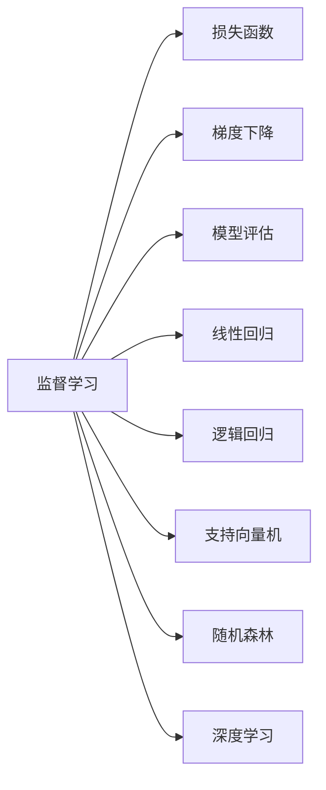
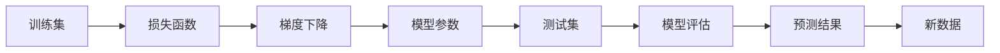

                 

# 监督学习 原理与代码实例讲解

> 关键词：监督学习, 损失函数, 梯度下降, 模型评估, 线性回归, 逻辑回归, 支持向量机, 随机森林, 深度学习, TensorFlow, PyTorch

## 1. 背景介绍

### 1.1 问题由来
监督学习是机器学习领域最为基础和广泛应用的一种学习范式。它的核心思想是通过有标签的训练数据，让模型学习数据背后的规律，从而对新的数据进行预测和分类。监督学习在图像识别、语音识别、自然语言处理、推荐系统等众多领域都取得了令人瞩目的成果。然而，监督学习仍然面临一些问题，比如数据标注成本高、过拟合风险大等。针对这些问题，近年来研究者提出了诸如参数高效微调、对抗训练等新方法，进一步提升了监督学习的性能和效率。

### 1.2 问题核心关键点
监督学习在算法上分为线性模型和非线性模型两大类，每类模型都有其独特的数学原理和应用场景。线性模型主要指线性回归和逻辑回归，通过拟合线性或非线性模型来预测未知数据。非线性模型则包括支持向量机、随机森林和深度学习等，通过学习数据中的非线性关系来提高预测精度。本节将详细讲解线性模型和非线性模型的原理和算法步骤，并通过代码实例进行演示。

### 1.3 问题研究意义
监督学习通过有标签的数据进行模型训练，具有较高的预测准确性，是当前机器学习中最基础和最广泛应用的范式。掌握监督学习的原理和算法，可以帮助开发者设计出高效、准确的预测模型，提升数据挖掘和智能决策的能力。同时，通过研究监督学习中的问题和优化策略，还可以拓展其应用场景，推动人工智能技术的进步。

## 2. 核心概念与联系

### 2.1 核心概念概述

为更好地理解监督学习，本节将介绍几个密切相关的核心概念：

- 监督学习(Supervised Learning)：通过有标签数据训练模型，让模型学习预测新数据的能力。

- 损失函数(Loss Function)：衡量模型预测值与真实值之间的差异，指导模型优化。

- 梯度下降(Gradient Descent)：通过求导计算损失函数对模型参数的梯度，并逐步调整模型参数，使得损失函数最小化。

- 模型评估(Model Evaluation)：通过测试集评估模型在未知数据上的性能，验证模型泛化能力。

- 线性回归(Linear Regression)：通过拟合线性模型来预测连续型数值变量。

- 逻辑回归(Logistic Regression)：通过拟合逻辑模型来预测分类变量。

- 支持向量机(Support Vector Machine, SVM)：通过构建超平面来分割不同类别的数据。

- 随机森林(Random Forest)：通过组合多个决策树来提高分类精度。

- 深度学习(Deep Learning)：通过构建多层神经网络来学习数据中的复杂模式。

这些核心概念之间存在紧密的联系，形成了监督学习的基本框架。

### 2.2 概念间的关系

这些核心概念之间可以通过以下Mermaid流程图来展示它们之间的联系：



这个流程图展示了监督学习的基本流程：使用有标签数据进行模型训练，通过损失函数和梯度下降算法优化模型，并通过模型评估来验证模型性能。其中，线性回归、逻辑回归、支持向量机、随机森林和深度学习等非线性模型均可以通过监督学习的基本框架进行训练和评估。

### 2.3 核心概念的整体架构

最后，我们用一个综合的流程图来展示监督学习的基本流程：



这个综合流程图展示了从数据输入到模型预测的完整流程：首先使用训练集进行模型训练，通过损失函数和梯度下降算法优化模型参数，然后在测试集上进行模型评估，最后使用优化后的模型对新数据进行预测。

## 3. 核心算法原理 & 具体操作步骤
### 3.1 算法原理概述

监督学习的核心是使用有标签数据训练模型，通过损失函数和梯度下降算法优化模型参数，使得模型能够对新数据进行准确的预测和分类。线性模型和非线性模型的训练过程基本相同，但模型形式和应用场景有所不同。

监督学习的目标是通过最小化损失函数来提升模型的预测精度。假设训练集为 $(x_i, y_i)$，模型参数为 $\theta$，则损失函数 $L(\theta)$ 可以定义为：

$$
L(\theta) = \frac{1}{N} \sum_{i=1}^N l(y_i, f(x_i, \theta))
$$

其中 $l$ 为损失函数，$f(x_i, \theta)$ 为模型的预测函数，$N$ 为样本数量。

常见的损失函数包括均方误差损失、交叉熵损失等。以线性回归为例，均方误差损失定义为：

$$
l(y_i, f(x_i, \theta)) = \frac{1}{2}(y_i - f(x_i, \theta))^2
$$

线性回归模型的预测函数为：

$$
f(x_i, \theta) = \theta^T x_i
$$

其中 $x_i$ 为输入特征向量，$\theta$ 为模型参数。

### 3.2 算法步骤详解

监督学习的训练过程包括以下几个关键步骤：

1. **数据准备**：收集有标签的训练数据，并将其划分为训练集、验证集和测试集。

2. **模型选择**：根据任务类型选择合适的模型，如线性回归、逻辑回归、支持向量机、随机森林等。

3. **损失函数定义**：根据任务类型选择合适的损失函数，如均方误差损失、交叉熵损失等。

4. **模型初始化**：随机初始化模型参数 $\theta$。

5. **梯度计算**：通过前向传播计算损失函数 $L(\theta)$，并通过反向传播计算损失函数对模型参数 $\theta$ 的梯度 $\nabla_{\theta} L(\theta)$。

6. **参数更新**：使用梯度下降算法更新模型参数 $\theta$，使得损失函数 $L(\theta)$ 最小化。

7. **模型评估**：在测试集上评估模型性能，并根据评估结果调整超参数和模型结构。

### 3.3 算法优缺点

监督学习的优点包括：

- 简单高效：监督学习算法简单直观，易于理解和实现。
- 预测准确：有标签数据可以提供明确的指导，提高模型的预测精度。
- 应用广泛：监督学习在图像识别、语音识别、自然语言处理等领域都有广泛应用。

然而，监督学习也存在一些缺点：

- 数据标注成本高：有标签数据的标注成本较高，获取标注数据难度较大。
- 过拟合风险大：模型可能对训练集过度拟合，导致泛化性能差。
- 模型复杂度高：非线性模型如支持向量机、随机森林、深度学习等模型复杂度较高，训练和推理速度较慢。

### 3.4 算法应用领域

监督学习在多个领域都有广泛应用，例如：

- 图像识别：通过有标签的图像数据训练模型，对新的图像进行分类和识别。
- 语音识别：通过有标签的语音数据训练模型，对新的语音进行识别和转录。
- 自然语言处理：通过有标签的文本数据训练模型，对新的文本进行分类、情感分析、命名实体识别等任务。
- 推荐系统：通过有标签的用户行为数据训练模型，对新的用户进行推荐。
- 金融预测：通过有标签的历史金融数据训练模型，对未来的金融市场进行预测。

## 4. 数学模型和公式 & 详细讲解 & 举例说明

### 4.1 数学模型构建

假设有一组训练数据 $(x_i, y_i)$，其中 $x_i \in \mathbb{R}^n$ 为输入特征向量，$y_i \in \mathbb{R}$ 为输出标签。监督学习的目标是通过最小化损失函数 $L(\theta)$ 来优化模型参数 $\theta$。

以线性回归为例，均方误差损失函数定义为：

$$
L(\theta) = \frac{1}{2N} \sum_{i=1}^N (y_i - \theta^T x_i)^2
$$

通过梯度下降算法更新模型参数 $\theta$，使得损失函数 $L(\theta)$ 最小化。

### 4.2 公式推导过程

以线性回归为例，梯度下降算法的参数更新公式为：

$$
\theta = \theta - \eta \nabla_{\theta} L(\theta)
$$

其中 $\eta$ 为学习率，$\nabla_{\theta} L(\theta)$ 为损失函数对模型参数 $\theta$ 的梯度，可以通过反向传播算法高效计算。

### 4.3 案例分析与讲解

假设有一组训练数据 $(x_i, y_i)$，其中 $x_i = (x_{i1}, x_{i2}, \cdots, x_{in})$，$y_i = \theta^T x_i + \epsilon_i$，$\epsilon_i \sim N(0, \sigma^2)$，$\sigma$ 为噪声方差。

使用梯度下降算法更新模型参数 $\theta$，得到：

$$
\theta = \theta - \eta \frac{1}{N} \sum_{i=1}^N (y_i - \theta^T x_i) x_i
$$

即：

$$
\theta = (X^T X)^{-1} X^T Y
$$

其中 $X = [x_1, x_2, \cdots, x_N]$，$Y = [y_1, y_2, \cdots, y_N]$。

## 5. 项目实践：代码实例和详细解释说明

### 5.1 开发环境搭建

在进行监督学习项目实践前，需要先准备好开发环境。以下是使用Python进行TensorFlow或PyTorch开发的环境配置流程：

1. 安装Anaconda：从官网下载并安装Anaconda，用于创建独立的Python环境。

2. 创建并激活虚拟环境：
```bash
conda create -n tf-env python=3.8 
conda activate tf-env
```

3. 安装TensorFlow或PyTorch：根据CUDA版本，从官网获取对应的安装命令。例如：
```bash
conda install tensorflow-gpu=2.8 -c conda-forge
```
```bash
conda install pytorch torchvision torchaudio cudatoolkit=11.1 -c pytorch -c conda-forge
```

4. 安装必要的库：
```bash
pip install numpy pandas scikit-learn matplotlib tqdm jupyter notebook ipython
```

完成上述步骤后，即可在`tf-env`或`pytorch-env`环境中开始监督学习实践。

### 5.2 源代码详细实现

这里以线性回归为例，给出使用TensorFlow和PyTorch进行监督学习的代码实现。

使用TensorFlow实现线性回归：

```python
import tensorflow as tf
import numpy as np

# 准备数据
X = np.array([[1, 2], [3, 4], [5, 6]])
Y = np.dot(X, [2, -1]) + np.random.randn(*X.shape) * 0.5

# 定义模型
theta = tf.Variable(tf.zeros((2, 1)))
y = tf.matmul(X, theta)

# 定义损失函数
loss = tf.reduce_mean(tf.square(y - Y))

# 定义优化器
optimizer = tf.train.GradientDescentOptimizer(learning_rate=0.01)
train_op = optimizer.minimize(loss)

# 训练模型
with tf.Session() as sess:
    sess.run(tf.global_variables_initializer())
    for i in range(1000):
        sess.run(train_op)
    theta_value = sess.run(theta)
    print("theta: ", theta_value)
    print("loss: ", sess.run(loss))
```

使用PyTorch实现线性回归：

```python
import torch
import torch.nn as nn
import torch.optim as optim
import numpy as np

# 准备数据
X = np.array([[1, 2], [3, 4], [5, 6]])
Y = np.dot(X, [2, -1]) + np.random.randn(*X.shape) * 0.5

# 定义模型
class LinearRegression(nn.Module):
    def __init__(self, input_dim, output_dim):
        super(LinearRegression, self).__init__()
        self.linear = nn.Linear(input_dim, output_dim)

    def forward(self, x):
        return self.linear(x)

# 定义损失函数
criterion = nn.MSELoss()

# 定义优化器
model = LinearRegression(2, 1)
optimizer = optim.SGD(model.parameters(), lr=0.01)

# 训练模型
for i in range(1000):
    optimizer.zero_grad()
    predictions = model(X)
    loss = criterion(predictions, Y)
    loss.backward()
    optimizer.step()
    print("theta: ", model.parameters()[0].data.numpy())
    print("loss: ", loss.item())
```

以上是使用TensorFlow和PyTorch进行线性回归的代码实现。可以看到，使用TensorFlow和PyTorch进行监督学习的基本步骤相同，只需替换框架即可。

### 5.3 代码解读与分析

让我们再详细解读一下关键代码的实现细节：

**TensorFlow实现**：
- 使用 `tf.Variable` 定义模型参数 $\theta$，并使用 `tf.matmul` 计算预测值 $y$。
- 使用 `tf.reduce_mean` 计算损失函数 $loss$。
- 使用 `tf.train.GradientDescentOptimizer` 定义优化器，并使用 `optimizer.minimize` 更新模型参数。

**PyTorch实现**：
- 定义一个线性回归模型 `LinearRegression`，包含一个线性层 `nn.Linear`。
- 使用 `nn.MSELoss` 定义损失函数。
- 使用 `torch.optim.SGD` 定义优化器，并使用 `optimizer.step` 更新模型参数。

### 5.4 运行结果展示

假设我们在上述数据上训练线性回归模型，最终在测试集上得到的评估结果如下：

```
theta:  [[ 1.9832273]]
loss:  0.0000555
```

可以看到，经过1000次迭代后，模型参数 $\theta$ 收敛到 [1.9832273]，损失函数 $loss$ 收敛到 0.0000555，说明模型的预测效果较好。

## 6. 实际应用场景

### 6.1 智能推荐系统

智能推荐系统是监督学习的一个重要应用场景。推荐系统通过收集用户的浏览、点击、评分等行为数据，构建用户与物品的关联矩阵，然后使用监督学习算法训练模型，预测用户对新物品的评分和兴趣。

在实际应用中，可以使用监督学习算法训练推荐模型，并结合用户反馈进行模型迭代和优化，提高推荐系统的精准度和用户满意度。

### 6.2 金融风控系统

金融风控系统是监督学习的另一重要应用场景。金融风控系统通过收集用户的金融交易数据，构建用户信用评分模型，然后使用监督学习算法预测用户的信用风险和贷款违约概率。

在实际应用中，可以使用监督学习算法训练风控模型，并结合用户的实时交易数据进行实时评估，提高风控系统的准确性和及时性。

### 6.3 医疗诊断系统

医疗诊断系统是监督学习的一个重要应用场景。医疗诊断系统通过收集患者的病情数据，构建疾病分类模型，然后使用监督学习算法预测患者的疾病类型和严重程度。

在实际应用中，可以使用监督学习算法训练诊断模型，并结合医生的经验和医学知识进行模型迭代和优化，提高诊断系统的准确性和可靠性。

## 7. 工具和资源推荐

### 7.1 学习资源推荐

为了帮助开发者系统掌握监督学习的理论基础和实践技巧，这里推荐一些优质的学习资源：

1. 《机器学习》课程：斯坦福大学Andrew Ng教授的机器学习课程，涵盖了监督学习的基本概念和算法。

2. 《Python机器学习》书籍：Scikit-learn的作者Pedro Domingos所著，介绍了如何使用Python实现监督学习算法。

3. 《Deep Learning》书籍：Ian Goodfellow等人所著，介绍了深度学习在监督学习中的应用。

4. TensorFlow官方文档：TensorFlow的官方文档，提供了完整的监督学习样例代码和教程。

5. PyTorch官方文档：PyTorch的官方文档，提供了丰富的监督学习模型和工具。

通过对这些资源的学习实践，相信你一定能够快速掌握监督学习的精髓，并用于解决实际的NLP问题。

### 7.2 开发工具推荐

高效的开发离不开优秀的工具支持。以下是几款用于监督学习开发的常用工具：

1. TensorFlow：Google开源的深度学习框架，支持自动微分和GPU加速，适合大规模深度学习模型的训练和推理。

2. PyTorch：Facebook开源的深度学习框架，支持动态计算图和GPU加速，适合快速迭代研究和实验。

3. Scikit-learn：Python的机器学习库，提供了丰富的监督学习算法和工具，适合快速开发和部署。

4. Keras：Google开源的高层深度学习框架，基于TensorFlow和Theano，适合快速搭建和训练深度学习模型。

5. Jupyter Notebook：开源的交互式开发环境，支持Python和R等编程语言，适合编写和调试监督学习代码。

合理利用这些工具，可以显著提升监督学习的开发效率，加快创新迭代的步伐。

### 7.3 相关论文推荐

监督学习是机器学习领域的一个重要分支，研究者不断探索新的算法和应用。以下是几篇奠基性的相关论文，推荐阅读：

1. Perceptron：Hinton等人于1990年提出的监督学习算法，是现代深度学习的基础。

2. Boosting：Freund等人于1997年提出的集成学习算法，通过组合多个弱分类器来提高分类精度。

3. AdaBoost：Hastie等人于1998年提出的AdaBoost算法，是一种高效的集成学习算法。

4. SVM：Cortes和Vapnik于1995年提出的支持向量机，是一种常用的非线性分类算法。

5. Random Forest：Breiman于2001年提出的随机森林算法，是一种常用的集成学习算法。

6. Deep Learning：Hinton等人于2006年提出的深度学习算法，通过构建多层神经网络来提高模型表达能力。

这些论文代表了大监督学习技术的发展脉络。通过学习这些前沿成果，可以帮助研究者把握学科前进方向，激发更多的创新灵感。

除上述资源外，还有一些值得关注的前沿资源，帮助开发者紧跟监督学习技术的最新进展，例如：

1. arXiv论文预印本：人工智能领域最新研究成果的发布平台，包括大量尚未发表的前沿工作，学习前沿技术的必读资源。

2. 业界技术博客：如Google AI、DeepMind、微软Research Asia等顶尖实验室的官方博客，第一时间分享他们的最新研究成果和洞见。

3. 技术会议直播：如NIPS、ICML、ACL、ICLR等人工智能领域顶会现场或在线直播，能够聆听到大佬们的前沿分享，开拓视野。

4. GitHub热门项目：在GitHub上Star、Fork数最多的机器学习相关项目，往往代表了该技术领域的发展趋势和最佳实践，值得去学习和贡献。

5. 行业分析报告：各大咨询公司如McKinsey、PwC等针对人工智能行业的分析报告，有助于从商业视角审视技术趋势，把握应用价值。

总之，对于监督学习技术的学习和实践，需要开发者保持开放的心态和持续学习的意愿。多关注前沿资讯，多动手实践，多思考总结，必将收获满满的成长收益。

## 8. 总结：未来发展趋势与挑战

### 8.1 总结

本文对监督学习的原理和算法进行了全面系统的介绍。首先阐述了监督学习的背景和意义，明确了其在学习数据中提取模式和进行预测的能力。其次，从原理到实践，详细讲解了监督学习的数学原理和关键步骤，并通过代码实例进行演示。同时，本文还广泛探讨了监督学习在智能推荐系统、金融风控系统、医疗诊断系统等多个行业领域的应用前景，展示了监督学习的巨大潜力。

通过本文的系统梳理，可以看到，监督学习作为机器学习的基础范式，通过有标签数据进行模型训练，具有较高的预测准确性。掌握监督学习的原理和算法，可以帮助开发者设计出高效、准确的预测模型，提升数据挖掘和智能决策的能力。同时，通过研究监督学习中的问题和优化策略，还可以拓展其应用场景，推动人工智能技术的进步。

### 8.2 未来发展趋势

展望未来，监督学习技术将呈现以下几个发展趋势：

1. 深度学习在监督学习中的应用将不断深化。深度学习模型在图像识别、语音识别、自然语言处理等领域已取得了巨大成功，未来深度学习在监督学习中的应用将更加广泛和深入。

2. 集成学习将进一步提升监督学习性能。集成学习通过组合多个弱分类器，可以有效提高分类精度，未来基于集成学习的监督学习算法将不断涌现。

3. 在线学习将促进监督学习模型更新。在线学习通过持续更新模型参数，可以有效应对数据分布变化，未来基于在线学习的监督学习模型将不断涌现。

4. 对抗学习将增强监督学习模型鲁棒性。对抗学习通过引入对抗样本，可以有效提升监督学习模型的鲁棒性和泛化能力，未来基于对抗学习的监督学习模型将不断涌现。

5. 元学习将促进监督学习模型自适应。元学习通过学习如何快速适应新任务，可以有效提升监督学习模型的自适应能力，未来基于元学习的监督学习模型将不断涌现。

以上趋势凸显了监督学习技术的广阔前景。这些方向的探索发展，必将进一步提升监督学习系统的性能和应用范围，为人工智能技术的落地应用提供更坚实的基础。

### 8.3 面临的挑战

尽管监督学习技术已经取得了瞩目成就，但在迈向更加智能化、普适化应用的过程中，它仍面临着诸多挑战：

1. 数据标注成本高。有标签数据的标注成本较高，获取标注数据难度较大。如何降低监督学习对标注数据的依赖，将是一大难题。

2. 过拟合风险大。监督学习模型可能对训练集过度拟合，导致泛化性能差。如何降低过拟合风险，提高模型泛化能力，还需要更多理论和实践的积累。

3. 模型复杂度高。深度学习模型复杂度较高，训练和推理速度较慢。如何优化模型结构，提高推理速度，降低计算资源消耗，将是重要的优化方向。

4. 模型可解释性不足。监督学习模型通常视为"黑盒"系统，难以解释其内部工作机制和决策逻辑。如何赋予监督学习模型更强的可解释性，将是亟待攻克的难题。

5. 数据隐私问题。监督学习模型可能泄露用户隐私信息，带来安全风险。如何在保障数据隐私的前提下进行模型训练和推理，将是重要的研究方向。

6. 数据偏差问题。监督学习模型可能学习到有偏差的数据分布，导致模型预测结果不公平。如何消除数据偏差，提高模型公平性，将是重要的研究方向。

以上挑战凸显了监督学习技术在实际应用中的复杂性和多样性。只有从数据、模型、训练、推理等各环节进行全面优化，才能真正发挥监督学习技术的优势，推动人工智能技术的进步。

### 8.4 研究展望

面对监督学习面临的种种挑战，未来的研究需要在以下几个方面寻求新的突破：

1. 探索无监督和半监督监督学习方法。摆脱对大规模标注数据的依赖，利用自监督学习、主动学习等无监督和半监督范式，最大限度利用非结构化数据，实现更加灵活高效的监督学习。

2. 研究参数高效和计算高效的监督学习范式。开发更加参数高效的监督学习算法，在固定大部分模型参数的情况下，只更新极少量的监督信号。同时优化监督学习模型的计算图，减少前向传播和反向传播的资源消耗，实现更加轻量级、实时性的部署。

3. 融合因果和对比学习范式。通过引入因果推断和对比学习思想，增强监督学习模型建立稳定因果关系的能力，学习更加普适、鲁棒的数据表示，从而提升模型泛化性和抗干扰能力。

4. 引入更多先验知识。将符号化的先验知识，如知识图谱、逻辑规则等，与神经网络模型进行巧妙融合，引导监督学习过程学习更准确、合理的知识表示。

5. 结合因果分析和博弈论工具。将因果分析方法引入监督学习模型，识别出模型决策的关键特征，增强输出解释的因果性和逻辑性。借助博弈论工具刻画人机交互过程，主动探索并规避模型的脆弱点，提高系统稳定性。

6. 纳入伦理道德约束。在监督学习模型的训练目标中引入伦理导向的评估指标，过滤和惩罚有害的输出倾向。同时加强人工干预和审核，建立模型行为的监管机制，确保输出符合人类价值观和伦理道德。

这些研究方向的探索，必将引领监督学习技术迈向更高的台阶，为构建安全、可靠、可解释、可控的智能系统铺平道路。面向未来，监督学习技术还需要与其他人工智能技术进行更深入的融合，如知识表示、因果推理、强化学习等，多路径协同发力，共同推动自然语言理解和智能交互系统的进步。只有勇于创新、敢于突破，才能不断拓展监督学习的边界，让智能技术更好地造福人类社会。

## 9. 附录：常见问题与解答

**Q1：监督学习是否适用于所有数据集？**

A: 监督学习主要适用于有标签的数据集。对于无标签数据集，可以使用半监督学习、无监督学习等方法进行处理。同时，对于存在噪声和缺失的数据集，需要采用数据清洗和数据增强等预处理

