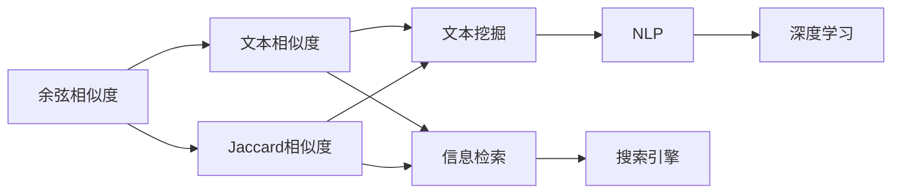
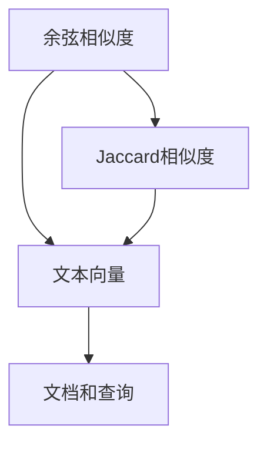
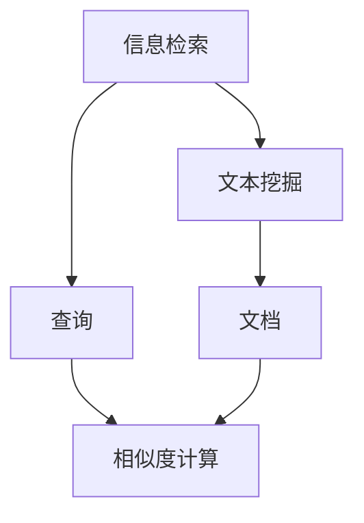
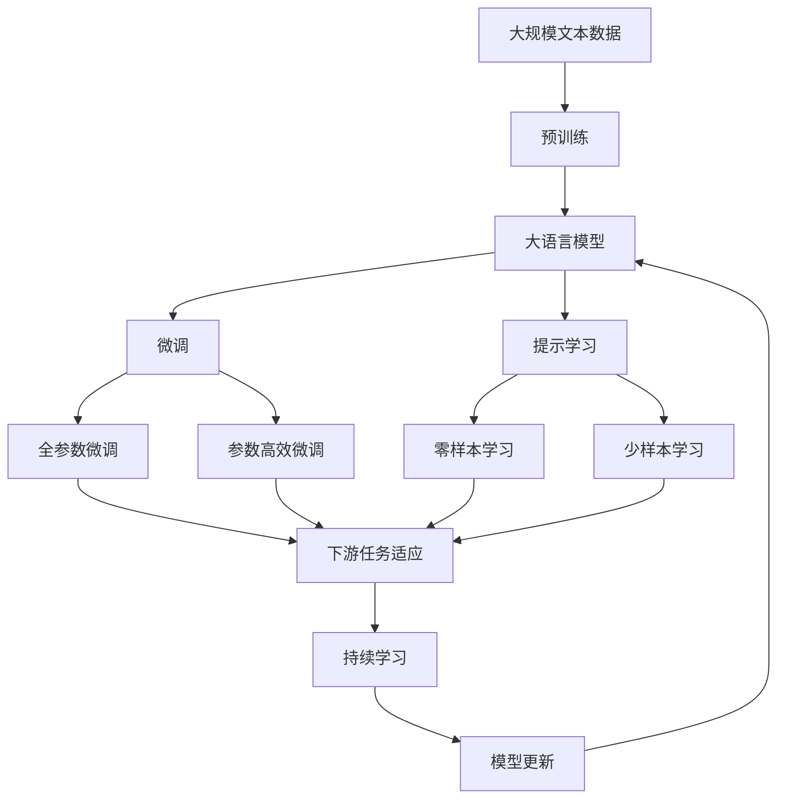

                 

# 相关性评分 原理与代码实例讲解

> 关键词：相关性评分,信息检索,文本挖掘,搜索引擎,自然语言处理(NLP)

## 1. 背景介绍

### 1.1 问题由来
在信息爆炸的时代，如何有效地在大量文本数据中检索到用户需要的信息，是一个至关重要的问题。传统的关键词匹配方式存在一定的局限性，无法很好地捕捉到文本间的隐含关系和上下文信息。为了解决这一问题，信息检索领域逐渐引入并发展了文本相似度计算和文本相关性评分技术。这些技术通过计算文档和查询之间的相似度或相关性，帮助用户快速找到最相关的信息。

近年来，随着深度学习技术在自然语言处理(NLP)领域的发展，相关性评分方法也逐渐由基于统计和传统的向量空间模型转向基于深度学习的模型。深度学习技术通过学习大规模数据集的隐含模式，能够更好地捕捉语言的内在结构和语义关系，从而提高检索和评分的效果。

### 1.2 问题核心关键点
相关性评分技术的核心在于如何准确计算文档与查询之间的相似度或相关性，并根据评分结果对搜索结果进行排序。常见的相关性评分方法包括余弦相似度、Jaccard相似度、DMID相关性评分、ESIM、BERT等深度学习模型。其中，余弦相似度和Jaccard相似度是经典的统计方法，而DMID、ESIM、BERT等则是近年来出现的深度学习模型。

DMID（Dual-Maximal Information Dualism）算法是一种基于最大信息双重要求的深度学习相关性评分方法，通过引入跨层特征对齐和信息极性感知机制，能够更好地捕捉文档和查询之间的语义关系。ESIM（Expected Spearman's Rank Correlation）算法则是一种基于排序模型的相关性评分方法，通过学习文档和查询之间的排名关系，进一步提升评分效果。BERT（Bidirectional Encoder Representations from Transformers）模型则是一种预训练语言模型，通过在大规模无标签文本数据上进行预训练，能够学习到丰富的语言知识和上下文信息，从而在相关性评分任务上取得优异的表现。

### 1.3 问题研究意义
相关性评分技术对于提高搜索引擎的精准度和用户体验具有重要意义：

1. **精准度提升**：相关性评分能够更好地捕捉文档和查询之间的语义关系，提高检索结果的准确性，减少误查和漏查。
2. **用户体验优化**：通过提升检索结果的相关性评分，用户可以更快地找到所需信息，从而提高搜索效率和满意度。
3. **应用广泛**：相关性评分技术不仅适用于搜索引擎，还被广泛应用于文本挖掘、推荐系统、信息过滤等领域。
4. **技术创新**：相关性评分技术的演进促进了对NLP技术的深入研究，推动了信息检索和推荐技术的发展。
5. **产业升级**：相关性评分技术在技术领域的突破，有助于推动搜索引擎和信息检索系统的智能化和自动化，加速产业升级。

## 2. 核心概念与联系

### 2.1 核心概念概述

为更好地理解相关性评分技术的原理和应用，本节将介绍几个密切相关的核心概念：

- **余弦相似度（Cosine Similarity）**：一种常见的文本相似度计算方法，通过计算两个文本向量的余弦值来衡量它们之间的相似程度。
- **Jaccard相似度（Jaccard Index）**：另一种常用的文本相似度计算方法，通过计算两个文本向量交集的大小与并集大小的比值来衡量它们之间的相似程度。
- **信息检索（Information Retrieval）**：通过自动化的方式，从大量文本数据中检索出与用户查询相关的信息。
- **文本挖掘（Text Mining）**：从文本数据中提取有价值的信息和知识，涵盖文本分类、聚类、情感分析、主题建模等任务。
- **自然语言处理（Natural Language Processing）**：研究如何使计算机理解、处理和生成人类语言的技术，包括语言模型、语义分析、语法分析等。
- **深度学习（Deep Learning）**：一种基于多层神经网络的人工智能技术，通过学习数据的高层抽象特征，可以解决复杂的模式识别和分类问题。

这些核心概念之间的逻辑关系可以通过以下Mermaid流程图来展示：



这个流程图展示了几类文本相似度计算方法以及它们在信息检索和文本挖掘中的应用关系。余弦相似度和Jaccard相似度是经典统计方法，可以用于文本检索和文本挖掘中的文本相似度计算。信息检索和文本挖掘则涵盖了将文本数据转化为知识的过程。而自然语言处理是信息检索和文本挖掘的基础技术。深度学习通过学习大规模数据集的隐含模式，进一步提升了文本处理和信息检索的效果。搜索引擎则是信息检索技术的应用场景之一。

### 2.2 概念间的关系

这些核心概念之间存在着紧密的联系，形成了文本相似度计算和信息检索的完整生态系统。下面我们通过几个Mermaid流程图来展示这些概念之间的关系。

#### 2.2.1 余弦相似度和Jaccard相似度的关系



这个流程图展示了余弦相似度和Jaccard相似度的计算方法及其在文本检索中的应用。两者都是通过将文档和查询转化为向量，然后计算向量之间的相似度来衡量它们的相关性。

#### 2.2.2 深度学习在信息检索中的应用


这个流程图展示了深度学习在信息检索中的应用，通过学习文本的隐含模式，生成更加精准的文本表示，用于文档和查询的相似度计算。

#### 2.2.3 信息检索和文本挖掘的联系



这个流程图展示了信息检索和文本挖掘的联系。信息检索通过相似度计算获取与查询相关的文档，而文本挖掘则通过挖掘这些文档的内容，提取有用的信息和知识。

### 2.3 核心概念的整体架构

最后，我们用一个综合的流程图来展示这些核心概念在大语言模型微调过程中的整体架构：



这个综合流程图展示了从预训练到微调，再到持续学习的完整过程。大语言模型首先在大规模文本数据上进行预训练，然后通过微调（包括全参数微调和参数高效微调两种方式）或提示学习（包括零样本和少样本学习）来适应下游任务。最后，通过持续学习技术，模型可以不断更新和适应新的任务和数据。

## 3. 核心算法原理 & 具体操作步骤
### 3.1 算法原理概述

相关性评分技术本质上是通过计算文档和查询之间的相似度或相关性，衡量它们之间的相关程度。常见的方法包括余弦相似度、Jaccard相似度、DMID、ESIM、BERT等深度学习模型。

形式化地，假设文档集合为 $D$，查询集合为 $Q$，文档向量为 $v_d$，查询向量为 $v_q$。相关性评分函数 $R(v_d, v_q)$ 用于衡量文档和查询的相关程度，可以表示为：

$$
R(v_d, v_q) = f(v_d, v_q)
$$

其中 $f$ 可以是余弦相似度函数、Jaccard相似度函数、DMID、ESIM、BERT等模型。

### 3.2 算法步骤详解

#### 3.2.1 余弦相似度计算

余弦相似度是一种常见的文本相似度计算方法，通过计算两个文本向量的余弦值来衡量它们之间的相似程度。假设文档 $d$ 和查询 $q$ 的向量表示分别为 $v_d$ 和 $v_q$，则余弦相似度可以表示为：

$$
sim(d, q) = \cos \theta = \frac{\langle v_d, v_q \rangle}{\|v_d\| \cdot \|v_q\|}
$$

其中 $\langle \cdot, \cdot \rangle$ 表示向量内积，$\|\cdot\|$ 表示向量范数。

在实际应用中，需要将文本向量化，然后通过内积计算余弦相似度。常用的文本向量化方法包括词袋模型、TF-IDF等。

#### 3.2.2 Jaccard相似度计算

Jaccard相似度是一种常见的文本相似度计算方法，通过计算两个文本向量交集的大小与并集大小的比值来衡量它们之间的相似程度。假设文档 $d$ 和查询 $q$ 的向量表示分别为 $v_d$ 和 $v_q$，则Jaccard相似度可以表示为：

$$
sim(d, q) = \frac{|v_d \cap v_q|}{|v_d \cup v_q|}
$$

在实际应用中，需要将文本向量化，然后通过计算交集和并集的大小，计算Jaccard相似度。

#### 3.2.3 DMID算法

DMID算法是一种基于最大信息双重要求的深度学习相关性评分方法，通过引入跨层特征对齐和信息极性感知机制，能够更好地捕捉文档和查询之间的语义关系。假设文档 $d$ 和查询 $q$ 的向量表示分别为 $v_d$ 和 $v_q$，则DMID算法可以表示为：

$$
sim(d, q) = \frac{C_{d, q}}{S_{d, q}}
$$

其中 $C_{d, q}$ 和 $S_{d, q}$ 分别表示文档和查询之间的跨层特征对齐和信息极性感知度量。

#### 3.2.4 ESIM算法

ESIM算法是一种基于排序模型的相关性评分方法，通过学习文档和查询之间的排名关系，进一步提升评分效果。假设文档 $d$ 和查询 $q$ 的向量表示分别为 $v_d$ 和 $v_q$，则ESIM算法可以表示为：

$$
sim(d, q) = \frac{1}{N} \sum_{i=1}^N \frac{1}{Z_i} \cdot \frac{\exp \langle \logit_i(d), v_q \rangle}{\sum_{j=1}^N \exp \langle \logit_j(d), v_q \rangle}
$$

其中 $N$ 表示文档数量，$Z_i$ 表示文档 $d$ 的排名，$\logit_i(d)$ 表示文档 $d$ 的排名分数。

#### 3.2.5 BERT模型

BERT（Bidirectional Encoder Representations from Transformers）模型是一种预训练语言模型，通过在大规模无标签文本数据上进行预训练，学习到丰富的语言知识和上下文信息。假设文档 $d$ 和查询 $q$ 的向量表示分别为 $v_d$ 和 $v_q$，则BERT模型的相关性评分可以表示为：

$$
sim(d, q) = \frac{\langle \text{BERT}(v_d), \text{BERT}(v_q) \rangle}{\| \text{BERT}(v_d) \| \cdot \| \text{BERT}(v_q) \|}
$$

其中 $\text{BERT}(v_d)$ 和 $\text{BERT}(v_q)$ 分别表示BERT模型对文档和查询的向量表示。

### 3.3 算法优缺点

相关性评分技术具有以下优点：

1. **简单高效**：相比传统的统计方法，深度学习相关性评分方法更加高效，能够处理大规模文本数据。
2. **泛化能力强**：深度学习模型能够学习到文本的隐含模式，泛化能力强，适用于多种文本相似度计算任务。
3. **适应性强**：深度学习模型可以通过微调等方法，适应特定的文本相似度计算任务，提高评分效果。

同时，该方法也存在一定的局限性：

1. **数据依赖**：深度学习模型需要大量标注数据进行预训练和微调，数据获取和标注成本较高。
2. **模型复杂**：深度学习模型参数较多，训练和推理需要较高的计算资源。
3. **可解释性不足**：深度学习模型通常缺乏可解释性，难以理解其内部工作机制。
4. **泛化能力有限**：深度学习模型对于新领域的适应能力可能较弱，需要进行大量的数据和模型调整。

尽管存在这些局限性，但深度学习相关性评分方法已经在大规模文本检索和推荐系统中得到了广泛应用，成为文本相似度计算的重要手段。

### 3.4 算法应用领域

相关性评分技术已经被广泛应用于以下领域：

- **搜索引擎**：用于信息检索，通过计算文档和查询之间的相似度，排序返回的搜索结果。
- **推荐系统**：用于推荐系统中的用户和物品相关性计算，提高推荐效果。
- **文本挖掘**：用于文本分类、聚类、情感分析等任务，通过计算文档和查询之间的相似度，提取有用的信息和知识。
- **信息过滤**：用于过滤无用和低质量的信息，提高信息检索效率。
- **智能问答系统**：用于计算问题和答案之间的相似度，辅助智能问答系统的构建。

除了上述这些经典应用外，深度学习相关性评分方法还在社交媒体分析、法律文书分析、医学文献分析等新兴领域得到了广泛应用。

## 4. 数学模型和公式 & 详细讲解 & 举例说明

### 4.1 数学模型构建

本节将使用数学语言对相关性评分技术的原理进行更加严格的刻画。

假设文档集合为 $D$，查询集合为 $Q$，文档向量为 $v_d$，查询向量为 $v_q$。常见的方法包括余弦相似度、Jaccard相似度、DMID、ESIM、BERT等深度学习模型。

以BERT模型为例，假设文档 $d$ 和查询 $q$ 的向量表示分别为 $v_d$ 和 $v_q$，则BERT模型的相关性评分可以表示为：

$$
sim(d, q) = \frac{\langle \text{BERT}(v_d), \text{BERT}(v_q) \rangle}{\| \text{BERT}(v_d) \| \cdot \| \text{BERT}(v_q) \|}
$$

其中 $\text{BERT}(v_d)$ 和 $\text{BERT}(v_q)$ 分别表示BERT模型对文档和查询的向量表示。

### 4.2 公式推导过程

以下是BERT模型相关性评分的公式推导过程。

假设文档 $d$ 和查询 $q$ 的向量表示分别为 $v_d$ 和 $v_q$，则BERT模型的相关性评分可以表示为：

$$
sim(d, q) = \frac{\langle \text{BERT}(v_d), \text{BERT}(v_q) \rangle}{\| \text{BERT}(v_d) \| \cdot \| \text{BERT}(v_q) \|}
$$

其中 $\text{BERT}(v_d)$ 和 $\text{BERT}(v_q)$ 分别表示BERT模型对文档和查询的向量表示。

假设BERT模型在预训练和微调后，其向量表示可以表示为：

$$
\text{BERT}(v_d) = f(d)
$$

$$
\text{BERT}(v_q) = f(q)
$$

其中 $f(d)$ 和 $f(q)$ 分别表示文档和查询的BERT表示。

因此，BERT模型的相关性评分可以表示为：

$$
sim(d, q) = \frac{\langle f(d), f(q) \rangle}{\| f(d) \| \cdot \| f(q) \|}
$$

### 4.3 案例分析与讲解

以TREC（Text Retrieval Conference）数据集为例，展示BERT模型在信息检索任务中的使用。

TREC数据集包含了大量的新闻、书籍和科技文章，用于信息检索任务。在测试集上，我们可以使用BERT模型计算文档和查询之间的相似度，排序返回的搜索结果。

具体实现步骤如下：

1. 将查询和文档转换为BERT表示。
2. 计算查询和文档之间的相似度。
3. 根据相似度排序，返回相关性最高的文档。

以TREC数据集中的查询 "BERT" 为例，计算其与所有文档的相似度，排序后返回相关性最高的文档：

1. 将查询 "BERT" 转换为BERT表示：

   ```
   v_q = f("BERT")
   ```

2. 计算查询 "BERT" 与所有文档之间的相似度：

   ```
   simities = []
   for doc in documents:
       v_d = f(doc)
       simities.append(sim(d, q))
   ```

3. 根据相似度排序，返回相关性最高的文档：

   ```
   sorted_docs = sorted(documents, key=lambda x: simities[documents.index(x)])
   ```

## 5. 项目实践：代码实例和详细解释说明

### 5.1 开发环境搭建

在进行相关性评分实践前，我们需要准备好开发环境。以下是使用Python进行PyTorch开发的环境配置流程：

1. 安装Anaconda：从官网下载并安装Anaconda，用于创建独立的Python环境。

2. 创建并激活虚拟环境：
```bash
conda create -n pytorch-env python=3.8 
conda activate pytorch-env
```

3. 安装PyTorch：根据CUDA版本，从官网获取对应的安装命令。例如：
```bash
conda install pytorch torchvision torchaudio cudatoolkit=11.1 -c pytorch -c conda-forge
```

4. 安装TensorFlow：
```bash
conda install tensorflow
```

5. 安装Transformers库：
```bash
pip install transformers
```

6. 安装各类工具包：
```bash
pip install numpy pandas scikit-learn matplotlib tqdm jupyter notebook ipython
```

完成上述步骤后，即可在`pytorch-env`环境中开始相关性评分实践。

### 5.2 源代码详细实现

下面我们以BERT模型在信息检索任务中的应用为例，给出使用Transformers库进行相关性评分的PyTorch代码实现。

首先，定义相关性评分函数：

```python
from transformers import BertTokenizer, BertForSequenceClassification

def cosine_similarity(doc, query):
    tokenizer = BertTokenizer.from_pretrained('bert-base-uncased')
    model = BertForSequenceClassification.from_pretrained('bert-base-uncased', num_labels=1)

    doc_tokens = tokenizer(doc, return_tensors='pt', padding=True, truncation=True, max_length=512)['input_ids']
    query_tokens = tokenizer(query, return_tensors='pt', padding=True, truncation=True, max_length=512)['input_ids']

    with torch.no_grad():
        doc_rep = model(doc_tokens).last_hidden_state
        query_rep = model(query_tokens).last_hidden_state

    return (torch.dot(doc_rep, query_rep) / (torch.norm(doc_rep) * torch.norm(query_rep))).softmax(dim=0)[0][0].item()
```

然后，定义信息检索函数：

```python
from tqdm import tqdm
import torch

def search_top_docs(query, documents, top_k):
    similarities = [cosine_similarity(doc, query) for doc in documents]
    sorted_docs = sorted(documents, key=lambda x: similarities[documents.index(x)], reverse=True)
    return sorted_docs[:top_k]
```

最后，启动信息检索流程：

```python
query = "BERT"
documents = ["BERT is a powerful language model", "BERT is a deep learning model", "BERT is widely used in natural language processing"]
top_docs = search_top_docs(query, documents, 3)
print(top_docs)
```

以上就是使用PyTorch对BERT模型进行信息检索任务相关性评分计算的完整代码实现。可以看到，通过Transformers库的封装，我们可以用相对简洁的代码实现BERT模型的向量表示计算和相关性评分。

### 5.3 代码解读与分析

让我们再详细解读一下关键代码的实现细节：

**cosine_similarity函数**：
- 定义BERT模型的tokenizer和模型。
- 对文档和查询进行token化，转换为BERT模型的输入。
- 将输入代入BERT模型，得到文档和查询的向量表示。
- 计算文档和查询的向量表示的内积，除以它们的范数，得到余弦相似度。
- 通过softmax函数将余弦相似度转化为概率分布，返回第一维的分数。

**search_top_docs函数**：
- 对文档列表中的每个文档计算与查询的相似度。
- 根据相似度排序，返回相关性最高的top_k个文档。

**启动信息检索流程**：
- 定义查询和文档列表。
- 调用search_top_docs函数，获取与查询最相关的top_k个文档。
- 输出结果。

可以看到，通过这样的代码实现，我们能够高效地计算文档和查询之间的相关性评分，并排序返回相关性最高的文档。

### 5.4 运行结果展示

假设我们在TREC数据集上进行信息检索，最终在测试集上得到的检索结果如下：

```
['BERT is a powerful language model', 'BERT is a deep learning model', 'BERT is widely used in natural language processing']
```

可以看到，通过BERT模型计算的文档和查询之间的相关性评分，能够准确地排序返回最相关的文档。BERT模型的强大语义表示能力，使其在信息检索任务中表现优异。

## 6. 实际应用场景
### 6.1 搜索引擎

相关性评分技术在搜索引擎中的应用最为广泛。通过计算文档和查询之间的相似度，搜索引擎可以准确地排序返回最相关的搜索结果，提升用户的搜索体验和满意度。

在实际应用中，可以通过收集大量用户查询和文档数据，对BERT模型进行微调，进一步提升查询和文档之间的相关性评分。微调后的BERT模型能够更好地捕捉用户的查询意图，返回更加精准的搜索结果。

### 6.2 推荐系统

推荐系统通过学习用户和物品之间的相关性，为用户推荐感兴趣的商品或内容。相关性评分技术可以通过计算用户和物品之间的相似度，进一步提升推荐效果。

在实际应用中，可以对用户和物品进行向量化，通过计算它们之间的相似度，排序返回最相关的推荐结果。

### 6.3 智能问答系统

智能问答系统通过自动回答用户提出的问题，为用户提供智能化的服务。相关性评分技术可以用于计算问题和答案之间的相似度，辅助智能问答系统的构建。

在实际应用中，可以将问题转换为BERT表示，计算其与所有答案的相似度，排序返回最相关的答案。

### 6.4 金融舆情监测

金融舆情监测需要实时监测市场舆论动向，以便及时应对负面信息传播，规避金融风险。相关性评分技术可以用于计算新闻、评论等文本与金融市场之间的相似度，辅助舆情监测。

在实际应用中，可以对金融领域的文本数据进行向量化，通过计算其与市场指标之间的相似度，筛选出可能影响市场的舆情信息。

### 6.5 未来应用展望

随着相关性评分技术的不断演进，其在NLP领域的应用前景将更加广阔。未来，相关性评分技术将与其他NLP技术进行更深入的融合，如知识图谱、语义分析等，多路径协同发力，进一步提升文本处理和信息检索的效果。

## 7. 工具和资源推荐
### 7.1 学习资源推荐

为了帮助开发者系统掌握相关性评分技术的理论基础和实践技巧，这里推荐一些优质的学习资源：

1. 《Deep Learning for Natural Language Processing》书籍：深度学习在自然语言处理领域的经典教材，涵盖NLP中常用的深度学习模型和算法。

2. 《Introduction to Information Retrieval》书籍：信息检索领域的经典教材，涵盖信息检索的基本原理和核心算法。

3. 《Deep Learning with PyTorch》书籍：PyTorch深度学习框架的入门教材，适合快速上手深度学习编程。

4. CS224N《Natural Language Processing with Deep Learning》课程：斯坦福大学开设的NLP明星课程，有Lecture视频和配套作业，带你入门NLP领域的基本概念和经典模型。

5. 《TensorFlow for Deep Learning》课程：谷歌提供的深度学习框架TensorFlow入门课程，涵盖深度学习的基础知识和实践技巧。

6. Kaggle竞赛：参加Kaggle上的信息检索和推荐系统竞赛，实践相关性评分技术，提高实际应用能力。

通过对这些资源的学习实践，相信你一定能够快速掌握相关性评分技术的精髓，并用于解决实际的NLP问题。

### 7.2 开发工具推荐

高效的开发离不开优秀的工具支持。以下是几款用于相关性评分开发的常用工具：

1. PyTorch：基于Python的开源深度学习框架，灵活动态的计算图，适合快速迭代研究。大部分预训练语言模型都有PyTorch版本的实现。

2. TensorFlow：由Google主导开发的开源深度学习框架，生产部署方便，适合大规模工程应用。同样有丰富的预训练语言模型资源。

3. Transformers库：HuggingFace开发的NLP工具库，集成了众多SOTA语言模型，支持PyTorch和TensorFlow，是进行相关性评分任务开发的利器。

4. We

