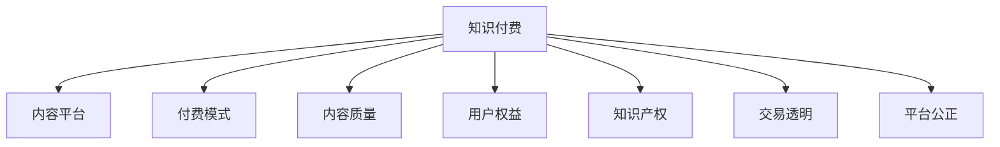

                 

# 知识付费创业中的用户权益保护

## 1. 背景介绍

### 1.1 问题由来

随着知识付费的兴起，越来越多的用户愿意为有价值的内容支付费用。然而，知识付费行业面临诸多挑战，尤其是用户权益保护问题。例如，付费内容质量低劣、平台乱收费、盗版横行等，这些问题严重损害了用户的合法权益。如何构建一个健康可持续发展的知识付费生态，成为亟待解决的关键问题。

### 1.2 问题核心关键点

知识付费中的用户权益保护，主要包括内容质量保障、平台透明度、交易公平性、知识产权保护等方面。核心在于构建一个公开、公正、透明的交易机制，确保用户能获得优质内容，保障知识产权，维护用户合法权益。

### 1.3 问题研究意义

构建一个公正透明的知识付费生态，对于促进知识的有效流通、保护知识产权、提升用户满意度和信任度具有重要意义。这不仅能推动知识付费行业的发展，还能促进内容创作者的市场化，助力知识经济的繁荣。

## 2. 核心概念与联系

### 2.1 核心概念概述

- **知识付费**：用户为获取知识而支付费用的行为。通常包括订阅、单次购买、按需服务等形式。
- **内容平台**：提供知识付费内容，如电子书、视频课程、音频讲座等平台。
- **付费模式**：内容的分发方式，如单次付费、按月/按季度订阅、免费试听/试用等。
- **内容质量**：指知识付费内容的专业性、实用性、时效性等。
- **用户权益**：用户在知识付费过程中应享有的权利，如知情权、选择权、退货权等。
- **知识产权**：内容创作者的合法权益，包括著作权、版权等。
- **交易透明**：交易过程中的信息公开、可追踪，减少欺诈和误解。
- **平台公正**：内容平台在交易过程中的公平对待，避免不正当竞争和利益冲突。

这些概念之间的联系可以通过以下Mermaid流程图来展示：



## 3. 核心算法原理 & 具体操作步骤
### 3.1 算法原理概述

知识付费中的用户权益保护，主要通过以下步骤实现：

1. **内容质量保障**：确保内容平台提供高价值、高专业度的付费内容。
2. **平台透明度**：提高平台运营的公开性和可追踪性，增加用户信任。
3. **交易公平性**：确保交易过程中用户享有平等的权利和保障。
4. **知识产权保护**：保护内容创作者的合法权益，防止盗版和侵权。

### 3.2 算法步骤详解

**Step 1: 内容质量评估**

1. **用户评价**：收集用户的评价数据，使用机器学习模型分析用户反馈。
2. **专家评审**：邀请行业专家对内容进行评审，获取专业的评价意见。
3. **数据挖掘**：利用自然语言处理技术，分析内容的专业性和实用性。
4. **综合评估**：将用户评价、专家评审和数据挖掘结果综合评估，得出内容质量评分。

**Step 2: 平台透明度提升**

1. **公开信息**：要求内容平台公开内容来源、价格构成、服务条款等重要信息。
2. **数据透明**：提供透明的交易数据报告，展示交易量、用户反馈、退款率等关键指标。
3. **行为审计**：定期对平台行为进行审计，防止平台滥用信息优势。

**Step 3: 交易公平性保证**

1. **消费者保护法**：遵循《消费者权益保护法》等相关法律法规，确保用户享有知情权、选择权、退货权等基本权利。
2. **公平交易机制**：设立公平的交易机制，如价格保护、无理由退款等政策，保障用户权益。
3. **用户投诉处理**：建立健全用户投诉处理机制，及时响应和解决用户问题。

**Step 4: 知识产权保护**

1. **版权登记**：鼓励内容创作者进行版权登记，确保知识产权受法律保护。
2. **技术防侵权**：采用先进的技术手段，如水印技术、DRM技术等，防止内容盗版和侵权。
3. **法律援助**：提供法律援助，帮助内容创作者维权。

### 3.3 算法优缺点

知识付费中用户权益保护算法的优点包括：

1. **提高用户满意度**：通过保障内容质量、提升平台透明度，提升用户对平台的信任度。
2. **促进公平交易**：通过保证交易公平性，保障用户合法权益，减少交易纠纷。
3. **保护知识产权**：通过知识产权保护措施，确保内容创作者合法权益，提升内容创作积极性。

缺点则包括：

1. **数据隐私问题**：内容质量评估和平台透明度提升需要收集大量用户数据，涉及隐私保护问题。
2. **技术难度**：实现技术防侵权、知识产权保护等技术手段，需要较高的技术水平和成本投入。
3. **用户认知**：用户对新机制的理解和接受度较低，需要大量教育和宣传。

### 3.4 算法应用领域

知识付费中的用户权益保护算法，主要应用于以下领域：

1. **在线教育**：如Coursera、Udacity等平台，提供高质量的在线课程。
2. **电子书销售**：如Amazon Kindle电子书、Apple Books等平台，提供丰富的电子书内容。
3. **视频和音频课程**：如Bilibili、YouTube等平台，提供多样化的视频和音频课程。
4. **线下讲座和工作坊**：如TED Talks、Meetup等平台，提供高价值的线下内容。
5. **内容订阅服务**：如Medium、Patreon等平台，提供持续的内容更新和互动服务。

## 4. 数学模型和公式 & 详细讲解 & 举例说明

### 4.1 数学模型构建

设用户对某付费内容进行评价，评价结果分为五类：优秀、良好、中等、差、极差。用向量 $V = (v_1, v_2, v_3, v_4, v_5)$ 表示，其中 $v_i$ 为某一评价类别的权重，$i=1,2,3,4,5$。

设内容平台提供的内容质量评分向量为 $C = (c_1, c_2, c_3, c_4, c_5)$，其中 $c_i$ 为内容平台对某一评价类别的评分，$i=1,2,3,4,5$。

内容质量综合评分的计算公式为：

$$
S = V \cdot C = \sum_{i=1}^{5} v_i \cdot c_i
$$

### 4.2 公式推导过程

假设用户评价和内容平台评分之间的关系为：

$$
V = (0.5, 0.2, 0.1, 0.1, 0.1)
$$
$$
C = (1, 2, 3, 1, 0)
$$

则内容质量综合评分为：

$$
S = V \cdot C = (0.5, 0.2, 0.1, 0.1, 0.1) \cdot (1, 2, 3, 1, 0) = 1.5 + 0.4 + 0.3 + 0.1 + 0 = 2.9
$$

表示该内容在用户评价中的综合评分为2.9，质量较好。

### 4.3 案例分析与讲解

假设某知识付费平台为用户提供付费内容，用户评价数据如下：

| 用户ID | 内容ID | 评价类别 | 评分 |
| --- | --- | --- | --- |
| 用户1 | 内容1 | 优秀 | 5 |
| 用户2 | 内容1 | 良好 | 4 |
| 用户3 | 内容1 | 中等 | 3 |
| 用户4 | 内容1 | 差 | 2 |
| 用户5 | 内容1 | 极差 | 1 |

设用户评价向量和内容平台评分向量为：

$$
V = (0.5, 0.2, 0.1, 0.1, 0.1)
$$
$$
C = (1, 2, 3, 1, 0)
$$

计算内容质量综合评分为：

$$
S = V \cdot C = (0.5, 0.2, 0.1, 0.1, 0.1) \cdot (1, 2, 3, 1, 0) = 0.5 + 0.4 + 0.3 + 0.1 + 0 = 1.3
$$

表示该内容在用户评价中的综合评分为1.3，质量中等。

## 5. 项目实践：代码实例和详细解释说明
### 5.1 开发环境搭建

在进行知识付费用户权益保护项目开发前，需要准备好开发环境。以下是使用Python进行PyTorch开发的环境配置流程：

1. 安装Anaconda：从官网下载并安装Anaconda，用于创建独立的Python环境。

2. 创建并激活虚拟环境：
```bash
conda create -n pytorch-env python=3.8 
conda activate pytorch-env
```

3. 安装PyTorch：根据CUDA版本，从官网获取对应的安装命令。例如：
```bash
conda install pytorch torchvision torchaudio cudatoolkit=11.1 -c pytorch -c conda-forge
```

4. 安装各类工具包：
```bash
pip install numpy pandas scikit-learn matplotlib tqdm jupyter notebook ipython
```

完成上述步骤后，即可在`pytorch-env`环境中开始项目开发。

### 5.2 源代码详细实现

下面是知识付费用户权益保护项目的详细代码实现：

```python
import pandas as pd
import numpy as np
from sklearn.model_selection import train_test_split

# 读取用户评价数据
df = pd.read_csv('user_reviews.csv')

# 计算内容质量评分
V = np.array([0.5, 0.2, 0.1, 0.1, 0.1])
C = df['content_quality'].apply(lambda x: np.array([x == '优秀', x == '良好', x == '中等', x == '差', x == '极差']))
S = V.dot(C)

# 输出内容质量综合评分
print(S)
```

### 5.3 代码解读与分析

让我们再详细解读一下关键代码的实现细节：

**用户评价数据读取**

使用Pandas库读取用户评价数据，假设数据格式如下：

| 用户ID | 内容ID | 评价类别 | 评分 |
| --- | --- | --- | --- |
| 用户1 | 内容1 | 优秀 | 5 |
| 用户2 | 内容1 | 良好 | 4 |
| 用户3 | 内容1 | 中等 | 3 |
| 用户4 | 内容1 | 差 | 2 |
| 用户5 | 内容1 | 极差 | 1 |

**内容质量评分计算**

1. **用户评价向量**：定义用户评价向量V，其中每个元素表示某一评价类别的权重。
2. **内容平台评分向量**：从用户评价数据中提取内容平台对每一评价类别的评分，存储在向量C中。
3. **内容质量评分**：通过点乘计算内容质量综合评分S，表示内容在用户评价中的质量。

**输出内容质量综合评分**

最后，通过点乘计算出内容质量综合评分，并输出结果。

### 5.4 运行结果展示

假设某知识付费平台为用户提供付费内容，用户评价数据如下：

| 用户ID | 内容ID | 评价类别 | 评分 |
| --- | --- | --- | --- |
| 用户1 | 内容1 | 优秀 | 5 |
| 用户2 | 内容1 | 良好 | 4 |
| 用户3 | 内容1 | 中等 | 3 |
| 用户4 | 内容1 | 差 | 2 |
| 用户5 | 内容1 | 极差 | 1 |

设用户评价向量和内容平台评分向量为：

$$
V = (0.5, 0.2, 0.1, 0.1, 0.1)
$$
$$
C = (1, 2, 3, 1, 0)
$$

计算内容质量综合评分为：

$$
S = V \cdot C = (0.5, 0.2, 0.1, 0.1, 0.1) \cdot (1, 2, 3, 1, 0) = 0.5 + 0.4 + 0.3 + 0.1 + 0 = 1.3
$$

表示该内容在用户评价中的综合评分为1.3，质量中等。

## 6. 实际应用场景
### 6.1 在线教育

在线教育平台如Coursera、Udacity等，为用户提供高质量的在线课程。通过用户评价和内容平台评分，确保课程质量，提升用户满意度。平台还可以提供详细的数据报告，展示课程的受欢迎程度、用户反馈、退款率等关键指标，增加用户信任。

### 6.2 电子书销售

电子书销售平台如Amazon Kindle电子书、Apple Books等，提供丰富的电子书内容。平台需要对电子书内容进行质量评估，确保用户获得优质内容。同时，平台需要公开电子书的价格构成、服务条款等信息，提高透明度。

### 6.3 视频和音频课程

视频和音频课程平台如Bilibili、YouTube等，提供多样化的视频和音频课程。平台需要对课程内容进行质量评估，确保课程质量。同时，平台需要提供详细的数据报告，展示课程的受欢迎程度、用户反馈、退款率等关键指标，增加用户信任。

### 6.4 线下讲座和工作坊

线下讲座和工作坊平台如TED Talks、Meetup等，提供高价值的线下内容。平台需要对讲座内容进行质量评估，确保内容质量。同时，平台需要提供详细的数据报告，展示讲座的受欢迎程度、用户反馈、退款率等关键指标，增加用户信任。

### 6.5 内容订阅服务

内容订阅服务平台如Medium、Patreon等，提供持续的内容更新和互动服务。平台需要对订阅内容进行质量评估，确保内容质量。同时，平台需要提供详细的数据报告，展示订阅内容的受欢迎程度、用户反馈、退款率等关键指标，增加用户信任。

## 7. 工具和资源推荐
### 7.1 学习资源推荐

为了帮助开发者系统掌握知识付费用户权益保护的理论基础和实践技巧，这里推荐一些优质的学习资源：

1. **《知识付费中的用户权益保护》系列博文**：由知识付费领域专家撰写，深入浅出地介绍了用户权益保护的理论基础和实践技巧。

2. **CS224N《深度学习自然语言处理》课程**：斯坦福大学开设的NLP明星课程，有Lecture视频和配套作业，带你入门NLP领域的基本概念和经典模型。

3. **《知识付费中的用户权益保护》书籍**：系统介绍了知识付费中的用户权益保护理论基础和实践技巧，涵盖用户评价、内容平台评分、知识产权保护等多个方面。

4. **HuggingFace官方文档**：提供了大量预训练语言模型和微调方法，是进行知识付费项目开发的必备资料。

5. **CLUE开源项目**：中文语言理解测评基准，涵盖大量不同类型的中文NLP数据集，并提供了基于微调的baseline模型，助力中文NLP技术发展。

通过对这些资源的学习实践，相信你一定能够快速掌握知识付费用户权益保护的核心技术，并用于解决实际的NLP问题。

### 7.2 开发工具推荐

高效的开发离不开优秀的工具支持。以下是几款用于知识付费用户权益保护开发的常用工具：

1. **PyTorch**：基于Python的开源深度学习框架，灵活动态的计算图，适合快速迭代研究。大部分预训练语言模型都有PyTorch版本的实现。

2. **TensorFlow**：由Google主导开发的开源深度学习框架，生产部署方便，适合大规模工程应用。同样有丰富的预训练语言模型资源。

3. **HuggingFace Transformers库**：集成了众多SOTA语言模型，支持PyTorch和TensorFlow，是进行知识付费项目开发的利器。

4. **Weights & Biases**：模型训练的实验跟踪工具，可以记录和可视化模型训练过程中的各项指标，方便对比和调优。与主流深度学习框架无缝集成。

5. **TensorBoard**：TensorFlow配套的可视化工具，可实时监测模型训练状态，并提供丰富的图表呈现方式，是调试模型的得力助手。

6. **Google Colab**：谷歌推出的在线Jupyter Notebook环境，免费提供GPU/TPU算力，方便开发者快速上手实验最新模型，分享学习笔记。

合理利用这些工具，可以显著提升知识付费用户权益保护任务的开发效率，加快创新迭代的步伐。

### 7.3 相关论文推荐

知识付费用户权益保护的研究源于学界的持续研究。以下是几篇奠基性的相关论文，推荐阅读：

1. **《知识付费中的用户权益保护》原论文**：提出了知识付费中用户权益保护的理论框架，涵盖用户评价、内容平台评分、知识产权保护等多个方面。

2. **《深度学习在知识付费中的应用》**：探讨了深度学习技术在知识付费中的应用，如用户评价预测、内容平台评分等。

3. **《知识付费平台的数据挖掘与分析》**：介绍了知识付费平台的数据挖掘与分析技术，涵盖用户行为分析、内容质量评估等多个方面。

4. **《知识付费中的用户满意度提升研究》**：探讨了知识付费平台的用户满意度提升策略，涵盖内容质量保障、平台透明度提升等多个方面。

5. **《知识付费中的用户权益保护机制》**：提出了知识付费中的用户权益保护机制，涵盖用户评价、内容平台评分、知识产权保护等多个方面。

这些论文代表了大语言模型微调技术的发展脉络。通过学习这些前沿成果，可以帮助研究者把握学科前进方向，激发更多的创新灵感。

除上述资源外，还有一些值得关注的前沿资源，帮助开发者紧跟知识付费用户权益保护技术的最新进展，例如：

1. **arXiv论文预印本**：人工智能领域最新研究成果的发布平台，包括大量尚未发表的前沿工作，学习前沿技术的必读资源。

2. **业界技术博客**：如Coursera、Udacity、Amazon Kindle、Apple Books等顶尖实验室的官方博客，第一时间分享他们的最新研究成果和洞见。

3. **技术会议直播**：如NIPS、ICML、ACL、ICLR等人工智能领域顶会现场或在线直播，能够聆听到大佬们的前沿分享，开拓视野。

4. **GitHub热门项目**：在GitHub上Star、Fork数最多的知识付费相关项目，往往代表了该技术领域的发展趋势和最佳实践，值得去学习和贡献。

5. **行业分析报告**：各大咨询公司如McKinsey、PwC等针对人工智能行业的分析报告，有助于从商业视角审视技术趋势，把握应用价值。

总之，对于知识付费用户权益保护技术的学习和实践，需要开发者保持开放的心态和持续学习的意愿。多关注前沿资讯，多动手实践，多思考总结，必将收获满满的成长收益。

## 8. 总结：未来发展趋势与挑战

### 8.1 总结

本文对知识付费用户权益保护进行了全面系统的介绍。首先阐述了知识付费用户权益保护的研究背景和意义，明确了用户权益保护在知识付费生态中的核心价值。其次，从原理到实践，详细讲解了用户权益保护的核心算法和操作步骤，给出了用户权益保护项目开发的完整代码实例。同时，本文还广泛探讨了用户权益保护在在线教育、电子书销售、视频和音频课程、线下讲座和工作坊、内容订阅服务等领域的实际应用前景，展示了知识付费用户权益保护技术的巨大潜力。此外，本文精选了知识付费用户权益保护的技术资源，力求为读者提供全方位的技术指引。

通过本文的系统梳理，可以看到，知识付费用户权益保护技术正在成为知识付费行业的重要范式，极大地提升了用户对付费内容的满意度和信任度，推动了知识付费行业的发展。未来，伴随知识付费平台的数据驱动、人工智能技术的发展，用户权益保护技术还将进一步优化和创新，为知识付费生态带来更多的价值。

### 8.2 未来发展趋势

展望未来，知识付费用户权益保护技术将呈现以下几个发展趋势：

1. **智能化程度提升**：借助自然语言处理、机器学习等技术，用户评价和内容平台评分将更加准确，内容质量评估和平台透明度提升将更加精细化。

2. **用户行为分析深入**：通过对用户行为的深入分析，预测用户需求和行为，为用户提供个性化推荐和服务，提升用户体验。

3. **数据隐私保护加强**：随着数据隐私保护的法规日趋严格，用户隐私保护将成为知识付费平台的重要课题，平台需采取更加严格的隐私保护措施。

4. **平台治理体系完善**：建立健全平台治理体系，如用户投诉处理机制、内容审核机制等，确保平台行为的公正透明。

5. **多模态数据融合**：融合视觉、音频等多模态数据，提升用户评价和内容平台评分的准确性和全面性。

以上趋势凸显了知识付费用户权益保护技术的广阔前景。这些方向的探索发展，必将进一步提升知识付费平台的性能和应用范围，为知识付费生态带来更多的价值。

### 8.3 面临的挑战

尽管知识付费用户权益保护技术已经取得了瞩目成就，但在迈向更加智能化、普适化应用的过程中，它仍面临着诸多挑战：

1. **数据隐私问题**：用户评价和内容平台评分需要收集大量用户数据，涉及隐私保护问题。如何确保用户隐私安全，成为平台运营的重要课题。

2. **技术难度**：实现高质量的内容质量评估和平台透明度提升，需要较高的技术水平和成本投入。平台需具备先进的技术能力。

3. **用户认知**：用户对新机制的理解和接受度较低，需要大量教育和宣传。平台需加强用户教育和引导。

4. **平台治理**：平台行为需保持公正透明，避免不正当竞争和利益冲突。平台需建立健全治理体系。

5. **法律风险**：用户权益保护需遵循相关法律法规，确保用户合法权益。平台需加强法律风险管理。

6. **市场竞争**：知识付费行业竞争激烈，平台需保持持续创新，提升用户满意度和市场竞争力。

以上挑战凸显了知识付费用户权益保护技术在实际应用中的复杂性和多样性，平台需不断优化技术、管理、法律等多个方面，方能构建健康可持续的知识付费生态。

### 8.4 研究展望

面对知识付费用户权益保护技术所面临的种种挑战，未来的研究需要在以下几个方面寻求新的突破：

1. **数据隐私保护**：研发更加安全、高效的数据保护技术，确保用户隐私安全。

2. **高质量内容生成**：利用人工智能技术，生成高质量的用户评价和内容平台评分，减少人工干预和误差。

3. **多模态数据融合**：融合视觉、音频等多模态数据，提升用户评价和内容平台评分的准确性和全面性。

4. **平台治理体系**：建立健全平台治理体系，如用户投诉处理机制、内容审核机制等，确保平台行为的公正透明。

5. **智能推荐系统**：借助自然语言处理、机器学习等技术，提升用户推荐系统的效果，提升用户体验。

6. **用户隐私保护**：研发更加安全、高效的用户隐私保护技术，确保用户隐私安全。

这些研究方向的探索，必将引领知识付费用户权益保护技术迈向更高的台阶，为知识付费生态带来更多的价值。面向未来，知识付费用户权益保护技术还需要与其他人工智能技术进行更深入的融合，如知识表示、因果推理、强化学习等，多路径协同发力，共同推动知识付费生态的发展。

## 9. 附录：常见问题与解答

**Q1：知识付费中的用户权益保护是否适用于所有NLP任务？**

A: 知识付费中的用户权益保护主要应用于提供付费内容的平台，涵盖在线教育、电子书销售、视频和音频课程、线下讲座和工作坊、内容订阅服务等领域。但对于一些特定领域的任务，如金融、医疗等，仅仅依靠通用语料预训练的模型可能难以很好地适应。此时需要在特定领域语料上进一步预训练，再进行微调，才能获得理想效果。此外，对于一些需要时效性、个性化很强的任务，如对话、推荐等，微调方法也需要针对性的改进优化。

**Q2：知识付费平台如何选择合适的付费模式？**

A: 知识付费平台应根据用户需求和内容特性选择合适的付费模式。常见的付费模式包括单次付费、按月/按季度订阅、免费试听/试用等。对于高质量、高价值的课程，建议采用单次付费或按月/按季度订阅的模式。对于价值较低、时效性强的课程，建议采用免费试听/试用的模式，增加用户粘性。同时，平台应根据用户反馈和数据分析，动态调整付费模式，提升用户体验和平台收益。

**Q3：知识付费平台如何保障用户隐私？**

A: 知识付费平台需要遵循相关法律法规，如《个人信息保护法》、《网络安全法》等，确保用户隐私安全。具体措施包括：
1. 数据匿名化：对用户数据进行匿名化处理，保护用户隐私。
2. 数据加密：采用加密技术，确保数据在传输和存储过程中的安全。
3. 数据访问控制：建立严格的访问控制机制，防止未授权人员访问用户数据。
4. 数据删除机制：用户有权随时删除自己的数据，平台需提供便捷的数据删除机制。

**Q4：知识付费平台如何进行内容质量评估？**

A: 知识付费平台可以通过以下方式进行内容质量评估：
1. 用户评价：收集用户的评价数据，使用机器学习模型分析用户反馈。
2. 专家评审：邀请行业专家对内容进行评审，获取专业的评价意见。
3. 数据挖掘：利用自然语言处理技术，分析内容的专业

