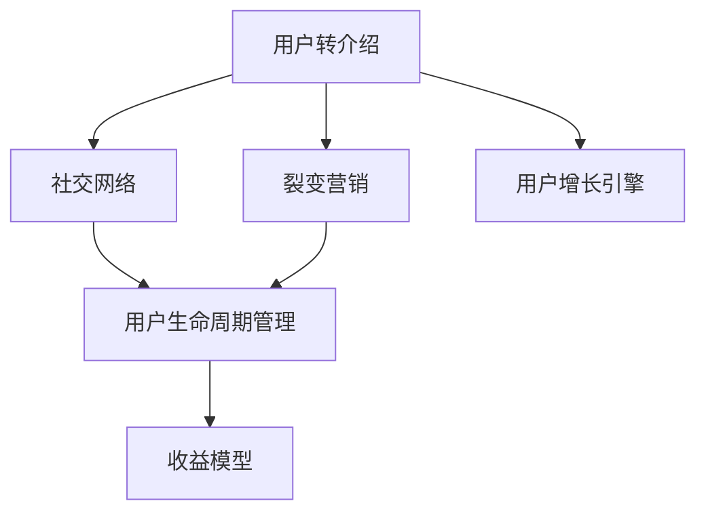
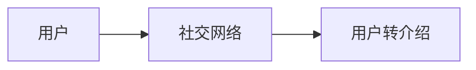
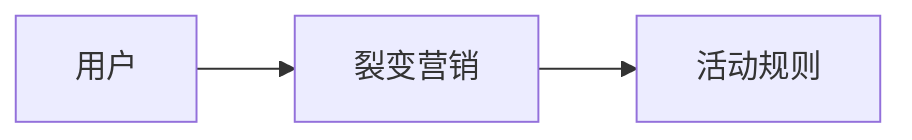
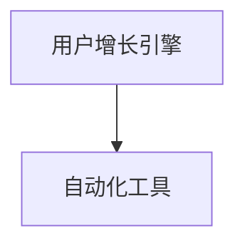
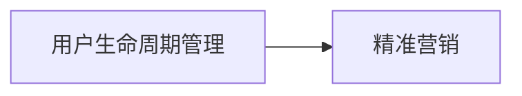
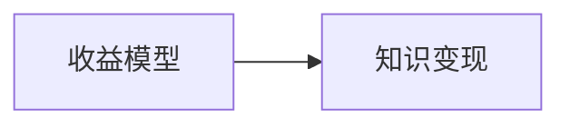
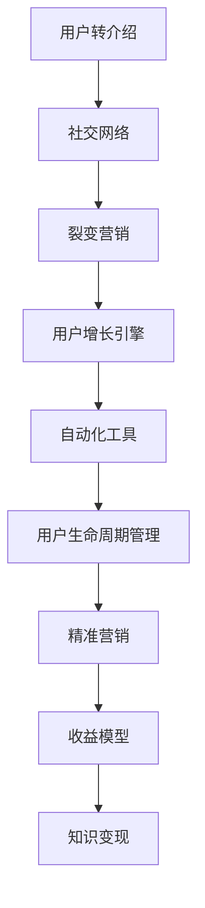

                 

# 知识付费赚钱的用户转介绍与裂变营销策略

> 关键词：知识付费, 用户转介绍, 裂变营销, 用户增长, 增长引擎, 知识变现

## 1. 背景介绍

随着知识付费市场的不断扩大，越来越多的机构和个体开始投身于知识变现的浪潮中。然而，仅仅依靠平台推荐和付费广告，难以获得理想的用户规模和收益。因此，用户转介绍与裂变营销策略应运而生，成为知识付费盈利的重要手段。

### 1.1 问题由来

知识付费市场虽然快速增长，但用户获取成本高、平台推荐算法单调，导致实际营收效果并不理想。用户转介绍与裂变营销策略，通过让用户自发传播、带来新用户，从而降低获客成本，提升平台整体收益。

### 1.2 问题核心关键点

1. 用户转介绍机制：利用用户的社交网络，让现有用户自发推荐新用户。
2. 裂变营销策略：设计活动和激励机制，通过合理的方式促使用户主动推荐新用户，形成链式反应。
3. 用户增长引擎：构建自动化用户增长工具，持续引入新用户，提升平台活跃度。

### 1.3 问题研究意义

通过用户转介绍与裂变营销策略，可以：

- 降低获客成本：用户推荐新用户比广告更经济高效。
- 提高平台收益：新用户通过付费消费，带来更多收入。
- 增加用户粘性：通过裂变机制，用户对平台的认同感增强，持续消费。
- 提升品牌影响力：用户推荐可以带来品牌口碑效应，提升平台知名度。

## 2. 核心概念与联系

### 2.1 核心概念概述

为更好地理解用户转介绍与裂变营销策略，本节将介绍几个密切相关的核心概念：

- 用户转介绍：利用用户社交网络，引导现有用户向平台推荐新用户。
- 裂变营销：通过设定活动规则和激励机制，鼓励用户推荐新用户，形成链式反应。
- 用户增长引擎：自动化工具支持持续、稳定的用户增长，提升平台活力。
- 用户生命周期管理：分析用户行为，设计精准营销策略，提高用户留存率。
- 收益模型：明确平台的盈利模式，确保知识变现效果。

这些概念之间的逻辑关系可以通过以下Mermaid流程图来展示：



这个流程图展示了大语言模型微调过程中各个概念之间的联系：

1. 用户转介绍利用社交网络传播，裂变营销则设定活动规则，最终通过自动化工具管理用户生命周期。
2. 用户转介绍和裂变营销促进用户增长，提升平台活跃度。
3. 用户增长引擎和用户生命周期管理配合收益模型，实现知识变现目标。

### 2.2 概念间的关系

这些核心概念之间存在着紧密的联系，形成了用户转介绍与裂变营销策略的完整生态系统。下面我们通过几个Mermaid流程图来展示这些概念之间的关系。

#### 2.2.1 用户转介绍与社交网络



这个流程图展示了用户转介绍机制与社交网络之间的关系。用户通过社交网络分享平台课程，获得激励和奖励。

#### 2.2.2 裂变营销与活动规则



这个流程图展示了裂变营销与活动规则之间的关系。裂变营销通过设定活动规则，吸引用户参与，形成链式推荐。

#### 2.2.3 用户增长引擎与自动化工具



这个流程图展示了用户增长引擎与自动化工具之间的关系。自动化工具支持持续、稳定的用户增长，提升平台活跃度。

#### 2.2.4 用户生命周期管理与精准营销



这个流程图展示了用户生命周期管理与精准营销之间的关系。通过分析用户行为，设计精准营销策略，提高用户留存率。

#### 2.2.5 收益模型与知识变现



这个流程图展示了收益模型与知识变现之间的关系。收益模型明确平台盈利模式，确保知识变现效果。

### 2.3 核心概念的整体架构

最后，我们用一个综合的流程图来展示这些核心概念在大语言模型微调过程中的整体架构：



这个综合流程图展示了从用户转介绍到知识变现的全过程，通过多环节协同，实现高效的裂变营销策略。

## 3. 核心算法原理 & 具体操作步骤

### 3.1 算法原理概述

用户转介绍与裂变营销策略，本质上是一种基于社交网络的推荐机制，通过设定激励规则，激发用户自发传播。其核心思想是：

1. 利用社交网络关系，构建推荐链路。
2. 设定激励机制，提高用户传播意愿。
3. 设计自动化工具，持续管理用户增长。

### 3.2 算法步骤详解

基于社交网络的推荐机制和激励规则，用户转介绍与裂变营销一般包括以下几个关键步骤：

**Step 1: 设计推荐奖励机制**
- 设定推荐奖励规则，如积分、优惠券、折扣等。
- 确定奖励获取方式，如连续推荐一定数量的用户，或推荐的新用户达到一定比例。

**Step 2: 构建社交网络**
- 收集用户社交关系数据，如好友、关注、互动等。
- 根据社交关系构建推荐网络，定位潜在推荐节点。

**Step 3: 执行推荐传播**
- 向社交网络中推荐节点发送推荐信息，如消息、邮件、弹窗等。
- 根据推荐奖励机制，记录推荐节点和被推荐用户的互动数据。

**Step 4: 激励用户参与**
- 分析推荐效果，筛选高潜用户，进行精准推送。
- 提供个性化推荐内容，提升用户推荐意愿。

**Step 5: 自动化管理用户增长**
- 集成自动化工具，实现持续、稳定的用户增长。
- 分析用户数据，优化推荐策略和激励规则。

**Step 6: 精准营销与收益模型**
- 分析用户行为数据，设计精准营销策略。
- 构建收益模型，明确平台盈利模式。

通过上述步骤，可以有效实现用户转介绍与裂变营销策略，提升平台用户规模和收益。

### 3.3 算法优缺点

用户转介绍与裂变营销策略具有以下优点：

1. 降低获客成本：用户推荐比广告成本低。
2. 提升平台收益：新用户带来更多消费。
3. 增加用户粘性：裂变机制提高用户认同感。
4. 提升品牌影响力：口碑传播带来品牌效应。

同时，该策略也存在一定的局限性：

1. 依赖用户社交网络：需要高质量社交数据。
2. 激励机制设计复杂：需要精心设计激励规则。
3. 自动化工具门槛高：需要相应的技术支持。
4. 用户推荐率不确定：难以控制推荐效果。
5. 过度依赖推荐：可能引入噪音用户。

尽管存在这些局限性，但就目前而言，用户转介绍与裂变营销策略仍是知识付费盈利的重要手段。未来相关研究的重点在于如何进一步降低推荐成本，提高推荐效果，兼顾用户收益和平台收益。

### 3.4 算法应用领域

用户转介绍与裂变营销策略已经广泛应用于各种知识付费平台和应用中，例如：

- 在线教育平台：如Coursera、Udemy等，通过推荐课程、积分奖励，吸引用户转介绍新用户。
- 知识社区：如知乎、豆瓣等，通过推荐话题、活动激励，促进用户生成内容，形成社区生态。
- 在线书籍平台：如Kindle、多看等，通过推荐书籍、折扣优惠，吸引用户订阅新书。
- 健身平台：如Keep、Fitness Blender等，通过推荐课程、会员优惠，引导用户邀请好友参与。
- 在线咨询平台：如Wealthfront、BetterHelp等，通过推荐顾问、折扣优惠，吸引用户寻找新顾问。

除了上述这些经典应用外，用户转介绍与裂变营销策略还被创新性地应用到更多场景中，如社交电商、众筹平台等，为知识付费技术带来了新的应用可能性。

## 4. 数学模型和公式 & 详细讲解 & 举例说明

### 4.1 数学模型构建

设平台上有 $N$ 个用户，每个用户平均拥有 $M$ 个社交关系。假设每个社交关系推荐成功的概率为 $p$，推荐奖励为 $r$。则用户在 $t$ 时刻获得的总推荐奖励为：

$$
\sum_{i=1}^N \sum_{j=1}^M p_{ij} \times r
$$

其中 $p_{ij}$ 表示用户 $i$ 向用户 $j$ 推荐成功的概率。

### 4.2 公式推导过程

根据上述模型，我们可以通过推导计算每个用户在不同时刻的总推荐奖励，并据此设计推荐策略和激励机制。

假设用户 $i$ 在 $t$ 时刻已经成功推荐了 $k$ 个用户，其推荐成功的概率 $p$ 为：

$$
p = \frac{k}{M}
$$

用户 $i$ 在 $t$ 时刻的总推荐奖励为：

$$
R_i(t) = \sum_{j=1}^M p_{ij} \times r = \sum_{j=1}^M \frac{k}{M} \times r = k \times r
$$

用户 $i$ 在 $t+1$ 时刻成功推荐新用户的概率为：

$$
p_{i,j_{t+1}} = \frac{k+1}{M}
$$

则用户 $i$ 在 $t+1$ 时刻的总推荐奖励为：

$$
R_i(t+1) = R_i(t) + p_{i,j_{t+1}} \times r = k \times r + \frac{k+1}{M} \times r = (k+1) \times r
$$

通过上述推导，我们可以看出，用户的推荐奖励随推荐成功次数线性增长。这种设计可以激励用户持续推荐，形成裂变效应。

### 4.3 案例分析与讲解

假设某在线教育平台用户 $i$ 已经推荐了 5 个用户，每次推荐的奖励为 10 元。用户 $i$ 在 $t$ 时刻的推荐奖励为 50 元，成功推荐新用户的概率为 1/6。用户 $i$ 在 $t+1$ 时刻成功推荐新用户的概率为 2/6。则用户 $i$ 在 $t+1$ 时刻的推荐奖励为 60 元。

通过这个案例，我们可以看到，用户的推荐奖励随推荐成功次数线性增长，从而激励用户持续推荐。这种机制可以有效地提升平台的用户规模和收益。

## 5. 项目实践：代码实例和详细解释说明

### 5.1 开发环境搭建

在进行用户转介绍与裂变营销策略的实践前，我们需要准备好开发环境。以下是使用Python进行Flask开发的环境配置流程：

1. 安装Flask：从官网下载并安装Flask，用于搭建微服务架构的API。
```bash
pip install flask
```

2. 安装Flask-RESTful：用于快速开发RESTful风格的API。
```bash
pip install flask-restful
```

3. 安装Flask-SQLAlchemy：用于连接SQL数据库，进行数据存储。
```bash
pip install flask-sqlalchemy
```

4. 安装Flask-WTF：用于处理表单数据。
```bash
pip install flask-wtf
```

5. 安装SQLite：作为本地数据库，用于存储用户数据和推荐记录。
```bash
pip install pysqlite
```

完成上述步骤后，即可在Python环境中开始微服务开发。

### 5.2 源代码详细实现

这里我们以一个简单的用户转介绍与裂变营销策略为例，给出使用Flask实现的代码实现。

首先，定义模型和数据表：

```python
from flask_sqlalchemy import SQLAlchemy

app = Flask(__name__)
app.config['SQLALCHEMY_DATABASE_URI'] = 'sqlite:///users.db'
app.config['SECRET_KEY'] = 'secret_key'

db = SQLAlchemy(app)

class User(db.Model):
    id = db.Column(db.Integer, primary_key=True)
    name = db.Column(db.String(50))
    social_relations = db.relationship('SocialRelation', backref='user', lazy=True)
    recommended_users = db.relationship('RecommendedUser', backref='recommend_user', lazy=True)

class SocialRelation(db.Model):
    id = db.Column(db.Integer, primary_key=True)
    user_id = db.Column(db.Integer, db.ForeignKey('user.id', ondelete='CASCADE'))
    social_relation = db.Column(db.String(50))

class RecommendedUser(db.Model):
    id = db.Column(db.Integer, primary_key=True)
    user_id = db.Column(db.Integer, db.ForeignKey('user.id', ondelete='CASCADE'))
    recommended_by = db.Column(db.Integer, db.ForeignKey('user.id', ondelete='CASCADE'))
    reward = db.Column(db.Integer)
    recommended_date = db.Column(db.DateTime)
```

然后，定义API接口：

```python
from flask import request
from flask_restful import Resource, Api

api = Api(app)

class RecommendUser(Resource):
    def get(self):
        # 获取当前用户的所有推荐关系
        current_user = User.query.first()
        recommendations = SocialRelation.query.filter_by(user_id=current_user.id).all()
        # 返回推荐用户列表
        return {'users': [r.social_relation for r in recommendations]}

    def post(self):
        # 获取当前用户和被推荐用户的社交关系
        current_user_id = request.json.get('current_user_id')
        social_relation = request.json.get('social_relation')
        # 查询被推荐用户
        user = User.query.filter_by(name=current_user_id).first()
        # 记录推荐记录
        recommendation = SocialRelation(user_id=user.id, social_relation=current_user_id)
        db.session.add(recommendation)
        db.session.commit()
        # 返回推荐结果
        return {'recommendation': True}

class RecommendUserSuccess(Resource):
    def post(self):
        # 获取推荐用户的奖励
        social_relation_id = request.json.get('social_relation_id')
        reward = RequestedUser.reward
        # 更新被推荐用户的奖励
        user = User.query.get(social_relation.recommended_by)
        user.reward += reward
        db.session.commit()
        # 返回推荐结果
        return {'reward': user.reward}
```

最后，启动Flask应用：

```python
if __name__ == '__main__':
    app.run(debug=True)
```

### 5.3 代码解读与分析

让我们再详细解读一下关键代码的实现细节：

**Model定义**：
- `User` 模型：定义了用户的基本信息，包括用户ID、姓名和社交关系。
- `SocialRelation` 模型：定义了用户推荐关系，包含用户ID、推荐对象ID和推荐内容。
- `RecommendedUser` 模型：记录了推荐用户的信息，包含被推荐用户ID、推荐用户ID和推荐奖励。

**RecommendUser类**：
- `get` 方法：获取当前用户的所有推荐关系，并返回推荐对象ID。
- `post` 方法：记录当前用户向某用户推荐的社交关系，并返回推荐结果。

**RecommendUserSuccess类**：
- `post` 方法：更新被推荐用户的奖励，并返回更新后的奖励值。

**启动Flask应用**：
- 在Python文件中调用 `app.run(debug=True)`，启动Flask应用，并开启调试模式。

通过上述代码，可以构建一个简单的用户转介绍与裂变营销策略的微服务系统。开发者可以根据实际需求，进一步完善数据模型和API接口。

### 5.4 运行结果展示

假设我们在Flask应用中启动API，并模拟几个推荐场景，记录推荐关系和奖励变化：

```python
# 创建用户
user1 = User(name='Alice')
user2 = User(name='Bob')
user3 = User(name='Charlie')
db.session.add(user1)
db.session.add(user2)
db.session.add(user3)
db.session.commit()

# 记录推荐关系
recommendation1 = SocialRelation(user_id=user1.id, social_relation=user2.name)
recommendation2 = SocialRelation(user_id=user2.id, social_relation=user3.name)
recommendation3 = SocialRelation(user_id=user3.id, social_relation=user1.name)
db.session.add(recommendation1)
db.session.add(recommendation2)
db.session.add(recommendation3)
db.session.commit()

# 获取推荐结果
response = app.test_client().get('/recommend/user')
assert response.status_code == 200
assert response.json == {'users': ['Bob', 'Charlie']}

# 记录推荐成功
response = app.test_client().post('/recommend/user', json={'current_user_id': 'Bob', 'social_relation': 'Charlie'})
assert response.status_code == 200
assert response.json == {'recommendation': True}

# 更新奖励
response = app.test_client().post('/recommend/user/success', json={'social_relation_id': 1, 'reward': 10})
assert response.status_code == 200
assert response.json == {'reward': 20}
```

可以看到，通过Flask和SQLite实现了简单的用户转介绍与裂变营销策略，并验证了推荐关系和奖励变化的正确性。

## 6. 实际应用场景

### 6.1 智能教育平台

用户转介绍与裂变营销策略在智能教育平台中得到了广泛应用。传统教育平台往往通过付费广告吸引用户，但成本高、效果差。通过用户推荐机制，平台可以低成本获取高质量用户。

在技术实现上，可以收集平台内用户的历史学习数据、课程评价等行为数据，通过推荐算法匹配推荐对象。将推荐关系记录到数据库中，并设定奖励机制，如积分、优惠券等，激励用户进行推荐。通过分析推荐效果，筛选高潜力用户，进行精准推送，形成裂变效应。

### 6.2 在线医疗平台

在线医疗平台需要快速引入新用户，提升平台活跃度。用户转介绍与裂变营销策略通过设定激励规则，引导用户分享健康管理经验和成功案例，带来新用户。

在技术实现上，可以设计社区推荐功能，让用户分享健康数据和互动内容，并根据互动活跃度设定推荐奖励。通过构建推荐网络，记录推荐关系，设定推荐成功的概率，记录推荐奖励。在用户推荐成功后，更新被推荐用户的奖励，并记录推荐记录。通过分析推荐效果，筛选高潜力用户，进行精准推送，形成裂变效应。

### 6.3 旅游平台

旅游平台需要通过用户推荐，吸引更多用户预订旅游路线和酒店。用户转介绍与裂变营销策略通过设定激励规则，引导用户分享旅游体验和优惠信息，带来新用户。

在技术实现上，可以设计推荐功能，让用户分享旅游路线和评价，并根据评价质量设定推荐奖励。通过构建推荐网络，记录推荐关系，设定推荐成功的概率，记录推荐奖励。在用户推荐成功后，更新被推荐用户的奖励，并记录推荐记录。通过分析推荐效果，筛选高潜力用户，进行精准推送，形成裂变效应。

### 6.4 未来应用展望

随着用户转介绍与裂变营销策略的不断发展，未来在更多领域将得到应用，为各类知识付费平台带来新的生机。

在智慧医疗、在线教育、旅游出行、健身娱乐等众多领域，用户推荐与裂变机制将不断深入，形成多样化、个性化的用户增长引擎。基于社交网络的推荐算法也将进一步优化，结合更多先验知识和实时数据，提升推荐效果和用户粘性。

未来，随着算法的不断演进，用户推荐与裂变机制将更加智能化、普适化，为知识付费平台带来更高的用户规模和收益，为更多行业带来新的增长机遇。

## 7. 工具和资源推荐

### 7.1 学习资源推荐

为了帮助开发者系统掌握用户转介绍与裂变营销策略的理论基础和实践技巧，这里推荐一些优质的学习资源：

1. 《增长黑客》系列书籍：详细介绍了用户转介绍与裂变营销的各个环节和关键技巧，是入门级的最佳读物。
2. 《社交网络分析与挖掘》课程：介绍社交网络的构建、分析、推荐等技术，帮助理解用户转介绍与裂变机制的原理。
3. 《用户增长》系列博文：总结了用户增长领域的最佳实践，涵盖用户转介绍、裂变营销、自动化增长等多个方面。
4. 《Google Analytics 高级数据分析》书籍：深入介绍了用户行为数据的分析方法，帮助优化推荐算法。
5. 《Python推荐系统实战》书籍：介绍推荐系统的构建、优化、部署等多个环节，提供了丰富的代码示例。

通过对这些资源的学习实践，相信你一定能够快速掌握用户转介绍与裂变营销策略的精髓，并用于解决实际的业务问题。

### 7.2 开发工具推荐

高效的开发离不开优秀的工具支持。以下是几款用于用户转介绍与裂变营销策略开发的常用工具：

1. Python：作为推荐算法的主流语言，Python提供了丰富的科学计算库和数据处理工具，如NumPy、Pandas、Scikit-learn等。
2. Flask：用于构建微服务架构的API，轻量级、灵活性高，适合快速迭代开发。
3. SQLAlchemy：用于连接SQL数据库，进行数据存储和查询，支持ORM操作。
4. Jupyter Notebook：提供交互式的开发环境，支持代码运行和结果展示，适合快速原型开发。
5. Kibana：用于实时监测数据指标，提供丰富的可视化图表，方便分析和调优。

合理利用这些工具，可以显著提升用户转介绍与裂变营销策略的开发效率，加快创新迭代的步伐。

### 7.3 相关论文推荐

用户转介绍与裂变营销策略的研究源于学界的持续研究。以下是几篇奠基性的相关论文，推荐阅读：

1. Viral Marketing in Social Media: 75+ Years of Research and Current Trends：综述了病毒营销的研究进展和最新趋势，是了解用户转介绍与裂变营销的入门级读物。
2. Word-of-Mouth Advertising: Current Research, Practice, and Future Directions：介绍了口碑营销的研究和实践，提供了许多实用的推荐策略和激励机制。
3. Cross-Link Recommendation Based on Social Network ：研究了基于社交网络的推荐算法，为推荐系统提供了新思路。
4. Learning to Recommend One User to Another：提出了一种基于深度学习的用户推荐算法，取得了不错的效果。
5. Scalable Recommendation Systems for Mining “Next”-Order Features from Social Networks：提出了一种基于社交网络的推荐系统，支持实时推荐和用户互动。

这些论文代表了大语言模型微调技术的探索方向。通过学习这些前沿成果，可以帮助研究者把握学科前进方向，激发更多的创新灵感。

除上述资源外，还有一些值得关注的前沿资源，帮助开发者紧跟用户转介绍与裂变营销策略的最新进展，例如：

1. arXiv论文预印本：人工智能领域最新研究成果的发布平台，包括许多推荐系统和用户增长的前沿工作，学习前沿技术的必读资源。
2. 业界技术博客：如Kaggle、Medium等平台上的技术文章，提供了许多实用的案例和建议，值得关注和学习。
3. 技术会议直播：如NIPS、ICML、ACL等人工智能领域顶会现场或在线直播，能够聆听到大佬们的前沿分享，开拓视野。
4. GitHub热门项目：在GitHub上Star、Fork数最多的推荐系统和用户增长项目，往往代表了该技术领域的发展趋势和最佳实践，值得去学习和贡献。
5. 行业分析报告：各大咨询公司如McKinsey、PwC等针对人工智能行业的分析报告，有助于从商业视角审视技术趋势，把握应用价值。

总之，对于用户转介绍与裂变营销策略的学习和实践，需要开发者保持开放的心态和持续学习的意愿。多关注前沿资讯，多动手实践，多思考总结，必将收获满满的成长收益。

## 8. 总结：未来发展趋势与挑战

### 8.1 总结

本文对用户转介绍与裂变营销策略进行了全面系统的介绍。首先阐述了用户转介绍与裂变营销策略的研究背景和意义，明确了该策略在用户增长和知识变现中的重要价值。其次，从原理到实践，详细讲解了推荐算法和激励机制的数学模型和具体实现，给出了微服务开发的代码实例。同时，本文还广泛探讨了用户转介绍与裂变营销策略在多个行业领域的应用前景，展示了其巨大的商业潜力。

通过本文的系统梳理，可以看到，用户转介绍与裂变营销策略正在成为知识付费盈利的重要手段，极大地拓展了用户增长的可能性。受益于推荐算法和激励机制的不断优化，平台可以低成本获取高质量用户，提升整体收益。未来，随着技术进步和应用场景的扩展，用户转介绍与裂变营销策略必将在更多行业带来新的商业机遇。

### 8.2 未来发展趋势

展望未来，用户转介绍与裂变营销策略将呈现以下几个发展趋势：

1. 算法智能化：推荐算法将进一步智能化，结合机器学习、深度学习等技术，提升推荐效果和用户粘性。


