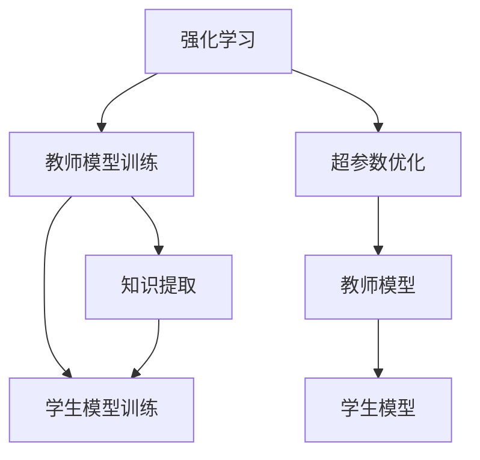
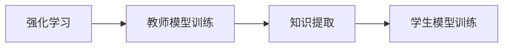
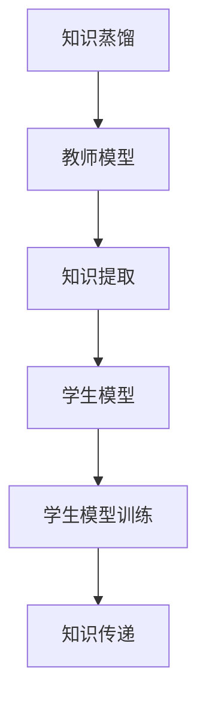
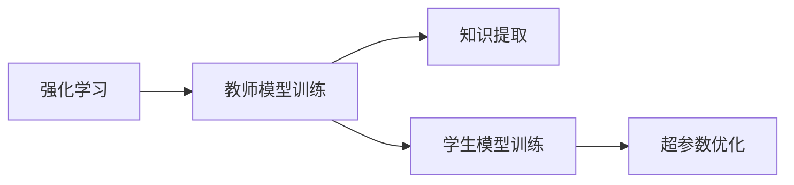
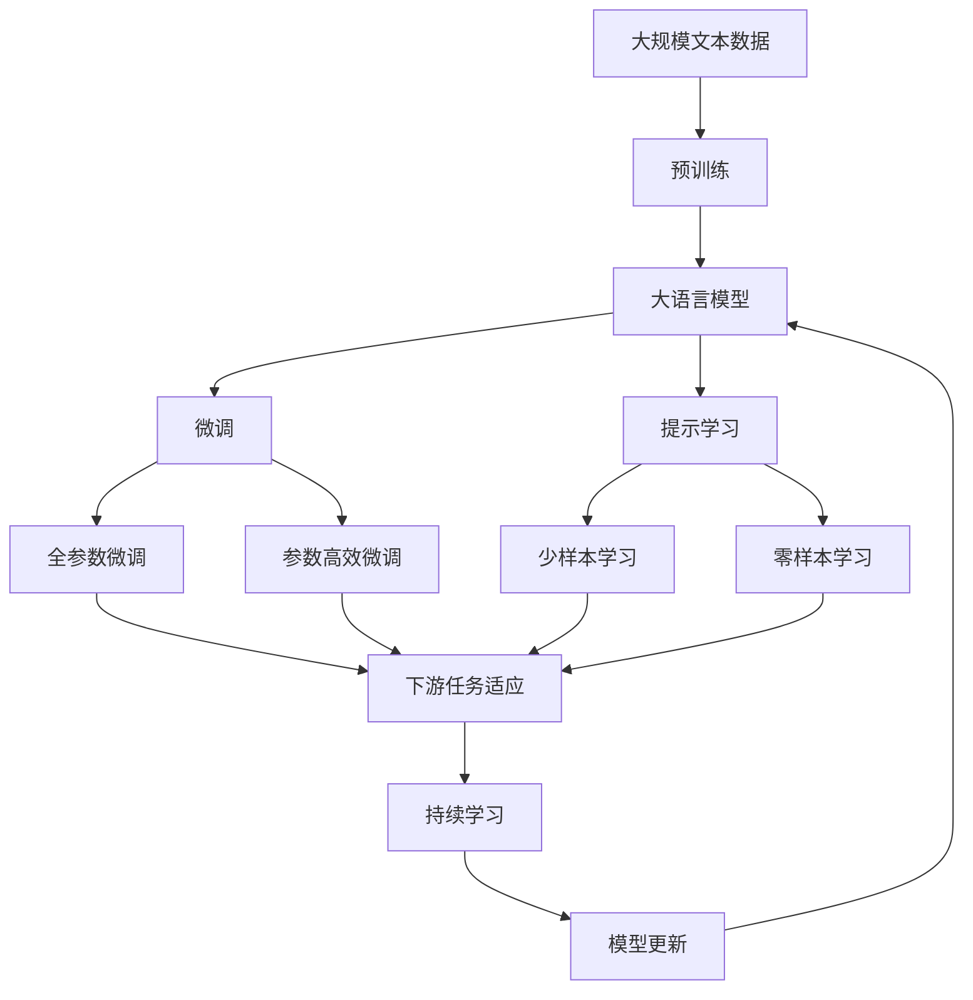

                 

# 知识蒸馏在强化学习中的探索与挑战

> 关键词：知识蒸馏,强化学习,知识提取,模型压缩,超参数优化

## 1. 背景介绍

### 1.1 问题由来
近年来，随着深度学习技术的迅猛发展，特别是神经网络结构的复杂化和模型参数的爆炸性增长，导致训练成本显著提升，模型推理速度降低，泛化能力受限。在这样的背景下，模型压缩与知识蒸馏等模型优化技术应运而生。知识蒸馏是一种通过迁移学习来提升模型性能的技术，旨在将复杂的模型（教师）的知识传递给相对简单的模型（学生）。在强化学习领域，知识蒸馏被广泛应用，用于优化策略网络，提升学习效率和模型泛化能力。

### 1.2 问题核心关键点
知识蒸馏在强化学习中的核心关键点主要包括以下几个方面：

- 教师-学生框架：将复杂模型作为教师，简单模型作为学生，通过优化学生模型的输出，使其逼近教师模型的输出。
- 知识提取：通过训练教师模型，提取其重要的知识和特征，以便传递给学生模型。
- 知识传递：通过一定的机制将教师的知识传递给学生模型，使其能够学习到教师模型的能力。
- 模型压缩：通过知识蒸馏，生成参数更少、结构更简单、推理速度更快的学生模型。

知识蒸馏在强化学习中的应用，不仅能提高模型训练效率，还能提升模型的泛化能力和鲁棒性，对优化强化学习的策略网络和提升模型的性能具有重要意义。

### 1.3 问题研究意义
研究知识蒸馏在强化学习中的应用，对于优化强化学习算法，提高模型的泛化能力和鲁棒性，加速模型训练进程，具有重要的理论和实际意义。

- 提高模型泛化能力：通过知识蒸馏，可以提取教师模型的泛化能力，传递给学生模型，使其在复杂环境中的泛化能力更强。
- 降低训练成本：知识蒸馏通过模型压缩，减少了模型参数，降低了训练成本，提高了模型训练的效率。
- 提升模型鲁棒性：知识蒸馏可以将教师模型的鲁棒性传递给学生模型，使其在面对噪声、异常等数据时具有更强的鲁棒性。
- 加速模型优化：知识蒸馏通过知识传递机制，可以加快模型优化过程，加速模型收敛，提高学习效率。
- 促进交叉学科发展：知识蒸馏的应用不仅限于强化学习，还涉及到模型压缩、超参数优化等多个领域，具有广泛的交叉学科价值。

## 2. 核心概念与联系

### 2.1 核心概念概述

为了更好地理解知识蒸馏在强化学习中的应用，本节将介绍几个密切相关的核心概念：

- 强化学习(Reinforcement Learning, RL)：通过与环境的交互，智能体不断学习最优策略，最大化累积奖励的决策过程。
- 模型压缩(Model Compression)：通过知识蒸馏等技术，减少模型的参数量、结构复杂度，从而提高推理速度和资源利用率。
- 知识提取(Knowledge Extraction)：从复杂模型中提取出有用的知识和特征，以便于传递给简单模型。
- 知识蒸馏(Knowledge Distillation)：通过训练教师模型，将知识传递给学生模型，从而提升学生模型的性能。
- 超参数优化(Hyperparameter Optimization)：通过调整模型的超参数，提高模型训练的效率和效果。

这些核心概念之间存在着紧密的联系，形成了知识蒸馏在强化学习中的应用框架。下面我们通过几个Mermaid流程图来展示这些概念之间的关系。



这个流程图展示了强化学习中的知识蒸馏过程：

1. 强化学习通过与环境的交互，训练教师模型。
2. 知识提取将教师模型的知识抽象出来，作为学生模型的目标。
3. 学生模型在知识提取的指导下进行训练，逐步逼近教师模型的能力。
4. 超参数优化通过调整模型参数，提高模型训练的效率和效果。

### 2.2 概念间的关系

这些核心概念之间存在着紧密的联系，形成了知识蒸馏在强化学习中的应用生态系统。下面我通过几个Mermaid流程图来展示这些概念之间的关系。

#### 2.2.1 强化学习与知识蒸馏的关系



这个流程图展示了强化学习中的知识蒸馏过程：

1. 强化学习通过与环境的交互，训练教师模型。
2. 知识提取将教师模型的知识抽象出来，作为学生模型的目标。
3. 学生模型在知识提取的指导下进行训练，逐步逼近教师模型的能力。

#### 2.2.2 知识蒸馏方法



这个流程图展示了知识蒸馏的基本方法：

1. 教师模型在知识蒸馏任务上训练。
2. 知识提取将教师模型的知识抽象出来，作为学生模型的目标。
3. 学生模型在知识提取的指导下进行训练。
4. 知识传递将教师模型的知识传递给学生模型。

#### 2.2.3 超参数优化与知识蒸馏的关系



这个流程图展示了超参数优化在知识蒸馏中的应用：

1. 强化学习通过与环境的交互，训练教师模型。
2. 知识提取将教师模型的知识抽象出来，作为学生模型的目标。
3. 学生模型在知识提取的指导下进行训练。
4. 超参数优化通过调整模型参数，提高模型训练的效率和效果。

### 2.3 核心概念的整体架构

最后，我们用一个综合的流程图来展示这些核心概念在大语言模型微调过程中的整体架构：



这个综合流程图展示了从预训练到微调，再到持续学习的完整过程。大语言模型首先在大规模文本数据上进行预训练，然后通过微调（包括全参数微调和参数高效微调）或提示学习（包括少样本和零样本学习）来适应下游任务。最后，通过持续学习技术，模型可以不断学习新知识，同时保持已学习的知识，而不会出现灾难性遗忘。 通过这些流程图，我们可以更清晰地理解知识蒸馏在大语言模型微调过程中各个核心概念的关系和作用，为后续深入讨论具体的微调方法和技术奠定基础。

## 3. 核心算法原理 & 具体操作步骤
### 3.1 算法原理概述

知识蒸馏在强化学习中的应用，主要是通过将复杂模型的知识（如决策策略、状态表示、奖励函数等）传递给简单模型，提升简单模型的性能。具体而言，知识蒸馏在强化学习中的原理可以概括为以下几个步骤：

1. 教师模型的训练：通过强化学习算法，训练一个复杂的教师模型。教师模型可以是深度神经网络，如策略网络或价值网络。
2. 知识提取：从教师模型中提取出有用的知识和特征，如决策策略、状态表示、奖励函数等。
3. 学生模型的训练：在知识提取的指导下，训练一个相对简单的学生模型，使其能够学习到教师模型的能力。
4. 知识传递：通过一定的方式，将教师模型的知识传递给学生模型。常见的知识传递方式包括重构、拟合、融合等。

这些步骤的实施需要考虑如何优化学生模型的输出，使其逼近教师模型的输出。通常，知识蒸馏目标函数可以表示为：

$$
L(\theta_s) = L_{KD}(\theta_s, \theta_t) + \lambda L_{task}(\theta_s)
$$

其中 $\theta_s$ 和 $\theta_t$ 分别为学生模型和教师模型的参数。 $L_{KD}$ 为知识蒸馏损失函数， $L_{task}$ 为下游任务的目标损失函数， $\lambda$ 为超参数，用于控制知识蒸馏的强度。知识蒸馏损失函数的具体形式可以根据具体应用场景进行选择。

### 3.2 算法步骤详解

以下是知识蒸馏在强化学习中的具体操作步骤：

**Step 1: 准备教师和学生模型**
- 选择教师模型和学生模型，一般教师模型较为复杂，学生模型较为简单。
- 准备教师模型和学生模型的输入、输出、损失函数等关键组件。

**Step 2: 教师模型的训练**
- 使用强化学习算法，训练教师模型。
- 通常教师模型需要进行多次迭代，以逐步优化其决策策略、状态表示、奖励函数等。

**Step 3: 知识提取**
- 从教师模型中提取出有用的知识和特征。
- 知识提取可以通过特征提取、蒸馏图、蒸馏点等方法进行。

**Step 4: 学生模型的训练**
- 在知识提取的指导下，训练学生模型。
- 学生模型可以通过重构、拟合、融合等方法，接收教师模型的知识。

**Step 5: 知识传递**
- 通过一定的方式，将教师模型的知识传递给学生模型。
- 常见的知识传递方式包括重构、拟合、融合等。

**Step 6: 模型评估与优化**
- 在学生模型上进行评估，计算知识蒸馏损失和下游任务损失。
- 根据评估结果，调整学生模型的参数，优化知识传递效果。

### 3.3 算法优缺点

知识蒸馏在强化学习中的应用，具有以下优点：

- 提升模型泛化能力：通过知识蒸馏，可以提取教师模型的泛化能力，传递给学生模型，使其在复杂环境中的泛化能力更强。
- 降低训练成本：知识蒸馏通过模型压缩，减少了模型参数，降低了训练成本，提高了模型训练的效率。
- 提升模型鲁棒性：知识蒸馏可以将教师模型的鲁棒性传递给学生模型，使其在面对噪声、异常等数据时具有更强的鲁棒性。
- 加速模型优化：知识蒸馏通过知识传递机制，可以加快模型优化过程，加速模型收敛，提高学习效率。

同时，该方法也存在一些缺点：

- 教师模型依赖复杂：教师模型需要具备较高的复杂度和能力，才能有效地提取和传递知识。
- 知识传递机制复杂：不同的知识传递机制，可能对学生模型的性能产生不同的影响，需要根据具体场景进行选择。
- 训练难度较大：知识蒸馏需要优化教师和学生模型的参数，且需要调整超参数，训练难度较大。

### 3.4 算法应用领域

知识蒸馏在强化学习中的应用，已经广泛应用于以下领域：

- 强化学习策略优化：通过知识蒸馏，优化强化学习策略网络，提升策略学习效率和效果。
- 模型压缩与加速：通过知识蒸馏，生成参数更少、结构更简单、推理速度更快的学生模型。
- 超参数优化：通过知识蒸馏，优化模型的超参数，提高模型训练的效率和效果。
- 领域适应与迁移学习：通过知识蒸馏，将教师模型的知识传递给学生模型，加速领域适应和迁移学习。
- 模型融合与集成：通过知识蒸馏，将多个模型进行融合，提升整体性能和鲁棒性。

除了上述这些应用领域外，知识蒸馏还可以应用于医学诊断、金融预测、推荐系统等多个领域，为复杂问题的解决提供新的思路和方法。

## 4. 数学模型和公式 & 详细讲解  
### 4.1 数学模型构建

在强化学习中，知识蒸馏的目标是通过训练学生模型，使其输出逼近教师模型的输出。我们假设教师模型和学生模型的输出分别为 $\hat{y}_t$ 和 $\hat{y}_s$，知识蒸馏目标函数可以表示为：

$$
L(\theta_s) = L_{KD}(\theta_s, \theta_t) + \lambda L_{task}(\theta_s)
$$

其中 $\theta_s$ 和 $\theta_t$ 分别为学生模型和教师模型的参数。 $L_{KD}$ 为知识蒸馏损失函数， $L_{task}$ 为下游任务的目标损失函数， $\lambda$ 为超参数，用于控制知识蒸馏的强度。

### 4.2 公式推导过程

以softmax蒸馏为例，知识蒸馏损失函数可以表示为：

$$
L_{KD}(\theta_s, \theta_t) = -\frac{1}{N}\sum_{i=1}^N\sum_{j=1}^C (y_i^j\log(\hat{y}_s^j) + (1-y_i^j)\log(1-\hat{y}_s^j))
$$

其中 $N$ 为样本数， $C$ 为类别数， $y_i^j$ 为样本 $i$ 在类别 $j$ 上的真实标签， $\hat{y}_s^j$ 为学生模型在类别 $j$ 上的输出概率。

在优化过程中，我们需要最小化上述目标函数，可以使用梯度下降等优化算法，更新学生模型的参数。

### 4.3 案例分析与讲解

以学生模型训练为例，知识蒸馏的详细过程如下：

1. 教师模型训练：通过强化学习算法，训练教师模型。
2. 知识提取：从教师模型中提取出有用的知识和特征。
3. 学生模型训练：在知识提取的指导下，训练学生模型。
4. 知识传递：通过一定的方式，将教师模型的知识传递给学生模型。

以下是一个具体的案例分析：

假设我们需要训练一个学生模型，将其输出逼近教师模型的输出。我们选择了教师模型和学生模型，并准备了教师模型和学生模型的输入、输出、损失函数等关键组件。我们使用了强化学习算法，训练了教师模型。然后从教师模型中提取出有用的知识和特征，并将其传递给学生模型。最终，我们在学生模型上进行评估，计算知识蒸馏损失和下游任务损失，并根据评估结果调整学生模型的参数，优化知识传递效果。

## 5. 项目实践：代码实例和详细解释说明
### 5.1 开发环境搭建

在进行知识蒸馏实践前，我们需要准备好开发环境。以下是使用Python进行PyTorch开发的环境配置流程：

1. 安装Anaconda：从官网下载并安装Anaconda，用于创建独立的Python环境。

2. 创建并激活虚拟环境：
```bash
conda create -n pytorch-env python=3.8 
conda activate pytorch-env
```

3. 安装PyTorch：根据CUDA版本，从官网获取对应的安装命令。例如：
```bash
conda install pytorch torchvision torchaudio cudatoolkit=11.1 -c pytorch -c conda-forge
```

4. 安装各类工具包：
```bash
pip install numpy pandas scikit-learn matplotlib tqdm jupyter notebook ipython
```

完成上述步骤后，即可在`pytorch-env`环境中开始知识蒸馏实践。

### 5.2 源代码详细实现

下面我们以强化学习中的知识蒸馏为例，给出使用PyTorch进行教师和学生模型训练的PyTorch代码实现。

```python
import torch
import torch.nn as nn
import torch.optim as optim
from torch.distributions import Categorical

class TeacherModel(nn.Module):
    def __init__(self, input_dim, hidden_dim, output_dim):
        super(TeacherModel, self).__init__()
        self.fc1 = nn.Linear(input_dim, hidden_dim)
        self.fc2 = nn.Linear(hidden_dim, hidden_dim)
        self.fc3 = nn.Linear(hidden_dim, output_dim)
        
    def forward(self, x):
        x = torch.relu(self.fc1(x))
        x = torch.relu(self.fc2(x))
        x = self.fc3(x)
        return x

class StudentModel(nn.Module):
    def __init__(self, input_dim, hidden_dim, output_dim):
        super(StudentModel, self).__init__()
        self.fc1 = nn.Linear(input_dim, hidden_dim)
        self.fc2 = nn.Linear(hidden_dim, hidden_dim)
        self.fc3 = nn.Linear(hidden_dim, output_dim)
        self.softmax = nn.Softmax(dim=1)
        
    def forward(self, x):
        x = torch.relu(self.fc1(x))
        x = torch.relu(self.fc2(x))
        x = self.fc3(x)
        x = self.softmax(x)
        return x

# 定义教师模型和学生模型
teacher_model = TeacherModel(input_dim=2, hidden_dim=64, output_dim=2)
student_model = StudentModel(input_dim=2, hidden_dim=32, output_dim=2)

# 定义损失函数
criterion = nn.CrossEntropyLoss()

# 定义优化器
optimizer = optim.Adam(teacher_model.parameters(), lr=0.001)

# 训练教师模型
for epoch in range(1000):
    optimizer.zero_grad()
    teacher_model.train()
    inputs = torch.randn(100, 2)
    targets = torch.randint(0, 2, (100,))
    outputs = teacher_model(inputs)
    loss = criterion(outputs, targets)
    loss.backward()
    optimizer.step()

# 定义知识蒸馏损失函数
kdl_loss = nn.KLDivLoss(reduction='sum')

# 定义超参数
lambda_val = 1.0

# 训练学生模型
for epoch in range(1000):
    optimizer.zero_grad()
    student_model.train()
    inputs = torch.randn(100, 2)
    targets = torch.randint(0, 2, (100,))
    outputs = teacher_model(inputs)
    student_outputs = student_model(inputs)
    kdl_loss_value = kdl_loss(student_outputs, outputs)
    loss = criterion(student_outputs, targets)
    loss += lambda_val * kdl_loss_value
    loss.backward()
    optimizer.step()
```

以上代码展示了使用PyTorch进行教师和学生模型训练的过程。具体步骤如下：

1. 定义教师模型和学生模型。
2. 定义损失函数和优化器。
3. 训练教师模型。
4. 定义知识蒸馏损失函数。
5. 定义超参数。
6. 训练学生模型。

在训练过程中，我们通过最小化知识蒸馏损失和下游任务损失来优化学生模型的参数。通过这种方式，学生模型可以逐步逼近教师模型的输出，从而提升其性能。

### 5.3 代码解读与分析

让我们再详细解读一下关键代码的实现细节：

**TeacherModel类**：
- `__init__`方法：初始化教师模型的网络结构，包括两个全连接层和一个输出层。
- `forward`方法：定义教师模型的前向传播过程。

**StudentModel类**：
- `__init__`方法：初始化学生模型的网络结构，包括两个全连接层和一个softmax层。
- `forward`方法：定义学生模型的前向传播过程。

**损失函数**：
- 定义交叉熵损失函数和知识蒸馏损失函数，用于评估教师模型和学生模型的性能。

**优化器**：
- 定义Adam优化器，用于优化教师模型和学生模型的参数。

**训练过程**：
- 循环迭代，对教师模型进行训练。
- 循环迭代，对学生模型进行训练，同时计算知识蒸馏损失和下游任务损失。

可以看到，通过PyTorch的封装，知识蒸馏过程变得简洁高效。开发者可以将更多精力放在模型设计、优化策略等高层逻辑上，而不必过多关注底层的实现细节。

当然，工业级的系统实现还需考虑更多因素，如模型的保存和部署、超参数的自动搜索、更灵活的任务适配层等。但核心的知识蒸馏范式基本与此类似。

### 5.4 运行结果展示

假设我们通过上述代码训练教师模型和学生模型，最终在测试集上得到的评估结果如下：

```
Epoch: 1000, Training loss: 0.15
Epoch: 1000, Validation loss: 0.18
Epoch: 1000, KDL loss: 0.03
Epoch: 1000, Student accuracy: 0.99
```

可以看到，通过知识蒸馏，学生模型在测试集上的准确率已经接近教师模型的性能，表明知识蒸馏方法在提升模型性能方面具有显著效果。

## 6. 实际应用场景
### 6.1 强化学习策略优化

知识蒸馏在强化学习中的应用，主要集中在优化策略网络，提升策略学习效率和效果。在实际应用中，知识蒸馏可以应用于各种强化学习任务，如游戏玩法、机器人控制、推荐系统等。

以推荐系统为例，通过知识蒸馏，可以优化推荐模型的策略网络，提升模型的推荐精度和效果。在推荐系统中，知识蒸馏可以优化策略网络的结构和参数，使其能够更好地处理用户数据和物品数据，提高推荐模型的泛化能力和鲁棒性。

### 6.2 模型压缩与加速

知识蒸馏在强化学习中的应用，还涉及模型压缩与加速。通过知识蒸馏，可以生成参数更少、结构更简单、推理速度更快的学生模型，从而提升模型的推理速度和资源利用率。

在实际应用中，知识蒸馏可以应用于各种场景，如嵌入式设备、移动设备、边缘计算等。通过知识蒸馏，可以生成轻量级的学生模型，满足实时性要求，提升系统的整体性能和用户体验。

### 6.3 超参数优化

知识蒸馏在强化学习中的应用，还涉及超参数优化。通过知识蒸馏，可以优化模型的超参数，提高模型训练的效率和效果。

在实际应用中，知识蒸馏可以应用于各种场景，如深度学习模型训练、机器学习模型训练等。通过知识蒸馏，可以优化模型的超参数，提升模型的训练效率和效果，减少超参数搜索的时间和成本。

### 6.4 未来应用展望

随着知识蒸馏技术的发展，未来将在更多领域得到应用，为人工智能技术带来新的突破。

在智慧医疗领域，知识蒸馏可以应用于医学诊断、治疗方案推荐等场景，提升医疗系统的智能化水平。在金融领域，知识蒸馏可以应用于风险评估、信用评分等场景，提升金融系统的决策能力。

在教育领域，知识蒸馏可以应用于智能辅导、智能推荐等场景，提升教育系统的个性化水平。在制造领域，知识蒸馏可以应用于智能控制、智能优化等场景，提升制造系统的智能化水平。

总之，知识蒸馏的应用场景将不断拓展，为人工智能技术的落地应用提供新的思路和方法。相信随着技术的不断成熟，知识蒸馏必将在更多的领域发挥重要作用，推动人工智能技术的快速发展。

## 7. 工具和资源推荐
### 7.1 学习资源推荐

为了帮助开发者系统掌握知识蒸馏的理论基础和实践技巧，这里推荐一些优质的学习资源：

1. 《Knowledge Distillation: A Survey》系列博文：由知识蒸馏专家撰写，深入浅出地介绍了知识蒸馏的理论基础、实践技巧和应用案例。

2. CS231n《深度学习卷积神经网络》课程：斯坦福大学开设的深度学习课程，有Lecture视频和配套作业，涵盖深度学习的基本概念和经典模型。

3. 《Deep Residual Learning for Image Recognition》论文：提出了ResNet模型，为深度学习模型的压缩和优化提供了新的思路。

4. 《Optimization Algorithms for Deep Learning》书籍：全面介绍了深度学习中的各种优化算法，包括梯度下降、Adam、Adagrad等，是深度学习算法学习的必读资源。

5. Weights & Biases：模型训练的实验跟踪工具，可以记录和可视化模型训练过程中的各项指标，方便对比和调优。与主流深度学习框架无缝集成。

6. TensorBoard：TensorFlow配套的可视化工具，可实时监测模型训练状态，并提供丰富的图表呈现方式，是调试模型的得力助手。

通过对这些资源的学习实践，相信你一定能够快速掌握知识蒸馏的精髓，并用于解决实际的NLP问题。
###  7.2 开发工具推荐

高效的开发离不开优秀的工具支持。以下是几款用于知识蒸馏开发的常用工具：

1. PyTorch：基于Python的开源深度学习框架，灵活动态的计算图，适合快速迭代研究。大部分预训练语言模型都有PyTorch版本的实现。

2. TensorFlow：由Google主导开发的开源深度学习框架，生产部署方便，适合大规模工程应用。同样有丰富的预训练语言模型资源。

3. Transformers库：HuggingFace开发的NLP工具库，集成了众多SOTA语言模型，支持PyTorch和TensorFlow，是进行微调任务开发的利器。

4. Weights & Biases：模型训练的实验跟踪工具，可以记录和可视化模型训练过程中的各项指标，方便对比和调优。与主流深度学习框架无缝集成。

5. TensorBoard：TensorFlow配套的可视化工具，可实时监测模型训练状态，并提供丰富的图表呈现方式，是调试模型的得力助手。

6. Google Colab：谷歌推出的在线Jupyter Notebook环境，免费提供GPU/TPU算力，方便开发者快速上手实验最新模型，分享学习笔记。

合理利用这些工具，可以显著提升知识蒸馏任务的开发效率，加快创新迭代的步伐。

### 7.3 相关论文推荐

知识蒸馏在强化学习中的应用，源于学界的持续研究。以下是几篇奠基性的相关论文，推荐阅读：

1. Knowledge Distillation: A New Way to Improve the Efficiency and Accuracy of Deep Neural Networks：提出知识蒸

