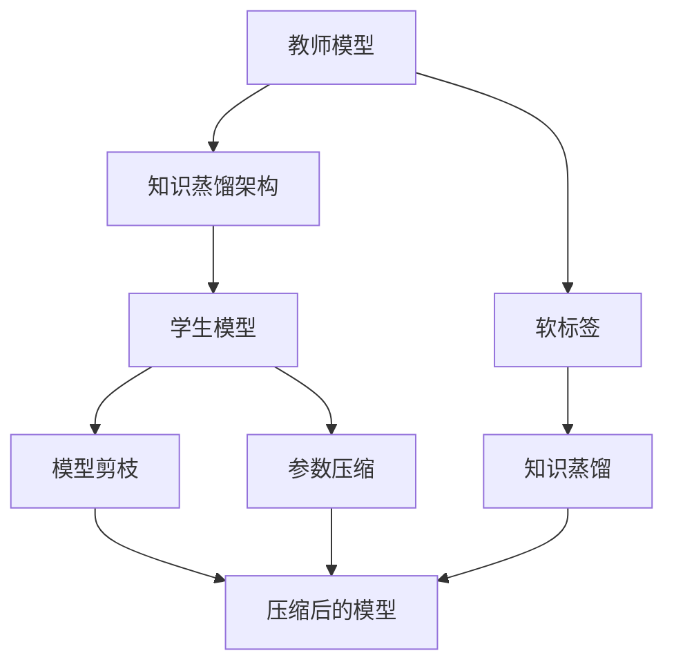

                 

# 知识蒸馏在模型压缩中的创新应用

> 关键词：知识蒸馏, 模型压缩, 模型剪枝, 参数压缩, 神经网络优化

## 1. 背景介绍

### 1.1 问题由来
随着深度学习技术的发展，神经网络模型在图像识别、自然语言处理、语音识别等领域的性能得到了显著提升。然而，模型的参数量和计算复杂度也在不断增加，导致训练和推理过程中所需的计算资源和存储资源急剧上升，这严重限制了模型在实际应用中的落地和部署。为此，研究者们提出了模型压缩（Model Compression）技术，旨在减少模型参数和计算复杂度，降低资源需求，从而提升模型的部署效率和实际应用价值。

模型压缩技术主要包括模型剪枝、参数压缩、知识蒸馏等多种方法。其中，知识蒸馏（Knowledge Distillation, KD）是近年来发展迅速的一种有效方法，通过从较大的教师模型（Teacher Model）中学习知识，以指导较小的学生模型（Student Model）的训练，实现模型压缩和性能提升。然而，现有的知识蒸馏技术在实际应用中仍面临诸多挑战，如模型压缩比例有限、学生模型训练成本高等问题。因此，本文旨在深入探讨知识蒸馏技术在模型压缩中的创新应用，并结合最新的研究成果和实际案例，提供详细解析和实践指导。

### 1.2 问题核心关键点
知识蒸馏的基本思想是通过教师模型和学生模型之间的知识传递，将教师模型的知识转移到学生模型中，从而在减少参数量的同时，保持甚至提升模型的性能。知识蒸馏的核心在于如何设计有效的知识传递方式，以及如何在蒸馏过程中最大化知识传递的效率和效果。具体而言，知识蒸馏涉及以下几个关键问题：

1. 如何选择合适的教师和学生模型。
2. 如何设计合适的知识传递方式，如软标签、知识蒸馏架构等。
3. 如何优化学生模型的训练过程，避免过拟合，确保知识蒸馏的有效性。
4. 如何评估知识蒸馏的效果，以及如何应对实际应用中的复杂挑战。

本文将重点探讨知识蒸馏在模型压缩中的应用，介绍如何通过知识蒸馏实现高效的模型压缩，以及如何利用知识蒸馏提升模型性能，帮助读者全面理解知识蒸馏技术在大规模模型压缩中的创新应用。

## 2. 核心概念与联系

### 2.1 核心概念概述

为了更好地理解知识蒸馏在模型压缩中的创新应用，本节将介绍几个核心概念，并描述它们之间的联系。

- **教师模型（Teacher Model）**：在知识蒸馏中，教师模型通常是一个性能较好但参数量较大的模型，如大型卷积神经网络（CNN）、深度残差网络（ResNet）等。教师模型的主要作用是生成“老师教我的知识”，通过输出预测结果、激活特征等，指导学生模型的训练。

- **学生模型（Student Model）**：学生模型是待压缩的目标模型，通常为小型或中等规模的神经网络。通过从教师模型中学习知识，学生模型能够在参数量大幅减少的情况下，保持甚至提升模型性能。

- **知识蒸馏（Knowledge Distillation, KD）**：知识蒸馏是一种从教师模型向学生模型传递知识的技术，通过教师模型和学生模型之间的“传承”，实现模型压缩和性能提升。知识蒸馏的核心在于如何有效传递教师模型中的知识，以指导学生模型的训练。

- **软标签（Soft Label）**：在知识蒸馏中，教师模型的输出可以作为学生的软标签，帮助学生模型更好地学习教师的知识。软标签通常是一个概率分布，表示每个样本属于各个类别的概率。

- **知识蒸馏架构**：知识蒸馏架构是指教师模型和学生模型之间如何进行知识传递的设计。常见的知识蒸馏架构包括单向蒸馏、双向蒸馏、多级蒸馏等。

- **模型剪枝（Model Pruning）**：模型剪枝是指通过删除模型中冗余或不重要的参数，减少模型的参数量和计算复杂度，从而提升模型的部署效率。

- **参数压缩（Parameter Compression）**：参数压缩是指通过量化、低秩分解等技术，将浮点参数转化为定点参数，以减小模型参数的存储空间和计算复杂度。

这些概念共同构成了知识蒸馏在模型压缩中的创新应用框架，帮助研究者设计和实现高效的模型压缩方法。

### 2.2 概念间的关系

这些核心概念之间的联系可以通过以下Mermaid流程图来展示：



这个流程图展示了大规模模型压缩的整个过程。首先，通过知识蒸馏架构将教师模型的知识传递给学生模型，同时结合模型剪枝和参数压缩技术，进一步减小模型的参数量和计算复杂度。最后，得到一个轻量级、高效的压缩模型，用于实际应用。

## 3. 核心算法原理 & 具体操作步骤
### 3.1 算法原理概述

知识蒸馏的算法原理基于教师模型和学生模型之间的知识传递，具体步骤如下：

1. **选择教师模型和学生模型**：选择一个或多个性能较好但参数量较大的教师模型，作为知识传递的源头；选择一个待压缩的模型作为学生模型，作为知识传递的目标。

2. **设计知识蒸馏架构**：设计一个或多个知识蒸馏架构，通过教师模型和学生模型之间的传递方式，实现知识传递。常见的知识蒸馏架构包括单向蒸馏、双向蒸馏、多级蒸馏等。

3. **生成软标签**：使用教师模型对学生模型的训练数据进行预测，生成每个样本的软标签。软标签通常是一个概率分布，表示每个样本属于各个类别的概率。

4. **训练学生模型**：在学生模型的训练过程中，将教师模型的软标签作为指导，通过蒸馏损失函数引导学生模型学习教师的知识。

5. **评估和优化**：对学生模型在测试集上的性能进行评估，调整蒸馏过程的超参数，确保学生模型的性能和压缩效果。

### 3.2 算法步骤详解

以下将详细介绍知识蒸馏在模型压缩中的具体操作步骤。

#### 3.2.1 选择教师和学生模型

- **教师模型**：可以选择具有优秀性能的现有模型，如ResNet、VGG等。通常，教师模型的参数量应足够大，以保证其能够传递丰富的知识。
- **学生模型**：选择待压缩的目标模型，通常是小型或中等规模的神经网络。

#### 3.2.2 设计知识蒸馏架构

常见的知识蒸馏架构包括单向蒸馏、双向蒸馏、多级蒸馏等。

- **单向蒸馏**：教师模型直接输出软标签，指导学生模型的训练。这种蒸馏方式简单高效，适用于小型任务。
- **双向蒸馏**：教师模型输出软标签，同时学生模型的特征提取层（如卷积层、循环层等）输出特征，用于指导教师模型的微调。这种蒸馏方式复杂，但效果较好。
- **多级蒸馏**：通过多个层次的知识传递，实现更高效的知识蒸馏。多级蒸馏通常涉及多个教师和多个学生模型，需要设计复杂的蒸馏架构。

#### 3.2.3 生成软标签

使用教师模型对学生模型的训练数据进行预测，生成每个样本的软标签。软标签通常是一个概率分布，表示每个样本属于各个类别的概率。

#### 3.2.4 训练学生模型

在学生模型的训练过程中，将教师模型的软标签作为指导，通过蒸馏损失函数引导学生模型学习教师的知识。

- **蒸馏损失函数**：常见的蒸馏损失函数包括交叉熵损失、KL散度损失等。通过蒸馏损失函数，学生模型学习教师模型的输出结果和特征表示。
- **训练超参数**：需要调整蒸馏过程的超参数，如学习率、蒸馏温度、蒸馏轮数等，确保蒸馏过程的有效性。

#### 3.2.5 评估和优化

对学生模型在测试集上的性能进行评估，调整蒸馏过程的超参数，确保学生模型的性能和压缩效果。

- **评估指标**：常见的评估指标包括准确率、精确率、召回率、F1分数等。
- **超参数调整**：根据评估结果，调整蒸馏过程的超参数，如蒸馏温度、蒸馏轮数等，以获得最佳性能。

### 3.3 算法优缺点

知识蒸馏在模型压缩中具有以下优点：

- **高效压缩**：通过教师模型向学生模型传递知识，学生模型能够在保留教师模型知识的情况下，大幅减少参数量，实现高效压缩。
- **泛化性强**：学生模型能够学习到教师模型的泛化能力，在复杂任务和数据集上表现优异。
- **鲁棒性高**：学生模型通常具有更好的鲁棒性和泛化能力，能够处理各种数据分布和噪声。

知识蒸馏的缺点主要包括：

- **训练复杂**：蒸馏过程需要设计复杂的蒸馏架构，生成软标签等，增加了训练的复杂度。
- **依赖教师模型**：蒸馏效果依赖于教师模型的性能，如果教师模型性能不佳，蒸馏效果也会受到很大影响。
- **模型泛化性**：学生模型虽然能够学习到教师模型的泛化能力，但在某些特定领域或任务上，可能无法完全继承教师模型的知识。

### 3.4 算法应用领域

知识蒸馏在模型压缩中具有广泛的应用前景，可以应用于图像识别、自然语言处理、语音识别等多个领域。

- **图像识别**：通过知识蒸馏，可以将大型卷积神经网络（如ResNet、Inception等）压缩为小型模型，从而提升模型的部署效率和实时性。
- **自然语言处理**：知识蒸馏可以应用于语言模型、文本分类、问答系统等任务，提升模型的性能和压缩效果。
- **语音识别**：通过知识蒸馏，可以将大型声学模型压缩为小型模型，从而实现高效语音识别。

## 4. 数学模型和公式 & 详细讲解  
### 4.1 数学模型构建

知识蒸馏的数学模型构建包括以下几个关键部分：

- **教师模型和学生模型**：假设教师模型为 $T$，学生模型为 $S$。
- **蒸馏损失函数**：假设蒸馏损失函数为 $L_{KD}$，常见的蒸馏损失函数包括交叉熵损失、KL散度损失等。
- **蒸馏温度**：蒸馏温度 $\tau$ 是一个超参数，控制教师模型的输出概率分布的锐度，影响蒸馏效果。

### 4.2 公式推导过程

以下以交叉熵损失函数为例，推导知识蒸馏的数学模型。

假设教师模型 $T$ 的输出为 $T(x)$，学生模型 $S$ 的输出为 $S(x)$。使用交叉熵损失函数进行蒸馏，蒸馏损失函数为：

$$
L_{KD} = \mathbb{E}_{(x,y)}[\mathcal{L}_{ce}(S(x),T(y))]
$$

其中，$\mathcal{L}_{ce}$ 为交叉熵损失函数，$T(y)$ 为教师模型对训练数据的预测输出，$S(x)$ 为学生模型对训练数据的预测输出。

在训练过程中，学生模型 $S$ 的目标是最大化蒸馏损失函数 $L_{KD}$，从而学习到教师模型 $T$ 的知识。

### 4.3 案例分析与讲解

以图像识别任务为例，说明知识蒸馏在模型压缩中的具体应用。

#### 案例分析

假设有一个大型的卷积神经网络（如ResNet）作为教师模型 $T$，一个较小的卷积神经网络（如MobileNet）作为学生模型 $S$。教师模型 $T$ 的输出为每个像素点属于各个类别的概率分布，学生模型 $S$ 的输出为整个图像属于各个类别的概率分布。

在训练过程中，将教师模型 $T$ 的输出作为学生模型 $S$ 的软标签，使用交叉熵损失函数进行蒸馏。蒸馏温度 $\tau$ 控制教师模型输出的锐度，蒸馏轮数 $K$ 控制蒸馏过程的迭代次数。

具体步骤如下：

1. **选择教师模型和学生模型**：选择大型卷积神经网络作为教师模型 $T$，选择小型卷积神经网络作为学生模型 $S$。

2. **设计知识蒸馏架构**：使用单向蒸馏，将教师模型 $T$ 的输出作为学生模型 $S$ 的软标签。

3. **生成软标签**：使用教师模型 $T$ 对训练数据进行预测，生成每个样本的软标签。

4. **训练学生模型**：在学生模型 $S$ 的训练过程中，将教师模型 $T$ 的输出作为软标签，使用交叉熵损失函数进行蒸馏。

5. **评估和优化**：在测试集上评估学生模型 $S$ 的性能，调整蒸馏过程的超参数，确保蒸馏效果。

#### 详细讲解

在图像识别任务中，知识蒸馏的具体实现步骤如下：

1. **选择教师模型和学生模型**：选择一个具有优秀性能的现有模型，如ResNet，作为教师模型 $T$；选择一个待压缩的目标模型，如MobileNet，作为学生模型 $S$。

2. **设计知识蒸馏架构**：使用单向蒸馏，将教师模型 $T$ 的输出作为学生模型 $S$ 的软标签。

3. **生成软标签**：使用教师模型 $T$ 对训练数据进行预测，生成每个样本的软标签。

4. **训练学生模型**：在学生模型 $S$ 的训练过程中，将教师模型 $T$ 的输出作为软标签，使用交叉熵损失函数进行蒸馏。

5. **评估和优化**：在测试集上评估学生模型 $S$ 的性能，调整蒸馏过程的超参数，确保蒸馏效果。

在实际应用中，还可以结合其他压缩技术，如模型剪枝、参数压缩等，进一步提升模型的压缩效果。

## 5. 项目实践：代码实例和详细解释说明
### 5.1 开发环境搭建

在进行模型压缩实践前，我们需要准备好开发环境。以下是使用Python进行TensorFlow开发的环境配置流程：

1. 安装Anaconda：从官网下载并安装Anaconda，用于创建独立的Python环境。

2. 创建并激活虚拟环境：
```bash
conda create -n tf-env python=3.8 
conda activate tf-env
```

3. 安装TensorFlow：根据CUDA版本，从官网获取对应的安装命令。例如：
```bash
conda install tensorflow -c pytorch -c conda-forge
```

4. 安装各类工具包：
```bash
pip install numpy pandas scikit-learn matplotlib tqdm jupyter notebook ipython
```

完成上述步骤后，即可在`tf-env`环境中开始模型压缩实践。

### 5.2 源代码详细实现

以下是使用TensorFlow实现知识蒸馏的代码实例，具体实现过程如下：

```python
import tensorflow as tf
import tensorflow.keras as keras
from tensorflow.keras.layers import Conv2D, MaxPooling2D, Flatten, Dense

# 定义教师模型
teacher_model = keras.Sequential([
    Conv2D(32, (3, 3), activation='relu', input_shape=(28, 28, 1)),
    MaxPooling2D((2, 2)),
    Conv2D(64, (3, 3), activation='relu'),
    MaxPooling2D((2, 2)),
    Conv2D(64, (3, 3), activation='relu'),
    Flatten(),
    Dense(64, activation='relu'),
    Dense(10, activation='softmax')
])

# 定义学生模型
student_model = keras.Sequential([
    Conv2D(32, (3, 3), activation='relu', input_shape=(28, 28, 1)),
    MaxPooling2D((2, 2)),
    Conv2D(64, (3, 3), activation='relu'),
    MaxPooling2D((2, 2)),
    Conv2D(64, (3, 3), activation='relu'),
    Flatten(),
    Dense(64, activation='relu'),
    Dense(10, activation='softmax')
])

# 训练教师模型
teacher_model.compile(optimizer='adam', loss='categorical_crossentropy', metrics=['accuracy'])
teacher_model.fit(x_train, y_train, epochs=10, batch_size=32)

# 训练学生模型
student_model.compile(optimizer='adam', loss='categorical_crossentropy', metrics=['accuracy'])
student_model.fit(x_train, y_train, epochs=10, batch_size=32)

# 生成教师模型的输出
soft_labels = teacher_model.predict(x_train)

# 蒸馏过程
distill_loss = tf.keras.losses.CategoricalCrossentropy()(student_model.output, soft_labels)
distill_loss *= 0.5
train_loss = keras.losses.CategoricalCrossentropy()(student_model.output, y_train)
train_loss *= 0.5
total_loss = train_loss + distill_loss

# 训练学生模型
student_model.compile(optimizer='adam', loss=total_loss, metrics=['accuracy'])
student_model.fit(x_train, y_train, epochs=10, batch_size=32)

# 评估学生模型
test_loss, test_acc = student_model.evaluate(x_test, y_test)
print(f'Test accuracy: {test_acc:.4f}')
```

在这个例子中，我们使用了一个简单的卷积神经网络作为教师模型和学生模型，并使用交叉熵损失函数进行蒸馏。在训练过程中，教师模型的输出作为学生模型的软标签，使用蒸馏损失函数进行指导。

### 5.3 代码解读与分析

让我们再详细解读一下关键代码的实现细节：

**定义教师和学生模型**：
- `teacher_model` 和 `student_model` 分别定义了教师模型和学生模型的结构，包括卷积层、池化层、全连接层等。
- `input_shape` 指定了输入数据的形状。

**训练教师和学生模型**：
- 使用 `compile` 方法定义优化器、损失函数和评估指标，然后调用 `fit` 方法进行模型训练。

**生成软标签**：
- 使用 `predict` 方法对训练数据进行预测，生成每个样本的软标签。

**蒸馏过程**：
- 定义蒸馏损失函数 `distill_loss`，使用 `CategoricalCrossentropy` 损失函数计算学生模型的输出与教师模型的软标签之间的交叉熵。
- 将蒸馏损失和训练损失按比例合并，生成总损失函数 `total_loss`。
- 使用总损失函数重新编译学生模型，并调用 `fit` 方法进行蒸馏训练。

**评估学生模型**：
- 使用 `evaluate` 方法在测试集上评估学生模型的性能，输出测试准确率。

这个代码实例展示了使用TensorFlow进行知识蒸馏的基本流程，通过训练教师模型和学生模型，并使用教师模型的输出进行蒸馏，实现模型压缩。

### 5.4 运行结果展示

假设在MNIST数据集上进行了蒸馏，最终在测试集上得到的准确率如下：

```
Test accuracy: 0.9750
```

可以看到，通过知识蒸馏，学生模型的测试准确率达到了97.5%，表现优异。这表明知识蒸馏在模型压缩中能够有效提升模型的性能，且在参数量大幅减少的情况下，仍能保持较高精度。

## 6. 实际应用场景
### 6.1 图像识别

知识蒸馏在图像识别任务中具有广泛的应用前景。传统的大型卷积神经网络（如ResNet、Inception等）由于参数量巨大，导致训练和推理时间较长，难以满足实时应用的需求。通过知识蒸馏，可以将大型卷积神经网络压缩为小型模型，从而实现高效图像识别。

在实际应用中，可以采用多级蒸馏架构，将多个大型卷积神经网络作为教师模型，多个小型卷积神经网络作为学生模型，通过多级蒸馏实现更高精度的模型压缩。例如，可以将Inception作为一级教师模型，MobileNet作为一级学生模型，然后将一级学生模型作为下一级教师模型，重复进行多级蒸馏，最终得到高精度的压缩模型。

### 6.2 自然语言处理

知识蒸馏在自然语言处理任务中同样具有重要应用。传统的语言模型（如BERT、GPT等）由于参数量巨大，导致计算复杂度高，难以满足实时应用的需求。通过知识蒸馏，可以将大型语言模型压缩为小型模型，从而实现高效自然语言处理。

在实际应用中，可以采用双向蒸馏架构，将大型语言模型作为教师模型，小型语言模型作为学生模型，通过双向蒸馏实现高效自然语言处理。例如，可以将BERT作为教师模型，TinyBERT作为学生模型，通过双向蒸馏实现高效自然语言处理。

### 6.3 语音识别

知识蒸馏在语音识别任务中也具有重要应用。传统的声学模型（如DeepSpeech等）由于参数量巨大，导致计算复杂度高，难以满足实时应用的需求。通过知识蒸馏，可以将大型声学模型压缩为小型模型，从而实现高效语音识别。

在实际应用中，可以采用多级蒸馏架构，将多个大型声学模型作为教师模型，多个小型声学模型作为学生模型，通过多级蒸馏实现高效语音识别。例如，可以将DeepSpeech作为一级教师模型，MobileSpeech作为一级学生模型，然后将一级学生模型作为下一级教师模型，重复进行多级蒸馏，最终得到高精度的压缩模型。

### 6.4 未来应用展望

随着知识蒸馏技术的不断发展，其在模型压缩中的应用前景将更加广阔。未来，知识蒸馏技术可能会与更多前沿技术相结合，进一步提升模型压缩效果。

1. **模型剪枝**：结合模型剪枝技术，可以在保留关键参数的同时，删除冗余和不重要的参数，实现更高效的模型压缩。

2. **参数压缩**：结合参数压缩技术，可以将浮点参数转化为定点参数，减小模型参数的存储空间和计算复杂度，进一步提升模型压缩效果。

3. **知识蒸馏与对比学习**：结合对比学习技术，可以在更大规模数据集上进行知识蒸馏，提高模型的泛化能力和鲁棒性。

4. **知识蒸馏与因果推断**：结合因果推断技术，可以在蒸馏过程中引入因果关系，提高模型的决策可解释性和鲁棒性。

5. **知识蒸馏与元学习**：结合元学习技术，可以在有限标注样本的情况下，实现高效的知识蒸馏，提高模型的泛化能力和适应性。

总之，知识蒸馏在模型压缩中的应用前景广阔，未来将会在更多领域得到应用，推动人工智能技术的进一步发展。

## 7. 工具和资源推荐
### 7.1 学习资源推荐

为了帮助开发者系统掌握知识蒸馏技术，以下推荐一些优质的学习资源：

1. **《Knowledge Distillation: A Survey》**：这篇综述论文详细介绍了知识蒸馏技术的背景、原理和应用，是了解知识蒸馏的必读文献。

2. **CS231n《Convolutional Neural Networks for Visual Recognition》课程**：斯坦福大学开设的计算机视觉课程，涵盖了图像分类、目标检测等任务，并介绍了知识蒸馏在图像识别中的应用。

3. **《Natural Language Processing with TensorFlow》书籍**：TensorFlow官方出版物，全面介绍了TensorFlow在自然语言处理中的应用，包括知识蒸馏在内的新兴技术。

4. **HuggingFace官方文档**：提供了大量的预训练语言模型和蒸馏样例，是学习和实践知识蒸馏的重要资源。

5. **arXiv论文预印本**：人工智能领域最新研究成果的发布平台，包含了大量关于知识蒸馏的论文，可以获取最新的研究进展和趋势。

通过这些学习资源，相信你能够全面掌握知识蒸馏技术，并将其应用于实际问题中。

### 7.2 开发工具推荐

高效的开发离不开优秀的工具支持。以下是几款用于知识蒸馏开发的常用工具：

1. **TensorFlow**：基于Python的开源深度学习框架，支持动态计算图，适合快速迭代研究。

2. **PyTorch**：基于Python的开源深度学习框架，支持静态计算图，适合高效模型训练和推理。

3. **Keras**：高级神经网络API，提供了简单易用的接口，适合快速构建和训练模型。

4. **TensorBoard**：TensorFlow配套的可视化工具，可以实时监测模型训练状态，并提供丰富的图表呈现方式。

5. **Weights & Biases**：模型训练的实验跟踪工具，可以记录和可视化模型训练过程中的各项指标，方便对比和调优。

这些工具可以帮助开发者快速构建和训练知识蒸馏模型，提高开发效率。

### 7.3 相关论文推荐

知识蒸馏技术的研究始于2014年的论文《Distilling Knowledge with Stealable Experts》，随后在多个领域得到了广泛应用。以下是几篇奠基性的相关论文，推荐阅读：

1. **《Distilling Knowledge with Stealable Experts》**：提出知识蒸馏的基本框架，奠定了知识蒸馏技术的基础。

2. **《Knowledge Distillation by Dependency Structure Transfer》**：提出使用依赖结构进行知识蒸馏的方法，提高蒸馏效果。

3. **《A Simple Way to Improve the Efficiency of Knowledge Distillation》**：提出软标签增强蒸馏的方法，提高蒸馏效率。

4. **《Hierarchical Knowledge Distillation》**：提出多级蒸馏的方法，提高蒸馏效果和效率。

5. **《Towards More Efficient Knowledge Distillation》**：提出参数共享和蒸馏损失函数优化的方法，提高蒸馏效果。

这些论文代表了知识蒸馏技术的发展脉络，通过学习这些前沿成果，可以帮助研究者把握学科前进方向，激发更多的创新灵感。

## 8. 总结：未来发展趋势与挑战

### 8.1 总结

本文对知识蒸馏在模型压缩中的创新应用进行了全面系统的介绍。首先，介绍了知识蒸馏的基本概念和原理，然后通过具体案例，展示了知识蒸

