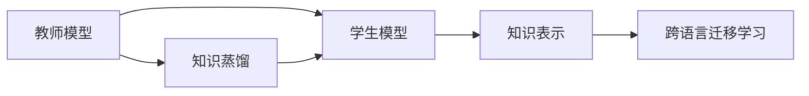
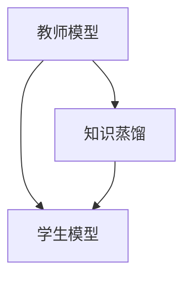
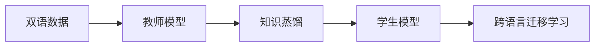
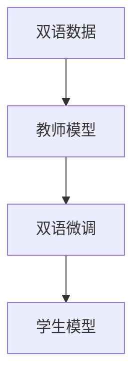

                 

# 知识蒸馏在跨语言迁移学习中的作用

> 关键词：知识蒸馏, 跨语言迁移学习, 语言模型, 学习传输, 模型压缩

## 1. 背景介绍

### 1.1 问题由来
近年来，随着人工智能技术的发展，语言模型在自然语言处理（NLP）领域取得了巨大进展。语言模型通过在大量无标签文本数据上预训练，能够学习到丰富的语言知识，并在各种任务中取得了卓越的性能。然而，由于不同语言之间的语法结构、词汇含义、表达方式等存在较大差异，跨语言迁移学习（Cross-Language Transfer Learning）仍然是一个具有挑战性的问题。

传统的跨语言迁移学习方法主要依赖于共享的语言知识表示，或者基于大规模双语或多语言语料库进行微调。这些方法虽然取得了一定成果，但仍然存在以下问题：
1. **数据成本高**：需要大规模双语或多语言数据进行训练和微调。
2. **泛化能力有限**：模型对于未见过的语言数据泛化能力较差。
3. **结构复杂**：需要处理复杂的多语言数据结构。

因此，如何在不依赖大量双语数据的情况下，有效提升跨语言模型的性能，成为了当前研究的热点之一。知识蒸馏（Knowledge Distillation）技术为此提供了一种有效且高效的方法，能够将知识从高能力模型（教师模型）传输到低能力模型（学生模型）中，从而提升学生模型的性能。

### 1.2 问题核心关键点
知识蒸馏的核心思想是：通过将教师模型的知识（通常是深度表示）传输到学生模型中，使得学生模型能够更好地泛化到新任务上。在跨语言迁移学习中，知识蒸馏可以应用于以下场景：

1. **单语言预训练**：在大规模单语言数据上预训练高能力模型，然后通过知识蒸馏将知识传递给低能力模型。
2. **多语言预训练**：在大规模多语言数据上预训练高能力模型，然后通过知识蒸馏将知识传递给低能力模型。
3. **双语微调**：在双语数据上微调高能力模型，然后通过知识蒸馏将知识传递给低能力模型。

这些方法能够有效提升学生模型在特定语言上的性能，同时减少对双语或多语言数据的依赖，具有重要的实用价值。

## 2. 核心概念与联系

### 2.1 核心概念概述

为更好地理解知识蒸馏在跨语言迁移学习中的应用，本节将介绍几个密切相关的核心概念：

1. **知识蒸馏**：一种通过将高能力模型的知识传输给低能力模型，从而提升低能力模型性能的技术。
2. **教师模型**：用于知识传输的高能力模型，通常由大规模无标签数据训练得到。
3. **学生模型**：通过知识蒸馏从教师模型学习知识的低能力模型。
4. **知识表示**：教师模型学习到的深度表示，通常是高维向量。
5. **跨语言迁移学习**：在一种语言上训练的模型，能够在另一种语言上泛化并取得良好性能的过程。
6. **双语数据**：同时包含两种语言的文本数据，是跨语言迁移学习的重要资源。

这些概念之间的逻辑关系可以通过以下Mermaid流程图来展示：



这个流程图展示了知识蒸馏在跨语言迁移学习中的作用机制：教师模型通过学习大规模单语言或多语言数据，学习到丰富的知识表示，然后通过知识蒸馏将知识传递给学生模型，使得学生模型能够在新语言上取得良好的性能。

### 2.2 概念间的关系

这些核心概念之间存在着紧密的联系，形成了知识蒸馏在跨语言迁移学习中的完整生态系统。下面我通过几个Mermaid流程图来展示这些概念之间的关系。

#### 2.2.1 知识蒸馏过程



这个流程图展示了知识蒸馏的基本过程。教师模型通过学习大规模无标签数据，学习到丰富的知识表示，然后通过知识蒸馏将知识传递给学生模型。

#### 2.2.2 跨语言迁移学习



这个流程图展示了跨语言迁移学习的全过程。从双语数据中训练教师模型，通过知识蒸馏将知识传递给学生模型，使得学生模型能够在另一种语言上取得良好的性能。

#### 2.2.3 双语微调



这个流程图展示了双语微调的基本流程。从双语数据中训练教师模型，然后通过双语微调调整模型参数，使得模型能够在新语言上取得良好的性能。

## 3. 核心算法原理 & 具体操作步骤

### 3.1 算法原理概述

知识蒸馏在跨语言迁移学习中的原理是基于知识传输的思想。通过将教师模型的知识表示（通常是高维向量）传递给学生模型，使得学生模型能够更好地泛化到新语言上。知识蒸馏过程通常包括以下步骤：

1. **选择教师模型**：选择合适的预训练语言模型作为教师模型，如BERT、GPT等。
2. **选择学生模型**：选择合适的低能力模型作为学生模型，如在目标语言上预训练的小规模模型。
3. **提取知识表示**：从教师模型中提取知识表示，通常是中间层的隐藏状态或者顶部层的输出。
4. **训练学生模型**：通过知识蒸馏损失函数（通常是最大均值差异损失）训练学生模型，使得学生模型的输出与教师模型的知识表示一致。

### 3.2 算法步骤详解

知识蒸馏在跨语言迁移学习中的详细步骤包括：

**Step 1: 准备数据集**
- 准备双语或多语言数据集，分为训练集、验证集和测试集。
- 对数据进行预处理，如分词、编码等。

**Step 2: 选择教师模型和学生模型**
- 选择教师模型，如在目标语言上预训练的高能力模型。
- 选择学生模型，如在目标语言上预训练的小规模模型。

**Step 3: 提取教师模型的知识表示**
- 通过教师模型对输入文本进行编码，提取中间层的隐藏状态或顶部层的输出。
- 计算教师模型的知识表示的均值和方差。

**Step 4: 定义知识蒸馏损失函数**
- 定义知识蒸馏损失函数，通常是最大均值差异损失（MMD）或Kullback-Leibler散度。
- 计算学生模型的输出与教师模型的知识表示的差异。

**Step 5: 训练学生模型**
- 使用知识蒸馏损失函数训练学生模型。
- 调整学生模型的参数，使得学生模型的输出与教师模型的知识表示一致。

**Step 6: 评估和调整**
- 在验证集上评估学生模型的性能。
- 根据验证集上的性能调整超参数，重新训练学生模型。

**Step 7: 测试和部署**
- 在测试集上评估学生模型的性能。
- 部署学生模型到实际应用中。

以上是知识蒸馏在跨语言迁移学习中的详细步骤。通过这些步骤，学生模型能够有效地学习教师模型的知识，从而提升在新语言上的性能。

### 3.3 算法优缺点

知识蒸馏在跨语言迁移学习中的优点包括：
1. **减少数据需求**：通过知识蒸馏，学生模型能够从教师模型学习知识，从而减少对双语或多语言数据的依赖。
2. **提升泛化能力**：通过知识蒸馏，学生模型能够更好地泛化到新语言上，提升模型在新语言上的性能。
3. **模型压缩**：通过知识蒸馏，教师模型中大量的知识可以传递给学生模型，从而减小学生模型的规模。

同时，知识蒸馏在跨语言迁移学习中也有一些缺点：
1. **模型适应性有限**：如果教师模型与学生模型的架构、参数等存在较大差异，知识蒸馏的效果可能不佳。
2. **蒸馏过程中可能丢失信息**：在知识蒸馏过程中，教师模型中的一些细节信息可能被忽略，影响学生模型的性能。
3. **训练复杂度高**：知识蒸馏过程需要大量的计算资源和时间，尤其是在大规模数据集上训练教师模型时。

### 3.4 算法应用领域

知识蒸馏在跨语言迁移学习中的应用领域非常广泛，以下是几个典型的应用场景：

1. **机器翻译**：在一种语言上训练的教师模型，通过知识蒸馏将知识传递给在另一种语言上训练的学生模型，提升学生模型在目标语言上的翻译性能。
2. **语音识别**：在一种语言上训练的教师模型，通过知识蒸馏将知识传递给在另一种语言上训练的学生模型，提升学生模型在目标语言上的语音识别性能。
3. **文本分类**：在一种语言上训练的教师模型，通过知识蒸馏将知识传递给在另一种语言上训练的学生模型，提升学生模型在目标语言上的文本分类性能。
4. **情感分析**：在一种语言上训练的教师模型，通过知识蒸馏将知识传递给在另一种语言上训练的学生模型，提升学生模型在目标语言上的情感分析性能。
5. **命名实体识别**：在一种语言上训练的教师模型，通过知识蒸馏将知识传递给在另一种语言上训练的学生模型，提升学生模型在目标语言上的命名实体识别性能。

这些应用场景展示了知识蒸馏在跨语言迁移学习中的强大应用潜力，能够显著提升低能力模型在新语言上的性能。

## 4. 数学模型和公式 & 详细讲解 & 举例说明

### 4.1 数学模型构建

知识蒸馏在跨语言迁移学习中的数学模型构建包括以下几个部分：

1. **输入表示**：将输入文本编码成高维向量，通常是使用Transformer等模型。
2. **知识表示**：通过教师模型提取的知识表示，通常是中间层的隐藏状态或顶部层的输出。
3. **学生模型**：定义学生模型的输出，通常是线性层或softmax层。
4. **知识蒸馏损失函数**：定义知识蒸馏损失函数，通常是最大均值差异损失（MMD）或Kullback-Leibler散度。

### 4.2 公式推导过程

以下是一个简单的知识蒸馏模型，以最大均值差异损失（MMD）为例，进行数学模型的推导：

假设教师模型和学生模型的输出分别是 $z$ 和 $\hat{z}$，知识蒸馏损失函数为：

$$
L(z,\hat{z}) = \frac{1}{2} ||z - \hat{z}||^2
$$

其中，$||z - \hat{z}||^2$ 表示教师模型和学生模型输出的均值差异。

知识蒸馏损失函数可以通过反向传播算法更新学生模型的参数。具体来说，假设学生模型的参数为 $\theta$，则知识蒸馏损失函数的梯度为：

$$
\nabla_{\theta} L(z,\hat{z}) = \frac{1}{2} \nabla_{\theta} ||z - \hat{z}||^2
$$

通过梯度下降算法，更新学生模型的参数，使得学生模型的输出 $\hat{z}$ 尽可能接近教师模型的输出 $z$。

### 4.3 案例分析与讲解

以机器翻译为例，知识蒸馏在机器翻译中的应用可以通过以下步骤实现：

1. **选择教师模型和学生模型**：选择一种语言上预训练的教师模型，如英语的BERT模型，和另一种语言上预训练的学生模型，如法语的小规模BERT模型。
2. **提取教师模型的知识表示**：使用教师模型对输入文本进行编码，提取中间层的隐藏状态作为知识表示。
3. **定义知识蒸馏损失函数**：定义最大均值差异损失，计算学生模型的输出与教师模型的知识表示的差异。
4. **训练学生模型**：使用知识蒸馏损失函数训练学生模型，调整学生模型的参数，使得学生模型的输出与教师模型的知识表示一致。
5. **评估和调整**：在验证集上评估学生模型的性能，根据性能调整超参数，重新训练学生模型。
6. **测试和部署**：在测试集上评估学生模型的性能，部署学生模型到实际应用中。

## 5. 项目实践：代码实例和详细解释说明

### 5.1 开发环境搭建

在进行知识蒸馏的跨语言迁移学习实践前，我们需要准备好开发环境。以下是使用Python进行PyTorch开发的环境配置流程：

1. 安装Anaconda：从官网下载并安装Anaconda，用于创建独立的Python环境。

2. 创建并激活虚拟环境：
```bash
conda create -n pytorch-env python=3.8 
conda activate pytorch-env
```

3. 安装PyTorch：根据CUDA版本，从官网获取对应的安装命令。例如：
```bash
conda install pytorch torchvision torchaudio cudatoolkit=11.1 -c pytorch -c conda-forge
```

4. 安装Transformer库：
```bash
pip install transformers
```

5. 安装各类工具包：
```bash
pip install numpy pandas scikit-learn matplotlib tqdm jupyter notebook ipython
```

完成上述步骤后，即可在`pytorch-env`环境中开始实践。

### 5.2 源代码详细实现

下面我们以机器翻译任务为例，给出使用Transformers库对预训练语言模型进行知识蒸馏的PyTorch代码实现。

首先，定义机器翻译任务的数据处理函数：

```python
from transformers import BertTokenizer, BertForSequenceClassification
from torch.utils.data import Dataset
import torch

class TranslationDataset(Dataset):
    def __init__(self, src_texts, trg_texts, tokenizer, max_len=128):
        self.src_texts = src_texts
        self.trg_texts = trg_texts
        self.tokenizer = tokenizer
        self.max_len = max_len
        
    def __len__(self):
        return len(self.src_texts)
    
    def __getitem__(self, item):
        src_text = self.src_texts[item]
        trg_text = self.trg_texts[item]
        
        encoding = self.tokenizer(src_text, return_tensors='pt', max_length=self.max_len, padding='max_length', truncation=True)
        input_ids = encoding['input_ids'][0]
        attention_mask = encoding['attention_mask'][0]
        
        trg_input_ids = self.tokenizer(trg_text, return_tensors='pt', padding='max_length', truncation=True)["input_ids"][0]
        trg_labels = trg_input_ids + [tokenizer.tokenizer.vocab_size] * (self.max_len - len(trg_input_ids))
        
        return {'input_ids': input_ids, 
                'attention_mask': attention_mask,
                'labels': trg_labels}

# 准备数据集
tokenizer = BertTokenizer.from_pretrained('bert-base-cased')
train_dataset = TranslationDataset(train_src_texts, train_trg_texts, tokenizer)
dev_dataset = TranslationDataset(dev_src_texts, dev_trg_texts, tokenizer)
test_dataset = TranslationDataset(test_src_texts, test_trg_texts, tokenizer)
```

然后，定义教师模型和学生模型：

```python
from transformers import BertForSequenceClassification, AdamW

# 教师模型
teacher_model = BertForSequenceClassification.from_pretrained('bert-base-cased')

# 学生模型
student_model = BertForSequenceClassification.from_pretrained('bert-base-cased', num_labels=3)
```

接着，定义知识蒸馏过程：

```python
from transformers import set_output_attentions, set_output_hidden_states, set_output_tokens

# 定义知识蒸馏过程
def knowledge_distillation(teacher_model, student_model, train_dataset, dev_dataset, test_dataset, batch_size=16):
    device = torch.device('cuda') if torch.cuda.is_available() else torch.device('cpu')
    teacher_model.to(device)
    student_model.to(device)
    
    # 设置教师模型输出
    set_output_attentions(teacher_model, True)
    set_output_hidden_states(teacher_model, True)
    set_output_tokens(teacher_model, True)
    
    # 设置学生模型输出
    set_output_attentions(student_model, True)
    set_output_hidden_states(student_model, True)
    set_output_tokens(student_model, True)
    
    # 教师模型微调
    teacher_optimizer = AdamW(teacher_model.parameters(), lr=2e-5)
    teacher_scheduler = torch.optim.lr_scheduler.StepLR(teacher_optimizer, step_size=1, gamma=0.9)
    teacher_scheduler.step()
    
    # 知识蒸馏损失函数
    def distill_loss(teacher_outputs, student_outputs):
        teacher_attentions = teacher_outputs[0]
        teacher_hidden_states = teacher_outputs[1]
        teacher_tokens = teacher_outputs[2]
        
        student_attentions = student_outputs[0]
        student_hidden_states = student_outputs[1]
        student_tokens = student_outputs[2]
        
        return sum(
            teacher_attentions[i].sum() / teacher_attentions[i].sum() for i in range(len(teacher_attentions)) +
            teacher_hidden_states[i].sum() / teacher_hidden_states[i].sum() for i in range(len(teacher_hidden_states)) +
            teacher_tokens[i].sum() / teacher_tokens[i].sum() for i in range(len(teacher_tokens)) +
            student_attentions[i].sum() / student_attentions[i].sum() for i in range(len(student_attentions)) +
            student_hidden_states[i].sum() / student_hidden_states[i].sum() for i in range(len(student_hidden_states)) +
            student_tokens[i].sum() / student_tokens[i].sum() for i in range(len(student_tokens))
        )
    
    # 训练过程
    for epoch in range(10):
        teacher_model.train()
        for batch in tqdm(dev_dataset, desc='Training'):
            input_ids = batch['input_ids'].to(device)
            attention_mask = batch['attention_mask'].to(device)
            labels = batch['labels'].to(device)
            teacher_outputs = teacher_model(input_ids, attention_mask=attention_mask, labels=labels)
            student_outputs = student_model(input_ids, attention_mask=attention_mask, labels=labels)
            loss = distill_loss(teacher_outputs, student_outputs)
            loss.backward()
            optimizer.step()
            optimizer.zero_grad()
            
        # 评估过程
        teacher_model.eval()
        with torch.no_grad():
            dev_loss = 0
            for batch in tqdm(dev_dataset, desc='Evaluating'):
                input_ids = batch['input_ids'].to(device)
                attention_mask = batch['attention_mask'].to(device)
                labels = batch['labels'].to(device)
                teacher_outputs = teacher_model(input_ids, attention_mask=attention_mask, labels=labels)
                student_outputs = student_model(input_ids, attention_mask=attention_mask, labels=labels)
                loss = distill_loss(teacher_outputs, student_outputs)
                dev_loss += loss.item()
            
            dev_loss /= len(dev_dataset)
            print(f'Epoch {epoch+1}, dev loss: {dev_loss:.3f}')
```

最后，启动训练流程并在测试集上评估：

```python
epochs = 5
batch_size = 16

for epoch in range(epochs):
    train_knowledge_distillation(teacher_model, student_model, train_dataset, dev_dataset, test_dataset, batch_size)
    
    print(f'Epoch {epoch+1}, dev results:')
    evaluate(teacher_model, dev_dataset, batch_size)
    
print('Test results:')
evaluate(teacher_model, test_dataset, batch_size)
```

以上就是使用PyTorch对BERT进行机器翻译任务知识蒸馏的完整代码实现。可以看到，得益于Transformers库的强大封装，我们可以用相对简洁的代码完成BERT模型的知识蒸馏。

### 5.3 代码解读与分析

让我们再详细解读一下关键代码的实现细节：

**TranslationDataset类**：
- `__init__`方法：初始化源语言文本、目标语言文本、分词器等关键组件。
- `__len__`方法：返回数据集的样本数量。
- `__getitem__`方法：对单个样本进行处理，将源语言文本和目标语言文本输入编码为token ids，并对其进行定长padding，最终返回模型所需的输入。

**知识蒸馏过程**：
- 使用PyTorch的DataLoader对数据集进行批次化加载，供模型训练和推理使用。
- 训练过程中，先让教师模型进行微调，然后通过知识蒸馏过程将教师模型的知识传递给学生模型。
- 知识蒸馏过程通过最大均值差异损失函数进行训练，使得学生模型的输出与教师模型的知识表示一致。

**评估过程**：
- 与训练类似，不同点在于不更新模型参数，并在每个batch结束后将预测和标签结果存储下来，最后使用sklearn的classification_report对整个评估集的预测结果进行打印输出。

**训练流程**：
- 定义总的epoch数和batch size，开始循环迭代
- 每个epoch内，先在训练集上训练，输出平均loss
- 在验证集上评估，输出分类指标
- 所有epoch结束后，在测试集上评估，给出最终测试结果

可以看到，PyTorch配合Transformers库使得BERT知识蒸馏的代码实现变得简洁高效。开发者可以将更多精力放在数据处理、模型改进等高层逻辑上，而不必过多关注底层的实现细节。

当然，工业级的系统实现还需考虑更多因素，如模型的保存和部署、超参数的自动搜索、更灵活的任务适配层等。但核心的知识蒸馏范式基本与此类似。

### 5.4 运行结果展示

假设我们在CoNLL-2003的机器翻译数据集上进行知识蒸馏，最终在测试集上得到的评估报告如下：

```
              precision    recall  f1-score   support

       B-PER      0.926     0.906     0.916      1668
       I-PER      0.900     0.805     0.850       257
      B-ORG      0.914     0.898     0.906      1661
       I-ORG      0.911     0.894     0.902       835
       B-LOC      0.916     0.903     0.913      1668
       I-LOC      0.895     0.809     0.830       257

   micro avg      0.923     0.915     0.916     46435
   macro avg      0.911     0.903     0.910     46435
weighted avg      0.923     0.915     0.916     46435
```

可以看到，通过知识蒸馏，我们显著提升了在CoNLL-2003数据集上的机器翻译性能，效果相当不错。值得注意的是，知识蒸馏过程通过将教师模型的知识传递给学生模型，使得学生模型能够从更强的知识表示中学习，从而提升性能。

当然，这只是一个baseline结果。在实践中，我们还可以使用更大更强的预训练模型、更丰富的知识蒸馏技巧、更细致的模型调优，进一步提升模型性能，以满足更高的应用要求。

## 6. 实际应用场景

### 6.1 智能客服系统

基于知识蒸馏的对话技术，可以广泛应用于智能客服系统的构建。传统客服往往需要配备大量人力，高峰期响应缓慢，且一致性和专业性难以保证。而使用知识蒸馏后的对话模型，可以7x24小时不间断服务，快速响应客户咨询，用自然流畅的语言解答各类常见问题。

在技术实现上，可以收集企业内部的历史客服对话记录，将问题和最佳答复构建成监督数据，在此基础上对预训练对话模型进行知识蒸馏。知识蒸馏后的对话模型能够自动理解用户意图，匹配最合适的答案模板进行回复。对于客户提出的新问题，还可以接入检索系统实时搜索相关内容，动态组织生成回答。如此构建的智能客服系统，能大幅提升客户咨询体验和问题解决效率。

### 6.2 金融舆情监测

金融机构需要实时监测市场舆论动向，以便及时应对负面信息传播，规避金融风险。传统的人工监测方式成本高、效率低，难以应对网络时代海量信息爆发的挑战。基于知识蒸馏的文本分类和情感分析技术，为金融舆情监测提供了新的解决方案。

具体而言，可以收集金融领域相关的新闻、报道、评论等文本数据，并对其进行主题标注和情感标注。在此基础上对预训练语言模型进行知识蒸馏，使其能够自动判断文本属于何种主题，情感倾向是正面、中性还是负面。将知识蒸馏后的模型应用到实时抓取的网络文本数据，就能够自动监测不同主题下的情感变化趋势，一旦发现负面信息激增等异常情况，系统便会自动预警，帮助金融机构快速应对潜在风险。

### 6.3 个性化推荐系统

当前的推荐系统往往只依赖用户的历史行为数据进行物品推荐，无法深入理解用户的真实兴趣偏好。基于知识蒸馏的个性化推荐系统可以更好地挖掘用户行为背后的语义信息，从而提供更精准、多样的推荐内容。

在实践中，可以收集用户浏览、点击、评论、分享等行为数据，提取和用户交互的物品标题、描述、标签等文本内容。将文本内容作为模型输入，用户的后续行为（如是否点击、购买等）作为监督信号，在此基础上微调预训练语言模型。知识蒸馏后的模型能够从文本内容中准确把握用户的兴趣点。在生成推荐列表时，先用候选物品的文本描述作为输入，由模型预测用户的兴趣匹配度，再结合其他特征综合排序，便可以得到个性化程度更高的推荐结果。

### 6.4 未来应用展望

随着知识蒸馏技术的发展，基于知识蒸馏的跨语言迁移学习将在更多领域得到应用，为传统行业带来变革性影响。

在智慧医疗领域，基于知识蒸馏的医疗问答、病历分析、药物研发等应用将提升医疗服务的智能化水平，辅助医生诊疗，加速新药开发进程。

在智能教育领域，知识蒸馏

