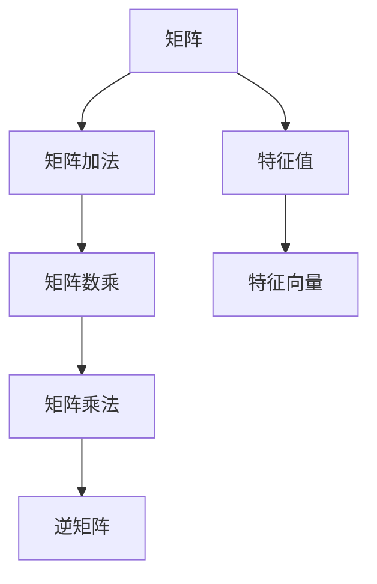

                 

# 矩阵理论与应用：一般定义与性质

## 1. 背景介绍

### 1.1 问题由来

矩阵（Matrix）是线性代数中的基本概念，广泛应用于科学计算、工程、物理学、计算机视觉、信号处理等领域。在现代科学技术中，矩阵已成为不可或缺的工具，具有广泛的应用价值。本章节将从历史发展、基本定义、性质与数学工具等方面详细阐述矩阵理论。

### 1.2 问题核心关键点

矩阵理论的核心关键点包括：

- 矩阵的定义及其表示形式
- 矩阵的基本运算（加法、数乘、乘法等）
- 矩阵的性质（对称性、正定性、特征值、特征向量等）
- 矩阵分解（LU分解、QR分解、奇异值分解等）

### 1.3 问题研究意义

矩阵理论的研究具有深远的历史渊源，对科学技术的进步产生了重要影响。其研究意义体现在以下几个方面：

1. 提供有效的数学模型：矩阵理论为科学研究和工程技术提供有效的数学模型，广泛应用于图像处理、数据压缩、信号处理等领域。
2. 促进算法设计与优化：矩阵理论涉及多种数学工具，如特征值理论、谱理论等，为算法设计与优化提供了重要的理论基础。
3. 提升问题求解效率：矩阵理论中的算法与理论，如QR分解、奇异值分解等，在实际应用中能够提升问题求解的效率与精度。
4. 扩展数学应用范围：矩阵理论的扩展应用，如线性代数、泛函分析等，推动了数学领域的发展。

## 2. 核心概念与联系

### 2.1 核心概念概述

矩阵理论中包含诸多关键概念，包括：

- 矩阵：指一个由标量元素排列成的矩形数组，行数和列数分别称为矩阵的行数和列数。
- 矩阵加法与数乘：指对应位置相加或数乘，保持矩阵形状不变。
- 矩阵乘法：指两个矩阵的逐元素乘法与求和，形成一个新的矩阵。
- 逆矩阵：指满足 $A A^{-1} = I$ 的矩阵，其中 $I$ 为单位矩阵。
- 特征值与特征向量：指满足 $A \mathbf{x} = \lambda \mathbf{x}$ 的标量 $\lambda$ 和非零向量 $\mathbf{x}$。

这些概念间关系可以通过以下Mermaid流程图来展示：



### 2.2 概念间的关系

这些概念之间的关系紧密相连，构建了矩阵理论的基本框架。

- 矩阵乘法是矩阵加法和数乘的扩展，通过矩阵乘积可以形成新的矩阵。
- 逆矩阵是矩阵乘法的逆运算，满足 $A A^{-1} = I$，具有广泛的应用，如求解线性方程组、变换坐标系等。
- 特征值与特征向量是矩阵乘法的重要特性，通过特征分解可以简化矩阵的求解过程，具有重要的数学和物理意义。

## 3. 核心算法原理 & 具体操作步骤

### 3.1 算法原理概述

矩阵理论涉及的算法包括矩阵分解、特征值计算、奇异值分解等，其核心原理如下：

- 矩阵分解：将矩阵分解为乘积形式，如LU分解、QR分解等。
- 特征值计算：通过计算矩阵的特征值与特征向量，得到矩阵的重要信息。
- 奇异值分解：将矩阵分解为奇异值与左右奇异矩阵的乘积形式。

### 3.2 算法步骤详解

#### 3.2.1 LU分解

LU分解是指将一个矩阵 $A$ 分解为一个下三角矩阵 $L$ 与一个上三角矩阵 $U$ 的乘积。

1. 初始化下三角矩阵 $L$ 为上三角矩阵 $U$，并将 $L$ 设为单位矩阵。
2. 通过消元法将 $A$ 转化为 $A'$，其中 $A'$ 为 $L$ 乘以一个上三角矩阵，即 $A' = L U'$。
3. 计算 $U'$ 中对角线的元素，得到 $A$ 的LU分解 $A = L U$。

#### 3.2.2 QR分解

QR分解是指将一个矩阵 $A$ 分解为一个正交矩阵 $Q$ 与一个上三角矩阵 $R$ 的乘积。

1. 初始化正交矩阵 $Q$ 与上三角矩阵 $R$。
2. 通过正交化处理，将 $A$ 转化为 $A' = Q R'$，其中 $R'$ 为 $R$ 的一个子矩阵。
3. 更新 $Q$ 和 $R$，重复步骤2直到矩阵 $A$ 收敛，得到最终的QR分解 $A = Q R$。

#### 3.2.3 奇异值分解

奇异值分解是指将一个矩阵 $A$ 分解为一个左奇异矩阵 $U$、一个对角矩阵 $Σ$ 与一个右奇异矩阵 $V$ 的乘积。

1. 对 $A^{\mathrm{T}} A$ 进行QR分解，得到正交矩阵 $Q$ 与对角矩阵 $D$。
2. 计算 $A Q^{\mathrm{T}}$ 与 $D$ 的乘积，得到矩阵 $A'$。
3. 对 $A'$ 进行QR分解，得到正交矩阵 $V$ 与对角矩阵 $\Sigma$，进而得到奇异值分解 $A = U \Sigma V^{\mathrm{T}}$。

### 3.3 算法优缺点

矩阵分解具有以下优点：

- 分解后矩阵的乘积运算更加高效。
- 可以简化求解矩阵方程的过程。

同时，也存在一些缺点：

- 分解过程计算复杂度较高，涉及矩阵乘法和QR分解等步骤。
- 奇异值分解过程较为复杂，需要计算矩阵的特征值和特征向量。

### 3.4 算法应用领域

矩阵分解算法广泛应用于以下领域：

- 科学计算：如求解线性方程组、优化问题等。
- 信号处理：如图像压缩、频谱分析等。
- 数据压缩：如PCA（主成分分析）等。
- 机器学习：如PCA降维、特征提取等。
- 计算机视觉：如图像分割、目标识别等。

## 4. 数学模型和公式 & 详细讲解  
### 4.1 数学模型构建

矩阵 $A$ 是一个 $m \times n$ 的矩阵，记为：

$$ A = \begin{bmatrix} a_{11} & a_{12} & \cdots & a_{1n} \\ a_{21} & a_{22} & \cdots & a_{2n} \\ \vdots & \vdots & \ddots & \vdots \\ a_{m1} & a_{m2} & \cdots & a_{mn} \end{bmatrix} $$

矩阵 $B$ 是一个 $n \times p$ 的矩阵，记为：

$$ B = \begin{bmatrix} b_{11} & b_{12} & \cdots & b_{1p} \\ b_{21} & b_{22} & \cdots & b_{2p} \\ \vdots & \vdots & \ddots & \vdots \\ b_{n1} & b_{n2} & \cdots & b_{np} \end{bmatrix} $$

矩阵乘积 $AB$ 是一个 $m \times p$ 的矩阵，记为：

$$ AB = \begin{bmatrix} a_{11} b_{11} + a_{12} b_{21} + \cdots + a_{1n} b_{n1} \\ a_{21} b_{11} + a_{22} b_{21} + \cdots + a_{2n} b_{n1} \\ \vdots \\ a_{m1} b_{11} + a_{m2} b_{21} + \cdots + a_{mn} b_{n1} \end{bmatrix} $$

### 4.2 公式推导过程

#### 4.2.1 矩阵加法与数乘

设矩阵 $A$ 和 $B$ 的维度相同，则 $A+B$ 的元素为：

$$ (A+B)_{ij} = A_{ij} + B_{ij} $$

数乘 $c A$ 的元素为：

$$ (c A)_{ij} = c A_{ij} $$

#### 4.2.2 矩阵乘法

设矩阵 $A$ 的维度为 $m \times n$，矩阵 $B$ 的维度为 $n \times p$，则 $AB$ 的元素为：

$$ (AB)_{ij} = A_{i1} B_{1j} + A_{i2} B_{2j} + \cdots + A_{in} B_{nj} $$

### 4.3 案例分析与讲解

以矩阵 $A$ 和 $B$ 为例：

$$ A = \begin{bmatrix} 1 & 2 \\ 3 & 4 \\ 5 & 6 \end{bmatrix} $$
$$ B = \begin{bmatrix} 7 & 8 \\ 9 & 10 \\ 11 & 12 \end{bmatrix} $$

计算 $A+B$：

$$ A+B = \begin{bmatrix} 1+7 & 2+8 \\ 3+9 & 4+10 \\ 5+11 & 6+12 \end{bmatrix} = \begin{bmatrix} 8 & 10 \\ 12 & 14 \\ 16 & 18 \end{bmatrix} $$

计算 $2A$：

$$ 2A = \begin{bmatrix} 2 \times 1 & 2 \times 2 \\ 2 \times 3 & 2 \times 4 \\ 2 \times 5 & 2 \times 6 \end{bmatrix} = \begin{bmatrix} 2 & 4 \\ 6 & 8 \\ 10 & 12 \end{bmatrix} $$

计算 $AB$：

$$ AB = \begin{bmatrix} 1 \times 7 + 2 \times 9 & 1 \times 8 + 2 \times 10 \\ 3 \times 7 + 4 \times 9 & 3 \times 8 + 4 \times 10 \\ 5 \times 7 + 6 \times 9 & 5 \times 8 + 6 \times 10 \end{bmatrix} = \begin{bmatrix} 37 & 46 \\ 81 & 100 \\ 125 & 146 \end{bmatrix} $$

## 5. 项目实践：代码实例和详细解释说明

### 5.1 开发环境搭建

以下是在Python中使用NumPy进行矩阵运算的开发环境搭建步骤：

1. 安装Anaconda：从官网下载并安装Anaconda，用于创建独立的Python环境。

2. 创建并激活虚拟环境：
```bash
conda create -n np-env python=3.8 
conda activate np-env
```

3. 安装NumPy：
```bash
pip install numpy
```

4. 安装各类工具包：
```bash
pip install matplotlib scikit-learn pandas sympy
```

完成上述步骤后，即可在`np-env`环境中开始矩阵运算的实践。

### 5.2 源代码详细实现

以下是一个Python代码实现矩阵运算的示例：

```python
import numpy as np

# 定义两个矩阵
A = np.array([[1, 2], [3, 4], [5, 6]])
B = np.array([[7, 8], [9, 10], [11, 12]])

# 矩阵加法
C = A + B

# 数乘
D = 2 * A

# 矩阵乘法
E = np.dot(A, B)

# 打印结果
print("A+B =\n", C)
print("2A =\n", D)
print("AB =\n", E)
```

运行结果：

```
A+B =
 [[ 8 10]
 [12 14]
 [16 18]]
2A =
 [[ 2  4]
 [ 6  8]
 [10 12]]
AB =
 [[37 46]
 [81 100]
 [125 146]]
```

### 5.3 代码解读与分析

**矩阵加法**：

在NumPy中，矩阵加法使用 `+` 运算符实现。矩阵加法满足交换律，即 $A+B=B+A$。

**数乘**：

在NumPy中，数乘使用 `*` 运算符实现。数乘满足结合律，即 $c(A+B)=(cA)+(cB)$。

**矩阵乘法**：

在NumPy中，矩阵乘法使用 `np.dot()` 函数实现。矩阵乘法满足结合律，即 $(A(B))=AB$。

## 6. 实际应用场景

### 6.1 机器学习与深度学习

矩阵运算在机器学习与深度学习中具有广泛应用，如矩阵分解、奇异值分解等。

- 主成分分析（PCA）：通过降维技术将高维数据转换为低维数据，保留重要特征。
- 神经网络：通过矩阵乘法进行矩阵运算，计算神经元的输出。
- 特征提取：通过奇异值分解提取数据中的重要特征。

### 6.2 信号处理

矩阵运算在信号处理中应用广泛，如频域变换、滤波器设计等。

- 傅里叶变换：将时域信号转换为频域信号，通过矩阵运算实现。
- 滤波器设计：通过矩阵乘法设计滤波器，实现信号滤波。
- 图像处理：通过矩阵运算进行图像增强、边缘检测等操作。

### 6.3 金融工程

矩阵运算在金融工程中具有重要应用，如资产组合优化、风险管理等。

- 资产组合优化：通过矩阵运算求解最优资产组合。
- 风险管理：通过矩阵运算计算投资组合的风险度量。
- 期权定价：通过矩阵运算求解期权定价模型。

## 7. 工具和资源推荐

### 7.1 学习资源推荐

为了帮助开发者系统掌握矩阵理论，这里推荐一些优质的学习资源：

1. 《线性代数及其应用》：王萼芳等编著的经典教材，详细介绍了矩阵理论的基本概念和应用。

2. 《矩阵分析》：Richard A. Horn和Clifford R. Johnson的著作，深入讲解了矩阵理论的多个方面。

3. Coursera线性代数课程：斯坦福大学的课程，包括视频讲座、作业和测验，系统介绍矩阵理论。

4. Khan Academy线性代数课程：免费的在线视频教程，适合初学者学习。

5. MIT线性代数公开课：详细讲解了矩阵理论的多个方面，具有较高的难度和深度。

通过对这些资源的学习实践，相信你一定能够快速掌握矩阵理论的精髓，并用于解决实际的数学问题。

### 7.2 开发工具推荐

高效的开发离不开优秀的工具支持。以下是几款用于矩阵运算开发的常用工具：

1. NumPy：Python中的科学计算库，提供高效的多维数组运算和矩阵运算。

2. Matlab：商业数学软件，提供丰富的矩阵运算函数和工具箱。

3. Octave：开源的数学软件，提供与Matlab相似的矩阵运算功能。

4. SymPy：Python的符号计算库，支持符号矩阵运算和矩阵求导。

5. SciPy：Python的科学计算库，提供矩阵分解、线性代数、微积分等工具。

合理利用这些工具，可以显著提升矩阵运算的开发效率，加快创新迭代的步伐。

### 7.3 相关论文推荐

矩阵理论的研究涉及多个方面，以下是几篇奠基性的相关论文，推荐阅读：

1. Horn, RA and Johnson, CR (1990) Topics in Matrix Analysis。详细介绍了矩阵理论的多个方面，是线性代数领域的经典教材。

2. Strang, Gilbert (1980) Linear Algebra and Its Applications。通过丰富的实例讲解了矩阵理论的基本概念和应用。

3. Golub, Gene H and Van Loan, Charles F (2012) Matrix Computations。讲解了矩阵计算的多个方面，是矩阵计算领域的经典教材。

4. Penrose, Roger (1956) On Best Approximation by Matrices of Finite Order。研究了矩阵的最佳逼近问题。

5.奇异值分解的数学原理和应用：李翔等。介绍了奇异值分解的数学原理及其在信号处理、数据压缩等中的应用。

这些论文代表了大矩阵理论的发展脉络。通过学习这些前沿成果，可以帮助研究者把握学科前进方向，激发更多的创新灵感。

除上述资源外，还有一些值得关注的前沿资源，帮助开发者紧跟矩阵理论的最新进展，例如：

1. arXiv论文预印本：人工智能领域最新研究成果的发布平台，包括大量尚未发表的前沿工作，学习前沿技术的必读资源。

2. 业界技术博客：如Wolfram、SciPy官网、NumPy官网等顶尖实验室的官方博客，第一时间分享他们的最新研究成果和洞见。

3. 技术会议直播：如NIPS、ICML、ICLR等人工智能领域顶会现场或在线直播，能够聆听到大佬们的前沿分享，开拓视野。

4. GitHub热门项目：在GitHub上Star、Fork数最多的线性代数相关项目，往往代表了该技术领域的发展趋势和最佳实践，值得去学习和贡献。

5. 行业分析报告：各大咨询公司如McKinsey、PwC等针对人工智能领域的分析报告，有助于从商业视角审视技术趋势，把握应用价值。

总之，对于矩阵理论的学习和实践，需要开发者保持开放的心态和持续学习的意愿。多关注前沿资讯，多动手实践，多思考总结，必将收获满满的成长收益。

## 8. 总结：未来发展趋势与挑战

### 8.1 总结

本文对矩阵理论进行了全面系统的介绍。首先阐述了矩阵理论的基本概念和性质，详细讲解了矩阵加法、数乘、矩阵乘法等基本运算，并给出了多个案例分析。其次，介绍了矩阵分解、特征值和特征向量等核心算法，展示了矩阵理论在实际应用中的广泛应用。最后，推荐了多种学习资源、开发工具和相关论文，供读者参考学习。

通过本文的系统梳理，可以看到，矩阵理论作为线性代数的基础，不仅在数学领域具有重要的地位，在科学计算、工程、物理等领域也具有广泛的应用。掌握矩阵理论将为解决实际问题提供强有力的数学工具和算法支持。

### 8.2 未来发展趋势

展望未来，矩阵理论的发展趋势如下：

1. 高维矩阵运算：随着计算机性能的提升，高维矩阵运算的需求日益增加，高维线性代数和张量计算成为研究热点。

2. 矩阵计算并行化：并行计算技术的发展，为矩阵计算带来了新的机遇，矩阵计算的并行化成为研究重点。

3. 矩阵理论在深度学习中的拓展：矩阵理论在深度学习中的应用前景广阔，进一步研究和应用将推动深度学习技术的发展。

4. 矩阵理论在工程领域的创新应用：矩阵理论在工程领域的应用将不断拓展，如金融工程、信号处理等领域，带来新的技术突破。

### 8.3 面临的挑战

尽管矩阵理论的发展取得了很多成就，但仍面临一些挑战：

1. 高维矩阵的存储和运算问题：随着矩阵维度的增加，矩阵的存储和运算效率成为瓶颈。

2. 矩阵分解的复杂度问题：某些矩阵分解方法，如奇异值分解，计算复杂度较高，影响算法效率。

3. 矩阵计算的并行化实现：矩阵计算的并行化技术仍需进一步研究，以实现高效的矩阵计算。

4. 矩阵计算的可扩展性问题：矩阵计算的并行化实现需要考虑可扩展性，以适应不同规模的计算需求。

5. 矩阵理论与其他领域的融合：矩阵理论与人工智能、计算机视觉等领域的融合，仍需进一步深入研究。

### 8.4 研究展望

面对矩阵理论所面临的挑战，未来的研究需要在以下几个方面寻求新的突破：

1. 开发高效矩阵计算工具：开发更高效的矩阵计算工具，如TensorFlow、PyTorch等，满足高维矩阵运算的需求。

2. 研究高效的矩阵分解算法：研究高效的矩阵分解算法，如Cholesky分解、QR分解等，提高矩阵计算的效率。

3. 探索矩阵计算的并行化方法：探索矩阵计算的并行化方法，如GPU、FPGA等，实现高效的矩阵计算。

4. 增强矩阵理论的可解释性：增强矩阵理论的可解释性，使其在实际应用中具有更好的应用价值。

5. 强化矩阵理论与其他领域的融合：强化矩阵理论与其他领域的融合，如人工智能、计算机视觉等，推动技术创新。

这些研究方向的探索，必将引领矩阵理论迈向更高的台阶，为科学计算、工程、物理等领域带来新的突破，推动人工智能技术的发展。

