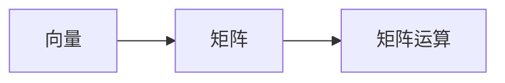
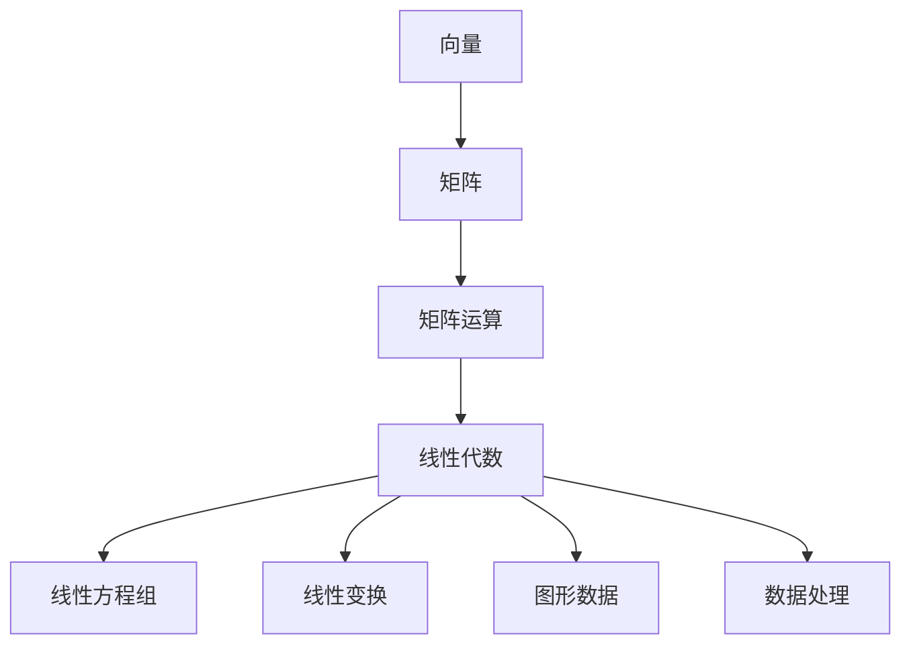

                 

# 矩阵理论与应用：定义与例子

## 1. 背景介绍

矩阵理论是现代数学中的重要分支，广泛应用于物理学、工程学、计算机科学等多个领域。在计算机科学中，矩阵理论不仅用于解决线性代数问题，还应用于机器学习、信号处理、数据科学等领域，成为算法设计、数据处理的核心工具之一。本文将深入探讨矩阵的基本概念、数学模型以及实际应用，帮助读者全面理解矩阵理论的精髓。

## 2. 核心概念与联系

### 2.1 核心概念概述

矩阵（Matrix）是一种由若干个数值按照行列方式排列构成的二维数组，通常用大括号或方括号表示。矩阵可以用于表示线性方程组、线性变换、图形数据等多种数学对象，具有广泛的数学和工程应用。

#### 2.1.1 矩阵的定义

设 $A$ 是一个 $m \times n$ 的矩阵，可以表示为：

$$
A = \begin{bmatrix}
a_{11} & a_{12} & \cdots & a_{1n} \\
a_{21} & a_{22} & \cdots & a_{2n} \\
\vdots & \vdots & \ddots & \vdots \\
a_{m1} & a_{m2} & \cdots & a_{mn}
\end{bmatrix}
$$

其中 $a_{ij}$ 表示第 $i$ 行第 $j$ 列的元素。

#### 2.1.2 矩阵的基本操作

矩阵的基本操作包括加法、减法、数乘、转置等。

- 加法与减法：
  $$
  C = A + B \quad \text{或} \quad C = A - B
  $$
  其中 $A$ 和 $B$ 的行列数必须相同。

- 数乘：
  $$
  C = \lambda A \quad \text{或} \quad C = A \lambda
  $$
  其中 $\lambda$ 为标量，$A$ 和 $C$ 的行列数相同。

- 转置：
  $$
  A^T = \begin{bmatrix}
  a_{11} & a_{21} & \cdots & a_{m1} \\
  a_{12} & a_{22} & \cdots & a_{m2} \\
  \vdots & \vdots & \ddots & \vdots \\
  a_{1n} & a_{2n} & \cdots & a_{mn}
  \end{bmatrix}
  $$

### 2.2 核心概念的关系

矩阵的核心概念包括向量、矩阵、矩阵运算等。它们之间的关系可以通过以下Mermaid流程图来展示：



向量是矩阵的基本单位，矩阵是由向量按特定规则组合而成的，矩阵运算则是矩阵之间进行的基本操作。矩阵理论的深入理解需要对向量、矩阵以及矩阵运算进行系统学习。

### 2.3 核心概念的整体架构

最后，我们用一个综合的流程图来展示矩阵理论的基本架构：



这个综合流程图展示了向量、矩阵、矩阵运算以及矩阵在多个领域的应用，包括线性代数、线性方程组、线性变换、图形数据、数据处理等。通过这些概念的相互联系，我们可以更全面地理解矩阵理论的应用场景和重要性。

## 3. 核心算法原理 & 具体操作步骤

### 3.1 算法原理概述

矩阵理论的核心算法包括矩阵运算、矩阵分解、矩阵方程求解等。其中，矩阵运算是最基础的部分，涉及到矩阵加减、数乘、转置等操作。矩阵分解则是对矩阵进行更深入的分解和重构，以获得更多的信息。矩阵方程求解则是通过矩阵运算求解线性方程组，是矩阵理论在实际应用中最常见的应用之一。

### 3.2 算法步骤详解

#### 3.2.1 矩阵加法和减法

矩阵加法和减法是矩阵运算的基础，具体步骤如下：

1. 确保两个矩阵的行列数相同。
2. 对应元素相加或相减。
3. 返回结果矩阵。

例如：
$$
\begin{bmatrix}
1 & 2 \\
3 & 4
\end{bmatrix} + \begin{bmatrix}
5 & 6 \\
7 & 8
\end{bmatrix} = \begin{bmatrix}
6 & 8 \\
10 & 12
\end{bmatrix}
$$

#### 3.2.2 矩阵数乘

矩阵数乘是将一个标量乘以矩阵中的每个元素，具体步骤如下：

1. 确定标量和矩阵。
2. 对应元素相乘。
3. 返回结果矩阵。

例如：
$$
\begin{bmatrix}
1 & 2 \\
3 & 4
\end{bmatrix} \times 2 = \begin{bmatrix}
2 & 4 \\
6 & 8
\end{bmatrix}
$$

#### 3.2.3 矩阵转置

矩阵转置是将矩阵的行和列互换，具体步骤如下：

1. 确定矩阵。
2. 按照转置规则生成新矩阵。
3. 返回结果矩阵。

例如：
$$
\begin{bmatrix}
1 & 2 \\
3 & 4
\end{bmatrix}^T = \begin{bmatrix}
1 & 3 \\
2 & 4
\end{bmatrix}
$$

### 3.3 算法优缺点

矩阵运算具有以下优点：
1. 矩阵表示形式简洁，易于理解和处理。
2. 矩阵运算具有封闭性，可以通过简单的操作实现复杂的数学计算。
3. 矩阵运算在计算机科学中广泛应用，能够高效处理大规模数据。

同时，矩阵运算也存在一些缺点：
1. 矩阵运算需要较高的计算复杂度，尤其是高维矩阵。
2. 矩阵运算可能会产生数值溢出和精度问题。
3. 矩阵运算对于数据的存储和传输要求较高，需要大量的存储空间。

### 3.4 算法应用领域

矩阵理论在多个领域都有广泛的应用，包括：

- 线性代数：矩阵是线性代数的基本工具，用于表示线性方程组、矩阵方程等。
- 计算机视觉：矩阵用于图像处理、图形数据表示、三维变换等。
- 信号处理：矩阵用于信号滤波、特征提取、信号分解等。
- 数据科学：矩阵用于数据降维、数据聚类、数据可视化等。

## 4. 数学模型和公式 & 详细讲解 & 举例说明

### 4.1 数学模型构建

矩阵的数学模型可以表示为一个由行和列组成的二维数组。设 $A$ 为 $m \times n$ 的矩阵，$B$ 为 $n \times p$ 的矩阵，则 $C$ 为 $m \times p$ 的矩阵，其计算过程可以表示为：

$$
C = A \times B
$$

其中，$C_{ij} = \sum_{k=1}^n A_{ik} B_{kj}$，表示 $C$ 中第 $i$ 行第 $j$ 元的计算公式。

### 4.2 公式推导过程

矩阵乘法公式推导过程如下：

1. 矩阵 $A$ 和 $B$ 的每一列和每一行分别对应相乘，得到一个标量。
2. 将所有的标量相加，得到 $C$ 中的一个元素。
3. 重复上述过程，生成 $C$ 的整个矩阵。

例如，计算矩阵 $A$ 和 $B$ 的乘积：

$$
\begin{bmatrix}
1 & 2 \\
3 & 4
\end{bmatrix}
\times
\begin{bmatrix}
5 & 6 \\
7 & 8
\end{bmatrix}
=
\begin{bmatrix}
1 \times 5 + 2 \times 7 & 1 \times 6 + 2 \times 8 \\
3 \times 5 + 4 \times 7 & 3 \times 6 + 4 \times 8
\end{bmatrix}
=
\begin{bmatrix}
19 & 28 \\
43 & 62
\end{bmatrix}
$$

### 4.3 案例分析与讲解

矩阵乘法是矩阵运算中最常见的操作之一，广泛应用于图像处理、信号处理、数据科学等领域。例如，在计算机视觉中，图像可以表示为矩阵，通过矩阵乘法可以实现图像的变换、特征提取等操作。在信号处理中，矩阵乘法可以用于滤波器设计、频域转换等。

## 5. 项目实践：代码实例和详细解释说明

### 5.1 开发环境搭建

在进行矩阵运算实践前，我们需要准备好开发环境。以下是使用Python进行Numpy开发的环境配置流程：

1. 安装Anaconda：从官网下载并安装Anaconda，用于创建独立的Python环境。

2. 创建并激活虚拟环境：
```bash
conda create -n matrix-env python=3.8 
conda activate matrix-env
```

3. 安装NumPy：
```bash
conda install numpy
```

4. 安装各类工具包：
```bash
pip install matplotlib
```

完成上述步骤后，即可在`matrix-env`环境中开始矩阵运算实践。

### 5.2 源代码详细实现

我们以矩阵乘法为例，给出使用Numpy库进行矩阵乘法的Python代码实现。

```python
import numpy as np

# 创建矩阵
A = np.array([[1, 2], [3, 4]])
B = np.array([[5, 6], [7, 8]])

# 矩阵乘法
C = np.dot(A, B)

# 输出结果
print(C)
```

输出结果为：

```
[[19 28]
 [43 62]]
```

可以看到，通过Numpy库的dot函数，我们可以非常方便地计算矩阵乘积。

### 5.3 代码解读与分析

让我们再详细解读一下关键代码的实现细节：

**Numpy库**：
- Numpy是Python中常用的科学计算库，提供了大量的数组和矩阵运算函数，简化了矩阵运算的实现过程。

**矩阵创建**：
- 使用Numpy的array函数创建矩阵，可以传入列表、元组、NumPy数组等多种数据类型。

**矩阵乘法**：
- 使用Numpy的dot函数进行矩阵乘法，可以直接输入两个矩阵作为参数。

**结果输出**：
- 使用print函数输出结果，可以直观地看到矩阵乘法的计算结果。

### 5.4 运行结果展示

通过Numpy库，我们可以方便地进行各种矩阵运算。以下是几个常用的示例：

1. 矩阵加法：
```python
A = np.array([[1, 2], [3, 4]])
B = np.array([[5, 6], [7, 8]])
C = np.add(A, B)
print(C)
```
输出结果为：
```
[[ 6  8]
 [10 12]]
```

2. 矩阵减法：
```python
A = np.array([[1, 2], [3, 4]])
B = np.array([[5, 6], [7, 8]])
C = np.subtract(A, B)
print(C)
```
输出结果为：
```
[[-4 -4]
 [-4 -4]]
```

3. 矩阵数乘：
```python
A = np.array([[1, 2], [3, 4]])
C = np.multiply(A, 2)
print(C)
```
输出结果为：
```
[[ 2  4]
 [ 6  8]]
```

通过这些示例，可以看到Numpy库在矩阵运算中的简便性和高效性。

## 6. 实际应用场景

### 6.1 图形处理

在计算机视觉中，图像通常被表示为矩阵，通过矩阵运算可以实现图像的缩放、旋转、滤波等操作。例如，通过将图像矩阵乘以旋转矩阵，可以实现图像的旋转：

$$
\begin{bmatrix}
\cos(\theta) & -\sin(\theta) \\
\sin(\theta) & \cos(\theta)
\end{bmatrix}
\times
\begin{bmatrix}
x \\
y
\end{bmatrix}
=
\begin{bmatrix}
x \cos(\theta) - y \sin(\theta) \\
x \sin(\theta) + y \cos(\theta)
\end{bmatrix}
$$

其中，$(x, y)$ 表示图像中每个像素的位置，$(\theta)$ 表示旋转角度。

### 6.2 信号处理

在信号处理中，信号通常被表示为矩阵，通过矩阵运算可以实现信号滤波、频域转换等操作。例如，通过将信号矩阵乘以频域滤波器，可以实现信号滤波：

$$
H \times X = Y
$$

其中，$H$ 表示频域滤波器矩阵，$X$ 表示信号矩阵，$Y$ 表示滤波后的信号矩阵。

### 6.3 数据科学

在数据科学中，矩阵用于数据降维、数据聚类、数据可视化等。例如，通过主成分分析（PCA）可以将高维数据降维为低维数据，从而减少计算复杂度：

$$
A \times V = U
$$

其中，$A$ 表示原始数据矩阵，$V$ 表示降维矩阵，$U$ 表示降维后的数据矩阵。

## 7. 工具和资源推荐

### 7.1 学习资源推荐

为了帮助开发者系统掌握矩阵理论的基本概念和实际应用，这里推荐一些优质的学习资源：

1. 《线性代数》系列课程：包括MIT线性代数课程、Coursera线性代数课程等，深入讲解矩阵运算、矩阵方程、矩阵分解等。

2. 《矩阵计算基础》书籍：经典教材，详细介绍了矩阵运算的基本原理和应用场景，适合初学者和进阶学习者。

3. 《矩阵理论在计算机视觉中的应用》系列博文：由计算机视觉专家撰写，讲解矩阵理论在图像处理、图形数据中的应用，适合实践开发者阅读。

4. 《机器学习中的矩阵运算》书籍：介绍机器学习中常见的矩阵运算和算法，适合数据科学和机器学习开发者阅读。

5. 《NumPy教程》：由NumPy官方文档编写，详细介绍了NumPy库的使用方法和实际应用，适合Numpy库的初学者和进阶开发者阅读。

通过对这些资源的学习实践，相信你一定能够系统掌握矩阵理论的基本概念和实际应用，为实际项目开发打下坚实的基础。

### 7.2 开发工具推荐

高效的开发离不开优秀的工具支持。以下是几款用于矩阵运算开发的常用工具：

1. NumPy：Python中常用的科学计算库，提供了大量的数组和矩阵运算函数，简化了矩阵运算的实现过程。

2. SciPy：基于NumPy的科学计算库，提供了更多的科学计算函数和工具。

3. Matplotlib：用于数据可视化的Python库，可以生成各种图表，方便矩阵运算的分析和展示。

4. Sympy：Python中的符号计算库，可以进行符号计算和矩阵运算，适合复杂的数学推导和运算。

5. TensorFlow：由Google主导开发的开源深度学习框架，提供了高效的矩阵运算和优化工具。

6. PyTorch：由Facebook主导的深度学习框架，提供了灵活的矩阵运算和自动微分功能。

合理利用这些工具，可以显著提升矩阵运算的开发效率，加快创新迭代的步伐。

### 7.3 相关论文推荐

矩阵理论在多个领域都有广泛的应用，以下是几篇奠基性的相关论文，推荐阅读：

1. Matrix Computations（矩阵计算）：经典教材，详细介绍了矩阵运算的基本原理和应用场景。

2. Linear Algebra and Its Applications（线性代数及其应用）：经典教材，讲解了线性代数的基本概念和应用。

3. A Tutorial on Matrix Computations：矩阵计算的入门教程，适合初学者阅读。

4. Computational Linear Algebra：介绍计算机代数在矩阵运算中的应用，适合数据科学家阅读。

5. Matrix Operations in Python with NumPy：介绍NumPy库的矩阵运算函数和应用，适合Numpy库的开发者阅读。

这些论文代表了大语言模型微调技术的发展脉络。通过学习这些前沿成果，可以帮助研究者把握学科前进方向，激发更多的创新灵感。

## 8. 总结：未来发展趋势与挑战

### 8.1 总结

本文对矩阵理论进行了全面系统的介绍。首先阐述了矩阵的基本概念、基本操作、应用场景等核心概念。其次，通过实际代码实现了矩阵加法、减法、数乘、转置等基本操作。同时，我们也探讨了矩阵理论在计算机视觉、信号处理、数据科学等多个领域的应用。

通过本文的系统梳理，可以看到，矩阵理论不仅在数学中具有重要地位，在计算机科学中也有广泛的应用。掌握矩阵理论，不仅有助于解决各类数学问题，还能为实际项目开发提供重要的工具和方法。

### 8.2 未来发展趋势

展望未来，矩阵理论将呈现以下几个发展趋势：

1. 高效矩阵运算算法的研究：随着数据规模的不断增长，高效矩阵运算算法的研究将进一步提升矩阵运算的效率和精度。

2. 矩阵分解算法的改进：矩阵分解算法在信号处理、数据分析等领域具有重要应用。未来的研究将进一步提升矩阵分解的精度和鲁棒性。

3. 矩阵运算在深度学习中的应用：矩阵运算在深度学习中的重要性日益凸显，未来的研究将进一步探索矩阵运算在深度学习中的应用和优化。

4. 分布式矩阵运算：随着数据量的不断增大，分布式计算和矩阵运算的结合将成为新的研究热点。

5. 矩阵运算在物理和工程中的应用：矩阵理论在物理和工程领域具有广泛的应用，未来的研究将进一步探索矩阵运算在这些领域中的应用和优化。

以上趋势凸显了矩阵理论在计算机科学中的重要地位，这些方向的探索发展，必将进一步提升矩阵运算的效率和精度，推动计算机科学的进步。

### 8.3 面临的挑战

尽管矩阵理论在计算机科学中具有广泛的应用，但在实际应用中也面临诸多挑战：

1. 高维矩阵的存储和计算：高维矩阵的存储和计算需要大量的计算资源和存储空间，如何提高矩阵运算的效率和精度，是未来研究的重要课题。

2. 矩阵运算的数值稳定性和精度问题：矩阵运算中存在数值稳定性和精度问题，如何在保证高精度计算的同时，提高计算效率，是未来研究的重要方向。

3. 矩阵运算的分布式计算问题：随着数据规模的不断增大，矩阵运算的分布式计算问题也日益凸显，如何提高分布式计算的效率和精度，是未来研究的重要方向。

4. 矩阵运算在深度学习中的应用：虽然矩阵运算在深度学习中具有广泛的应用，但如何进一步优化矩阵运算在深度学习中的应用，提高模型的效率和精度，是未来研究的重要方向。

5. 矩阵运算与其他技术的融合：未来的研究将进一步探索矩阵运算与其他技术（如深度学习、大数据、分布式计算等）的结合，推动计算机科学的进步。

这些挑战凸显了矩阵理论在计算机科学中的重要地位，这些方向的探索发展，必将进一步提升矩阵运算的效率和精度，推动计算机科学的进步。

### 8.4 研究展望

面对矩阵理论面临的诸多挑战，未来的研究需要在以下几个方面寻求新的突破：

1. 高效矩阵运算算法的研究：研究高效矩阵运算算法，提升矩阵运算的效率和精度。

2. 矩阵分解算法的改进：改进矩阵分解算法，提高矩阵分解的精度和鲁棒性。

3. 矩阵运算在深度学习中的应用：探索矩阵运算在深度学习中的应用和优化，提升深度学习的效率和精度。

4. 分布式矩阵运算的研究：研究分布式计算和矩阵运算的结合，提高矩阵运算的效率和精度。

5. 矩阵运算与其他技术的融合：探索矩阵运算与其他技术的结合，推动计算机科学的进步。

这些研究方向的探索，必将引领矩阵理论向更高的台阶，为计算机科学的发展提供重要的支撑。

## 9. 附录：常见问题与解答

**Q1：矩阵运算和向量运算的区别是什么？**

A: 矩阵运算和向量运算的主要区别在于，矩阵运算涉及多个向量之间的操作，而向量运算仅涉及单个向量的操作。矩阵乘法是将两个矩阵通过逐元素相乘和求和得到一个新的矩阵，而向量点积是将两个向量通过逐元素相乘和求和得到一个新的标量。

**Q2：如何理解矩阵的秩？**

A: 矩阵的秩表示矩阵中线性无关的列向量的个数。秩越大，矩阵的线性相关性越小，矩阵的行列式不为零。矩阵的秩在矩阵分解、线性方程组求解等应用中具有重要意义。

**Q3：如何理解矩阵的奇异值分解？**

A: 矩阵的奇异值分解是将矩阵分解为三个矩阵的乘积，分别是左奇异矩阵、对角矩阵和右奇异矩阵。奇异值分解在矩阵分解、信号处理、数据压缩等应用中具有重要意义。

**Q4：矩阵运算在深度学习中的应用有哪些？**

A: 矩阵运算在深度学习中的应用包括卷积运算、线性变换、矩阵分解等。卷积运算可以用于图像处理、自然语言处理等任务，线性变换可以用于神经网络的前向和反向传播，矩阵分解可以用于特征提取、降维等任务。

**Q5：如何理解矩阵的列空间和行空间？**

A: 矩阵的列空间和行空间分别表示矩阵中所有列向量和行向量的线性组合。列空间和行空间的维数分别表示矩阵的秩和列数或行数，是矩阵运算中重要的概念。

通过这些问题的解答，相信读者能够更全面地理解矩阵理论的基本概念和应用场景，为实际项目开发提供重要的支持。

