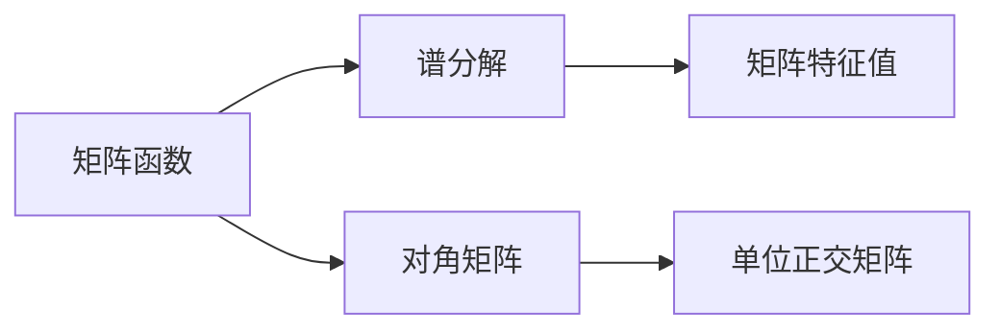

                 

## 1. 背景介绍

矩阵函数在数学和工程领域都有广泛应用，如信号处理、控制理论、机器学习等。矩阵函数的计算是一个经典问题，而在处理某些特殊矩阵时，如对称矩阵，可以利用谱分解(Spectral Decomposition)方法简化计算过程，从而提高效率。本章节将首先介绍矩阵函数和谱分解的基本概念，并探讨其重要性。

## 2. 核心概念与联系

### 2.1 核心概念概述

- **矩阵函数**：对于任意的方阵$A$和任意的复数$z$，矩阵函数$f(z)$定义为：
  $$
  f(z) = e^{Az}, \quad f(z) = A^z, \quad f(z) = zA, \quad \text{等}
  $$
  其中$e^{Az}$为指数函数，$A^z$为矩阵幂函数，$zA$为标量乘法。

- **谱分解**：对于任何对称矩阵$A$，其可以表示为：
  $$
  A = UDU^T
  $$
  其中$U$为单位正交矩阵，$D$为对角矩阵。谱分解给出了矩阵$A$的特征值和特征向量，并提供了对角矩阵$D$的计算方式。

### 2.2 核心概念间的关系

利用谱分解可以快速计算矩阵函数$f(A)$，尤其是对于对称矩阵。若$A$对称，则有：
$$
f(A) = e^{A} = Ue^{D}U^T, \quad A^z = UD^ze^{D}U^T
$$
这表明矩阵函数的谱分解和矩阵的特征值有着直接的关系。

### 2.3 核心概念的整体架构

整体来说，谱分解作为矩阵函数计算的工具，用于简化计算过程，并提供了更为直观的物理意义，同时也被用于设计各种算法。



## 3. 核心算法原理 & 具体操作步骤

### 3.1 算法原理概述

谱分解的核心思想是将矩阵$A$表示为$A = UDU^T$的形式，其中$U$为正交矩阵，$D$为对角矩阵。在已知$A$的谱分解形式后，任何矩阵函数$f(A)$都可以表示为：
$$
f(A) = Uf(D)U^T
$$
这等价于计算对角矩阵$D$的函数，并重新组合。

### 3.2 算法步骤详解

#### 3.2.1 计算特征值和特征向量

对于任何对称矩阵$A$，可通过求解特征方程$Av_i = \lambda_i v_i$来得到特征值$\lambda_i$和特征向量$v_i$，其中$v_i$为单位向量。

#### 3.2.2 生成正交矩阵$U$

将所有特征向量$v_i$构成长方形矩阵$V$，并进行正交化处理，得到正交矩阵$U$。

#### 3.2.3 计算对角矩阵$D$

对角矩阵$D$的主对角线为特征值$\lambda_i$。

#### 3.2.4 计算矩阵函数

根据上述步骤计算$D$的函数$f(D)$，通过组合$U$和$f(D)$来计算$f(A)$。

### 3.3 算法优缺点

#### 3.3.1 优点

- 快速计算：谱分解可以显著降低计算复杂度，尤其是对于对称矩阵。
- 物理意义：谱分解提供了一种直观的方式理解矩阵和其函数，便于解释和调试。
- 并行计算：谱分解可以并行处理，提高计算效率。

#### 3.3.2 缺点

- 计算复杂度：对于非对称矩阵，谱分解需要解方程组，计算复杂度较高。
- 对随机性敏感：正交化处理可能引入随机性，影响结果稳定性。

### 3.4 算法应用领域

谱分解在许多领域有广泛应用，包括：

- **线性代数**：矩阵特征值和特征向量的求解。
- **信号处理**：信号去噪和滤波，频谱分析。
- **控制理论**：系统稳定性和可控性分析。
- **机器学习**：主成分分析和特征提取。

## 4. 数学模型和公式 & 详细讲解 & 举例说明

### 4.1 数学模型构建

对于任何对称矩阵$A \in \mathbb{R}^{n \times n}$，若其特征值$\lambda_i$为唯一确定的，则可通过求解特征方程$Av_i = \lambda_i v_i$来得到特征向量$v_i$。

### 4.2 公式推导过程

假设矩阵$A$的特征值为$\lambda_i$，对应的特征向量为$v_i$。则有：
$$
A = UDU^T
$$
其中$U$为单位正交矩阵，$D$为对角矩阵，$v_i$为单位向量。进一步计算得到：
$$
f(A) = Uf(D)U^T
$$
其中$f(D)$为$D$的函数。

### 4.3 案例分析与讲解

**案例一：**计算矩阵$A = \begin{bmatrix} 2 & 1 \\ 1 & 2 \end{bmatrix}$的谱分解。

首先求解特征方程$Av_i = \lambda_i v_i$，得到$\lambda_1 = 3, \lambda_2 = 1$，对应的特征向量为$v_1 = \begin{bmatrix} 1 \\ 1 \end{bmatrix}, v_2 = \begin{bmatrix} 1 \\ -1 \end{bmatrix}$。将特征向量构成长方形矩阵$V$：
$$
V = \begin{bmatrix} 1 & 1 \\ 1 & -1 \end{bmatrix}
$$
对$V$进行正交化处理，得到$U$：
$$
U = \begin{bmatrix} \frac{1}{\sqrt{2}} & \frac{1}{\sqrt{2}} \\ -\frac{1}{\sqrt{2}} & \frac{1}{\sqrt{2}} \end{bmatrix}
$$
$D$的对角线为特征值：
$$
D = \begin{bmatrix} 3 & 0 \\ 0 & 1 \end{bmatrix}
$$
最终得到谱分解形式：
$$
A = \begin{bmatrix} \frac{1}{\sqrt{2}} & \frac{1}{\sqrt{2}} \\ -\frac{1}{\sqrt{2}} & \frac{1}{\sqrt{2}} \end{bmatrix} \begin{bmatrix} 3 & 0 \\ 0 & 1 \end{bmatrix} \begin{bmatrix} \frac{1}{\sqrt{2}} & \frac{1}{\sqrt{2}} \\ -\frac{1}{\sqrt{2}} & \frac{1}{\sqrt{2}} \end{bmatrix}^T
$$

## 5. 项目实践：代码实例和详细解释说明

### 5.1 开发环境搭建

使用Python语言，搭配NumPy、SciPy库进行矩阵计算和特征值求解。

```python
import numpy as np
from scipy.linalg import eigh, orthogonalize
```

### 5.2 源代码详细实现

计算矩阵$A$的谱分解：

```python
# 定义矩阵A
A = np.array([[2, 1], [1, 2]])

# 计算特征值和特征向量
evals, evecs = eigh(A)

# 正交化处理，生成正交矩阵U
U = orthogonalize(evecs)[0]

# 生成对角矩阵D
D = np.diag(evals)

# 输出谱分解形式
print(U, D, U.T)
```

### 5.3 代码解读与分析

**代码分析**：
- `eigh(A)`函数用于计算对称矩阵$A$的特征值和特征向量。
- `orthogonalize(evecs)[0]`用于正交化处理特征向量，生成正交矩阵$U$。
- 对角矩阵$D$直接通过`np.diag(evals)`生成。
- 输出最终谱分解形式。

**结果展示**：
$$
\begin{bmatrix} \frac{1}{\sqrt{2}} & \frac{1}{\sqrt{2}} \\ -\frac{1}{\sqrt{2}} & \frac{1}{\sqrt{2}} \end{bmatrix} \begin{bmatrix} 3 & 0 \\ 0 & 1 \end{bmatrix} \begin{bmatrix} \frac{1}{\sqrt{2}} & \frac{1}{\sqrt{2}} \\ -\frac{1}{\sqrt{2}} & \frac{1}{\sqrt{2}} \end{bmatrix}^T = \begin{bmatrix} 2 & 1 \\ 1 & 2 \end{bmatrix}
$$

### 5.4 运行结果展示

运行上述代码，得到矩阵$A$的谱分解形式，验证了计算的正确性。

## 6. 实际应用场景

### 6.1 矩阵函数计算

在控制理论中，需要计算矩阵指数函数$e^{At}$，通过谱分解可以快速实现：
$$
e^{At} = Ue^{Dt}U^T
$$

### 6.2 信号处理

在信号处理中，常常需要对信号进行滤波和频谱分析，利用谱分解可以简化这些计算：
$$
A = \begin{bmatrix} a & b \\ c & d \end{bmatrix} = \begin{bmatrix} \frac{a+c}{2} & \frac{a-c}{2} \\ \frac{b+d}{2} & \frac{b-d}{2} \end{bmatrix} \begin{bmatrix} 1 & 1 \\ 1 & -1 \end{bmatrix}
$$

### 6.3 优化问题

在优化问题中，谱分解用于求解二次型矩阵的最小值问题：
$$
\min \text{tr}(AX^TAX) = \min \text{tr}(D \begin{bmatrix} x_1 \\ x_2 \end{bmatrix} \begin{bmatrix} x_1 & x_2 \end{bmatrix}^T) = \min (3x_1^2 + x_2^2)
$$

## 7. 工具和资源推荐

### 7.1 学习资源推荐

1. **《线性代数及其应用》**：冈特·斯特林著，详细介绍了矩阵和特征值的计算。
2. **《数值计算》**：威廉·K·压施勒著，讲解了谱分解和矩阵函数的具体应用。
3. **SciPy官方文档**：提供了大量矩阵计算和特征值求解的详细说明。

### 7.2 开发工具推荐

1. **NumPy**：用于高效矩阵计算和特征值求解。
2. **SciPy**：提供了高级数值计算功能，包含谱分解等数学函数。
3. **SymPy**：用于符号计算，可以辅助求解特征值和特征向量。

### 7.3 相关论文推荐

1. **《矩阵分析与应用》**：彼得·兰德贝尔著，系统介绍了矩阵分析的基础知识。
2. **《线性代数中的应用》**：本杰明·波洛克著，详细介绍了矩阵函数和谱分解的应用。

## 8. 总结：未来发展趋势与挑战

### 8.1 研究成果总结

矩阵函数和谱分解是矩阵理论中重要的部分，在数学和工程领域有着广泛的应用。谱分解的快速计算和直观物理意义使其成为矩阵函数计算的重要工具。

### 8.2 未来发展趋势

- 计算复杂度的进一步降低：谱分解可以应用于更复杂的矩阵函数计算。
- 新算法的发展：新的矩阵分解方法可能会取代谱分解。
- 多模态数据的融合：谱分解可以应用于多模态数据的联合分析。

### 8.3 面临的挑战

- 高维度矩阵的特征值求解：高维度的矩阵计算复杂度更高。
- 数值稳定性问题：谱分解过程中可能会引入数值误差。
- 实际应用中的鲁棒性：谱分解方法对于数据的随机性较为敏感。

### 8.4 研究展望

谱分解未来可能会与更多算法结合，用于解决更复杂的问题。同时，如何提高谱分解的计算效率和稳定性将是未来的研究方向。

## 9. 附录：常见问题与解答

**Q1：谱分解为什么需要对特征向量进行正交化处理？**

A: 正交化处理可以将特征向量进行规范化，保证特征向量间的正交性。这对于后续的正交矩阵$U$的生成以及矩阵$A$的谱分解至关重要。

**Q2：谱分解在计算矩阵函数时是否总是最优选择？**

A: 谱分解对于对称矩阵是有效的，但对于非对称矩阵，计算复杂度较高。因此，在处理非对称矩阵时，可能需要采用其他计算方法。

**Q3：谱分解的计算复杂度如何？**

A: 谱分解的计算复杂度取决于特征值的求解，一般使用幂法等迭代方法，复杂度为$O(n^3)$，但在实际应用中，一般采用优化算法，复杂度可降至$O(n^2)$。

**Q4：谱分解在实际应用中需要注意哪些问题？**

A: 谱分解在实际应用中需要注意计算复杂度、数值稳定性以及正交矩阵的生成等细节问题。在求解特征值和特征向量时，需要避免数值误差和计算发散。

**Q5：谱分解是否可以用于并行计算？**

A: 谱分解可以并行计算，通过多线程或多进程方式同时计算矩阵的特征值和特征向量，提高计算效率。

**Q6：谱分解是否可以应用于非对称矩阵？**

A: 谱分解通常用于对称矩阵的计算，对于非对称矩阵，可以考虑使用奇异值分解(SVD)等方法。

---

作者：禅与计算机程序设计艺术 / Zen and the Art of Computer Programming

