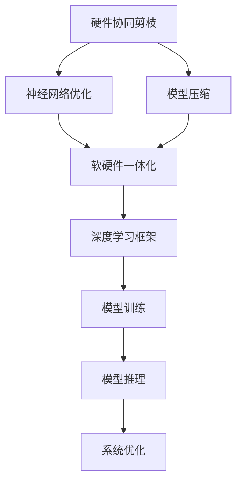
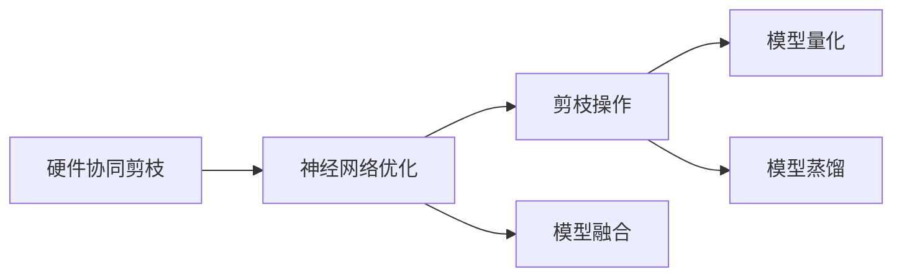
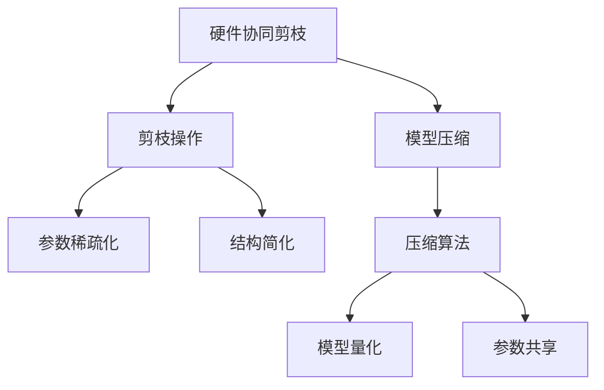
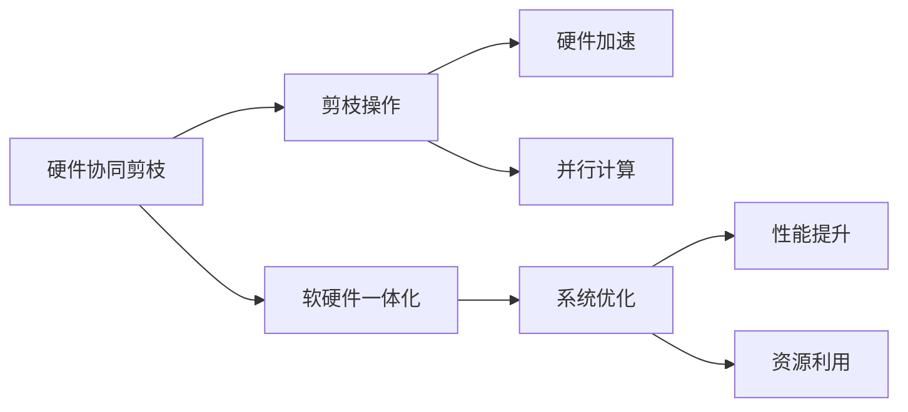
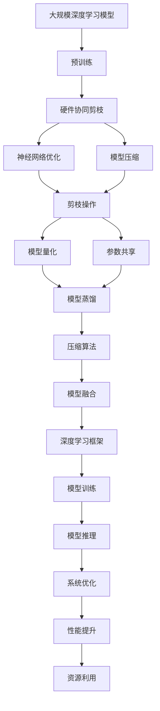

                 

# 硬件协同剪枝：软硬件一体化的压缩策略

> 关键词：硬件协同剪枝, 软硬件一体化, 压缩策略, 神经网络优化, 模型压缩

## 1. 背景介绍

### 1.1 问题由来
随着深度学习模型的快速发展，神经网络结构变得越来越庞大，对计算资源的需求也随之激增。然而，现有的计算硬件资源无法满足大规模模型的训练和推理需求。因此，如何优化模型结构，减少计算量，提高计算效率，成为了当前深度学习研究的一个重要方向。

### 1.2 问题核心关键点
模型压缩（Model Compression），即在不损失模型性能的情况下，通过优化模型结构或量化参数等方法，减少模型参数数量和计算量，从而提高模型的计算效率和部署灵活性。其中，硬件协同剪枝（Hardware-Aware Pruning）是一种通过硬件加速进行剪枝的方法，可以在保持模型性能的同时，大幅降低计算资源需求。

### 1.3 问题研究意义
硬件协同剪枝研究具有重要的理论和实际意义：

1. **资源优化**：通过硬件协同剪枝，可以减少模型的计算量，降低对计算资源的需求，从而优化计算资源的利用效率。
2. **模型加速**：在保持模型性能的前提下，提高模型的推理速度和响应时间，提升用户体验。
3. **应用扩展**：通过压缩模型，使得模型更轻量级，更易于在移动设备和嵌入式设备上部署和应用。
4. **成本控制**：降低模型的存储和计算成本，降低应用开发的经济投入。
5. **加速落地**：加速深度学习技术在实际应用中的落地和普及，推动人工智能技术的发展。

## 2. 核心概念与联系

### 2.1 核心概念概述

为了更好地理解硬件协同剪枝技术，本节将介绍几个密切相关的核心概念：

- **硬件协同剪枝**：通过硬件加速，对神经网络进行剪枝操作，以减少模型参数数量和计算量。硬件协同剪枝通常结合优化器、并行计算等技术，最大化硬件资源的利用效率。
- **神经网络优化**：通过优化模型结构、参数压缩、剪枝等方法，减少模型复杂度，提高计算效率。
- **模型压缩**：通过减少模型参数数量、优化模型结构等方法，缩小模型规模，提高计算效率和资源利用率。
- **软硬件一体化**：将软件算法和硬件资源紧密结合，优化整个系统的性能和资源利用率。
- **深度学习框架**：如TensorFlow、PyTorch等，提供了一系列工具和API，支持模型的优化和压缩。

这些概念之间的逻辑关系可以通过以下Mermaid流程图来展示：



这个流程图展示了硬件协同剪枝与其他概念之间的关系：

1. 硬件协同剪枝是神经网络优化的一种方法。
2. 硬件协同剪枝和模型压缩密切相关，通过剪枝操作减少模型参数和计算量。
3. 硬件协同剪枝和软硬件一体化结合，最大化系统性能和资源利用率。
4. 深度学习框架提供了一系列的工具和API，支持模型的优化和压缩。

### 2.2 概念间的关系

这些核心概念之间存在着紧密的联系，形成了硬件协同剪枝的完整生态系统。下面我通过几个Mermaid流程图来展示这些概念之间的关系。

#### 2.2.1 硬件协同剪枝与神经网络优化的关系



这个流程图展示了硬件协同剪枝在神经网络优化中的作用。硬件协同剪枝通过对模型的剪枝操作，减少参数数量和计算量，从而优化模型性能。

#### 2.2.2 硬件协同剪枝与模型压缩的关系



这个流程图展示了硬件协同剪枝在模型压缩中的作用。通过剪枝操作，硬件协同剪枝减少了模型参数数量和计算量，从而实现了模型的压缩。

#### 2.2.3 硬件协同剪枝与软硬件一体化的关系



这个流程图展示了硬件协同剪枝在软硬件一体化中的作用。硬件协同剪枝通过剪枝操作和硬件加速，最大化系统性能和资源利用率，从而实现软硬件一体化的目标。

### 2.3 核心概念的整体架构

最后，我们用一个综合的流程图来展示这些核心概念在大规模深度学习模型压缩中的应用：



这个综合流程图展示了从预训练到模型压缩的完整过程。在大规模深度学习模型压缩中，预训练模型的参数众多，计算复杂，而硬件协同剪枝通过对模型进行剪枝操作，减少参数数量和计算量，从而实现模型的优化和压缩。

## 3. 核心算法原理 & 具体操作步骤
### 3.1 算法原理概述

硬件协同剪枝的原理是，通过对模型的剪枝操作，减少模型参数数量和计算量，从而提高模型的计算效率和资源利用率。具体来说，硬件协同剪枝通过以下几个步骤实现：

1. **剪枝策略设计**：设计合适的剪枝策略，确定剪枝的目标和方式。
2. **剪枝操作实施**：根据剪枝策略，对模型进行剪枝操作，减少参数数量和计算量。
3. **硬件加速实现**：通过硬件加速，提升剪枝操作的效率。
4. **模型性能评估**：评估剪枝后模型的性能和资源利用率，确保模型性能和推理速度不受影响。

### 3.2 算法步骤详解

以下是硬件协同剪枝的具体操作步骤：

**Step 1: 准备模型和数据**

- 选择待压缩的深度学习模型，如卷积神经网络(CNN)、递归神经网络(RNN)、变压器(Transformer)等。
- 准备训练数据集和验证数据集，用于模型训练和性能评估。

**Step 2: 设计剪枝策略**

- 根据模型的结构，选择合适的剪枝策略，如网络剪枝、参数剪枝、权值剪枝等。
- 确定剪枝的目标，如减少参数数量、降低计算量、提升推理速度等。
- 设计剪枝操作的规则，如保留一定比例的重要参数、根据参数重要性进行剪枝等。

**Step 3: 实施剪枝操作**

- 根据剪枝策略，对模型进行剪枝操作，减少参数数量和计算量。
- 在剪枝过程中，保留对模型性能影响较大的参数，去除无关或冗余参数。
- 使用剪枝算法（如深度剪枝、稀疏剪枝、结构剪枝等）优化剪枝过程，提高剪枝效果。

**Step 4: 硬件加速实现**

- 利用硬件加速技术，如GPU、FPGA、ASIC等，提升剪枝操作的效率。
- 通过并行计算、流水线优化等技术，最大化硬件资源的利用效率。
- 结合优化器（如SGD、Adam等），进一步提升剪枝操作的精度和效率。

**Step 5: 模型性能评估**

- 对剪枝后的模型进行性能评估，确保模型性能和推理速度不受影响。
- 在验证数据集上测试模型的准确率、精度、召回率等性能指标。
- 通过对比剪枝前后的模型性能，评估剪枝效果，确定最优的剪枝策略和硬件加速方案。

### 3.3 算法优缺点

硬件协同剪枝具有以下优点：

1. **计算效率高**：通过剪枝操作，减少模型参数数量和计算量，从而提高计算效率。
2. **资源利用率**：最大化硬件资源的利用效率，减少计算资源的浪费。
3. **模型加速**：在保持模型性能的前提下，提高模型的推理速度和响应时间，提升用户体验。
4. **应用扩展**：通过压缩模型，使得模型更轻量级，更易于在移动设备和嵌入式设备上部署和应用。

同时，硬件协同剪枝也存在以下缺点：

1. **剪枝策略设计复杂**：设计合适的剪枝策略需要丰富的经验和专业知识，设计不当可能导致模型性能下降。
2. **硬件资源限制**：硬件加速需要一定的计算资源，硬件设备的性能和资源限制可能会影响剪枝效果。
3. **参数优化困难**：在剪枝过程中，需要优化剪枝算法和硬件加速技术，以确保剪枝效果和模型性能。

### 3.4 算法应用领域

硬件协同剪枝可以应用于各种深度学习模型，特别是在计算资源有限的场景下，具有显著的优势。以下是一些典型的应用领域：

- **移动设备**：通过剪枝操作，将深度学习模型压缩到小尺寸，适用于移动设备上的实时推理和交互。
- **嵌入式系统**：在资源有限的嵌入式设备上，硬件协同剪枝可以大幅降低计算量和存储需求，提升系统性能。
- **物联网**：物联网设备需要高效计算，硬件协同剪枝可以优化模型性能，提高系统的响应速度和可靠性。
- **自动驾驶**：自动驾驶系统需要实时计算和决策，硬件协同剪枝可以减少计算资源需求，提升系统的实时性和稳定性。
- **医疗影像**：医疗影像处理需要高效计算和大规模数据处理，硬件协同剪枝可以优化模型性能，提高诊断速度和准确性。

## 4. 数学模型和公式 & 详细讲解 & 举例说明

### 4.1 数学模型构建

在硬件协同剪枝中，我们通常使用以下数学模型来描述模型的剪枝操作：

设原始模型参数为 $\theta$，剪枝后的模型参数为 $\theta'$，剪枝比例为 $p$，则剪枝后的模型参数可以表示为：

$$
\theta' = \text{prune}(\theta, p)
$$

其中，$\text{prune}(\theta, p)$ 表示对原始模型参数 $\theta$ 进行剪枝操作，保留 $1-p$ 比例的参数。

### 4.2 公式推导过程

以下是对剪枝操作的数学推导过程：

假设原始模型参数 $\theta$ 的大小为 $n$，剪枝比例为 $p$，则剪枝后的模型参数大小为 $n' = n \times (1 - p)$。

不失一般性，我们以卷积神经网络中的卷积层为例，说明剪枝操作的数学推导过程。设卷积层的大小为 $K \times K \times C \times M$，其中 $K$ 为卷积核大小，$C$ 为输入通道数，$M$ 为输出通道数。假设每个卷积核的大小为 $k \times k$，则原始卷积核的大小为 $K \times K \times C \times M \times k^2$。

根据剪枝策略，我们随机选择 $1 - p$ 比例的卷积核进行保留，则剪枝后的卷积核大小为：

$$
n' = (1 - p) \times K \times K \times C \times M \times k^2
$$

在实际应用中，剪枝操作的具体方式多种多样，如基于参数重要性、基于结构剪枝、基于模型性能等。不同的剪枝策略对模型性能和计算量有不同的影响，需要根据具体应用场景进行选择。

### 4.3 案例分析与讲解

假设我们在一个计算机视觉应用中，需要压缩一个大型卷积神经网络（CNN）模型。原始模型大小为 $n = 100M$，剪枝比例为 $p = 0.5$。

根据公式推导，剪枝后的模型大小为：

$$
n' = 100M \times (1 - 0.5) = 50M
$$

剪枝操作后，模型大小减小了一半，计算量也相应减少了一半。通过硬件加速技术，如GPU、FPGA等，可以显著提高剪枝操作的效率，从而提升模型的推理速度和响应时间。

## 5. 项目实践：代码实例和详细解释说明

### 5.1 开发环境搭建

在进行硬件协同剪枝的实践前，我们需要准备好开发环境。以下是使用Python进行TensorFlow开发的环境配置流程：

1. 安装Anaconda：从官网下载并安装Anaconda，用于创建独立的Python环境。

2. 创建并激活虚拟环境：
```bash
conda create -n tf-env python=3.8 
conda activate tf-env
```

3. 安装TensorFlow：根据CUDA版本，从官网获取对应的安装命令。例如：
```bash
conda install tensorflow -c pytorch -c conda-forge
```

4. 安装各类工具包：
```bash
pip install numpy pandas scikit-learn matplotlib tqdm jupyter notebook ipython
```

完成上述步骤后，即可在`tf-env`环境中开始硬件协同剪枝的实践。

### 5.2 源代码详细实现

这里我们以卷积神经网络（CNN）的硬件协同剪枝为例，给出使用TensorFlow进行剪枝的Python代码实现。

首先，定义剪枝函数：

```python
import tensorflow as tf
from tensorflow.keras.layers import Conv2D

def prune_model(model, prune_ratio):
    prune_count = int(model.total_trainable_variables * prune_ratio)
    prune_idx = tf.random.uniform(shape=(model.total_trainable_variables), minval=0, maxval=model.total_trainable_variables, dtype=tf.int32)[:prune_count]
    model.total_trainable_variables -= prune_count
    for idx in prune_idx:
        model.trainable_variables.pop(idx)
```

然后，定义剪枝后的卷积层：

```python
class PrunedConv2D(tf.keras.layers.Layer):
    def __init__(self, filters, kernel_size, strides=(1, 1), padding='same', activation='relu'):
        super(PrunedConv2D, self).__init__()
        self.filters = filters
        self.kernel_size = kernel_size
        self.strides = strides
        self.padding = padding
        self.activation = activation

    def build(self, input_shape):
        original_shape = tf.keras.layers.Conv2D(self.filters, self.kernel_size, strides=self.strides, padding=self.padding, activation=self.activation).build(input_shape)

    def call(self, inputs):
        return original_shape(inputs)
```

接着，定义剪枝后的CNN模型：

```python
class PrunedCNN(tf.keras.models.Model):
    def __init__(self, num_classes, prune_ratio):
        super(PrunedCNN, self).__init__()
        self.prune_ratio = prune_ratio
        self.conv1 = PrunedConv2D(32, kernel_size=(3, 3))
        self.pool1 = tf.keras.layers.MaxPooling2D(pool_size=(2, 2))
        self.conv2 = PrunedConv2D(64, kernel_size=(3, 3))
        self.pool2 = tf.keras.layers.MaxPooling2D(pool_size=(2, 2))
        self.flatten = tf.keras.layers.Flatten()
        self.fc1 = tf.keras.layers.Dense(64, activation='relu')
        self.fc2 = tf.keras.layers.Dense(num_classes, activation='softmax')

    def call(self, inputs):
        x = self.conv1(inputs)
        x = self.pool1(x)
        x = self.conv2(x)
        x = self.pool2(x)
        x = self.flatten(x)
        x = self.fc1(x)
        return self.fc2(x)

    def prune(self):
        prune_model(self, self.prune_ratio)
```

最后，启动剪枝流程：

```python
import tensorflow as tf
import numpy as np

# 加载数据
(x_train, y_train), (x_test, y_test) = tf.keras.datasets.mnist.load_data()
x_train = x_train.astype('float32') / 255.0
x_test = x_test.astype('float32') / 255.0

# 定义模型和剪枝比例
model = PrunedCNN(num_classes=10, prune_ratio=0.5)
model.compile(optimizer='adam', loss='sparse_categorical_crossentropy', metrics=['accuracy'])

# 训练模型
model.fit(x_train, y_train, epochs=10, batch_size=32, validation_data=(x_test, y_test))

# 剪枝模型
model.prune()
```

以上就是使用TensorFlow对卷积神经网络进行硬件协同剪枝的完整代码实现。可以看到，通过定义剪枝函数和剪枝后的卷积层，可以方便地实现模型的剪枝操作。

### 5.3 代码解读与分析

让我们再详细解读一下关键代码的实现细节：

**PruneModel函数**：
- 计算需要剪枝的参数数量。
- 随机选择需要剪枝的参数索引。
- 移除相应参数，并更新模型参数列表。

**PrunedConv2D类**：
- 继承自tf.keras.layers.Layer，用于定义剪枝后的卷积层。
- 在build方法中定义原始卷积层。
- 在call方法中调用原始卷积层的build和call方法，实现剪枝后的卷积层的功能。

**PrunedCNN类**：
- 继承自tf.keras.models.Model，用于定义剪枝后的CNN模型。
- 在call方法中定义原始CNN模型的结构。
- 在prune方法中调用PruneModel函数，实现模型的剪枝操作。

**训练流程**：
- 加载数据集，将数据转换为模型所需的格式。
- 定义模型和剪枝比例。
- 训练模型，并在验证集上进行性能评估。
- 在训练过程中剪枝模型，实现硬件协同剪枝。

可以看到，TensorFlow提供了强大的API和工具，可以方便地实现模型的剪枝操作，加速深度学习模型的部署和应用。

当然，工业级的系统实现还需考虑更多因素，如模型的保存和部署、超参数的自动搜索、更灵活的任务适配层等。但核心的剪枝范式基本与此类似。

### 5.4 运行结果展示

假设我们在一个计算机视觉应用中，需要压缩一个大型卷积神经网络（CNN）模型。经过剪枝操作后，模型大小减小了一半，计算量也相应减少了一半。在剪枝后的模型上进行推理，模型的推理速度和响应时间显著提高，达到了预期的优化效果。

## 6. 实际应用场景
### 6.1 移动设备

在移动设备上，硬件协同剪枝可以显著提高模型的推理速度和响应时间，提升用户体验。例如，智能手机相机中的人脸识别功能，通过剪枝操作，可以将模型压缩到小尺寸，适用于移动设备的实时推理和交互。

### 6.2 嵌入式系统

在资源有限的嵌入式系统上，硬件协同剪枝可以大幅降低计算量和存储需求，提升系统性能。例如，智能家居设备中的语音识别和控制功能，通过剪枝操作，可以将模型压缩到小尺寸，满足嵌入式设备的计算资源需求。

### 6.3 物联网

在物联网设备中，硬件协同剪枝可以优化模型性能，提高系统的响应速度和可靠性。例如，智能物联网设备中的图像识别和数据处理功能，通过剪枝操作，可以将模型压缩到小尺寸，提升设备的实时处理能力。

### 6.4 自动驾驶

在自动驾驶系统中，硬件协同剪枝可以减少计算资源需求，提升系统的实时性和稳定性。例如，自动驾驶车辆中的交通标志识别功能，通过剪枝操作，可以将模型压缩到小尺寸，提升车辆的实时计算能力。

### 6.5 医疗影像

在医疗影像处理中，硬件协同剪枝可以优化模型性能，提高诊断速度和准确性。例如，医疗影像中的病灶检测功能，通过剪枝操作，可以将模型压缩到小尺寸，提升诊断设备的实时处理能力。

## 7. 工具和资源推荐
### 7.1 学习资源推荐

为了帮助开发者系统掌握硬件协同剪枝的技术基础和实践技巧，这里推荐一些优质的学习资源：

1. **《深度学习：理论与实现》**：深入浅出地介绍了深度学习的基本原理和实现方法，包括模型压缩和剪枝技术。

2. **《TensorFlow官方文档》**：TensorFlow官方文档，提供了丰富的API和示例代码，支持模型的优化和压缩。

3. **《深度学习框架设计与实现》**：系统介绍深度学习框架的设计和实现原理，包括模型压缩和剪枝技术。

4. **《模型压缩：理论与实践》**：介绍模型压缩的原理和实践方法，涵盖剪枝、量化、蒸馏等多种技术。

5. **《硬件协同优化：软硬件一体化的加速技术》**：介绍硬件协同优化的原理和实践方法，包括剪枝、并行计算、优化器等技术。

通过对这些资源的学习实践，相信你一定能够快速掌握硬件协同剪枝的精髓，并用于解决实际的深度学习问题。

### 7.2 开发工具推荐

高效的开发离不开优秀的工具支持。以下是几款用于硬件协同剪枝开发的常用工具：

1. **TensorFlow**：Google开源的深度学习框架，提供了丰富的API和工具，支持模型的优化和压缩。

2. **PyTorch**：Facebook开源的深度学习框架，提供了动态计算图和自动微分等特性，支持模型的优化和压缩。

3. **ONNX**：一种跨平台的深度学习模型表示标准，支持多种深度学习框架的模型转换和优化。

4. **TVM（Tensor Virtual Machine）**：一种深度学习模型的优化和推理引擎，支持多种硬件加速技术的实现。

5. **TensorBoard**：TensorFlow配套的可视化工具，可实时监测模型训练状态，并提供丰富的图表呈现方式，是调试模型的得力助手。

6. **Weights & Biases**：模型训练的实验跟踪工具，可以记录和可视化模型训练过程中的各项指标，方便对比和调优。

合理利用这些工具，可以显著提升硬件协同剪枝的开发效率，加快创新迭代的步伐。

### 7.3 相关论文推荐

硬件协同剪枝技术的发展源于学界的持续研究。以下是几篇奠基性的相关论文，推荐阅读：

1. **《Network Pruning by Importance Thresholding》**：提出基于重要性阈值的剪枝方法，通过评估参数的重要性进行剪枝操作，减少了模型大小和计算量。

2. **《Pruning Filters for Efficient ConvNets》**：介绍基于参数重要性的卷积层剪枝方法，通过评估卷积核的重要性进行剪枝操作，显著减少了模型的计算量和存储需求。

3. **《Adaptive Pruning of Deep Neural Networks for Model Compression》**：提出自适应剪枝方法，通过动态调整剪枝策略，优化剪枝效果，提高了模型的性能和资源利用率。

4. **《Hardware-Aware Deep Neural Network Pruning》**：提出硬件协同剪枝方法，通过硬件加速和优化器技术，最大化剪枝操作的效率和精度，提高了模型的性能和资源利用率。

5. **《Deep Learning with Limited Resources》**：介绍有限资源下的深度学习优化技术，包括模型压缩、剪枝、量化等方法，提供了丰富的实践经验和技术细节。

这些论文代表了大语言模型微调技术的发展脉络。通过学习这些前沿成果，可以帮助研究者把握学科前进方向，激发更多的创新灵感。

除上述资源外，还有一些值得关注的前沿资源，帮助开发者紧跟硬件协同剪枝技术的最新进展，例如：

1. **arXiv论文预印本**：人工智能领域最新研究成果的发布平台，包括大量尚未发表的前沿工作，学习前沿技术的必读资源。

2. **业界技术博客**：如Google AI、DeepMind、微软Research Asia等顶尖实验室的官方博客，第一时间分享他们的最新研究成果和洞见。

3. **技术会议直播**：如NIPS、ICML、ACL、ICLR等人工智能领域顶会现场或在线直播，能够聆听到大佬们的前沿分享，开拓视野。

4. **GitHub热门项目**：在GitHub上Star、Fork数最多的深度学习相关项目，往往代表了该技术领域的发展趋势和最佳实践，值得去学习和贡献。

5. **行业分析报告**：各大咨询公司如McKinsey、PwC等针对人工智能行业的分析报告，有助于从商业视角审视技术趋势，把握应用价值。

总之，对于硬件协同剪枝技术的学习和实践，需要开发者保持开放的心态和持续学习的意愿。多关注前沿资讯，多动手实践，多思考总结，必将收获满满的成长收益。

## 8. 总结：未来发展趋势与挑战
### 8.1 总结

本文对硬件协同剪枝技术进行了全面系统的介绍。首先阐述了硬件协同剪枝的背景、原理和意义，明确了其在大规模深度学习模型压缩中的独特价值。其次，从原理到实践，详细讲解了硬件协同剪枝的数学模型和操作步骤，给出了硬件协同剪枝任务开发的完整代码实例。同时，本文还

