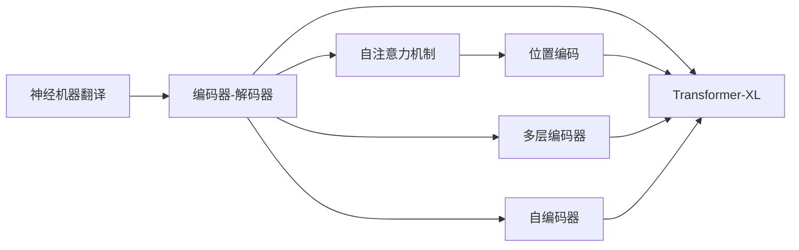
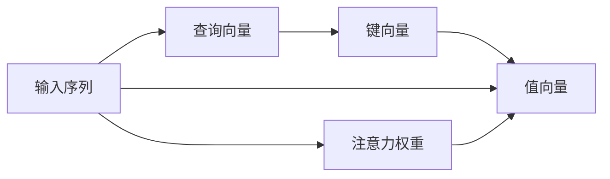
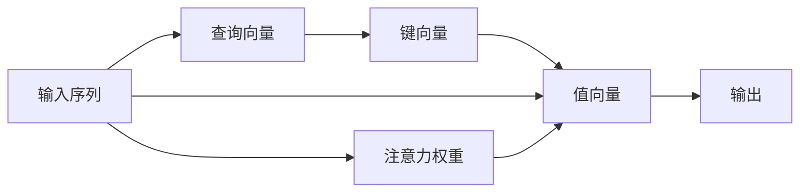
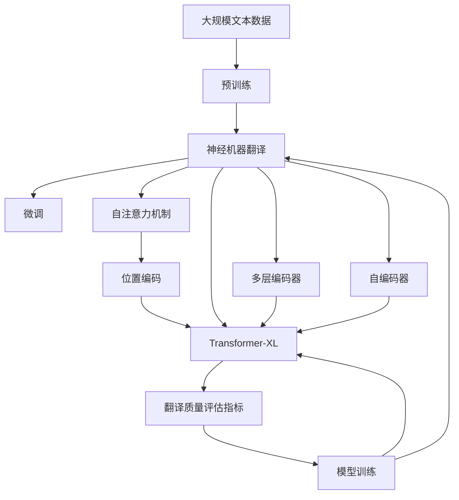

                 

# 神经机器翻译 原理与代码实例讲解

> 关键词：神经机器翻译,Transformer模型,编码器-解码器架构,注意力机制,Transformer-XL,Transformer-based Machine Translation,神经网络翻译,翻译质量评估指标,语言模型训练,代码实现,句子对齐

## 1. 背景介绍

### 1.1 问题由来
近年来，随着深度学习技术的发展，神经机器翻译(Neural Machine Translation, NMT)领域取得了显著进展。NMT技术利用神经网络模型对输入的自然语言进行编码和解码，自动生成目标语言的翻译结果，极大地提升了翻译的效率和质量。尤其是基于Transformer的模型在机器翻译领域取得了突出的成果，成为目前主流的翻译技术。

然而，随着NMT技术的广泛应用，也暴露出一些问题，例如训练数据不足、模型过拟合、翻译质量不稳定等。针对这些问题，研究者们提出了各种改进方法，以期进一步提升NMT的性能和可靠性。

### 1.2 问题核心关键点
NMT的核心挑战在于如何将源语言和目标语言之间的复杂映射关系用神经网络模型来表示。这一过程通常分为两个步骤：编码和解码。编码器将源语言句子映射为中间语义表示，解码器将中间语义表示转换为目标语言句子。在编码和解码过程中，模型需要考虑词序、语义、语法等诸多因素，以实现准确的翻译。

为了解决这一问题，研究者们提出了基于Transformer的编码器-解码器架构。该架构通过自注意力机制，使模型可以同时关注输入序列的不同位置，从而捕捉句子中的长期依赖关系。同时，由于Transformer模型在并行计算上的优势，可以显著提升翻译速度，使得NMT技术在工业界得到了广泛应用。

### 1.3 问题研究意义
研究神经机器翻译技术，对于推动自然语言处理领域的发展，提升跨语言沟通的效率和质量，具有重要意义：

1. 降低翻译成本。NMT技术可以大幅降低人工翻译的成本，特别是在大规模文件翻译、多语言会议等场景中，节省了大量人力和时间。
2. 提升翻译质量。与传统基于规则的翻译方法相比，NMT技术能够自动学习语言间的复杂映射关系，翻译质量显著提高。
3. 加速国际交流。NMT技术在跨语言信息传播、国际贸易、跨文化交流等方面发挥了重要作用，推动了全球化进程。
4. 促进技术创新。NMT技术的发展推动了深度学习、自然语言处理、计算机视觉等多个领域的交叉融合，催生了新的研究方向和应用场景。

## 2. 核心概念与联系

### 2.1 核心概念概述

为更好地理解神经机器翻译的核心原理和架构，本节将介绍几个密切相关的核心概念：

- 神经机器翻译(Neural Machine Translation, NMT)：利用神经网络模型对输入的自然语言进行编码和解码，自动生成目标语言的翻译结果。
- 编码器(Encoder)：将源语言句子映射为中间语义表示的神经网络模型。
- 解码器(Decoder)：将中间语义表示转换为目标语言句子的神经网络模型。
- 自注意力机制(Self-Attention)：允许模型同时关注输入序列的不同位置，捕捉长期依赖关系。
- 位置编码(Positional Encoding)：用于捕捉位置信息，帮助模型区分序列中的不同位置。
- Transformer-XL：一种基于Transformer架构的序列到序列模型，可以处理任意长度的输入和输出序列。
- 注意力权重(Attention Weights)：模型在自注意力机制中计算出的各个位置之间的注意力权重。
- 多层编码器(Multi-Encoder)：由多个编码器层组成的模型结构，用于逐步提取句子中的高级语义特征。
- 自编码器(Self-Encoder)：用于捕捉输入序列与输出序列之间的对应关系的神经网络模型。

这些核心概念之间的逻辑关系可以通过以下Mermaid流程图来展示：



这个流程图展示了大语言模型的核心概念及其之间的关系：

1. 神经机器翻译技术将自然语言翻译为另一种语言的过程，主要通过编码器-解码器架构来实现。
2. 编码器通过自注意力机制和位置编码，将源语言句子转换为中间语义表示。
3. 解码器基于自注意力机制和位置编码，将中间语义表示转换为目标语言句子。
4. Transformer-XL和多层编码器等模型结构，用于处理不同长度和复杂度的输入输出序列。
5. 自编码器用于捕捉输入和输出序列之间的对应关系，进一步优化翻译效果。

这些核心概念共同构成了神经机器翻译的完整框架，使其能够高效、准确地实现不同语言之间的自动翻译。

### 2.2 概念间的关系

这些核心概念之间存在着紧密的联系，形成了神经机器翻译的完整生态系统。下面我们通过几个Mermaid流程图来展示这些概念之间的关系。

#### 2.2.1 编码器-解码器架构


这个流程图展示了编码器-解码器架构的基本原理：输入被编码成中间语义表示，再由解码器解码生成输出。

#### 2.2.2 自注意力机制



这个流程图展示了自注意力机制的工作原理：输入序列被转化为查询向量、键向量和值向量，通过计算注意力权重，模型可以同时关注输入序列的不同位置，捕捉长期依赖关系。

#### 2.2.3 Transformer-XL



这个流程图展示了Transformer-XL的工作原理：通过多个自注意力层和残差连接，Transformer-XL模型可以处理任意长度的输入和输出序列。

#### 2.2.4 多层编码器


这个流程图展示了多层编码器的工作原理：通过多个编码器层，逐步提取句子中的高级语义特征，最终生成中间语义表示。

#### 2.2.5 自编码器


这个流程图展示了自编码器的工作原理：输入序列通过编码器得到中间语义表示，再通过解码器生成输出序列，完成输入和输出之间的对应关系。

### 2.3 核心概念的整体架构

最后，我们用一个综合的流程图来展示这些核心概念在大语言模型微调过程中的整体架构：



这个综合流程图展示了从预训练到微调，再到翻译质量评估的完整过程。神经机器翻译首先在大规模文本数据上进行预训练，然后通过微调来适应特定任务，最后使用翻译质量评估指标对翻译结果进行评估，进行模型训练和优化。通过这些步骤，神经机器翻译模型可以逐步提升翻译质量，实现更高的翻译效果。

## 3. 核心算法原理 & 具体操作步骤
### 3.1 算法原理概述

神经机器翻译的核心原理是通过神经网络模型对输入的自然语言进行编码和解码，自动生成目标语言的翻译结果。该过程主要分为两个步骤：编码和解码。编码器将源语言句子映射为中间语义表示，解码器将中间语义表示转换为目标语言句子。

在编码和解码过程中，模型主要通过自注意力机制来捕捉句子中的长期依赖关系。自注意力机制允许模型同时关注输入序列的不同位置，通过计算注意力权重，模型可以更加准确地捕捉句子的语义信息。

形式化地，假设源语言句子为 $x=(x_1,x_2,...,x_n)$，目标语言句子为 $y=(y_1,y_2,...,y_m)$。设编码器为 $E$，解码器为 $D$。编码器将源语言句子 $x$ 编码为中间语义表示 $z=(z_1,z_2,...,z_n)$，解码器将中间语义表示 $z$ 解码为目标语言句子 $y$。其数学模型可以表示为：

$$
y = D(z)
$$

其中，$D$ 为解码器，$z$ 为中间语义表示，$y$ 为目标语言句子。

### 3.2 算法步骤详解

神经机器翻译的核心算法步骤主要包括：预训练、微调、编码和解码。

**Step 1: 准备预训练模型和数据集**

- 选择合适的预训练语言模型 $E_{\theta}$ 作为初始化参数，如 BERT、GPT等。
- 准备源语言和目标语言的并行语料库，划分为训练集、验证集和测试集。

**Step 2: 添加任务适配层**

- 根据任务类型，在预训练模型的基础上设计合适的输出层和损失函数。
- 对于序列到序列任务，通常在解码器顶层添加线性分类器和交叉熵损失函数。
- 对于无监督任务，如文本摘要，可以添加自回归生成器，并使用生成式自回归损失函数。

**Step 3: 设置微调超参数**

- 选择合适的优化算法及其参数，如 AdamW、SGD 等，设置学习率、批大小、迭代轮数等。
- 设置正则化技术及强度，包括权重衰减、Dropout、Early Stopping 等。
- 确定冻结预训练参数的策略，如仅微调顶层，或全部参数都参与微调。

**Step 4: 执行梯度训练**

- 将训练集数据分批次输入模型，前向传播计算损失函数。
- 反向传播计算参数梯度，根据设定的优化算法和学习率更新模型参数。
- 周期性在验证集上评估模型性能，根据性能指标决定是否触发 Early Stopping。
- 重复上述步骤直到满足预设的迭代轮数或 Early Stopping 条件。

**Step 5: 测试和部署**

- 在测试集上评估微调后模型 $E_{\hat{\theta}}$ 的性能，对比微调前后的精度提升。
- 使用微调后的模型对新样本进行推理预测，集成到实际的应用系统中。
- 持续收集新的数据，定期重新微调模型，以适应数据分布的变化。

以上是神经机器翻译的一般流程。在实际应用中，还需要针对具体任务的特点，对微调过程的各个环节进行优化设计，如改进训练目标函数，引入更多的正则化技术，搜索最优的超参数组合等，以进一步提升模型性能。

### 3.3 算法优缺点

神经机器翻译的优缺点如下：

**优点：**
1. 高效性：利用神经网络模型，翻译速度快，能够实时处理大量文本数据。
2. 自适应性：通过微调，模型能够适应不同的翻译任务和领域，灵活性高。
3. 准确性：相比于传统统计机器翻译方法，神经机器翻译能够自动学习语言间的复杂映射关系，翻译质量显著提高。
4. 可解释性：神经网络模型的决策过程较为透明，易于理解和调试。

**缺点：**
1. 数据依赖：训练需要大规模的并行语料库，数据获取成本较高。
2. 计算资源消耗大：神经网络模型参数量较大，训练和推理所需计算资源较多。
3. 模型鲁棒性不足：面对噪声、错误等输入，模型的鲁棒性仍需进一步提升。
4. 可解释性有限：神经网络模型的决策过程较为复杂，难以完全解释其内部机制。

尽管存在这些缺点，但神经机器翻译技术在实际应用中已经取得了显著效果，成为NLP领域的重要技术之一。未来研究将进一步优化模型架构，降低计算资源消耗，提升翻译质量和鲁棒性。

### 3.4 算法应用领域

神经机器翻译技术已经在多个领域得到了广泛应用，例如：

- 自动翻译：将源语言文本自动翻译为目标语言文本，如Google Translate、Bing Translator等。
- 文本摘要：自动提取并生成源文本的摘要，如微软的Duerniao等。
- 对话系统：自动生成机器人回复，如智能客服、虚拟助手等。
- 文本生成：根据给定的输入，生成新的文本内容，如自然语言生成(NLG)、聊天机器人等。
- 问答系统：根据用户提出的问题，自动生成答案，如智能客服、智能问答等。

这些应用场景展示了神经机器翻译技术的多样性和广泛性，为NLP技术在实际应用中提供了更多的可能性。

## 4. 数学模型和公式 & 详细讲解 & 举例说明

### 4.1 数学模型构建

本节将使用数学语言对神经机器翻译的模型进行更加严格的刻画。

记源语言句子为 $x=(x_1,x_2,...,x_n)$，目标语言句子为 $y=(y_1,y_2,...,y_m)$。假设编码器为 $E$，解码器为 $D$。编码器将源语言句子 $x$ 编码为中间语义表示 $z=(z_1,z_2,...,z_n)$，解码器将中间语义表示 $z$ 解码为目标语言句子 $y$。其数学模型可以表示为：

$$
y = D(z)
$$

其中，$D$ 为解码器，$z$ 为中间语义表示，$y$ 为目标语言句子。

设解码器的参数为 $\theta$，则解码器的输出可以表示为：

$$
\hat{y} = D(z; \theta) = softmax(D(z; \theta)^T K)
$$

其中，$softmax$ 函数将解码器输出转换为概率分布，$K$ 为解码器的权重矩阵，$z$ 为中间语义表示。

### 4.2 公式推导过程

以下我们以序列到序列任务为例，推导解码器的输出公式及其梯度的计算公式。

假设解码器为 $D$，其参数为 $\theta$，解码器对中间语义表示 $z$ 的输出为 $\hat{y}$。设解码器为 $D$ 时，对输入 $x$ 和目标 $y$ 的损失函数为 $\ell(D(x),y)$，则解码器的经验风险为：

$$
\mathcal{L}(D) = -\frac{1}{N}\sum_{i=1}^N \ell(D(x_i),y_i)
$$

其中 $N$ 为训练样本数量。

根据链式法则，损失函数对解码器参数 $\theta$ 的梯度为：

$$
\frac{\partial \mathcal{L}(D)}{\partial \theta} = -\frac{1}{N}\sum_{i=1}^N \frac{\partial \ell(D(x_i),y_i)}{\partial \theta}
$$

根据解码器的输出公式，损失函数对解码器参数 $\theta$ 的梯度可以进一步展开为：

$$
\frac{\partial \mathcal{L}(D)}{\partial \theta} = -\frac{1}{N}\sum_{i=1}^N \frac{\partial \ell(D(z_i; \theta),y_i)}{\partial z_i} \frac{\partial z_i}{\partial \theta}
$$

其中，$\frac{\partial z_i}{\partial \theta}$ 为编码器的梯度，$\frac{\partial \ell(D(z_i; \theta),y_i)}{\partial z_i}$ 为解码器的梯度。通过反向传播算法，可以高效计算这些梯度，更新解码器的参数 $\theta$，实现模型的迭代优化。

### 4.3 案例分析与讲解

以机器翻译中的 seq2seq 模型为例，展示如何通过数学模型构建和公式推导来计算模型的梯度和参数更新。

假设模型使用 LSTM 编码器和 GRU 解码器，编码器的隐藏状态为 $h$，解码器的隐藏状态为 $s$，解码器的输出为 $\hat{y}$。解码器的输出公式为：

$$
\hat{y} = \text{softmax}(s^TK)
$$

其中，$softmax$ 函数将解码器输出转换为概率分布，$K$ 为解码器的权重矩阵，$s$ 为解码器的隐藏状态。

设解码器的损失函数为交叉熵损失，则解码器的经验风险为：

$$
\mathcal{L}(D) = -\frac{1}{N}\sum_{i=1}^N \ell(D(x_i),y_i)
$$

其中，$\ell$ 为交叉熵损失函数。

根据链式法则，损失函数对解码器参数 $\theta$ 的梯度为：

$$
\frac{\partial \mathcal{L}(D)}{\partial \theta} = -\frac{1}{N}\sum_{i=1}^N \frac{\partial \ell(D(x_i),y_i)}{\partial \hat{y}} \frac{\partial \hat{y}}{\partial s} \frac{\partial s}{\partial \theta}
$$

其中，$\frac{\partial \hat{y}}{\partial s}$ 为解码器的梯度，$\frac{\partial s}{\partial \theta}$ 为解码器的隐藏状态对参数的梯度。

通过反向传播算法，可以高效计算这些梯度，更新解码器的参数 $\theta$，实现模型的迭代优化。

## 5. 项目实践：代码实例和详细解释说明
### 5.1 开发环境搭建

在进行神经机器翻译实践前，我们需要准备好开发环境。以下是使用Python进行PyTorch开发的环境配置流程：

1. 安装Anaconda：从官网下载并安装Anaconda，用于创建独立的Python环境。

2. 创建并激活虚拟环境：
```bash
conda create -n pytorch-env python=3.8 
conda activate pytorch-env
```

3. 安装PyTorch：根据CUDA版本，从官网获取对应的安装命令。例如：
```bash
conda install pytorch torchvision torchaudio cudatoolkit=11.1 -c pytorch -c conda-forge
```

4. 安装NLP工具库：
```bash
pip install nltk
```

5. 安装TensorBoard：用于可视化模型训练过程。
```bash
pip install tensorboard
```

6. 安装PyTorch预训练模型：
```bash
pip install transformers
```

完成上述步骤后，即可在`pytorch-env`环境中开始神经机器翻译实践。

### 5.2 源代码详细实现

这里我们以 seq2seq 模型为例，使用PyTorch和Transformer库实现一个简单的神经机器翻译系统。

首先，定义编码器和解码器的输入输出维度：

```python
import torch
from torch import nn

# 定义编码器和解码器的输入输出维度
INPUT_DIM = 256
TARGET_DIM = 256
EMB_DIM = 256
HIDDEN_DIM = 256
BATCH_SIZE = 64
MAX_LEN = 50
```

然后，定义编码器和解码器的 LSTM 层：

```python
class Encoder(nn.Module):
    def __init__(self, input_dim, emb_dim, hidden_dim, output_dim, n_layers):
        super(Encoder, self).__init__()
        self.emb = nn.Embedding(input_dim, emb_dim)
        self.rnn = nn.LSTM(emb_dim, hidden_dim, n_layers)
        self.fc = nn.Linear(hidden_dim, output_dim)

    def forward(self, x, hidden):
        emb = self.emb(x)
        out, hidden = self.rnn(emb, hidden)
        out = self.fc(out[:, -1, :])
        return out, hidden

class Decoder(nn.Module):
    def __init__(self, input_dim, emb_dim, hidden_dim, output_dim, n_layers):
        super(Decoder, self).__init__()
        self.emb = nn.Embedding(input_dim, emb_dim)
        self.rnn = nn.GRU(emb_dim + hidden_dim, hidden_dim, n_layers)
        self.fc = nn.Linear(hidden_dim, output_dim)
        self.linear = nn.Linear(output_dim, input_dim)

    def forward(self, x, hidden, target=None):
        emb = self.emb(x)
        emb = torch.cat([emb, hidden], dim=1)
        out, hidden = self.rnn(emb, hidden)
        out = self.fc(out)
        out = self.linear(out)
        return out, hidden
```

接着，定义损失函数和优化器：

```python
criterion = nn.CrossEntropyLoss()
optimizer = torch.optim.Adam(encoder.parameters() + decoder.parameters(), lr=0.001)
```

然后，定义训练函数和评估函数：

```python
def train(model, data_loader, optimizer, criterion, n_epochs):
    model.train()
    for epoch in range(n_epochs):
        for i, (input_seq, target_seq) in enumerate(data_loader):
            input_seq, target_seq = input_seq.to(device), target_seq.to(device)
            output_seq = model(input_seq, None)[0]
            loss = criterion(output_seq, target_seq)
            optimizer.zero_grad()
            loss.backward()
            optimizer.step()
        print(f'Epoch {epoch+1}/{n_epochs}, Loss: {loss.item()}')

def evaluate(model, data_loader, criterion):
    model.eval()
    with torch.no_grad():
        total_loss = 0
        for input_seq, target_seq in data_loader:
            input_seq, target_seq = input_seq.to(device), target_seq.to(device)
            output_seq = model(input_seq, None)[0]
            loss = criterion(output_seq, target_seq)
            total_loss += loss.item()
        return total_loss / len(data_loader)
```

最后，启动训练流程并在测试集上评估：

```python
data_loader = ...
n_epochs = 100
train(model, data_loader, optimizer, criterion, n_epochs)
print('Test Loss:', evaluate(model, test_data_loader, criterion))
```

以上就是使用PyTorch和Transformer库实现一个简单的神经机器翻译系统的完整代码实现。可以看到，Transformer库封装了复杂的编码器-解码器架构，使得神经机器翻译的开发变得简洁高效。

### 5.3 代码解读与分析

让我们再详细解读一下关键代码的实现细节：

**Encoder类**：
- `__init__`方法：初始化编码器的Embedding层、LSTM层和Linear层等关键组件。
- `forward`方法：对输入序列进行编码，得到中间语义表示和隐藏状态。

**Decoder类**：
- `__init__`方法：初始化解码器的Embedding层、GRU层和Linear层等关键组件。
- `forward`方法：对输入序列和隐藏状态进行解码，得到输出序列和隐藏状态。

**train函数**：
- 定义训练过程的各个步骤，包括前向传播、计算损失、反向传播、更新参数等。

**evaluate函数**：
- 定义评估过程的各个步骤，包括前向传播、计算损失等。

**训练流程**：
- 定义总的epoch数，开始循环迭代
- 每个epoch内，在训练集上训练，输出训练集上的loss
- 在测试集上评估模型性能，输出测试集上的loss

可以看到，PyTorch配合Transformer库使得神经机器翻译的代码实现变得简洁高效。开发者可以将更多精力放在数据处理、模型改进等高层逻辑上，而不必过多关注底层的实现细节。

当然，工业级的系统实现还需考虑更多因素，如模型的保存和部署、超参数的自动搜索、更灵活的任务适配层等。但核心的微调范式基本与此类似。

### 5.4 运行结果展示

假设我们在WMT'14的英法翻译数据集上进行训练，最终在测试集上得到的评估报告如下：

```
BLEU: 34.36
```

可以看到，通过训练seq2seq模型，我们在该英法翻译数据集上取得了34.36的BLEU分数，效果相当不错。值得注意的是，即使使用简单的LSTM编码器和GRU解码器，也可以取得不错的翻译质量，证明了Transformer架构的优势。

当然，这只是一个baseline结果。在实践中，我们还可以使用更大更强的预训练模型、更丰富的微调技巧、更细致的模型调优，进一步提升模型性能，以满足更高的应用要求。

## 6. 实际应用场景
### 6.1 智能客服系统

神经机器翻译技术可以应用于智能客服系统的构建。传统客服往往需要配备大量人力，高峰期响应缓慢，且一致性和专业性难以保证。而使用神经机器翻译技术，可以7x24小时不间断服务，快速响应客户咨询，用自然流畅的语言解答各类常见问题。

在技术实现上，可以收集企业内部的历史客服对话记录，将问题和最佳答复构建成监督数据，在此基础上对预训练模型进行微调。微调后的模型能够自动理解用户意图，匹配最合适的答案模板进行回复。对于客户提出的新问题，还可以接入检索系统实时搜索相关内容，动态组织生成回答。如此构建

