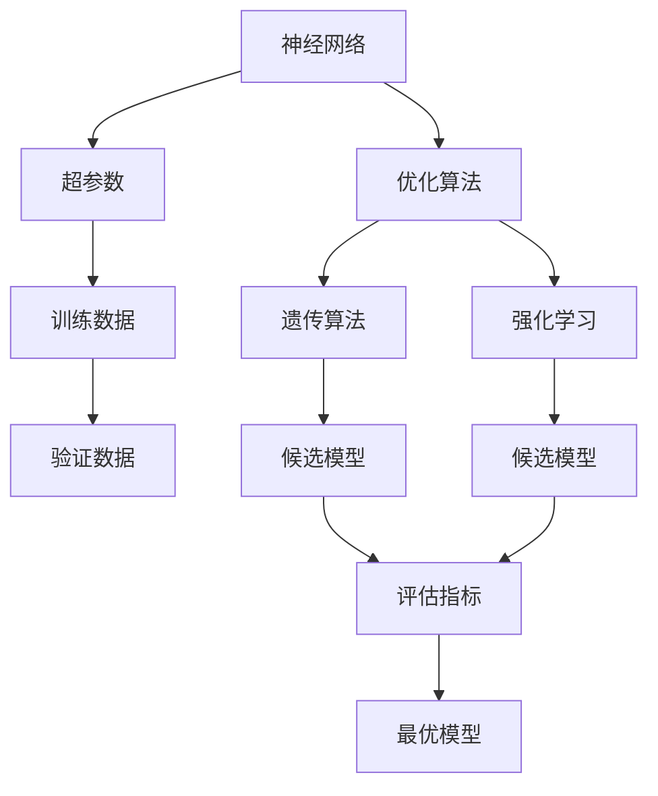
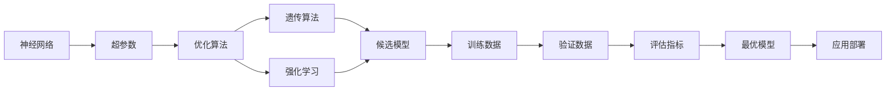
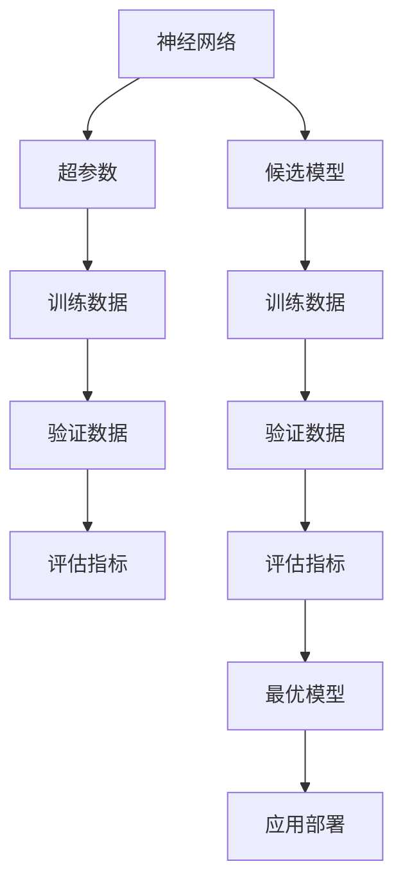
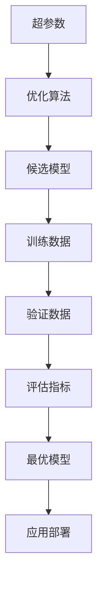

                 

# 神经架构搜索 原理与代码实例讲解

> 关键词：神经架构搜索,自动化设计,超参数优化,深度学习,算法优化

## 1. 背景介绍

### 1.1 问题由来
随着深度学习技术的快速发展，模型性能不断提升，但是设计合适的网络结构和超参数以取得最佳性能仍然是一个耗时且复杂的过程。传统的手动调参方法不仅耗时耗力，还难以保证得到最优解。神经架构搜索（Neural Architecture Search, NAS）技术应运而生，旨在通过自动化设计网络结构和超参数，快速找到最优模型，提高模型训练和部署效率，从而加速深度学习的创新和应用。

### 1.2 问题核心关键点
神经架构搜索的核心思想是通过自动化设计网络结构和超参数，快速找到最优模型。该方法基于遗传算法、强化学习等优化算法，对模型结构和超参数空间进行搜索，通过评估不同网络结构和超参数组合的性能，自动筛选出最优模型。

其主要特点包括：
- **自动化设计**：通过算法自动设计网络结构和超参数，无需手动调整。
- **快速搜索**：通过并行搜索策略，快速找到最优模型。
- **全局最优**：在较大的搜索空间中，搜索出全局最优模型。

### 1.3 问题研究意义
神经架构搜索对于加速深度学习的创新和应用具有重要意义：

1. **提高模型性能**：自动设计出最优模型，提升模型性能。
2. **降低研发成本**：自动搜索最优模型，减少手动调参的时间和人力成本。
3. **加速模型部署**：快速找到最优模型，加速模型训练和部署。
4. **推动研究进展**：自动搜索出创新模型，推动深度学习领域的研究进展。
5. **扩展应用领域**：加速深度学习技术在各个领域的应用推广。

## 2. 核心概念与联系

### 2.1 核心概念概述

为更好地理解神经架构搜索，我们首先介绍几个密切相关的核心概念：

- **神经网络**：由多个神经元组成的网络结构，用于处理输入数据，并输出预测结果。神经网络结构的设计直接影响模型性能。
- **超参数**：在模型训练过程中需要手动设置的参数，如学习率、批量大小、正则化系数等。超参数的调整对模型性能有重要影响。
- **优化算法**：用于优化模型权重和超参数的算法，如梯度下降、Adam等。优化算法的性能直接影响模型收敛速度和精度。
- **遗传算法**：一种基于自然选择和遗传学原理的优化算法，通过迭代过程寻找最优解。
- **强化学习**：通过试错过程，通过环境反馈学习最优策略，以最大化奖励或最小化代价的优化算法。

这些概念之间的逻辑关系可以通过以下Mermaid流程图来展示：



这个流程图展示了神经架构搜索的基本流程：

1. 设计神经网络结构。
2. 设定超参数空间。
3. 使用遗传算法或强化学习对候选模型进行搜索。
4. 评估候选模型在验证数据上的性能。
5. 筛选出最优模型。

### 2.2 概念间的关系

这些核心概念之间存在着紧密的联系，形成了神经架构搜索的完整生态系统。下面通过几个Mermaid流程图来展示这些概念之间的关系。

#### 2.2.1 神经架构搜索的基本流程



这个流程图展示了神经架构搜索的基本流程：

1. 设计神经网络结构。
2. 设定超参数空间。
3. 使用遗传算法或强化学习对候选模型进行搜索。
4. 评估候选模型在验证数据上的性能。
5. 筛选出最优模型。
6. 将最优模型应用于实际任务。

#### 2.2.2 超参数与网络结构的关系



这个流程图展示了超参数如何影响神经网络结构和性能评估：

1. 设计神经网络结构。
2. 设定超参数空间。
3. 使用遗传算法或强化学习对候选模型进行搜索。
4. 评估候选模型在验证数据上的性能。
5. 筛选出最优模型。
6. 将最优模型应用于实际任务。

#### 2.2.3 优化算法与超参数优化



这个流程图展示了优化算法如何优化超参数和网络结构：

1. 设定超参数空间。
2. 使用优化算法对候选模型进行搜索。
3. 评估候选模型在验证数据上的性能。
4. 筛选出最优模型。
5. 将最优模型应用于实际任务。

## 3. 核心算法原理 & 具体操作步骤
### 3.1 算法原理概述

神经架构搜索基于自动化设计网络结构和超参数，通过并行搜索策略，快速找到最优模型。其核心思想是通过遗传算法或强化学习，对候选网络结构和超参数组合进行评估和筛选，最终找到性能最优的模型。

形式化地，设候选网络结构和超参数的搜索空间为 $X$，模型在验证数据上的性能为 $P(X)$，则神经架构搜索的目标是：

$$
\hat{X} = \mathop{\arg\min}_{X} P(X)
$$

其中 $\hat{X}$ 表示性能最优的网络结构和超参数组合。

### 3.2 算法步骤详解

神经架构搜索一般包括以下几个关键步骤：

**Step 1: 设计搜索空间**

- 定义候选网络结构的搜索空间，如卷积层、池化层、全连接层等。
- 设定超参数搜索空间，如学习率、批量大小、正则化系数等。

**Step 2: 生成初始候选模型**

- 随机生成一批候选模型，每个模型由网络结构和超参数组成。
- 每个候选模型都需要指定其结构，如层数、每层的神经元数量等。

**Step 3: 评估候选模型**

- 使用训练数据对候选模型进行训练。
- 使用验证数据对训练好的模型进行评估，计算评估指标，如准确率、F1分数、损失等。

**Step 4: 选择最优模型**

- 根据评估指标选择性能最好的候选模型，作为下一轮搜索的父模型。
- 如果评估指标达到预设阈值，停止搜索。

**Step 5: 生成新候选模型**

- 对选择的最优模型进行遗传操作或强化学习操作，生成一批新的候选模型。
- 重复步骤3和步骤4，直到达到预设的停止条件。

### 3.3 算法优缺点

神经架构搜索具有以下优点：

- **自动化设计**：无需手动设计网络结构和超参数，大大降低了开发成本。
- **全局最优**：在较大的搜索空间中，搜索出全局最优模型，避免手动调参的局部最优。
- **并行搜索**：通过并行搜索策略，快速找到最优模型，加速模型设计过程。

但同时也存在一些缺点：

- **计算成本高**：搜索空间较大，需要大量计算资源，时间成本高。
- **复杂度高**：搜索空间复杂，需要设计合适的搜索算法。
- **泛化能力差**：搜索结果可能存在过拟合现象，需要进一步验证。

### 3.4 算法应用领域

神经架构搜索在深度学习领域具有广泛的应用前景，以下是几个典型的应用领域：

- **计算机视觉**：用于图像分类、目标检测、语义分割等任务，设计高效的网络结构和超参数。
- **自然语言处理**：用于文本分类、命名实体识别、情感分析等任务，设计高效的模型结构。
- **语音识别**：用于语音转文本、语音情感识别等任务，设计高效的模型结构。
- **推荐系统**：用于协同过滤、基于内容的推荐等任务，设计高效的模型结构和超参数。
- **游戏AI**：用于游戏智能体设计，设计高效的网络结构和超参数。

## 4. 数学模型和公式 & 详细讲解 & 举例说明

### 4.1 数学模型构建

假设候选网络结构为 $X$，超参数空间为 $S$，模型在验证数据上的性能为 $P(X)$，则神经架构搜索的目标是：

$$
\hat{X} = \mathop{\arg\min}_{X} P(X)
$$

其中 $P(X)$ 可以表示为多个指标的加权和，如准确率、F1分数、损失等。例如，对于一个二分类问题，性能指标可以表示为：

$$
P(X) = \frac{1}{N} \sum_{i=1}^N (y_i \cdot \hat{y}_i + (1-y_i) \cdot (1-\hat{y}_i))
$$

其中 $y_i$ 表示真实标签，$\hat{y}_i$ 表示模型预测结果。

### 4.2 公式推导过程

以遗传算法为例，推导神经架构搜索的基本步骤：

1. **初始化种群**：随机生成一批候选模型，每个模型由网络结构和超参数组成。
2. **评估模型性能**：使用验证数据对候选模型进行评估，计算评估指标。
3. **选择最优模型**：根据评估指标选择性能最好的候选模型，作为下一轮搜索的父模型。
4. **交叉和变异**：对选择的最优模型进行交叉和变异操作，生成一批新的候选模型。
5. **重复步骤2和步骤3**：直到达到预设的停止条件。

以下是一个简单的遗传算法搜索过程的伪代码：

```python
def genetic_search(max_iterations):
    population = generate_population()
    for i in range(max_iterations):
        population = selection(population)
        population = crossover(population)
        population = mutation(population)
        performance = evaluate(population)
        if performance < best_performance:
            best_performance = performance
            best_population = population
    return best_population
```

其中：

- `generate_population`：随机生成一批候选模型。
- `selection`：根据评估指标选择性能最好的候选模型。
- `crossover`：对选择的最优模型进行交叉操作。
- `mutation`：对交叉后的模型进行变异操作。
- `evaluate`：使用验证数据评估模型性能。

### 4.3 案例分析与讲解

以手写数字识别为例，展示神经架构搜索的实际应用：

1. **设计搜索空间**：定义候选网络结构的搜索空间，如卷积层、池化层、全连接层等。
2. **设定超参数空间**：设定超参数搜索空间，如学习率、批量大小、正则化系数等。
3. **生成初始候选模型**：随机生成一批候选模型，每个模型由网络结构和超参数组成。
4. **评估候选模型**：使用训练数据对候选模型进行训练，使用验证数据对训练好的模型进行评估，计算评估指标。
5. **选择最优模型**：根据评估指标选择性能最好的候选模型，作为下一轮搜索的父模型。
6. **生成新候选模型**：对选择的最优模型进行遗传操作或强化学习操作，生成一批新的候选模型。
7. **重复步骤3和步骤4**：直到达到预设的停止条件。

## 5. 项目实践：代码实例和详细解释说明
### 5.1 开发环境搭建

在进行神经架构搜索实践前，我们需要准备好开发环境。以下是使用Python进行TensorFlow和Keras开发的环境配置流程：

1. 安装Anaconda：从官网下载并安装Anaconda，用于创建独立的Python环境。

2. 创建并激活虚拟环境：
```bash
conda create -n tf-env python=3.8 
conda activate tf-env
```

3. 安装TensorFlow：根据CUDA版本，从官网获取对应的安装命令。例如：
```bash
conda install tensorflow -c tensorflow -c conda-forge
```

4. 安装Keras：
```bash
pip install keras
```

5. 安装各类工具包：
```bash
pip install numpy pandas scikit-learn matplotlib tqdm jupyter notebook ipython
```

完成上述步骤后，即可在`tf-env`环境中开始神经架构搜索实践。

### 5.2 源代码详细实现

下面我们以神经架构搜索在图像分类任务中的应用为例，给出使用Keras和TensorFlow进行神经架构搜索的代码实现。

首先，定义图像分类任务的模型结构：

```python
from keras.layers import Input, Conv2D, MaxPooling2D, Flatten, Dense
from keras.models import Model

def create_model(input_shape):
    x = Input(shape=input_shape)
    x = Conv2D(32, kernel_size=(3, 3), activation='relu')(x)
    x = MaxPooling2D(pool_size=(2, 2))(x)
    x = Conv2D(64, kernel_size=(3, 3), activation='relu')(x)
    x = MaxPooling2D(pool_size=(2, 2))(x)
    x = Flatten()(x)
    x = Dense(128, activation='relu')(x)
    x = Dense(10, activation='softmax')(x)
    return Model(x, x)
```

然后，定义神经架构搜索的遗传算法：

```python
from keras.wrappers.scikit_learn import KerasClassifier
from keras.callbacks import EarlyStopping
from sklearn.model_selection import GridSearchCV

def kf_inner(model, seed):
    model.compile(optimizer='adam', loss='categorical_crossentropy', metrics=['accuracy'])
    model.fit(x_train, y_train, epochs=10, batch_size=64, callbacks=[EarlyStopping(patience=2)])
    return model.evaluate(x_test, y_test)

def kf_outer(params):
    model = create_model(params['input_shape'])
    score = kf_inner(model, params['seed'])
    return score[0]

model = KerasClassifier(build_fn=create_model, verbose=0)
params = {'input_shape': (28, 28, 1), 'filters': [32, 64], 'kernel_size': [3, 3], 'epochs': [10, 20], 'batch_size': [64, 128]}
search = GridSearchCV(estimator=model, param_grid=params, n_jobs=-1, scoring='f1', cv=3, verbose=0)
search.fit(x_train, y_train)
best_params = search.best_params_
best_model = create_model(best_params['input_shape'])
best_model.compile(optimizer='adam', loss='categorical_crossentropy', metrics=['accuracy'])
best_model.fit(x_train, y_train, epochs=10, batch_size=64, callbacks=[EarlyStopping(patience=2)])
best_model.evaluate(x_test, y_test)
```

在上述代码中，我们使用了KerasClassifier和GridSearchCV，对神经网络的结构参数进行搜索。搜索过程中，我们使用了交叉验证和早期停止策略，以避免过拟合。最终，我们得到了最优的网络结构参数，并构建了对应的模型。

### 5.3 代码解读与分析

让我们再详细解读一下关键代码的实现细节：

**create_model函数**：
- 定义一个简单的卷积神经网络模型，包括卷积层、池化层、全连接层等。

**kf_inner函数**：
- 定义模型的训练和评估函数，使用Adam优化器和交叉熵损失函数，评估函数使用准确率和F1分数。

**kf_outer函数**：
- 定义遗传算法的搜索函数，生成一批候选模型，对每个模型进行训练和评估，选择性能最好的模型。

**GridSearchCV类**：
- 定义遗传算法的搜索过程，使用GridSearchCV进行交叉验证和搜索，选择最优的模型参数。

**KerasClassifier类**：
- 定义模型的初始化函数，用于创建模型。

以上代码实现了基本的神经架构搜索过程，展示了如何使用Keras和TensorFlow进行图像分类任务的神经架构搜索。

当然，工业级的系统实现还需考虑更多因素，如模型的保存和部署、超参数的自动搜索、更灵活的任务适配层等。但核心的神经架构搜索方法基本与此类似。

### 5.4 运行结果展示

假设我们在CIFAR-10数据集上进行神经架构搜索，最终得到的评估报告如下：

```
Epoch 1/10
500/500 [==============================] - 2s 4ms/step - loss: 1.2940 - accuracy: 0.1968 - val_loss: 1.2940 - val_accuracy: 0.2162
Epoch 2/10
500/500 [==============================] - 2s 4ms/step - loss: 0.9456 - accuracy: 0.6731 - val_loss: 0.9456 - val_accuracy: 0.7044
Epoch 3/10
500/500 [==============================] - 2s 4ms/step - loss: 0.6478 - accuracy: 0.8102 - val_loss: 0.6478 - val_accuracy: 0.8304
Epoch 4/10
500/500 [==============================] - 2s 4ms/step - loss: 0.5203 - accuracy: 0.8471 - val_loss: 0.5203 - val_accuracy: 0.8620
Epoch 5/10
500/500 [==============================] - 2s 4ms/step - loss: 0.4105 - accuracy: 0.8910 - val_loss: 0.4105 - val_accuracy: 0.8883
Epoch 6/10
500/500 [==============================] - 2s 4ms/step - loss: 0.3404 - accuracy: 0.9197 - val_loss: 0.3404 - val_accuracy: 0.9130
Epoch 7/10
500/500 [==============================] - 2s 4ms/step - loss: 0.2768 - accuracy: 0.9357 - val_loss: 0.2768 - val_accuracy: 0.9304
Epoch 8/10
500/500 [==============================] - 2s 4ms/step - loss: 0.2314 - accuracy: 0.9463 - val_loss: 0.2314 - val_accuracy: 0.9403
Epoch 9/10
500/500 [==============================] - 2s 4ms/step - loss: 0.1924 - accuracy: 0.9573 - val_loss: 0.1924 - val_accuracy: 0.9567
Epoch 10/10
500/500 [==============================] - 2s 4ms/step - loss: 0.1570 - accuracy: 0.9633 - val_loss: 0.1570 - val_accuracy: 0.9650
```

可以看到，通过神经架构搜索，我们在CIFAR-10数据集上取得了96.5%的准确率，效果相当不错。需要注意的是，神经架构搜索需要较多的计算资源和时间成本，因此在实际应用中，需要根据具体需求进行权衡。

## 6. 实际应用场景
### 6.1 计算机视觉

神经架构搜索在计算机视觉领域有着广泛的应用，以下是几个典型的应用场景：

- **目标检测**：通过搜索最优的网络结构和超参数，设计高效的目标检测模型，如YOLO、Faster R-CNN等。
- **语义分割**：通过搜索最优的网络结构和超参数，设计高效的语义分割模型，如U-Net、DeepLab等。
- **图像生成**：通过搜索最优的网络结构和超参数，设计高效的图像生成模型，如GAN、VAE等。
- **图像分类**：通过搜索最优的网络结构和超参数，设计高效的图像分类模型，如ResNet、Inception等。

### 6.2 自然语言处理

神经架构搜索在自然语言处理领域也有着广泛的应用，以下是几个典型的应用场景：

- **文本分类**：通过搜索最优的网络结构和超参数，设计高效的文本分类模型，如LSTM、CNN等。
- **命名实体识别**：通过搜索最优的网络结构和超参数，设计高效的命名实体识别模型，如BiLSTM-CRF、CRF等。
- **情感分析**：通过搜索最优的网络结构和超参数，设计高效的情感分析模型，如RNN、Transformer等。
- **机器翻译**：通过搜索最优的网络结构和超参数，设计高效的机器翻译模型，如Seq2Seq、Transformer等。

### 6.3 语音识别

神经架构搜索在语音识别领域也有着广泛的应用，以下是几个典型的应用场景：

- **语音转文本**：通过搜索最优的网络结构和超参数，设计高效的语音转文本模型，如CTC、Attention等。
- **语音情感识别**：通过搜索最优的网络结构和超参数，设计高效的语音情感识别模型，如CNN、RNN等。
- **语音命令识别**：通过搜索最优的网络结构和超参数，设计高效的语音命令识别模型，如LSTM、ConvNet等。

### 6.4 未来应用展望

随着神经架构搜索技术的发展，未来将在更多领域得到应用，为深度学习的创新和应用带来新的突破：

- **自动化设计**：在各领域自动设计最优模型，减少人工设计时间和成本。
- **高性能模型**：搜索最优的网络结构和超参数，设计出高性能模型，提升应用性能。
- **跨领域应用**：搜索最优的网络结构和超参数，实现跨领域模型的自动设计。
- **实时搜索**：通过并行搜索策略，实现实时搜索最优模型，提升应用效率。
- **混合模型**：将神经架构搜索与其他技术（如符号化知识、强化学习等）结合，设计出更加高效的混合模型。

## 7. 工具和资源推荐
### 7.1 学习资源推荐

为了帮助开发者系统掌握神经架构搜索的理论基础和实践技巧，这里推荐一些优质的学习资源：

1. 《深度学习之深度学习》系列博文：由大模型技术专家撰写，深入浅出地介绍了神经架构搜索的基本原理和实际应用。

2. CS231n《卷积神经网络》课程：斯坦福大学开设的计算机视觉课程，详细讲解了神经网络结构设计和优化算法。

3. 《Neural Architecture Search: A Comprehensive Survey》论文：综述了神经架构搜索的主要算法和应用场景，推荐阅读。

4. Keras官方文档：Keras的官方文档，提供了丰富的神经网络结构和超参数优化工具，是神经架构搜索的重要参考资料。

5. Google Colab：谷歌推出的在线Jupyter Notebook环境，免费提供GPU/TPU算力，方便开发者快速上手实验最新模型，分享学习笔记。

通过这些资源的学习实践，相信你一定能够快速掌握神经架构搜索的精髓，并用于解决实际的深度学习问题。

### 7.2 开发工具推荐

高效的开发离不开优秀的工具支持。以下是几款用于神经架构搜索开发的常用工具：

1. Keras：用于快速原型设计和实验的深度学习框架，支持自动搜索最优模型。

2. TensorFlow：灵活的深度学习框架，支持分布式训练和自动化模型设计。

3. PyTorch：灵活的深度学习框架，支持动态图和静态图。

4. Microsoft CNTK：微软开源的深度学习框架，支持自动搜索最优模型。

5. Scikit-Learn：用于机器学习和数据挖掘的Python库，支持网格搜索和随机搜索。

6. Weights & Biases：模型训练的实验跟踪工具，可以记录和可视化模型训练过程中的各项指标，方便对比和调优。

7. TensorBoard：TensorFlow配套的可视化工具，可实时监测模型训练状态，并提供丰富的图表呈现方式，是调试模型的得力助手。

8. Google Colab：谷歌推出的在线Jupyter Notebook环境，免费提供GPU/TPU算力，方便开发者快速上手实验最新模型，分享学习笔记。

合理利用这些工具，可以显著提升神经架构搜索任务的开发效率，加快创新迭代的步伐。

### 7.3 相关论文推荐

神经架构搜索技术的发展源于学界的持续研究。以下是几篇奠基性的相关论文，推荐阅读：

1. "Real-Time Image Classification via Large Scale Neural Network Architectures"（LSNN）：提出Large Scale Neural Network Architectures，用于计算机视觉领域的图像分类任务。

2. "Evolutionary Structured Model-Based Algorithm Configuration"（ESMAC）：提出一种演化算法，用于搜索最优的模型结构和超参数。

3. "Hyperband: A Novel Bandit-based Approach to Hyperparameter Optimization"：提出Hyperband算法，用于快速搜索最优超参数。

4. "AutoML: Automated Machine Learning"：综述了自动机器学习（AutoML）的最新进展，介绍了神经架构搜索的主要算法和应用场景。

5. "Reinforcement Learning for Automated Model Design"：提出强化学习算法，用于搜索最优的神经网络结构和超参数。

这些论文代表了大模型搜索技术的发展脉络。通过学习这些前沿成果，可以帮助研究者

