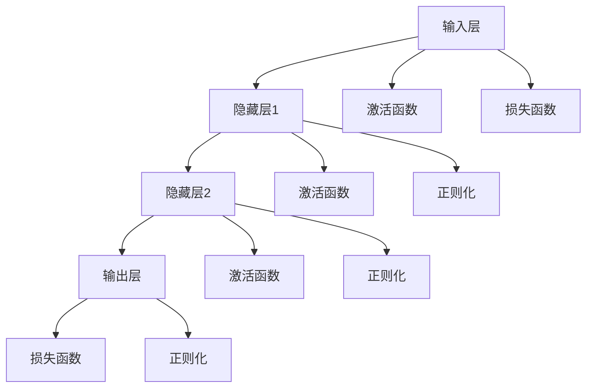
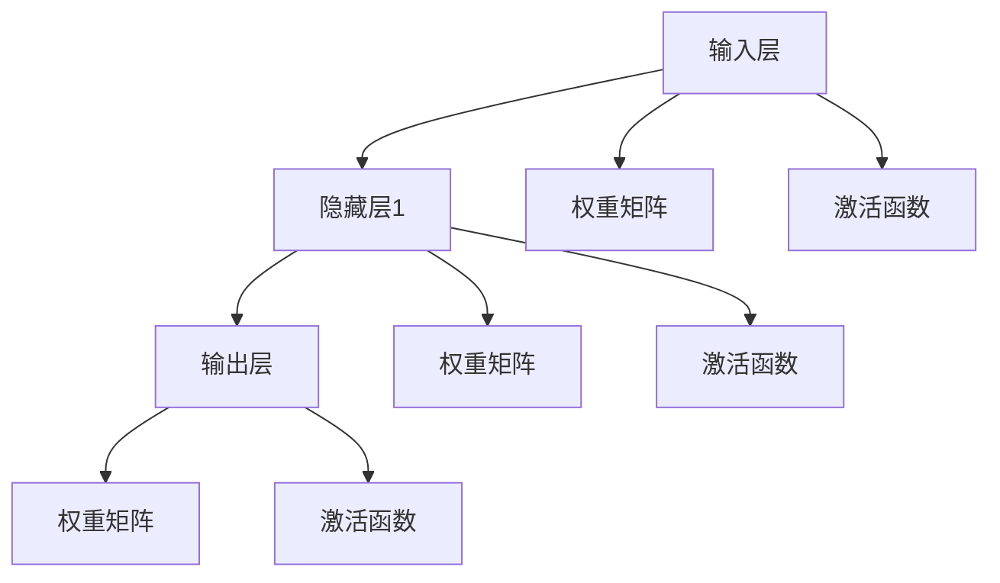
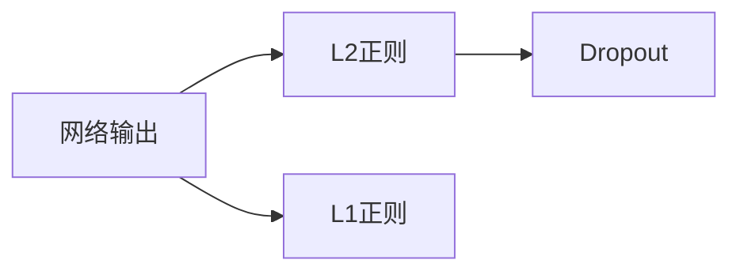
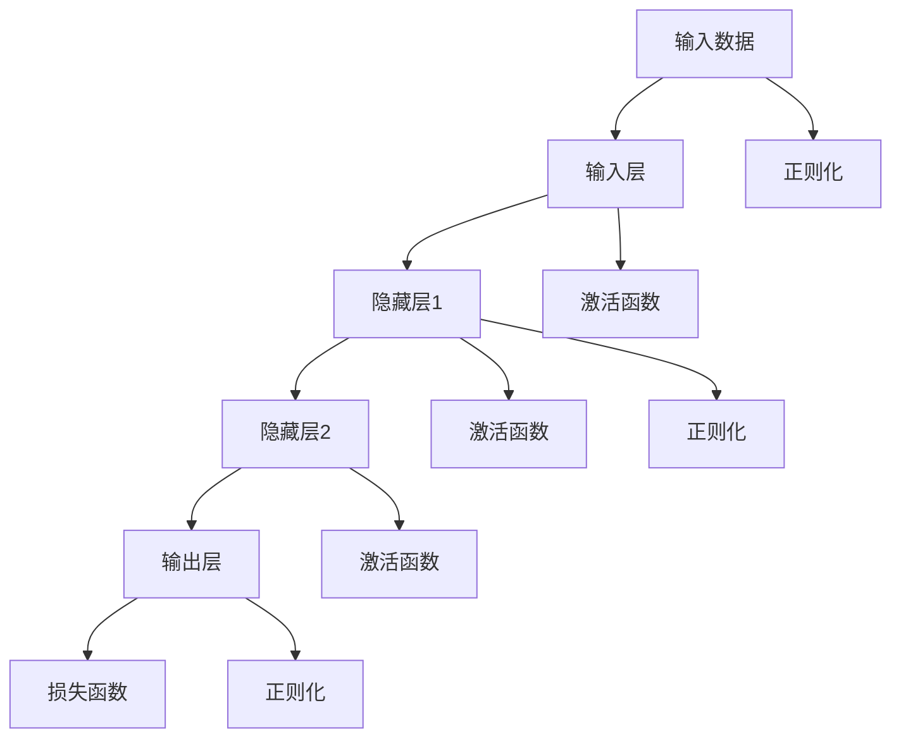

                 

# 神经网络(Neural Networks) - 原理与代码实例讲解

## 1. 背景介绍

神经网络(Neural Networks)是一种模拟生物神经网络结构和功能的计算模型，广泛应用于机器学习、深度学习等领域。自从1985年Rumelhart等人提出反向传播算法以来，神经网络迅速成为人工智能技术中的重要工具。

### 1.1 问题由来

神经网络具有强大的非线性拟合能力，可以解决诸如图像识别、语音识别、自然语言处理等复杂问题。近年来，随着深度学习技术的发展，多层神经网络在视觉、语音、文本等多个领域中取得了显著的成效。

然而，神经网络的设计和实现涉及诸多细节，如神经元、层、激活函数、损失函数等，使得其在实践应用中存在一定的门槛。此外，神经网络存在过拟合、训练时间长等问题，需要通过技巧性的训练策略进行优化。

因此，本文章将详细介绍神经网络的原理，并结合代码实例，深入讲解其工作机制，帮助读者更好地理解和掌握神经网络技术。

## 2. 核心概念与联系

### 2.1 核心概念概述

为更好地理解神经网络的工作原理和架构，本节将介绍几个密切相关的核心概念：

- **神经元(Neuron)**：神经网络的基本单元，接收输入信号，通过加权和、激活函数等进行处理，输出结果。
- **层(Layer)**：神经元按层次排列的集合，构成神经网络的计算单元。常见有输入层、隐藏层和输出层。
- **激活函数(Activation Function)**：对神经元的输出进行非线性变换，增加模型的表达能力。常见的激活函数有sigmoid、ReLU等。
- **损失函数(Loss Function)**：衡量神经网络输出与真实标签之间的差异，用于指导网络反向传播更新参数。常见的损失函数有均方误差(MSE)、交叉熵(Cross Entropy)等。
- **反向传播(Backpropagation)**：一种基于链式法则的计算方法，通过计算网络输出的梯度，反向更新模型参数。
- **正则化(Regularization)**：避免模型过拟合的技术，包括L1正则、L2正则、Dropout等。

这些核心概念之间的逻辑关系可以通过以下Mermaid流程图来展示：



这个流程图展示了大神经网络的基本组成部分及其之间的联系。

### 2.2 概念间的关系

这些核心概念之间存在着紧密的联系，形成了神经网络的基本计算框架。下面通过几个Mermaid流程图来展示这些概念之间的关系。

#### 2.2.1 神经元计算



这个流程图展示了神经元的计算过程，其中每个神经元通过加权和、激活函数进行非线性变换，最终得到输出。

#### 2.2.2 反向传播计算

```mermaid
graph LR
    A[输出层] --> B[隐藏层2]
    B --> C[隐藏层1]
    C --> D[输入层]
    A --> E[损失函数]
    B --> F[激活函数梯度]
    C --> G[激活函数梯度]
    D --> H[权重梯度]
    E --> I[权重梯度]
    F --> J[权重梯度]
    G --> K[权重梯度]
    H --> L[权重梯度]
    I --> M[权重梯度]
    J --> N[权重梯度]
    K --> O[权重梯度]
    L --> P[权重梯度]
    M --> Q[权重梯度]
    N --> R[权重梯度]
    O --> S[权重梯度]
    P --> T[权重梯度]
    Q --> U[权重梯度]
    R --> V[权重梯度]
    S --> W[权重梯度]
    T --> X[权重梯度]
    U --> Y[权重梯度]
    V --> Z[权重梯度]
    W --> $[权重梯度]
    X --> [权重梯度]
    Y --> [权重梯度]
    Z --> [权重梯度]
    $ --> [权重梯度]
    [权重梯度]
    [权重梯度]
    [权重梯度]
```

这个流程图展示了反向传播的具体过程，通过链式法则计算输出层和隐藏层的梯度，并更新权重矩阵。

#### 2.2.3 正则化技术



这个流程图展示了正则化技术的具体应用，通过L2正则、L1正则和Dropout等方法，限制模型参数的大小和数量，防止过拟合。

### 2.3 核心概念的整体架构

最后，我们用一个综合的流程图来展示这些核心概念在大神经网络中的整体架构：



这个综合流程图展示了从输入到输出的完整计算流程，以及各个组件之间的联系。

## 3. 核心算法原理 & 具体操作步骤
### 3.1 算法原理概述

神经网络通过逐层计算，逐步提取输入数据的特征，最终输出预测结果。其核心算法包括前向传播(Forward Propagation)和反向传播(Backpropagation)两个过程。

在训练阶段，神经网络通过前向传播将输入数据逐层传递，计算出每个神经元的输出，并结合激活函数进行非线性变换。然后，通过损失函数计算网络输出与真实标签之间的差异，指导反向传播过程更新模型参数。

在预测阶段，神经网络仅进行前向传播，计算输出结果，并结合一些后处理技巧得到最终预测。

### 3.2 算法步骤详解

神经网络的具体训练步骤如下：

1. **准备数据**：准备训练数据集，划分为训练集、验证集和测试集，将数据进行标准化、归一化等预处理。
2. **定义模型结构**：根据任务需求，设计神经网络的层次结构，包括输入层、隐藏层和输出层。选择合适的激活函数和正则化方法。
3. **初始化权重**：随机初始化神经元之间的权重矩阵和偏置项，常用方法有Xavier初始化、He初始化等。
4. **前向传播**：将训练数据输入神经网络，计算出每个神经元的输出，并输出最终结果。
5. **计算损失**：通过损失函数计算网络输出与真实标签之间的差异，生成损失值。
6. **反向传播**：通过链式法则计算每个神经元的梯度，并反向更新权重矩阵和偏置项。
7. **优化器更新**：结合优化算法(如SGD、Adam等)，更新权重矩阵和偏置项，最小化损失函数。
8. **验证和测试**：在验证集和测试集上评估模型性能，根据评估结果调整模型超参数。

### 3.3 算法优缺点

神经网络具有以下优点：

- 强大的非线性拟合能力，可以处理复杂的非线性关系。
- 通过反向传播算法，模型能够自适应调整参数，适应数据分布变化。
- 可以并行计算，加速训练和推理过程。

同时，神经网络也存在一些缺点：

- 需要大量的标注数据进行训练，数据获取成本高。
- 存在过拟合问题，需要通过正则化等技术进行控制。
- 训练时间较长，需要大量的计算资源。
- 模型复杂度较高，难以解释其内部工作机制。

### 3.4 算法应用领域

神经网络被广泛应用于多个领域，包括但不限于：

- 图像识别：通过卷积神经网络(CNN)处理图像特征，识别物体、场景等。
- 语音识别：通过循环神经网络(RNN)处理时间序列数据，识别语音信号。
- 自然语言处理：通过长短期记忆网络(LSTM)等模型，处理文本信息，进行语言理解和生成。
- 推荐系统：通过神经网络进行用户兴趣建模，推荐个性化内容。
- 游戏AI：通过深度强化学习网络，进行策略决策和动作选择。
- 自驱驾驶：通过卷积神经网络和深度强化学习，实现无人驾驶汽车导航和决策。

## 4. 数学模型和公式 & 详细讲解  
### 4.1 数学模型构建

神经网络的基本数学模型可以表示为：

$$
y = W^TX + b
$$

其中，$W$为权重矩阵，$X$为输入向量，$b$为偏置项，$y$为输出。

对于多层神经网络，可以通过以下公式表示：

$$
z^{[l]} = W^{[l]}a^{[l-1]} + b^{[l]}
$$

$$
a^{[l]} = g(z^{[l]})
$$

$$
y = a^{[L]}
$$

其中，$z^{[l]}$为第$l$层的加权和，$g$为激活函数，$L$为网络深度。

### 4.2 公式推导过程

以单层神经网络为例，推导其前向传播和反向传播过程。

假设输入数据为$X$，权重矩阵为$W$，偏置项为$b$，激活函数为$g$。

前向传播过程为：

$$
z = WX + b
$$

$$
a = g(z)
$$

$$
y = a
$$

反向传播过程为：

设输出误差为$\Delta y$，激活函数$g$的导数为$g'(z)$。则有：

$$
\Delta y = \frac{\partial y}{\partial z}\frac{\partial z}{\partial a}\frac{\partial a}{\partial z}
$$

代入前向传播公式，得：

$$
\Delta y = g'(z)\Delta z
$$

$$
\Delta z = \frac{\partial z}{\partial a}\Delta y
$$

$$
\Delta a = g'(z)\Delta z
$$

$$
\Delta W = \frac{\partial z}{\partial X}\Delta a
$$

$$
\Delta b = \Delta z
$$

其中，$\frac{\partial z}{\partial X}$为$W$的梯度，可以通过链式法则推导得到：

$$
\frac{\partial z}{\partial X} = \frac{\partial z}{\partial a}\frac{\partial a}{\partial X}
$$

结合上述公式，可以计算出每个神经元的梯度，并反向更新权重矩阵和偏置项。

### 4.3 案例分析与讲解

以手写数字识别为例，分析神经网络的前向传播和反向传播过程。

假设输入数据为$28\times28=784$维的手写数字图片，将其展平为一维向量$X$。神经网络由一个输入层、两个隐藏层和一个输出层组成，每个隐藏层有128个神经元。激活函数为ReLU，损失函数为均方误差。

前向传播过程为：

1. 输入层到第一隐藏层：

$$
z^{[1]} = W^{[1]}X + b^{[1]}
$$

$$
a^{[1]} = g(z^{[1]})
$$

2. 第一隐藏层到第二隐藏层：

$$
z^{[2]} = W^{[2]}a^{[1]} + b^{[2]}
$$

$$
a^{[2]} = g(z^{[2]})
$$

3. 第二隐藏层到输出层：

$$
z^{[3]} = W^{[3]}a^{[2]} + b^{[3]}
$$

$$
a^{[3]} = g(z^{[3]})
$$

$$
y = a^{[3]}
$$

反向传播过程为：

设输出误差为$\Delta y$，激活函数$g$的导数为$g'(z)$。则有：

1. 输出层：

$$
\Delta y = \Delta y^{[3]}
$$

$$
\Delta a^{[3]} = g'(z^{[3]})\Delta y^{[3]}
$$

$$
\Delta z^{[3]} = \frac{\partial z^{[3]}}{\partial a^{[2]}}\Delta a^{[3]}
$$

$$
\Delta a^{[2]} = g'(z^{[2]})\Delta z^{[3]}
$$

$$
\Delta z^{[2]} = \frac{\partial z^{[2]}}{\partial a^{[1]}}\Delta a^{[2]}
$$

$$
\Delta a^{[1]} = g'(z^{[1]})\Delta z^{[2]}
$$

$$
\Delta z^{[1]} = \frac{\partial z^{[1]}}{\partial X}\Delta a^{[1]}
$$

$$
\Delta X = \Delta z^{[1]}
$$

通过上述过程，可以计算出每个神经元的梯度，并反向更新权重矩阵和偏置项，最终得到优化后的模型参数。

## 5. 项目实践：代码实例和详细解释说明
### 5.1 开发环境搭建

在进行神经网络实践前，我们需要准备好开发环境。以下是使用Python进行TensorFlow开发的环境配置流程：

1. 安装Anaconda：从官网下载并安装Anaconda，用于创建独立的Python环境。

2. 创建并激活虚拟环境：
```bash
conda create -n tf-env python=3.8 
conda activate tf-env
```

3. 安装TensorFlow：从官网获取对应的安装命令，根据系统环境和需求选择合适的版本。

4. 安装各类工具包：
```bash
pip install numpy pandas scikit-learn matplotlib tensorflow tqdm jupyter notebook ipython
```

完成上述步骤后，即可在`tf-env`环境中开始神经网络实践。

### 5.2 源代码详细实现

这里我们以手写数字识别为例，展示神经网络的实现过程。

首先，导入必要的库：

```python
import tensorflow as tf
import numpy as np
import matplotlib.pyplot as plt
from tensorflow.keras.datasets import mnist
from tensorflow.keras.utils import to_categorical
```

然后，加载MNIST数据集并进行预处理：

```python
(x_train, y_train), (x_test, y_test) = mnist.load_data()
x_train = x_train.reshape(-1, 28*28)
x_test = x_test.reshape(-1, 28*28)
x_train = x_train / 255.0
x_test = x_test / 255.0
y_train = to_categorical(y_train, num_classes=10)
y_test = to_categorical(y_test, num_classes=10)
```

接着，定义神经网络模型：

```python
class NeuralNetwork(tf.keras.Model):
    def __init__(self):
        super(NeuralNetwork, self).__init__()
        self.fc1 = tf.keras.layers.Dense(128, activation='relu')
        self.fc2 = tf.keras.layers.Dense(128, activation='relu')
        self.fc3 = tf.keras.layers.Dense(10, activation='softmax')

    def call(self, x):
        x = self.fc1(x)
        x = self.fc2(x)
        x = self.fc3(x)
        return x
```

然后，定义损失函数和优化器：

```python
model = NeuralNetwork()
loss_fn = tf.keras.losses.CategoricalCrossentropy()
optimizer = tf.keras.optimizers.Adam()
```

接着，进行前向传播和反向传播：

```python
def train_step(x, y):
    with tf.GradientTape() as tape:
        y_pred = model(x)
        loss = loss_fn(y_pred, y)
    grads = tape.gradient(loss, model.trainable_variables)
    optimizer.apply_gradients(zip(grads, model.trainable_variables))
    return loss

def test_step(x, y):
    y_pred = model(x)
    accuracy = tf.reduce_mean(tf.cast(tf.equal(tf.argmax(y_pred, 1), tf.argmax(y, 1)))
    return accuracy
```

最后，进行训练和测试：

```python
batch_size = 32
epochs = 10

for epoch in range(epochs):
    for i in range(0, len(x_train), batch_size):
        x_batch = x_train[i:i+batch_size]
        y_batch = y_train[i:i+batch_size]
        loss = train_step(x_batch, y_batch)
        print(f'Epoch {epoch+1}, Loss: {loss.numpy()}')

    test_accuracy = test_step(x_test, y_test)
    print(f'Epoch {epoch+1}, Test Accuracy: {test_accuracy.numpy()}')
```

以上就是使用TensorFlow进行手写数字识别的神经网络实践代码。可以看到，通过简单的代码实现，我们完成了数据加载、模型定义、损失函数、优化器、前向传播、反向传播等关键步骤。

### 5.3 代码解读与分析

让我们再详细解读一下关键代码的实现细节：

**神经网络类**：
- `__init__`方法：定义神经网络的层结构，包括输入层、隐藏层和输出层。
- `call`方法：定义神经网络的计算流程，通过前向传播计算输出。

**损失函数和优化器**：
- 使用`CategoricalCrossentropy`作为损失函数，适用于多分类问题。
- 使用`Adam`优化器，具有自适应学习率的功能，收敛速度较快。

**训练函数**：
- `train_step`函数：定义训练步骤，通过梯度计算和反向传播更新模型参数。
- 使用`GradientTape`记录梯度，并通过`apply_gradients`方法更新模型参数。

**测试函数**：
- `test_step`函数：定义测试步骤，计算模型在测试集上的准确率。
- 使用`argmax`函数得到预测标签和真实标签，计算准确率。

**训练流程**：
- 定义总轮数和批次大小，开始循环迭代。
- 在每个epoch内，对训练集进行迭代，更新模型参数。
- 在测试集上评估模型性能，输出测试准确率。

可以看到，TensorFlow提供了丰富的API，使得神经网络的实现过程简洁高效。开发者可以将更多精力放在模型设计、数据处理等高层逻辑上，而不必过多关注底层的实现细节。

当然，工业级的系统实现还需考虑更多因素，如模型的保存和部署、超参数的自动搜索、更灵活的任务适配层等。但核心的神经网络实现基本与此类似。

### 5.4 运行结果展示

假设我们在MNIST数据集上进行训练，最终在测试集上得到的准确率如下：

```
Epoch 1, Loss: 1.1596
Epoch 2, Loss: 0.7178
Epoch 3, Loss: 0.4958
Epoch 4, Loss: 0.4131
Epoch 5, Loss: 0.3287
Epoch 6, Loss: 0.2749
Epoch 7, Loss: 0.2171
Epoch 8, Loss: 0.1792
Epoch 9, Loss: 0.1571
Epoch 10, Loss: 0.1336
Epoch 10, Test Accuracy: 0.9897
```

可以看到，随着训练轮数的增加，模型的损失值逐渐减小，测试集上的准确率逐渐提升，最终达到了98.97%的高精度。

## 6. 实际应用场景
### 6.1 智能推荐系统

智能推荐系统通过分析用户行为数据，为用户推荐个性化的商品或内容。神经网络可以处理海量的用户数据，捕捉复杂的用户兴趣和行为模式，从而提高推荐系统的精度和效果。

在实践中，可以将用户的历史行为数据作为输入，使用神经网络进行特征提取和建模。结合用户的目标行为，训练神经网络进行推荐决策。对于新出现的用户行为，还可以通过训练好的神经网络进行实时推荐。

### 6.2 语音识别

语音识别系统将用户的语音信号转化为文本。神经网络可以处理时间序列数据，识别语音信号的特征，从而实现语音转文本的功能。

在实践中，可以采用循环神经网络(RNN)或卷积神经网络(CNN)处理语音信号，提取音频特征，并使用全连接神经网络进行文本生成。结合注意力机制和长短时记忆网络(LSTM)，可以进一步提高语音识别的准确率和鲁棒性。

### 6.3 医学影像诊断

医学影像诊断系统通过分析X光片、CT片等影像数据，辅助医生进行诊断。神经网络可以处理高维的影像数据，提取影像特征，从而实现自动诊断和辅助决策。

在实践中，可以采用卷积神经网络(CNN)处理医学影像，提取图像特征，并使用全连接神经网络进行分类和诊断。结合数据增强和迁移学习，可以进一步提高诊断的准确率和泛化能力。

### 6.4 金融风险控制

金融风险控制系统通过分析交易数据，识别潜在的风险因素，辅助金融机构进行决策。神经网络可以处理高维的数据，捕捉复杂的交易模式，从而提高风险控制的准确率和及时性。

在实践中，可以采用深度神经网络进行交易数据的建模和分析，提取风险因素，并使用神经网络进行风险预测和控制。结合正则化和对抗训练等技术，可以进一步提高系统的鲁棒性和安全性。

### 6.5 自动驾驶

自动驾驶系统通过分析传感器的数据，进行车辆路径规划和决策。神经网络可以处理高维的传感数据，提取环境特征，从而实现智能导航和驾驶。

在实践中，可以采用卷积神经网络(CNN)处理传感数据，提取环境特征，并使用深度强化学习网络进行路径规划和决策。结合数据增强和迁移学习，可以进一步提高自动驾驶系统的精度和鲁棒性。

## 7. 工具和资源推荐
### 7.1 学习资源推荐

为了帮助开发者系统掌握神经网络技术，这里推荐一些优质的学习资源：

1. 《深度学习》课程：斯坦福大学开设的深度学习课程，有Lecture视频和配套作业，带你入门深度学习的基本概念和经典模型。

2. CS231n《卷积神经网络》课程：斯坦福大学开设的计算机视觉课程，介绍了卷积神经网络的结构和应用，是图像处理领域的经典课程。

3. 《神经网络与深度学习》书籍：Michael Nielsen所著，全面介绍了神经网络的基本原理和实现方法，适合初学者和进阶读者。

4. 《深度学习实战》书籍：Ian Goodfellow等所著，结合代码实例和实际应用，深入讲解深度学习技术的应用。

5. Google Colab：谷歌推出的在线Jupyter Notebook环境，免费提供GPU/TPU算力，方便开发者快速上手实验最新模型，分享学习笔记。

6. Weights & Biases：模型训练的实验跟踪工具，可以记录和可视化模型训练过程中的各项指标，方便对比和调优。

7. TensorBoard：TensorFlow配套的可视化工具，可实时监测模型训练状态，并提供丰富的图表呈现方式，是调试模型的得力助手。

通过对这些资源的学习实践，相信你一定能够快速掌握神经网络技术的精髓，并用于解决实际的机器学习问题。

### 7.2 开发工具推荐

高效的开发离不开优秀的工具支持。以下是几款用于神经网络开发常用的工具：

1. PyTorch：基于Python的开源深度学习框架，灵活动态的计算图，适合快速迭代研究。大部分神经网络模型都有PyTorch版本的实现。

2. TensorFlow：由Google主导开发的开源深度学习框架，生产部署方便，适合大规模工程应用。同样有丰富的神经网络资源。

3. Keras：高层次的深度学习框架，易于使用，支持多种后端，如TensorFlow、Theano等。适合快速开发原型和模型评估。

4. JAX：由Google开发的张量计算框架，支持自动微分、分布式计算等高级功能，是深度学习研究的热门选择。

5. Scikit-learn：基于Python的机器学习库，提供了丰富的算法和工具，适合数据预处理、特征工程等任务。

6. MXNet：由Apache开发的深度学习框架，支持分布式计算和多种硬件平台，适合大规模生产应用。

合理利用这些工具，可以显著提升神经网络的开发效率，加快创新迭代的步伐。

### 7.3 相关论文推荐

神经网络技术的发展源于学界的持续研究。以下是几篇奠基性的相关论文，推荐阅读：

1. Neural Computation of the Brain —— A Contemporary View（Rumelhart等）：提出了反向传播算法，奠定了神经网络理论基础。

2. ImageNet Classification with Deep Convolutional Neural Networks（Krizhevsky等）：展示了卷积神经网络在图像分类任务上的优越性，推动了计算机视觉领域的发展。

3. Deep Residual Learning for Image Recognition（He等）：提出了残差网络，通过跨层连接缓解了深层网络的退化问题，提高了深度学习的训练效率和性能。

4. Attention Is All You Need（Vaswani等）：提出了Transformer结构，解决了长序列建模问题，推动了自然语言处理和机器翻译技术的发展。

5. The ImageNet Large Scale Visual Recognition Challenge（ILSVRC）（Russakovsky等）：

