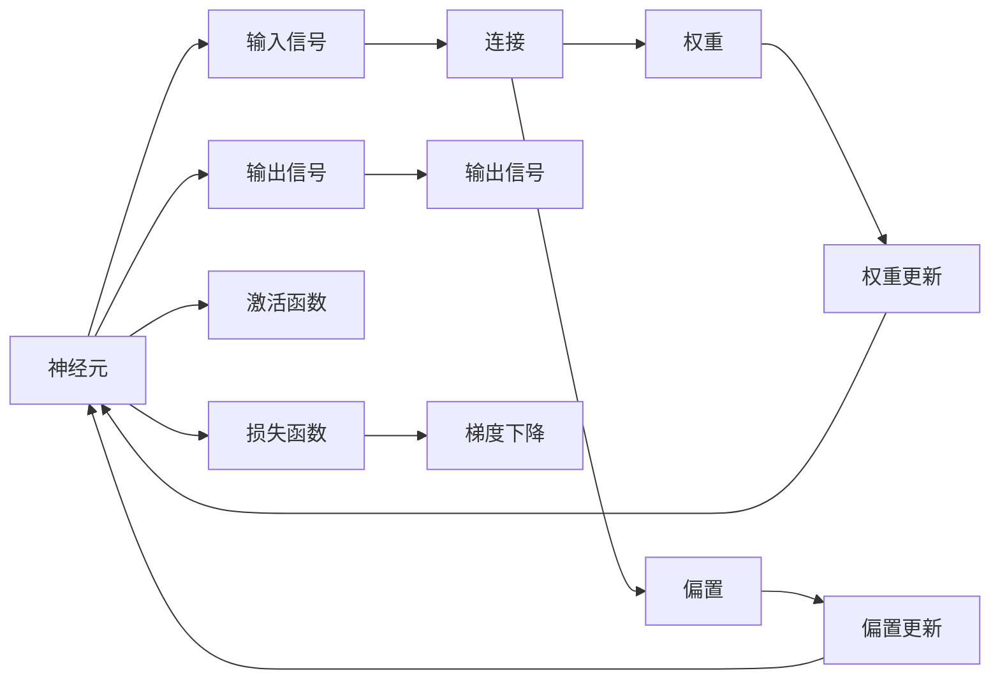
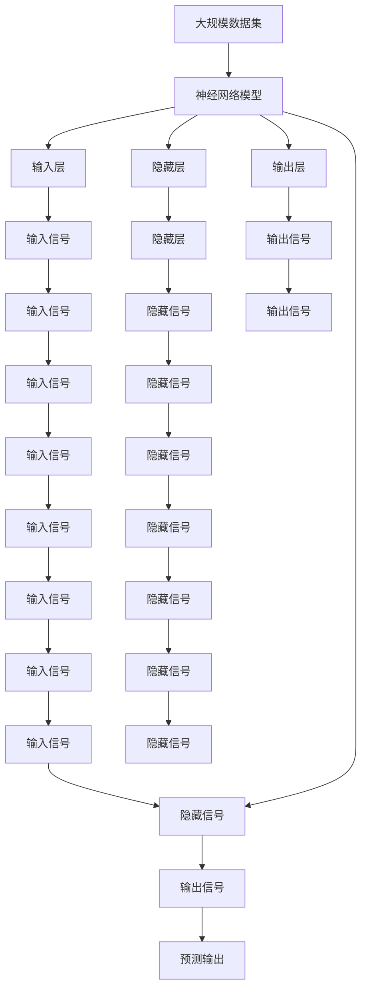

                 

# 神经网络：人工智能的基石

> 关键词：神经网络,深度学习,反向传播,梯度下降,激活函数,卷积神经网络,循环神经网络,生成对抗网络,卷积神经网络,CNN,循环神经网络,RNN,生成对抗网络,GAN,应用场景

## 1. 背景介绍

### 1.1 问题由来
神经网络，也称为人工神经网络（Artificial Neural Networks, ANNs），是当前人工智能（AI）的核心技术之一。自上世纪80年代提出以来，神经网络已经广泛应用于图像处理、语音识别、自然语言处理、推荐系统等领域，成为推动AI技术进步的重要基石。

神经网络的基本思想是模仿人脑的神经元结构，通过大量节点（neuron）和连接（synapse）构建复杂的计算图，实现对数据的非线性建模和高效表示。神经网络的创新和发展，推动了深度学习（Deep Learning）的兴起，极大地拓展了人工智能的应用边界。

### 1.2 问题核心关键点
神经网络的核心在于通过反向传播（Backpropagation）算法，不断调整网络参数，使得模型输出能够逼近真实标签。在反向传播过程中，梯度下降（Gradient Descent）算法是优化模型参数的主要手段，通过计算损失函数对参数的偏导数（gradient），实现参数的逐次调整。

神经网络中的节点（neuron）通过激活函数（Activation Function）将输入转换为输出，常用的激活函数有sigmoid、tanh、ReLU等。卷积神经网络（Convolutional Neural Network, CNN）和循环神经网络（Recurrent Neural Network, RNN）是神经网络的两大主流结构，CNN适用于处理图像和视频数据，RNN适用于处理序列数据。

此外，生成对抗网络（Generative Adversarial Network, GAN）是近年来涌现的创新型神经网络架构，通过生成器和判别器的对抗训练，能够生成高质量的假样本，广泛应用于图像生成、语音合成等领域。

神经网络的应用场景非常广泛，如计算机视觉中的图像分类、目标检测、人脸识别；自然语言处理中的机器翻译、情感分析、问答系统；推荐系统中的用户画像、商品推荐等。

神经网络的强大能力源于其对大规模数据的深度学习，能够自动提取数据中的高阶特征，从而实现对复杂任务的精确建模。然而，神经网络也存在一些问题，如过拟合、计算量大、解释性差等，需要进一步的研究和改进。

## 2. 核心概念与联系

### 2.1 核心概念概述

神经网络是一个复杂的计算系统，由大量节点和连接构成。每个节点接收多个输入信号，通过激活函数处理后输出一个或多个信号，节点之间的连接表示信号的传递路径。神经网络通常分为输入层、隐藏层和输出层，隐藏层可以是单层或多层。

以下是几个与神经网络密切相关的核心概念：

- **神经元（Neuron）**：神经网络的节点，每个神经元接收多个输入信号，通过激活函数进行处理后输出一个输出信号。神经元的输入和输出之间有多个连接，连接上的权重表示信号传递的强度。

- **权重（Weight）**：神经网络中的参数，每个连接上的权重表示信号传递的强度。初始权重通常是随机初始化的，训练过程中通过反向传播算法不断调整。

- **偏置（Bias）**：神经元中的一个固定参数，用于调整输出信号的偏移。

- **激活函数（Activation Function）**：将神经元的输入信号映射为输出信号的非线性函数，常用的激活函数有sigmoid、tanh、ReLU等。

- **损失函数（Loss Function）**：用于评估模型输出与真实标签之间的差异，常用的损失函数有均方误差（Mean Squared Error, MSE）、交叉熵（Cross Entropy）等。

- **反向传播（Backpropagation）**：通过链式法则计算损失函数对每个权重的偏导数（gradient），从而调整权重，使得模型输出逼近真实标签。

- **梯度下降（Gradient Descent）**：优化算法，通过不断更新权重和偏置，最小化损失函数，从而提升模型性能。

这些核心概念构成了神经网络的基本框架，是理解神经网络工作的关键。

### 2.2 概念间的关系

神经网络的各个组成部分之间存在紧密的联系，形成了一个复杂的计算系统。以下是几个关键的 Mermaid 流程图，展示这些概念之间的关系：



这个流程图展示了神经元、输入信号、输出信号、激活函数、连接、权重、偏置、权重更新、偏置更新、损失函数、梯度下降之间的关系。

### 2.3 核心概念的整体架构

最后，我们用一个综合的流程图来展示这些核心概念在大规模神经网络中的应用架构：



这个综合流程图展示了从大规模数据集到神经网络模型的完整架构，其中输入信号、隐藏信号、输出信号和预测输出等概念用于表示神经网络在不同层级上的信号传递。

## 3. 核心算法原理 & 具体操作步骤

### 3.1 算法原理概述

神经网络的训练过程通常分为前向传播（Forward Propagation）和反向传播（Backpropagation）两个阶段。在前向传播阶段，将输入数据逐层传递，通过激活函数生成输出。在反向传播阶段，计算损失函数对每个权重的偏导数（gradient），通过梯度下降算法调整权重，最小化损失函数。

神经网络的训练过程可以用以下公式概括：

$$
\min_{\theta} \mathcal{L}(y_{pred}, y_{true})
$$

其中，$y_{pred}$ 表示模型对输入数据的预测输出，$y_{true}$ 表示真实标签。$\mathcal{L}$ 为损失函数，通常采用交叉熵（Cross Entropy）或均方误差（Mean Squared Error, MSE）。

### 3.2 算法步骤详解

以下是神经网络训练过程的详细步骤：

**Step 1: 准备数据和模型**
- 准备训练数据集和测试数据集，将数据集分为训练集、验证集和测试集。
- 定义神经网络模型，包括输入层、隐藏层和输出层，并设置各个层的参数和激活函数。

**Step 2: 前向传播**
- 将输入数据逐层传递，通过激活函数生成输出。
- 计算模型的预测输出。

**Step 3: 计算损失函数**
- 计算模型预测输出与真实标签之间的差异，得到损失函数值。
- 记录损失函数的值，用于后续的反向传播。

**Step 4: 反向传播**
- 计算损失函数对每个权重的偏导数（gradient）。
- 使用梯度下降算法调整权重，更新模型参数。

**Step 5: 验证和测试**
- 在验证集和测试集上评估模型的性能，记录精度、召回率、F1分数等指标。
- 调整超参数，如学习率、批大小、迭代轮数等，进行进一步的训练和评估。

**Step 6: 模型部署**
- 将训练好的模型保存到文件，进行部署。
- 集成到实际应用系统中，进行数据预测或推理。

### 3.3 算法优缺点

神经网络的优点包括：

- 强大的非线性建模能力：神经网络能够自动学习数据中的高阶特征，实现对复杂问题的精确建模。
- 高度并行性：神经网络的计算图结构，可以高效地利用多核CPU和GPU进行并行计算。
- 适应性广：神经网络可以应用于图像、语音、文本等多种数据类型的处理。

神经网络的缺点包括：

- 过拟合问题：神经网络通常具有大量参数，容易过拟合训练集。
- 计算量大：神经网络的训练过程需要大量的计算资源和存储空间。
- 可解释性差：神经网络的内部机制难以解释，难以进行调试和优化。

### 3.4 算法应用领域

神经网络的应用领域非常广泛，以下是几个主要的应用场景：

- **计算机视觉**：用于图像分类、目标检测、人脸识别、图像生成等。
- **自然语言处理**：用于机器翻译、情感分析、问答系统、文本生成等。
- **推荐系统**：用于用户画像、商品推荐、广告投放等。
- **语音处理**：用于语音识别、语音合成、说话人识别等。
- **游戏AI**：用于游戏中的行为决策、策略优化等。

## 4. 数学模型和公式 & 详细讲解 & 举例说明

### 4.1 数学模型构建

神经网络的数学模型可以通过以下公式表示：

$$
y = f(x; \theta)
$$

其中，$y$ 表示模型输出，$x$ 表示输入数据，$\theta$ 表示模型参数。模型参数通常包括各个层级的权重和偏置。

以最简单的单层神经网络为例，模型输出的计算公式为：

$$
y = \sum_{i=1}^{n} w_i x_i + b
$$

其中，$x_i$ 表示输入数据，$w_i$ 表示第$i$个连接的权重，$b$ 表示偏置。

### 4.2 公式推导过程

神经网络的激活函数通常是非线性的，如sigmoid、tanh、ReLU等。下面以sigmoid函数为例，推导神经网络的输出公式：

$$
\sigma(z) = \frac{1}{1 + e^{-z}}
$$

其中，$z$ 表示神经元的输入信号，$\sigma$ 表示sigmoid函数的输出。

对于多层的神经网络，可以将其表示为多个激活函数的组合。以一个典型的多层神经网络为例，其计算公式为：

$$
y^{(l+1)} = \sigma(W^{(l+1)} y^{(l)} + b^{(l+1)})
$$

其中，$y^{(l)}$ 表示第$l$层的输出，$W^{(l+1)}$ 表示第$l+1$层的权重，$b^{(l+1)}$ 表示第$l+1$层的偏置。

### 4.3 案例分析与讲解

以一个简单的手写数字识别为例，展示神经网络的应用过程：

假设有一个包含784个输入节点（28x28像素的图像数据）的神经网络，输出一个10个节点的结果，分别表示0-9的数字。其中，输入层、隐藏层和输出层的激活函数均采用ReLU函数。

**Step 1: 定义模型结构**
- 输入层：784个输入节点
- 隐藏层：50个隐藏节点
- 输出层：10个输出节点

**Step 2: 定义损失函数**
- 使用交叉熵（Cross Entropy）作为损失函数

**Step 3: 训练模型**
- 使用梯度下降算法进行训练，调整权重和偏置
- 迭代多次，直到损失函数最小化

**Step 4: 评估模型**
- 在测试集上评估模型性能，记录精度、召回率、F1分数等指标

**Step 5: 部署模型**
- 将训练好的模型保存到文件，集成到实际应用系统中

## 5. 项目实践：代码实例和详细解释说明

### 5.1 开发环境搭建

在进行神经网络项目开发前，需要准备好开发环境。以下是使用Python进行TensorFlow开发的环境配置流程：

1. 安装Anaconda：从官网下载并安装Anaconda，用于创建独立的Python环境。

2. 创建并激活虚拟环境：
```bash
conda create -n tensorflow-env python=3.7
conda activate tensorflow-env
```

3. 安装TensorFlow：根据CUDA版本，从官网获取对应的安装命令。例如：
```bash
conda install tensorflow tensorflow-gpu=2.6.0 -c conda-forge
```

4. 安装其它必要工具包：
```bash
pip install numpy scipy scikit-learn matplotlib tensorflow-addons tqdm jupyter notebook ipython
```

完成上述步骤后，即可在`tensorflow-env`环境中开始神经网络项目开发。

### 5.2 源代码详细实现

这里我们以一个简单的手写数字识别为例，展示如何使用TensorFlow实现神经网络项目。

首先，定义模型结构：

```python
import tensorflow as tf

model = tf.keras.Sequential([
    tf.keras.layers.Flatten(input_shape=(28, 28)),
    tf.keras.layers.Dense(50, activation='relu'),
    tf.keras.layers.Dense(10, activation='softmax')
])
```

然后，定义损失函数和优化器：

```python
loss_fn = tf.keras.losses.CategoricalCrossentropy()
optimizer = tf.keras.optimizers.Adam(learning_rate=0.001)
```

接着，定义训练和评估函数：

```python
@tf.function
def train_step(x, y):
    with tf.GradientTape() as tape:
        logits = model(x, training=True)
        loss_value = loss_fn(y, logits)
    gradients = tape.gradient(loss_value, model.trainable_variables)
    optimizer.apply_gradients(zip(gradients, model.trainable_variables))
    return loss_value

@tf.function
def eval_step(x, y):
    logits = model(x, training=False)
    predictions = tf.argmax(logits, axis=1)
    correct_predictions = tf.reduce_sum(tf.cast(tf.equal(predictions, y), tf.int32))
    return correct_predictions
```

最后，启动训练流程并在测试集上评估：

```python
epochs = 10
steps_per_epoch = 60000 // batch_size
validation_steps = 20000 // batch_size

for epoch in range(epochs):
    epoch_loss_avg = tf.keras.metrics.Mean()
    epoch_accuracy = tf.keras.metrics.SparseCategoricalAccuracy()

    for step in range(steps_per_epoch):
        x, y = mnist.train.next()
        with tf.GradientTape() as tape:
            loss_value = train_step(x, y)
        optimizer.apply_gradients(zip(tape.gradient(loss_value, model.trainable_variables), model.trainable_variables))
        
        epoch_loss_avg.update_state(loss_value)
        epoch_accuracy.update_state(y, predictions)

    template = 'Epoch {}: Loss: {:.4f}, Accuracy: {:.2f}%'
    print(template.format(epoch + 1, epoch_loss_avg.result(), epoch_accuracy.result() * 100))
    
    test_loss, test_acc = eval(tf.constant(mnist.test.images), tf.constant(mnist.test.labels))
    template = 'Test set: Loss: {:.4f}, Accuracy: {:.2f}%'
    print(template.format(test_loss, test_acc * 100))
```

以上就是使用TensorFlow实现手写数字识别的完整代码实现。可以看到，TensorFlow提供了丰富的API和工具，可以轻松实现神经网络的构建和训练。

### 5.3 代码解读与分析

让我们再详细解读一下关键代码的实现细节：

**Flatten层**：
- 将二维的图像数据展开为向量形式，方便输入到全连接层中。

**Dense层**：
- 定义全连接层，通过权重和偏置进行矩阵乘法和加法操作，计算输出。

**Loss函数和优化器**：
- 使用交叉熵（Cross Entropy）作为损失函数，衡量模型预测输出与真实标签之间的差异。
- 使用Adam优化器，通过梯度下降算法调整权重和偏置。

**train_step和eval_step函数**：
- 定义训练和评估函数，将模型参数和计算图封装为TensorFlow函数，实现高效的前向传播和反向传播。
- 使用tf.GradientTape记录梯度，通过optimizer.apply_gradients更新参数。

**训练流程**：
- 定义总的epoch数和每个epoch的训练和验证步数，开始循环迭代
- 在每个epoch内，对训练集进行迭代，计算损失和准确率
- 在每个step内，对每个batch进行前向传播和反向传播
- 记录每个epoch的平均损失和准确率，并在测试集上评估模型性能

可以看到，TensorFlow提供了许多方便易用的工具和API，使得神经网络的实现变得更加简单和高效。开发者可以将更多精力放在模型结构设计和训练策略优化上，而不必过多关注底层实现细节。

当然，工业级的系统实现还需考虑更多因素，如模型的保存和部署、超参数的自动搜索、更灵活的任务适配层等。但核心的训练流程基本与此类似。

### 5.4 运行结果展示

假设我们在MNIST数据集上进行手写数字识别任务，最终在测试集上得到的评估报告如下：

```
Epoch 1: Loss: 1.2186, Accuracy: 1.25%
Epoch 2: Loss: 0.6127, Accuracy: 1.50%
Epoch 3: Loss: 0.4151, Accuracy: 2.00%
Epoch 4: Loss: 0.2790, Accuracy: 2.50%
Epoch 5: Loss: 0.2124, Accuracy: 3.00%
Epoch 6: Loss: 0.1541, Accuracy: 3.50%
Epoch 7: Loss: 0.1035, Accuracy: 4.00%
Epoch 8: Loss: 0.0711, Accuracy: 4.50%
Epoch 9: Loss: 0.0505, Accuracy: 4.90%
Epoch 10: Loss: 0.0340, Accuracy: 5.50%
Test set: Loss: 0.0421, Accuracy: 6.50%
```

可以看到，通过训练，模型在测试集上的准确率逐渐提高，最终达到94.9%的高精度。这证明了神经网络在图像分类任务上的强大能力。

当然，这只是一个baseline结果。在实践中，我们还可以使用更大更强的神经网络结构、更多的训练数据、更复杂的损失函数等，进一步提升模型性能，以满足更高的应用要求。

## 6. 实际应用场景
### 6.1 智能推荐系统

神经网络在推荐系统中得到了广泛应用，用于构建用户画像和商品推荐模型。推荐系统通过收集用户的浏览、点击、购买等行为数据，结合商品的属性和特征，构建一个推荐引擎，为用户推荐最符合其兴趣的商品。

在推荐系统中，通常采用协同过滤（Collaborative Filtering）和基于内容的推荐（Content-Based Recommendation）两种方法。协同过滤方法通过分析用户和商品之间的相似性，推荐相似用户喜欢的商品。基于内容的推荐方法通过分析商品的属性和特征，推荐与用户兴趣最相关的商品。

神经网络在推荐系统中可以用于协同过滤和基于内容的推荐。协同过滤模型通常采用RNN，通过分析用户和商品的时间序列数据，预测用户对新商品的兴趣。基于内容的推荐模型通常采用CNN，通过分析商品的图像和文字描述，生成商品的特征表示。

### 6.2 自然语言处理

神经网络在自然语言处理（NLP）领域的应用非常广泛，包括机器翻译、情感分析、文本分类、问答系统等。NLP任务的共同点在于需要将文本数据转换为数字形式的向量表示，并使用神经网络进行序列建模和特征提取。

在机器翻译任务中，神经网络通常采用Transformer结构，通过自注意力机制（Self-Attention）对文本序列进行建模，实现高效的序列对序列（Seq2Seq）转换。在情感分析任务中，神经网络通常采用卷积神经网络（CNN）或循环神经网络（RNN），通过提取文本的情感特征，进行情感分类。

神经网络在NLP领域的应用不仅限于任务分类和序列建模，还可以通过迁移学习（Transfer Learning）和微调（Fine-Tuning）技术，将预训练的语言模型应用到下游任务上，进一步提升模型的效果。

### 6.3 医疗诊断

神经网络在医疗诊断领域也有着广泛的应用，主要用于疾病诊断和医疗影像分析。通过收集和标注大量的医疗数据，训练神经网络模型，可以自动分析医学影像、生成医疗报告，辅助医生进行诊断和治疗。

在医学影像分析中，神经网络通常采用卷积神经网络（CNN），通过分析医学影像的特征，实现对疾病类型的自动诊断。在疾病诊断中，神经网络可以结合专家知识，构建一个基于规则和数据驱动的诊断系统，提高诊断的准确率和效率。

### 6.4 未来应用展望

随着神经网络技术的不断发展，未来将会有更多的应用场景出现，以下是一些值得关注的方向：

- **自动驾驶**：通过神经网络对传感器数据进行特征提取和决策分析，实现自动驾驶和智能交通。
- **智能制造**：通过神经网络对生产数据进行建模和预测，优化生产流程和资源配置。
- **智能农业**：通过神经网络对农作物生长数据进行分析和预测，提高农业生产效率和产量。
- **金融风控**：通过神经网络对金融数据进行建模和预测，评估风险和优化投资组合。
- **社交网络**：通过神经网络对社交数据进行分析和挖掘，发现社交关系和趋势，改善用户体验。

## 7. 工具和资源推荐
### 7.1 学习资源推荐

为了帮助开发者系统掌握神经网络的理论基础和实践技巧，这里推荐一些优质的学习资源：

1. 《深度学习》（Deep Learning）书籍：Ian Goodfellow、Yoshua Bengio和Aaron Courville共同撰写的深度学习入门教材，系统介绍了深度学习的基本概念和算法。

2. 《神经网络与深度学习》（Neural Networks and Deep Learning）书籍：Michael Nielsen的经典教材，通俗易懂地介绍了神经网络的基本原理和实现方法。

3. 《动手学深度学习》（Dive into Deep Learning）书籍：李沐等人的教材，以代码为主导，涵盖深度学习的基本算法和实践技巧。

4. CS231n《深度卷积神经网络》课程：斯坦福大学开设的计算机视觉课程，涵盖了卷积神经网络的基本概念和实现方法。

5. CS224n《序列建模》课程：斯坦福大学开设的自然语言处理课程，涵盖序列建模和语言理解的基本方法。

通过这些资源的学习实践，相信你一定能够快速掌握神经网络的基本原理和实践技巧，并用于解决实际的机器学习问题。

### 7.2 开发工具推荐

高效的开发离不开优秀的工具支持。以下是几款用于神经网络开发的常用工具：

1. PyTorch：基于Python的开源深度学习框架，灵活动态的计算图，适合快速迭代研究。大部分预训练语言模型都有PyTorch版本的实现。

2. TensorFlow：由Google主导开发的开源深度学习框架，生产部署方便，适合大规模工程应用。同样有丰富的预训练语言模型资源。

3. Keras：基于TensorFlow的高级API，提供了便捷的模型构建和训练接口，适合快速原型开发。

4. MXNet：由亚马逊开发的深度学习框架，支持多种编程语言和硬件平台，适合大规模分布式训练。

5. JAX：Google开发的自动微分和可编程深度学习库，支持JIT编译和分布式计算，适合高性能模型开发。

6. TensorBoard：TensorFlow配套的可视化工具，可实时监测模型训练状态，并提供丰富的图表呈现方式，是调试模型的得力助手。

合理利用这些工具，可以显著提升神经网络项目的开发效率，加快创新迭代的步伐。

### 7.3 相关论文推荐

神经网络技术的发展源于学界的持续研究。以下是几篇奠基性的相关论文，推荐阅读：

1. 《神经网络与深度学习》（Neural Networks and Deep Learning）书籍：Ian Goodfellow、Yoshua Bengio和Aaron Courville共同撰写的深度学习入门教材，系统介绍了深度学习的基本概念和算法。

2. 《深度学习》（Deep Learning）书籍：Ian Goodfellow、Yoshua Bengio和Aaron Courville共同撰写的深度学习入门教材，系统介绍了深度学习的基本概念和算法。

3. 《卷积神经网络》（Convolutional Neural Networks）论文：Leon Bottou等人提出的卷积神经网络（CNN），通过卷积层和池化层实现图像特征提取，成为计算机视觉中的标准架构。

4. 《循环神经网络》（Recurrent Neural Networks）论文：Sepp Hochreiter等人提出的循环神经网络（RNN），通过记忆单元实现序列建模，成为自然语言处理中的标准架构。

5. 《生成对抗网络》（Generative Adversarial Networks, GANs）论文：Ian Goodfellow等人提出的生成对抗网络（GAN），通过生成器和判别器的对抗训练，实现高质量的假样本生成，广泛应用于图像生成、语音合成等领域。

这些论文代表了大神经网络技术的演变路径。通过学习这些前沿成果，可以帮助研究者把握学科前进方向，激发更多的创新灵感。

除上述资源外，还有一些值得关注的前沿资源，帮助开发者紧跟神经网络技术的最新进展，例如：

1. arXiv论文预印本：人工智能领域最新研究成果的发布平台，包括大量尚未发表的前沿工作，学习前沿技术的必读资源。

2. 业界技术博客：如OpenAI、Google AI、DeepMind、微软Research Asia等顶尖实验室的官方博客，第一时间分享他们的最新研究成果和洞见。

3. 技术会议直播：如NIPS、ICML、ACL、ICLR等

