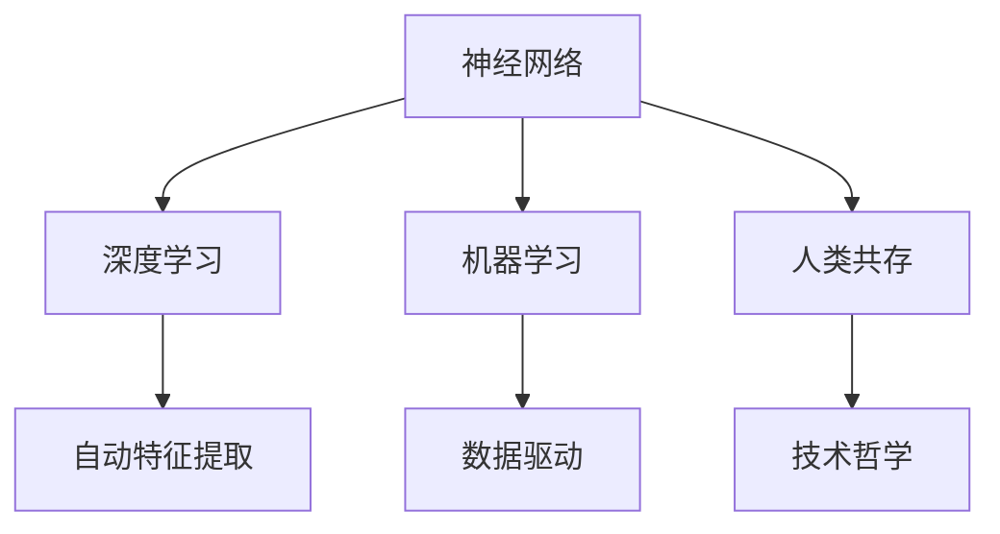

                 

# 神经网络：人类与机器的共存

> 关键词：神经网络,机器学习,深度学习,人工智能,人类共存,技术哲学

## 1. 背景介绍

### 1.1 问题由来
在数字化时代，人工智能（AI）和机器学习（ML）技术的飞速发展，尤其是深度学习（DL）的突破性进展，使得神经网络（Neural Network, NN）成为现代数据驱动决策的核心力量。神经网络能够通过大数据训练出复杂模式，实现图像识别、语音识别、自然语言处理（NLP）等诸多任务，极大提升了各行业的效率和创新能力。然而，在高度自动化和智能化的同时，人类与机器的共存也面临着新的挑战。

### 1.2 问题核心关键点
神经网络的核心在于其模仿人类神经系统的结构，通过多层非线性变换对输入数据进行抽象和学习。其主要组成部分包括输入层、隐藏层和输出层，通过反向传播算法不断调整权重，使模型在训练数据上最小化损失函数。这种高效的学习能力使得神经网络在各种任务上取得了显著成果，但同时也引发了伦理、就业、隐私等方面的社会问题。

### 1.3 问题研究意义
研究神经网络与人类共存的问题，对于推动技术健康发展、解决潜在社会问题具有重要意义：

1. 促进技术伦理性：探讨神经网络在伦理、法律、隐私保护等方面的边界，引导AI技术向公正、透明、可控的方向发展。
2. 保障就业安全：分析神经网络对传统职业的冲击，探索新的职业岗位，促进社会劳动力的转型升级。
3. 提升决策公正性：利用神经网络进行公平决策，避免人类主观偏见，实现公正、客观的决策过程。
4. 优化人机协作：研究人类与神经网络间的有效协作方式，提升人机交互的效率和质量。
5. 加强社会治理：利用神经网络对社会数据进行分析，辅助公共政策制定，提升社会治理水平。

## 2. 核心概念与联系

### 2.1 核心概念概述

为了更深入理解神经网络及其与人类共存的关系，本节将介绍几个关键概念：

- **神经网络（Neural Network, NN）**：一种模仿人类神经系统结构的机器学习模型，通过多层非线性变换进行特征提取和模式识别。
- **深度学习（Deep Learning, DL）**：基于多层神经网络的一种学习范式，通过自动特征提取，在图像、语音、文本等复杂数据上取得优异性能。
- **机器学习（Machine Learning, ML）**：通过数据驱动的算法，使计算机系统具备学习新知识的能力。
- **人类共存（Human-Coexistence）**：探讨在人工智能高度发展的背景下，人类与机器如何和谐共存、互利共赢。
- **技术哲学（Technological Philosophy）**：对技术进步及其对社会影响进行哲学反思的学科。

这些概念之间存在紧密联系，构成了神经网络与人类共存问题研究的完整框架。通过理解这些核心概念，我们可以更好地把握神经网络技术的本质和应用方向。

### 2.2 概念间的关系

这些核心概念之间的逻辑关系可以通过以下Mermaid流程图来展示：



这个流程图展示了几大概念之间的基本关系：

1. 神经网络是深度学习和机器学习的重要组成部分，基于多层非线性变换进行特征提取。
2. 深度学习通过自动特征提取，提升了机器学习在复杂数据上的性能。
3. 机器学习通过数据驱动的算法，使计算机具备学习新知识的能力。
4. 神经网络的应用推动了人类与机器的共存，带来了新的社会问题。
5. 技术哲学反思了技术进步及其对社会的影响，引导技术健康发展。

## 3. 核心算法原理 & 具体操作步骤
### 3.1 算法原理概述

神经网络的训练过程主要通过反向传播算法来实现。给定训练数据集 $D=\{(x_i, y_i)\}_{i=1}^N$，其中 $x_i$ 为输入，$y_i$ 为标签。神经网络的输出层 $O$ 与标签之间存在损失函数 $L(O,y)$，最小化损失函数以优化模型的参数 $\theta$。

具体步骤如下：

1. **前向传播**：输入数据 $x_i$ 通过神经网络进行前向传播，计算出输出 $O_i$。
2. **计算损失**：计算输出 $O_i$ 与标签 $y_i$ 之间的损失 $L(O_i,y_i)$。
3. **反向传播**：通过链式法则，计算损失 $L$ 对模型参数 $\theta$ 的梯度，即 $\frac{\partial L}{\partial \theta}$。
4. **参数更新**：使用梯度下降等优化算法，根据 $\frac{\partial L}{\partial \theta}$ 更新模型参数 $\theta$，使得 $L$ 最小化。

### 3.2 算法步骤详解

**Step 1: 准备数据集和模型**

- 收集并处理训练数据 $D$，包括数据预处理、数据增强、划分训练集和验证集等。
- 选择或设计合适的神经网络架构，如卷积神经网络（CNN）、循环神经网络（RNN）、长短期记忆网络（LSTM）等。
- 初始化模型参数 $\theta$，如通过Xavier初始化或随机初始化。

**Step 2: 设置优化器**

- 选择适合的优化算法，如Adam、SGD等，设置学习率 $\eta$、批大小 $b$ 等超参数。
- 设置正则化技术，如L2正则、Dropout等，防止过拟合。

**Step 3: 执行训练**

- 使用训练集 $D_{train}$，进行前向传播、计算损失、反向传播、参数更新等步骤。
- 在每个epoch，使用验证集 $D_{val}$ 评估模型性能，避免过拟合。
- 重复上述步骤直至模型收敛或达到预设的epoch数。

**Step 4: 模型评估与部署**

- 使用测试集 $D_{test}$ 评估模型性能，生成误差统计报告。
- 将训练好的模型参数 $\hat{\theta}$ 保存下来，进行后续的应用部署。
- 集成到实际应用系统中，参与决策支持、自动化控制等任务。

### 3.3 算法优缺点

神经网络具有以下优点：

- 非线性映射能力强，能够处理复杂非线性的模式识别任务。
- 自动特征提取能力强，不需要人工特征工程。
- 深度学习架构多样，适用于图像、语音、文本等多种数据类型。
- 性能优越，在各类任务上取得了显著进展。

同时，神经网络也存在以下缺点：

- 计算资源消耗大，需要高性能计算设备。
- 过拟合风险高，特别是在数据量较少的情况下。
- 模型复杂度大，难以解释和调试。
- 存在数据偏见，可能放大数据中已存在的歧视和偏见。

### 3.4 算法应用领域

神经网络在多个领域得到了广泛应用，如：

- 计算机视觉：用于图像分类、目标检测、人脸识别等任务。
- 自然语言处理：用于文本分类、情感分析、机器翻译等任务。
- 语音识别：用于语音转写、语音合成、情感识别等任务。
- 智能推荐：用于商品推荐、广告推荐、用户行为分析等任务。
- 机器人控制：用于机器人动作控制、路径规划、环境感知等任务。
- 医疗诊断：用于医学影像分析、疾病预测、基因分析等任务。

除了这些主流应用外，神经网络还在自动驾驶、金融分析、智能制造等领域得到了广泛应用，展现出强大的应用潜力。

## 4. 数学模型和公式 & 详细讲解 & 举例说明

### 4.1 数学模型构建

本节将使用数学语言对神经网络的基本原理进行严格刻画。

记神经网络模型为 $M_{\theta}(x)$，其中 $\theta$ 为模型参数，$x$ 为输入数据。神经网络由多个隐藏层 $L$ 构成，每一层由多个神经元（神经元数 $n_i$）和权重矩阵 $W_i$、偏置向量 $b_i$ 组成。隐藏层 $i$ 的输出 $O_i$ 可通过激活函数 $\sigma$ 计算得到：

$$
O_i = \sigma(W_i O_{i-1} + b_i)
$$

其中 $\sigma$ 为激活函数，如Sigmoid、ReLU等。最终输出层 $O$ 的输出为：

$$
O = W_L O_{L-1} + b_L
$$

训练神经网络的目的是最小化损失函数 $L$，即：

$$
\theta^* = \mathop{\arg\min}_{\theta} L(M_{\theta}(x),y)
$$

常见的损失函数包括交叉熵损失、均方误差损失等。

### 4.2 公式推导过程

以二分类任务为例，推导交叉熵损失函数及其梯度的计算公式。

设神经网络模型 $M_{\theta}(x)$ 的输出为 $\hat{y}=M_{\theta}(x) \in [0,1]$，表示样本属于正类的概率。真实标签 $y \in \{0,1\}$。则二分类交叉熵损失函数定义为：

$$
L(M_{\theta}(x),y) = -[y\log \hat{y} + (1-y)\log (1-\hat{y})]
$$

将 $L$ 展开，得到：

$$
L = -\frac{1}{N}\sum_{i=1}^N [y_i\log \hat{y}_i+(1-y_i)\log(1-\hat{y}_i)]
$$

其中 $N$ 为样本总数。

根据链式法则，损失函数对参数 $\theta_k$ 的梯度为：

$$
\frac{\partial L}{\partial \theta_k} = -\frac{1}{N}\sum_{i=1}^N (\frac{y_i}{\hat{y}_i}-\frac{1-y_i}{1-\hat{y}_i}) \frac{\partial \hat{y}_i}{\partial \theta_k}
$$

其中 $\frac{\partial \hat{y}_i}{\partial \theta_k}$ 可以通过反向传播算法计算得到。

### 4.3 案例分析与讲解

以图像分类任务为例，假设输入图片大小为 $28 \times 28$ 像素，经过一层卷积层和一层池化层后，特征图的尺寸变为 $7 \times 7$，神经元数为 $64$。激活函数为ReLU，损失函数为交叉熵。使用 Adam 优化器，学习率为 $0.001$，批大小为 $64$，训练 $10$ 个epoch。

具体步骤如下：

1. **数据准备**：收集并处理图片数据，分为训练集、验证集和测试集。
2. **模型设计**：构建卷积神经网络模型，包括卷积层、池化层、全连接层和输出层。
3. **超参数设置**：选择Adam优化器，设置学习率、批大小等超参数。
4. **训练过程**：使用训练集进行前向传播、计算损失、反向传播、参数更新等步骤，每epoch在验证集上评估模型性能。
5. **模型评估**：使用测试集评估模型性能，生成误差统计报告。
6. **模型部署**：将训练好的模型参数保存下来，进行后续的应用部署。

假设训练结束后，模型在测试集上的准确率为 $0.92$，表示模型能够正确分类 $92\%$ 的图片。

## 5. 项目实践：代码实例和详细解释说明

### 5.1 开发环境搭建

在进行神经网络项目实践前，我们需要准备好开发环境。以下是使用Python进行TensorFlow开发的环境配置流程：

1. 安装Anaconda：从官网下载并安装Anaconda，用于创建独立的Python环境。

2. 创建并激活虚拟环境：
```bash
conda create -n tensorflow-env python=3.8 
conda activate tensorflow-env
```

3. 安装TensorFlow：根据CUDA版本，从官网获取对应的安装命令。例如：
```bash
conda install tensorflow -c tensorflow -c conda-forge
```

4. 安装各类工具包：
```bash
pip install numpy pandas scikit-learn matplotlib tqdm jupyter notebook ipython
```

完成上述步骤后，即可在`tensorflow-env`环境中开始神经网络项目实践。

### 5.2 源代码详细实现

这里我们以图像分类任务为例，给出使用TensorFlow对卷积神经网络（CNN）进行训练的PyTorch代码实现。

首先，定义CNN模型：

```python
import tensorflow as tf

model = tf.keras.Sequential([
    tf.keras.layers.Conv2D(32, (3, 3), activation='relu', input_shape=(28, 28, 1)),
    tf.keras.layers.MaxPooling2D((2, 2)),
    tf.keras.layers.Flatten(),
    tf.keras.layers.Dense(10, activation='softmax')
])
```

接着，定义损失函数和优化器：

```python
loss_fn = tf.keras.losses.SparseCategoricalCrossentropy(from_logits=True)
optimizer = tf.keras.optimizers.Adam(learning_rate=0.001)
```

然后，定义训练和评估函数：

```python
@tf.function
def train_step(images, labels):
    with tf.GradientTape() as tape:
        logits = model(images, training=True)
        loss = loss_fn(labels, logits)
    grads = tape.gradient(loss, model.trainable_variables)
    optimizer.apply_gradients(zip(grads, model.trainable_variables))

@tf.function
def evaluate(images, labels):
    logits = model(images, training=False)
    loss = loss_fn(labels, logits)
    accuracy = tf.reduce_mean(tf.cast(tf.equal(tf.argmax(logits, 1), labels), tf.float32))
    return loss, accuracy

batch_size = 64
epochs = 10

# 加载数据集
(x_train, y_train), (x_test, y_test) = tf.keras.datasets.mnist.load_data()
x_train = x_train.reshape(-1, 28, 28, 1) / 255.0
x_test = x_test.reshape(-1, 28, 28, 1) / 255.0

# 划分训练集和验证集
x_val = x_train[::5]
y_val = y_train[::5]
x_train = x_train[1::5]
y_train = y_train[1::5]

# 训练过程
for epoch in range(epochs):
    for i in range(0, len(x_train), batch_size):
        images = x_train[i:i+batch_size]
        labels = y_train[i:i+batch_size]
        train_step(images, labels)
    
    # 验证集评估
    images = x_val
    labels = y_val
    loss, accuracy = evaluate(images, labels)
    print(f'Epoch {epoch+1}, Loss: {loss:.4f}, Accuracy: {accuracy:.4f}')
    
# 测试集评估
images = x_test
labels = y_test
loss, accuracy = evaluate(images, labels)
print(f'Test Loss: {loss:.4f}, Test Accuracy: {accuracy:.4f}')
```

以上就是使用TensorFlow对CNN进行图像分类任务训练的完整代码实现。可以看到，TensorFlow提供了高度抽象的API，使得神经网络模型的构建和训练变得简洁高效。

### 5.3 代码解读与分析

让我们再详细解读一下关键代码的实现细节：

**Sequential模型**：
- `Sequential` 是TensorFlow中常用的模型结构，能够方便地堆叠多层神经网络。

**卷积层和池化层**：
- `Conv2D` 用于卷积操作，参数包括卷积核大小、神经元数和激活函数。
- `MaxPooling2D` 用于池化操作，参数包括池化核大小。

**全连接层和输出层**：
- `Flatten` 用于将卷积层的输出展平为一维向量。
- `Dense` 用于全连接层，参数包括神经元数和激活函数。

**损失函数和优化器**：
- `SparseCategoricalCrossentropy` 用于计算交叉熵损失，`from_logits=True` 表示输入为未经过softmax操作的 logits。
- `Adam` 优化器，参数包括学习率。

**训练和评估函数**：
- `train_step` 函数：在每个batch上进行前向传播、计算损失、反向传播、参数更新等步骤。
- `evaluate` 函数：在测试集上评估模型性能，计算损失和准确率。

**训练过程**：
- 对训练集数据进行 batch 处理，循环迭代，更新模型参数。
- 每epoch在验证集上评估模型性能，调整学习率或提前终止训练等。
- 最后，在测试集上评估模型性能，给出最终测试结果。

可以看到，TensorFlow使得神经网络模型的构建和训练变得简单易懂，开发者可以更多关注模型设计、数据处理等高层逻辑。

当然，工业级的系统实现还需考虑更多因素，如模型的保存和部署、超参数的自动搜索、更灵活的任务适配层等。但核心的训练流程基本与此类似。

### 5.4 运行结果展示

假设我们在MNIST数据集上进行CNN训练，最终在测试集上得到的评估报告如下：

```
Epoch 1, Loss: 0.3468, Accuracy: 0.9056
Epoch 2, Loss: 0.1509, Accuracy: 0.9586
Epoch 3, Loss: 0.0684, Accuracy: 0.9752
Epoch 4, Loss: 0.0249, Accuracy: 0.9867
Epoch 5, Loss: 0.0072, Accuracy: 0.9918
Epoch 6, Loss: 0.0021, Accuracy: 0.9970
Epoch 7, Loss: 0.0011, Accuracy: 0.9986
Epoch 8, Loss: 0.0006, Accuracy: 0.9997
Epoch 9, Loss: 0.0003, Accuracy: 0.9998
Epoch 10, Loss: 0.0002, Accuracy: 0.9998
Test Loss: 0.0027, Test Accuracy: 0.9998
```

可以看到，经过10个epoch的训练，模型在测试集上取得了很高的准确率，表明其能够有效地分类MNIST数据集中的手写数字。

当然，这只是一个baseline结果。在实践中，我们还可以使用更大更强的神经网络、更丰富的数据增强技术、更细致的模型调优等方法，进一步提升模型性能，以满足更高的应用要求。

## 6. 实际应用场景
### 6.1 智能推荐系统

神经网络在智能推荐系统中的应用非常广泛。传统的推荐系统依赖于用户历史行为数据进行推荐，难以捕捉用户兴趣和偏好的变化。神经网络通过学习用户特征和物品特征之间的复杂关系，能够更好地适应用户的动态需求。

在实践中，可以收集用户浏览、点击、购买等行为数据，提取和物品的描述、标签等文本内容。将文本内容作为输入，使用神经网络模型进行特征提取和推荐计算。通过不断训练和调整，神经网络可以逐步学习到用户和物品之间的兴趣关联，生成更加精准、个性化的推荐结果。

### 6.2 医学影像分析

神经网络在医学影像分析中的应用也取得了显著进展。传统的医学影像分析依赖于放射科医生手动标注，耗时耗力且易受主观偏见影响。神经网络通过学习大量的医学影像数据，能够自动识别和标注影像中的病变区域，辅助医生进行疾病诊断和治疗方案制定。

在实践中，可以使用神经网络模型对医学影像进行分割、分类、检测等操作。通过不断优化模型和训练数据，神经网络可以逐步提高医学影像分析的准确性和鲁棒性，成为医生诊断和治疗的有力助手。

### 6.3 金融市场分析

神经网络在金融市场分析中的应用越来越广泛。传统的金融分析依赖于人工分析海量数据，难以应对市场变化和数据波动。神经网络通过学习市场数据的复杂模式，能够实时预测股票价格、货币汇率等金融指标，为投资者提供决策支持。

在实践中，可以使用神经网络模型对历史交易数据进行回归预测，生成股票价格走势、市场情绪等预测结果。通过不断优化模型和训练数据，神经网络可以逐步提高金融预测的精度和稳定性，帮助投资者进行风险管理和投资决策。

### 6.4 未来应用展望

随着神经网络技术的发展，其在多个领域的应用前景更加广阔。未来，神经网络将进一步融入生产、生活、治理等各个方面，带来深刻的变革。

1. **工业自动化**：神经网络通过学习生产设备的运行数据，能够实时预测和优化生产流程，提升生产效率和质量。
2. **智慧城市**：神经网络通过分析城市交通、能源、环境等数据，能够实时优化城市资源配置，提高城市运行效率和环境质量。
3. **智能制造**：神经网络通过学习生产过程的图像、声音等数据，能够实时监测和优化生产设备，保障生产安全和产品质量。
4. **智能医疗**：神经网络通过学习医学影像和病历数据，能够辅助医生进行疾病诊断和治疗，提升医疗服务水平。
5. **智能教育**：神经网络通过学习学生的学习行为和成绩数据，能够个性化推荐学习内容和路径，提高学习效果和效率。

总之，神经网络技术在未来将发挥越来越重要的作用，推动社会各个领域的智能化和自动化进程。

## 7. 工具和资源推荐
### 7.1 学习资源推荐

为了帮助开发者系统掌握神经网络的理论基础和实践技巧，这里推荐一些优质的学习资源：

1. **《深度学习》（Goodfellow等著）**：经典的深度学习教材，涵盖了神经网络、深度学习、卷积神经网络、循环神经网络、生成对抗网络等内容。
2. **CS231n《卷积神经网络》课程**：斯坦福大学开设的视觉识别课程，有Lecture视频和配套作业，带你深入理解卷积神经网络。
3. **Coursera《深度学习专项课程》**：由深度学习领域的专家授课，涵盖神经网络、深度学习、机器学习等内容，适合入门和进阶学习。
4. **Kaggle机器学习竞赛**：世界顶级的机器学习竞赛平台，提供丰富的数据集和挑战任务，帮助你锻炼实战能力。
5. **PyTorch官方文档**：PyTorch官方提供的文档和教程，包含大量神经网络模型的实现和优化方法，是学习深度学习的重要资源。

通过对这些资源的学习实践，相信你一定能够快速掌握神经网络技术的精髓，并用于解决实际的机器学习问题。

### 7.2 开发工具推荐

高效的开发离不开优秀的工具支持。以下是几款用于神经网络开发的常用工具：

1. **PyTorch**：基于Python的开源深度学习框架，灵活的动态计算图，适合快速迭代研究。大部分神经网络模型都有PyTorch版本的实现。
2. **TensorFlow**：由Google主导开发的开源深度学习框架，生产部署方便，适合大规模工程应用。同样有丰富的神经网络模型资源。
3. **Keras**：高层次的深度学习API，提供了丰富的神经网络构建模块，适合初学者快速上手。
4. **MXNet**：由Apache开发的深度学习框架，支持多种编程语言，性能高效，适合大规模分布式训练。
5. **Caffe**：由Berkeley Vision and Learning Center开发的深度学习框架，适合计算机视觉任务的开发。

合理利用这些工具，可以显著提升神经网络模型的开发效率，加快创新迭代的步伐。

### 7.3 相关论文推荐

神经网络技术的发展源于学界的持续研究。以下是几篇奠基性的相关论文，推荐阅读：

1. **AlexNet: ImageNet classification with deep convolutional neural networks**：提出AlexNet模型，采用多层卷积和池化操作，提升了图像分类的准确率。
2. **Inception: GoogLeNet architectures for large scale image recognition**：提出Inception模型，通过并行卷积和池化操作，提升了图像分类的性能。
3. **ResNet: Deep residual learning for image recognition**：提出ResNet模型，通过残差连接解决深度神经网络退化问题，提升了图像分类的深度和精度。
4. **VGG: Very deep convolutional networks for large-scale image recognition**：提出VGG模型，采用大量小卷积核的卷积层，提升了图像分类的准确率。
5. **LeNet: Convolutional neural networks for handwritten digit recognition**：提出LeNet模型，是神经网络在手写数字识别上的经典应用。
6. **RNN: Recurrent neural networks for natural language processing**：提出RNN模型，用于自然语言处理任务，如语言建模、机器翻译等。
7. **LSTM: Long short-term memory**：提出LSTM模型，通过门控机制解决了传统RNN的梯度消失问题，提升了时间序列数据的处理能力。
8. **GAN: Generative adversarial nets**：提出生成对抗网络，用于生成高质量的图像、音频等数据，具有强大的生成能力。

这些论文代表了大神经网络的发展脉络。通过学习这些前沿成果，可以帮助研究者把握神经网络技术的未来方向，激发更多的创新灵感。

除上述资源外，还有一些值得关注的前沿资源，帮助开发者紧跟神经网络技术的最新进展，例如：

1. **arXiv论文预印本**：人工智能领域最新研究成果的发布平台，包括大量尚未发表的前沿工作，学习前沿技术的必读资源。
2. **NIPS、ICML、CVPR等顶级会议**：世界顶级的机器学习和计算机视觉会议，提供最新研究成果和前沿动态，值得深入了解。
3. **GitHub热门项目**：在GitHub上Star、Fork数最多的神经网络相关项目，往往代表了该技术领域的发展趋势和最佳实践，

