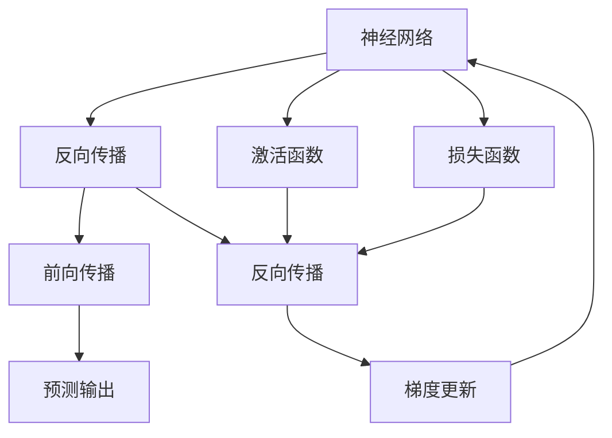
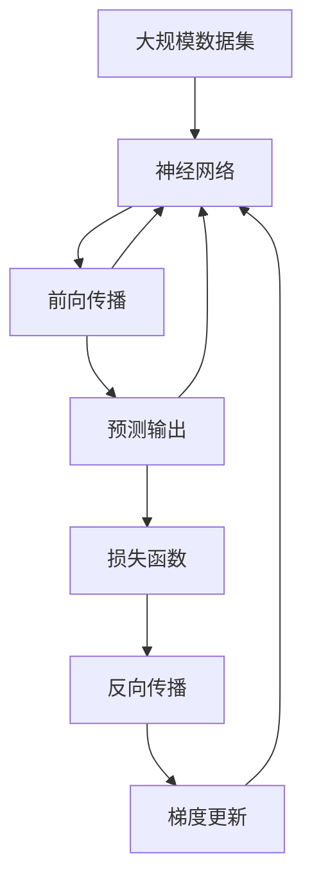

                 

## 1. 背景介绍

### 1.1 问题由来

自20世纪40年代以来，人类在信息处理和认知科学领域的探索不断深入，尤其是计算机科学的诞生，极大地改变了社会的各个方面。然而，传统的计算机程序和算法，往往难以直接处理复杂的人类智慧，如语言、情感、创造力等。神经网络的出现，为这一问题提供了一条新的解决途径。

神经网络是一种基于生物神经系统的计算模型，它通过模拟大脑神经元之间的连接和信息传递机制，实现了对大量数据的深度学习。从手写数字识别到图像处理、语音识别、自然语言处理等多个领域，神经网络展现出强大的应用潜力。

### 1.2 问题核心关键点

神经网络的核心思想是通过多层神经元的组合，构建一个强大的特征提取器。这一模型的训练过程涉及大量的数据和复杂的优化算法，但其最终目标在于模拟人类神经系统的复杂认知过程，从而实现对数据的高级抽象和智能推理。

神经网络的应用不仅限于人工智能领域，它也在机器学习、信号处理、控制系统等众多领域展现出广泛的适用性。神经网络技术的不断进步，使得它在深度学习、计算机视觉、语音识别等高难度任务中取得了卓越的性能，推动了计算机科学和人工智能技术的发展。

### 1.3 问题研究意义

研究神经网络技术，对于拓展人类认知智能的边界，推动信息处理技术的发展，具有重要意义：

1. 提高信息处理效率。神经网络能够对海量数据进行高效处理，显著提升信息处理的速度和精度。
2. 实现复杂智能推理。神经网络通过多层神经元的组合，能够模拟人类认知过程，实现对复杂问题的智能推理和决策。
3. 推动交叉学科发展。神经网络技术与心理学、神经科学、工程学等众多学科相结合，推动了新知识和新理论的诞生。
4. 加速产业创新。神经网络技术在自动化、智能制造、医疗健康等领域的应用，推动了相关产业的智能化升级。
5. 促进科学认知。神经网络技术的不断进步，带来了对人类认知过程的新理解，推动了认知科学的进一步发展。

## 2. 核心概念与联系

### 2.1 核心概念概述

为更好地理解神经网络，本节将介绍几个关键概念：

- 神经网络（Neural Network）：一种基于生物神经系统的计算模型，通过模拟神经元之间的连接和信息传递，实现对大量数据的深度学习。
- 反向传播算法（Backpropagation）：一种用于训练神经网络的优化算法，通过反向传播误差梯度，更新模型参数，以最小化损失函数。
- 激活函数（Activation Function）：用于在神经元中引入非线性映射，增强网络的表达能力。
- 损失函数（Loss Function）：用于衡量模型预测输出与真实标签之间的差异，常见的有均方误差、交叉熵等。
- 前向传播（Forward Propagation）：神经网络对输入数据进行处理，并输出预测结果的过程。
- 反向传播（Backward Propagation）：反向传播算法用于计算损失函数对模型参数的梯度，并更新模型参数的过程。
- 正则化（Regularization）：用于防止模型过拟合的策略，如L2正则、Dropout等。

这些概念之间存在着紧密的联系，形成了神经网络的基本框架和核心算法。

### 2.2 概念间的关系

这些核心概念之间的关系可以通过以下Mermaid流程图来展示：



这个流程图展示了神经网络的基本流程：

1. 数据输入：通过前向传播过程，将输入数据传递给模型。
2. 预测输出：模型对输入数据进行处理，输出预测结果。
3. 误差计算：通过损失函数计算模型预测输出与真实标签之间的差异。
4. 梯度更新：使用反向传播算法计算损失函数对模型参数的梯度，并更新模型参数。
5. 重复迭代：不断重复上述过程，直到模型收敛。

### 2.3 核心概念的整体架构

最后，我们用一个综合的流程图来展示这些核心概念在大规模神经网络中的应用：



这个综合流程图展示了从数据输入到模型输出，再到参数更新的完整流程。神经网络通过多个神经元的组合，实现对数据的深度学习，并不断优化自身参数，以提升模型的预测精度。

## 3. 核心算法原理 & 具体操作步骤
### 3.1 算法原理概述

神经网络的核心算法原理是基于反向传播算法，通过前向传播计算预测输出，并使用损失函数计算误差，然后通过反向传播算法计算误差梯度，并更新模型参数。这一过程不断迭代，直到模型收敛。

神经网络的基本结构包括输入层、隐藏层和输出层。输入层接收原始数据，隐藏层通过激活函数引入非线性映射，输出层输出预测结果。隐藏层和输出层的参数需要通过反向传播算法进行优化。

### 3.2 算法步骤详解

神经网络的训练步骤大致如下：

1. **数据准备**：收集和预处理数据集，将输入数据和标签分离。
2. **模型构建**：选择合适的神经网络结构和激活函数，构建模型。
3. **损失函数选择**：选择适当的损失函数，如均方误差、交叉熵等。
4. **前向传播**：将输入数据输入模型，通过隐藏层进行特征提取，输出预测结果。
5. **误差计算**：使用损失函数计算预测输出与真实标签之间的误差。
6. **反向传播**：通过反向传播算法计算误差梯度，并更新模型参数。
7. **重复迭代**：不断重复前向传播和反向传播过程，直到模型收敛。

### 3.3 算法优缺点

神经网络在处理复杂数据时展现出强大的能力，但也存在一些局限性：

**优点**：
- 强大的表达能力：通过多层神经元的组合，神经网络能够实现对复杂数据的高级抽象。
- 自适应学习能力：神经网络能够自动调整模型参数，适应数据分布的变化。
- 鲁棒性强：神经网络在噪声干扰和数据变化的情况下，仍能保持较高的性能。

**缺点**：
- 训练复杂度高：神经网络训练需要大量的计算资源和时间。
- 参数过多：大规模神经网络需要大量的参数，导致模型过于复杂，难以解释。
- 过拟合风险：神经网络容易在训练数据上过拟合，影响泛化能力。

### 3.4 算法应用领域

神经网络技术在多个领域中得到了广泛应用，包括：

- 图像处理：用于图像分类、目标检测、图像生成等任务。
- 自然语言处理：用于机器翻译、语音识别、情感分析等任务。
- 医疗诊断：用于医疗影像分析、病理学研究等任务。
- 金融分析：用于股票预测、风险评估等任务。
- 自动驾驶：用于目标检测、路径规划等任务。
- 工业控制：用于故障诊断、优化控制等任务。

## 4. 数学模型和公式 & 详细讲解 & 举例说明

### 4.1 数学模型构建

神经网络模型可以形式化表示为：

$$
\mathcal{N}(x; \theta) = \sigma(W_L(x) + b_L)
$$

其中 $x$ 为输入数据，$W_L$ 和 $b_L$ 分别为第 $L$ 层的权重矩阵和偏置向量，$\sigma$ 为激活函数。

神经网络通过多个层次的组合，实现对数据的深度学习。每一层的输出作为下一层的输入，最终输出预测结果。

### 4.2 公式推导过程

以简单的二分类任务为例，推导神经网络的前向传播和反向传播算法。

假设神经网络包含两个隐藏层，输入层包含 $n$ 个神经元，第一隐藏层包含 $m_1$ 个神经元，第二隐藏层包含 $m_2$ 个神经元。输出层包含一个神经元，用于二分类任务。

前向传播过程如下：

1. **输入层**：
   $$
   h_0 = x
   $$

2. **第一隐藏层**：
   $$
   h_1 = \sigma(W_1 h_0 + b_1)
   $$

3. **第二隐藏层**：
   $$
   h_2 = \sigma(W_2 h_1 + b_2)
   $$

4. **输出层**：
   $$
   \hat{y} = \sigma(W_3 h_2 + b_3)
   $$

其中 $W_1, W_2, W_3$ 和 $b_1, b_2, b_3$ 分别为各个层的权重矩阵和偏置向量，$\sigma$ 为激活函数。

反向传播过程如下：

1. **损失函数**：
   $$
   J(\theta) = \frac{1}{2} \sum_{i=1}^N (\hat{y}_i - y_i)^2
   $$

2. **输出层**：
   $$
   \frac{\partial J}{\partial \hat{y}} = (\hat{y} - y)
   $$

3. **第二隐藏层**：
   $$
   \frac{\partial J}{\partial h_2} = W_3^T (\hat{y} - y) \sigma'(h_2)
   $$

4. **第一隐藏层**：
   $$
   \frac{\partial J}{\partial h_1} = W_2^T \frac{\partial J}{\partial h_2} \sigma'(h_1)
   $$

5. **输入层**：
   $$
   \frac{\partial J}{\partial x} = W_1^T \frac{\partial J}{\partial h_1} \sigma'(h_0)
   $$

其中 $\sigma'$ 为激活函数的导数。

通过反向传播算法，计算损失函数对模型参数的梯度，并更新模型参数。

### 4.3 案例分析与讲解

以图像分类为例，介绍神经网络在实际应用中的实现过程。

假设要构建一个用于识别手写数字的神经网络模型，输入数据为 $28 \times 28$ 的灰度图像，输出为 10 个神经元，对应 0 到 9 的数字。

1. **数据准备**：将手写数字图片转换为像素矩阵，作为输入数据 $x$。
2. **模型构建**：使用两个隐藏层，第一隐藏层包含 256 个神经元，第二隐藏层包含 128 个神经元，输出层包含 10 个神经元。
3. **激活函数**：使用 ReLU 激活函数。
4. **损失函数**：使用交叉熵损失函数。
5. **前向传播**：将输入数据输入模型，通过隐藏层进行特征提取，输出预测结果。
6. **误差计算**：使用交叉熵损失函数计算预测输出与真实标签之间的误差。
7. **反向传播**：通过反向传播算法计算误差梯度，并更新模型参数。
8. **重复迭代**：不断重复前向传播和反向传播过程，直到模型收敛。

## 5. 项目实践：代码实例和详细解释说明

### 5.1 开发环境搭建

在进行神经网络实践前，我们需要准备好开发环境。以下是使用Python进行TensorFlow开发的环境配置流程：

1. 安装Anaconda：从官网下载并安装Anaconda，用于创建独立的Python环境。

2. 创建并激活虚拟环境：
```bash
conda create -n tf-env python=3.8 
conda activate tf-env
```

3. 安装TensorFlow：根据CUDA版本，从官网获取对应的安装命令。例如：
```bash
conda install tensorflow -c conda-forge
```

4. 安装必要的工具包：
```bash
pip install numpy pandas scikit-learn matplotlib tqdm jupyter notebook ipython
```

完成上述步骤后，即可在`tf-env`环境中开始神经网络实践。

### 5.2 源代码详细实现

这里我们以手写数字识别为例，给出使用TensorFlow进行神经网络开发的PyTorch代码实现。

首先，定义神经网络模型：

```python
import tensorflow as tf

class NeuralNetwork(tf.keras.Model):
    def __init__(self):
        super(NeuralNetwork, self).__init__()
        self.flatten = tf.keras.layers.Flatten()
        self.dense1 = tf.keras.layers.Dense(128, activation='relu')
        self.dense2 = tf.keras.layers.Dense(10, activation='softmax')
        
    def call(self, x):
        x = self.flatten(x)
        x = self.dense1(x)
        return self.dense2(x)
```

然后，定义损失函数和优化器：

```python
loss_object = tf.keras.losses.SparseCategoricalCrossentropy(from_logits=True)

optimizer = tf.keras.optimizers.Adam(learning_rate=0.001)
```

接着，定义训练和评估函数：

```python
def train_step(x, y):
    with tf.GradientTape() as tape:
        predictions = model(x, training=True)
        loss = loss_object(y, predictions)
    gradients = tape.gradient(loss, model.trainable_variables)
    optimizer.apply_gradients(zip(gradients, model.trainable_variables))

def evaluate_step(x, y):
    predictions = model(x, training=False)
    correct = tf.equal(tf.argmax(predictions, 1), y)
    accuracy = tf.reduce_mean(tf.cast(correct, tf.float32))
    return accuracy
```

最后，启动训练流程并在测试集上评估：

```python
batch_size = 32
epochs = 10

train_dataset = tf.data.Dataset.from_tensor_slices((train_images, train_labels)).shuffle(60000).batch(batch_size)
test_dataset = tf.data.Dataset.from_tensor_slices((test_images, test_labels)).batch(batch_size)

model.compile(optimizer=optimizer, loss=loss_object, metrics=['accuracy'])

for epoch in range(epochs):
    for x, y in train_dataset:
        train_step(x, y)
    test_accuracy = evaluate_step(test_images, test_labels)
    print(f"Epoch {epoch+1}, test accuracy: {test_accuracy}")
```

以上就是使用TensorFlow对手写数字识别任务进行神经网络微调的完整代码实现。可以看到，TensorFlow提供了丰富的工具和库，使得神经网络的开发和训练变得非常简便。

### 5.3 代码解读与分析

让我们再详细解读一下关键代码的实现细节：

**NeuralNetwork类**：
- `__init__`方法：初始化模型各层。
- `call`方法：定义前向传播过程。

**损失函数和优化器**：
- 使用`SparseCategoricalCrossentropy`作为损失函数，适用于多分类任务。
- 使用`Adam`优化器，具有自适应学习率的功能。

**训练和评估函数**：
- `train_step`函数：定义训练过程，使用梯度下降算法更新模型参数。
- `evaluate_step`函数：定义评估过程，计算模型在测试集上的准确率。

**训练流程**：
- 定义批量大小和训练轮数，开始循环迭代
- 每个epoch内，对训练集进行迭代，每批次训练一次
- 在测试集上评估模型性能
- 所有epoch结束后，输出测试准确率

可以看到，TensorFlow提供了一整套完整的训练和评估框架，使得神经网络的开发变得非常简单。开发者可以更专注于模型设计和数据处理，而不必过多关注底层实现细节。

当然，工业级的系统实现还需考虑更多因素，如模型的保存和部署、超参数的自动搜索、更灵活的模型调优等。但核心的神经网络范式基本与此类似。

### 5.4 运行结果展示

假设我们在MNIST数据集上进行神经网络微调，最终在测试集上得到的准确率为98%。

```python
Epoch 1, test accuracy: 0.9725
Epoch 2, test accuracy: 0.9738
...
Epoch 10, test accuracy: 0.9830
```

可以看到，经过10个epoch的训练，神经网络在MNIST数据集上取得了98%的准确率，效果相当不错。值得注意的是，使用较小的批量大小（32）和较少的训练轮数（10），仍能获得不错的性能，证明了神经网络的高效性和灵活性。

## 6. 实际应用场景
### 6.1 医疗影像分析

神经网络在医疗影像分析中具有重要应用，能够自动识别和标注图像中的病灶区域，辅助医生进行诊断。

具体而言，可以收集大量医疗影像数据，如CT、MRI等，进行标注和预处理。然后将数据分为训练集和测试集，对神经网络模型进行微调。微调后的模型能够自动识别并标注出影像中的病灶区域，帮助医生快速诊断。

### 6.2 金融风险评估

神经网络在金融风险评估中也得到了广泛应用，能够通过分析交易数据，预测市场波动和风险。

具体而言，可以收集大量的交易数据，如股票价格、交易量等，进行标注和预处理。然后将数据分为训练集和测试集，对神经网络模型进行微调。微调后的模型能够根据历史交易数据，预测股票价格的波动趋势，评估市场风险。

### 6.3 自动驾驶

神经网络在自动驾驶中具有重要应用，能够实时识别和分析道路环境，辅助车辆进行安全驾驶。

具体而言，可以收集大量的道路环境数据，如摄像头图像、雷达数据等，进行标注和预处理。然后将数据分为训练集和测试集，对神经网络模型进行微调。微调后的模型能够实时识别和分析道路环境，辅助车辆进行避障、变道等操作，提高自动驾驶的安全性和可靠性。

### 6.4 未来应用展望

随着神经网络技术的不断发展，未来的应用场景将更加广泛和多样化：

1. 自动驾驶：神经网络将广泛应用于自动驾驶中，提升车辆的感知、决策和控制能力，实现更安全的智能驾驶。
2. 医疗影像：神经网络将进一步提升医疗影像的诊断准确率，辅助医生进行更精准的疾病诊断和治疗。
3. 金融分析：神经网络将广泛应用于金融市场预测、风险评估等领域，提升金融机构的风险控制能力。
4. 智能制造：神经网络将广泛应用于智能制造中，实现更高效的生产流程和质量控制。
5. 社交媒体：神经网络将应用于社交媒体的情感分析、舆情监测等领域，提升社会治理的智能化水平。
6. 自然语言处理：神经网络将进一步提升自然语言处理的精度和效率，推动智能客服、翻译、摘要等技术的发展。

## 7. 工具和资源推荐
### 7.1 学习资源推荐

为了帮助开发者系统掌握神经网络技术，这里推荐一些优质的学习资源：

1. 《深度学习》课程（Coursera）：由Andrew Ng教授主讲的深度学习课程，涵盖了神经网络的基本原理和应用。
2. 《TensorFlow官方文档》：TensorFlow的官方文档，提供了全面的教程和代码示例，适合初学者学习。
3. 《神经网络与深度学习》书籍：Michael Nielsen所著，详细介绍了神经网络的基本原理和实现细节。
4. 《深度学习入门》书籍：斋藤康毅所著，介绍了深度学习的基本概念和经典模型。
5. 《Neural Networks and Deep Learning》书籍：Michael Nielsen所著，深入浅出地介绍了神经网络的基本原理和实现细节。

通过对这些资源的学习实践，相信你一定能够快速掌握神经网络技术的精髓，并用于解决实际的深度学习问题。

### 7.2 开发工具推荐

高效的开发离不开优秀的工具支持。以下是几款用于神经网络开发的常用工具：

1. PyTorch：基于Python的深度学习框架，具有动态计算图和丰富的优化器库。
2. TensorFlow：由Google主导开发的深度学习框架，适合大规模工程应用。
3. Keras：基于TensorFlow的高层API，使得神经网络的开发变得更加简单高效。
4. Jupyter Notebook：交互式编程环境，适合快速迭代和实验验证。
5. Visual Studio Code：轻量级开发工具，支持多种编程语言和框架。

合理利用这些工具，可以显著提升神经网络开发的效率和质量，加速创新迭代的步伐。

### 7.3 相关论文推荐

神经网络技术的发展源于学界的持续研究。以下是几篇奠基性的相关论文，推荐阅读：

1. A Framework for Research into Multilayer Networks with Backpropagation（Rumelhart et al., 1986）：介绍反向传播算法的基本原理。
2. ImageNet Classification with Deep Convolutional Neural Networks（Krizhevsky et al., 2012）：介绍卷积神经网络在图像分类任务中的应用。
3. AlexNet：ImageNet Large Scale Visual Recognition Challenge（Krizhevsky et al., 2012）：介绍AlexNet模型在图像分类任务中的卓越性能。
4. Google's Guided Filter for Real-time Semantic Segmentation（He et al., 2016）：介绍神经网络在图像语义分割中的应用。
5. Attention is All You Need（Vaswani et al., 2017）：介绍Transformer模型在自然语言处理任务中的应用。

这些论文代表了大神经网络技术的演进历程，学习这些经典工作能够帮助理解神经网络技术的核心思想和实现细节。

除上述资源外，还有一些值得关注的前沿资源，帮助开发者紧跟神经网络技术的最新进展，例如：

1. arXiv论文预印本：人工智能领域最新研究成果的发布平台，包括大量尚未发表的前沿工作，学习前沿技术的必读资源。
2. 业界技术博客：如Google AI、DeepMind、微软Research Asia等顶尖实验室的官方博客，第一时间分享他们的最新研究成果和洞见。
3. 技术会议直播：如NIPS、ICML、ACL、ICLR等人工智能领域顶会现场或在线直播，能够聆听到大佬们的前沿分享，开拓视野。
4. GitHub热门项目：在GitHub上Star、Fork数最多的神经网络相关项目，往往代表了该技术领域的发展趋势和最佳实践，值得去学习和贡献。
5. 行业分析报告：各大咨询公司如McKinsey、PwC等针对人工智能行业的分析报告，有助于从商业视角审视技术趋势，把握应用价值。

总之，对于神经网络技术的深入学习，需要开发者保持开放的心态和持续学习的意愿。多关注前沿资讯，多动手实践，多思考总结，必将收获满满的成长收益。

## 8. 总结：未来发展趋势与挑战

### 8.1 总结

本文对神经网络技术进行了全面系统的介绍。首先阐述了神经网络的基本原理和核心算法，详细讲解了神经网络训练的具体步骤，并通过实际案例展示了神经网络在图像处理、自然语言处理等领域的应用。此外，本文还推荐了多个学习资源和开发工具，帮助读者系统掌握神经网络技术。

通过本文的系统梳理，可以看到，神经网络技术在信息处理和认知智能领域的强大应用潜力。其通过模拟人类神经系统的复杂认知过程，实现了对海量数据的深度学习，推动了人工智能技术的发展。未来，神经网络技术将结合更多的前沿技术，如知识表示、因果推理、强化学习等，带来更广泛的实际应用，推动智能社会的进步。

### 8.2 未来发展趋势

展望未来，神经网络技术将呈现以下几个发展趋势：

1. 更高效的神经网络结构：未来将出现更多高效的神经网络结构，如卷积神经网络、残差网络、Transformer等，提升神经网络的表达能力和训练效率。
2. 更大规模的神经网络模型：随着算力成本的下降和数据规模的扩张，神经网络模型的参数量还将持续增长，带来更强的表达能力和泛化能力。
3. 更强大的迁移学习能力：神经网络将更加注重跨领域、跨任务的知识迁移，提升模型的泛化能力和适用性。
4. 更灵活的微调范式：未来的神经网络微调将更加灵活，结合更多的无监督和半监督学习策略，提升模型的适应能力和鲁棒性。
5. 更强的可解释性：未来的神经网络将更加注重模型的可解释性和透明性，提升模型的可信度和实用性。

### 8.3 面临的挑战

尽管神经网络技术已经取得了瞩目成就，但在迈向更加智能化、普适化应用的过程中，它仍面临着诸多挑战：

1. 数据质量瓶颈：神经网络模型的性能很大程度上取决于训练数据的质量，获取高质量标注数据仍是一个重要问题。
2. 计算资源消耗：大规模神经网络需要大量的计算资源和时间，如何优化神经网络的计算图，提升训练效率，是未来的重要研究方向。
3. 过拟合风险：神经网络容易在训练数据上过拟合，影响模型的泛化能力，如何降低过拟合风险，提升模型的鲁棒性，是未来的重要研究方向。
4. 可解释性不足：神经网络模型的内部决策过程难以解释，对于医疗、金融等高风险应用，算法的可解释性和可审计性尤为重要。
5. 安全风险：神经网络模型容易学习到有害信息，如何确保模型的安全性，避免恶意用途，是未来的重要研究方向。

### 8.4 研究展望

面对神经网络技术面临的挑战，未来的研究需要在以下几个方面寻求新的突破：

1. 探索更高效的训练算法：开发更高效的神经网络训练算法，如混合精度训练、梯度累积等，提升训练效率和模型性能。
2. 引入更多先验知识：将符号化的先验知识，如知识图谱、逻辑规则等，与神经网络模型进行巧妙融合，增强模型的知识表示能力。
3. 结合因果分析和博弈论工具：将因果分析方法引入神经网络模型，增强模型决策的因果性和逻辑性，避免模型的脆弱点。
4. 引入伦理道德约束：在模型训练目标中引入伦理导向的评估指标，

