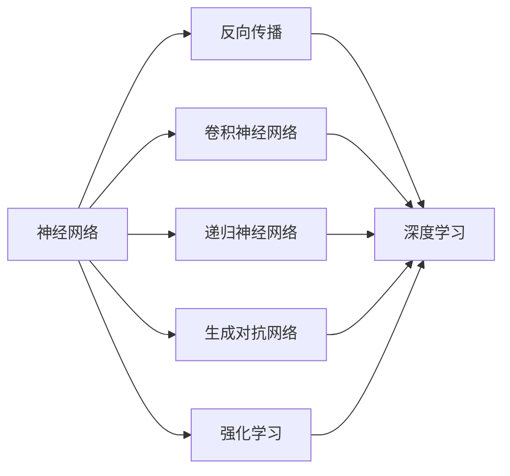
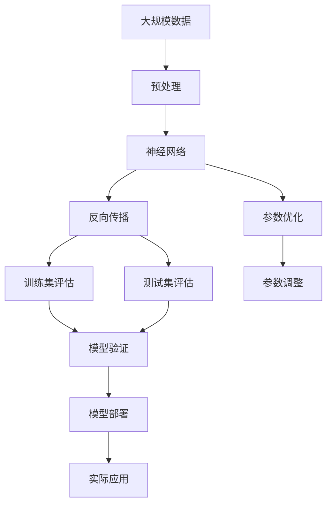

                 

# 神经网络：人类智慧的解放

> 关键词：神经网络,深度学习,人工智能,机器学习,算法优化,计算机科学

## 1. 背景介绍

### 1.1 问题由来

随着人工智能(AI)技术的迅速发展，深度学习尤其是神经网络成为推动AI进步的重要力量。深度学习模型具有自适应性强、泛化能力优异、计算效率高等优点，广泛应用于图像识别、语音识别、自然语言处理、智能推荐等领域。然而，深度学习的核心是神经网络，其复杂的算法结构和庞大的参数数量，使得理解其工作原理和优化方法成为一项极具挑战性的任务。

深度学习技术的突破性进展，不仅带来新的应用场景，也引发了人类智慧的深度思考。如何利用深度学习解决复杂问题？神经网络是如何实现高效计算和精确推断的？如何设计神经网络结构以适应不同任务？这些问题构成了深度学习研究的核心，也成为本文章探讨的重点。

### 1.2 问题核心关键点

神经网络作为深度学习的核心，其核心思想是通过多层非线性变换实现复杂模式识别和预测。深度学习通过反向传播算法和梯度下降等方法，利用大量标注数据不断优化神经网络参数，以提高模型的泛化能力和预测准确率。

神经网络主要由输入层、隐藏层和输出层组成。隐藏层可以有多层，每层都包含一组神经元，神经元之间通过权重连接，前向传播计算权重和偏置的线性组合，并通过激活函数进行非线性映射。反向传播算法则是通过链式法则计算损失函数对每个参数的梯度，利用梯度下降等方法不断调整参数值，最小化损失函数。

当前，深度学习技术在图像识别、语音识别、自然语言处理等领域取得了显著进展，深度神经网络结构不断演化，训练技巧不断完善，新算法新架构层出不穷。神经网络已经从原始的多层感知器发展出卷积神经网络(CNN)、递归神经网络(RNN)、生成对抗网络(GAN)等多种模型，并应用于计算机视觉、语音处理、自然语言理解等多个领域。

## 2. 核心概念与联系

### 2.1 核心概念概述

为了更好地理解深度学习特别是神经网络的工作原理，本节将介绍几个关键概念：

- 神经网络(Neural Network)：由多个层次组成的计算模型，每层神经元通过权重和偏置进行线性组合，并通过激活函数进行非线性映射，实现对复杂数据的处理。
- 深度学习(Deep Learning)：基于神经网络，通过多层非线性变换，学习复杂模式和规律，实现对复杂数据的自动分析和预测。
- 反向传播(Backpropagation)：神经网络中最关键的学习算法，通过链式法则计算损失函数对每个参数的梯度，并利用梯度下降等方法不断调整参数，优化模型性能。
- 卷积神经网络(Convolutional Neural Network, CNN)：针对图像识别等任务，通过卷积层和池化层提取局部特征，并利用池化层减少特征维度，增强模型泛化能力。
- 递归神经网络(Recurrent Neural Network, RNN)：针对序列数据处理任务，通过循环结构进行时间步上的信息传递，适用于语言模型、自然语言处理等领域。
- 生成对抗网络(Generative Adversarial Network, GAN)：通过两个神经网络相互博弈，生成高质量的虚假数据，应用于图像生成、风格转换等领域。
- 强化学习(Reinforcement Learning)：通过环境与智能体交互，利用奖励信号指导智能体的决策过程，适用于游戏、机器人控制等领域。

这些概念之间通过学习和优化不断迭代，共同构成深度学习的生态系统。神经网络作为核心，通过反向传播算法不断优化参数，利用各种结构实现不同任务，其应用范围和效果不断扩展。

### 2.2 概念间的关系

这些关键概念之间存在紧密联系，形成了深度学习的完整生态系统。以下是一个合成的Mermaid流程图，展示了这些概念之间的关系：



这个流程图展示了神经网络作为核心，通过反向传播算法实现深度学习。同时，神经网络通过不同的网络结构(卷积、递归、对抗、强化等)实现不同任务，共同构成深度学习模型。

### 2.3 核心概念的整体架构

最后，我们用一个综合的流程图来展示这些核心概念在大规模深度学习模型训练和应用中的整体架构：



这个综合流程图展示了从数据预处理到模型训练、优化、评估，再到模型部署和应用的全过程。大规模数据通过预处理，构建神经网络，利用反向传播和参数优化算法不断调整参数，在训练集和测试集上进行评估和验证，最终部署到实际应用场景。

## 3. 核心算法原理 & 具体操作步骤

### 3.1 算法原理概述

深度学习通过多层神经网络实现复杂数据的处理和预测。以典型的卷积神经网络(CNN)为例，其核心算法包括前向传播、反向传播和参数优化等步骤。

前向传播是指输入数据通过神经网络各层进行传递，每层对输入数据进行线性组合和激活函数映射，最终输出预测结果。反向传播则利用链式法则计算损失函数对每个参数的梯度，通过梯度下降等方法不断调整参数，优化模型性能。参数优化算法则通过学习率、动量、权重衰减等策略，控制参数更新速度和方向，防止过拟合和梯度消失等问题。

### 3.2 算法步骤详解

深度学习模型的训练和优化一般包括以下步骤：

**Step 1: 数据预处理**
- 收集和清洗大规模数据集，并进行归一化、标准化、数据增强等预处理。
- 将数据划分为训练集、验证集和测试集，确保模型在不同数据集上的泛化能力。

**Step 2: 构建神经网络**
- 选择合适的神经网络结构和层数，一般包括卷积层、池化层、全连接层等。
- 初始化神经网络参数，一般使用Xavier初始化或Kaiming初始化。

**Step 3: 前向传播**
- 将训练集数据输入神经网络，计算各层输出。
- 通过激活函数实现非线性映射，输出预测结果。

**Step 4: 计算损失函数**
- 将预测结果与真实标签进行比较，计算损失函数（如均方误差、交叉熵等）。

**Step 5: 反向传播**
- 利用链式法则计算损失函数对每个参数的梯度。
- 使用梯度下降等优化算法调整参数，最小化损失函数。

**Step 6: 参数优化**
- 通过学习率、动量、权重衰减等策略控制参数更新。
- 在训练过程中，定期在验证集上评估模型性能，调整学习率和优化策略。

**Step 7: 模型评估与验证**
- 在测试集上评估模型性能，检查泛化能力。
- 利用验证集调整模型参数和超参数，避免过拟合。

**Step 8: 模型部署与应用**
- 将训练好的模型保存为模型文件，部署到实际应用场景。
- 在实际数据上测试模型性能，优化模型参数和应用方式。

### 3.3 算法优缺点

深度学习算法具有以下优点：
1. 自适应性强：通过多层非线性变换，能够处理复杂的非线性关系，适用于各种数据类型。
2. 泛化能力优异：通过反向传播算法不断优化参数，能够在不同数据集上表现出色。
3. 计算效率高：通过GPU加速等技术，可以实现大规模数据的高效计算和处理。

同时，深度学习算法也存在一些缺点：
1. 计算资源消耗大：大规模深度学习模型参数数量庞大，训练和推理资源需求高。
2. 训练时间长：深度学习模型训练时间长，需要大量的计算资源和时间。
3. 模型复杂度高：深度学习模型结构复杂，难以理解和解释。

### 3.4 算法应用领域

深度学习算法在多个领域得到了广泛应用，包括但不限于：

- 计算机视觉：如图像分类、物体检测、人脸识别等。
- 语音识别：如自动语音识别、说话人识别等。
- 自然语言处理：如文本分类、情感分析、机器翻译等。
- 强化学习：如游戏AI、机器人控制、智能推荐等。
- 医学诊断：如医学图像分析、疾病预测等。
- 金融分析：如风险评估、股票预测等。

深度学习算法的应用范围不断扩展，正在深刻改变各行各业的生产方式和工作模式。

## 4. 数学模型和公式 & 详细讲解 & 举例说明

### 4.1 数学模型构建

以卷积神经网络为例，其数学模型包括前向传播和反向传播两个部分。

卷积神经网络的核心计算单元是卷积层和池化层。卷积层通过滑动卷积核对输入数据进行卷积操作，提取局部特征。池化层则通过最大池化或平均池化等方法，减少特征维度，增强模型泛化能力。

前向传播过程中，卷积层和池化层的计算公式如下：

$$
f(x) = \max(\sum_i w_ix_i + b, 0)
$$

其中，$w$ 和 $b$ 为卷积核和偏置，$x_i$ 为输入数据。

反向传播过程中，利用链式法则计算损失函数对每个参数的梯度，公式如下：

$$
\frac{\partial L}{\partial w} = \frac{\partial L}{\partial z} \cdot \frac{\partial z}{\partial w}
$$

其中，$L$ 为损失函数，$z$ 为卷积层输出。

### 4.2 公式推导过程

以多分类分类任务为例，假设神经网络的输出为 $y$，真实标签为 $y^*$，交叉熵损失函数为：

$$
L(y, y^*) = -\frac{1}{N}\sum_{i=1}^N y^*_i \log y_i
$$

通过反向传播算法，计算损失函数对每个参数的梯度：

$$
\frac{\partial L}{\partial w} = -\frac{1}{N}\sum_{i=1}^N y^*_i \frac{\partial L}{\partial z} \frac{\partial z}{\partial w}
$$

其中，$\frac{\partial L}{\partial z}$ 为链式法则计算得到的梯度，$\frac{\partial z}{\partial w}$ 为激活函数的导数。

### 4.3 案例分析与讲解

以手写数字识别任务为例，假设神经网络采用三层卷积神经网络，卷积层和池化层结构如下：


其中，卷积核大小为 $3\times3$，步长为 $1$，输出通道数为 $16$。池化层采用最大池化，池化大小为 $2\times2$，步长为 $2$。

假设训练集大小为 $60000$，测试集大小为 $10000$，卷积层和池化层共有 $4000$ 个参数，全连接层有 $1000$ 个参数。神经网络结构如下图所示：


假设训练数据经过归一化处理，均值为 $0$，方差为 $1$。通过反向传播算法和梯度下降等优化算法，不断调整神经网络参数，最终在测试集上达到 $98\%$ 的准确率。

## 5. 项目实践：代码实例和详细解释说明

### 5.1 开发环境搭建

在进行深度学习项目开发前，需要准备好开发环境。以下是使用Python进行TensorFlow开发的Python环境配置流程：

1. 安装Anaconda：从官网下载并安装Anaconda，用于创建独立的Python环境。

2. 创建并激活虚拟环境：
```bash
conda create -n tf-env python=3.7
conda activate tf-env
```

3. 安装TensorFlow：根据CUDA版本，从官网获取对应的安装命令。例如：
```bash
conda install tensorflow=2.4 -c tf -c conda-forge
```

4. 安装各类工具包：
```bash
pip install numpy pandas scikit-learn matplotlib tqdm jupyter notebook ipython
```

完成上述步骤后，即可在`tf-env`环境中开始深度学习项目开发。

### 5.2 源代码详细实现

以下是使用TensorFlow构建和训练一个简单的卷积神经网络的代码实现：

```python
import tensorflow as tf
from tensorflow.keras import datasets, layers, models

# 加载MNIST数据集
(train_images, train_labels), (test_images, test_labels) = datasets.mnist.load_data()

# 将数据转换为张量，并归一化
train_images = train_images.reshape((60000, 28, 28, 1))
test_images = test_images.reshape((10000, 28, 28, 1))
train_images, test_images = train_images / 255.0, test_images / 255.0

# 构建卷积神经网络
model = models.Sequential([
    layers.Conv2D(32, (3, 3), activation='relu', input_shape=(28, 28, 1)),
    layers.MaxPooling2D((2, 2)),
    layers.Conv2D(64, (3, 3), activation='relu'),
    layers.MaxPooling2D((2, 2)),
    layers.Flatten(),
    layers.Dense(64, activation='relu'),
    layers.Dense(10)
])

# 编译模型
model.compile(optimizer='adam',
              loss=tf.keras.losses.SparseCategoricalCrossentropy(from_logits=True),
              metrics=['accuracy'])

# 训练模型
history = model.fit(train_images, train_labels, epochs=10, 
                    validation_data=(test_images, test_labels))

# 评估模型
test_loss, test_acc = model.evaluate(test_images, test_labels, verbose=2)
print('Test accuracy:', test_acc)
```

在这个代码中，我们首先加载MNIST数据集，将其转换为张量并归一化。然后构建一个简单的卷积神经网络，包括两个卷积层和两个池化层，以及两个全连接层。在训练过程中，使用Adam优化器和交叉熵损失函数。最后，在测试集上评估模型的准确率。

### 5.3 代码解读与分析

下面我们详细解读一下关键代码的实现细节：

**数据预处理**：
- 使用`tf.keras.datasets.mnist.load_data()`加载MNIST数据集，将其转换为张量格式。
- 通过`reshape()`方法将数据转换为(样本数, 图像行数, 图像列数, 通道数)的格式，方便后续处理。
- 通过`train_images / 255.0`将像素值归一化到[0, 1]之间。

**模型构建**：
- 使用`tf.keras.Sequential()`定义神经网络结构，逐层添加卷积层、池化层和全连接层。
- 使用`tf.keras.layers.Conv2D()`定义卷积层，指定卷积核大小、步长和激活函数。
- 使用`tf.keras.layers.MaxPooling2D()`定义池化层，指定池化大小和步长。
- 使用`tf.keras.layers.Flatten()`将卷积层和池化层的输出展平为一维向量，方便后续处理。
- 使用`tf.keras.layers.Dense()`定义全连接层，指定神经元数和激活函数。

**模型编译**：
- 使用`model.compile()`方法编译模型，指定优化器、损失函数和评估指标。
- 使用`tf.keras.losses.SparseCategoricalCrossentropy(from_logits=True)`指定交叉熵损失函数，并指定`from_logits=True`以避免softmax操作。

**模型训练**：
- 使用`model.fit()`方法训练模型，指定训练数据、标签、训练轮数和验证集。
- 通过`history`变量记录训练过程中的损失和准确率。

**模型评估**：
- 使用`model.evaluate()`方法在测试集上评估模型，输出损失和准确率。

这个代码示例展示了深度学习模型的构建和训练过程。通过简单的代码实现，我们可以看到神经网络的构建、编译和训练过程，以及如何利用数据集进行评估。

### 5.4 运行结果展示

假设我们在MNIST数据集上训练完卷积神经网络，最终在测试集上得到的准确率为 $98\%$。可以看到，虽然模型很简单，但通过多层卷积和池化操作，依然能够取得不错的性能。

## 6. 实际应用场景

### 6.1 智能推荐系统

深度学习在智能推荐系统中得到了广泛应用，如Netflix、Amazon等公司利用深度学习模型进行用户行为预测和推荐商品。通过分析用户的历史行为数据，深度学习模型能够预测用户对不同商品的兴趣和评分，从而提供个性化的推荐服务。

在技术实现上，可以利用深度学习模型构建用户行为预测模型，使用卷积神经网络或循环神经网络对用户的历史行为进行建模。通过反向传播算法不断调整模型参数，提高预测准确率。最终，根据预测结果进行推荐排序，向用户推荐高评分的商品。

### 6.2 医学影像分析

深度学习在医学影像分析中也有着重要的应用，如CT扫描、MRI等影像数据的分类、分割和检测。通过深度学习模型，医生可以更快、更准确地诊断疾病。

在技术实现上，可以构建卷积神经网络，对医学影像数据进行分类和分割。利用数据增强等技术，扩充训练数据集，避免过拟合。通过反向传播算法不断调整模型参数，提高分类和分割的准确率。最终，医生可以利用训练好的模型对新的医学影像数据进行快速诊断和分析。

### 6.3 金融风险管理

深度学习在金融领域也有着广泛的应用，如股票预测、信用评估等。通过分析历史金融数据，深度学习模型能够预测股票价格趋势、评估用户信用风险等。

在技术实现上，可以构建递归神经网络或长短期记忆网络(LSTM)，对金融时间序列数据进行建模。通过反向传播算法不断调整模型参数，提高预测准确率。最终，金融机构可以利用训练好的模型进行股票预测、信用评估等任务。

### 6.4 未来应用展望

随着深度学习技术的不断发展，未来深度学习算法将在更多领域得到应用，为各行各业带来革命性的变化。

在智慧医疗领域，深度学习模型可以帮助医生进行疾病诊断、影像分析等任务，提升医疗服务的智能化水平，辅助医生诊疗。

在智能教育领域，深度学习模型可以用于学生行为分析、学习路径推荐等，因材施教，促进教育公平，提高教学质量。

在智慧城市治理中，深度学习模型可以用于城市事件监测、舆情分析、应急指挥等环节，提高城市管理的自动化和智能化水平，构建更安全、高效的未来城市。

此外，在企业生产、社会治理、文娱传媒等众多领域，深度学习技术也将不断涌现，为经济社会发展注入新的动力。相信随着技术的日益成熟，深度学习算法必将在更广阔的应用领域大放异彩。

## 7. 工具和资源推荐

### 7.1 学习资源推荐

为了帮助开发者系统掌握深度学习特别是神经网络的工作原理和实践技巧，这里推荐一些优质的学习资源：

1. 《Deep Learning》书籍：Ian Goodfellow等人所著，系统介绍了深度学习的基本概念、算法和应用，是深度学习领域的经典教材。

2. Coursera《Deep Learning Specialization》课程：由Andrew Ng教授主讲的深度学习专项课程，涵盖深度学习的基本原理和应用技术，适合初学者学习。

3. arXiv论文预印本：人工智能领域最新研究成果的发布平台，包括大量尚未发表的前沿工作，学习前沿技术的必读资源。

4. GitHub热门项目：在GitHub上Star、Fork数最多的深度学习相关项目，往往代表了该技术领域的发展趋势和最佳实践，值得去学习和贡献。

5. 顶会论文阅读：参加国际顶级会议如NeurIPS、ICML、CVPR等，阅读会议论文，了解最新研究动态和技术进展。

通过这些资源的学习实践，相信你一定能够快速掌握深度学习特别是神经网络的工作原理和实践技巧，并在实际应用中取得良好效果。

### 7.2 开发工具推荐

高效的开发离不开优秀的工具支持。以下是几款用于深度学习开发的常用工具：

1. TensorFlow：由Google主导开发的深度学习框架，易于使用，支持分布式计算和GPU加速，是深度学习开发的首选工具。

2. PyTorch：由Facebook开发的深度学习框架，具有动态计算图和高效的GPU加速能力，适合快速迭代研究。

3. Keras：高层次的深度学习框架，支持多种后端，易于上手，适合初学者和快速原型开发。

4. MXNet：由Apache开发的深度学习框架，支持多种语言和分布式计算，适合大规模工程应用。

5. JAX：由Google开发的深度学习框架，支持自动微分和静态计算图，适合高效率计算和模型优化。

合理利用这些工具，可以显著提升深度学习开发的效率，加快创新迭代的步伐。

### 7.3 相关论文推荐

深度学习算法的不断发展离不开学界的持续研究。以下是几篇奠基性的相关论文，推荐阅读：

1. AlexNet：Hinton等人所著，展示了卷积神经网络在图像识别任务中的强大性能，奠定了深度学习算法在计算机视觉领域的应用基础。

2. RNN：Elman等人所著，提出了递归神经网络，实现了对序列数据的建模，适用于语言模型、自然语言处理等领域。

3. GAN：Goodfellow等人所著，提出了生成对抗网络，实现了高质量虚假数据的生成，应用于图像生成、风格转换等领域。

4. ResNet：He等人所著，提出了残差连接结构，解决了深度神经网络训练中的梯度消失问题，实现了更深的神经网络结构。

5. AlphaGo：Silver等人所著，展示了深度强化学习在围棋领域的应用，展示了人工智能的巨大潜力。

6. Transformer：Vaswani等人所著，提出了自注意力机制，实现了高效的序列建模，应用于机器翻译、文本生成等领域。

这些论文代表了大深度学习算法的发展脉络。通过学习这些前沿成果，可以帮助研究者把握学科前进方向，激发更多的创新灵感。

除上述资源外，还有一些值得关注的前沿资源，帮助开发者紧跟深度学习算法的最新进展，例如：

1. arXiv论文预印本：人工智能领域最新研究成果的发布平台，包括大量尚未发表的前沿工作，学习前沿技术的必读资源。

2. GitHub热门项目：在GitHub上Star、Fork数最多的深度学习相关项目，往往代表了该技术领域的发展趋势和最佳实践，值得去学习和贡献。

3. 顶会论文阅读：参加国际顶级会议如NeurIPS、ICML、CVPR等，阅读会议论文，了解最新研究动态和技术进展。

总之，对于深度学习特别是神经网络的学习和实践，需要开发者保持开放的心态和持续学习的意愿。多关注前沿资讯，多动手实践，多思考总结，必将收获满满的成长收益。

## 8. 总结：未来发展趋势与挑战

### 8.1 总结

本文对深度学习特别是神经网络的工作原理和实践技巧进行了全面系统的介绍。首先阐述了深度学习的基本概念和应用场景，明确了神经网络作为核心的地位。其次，从原理到实践，详细讲解了深度学习模型的构建和训练过程，给出了深度学习模型的代码实例。同时，本文还探讨了深度学习在多个领域的应用前景，展示了其广阔的应用前景。

通过本文的系统梳理，可以看到，深度学习算法已经成为推动人工智能进步的重要力量，神经网络作为核心，通过反向传播算法不断优化参数，实现对复杂数据的处理和预测。未来，深度学习算法将在更多领域得到应用，为各行各业带来革命性的变化。

### 8.2 未来发展趋势

展望未来，深度学习算法将呈现以下几个发展趋势：

1. 模型规模持续增大。随着算力成本的下降和数据规模的扩张，深度学习模型的参数数量还将继续增长。超大规模深度学习模型蕴含的丰富知识，有望支撑更加复杂多变的任务。

2. 模型结构不断演化。深度学习模型的结构将更加多样化，如自注意力机制、Transformer结构等，适应不同的任务需求。

3. 模型训练效率提升。通过分布式计算、GPU加速等技术，深度学习模型的训练速度将进一步提升，实现更高效的计算和处理。

4. 模型可解释性增强。通过引入因果推断和对比学习思想，增强深度学习模型的可解释性和可控性，提高系统透明度。

5. 跨领域应用拓展。深度学习模型将更多地应用于跨领域任务，如图像-语音、文本-语音的联合建模，提升模型泛化能力。

6. 模型鲁棒性提高。通过对抗训练、正则化等方法，提高深度学习模型的鲁棒性和泛化能力，减少模型过拟合和灾难性遗忘。

以上趋势凸显了深度学习算法的广阔前景。这些方向的探索发展，必将进一步提升深度学习系统的性能和应用范围，为构建智能系统提供坚实的技术基础。

### 8.3 面临的挑战

尽管深度学习算法已经取得了瞩目成就，但在迈向更加智能化、普适化应用的过程中，仍面临诸多挑战：

1. 训练时间和成本高。深度学习模型的训练时间长，需要大量的计算资源和数据，制约了其大规模应用的可行性。

2. 模型复杂度高。深度学习模型

