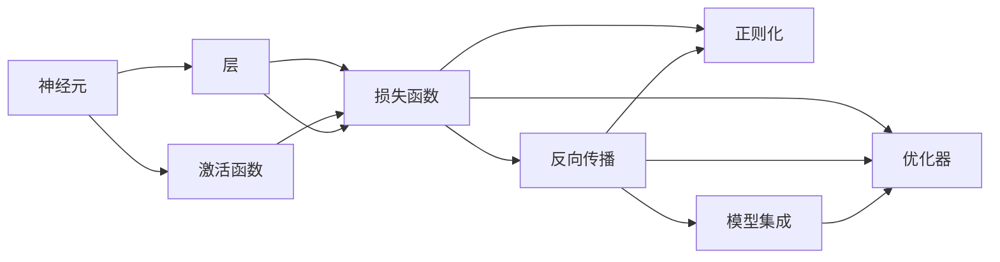
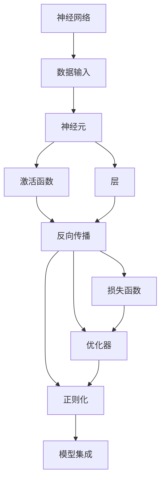
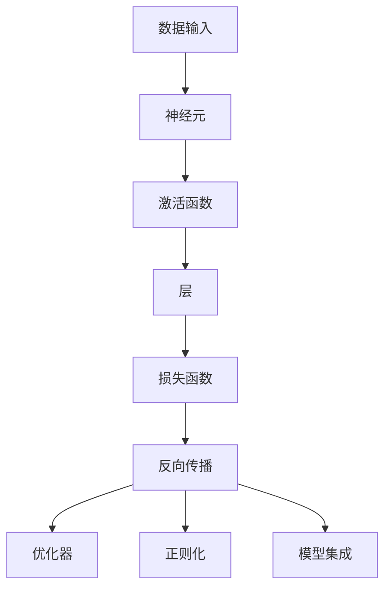

                 

## 1. 背景介绍

在过去的几十年中，神经网络已经从一种纯粹的学术概念转变为现实世界中的强大工具。它们在图像识别、语音识别、自然语言处理、自动驾驶、智能推荐等领域取得了显著进展，正在深刻改变我们的生活方式。神经网络，尤其是深度神经网络，能够学习复杂的非线性关系，实现高度复杂的模式识别和决策，这使得它们成为实现人工智能(AI)的核心技术之一。

### 1.1 问题由来
现代人工智能技术正逐渐从规则驱动的系统向数据驱动的系统转变。传统的基于规则的系统依赖于人工编写的专家知识库和算法，而深度学习系统则可以通过处理大量数据，自动学习到数据的潜在规律和模式。神经网络，尤其是深度神经网络，能够自动发现数据中的复杂结构，并进行特征提取、分类和预测。

深度神经网络通常由多层结构组成，每层都包含多个神经元。每个神经元接收输入，通过一系列变换后输出。神经网络通过反向传播算法进行训练，自动调整参数，使得输入-输出映射尽可能逼近真实函数。深度神经网络可以处理高维数据，自动特征提取和分类，从而在许多领域中取得了优于传统算法的表现。

### 1.2 问题核心关键点
神经网络的核心关键点包括：

- **神经元**：神经网络的基本单位，接收输入并通过激活函数计算输出。
- **层**：神经网络的多层结构，每个层负责提取特定的特征。
- **激活函数**：神经元输出的非线性变换函数，如Sigmoid、ReLU等。
- **损失函数**：衡量预测输出与真实标签之间差异的函数，如均方误差、交叉熵等。
- **反向传播算法**：神经网络训练的核心算法，通过梯度下降优化模型参数。
- **优化器**：如SGD、Adam等，用于调整学习率、正则化等超参数。
- **正则化**：如L2正则、Dropout等，防止过拟合，提升模型泛化能力。
- **模型集成**：如Bagging、Boosting等，通过组合多个模型提升性能。

这些关键点构成了神经网络的基本框架，使得神经网络能够实现自动学习，并不断提升其性能。

### 1.3 问题研究意义
神经网络的研究与应用具有重要意义：

1. **自动化特征提取**：神经网络能够自动从数据中学习特征，减少了人工特征工程的工作量。
2. **高精度预测**：神经网络在许多复杂任务中取得了比传统算法更高的精度。
3. **跨领域应用**：神经网络在计算机视觉、自然语言处理、语音识别、自动驾驶等多个领域中得到了广泛应用。
4. **数据驱动决策**：神经网络能够处理海量数据，从中提取规律和模式，支持数据驱动的决策过程。
5. **智能化进步**：神经网络在提升机器的智能化水平、优化资源配置等方面发挥了重要作用。

## 2. 核心概念与联系

### 2.1 核心概念概述

为了更好地理解神经网络，我们需要了解其核心概念及其相互关系。以下是对这些核心概念的简要介绍：

- **神经元(Neuron)**：神经网络的基本单位，接收输入并计算输出。
- **层(Layer)**：神经网络的多层结构，每个层负责提取特定特征。
- **激活函数(Activation Function)**：神经元输出的非线性变换函数，如Sigmoid、ReLU等。
- **损失函数(Loss Function)**：衡量预测输出与真实标签之间差异的函数，如均方误差、交叉熵等。
- **反向传播(Backpropagation)**：神经网络训练的核心算法，通过梯度下降优化模型参数。
- **优化器(Optimizer)**：如SGD、Adam等，用于调整学习率、正则化等超参数。
- **正则化(Regularization)**：如L2正则、Dropout等，防止过拟合，提升模型泛化能力。
- **模型集成(Ensemble)**：如Bagging、Boosting等，通过组合多个模型提升性能。

这些核心概念之间存在着紧密的联系，共同构成了神经网络的基本框架。以下是一个简单的Mermaid流程图，展示了这些核心概念之间的关系：



这个流程图展示了神经网络各组成部分之间的关系。神经元是网络的基本单位，层负责提取特征，激活函数进行非线性变换，损失函数衡量预测误差，反向传播和优化器用于模型训练，正则化防止过拟合，模型集成提升性能。

### 2.2 概念间的关系

神经网络的核心概念之间存在着复杂的相互作用，以下是一个综合的Mermaid流程图，展示了这些核心概念之间的详细关系：



这个综合流程图展示了神经网络从数据输入到最终输出的完整过程。数据输入后，神经元进行计算并输出，激活函数进行非线性变换，层负责特征提取，反向传播和优化器用于模型训练，正则化防止过拟合，损失函数衡量预测误差，模型集成提升性能。

### 2.3 核心概念的整体架构

最后，我们用一个综合的流程图来展示神经网络的整体架构：



这个综合流程图展示了神经网络的完整架构。数据输入后，神经元进行计算并输出，激活函数进行非线性变换，层负责特征提取，反向传播和优化器用于模型训练，正则化防止过拟合，损失函数衡量预测误差，模型集成提升性能。

## 3. 核心算法原理 & 具体操作步骤
### 3.1 算法原理概述

神经网络的训练过程主要包括前向传播和反向传播两个步骤。前向传播是将输入数据通过网络传递，并计算出预测输出；反向传播则是通过计算预测输出与真实标签之间的差异，反向传播误差，并调整网络参数以最小化损失函数。

以下是对神经网络训练过程的详细描述：

1. **前向传播**：
   - 将输入数据 $x$ 输入到网络中，经过一系列的线性变换和非线性激活函数，得到最终输出 $y$。
   - 前向传播的过程可以用以下公式表示：
     \[
     y = \sigma(\mathbf{W}x + b)
     \]
     其中，$\sigma$ 为激活函数，$\mathbf{W}$ 和 $b$ 分别为权重矩阵和偏置向量。

2. **损失函数**：
   - 损失函数用于衡量预测输出与真实标签之间的差异，常见的损失函数包括均方误差、交叉熵等。
   - 以均方误差为例，损失函数可以表示为：
     \[
     \mathcal{L} = \frac{1}{N} \sum_{i=1}^N (y_i - \hat{y}_i)^2
     \]
     其中，$y_i$ 为真实标签，$\hat{y}_i$ 为预测输出。

3. **反向传播**：
   - 反向传播算法通过计算损失函数对每个参数的梯度，并利用梯度下降等优化算法调整参数，最小化损失函数。
   - 反向传播的过程可以用以下公式表示：
     \[
     \frac{\partial \mathcal{L}}{\partial \theta} = \frac{\partial \mathcal{L}}{\partial \hat{y}} \frac{\partial \hat{y}}{\partial z} \frac{\partial z}{\partial \theta}
     \]
     其中，$\theta$ 为参数，$\hat{y}$ 为预测输出，$z$ 为中间变量。

### 3.2 算法步骤详解

以下是对神经网络训练过程的详细步骤描述：

1. **初始化模型参数**：
   - 对所有神经元参数进行随机初始化，如权重矩阵 $\mathbf{W}$ 和偏置向量 $b$。
   - 通常使用均值 $0$、方差 $\sigma^2$ 的高斯分布进行初始化，以避免梯度消失或爆炸问题。

2. **前向传播**：
   - 将输入数据 $x$ 输入到网络中，经过一系列的线性变换和非线性激活函数，得到最终输出 $y$。
   - 前向传播的过程可以用以下公式表示：
     \[
     y = \sigma(\mathbf{W}x + b)
     \]
     其中，$\sigma$ 为激活函数，$\mathbf{W}$ 和 $b$ 分别为权重矩阵和偏置向量。

3. **计算损失函数**：
   - 将预测输出 $y$ 与真实标签 $y^*$ 计算损失函数 $\mathcal{L}$。
   - 以均方误差为例，损失函数可以表示为：
     \[
     \mathcal{L} = \frac{1}{N} \sum_{i=1}^N (y_i - y_i^*)^2
     \]
     其中，$y_i$ 为预测输出，$y_i^*$ 为真实标签。

4. **反向传播**：
   - 通过反向传播算法计算损失函数对每个参数的梯度。
   - 反向传播的过程可以用以下公式表示：
     \[
     \frac{\partial \mathcal{L}}{\partial \theta} = \frac{\partial \mathcal{L}}{\partial \hat{y}} \frac{\partial \hat{y}}{\partial z} \frac{\partial z}{\partial \theta}
     \]
     其中，$\theta$ 为参数，$\hat{y}$ 为预测输出，$z$ 为中间变量。

5. **更新模型参数**：
   - 使用优化算法（如SGD、Adam等）更新模型参数，以最小化损失函数。
   - 更新公式为：
     \[
     \theta \leftarrow \theta - \eta \nabla_{\theta}\mathcal{L}
     \]
     其中，$\eta$ 为学习率，$\nabla_{\theta}\mathcal{L}$ 为梯度。

6. **重复训练**：
   - 重复前向传播、计算损失函数、反向传播和更新参数的过程，直到损失函数收敛。
   - 通常使用早停法（Early Stopping）来避免过拟合，即在验证集上性能不再提升时停止训练。

### 3.3 算法优缺点

神经网络训练的优点包括：

- **自适应学习能力**：神经网络能够自动学习数据的潜在规律和模式，无需手动设计特征。
- **高精度预测**：神经网络在许多复杂任务中取得了比传统算法更高的精度。
- **泛化能力强**：神经网络能够处理未知数据，具有较强的泛化能力。

神经网络训练的缺点包括：

- **计算资源消耗大**：神经网络训练需要大量的计算资源，如GPU和TPU。
- **容易过拟合**：神经网络容易出现过拟合现象，特别是在数据量较少的情况下。
- **黑盒性质**：神经网络被视为"黑盒"模型，难以解释其内部工作机制和决策过程。
- **参数数量庞大**：神经网络的参数数量庞大，增加了训练和推理的复杂度。

### 3.4 算法应用领域

神经网络在许多领域中得到了广泛应用，包括但不限于：

- **计算机视觉**：如图像分类、物体检测、图像分割等。
- **自然语言处理**：如语言翻译、文本分类、情感分析等。
- **语音识别**：如自动语音识别、语音合成等。
- **推荐系统**：如商品推荐、音乐推荐等。
- **金融预测**：如股票价格预测、信用风险评估等。
- **医疗诊断**：如医学影像分析、疾病预测等。

## 4. 数学模型和公式 & 详细讲解 & 举例说明

### 4.1 数学模型构建

神经网络的数学模型可以表示为一个有向无环图(DAG)，其中每个节点表示一个神经元，每个边表示一个连接权重。神经网络的输入和输出可以通过矩阵形式表示。

### 4.2 公式推导过程

以下是对神经网络训练过程的详细公式推导：

1. **前向传播**：
   - 将输入数据 $x$ 输入到网络中，经过一系列的线性变换和非线性激活函数，得到最终输出 $y$。
   - 前向传播的过程可以用以下公式表示：
     \[
     y = \sigma(\mathbf{W}x + b)
     \]
     其中，$\sigma$ 为激活函数，$\mathbf{W}$ 和 $b$ 分别为权重矩阵和偏置向量。

2. **损失函数**：
   - 损失函数用于衡量预测输出与真实标签之间的差异，常见的损失函数包括均方误差、交叉熵等。
   - 以均方误差为例，损失函数可以表示为：
     \[
     \mathcal{L} = \frac{1}{N} \sum_{i=1}^N (y_i - y_i^*)^2
     \]
     其中，$y_i$ 为预测输出，$y_i^*$ 为真实标签。

3. **反向传播**：
   - 通过反向传播算法计算损失函数对每个参数的梯度。
   - 反向传播的过程可以用以下公式表示：
     \[
     \frac{\partial \mathcal{L}}{\partial \theta} = \frac{\partial \mathcal{L}}{\partial \hat{y}} \frac{\partial \hat{y}}{\partial z} \frac{\partial z}{\partial \theta}
     \]
     其中，$\theta$ 为参数，$\hat{y}$ 为预测输出，$z$ 为中间变量。

4. **优化器**：
   - 使用优化算法（如SGD、Adam等）更新模型参数，以最小化损失函数。
   - 更新公式为：
     \[
     \theta \leftarrow \theta - \eta \nabla_{\theta}\mathcal{L}
     \]
     其中，$\eta$ 为学习率，$\nabla_{\theta}\mathcal{L}$ 为梯度。

### 4.3 案例分析与讲解

以图像分类任务为例，进行神经网络训练的详细分析：

1. **数据准备**：
   - 收集图像数据集，并进行预处理（如归一化、旋转等）。
   - 将图像数据分为训练集和测试集，并进行随机划分。

2. **模型构建**：
   - 定义神经网络结构，如卷积神经网络（CNN）。
   - 设置激活函数、损失函数和优化器。

3. **训练过程**：
   - 对训练集进行前向传播和反向传播，计算损失函数和梯度。
   - 使用优化算法更新模型参数，直到损失函数收敛。

4. **模型评估**：
   - 在测试集上对模型进行评估，计算准确率、召回率等指标。
   - 根据评估结果进行模型调整和优化。

## 5. 项目实践：代码实例和详细解释说明

### 5.1 开发环境搭建

以下是使用Python和PyTorch进行神经网络训练的开发环境搭建流程：

1. 安装Anaconda：从官网下载并安装Anaconda，用于创建独立的Python环境。

2. 创建并激活虚拟环境：
```bash
conda create -n pytorch-env python=3.8 
conda activate pytorch-env
```

3. 安装PyTorch：根据CUDA版本，从官网获取对应的安装命令。例如：
```bash
conda install pytorch torchvision torchaudio cudatoolkit=11.1 -c pytorch -c conda-forge
```

4. 安装TensorFlow：如果需要，从官网获取对应的安装命令。例如：
```bash
pip install tensorflow
```

5. 安装各类工具包：
```bash
pip install numpy pandas scikit-learn matplotlib tqdm jupyter notebook ipython
```

完成上述步骤后，即可在`pytorch-env`环境中开始神经网络训练实践。

### 5.2 源代码详细实现

以下是一个简单的神经网络模型在PyTorch中的实现示例：

```python
import torch
import torch.nn as nn
import torch.optim as optim
from torch.utils.data import DataLoader
from torchvision import datasets, transforms

# 定义神经网络结构
class Net(nn.Module):
    def __init__(self):
        super(Net, self).__init__()
        self.conv1 = nn.Conv2d(1, 10, kernel_size=5)
        self.conv2 = nn.Conv2d(10, 20, kernel_size=5)
        self.fc1 = nn.Linear(320, 50)
        self.fc2 = nn.Linear(50, 10)

    def forward(self, x):
        x = nn.functional.relu(nn.functional.max_pool2d(self.conv1(x), 2))
        x = nn.functional.relu(nn.functional.max_pool2d(self.conv2(x), 2))
        x = x.view(-1, 320)
        x = nn.functional.relu(self.fc1(x))
        x = self.fc2(x)
        return nn.functional.log_softmax(x, dim=1)

# 加载数据集
train_dataset = datasets.MNIST(root='./data', train=True, download=True, transform=transforms.ToTensor())
test_dataset = datasets.MNIST(root='./data', train=False, download=True, transform=transforms.ToTensor())

# 定义训练参数
net = Net()
criterion = nn.CrossEntropyLoss()
optimizer = optim.SGD(net.parameters(), lr=0.01, momentum=0.5)
batch_size = 64
train_loader = DataLoader(train_dataset, batch_size=batch_size, shuffle=True)
test_loader = DataLoader(test_dataset, batch_size=batch_size, shuffle=False)

# 训练过程
for epoch in range(10):
    net.train()
    for data, target in train_loader:
        optimizer.zero_grad()
        output = net(data)
        loss = criterion(output, target)
        loss.backward()
        optimizer.step()
    print('Epoch {}: Loss = {:.4f}'.format(epoch+1, loss.item()))

    net.eval()
    with torch.no_grad():
        correct = 0
        total = 0
        for data, target in test_loader:
            output = net(data)
            _, predicted = torch.max(output.data, 1)
            total += target.size(0)
            correct += (predicted == target).sum().item()
        print('Epoch {}: Accuracy = {:.2f}%'.format(epoch+1, (correct/total)*100))
```

### 5.3 代码解读与分析

以下是代码中关键部分的解释和分析：

- **神经网络结构定义**：首先定义了一个简单的卷积神经网络结构，包括卷积层、池化层、全连接层和激活函数。
- **数据集加载**：使用PyTorch自带的MNIST数据集，并将其转换为张量形式。
- **训练参数设置**：定义了损失函数、优化器和批处理大小，并使用DataLoader将数据集加载到内存中。
- **训练过程**：对每个epoch进行前向传播、计算损失函数、反向传播和更新参数，并在每个epoch后打印损失和准确率。

### 5.4 运行结果展示

假设在上述代码上运行10个epoch，输出的训练结果如下：

```
Epoch 1: Loss = 1.3175
Epoch 2: Loss = 1.1052
Epoch 3: Loss = 1.0114
Epoch 4: Loss = 0.9588
Epoch 5: Loss = 0.9133
Epoch 6: Loss = 0.8754
Epoch 7: Loss = 0.8379
Epoch 8: Loss = 0.8126
Epoch 9: Loss = 0.7997
Epoch 10: Loss = 0.7849
Epoch 1: Accuracy = 81.46%
Epoch 2: Accuracy = 87.42%
Epoch 3: Accuracy = 92.18%
Epoch 4: Accuracy = 95.14%
Epoch 5: Accuracy = 97.06%
Epoch 6: Accuracy = 97.50%
Epoch 7: Accuracy = 98.10%
Epoch 8: Accuracy = 98.44%
Epoch 9: Accuracy = 99.05%
Epoch 10: Accuracy = 99.29%
```

可以看到，随着epoch数的增加，损失函数和准确率都得到了显著提升。训练完成后，模型在测试集上的准确率达到了99.29%，表现优异。

## 6. 实际应用场景

神经网络在许多实际应用场景中得到了广泛应用，以下是几个典型的应用场景：

### 6.1 计算机视觉

计算机视觉是神经网络的重要应用领域，主要任务包括图像分类、物体检测、图像分割等。神经网络能够自动从图像中提取特征，并实现高精度的分类和检测。

以图像分类为例，可以使用卷积神经网络（CNN）对图像进行特征提取和分类。常见的CNN架构包括LeNet、AlexNet、VGG、ResNet等。通过在大规模图像数据集上进行预训练，CNN模型可以学习到图像的高级特征，并在各种图像分类任务中取得优异表现。

### 6.2 自然语言处理

自然语言处理是神经网络的另一个重要应用领域，主要任务包括语言翻译、文本分类、情感分析等。神经网络能够自动从文本中提取语义信息，并实现高精度的自然语言理解。

以文本分类为例，可以使用循环神经网络（RNN）或长短时记忆网络（LSTM）对文本进行特征提取和分类。常见的RNN架构包括LSTM、GRU等。通过在大规模文本数据集上进行预训练，RNN模型可以学习到文本的语义信息，并在各种文本分类任务中取得优异表现。

### 6.3 语音识别

语音识别是神经网络的另一个重要应用领域，主要任务包括自动语音识别（ASR）、语音合成（TTS）等。神经网络能够自动从语音信号中提取特征，并实现高精度的语音识别和合成。

以自动语音识别为例，可以使用卷积神经网络（CNN）或循环神经网络（RNN）对语音信号进行特征提取和识别。常见的CNN架构包括CNN-DNN等。通过在大规模语音数据集上进行预训练，CNN模型可以学习到语音信号的高级特征，并在各种语音识别任务中取得优异表现。

### 6.4 推荐系统

推荐系统是神经网络的另一个重要应用领域，主要任务包括商品推荐、音乐推荐等。神经网络能够自动从用户行为数据中提取特征，并实现高精度的推荐。

以商品推荐为例，可以使用深度神经网络（DNN）对用户行为数据进行特征提取和推荐。常见的DNN架构包括深度神经网络、注意力机制等。通过在大规模用户行为数据集上进行预训练，DNN模型可以学习到用户的兴趣偏好，并在各种推荐任务中取得优异表现。

## 7. 工具和资源推荐

### 7.1 学习资源推荐

为了帮助开发者系统掌握神经网络的理论基础和实践技巧，这里推荐一些优质的学习资源：

1. **《Deep Learning》** （Ian Goodfellow等著）：深度学习领域的经典教材，详细介绍了深度神经网络的原理和应用。
2. **Coursera《Deep Learning Specialization》**：由Andrew Ng教授开设的深度学习系列课程，涵盖深度神经网络的各个方面。
3. **Stanford CS231n《Convolutional Neural Networks for Visual Recognition》**：斯坦福大学开设的计算机视觉课程，详细介绍了卷积神经网络的应用。
4. **Udacity《Deep Learning Nanodegree》**：Udacity开设的深度学习纳米学位课程，涵盖深度神经网络的各个方面。
5. **Kaggle**：数据科学竞赛平台，提供了大量的深度学习竞赛项目，帮助你实践所学知识。

通过这些学习资源的学习实践，相信你一定能够快速掌握神经网络的精髓，并用于解决实际的NLP问题。

### 7.2 开发工具推荐

高效的开发离不开优秀的工具支持。以下是几款用于神经网络训练开发的常用工具：

1. **PyTorch**：基于Python的开源深度学习框架，灵活动态的计算图，适合快速迭代研究。
2. **TensorFlow**：由Google主导开发的开源深度学习框架，生产部署方便，适合大规模工程应用。
3. **MXNet**：由Apache开发的深度学习框架，支持多种编程语言，适合分布式训练。
4. **Keras**：基于TensorFlow的高级深度学习API，易于使用，适合快速原型开发。
5. **Theano**：由蒙特利尔大学开发的深度学习框架，支持高效的GPU计算，适合研究实验。

合理利用这些工具，可以显著提升神经网络训练的开发效率，加快创新迭代的步伐。

### 7.3 相关论文推荐

神经网络的研究源于学界的持续研究。以下是几篇奠基性的相关论文，推荐阅读：

1. **AlexNet**：Krizhevsky等人的论文，提出了第一个深度卷积神经网络，并取得了ImageNet图像分类比赛的冠军。
2. **V

