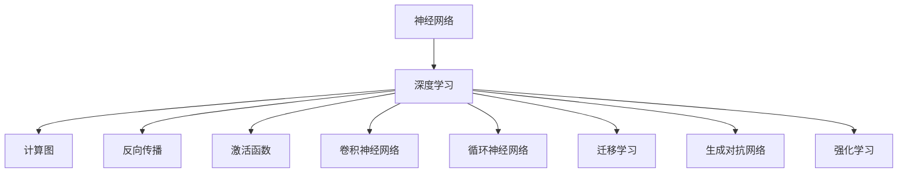

                 

# 神经网络：开启智能新纪元

> 关键词：神经网络,深度学习,计算图,反向传播,激活函数,卷积神经网络,循环神经网络,迁移学习,生成对抗网络,强化学习

## 1. 背景介绍

### 1.1 问题由来
人工智能(AI)的快速发展，催生了各种智能技术和应用。其中，神经网络是AI的核心技术之一，从视觉识别、自然语言处理到游戏策略、智能推荐，都离不开神经网络的支撑。然而，神经网络究竟为何如此重要？它如何从计算图和反向传播算法中诞生，进而推动了智能技术的新纪元？本文将从历史脉络和现实应用出发，深入解析神经网络的核心原理和最新进展，为读者提供全面、深刻的理解。

### 1.2 问题核心关键点
神经网络的关键在于其计算图结构和反向传播算法，这使得它能够通过多层非线性变换，高效地逼近复杂函数。然而，神经网络并非一蹴而就，其发展历程中有诸多重要的理论和算法突破。理解这些关键点，有助于我们深刻把握神经网络技术的本质和未来发展方向。

### 1.3 问题研究意义
神经网络作为AI技术的基石，对推动人工智能的产业化进程和人类认知智能的演进具有重要意义。通过神经网络，我们可以高效地提取数据中的特征，实现对复杂系统的建模和预测，从而开启智能新纪元。神经网络的理论基础和应用实践，不仅在学术界产生了深远影响，也在工业界广泛应用，推动了大数据、互联网、物联网等领域的创新与发展。

## 2. 核心概念与联系

### 2.1 核心概念概述

为更好地理解神经网络的核心概念，本节将介绍几个关键概念：

- 神经网络：由大量神经元（或称为节点）连接而成的计算图，用于高效地逼近非线性函数。
- 深度学习：一种利用多层神经网络进行模型训练和预测的机器学习方法。
- 计算图：一种表示计算流程的数据结构，由节点和边组成。节点表示操作，边表示数据流。
- 反向传播：一种通过计算图反向传播误差，更新神经网络参数的算法。
- 激活函数：用于引入非线性变换，使神经网络能够逼近更复杂的函数关系。
- 卷积神经网络（CNN）：专门用于处理图像数据的神经网络，利用卷积操作提取空间局部特征。
- 循环神经网络（RNN）：用于处理序列数据的神经网络，能够捕捉时间序列上的依赖关系。
- 迁移学习：通过在已有任务上训练好的模型，迁移到新任务上继续训练的范式。
- 生成对抗网络（GAN）：通过两个神经网络对抗学习，生成逼真数据的技术。
- 强化学习：通过奖励机制引导神经网络自主学习最优策略的方法。

这些核心概念之间的逻辑关系可以通过以下Mermaid流程图来展示：



这个流程图展示了大语言模型的核心概念及其之间的关系：

1. 神经网络通过深度学习进行模型训练和预测。
2. 计算图和反向传播算法使神经网络能够高效地逼近复杂函数。
3. 激活函数引入了非线性变换，增强了神经网络的表现力。
4. CNN和RNN分别针对图像和序列数据，提供了特定的网络架构。
5. 迁移学习、GAN和强化学习等技术进一步拓展了神经网络的应用场景。

## 3. 核心算法原理 & 具体操作步骤
### 3.1 算法原理概述

神经网络的计算图结构和反向传播算法是其核心原理。下面从这两个方面进行详细阐述：

#### 3.1.1 计算图结构

计算图是神经网络的基础结构，由节点和边组成。节点表示操作（如加、乘、激活函数），边表示数据流。每个节点对应一个函数，计算结果传递给下一层节点。计算图结构的优势在于，它能够并行计算，加速模型训练和推理。

以一个简单的全连接神经网络为例，其计算图如下：

```
          w1, b1
          / \   /
      x    +   b1
      \   /  /
      w1\  / \\
         z1   /
              \
              z2
              \
              z3
              \
              z4
```

其中，$x$为输入，$w1$为权重，$b1$为偏置，$z1, z2, z3, z4$为中间层节点。这个计算图描述了一个具有4个节点的神经网络，通过多层线性变换和非线性激活函数，能够逼近复杂的非线性函数。

#### 3.1.2 反向传播算法

反向传播算法是神经网络的核心算法之一，通过计算图反向传播误差，更新网络参数。反向传播算法主要分为三个步骤：前向传播、误差计算和反向传播。

1. 前向传播：将输入数据从网络输入层传递到输出层，计算出每一层的输出。

2. 误差计算：计算网络输出与真实标签之间的误差，如均方误差、交叉熵等。

3. 反向传播：通过误差反向传播，更新网络参数。计算每个节点的梯度，然后按照链式法则，逐层向后传播，更新权重和偏置。

反向传播算法的核心在于链式法则的应用，通过将误差反向传播到每一层，使神经网络能够自适应地调整参数，不断优化输出结果。

### 3.2 算法步骤详解

以一个简单的二分类任务为例，展示神经网络的前向传播和反向传播过程。假设输入数据$x$和输出标签$y$，网络结构如下：

```
          w1, b1
          / \   /
      x    +   b1
      \   /  /
      w1\  / \\
         z1   /
              \
              z2
              \
              z3
              \
              z4
              \
              z5
              \
              z6
              \
              z7
              \
              z8
              \
              z9
              \
              z10
              \
              z11
              \
              z12
```

其中，每一层节点对应一个线性变换和一个激活函数。以第二层节点$z1$为例，计算过程如下：

- 前向传播：$z1 = w1x + b1$
- 激活函数：$z1 = f(z1)$，其中$f$为激活函数。

对于最终输出节点$z11$，其计算过程如下：

- 前向传播：$z11 = w7z10 + b7$
- 激活函数：$z11 = f(z11)$

假设误差函数为均方误差，计算过程如下：

- 误差计算：$E = (y - z11)^2$
- 反向传播：

  1. 计算$z11$的梯度：$\nabla_{z11}E = -2(z11 - y)$
  2. 计算$z10$的梯度：$\nabla_{z10}E = \nabla_{z11}E \times w7^T$
  3. 计算$z9$的梯度：$\nabla_{z9}E = \nabla_{z10}E \times w8^T$
  ...

  最终得到每个节点的梯度，按照链式法则逐层向后传播，更新权重和偏置。

### 3.3 算法优缺点

神经网络的计算图结构和反向传播算法具有以下优点：

- 并行计算：利用计算图结构，可以并行计算每一层的输出，加速模型训练和推理。
- 自适应学习：通过反向传播算法，神经网络能够自适应地调整参数，不断优化输出结果。
- 非线性变换：通过激活函数，神经网络能够逼近更复杂的非线性函数，增强表达能力。

然而，神经网络也存在一些缺点：

- 参数过多：神经网络参数量巨大，导致过拟合风险较高，需要正则化技术控制。
- 训练复杂：神经网络训练过程复杂，需要大量的标注数据和计算资源。
- 局部最优：神经网络容易陷入局部最优解，需要优化算法和初始化技术辅助。

尽管存在这些缺点，但神经网络仍然是目前最为强大的AI技术之一，广泛应用于图像识别、语音识别、自然语言处理等各个领域。未来，随着硬件和算法的进一步发展，神经网络的性能将不断提升，应用范围也将进一步扩大。

### 3.4 算法应用领域

神经网络已经广泛应用于各个领域，以下是几个典型的应用场景：

- 图像识别：通过卷积神经网络（CNN），神经网络能够高效地处理图像数据，识别出物体、人脸、场景等。
- 语音识别：利用循环神经网络（RNN），神经网络能够处理语音信号，实现语音转文本、情感分析等功能。
- 自然语言处理：通过序列模型和注意力机制，神经网络能够处理文本数据，实现机器翻译、情感分析、问答系统等任务。
- 游戏策略：利用强化学习（RL），神经网络能够自主学习游戏策略，在围棋、象棋等复杂游戏中取得优异成绩。
- 推荐系统：通过协同过滤和神经网络，神经网络能够高效地分析用户行为，推荐个性化内容。

除了上述应用场景外，神经网络还在医疗、金融、交通、能源等多个领域得到了广泛应用，极大地推动了各行各业的智能化进程。

## 4. 数学模型和公式 & 详细讲解 & 举例说明

### 4.1 数学模型构建

神经网络是一种非线性模型，用于逼近复杂函数。假设输入数据为$x$，网络参数为$\theta$，输出为$y$，则神经网络的数学模型可以表示为：

$$y = f_{\theta}(x)$$

其中，$f_{\theta}$表示由参数$\theta$确定的函数。对于多层神经网络，$f_{\theta}$可以表示为一系列线性变换和非线性激活函数的组合。

以一个简单的二分类任务为例，其神经网络模型可以表示为：

$$y = \sigma(w_{fc}z_{fc} + b_{fc})$$

其中，$z_{fc}$为全连接层的输出，$w_{fc}$和$b_{fc}$为全连接层的权重和偏置，$\sigma$为激活函数。

### 4.2 公式推导过程

以一个简单的二分类任务为例，展示神经网络模型的推导过程。假设输入数据为$x$，网络参数为$\theta$，输出为$y$，则神经网络模型可以表示为：

$$y = f_{\theta}(x) = \sigma(w_{fc}z_{fc} + b_{fc}) = \sigma(w_{fc}\sigma(w_{l1}x + b_{l1}) + b_{fc})$$

其中，$w_{l1}$和$b_{l1}$为第一层线性层的权重和偏置，$z_{fc}$为全连接层的输出。

假设误差函数为交叉熵损失，则神经网络的目标函数可以表示为：

$$\mathcal{L}(\theta) = -\frac{1}{N}\sum_{i=1}^N y_i \log f_{\theta}(x_i) + (1 - y_i) \log (1 - f_{\theta}(x_i))$$

其中，$y_i$为真实标签，$x_i$为输入数据，$N$为样本数量。

通过反向传播算法，神经网络可以不断更新参数$\theta$，最小化目标函数$\mathcal{L}(\theta)$。具体步骤如下：

1. 前向传播：计算网络输出$f_{\theta}(x)$。
2. 误差计算：计算误差$E = \mathcal{L}(\theta)$。
3. 反向传播：计算每个节点的梯度，按照链式法则逐层反向传播，更新权重和偏置。

### 4.3 案例分析与讲解

以一个简单的二分类任务为例，展示神经网络模型的训练过程。假设输入数据$x$为手写数字图像，输出标签$y$为数字类别。神经网络模型如下：

```
          w1, b1
          / \   /
      x    +   b1
      \   /  /
      w1\  / \\
         z1   /
              \
              z2
              \
              z3
              \
              z4
              \
              z5
              \
              z6
              \
              z7
              \
              z8
              \
              z9
              \
              z10
              \
              z11
              \
              z12
```

其中，每一层节点对应一个线性变换和一个激活函数。以第二层节点$z1$为例，计算过程如下：

- 前向传播：$z1 = w1x + b1$
- 激活函数：$z1 = f(z1)$，其中$f$为激活函数。

对于最终输出节点$z11$，其计算过程如下：

- 前向传播：$z11 = w7z10 + b7$
- 激活函数：$z11 = f(z11)$

假设误差函数为交叉熵损失，则神经网络的目标函数可以表示为：

$$\mathcal{L}(\theta) = -\frac{1}{N}\sum_{i=1}^N y_i \log f_{\theta}(x_i) + (1 - y_i) \log (1 - f_{\theta}(x_i))$$

通过反向传播算法，神经网络可以不断更新参数$\theta$，最小化目标函数$\mathcal{L}(\theta)$。具体步骤如下：

1. 前向传播：计算网络输出$f_{\theta}(x)$。
2. 误差计算：计算误差$E = \mathcal{L}(\theta)$。
3. 反向传播：计算每个节点的梯度，按照链式法则逐层反向传播，更新权重和偏置。

## 5. 项目实践：代码实例和详细解释说明

### 5.1 开发环境搭建

在进行神经网络项目实践前，我们需要准备好开发环境。以下是使用Python进行TensorFlow开发的Python环境配置流程：

1. 安装Anaconda：从官网下载并安装Anaconda，用于创建独立的Python环境。

2. 创建并激活虚拟环境：
```bash
conda create -n tf-env python=3.8 
conda activate tf-env
```

3. 安装TensorFlow：根据CUDA版本，从官网获取对应的安装命令。例如：
```bash
conda install tensorflow tensorflow-gpu=2.7 -c tf -c conda-forge
```

4. 安装各类工具包：
```bash
pip install numpy pandas scikit-learn matplotlib tqdm jupyter notebook ipython
```

完成上述步骤后，即可在`tf-env`环境中开始神经网络项目的开发。

### 5.2 源代码详细实现

下面我们以手写数字识别为例，展示使用TensorFlow进行卷积神经网络（CNN）模型的详细代码实现。

首先，定义数据处理函数：

```python
import tensorflow as tf
from tensorflow.keras.datasets import mnist
from tensorflow.keras.utils import to_categorical

(x_train, y_train), (x_test, y_test) = mnist.load_data()

x_train = x_train.reshape(-1, 28, 28, 1).astype('float32') / 255.0
x_test = x_test.reshape(-1, 28, 28, 1).astype('float32') / 255.0

y_train = to_categorical(y_train, 10)
y_test = to_categorical(y_test, 10)
```

然后，定义模型：

```python
from tensorflow.keras.models import Sequential
from tensorflow.keras.layers import Conv2D, MaxPooling2D, Flatten, Dense

model = Sequential([
    Conv2D(32, (3, 3), activation='relu', input_shape=(28, 28, 1)),
    MaxPooling2D((2, 2)),
    Conv2D(64, (3, 3), activation='relu'),
    MaxPooling2D((2, 2)),
    Conv2D(64, (3, 3), activation='relu'),
    Flatten(),
    Dense(64, activation='relu'),
    Dense(10, activation='softmax')
])
```

接着，定义训练函数：

```python
from tensorflow.keras.optimizers import Adam
from tensorflow.keras.losses import categorical_crossentropy
from tensorflow.keras.metrics import categorical_accuracy

model.compile(optimizer=Adam(learning_rate=0.001),
              loss=categorical_crossentropy,
              metrics=[categorical_accuracy])

batch_size = 64
epochs = 10

history = model.fit(x_train, y_train,
                    batch_size=batch_size,
                    epochs=epochs,
                    validation_data=(x_test, y_test))
```

最后，评估模型：

```python
test_loss, test_acc = model.evaluate(x_test, y_test)
print('Test accuracy:', test_acc)
```

以上就是使用TensorFlow实现CNN模型的完整代码实现。可以看到，TensorFlow提供了丰富的API和工具，使得神经网络模型的实现变得简洁高效。

### 5.3 代码解读与分析

让我们再详细解读一下关键代码的实现细节：

**数据处理函数**：
- `load_data`方法：加载MNIST数据集，包括训练集和测试集。
- `reshape`方法：将输入数据从二维数组转换为四维张量，符合卷积神经网络的要求。
- `astype`方法：将数据类型转换为浮点数，方便后续的神经网络计算。
- `to_categorical`方法：将标签转换为独热编码，方便计算交叉熵损失。

**模型定义**：
- `Sequential`类：定义顺序连接的神经网络模型。
- `Conv2D`层：定义卷积层，进行特征提取。
- `MaxPooling2D`层：定义池化层，减小特征图的大小。
- `Flatten`层：将特征图展开成一维向量。
- `Dense`层：定义全连接层，进行分类。

**训练函数**：
- `compile`方法：编译模型，指定优化器、损失函数和评估指标。
- `fit`方法：训练模型，指定训练数据、批量大小、迭代轮数等参数。
- `evaluate`方法：评估模型，返回测试集的损失和准确率。

**运行结果展示**：
- `evaluate`方法：输出模型在测试集上的准确率，表示模型对新数据的泛化能力。

可以看到，TensorFlow使得神经网络的实现变得非常简便，开发者可以将更多精力放在模型设计和调优上，而不必过多关注底层的实现细节。

当然，工业级的系统实现还需考虑更多因素，如模型的保存和部署、超参数的自动搜索、更灵活的任务适配层等。但核心的训练范式基本与此类似。

## 6. 实际应用场景
### 6.1 智能推荐系统

基于神经网络的推荐系统，能够高效地分析用户行为，推荐个性化内容。推荐系统广泛应用于电商、视频、音乐等多个领域，极大地提高了用户体验和业务转化率。

在实践中，可以收集用户浏览、点击、购买等行为数据，将数据输入神经网络模型，学习用户兴趣和行为特征。然后，通过协同过滤、内容推荐等策略，为用户推荐感兴趣的物品。

### 6.2 自动驾驶

自动驾驶技术依赖于高精度地图、传感器数据和神经网络模型。通过卷积神经网络（CNN）和循环神经网络（RNN），神经网络能够实时处理传感器数据，提取交通信号、行人、车辆等关键信息，辅助车辆做出最优决策。

在实践中，可以收集车辆传感器数据，将数据输入神经网络模型，学习交通场景和行为特征。然后，通过生成对抗网络（GAN）等技术，生成逼真的模拟场景，进行仿真测试和模型优化。

### 6.3 自然语言处理

神经网络在自然语言处理领域也取得了广泛应用，如机器翻译、文本生成、语音识别等。通过序列模型和注意力机制，神经网络能够处理文本数据，实现各种复杂的自然语言处理任务。

在实践中，可以收集语言数据，将数据输入神经网络模型，学习语言表示和语言理解能力。然后，通过微调、迁移学习等技术，适应特定的自然语言处理任务。

### 6.4 未来应用展望

随着神经网络的不断发展，其在各个领域的应用场景将不断扩展。未来，神经网络将有望在医疗、金融、交通、能源等多个领域发挥更大的作用，推动智能化进程。

在医疗领域，通过神经网络，可以实现疾病预测、基因分析、医学影像分析等应用，提升医疗服务质量。

在金融领域，通过神经网络，可以实现股票预测、风险评估、信用评分等应用，增强金融决策的准确性和效率。

在交通领域，通过神经网络，可以实现交通流量预测、智能导航、智能交通管理等应用，提升交通系统的智能化水平。

此外，在智慧城市、教育、娱乐等多个领域，神经网络也将带来更多的创新和变革。

## 7. 工具和资源推荐
### 7.1 学习资源推荐

为了帮助开发者系统掌握神经网络的技术基础和实践技巧，这里推荐一些优质的学习资源：

1. 《深度学习》书籍：由Goodfellow等人撰写，全面介绍了深度学习的理论和实践，是深度学习领域的经典教材。

2. CS231n《卷积神经网络》课程：斯坦福大学开设的计算机视觉课程，涵盖了卷积神经网络的基本原理和应用实例。

3. CS224n《自然语言处理》课程：斯坦福大学开设的自然语言处理课程，介绍了自然语言处理的基本概念和深度学习模型。

4. PyTorch官方文档：PyTorch官方提供的文档，详细介绍了TensorFlow的使用方法和示例代码。

5. TensorFlow官方文档：TensorFlow官方提供的文档，全面介绍了TensorFlow的使用方法和示例代码。

6. Keras官方文档：Keras官方提供的文档，简化了深度学习的API接口，使得神经网络的实现变得更为简便。

通过对这些资源的学习实践，相信你一定能够快速掌握神经网络的核心原理和应用方法，并用于解决实际的AI问题。

### 7.2 开发工具推荐

高效的开发离不开优秀的工具支持。以下是几款用于神经网络开发常用的工具：

1. PyTorch：由Facebook开发的深度学习框架，灵活高效，适用于研究和工程开发。

2. TensorFlow：由Google开发的深度学习框架，支持大规模分布式计算，适用于工业级应用。

3. Keras：由Francois Chollet开发的高级API接口，简化了深度学习的API接口，使得神经网络的实现变得更为简便。

4. Weights & Biases：模型训练的实验跟踪工具，可以记录和可视化模型训练过程中的各项指标，方便对比和调优。

5. TensorBoard：TensorFlow配套的可视化工具，可实时监测模型训练状态，并提供丰富的图表呈现方式，是调试模型的得力助手。

6. Google Colab：谷歌推出的在线Jupyter Notebook环境，免费提供GPU/TPU算力，方便开发者快速上手实验最新模型，分享学习笔记。

合理利用这些工具，可以显著提升神经网络开发效率，加快创新迭代的步伐。

### 7.3 相关论文推荐

神经网络的发展源于学界的持续研究。以下是几篇奠基性的相关论文，推荐阅读：

1. Backpropagation Algorithms（1989）：Rumelhart等人的论文，首次提出反向传播算法，奠定了神经网络训练的基础。

2. Convolutional Neural Networks for Visual Recognition（2012）：Alex等人提出的卷积神经网络，在图像识别领域取得了突破性进展。

3. Long Short-Term Memory（1997）：Hochreiter等人提出的循环神经网络，在自然语言处理领域取得了重要应用。

4. Deep Learning（2015）：Goodfellow等人的书籍，全面介绍了深度学习的理论和实践，是深度学习领域的经典教材。

5. Generative Adversarial Nets（2014）：Goodfellow等人提出的生成对抗网络，在生成式模型和图像生成等领域取得了重要进展。

6. Attention is All You Need（2017）：Vaswani等人提出的Transformer模型，开启了神经网络预训练范式的先河。

这些论文代表了大神经网络的发展历程，通过学习这些前沿成果，可以帮助研究者把握学科前进方向，激发更多的创新灵感。

除上述资源外，还有一些值得关注的前沿资源，帮助开发者紧跟神经网络微调技术的最新进展，例如：

1. arXiv论文预印本：人工智能领域最新研究成果的发布平台，包括大量尚未发表的前沿工作，学习前沿技术的必读资源。

2. 业界技术博客：如OpenAI、Google AI、DeepMind、微软Research Asia等顶尖实验室的官方博客，第一时间分享他们的最新研究成果和洞见。

3. 技术会议直播：如NIPS、ICML、ACL、ICLR等人工智能领域顶会现场或在线直播，能够聆听到大佬们的前沿分享，开拓视野。

4. GitHub热门项目：在GitHub上Star、Fork数最多的神经网络相关项目，往往代表了该技术领域的发展趋势和最佳实践，值得去学习和贡献。

5. 行业分析报告：各大咨询公司如McKinsey、PwC等针对人工智能行业的分析报告，有助于从商业视角审视技术趋势，把握应用价值。

总之，对于神经网络微调技术的学习和实践，需要开发者保持开放的心态和持续学习的意愿。多关注前沿资讯，多动手实践，多思考总结，必将收获满满的成长收益。

## 8. 总结：未来发展趋势与挑战

### 8.1 总结

本文对神经网络的核心原理和实际应用进行了全面系统的介绍。首先阐述了神经网络的历史发展和重要应用，明确了其作为AI技术核心的地位。其次，从计算图和反向传播算法两个方面，详细讲解了神经网络的基本原理和训练方法。最后，通过实际应用场景和未来展望，展示了神经网络的广泛应用和潜在价值。

通过本文的系统梳理，可以看到，神经网络作为AI技术的基石，其计算图结构和反向传播算法是其核心原理，深刻

