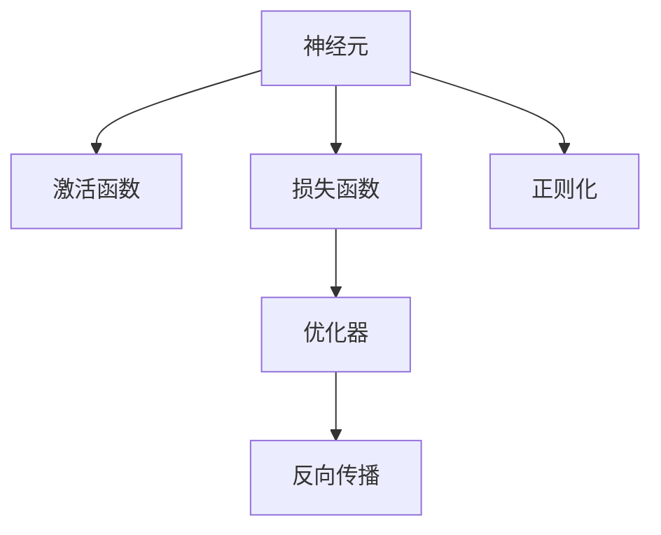
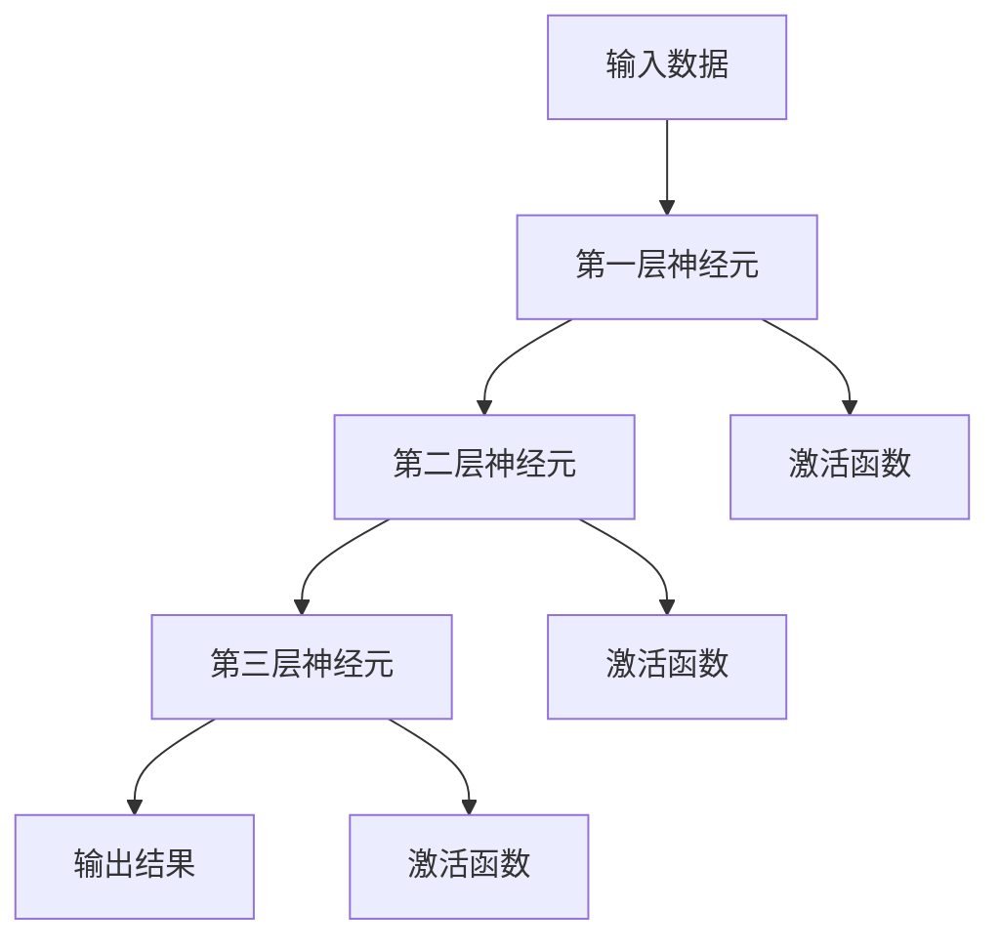
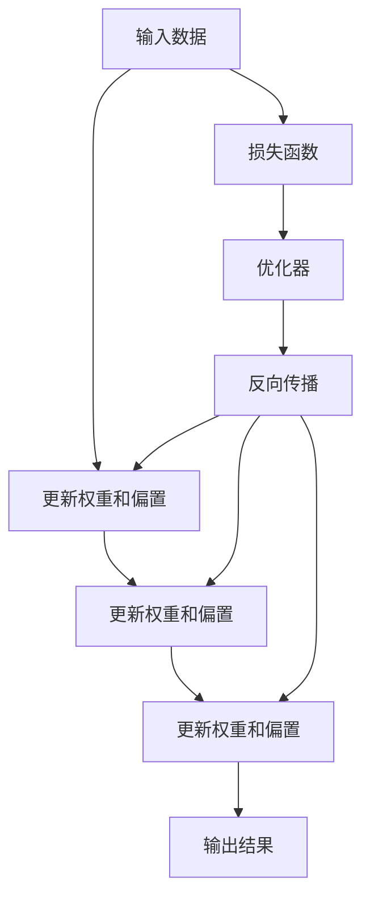
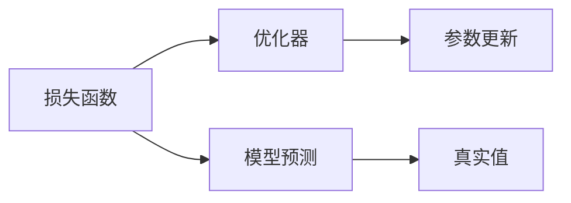
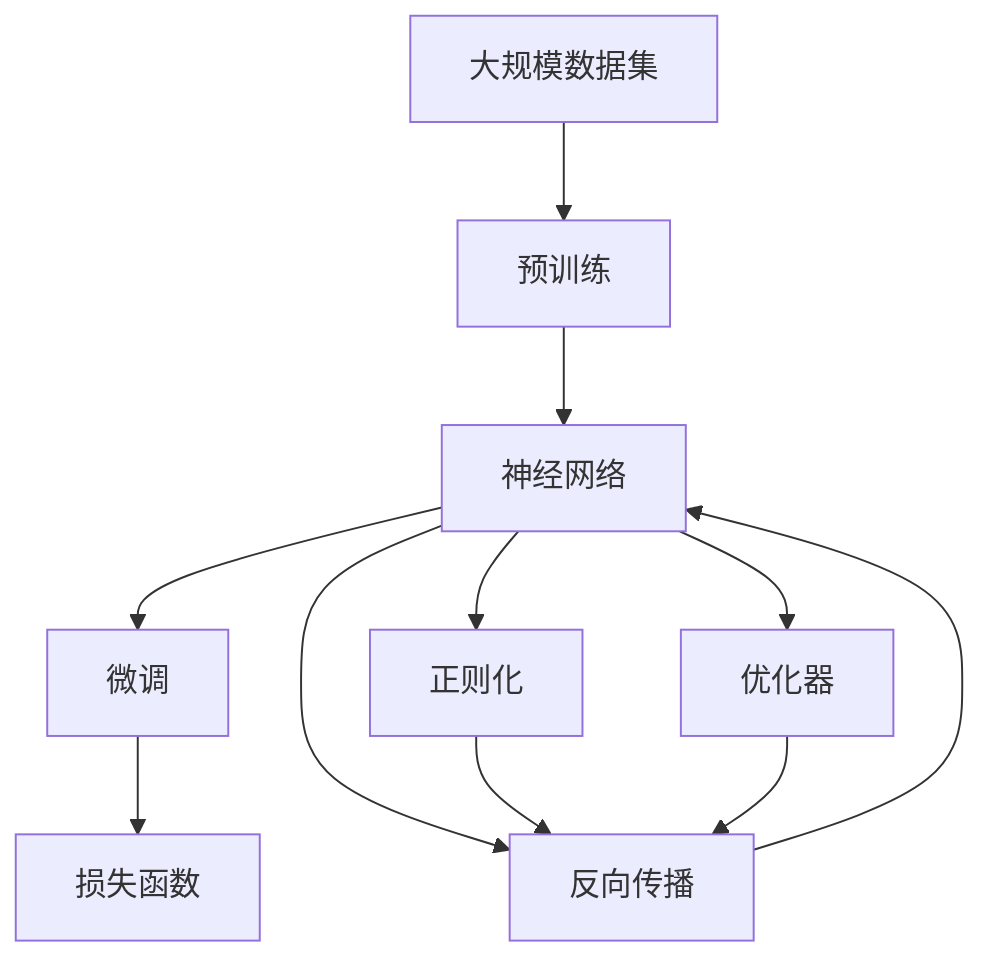

                 

# 神经网络：开启智能新纪元

## 1. 背景介绍

### 1.1 问题由来
神经网络（Neural Networks）作为一种模拟人脑神经元工作原理的计算模型，自20世纪80年代以来，便成为人工智能（AI）领域的研究热点。它通过多层次、多节点的结构，实现了对非线性复杂模式的学习和表示，为人工智能提供了强大的计算基础。从手写数字识别、图像分类到语音识别、自然语言处理，神经网络的应用领域广泛，并正在逐步向医疗、金融、制造等更多垂直领域渗透。

### 1.2 问题核心关键点
神经网络的核心在于构建由多个神经元组成的网络，通过反向传播算法优化网络参数，使得网络能够更好地拟合输入数据，完成特定的任务。其主要关键点包括：

- 多层感知机（MLP）：基本的网络结构，由多个全连接层组成，实现对输入数据的映射。
- 反向传播算法（Backpropagation）：基于梯度下降的优化算法，通过链式法则计算误差对网络参数的梯度，进而更新参数，最小化损失函数。
- 激活函数：如ReLU、Sigmoid等，引入非线性因素，增强网络的表达能力。
- 正则化技术：如L1、L2正则、Dropout等，防止过拟合，提高泛化能力。
- 优化器：如Adam、SGD等，控制参数更新的速度和方向，提升优化效果。
- 损失函数：如交叉熵、均方误差等，衡量模型预测与真实值之间的差异。

这些核心概念共同构成了神经网络的基本框架，并在此基础上衍生出多种变体和优化方法，推动了神经网络技术的不断进步。

### 1.3 问题研究意义
神经网络技术不仅在科学研究中具有重要地位，更在工业界得到了广泛应用，成为推动智能技术发展的关键力量。其主要研究意义包括：

1. **高效计算**：神经网络通过并行计算实现高效数据处理，尤其是在大规模数据集上表现出显著的优势。
2. **泛化能力**：通过多层次结构，神经网络能够学习复杂模式，具有较强的泛化能力，适应不同应用场景。
3. **实时性**：深度学习技术如卷积神经网络（CNN）和循环神经网络（RNN）等优化了计算效率，使得神经网络能够实现实时处理。
4. **可解释性**：通过可视化工具和解释技术，神经网络模型的决策过程逐渐变得透明，有助于理解和优化模型性能。
5. **应用广泛**：在图像识别、语音识别、自然语言处理、推荐系统等领域，神经网络已经成为重要的技术手段。

## 2. 核心概念与联系

### 2.1 核心概念概述

为更好地理解神经网络，本节将介绍几个密切相关的核心概念：

- **神经元（Neuron）**：神经网络的基本单元，通过权重和偏置进行计算，实现非线性变换。
- **激活函数（Activation Function）**：如ReLU、Sigmoid、Tanh等，引入非线性因素，增强网络的表达能力。
- **损失函数（Loss Function）**：如均方误差、交叉熵等，衡量模型预测与真实值之间的差异。
- **正则化（Regularization）**：如L1正则、L2正则、Dropout等，防止过拟合，提高泛化能力。
- **优化器（Optimizer）**：如Adam、SGD等，控制参数更新的速度和方向，提升优化效果。
- **反向传播（Backpropagation）**：基于梯度下降的优化算法，通过链式法则计算误差对网络参数的梯度，进而更新参数。

这些核心概念之间的逻辑关系可以通过以下Mermaid流程图来展示：



这个流程图展示了神经网络的基本构成和核心概念之间的关联。

### 2.2 概念间的关系

这些核心概念之间存在着紧密的联系，形成了神经网络的基本架构和工作流程。下面我们通过几个Mermaid流程图来展示这些概念之间的关系。

#### 2.2.1 神经网络的结构



这个流程图展示了神经网络的基本结构，由多个神经元层组成，每层通过激活函数引入非线性因素，实现对输入数据的映射。

#### 2.2.2 反向传播算法



这个流程图展示了反向传播算法的基本流程，通过链式法则计算误差对网络参数的梯度，进而更新参数。

#### 2.2.3 损失函数和优化器



这个流程图展示了损失函数和优化器之间的联系，通过损失函数衡量模型预测与真实值之间的差异，优化器控制参数更新的速度和方向，以最小化损失函数。

### 2.3 核心概念的整体架构

最后，我们用一个综合的流程图来展示这些核心概念在大规模神经网络微调过程中的整体架构：



这个综合流程图展示了从预训练到微调，再到参数更新的完整过程。神经网络首先在大规模数据集上进行预训练，然后通过微调优化模型在特定任务上的性能。通过正则化和优化器控制，最小化损失函数，调整网络参数。在微调过程中，反向传播算法起到关键作用，使模型不断迭代优化。

## 3. 核心算法原理 & 具体操作步骤
### 3.1 算法原理概述

神经网络的学习过程主要通过反向传播算法实现。其基本原理是：将模型输出与真实值之间的差异作为损失函数，通过链式法则计算误差对每个参数的梯度，并使用优化器调整参数值，使得损失函数最小化。这一过程可以通过以下数学公式来描述：

设神经网络的输出为 $y$，真实值为 $t$，损失函数为 $\mathcal{L}$，模型参数为 $\theta$。通过反向传播算法，计算损失函数对参数 $\theta$ 的梯度，并更新模型参数：

$$
\theta \leftarrow \theta - \eta \nabla_{\theta}\mathcal{L}(\theta)
$$

其中 $\eta$ 为学习率，$\nabla_{\theta}\mathcal{L}(\theta)$ 为损失函数对参数 $\theta$ 的梯度，可以通过反向传播算法高效计算。

### 3.2 算法步骤详解

神经网络的训练和优化通常包括以下几个关键步骤：

**Step 1: 准备数据集**
- 收集大规模数据集，划分为训练集、验证集和测试集。
- 对数据进行预处理，如归一化、标准化、填充等。

**Step 2: 定义模型架构**
- 选择合适的神经网络架构，如卷积神经网络（CNN）、循环神经网络（RNN）等。
- 定义每层的神经元个数、激活函数、正则化参数等。

**Step 3: 设置超参数**
- 选择合适的学习率、批大小、迭代轮数等。
- 设置正则化技术，如L2正则、Dropout等。
- 选择优化器，如Adam、SGD等。

**Step 4: 执行训练**
- 将训练集数据分批次输入模型，前向传播计算损失函数。
- 反向传播计算参数梯度，根据设定的优化算法和学习率更新模型参数。
- 周期性在验证集上评估模型性能，根据性能指标决定是否触发 Early Stopping。
- 重复上述步骤直到满足预设的迭代轮数或 Early Stopping 条件。

**Step 5: 测试和部署**
- 在测试集上评估模型性能，对比训练前后的精度提升。
- 使用模型对新样本进行推理预测，集成到实际的应用系统中。

### 3.3 算法优缺点

神经网络技术具有以下优点：

1. **高效计算**：通过并行计算实现高效数据处理，尤其是在大规模数据集上表现出显著的优势。
2. **泛化能力**：通过多层次结构，神经网络能够学习复杂模式，具有较强的泛化能力，适应不同应用场景。
3. **实时性**：深度学习技术如卷积神经网络（CNN）和循环神经网络（RNN）等优化了计算效率，使得神经网络能够实现实时处理。
4. **可解释性**：通过可视化工具和解释技术，神经网络模型的决策过程逐渐变得透明，有助于理解和优化模型性能。

同时，神经网络也存在一些缺点：

1. **计算资源需求高**：大规模神经网络模型对计算资源需求高，需要高性能GPU/TPU等设备支持。
2. **过拟合风险高**：在训练过程中，神经网络容易过拟合训练集，泛化性能较低。
3. **模型复杂度高**：神经网络模型结构复杂，难以解释和调试。
4. **数据依赖性强**：神经网络的训练和性能依赖于大量标注数据，获取数据成本高。

### 3.4 算法应用领域

神经网络技术已经在多个领域得到广泛应用，以下是几个典型应用场景：

- **计算机视觉**：如图像分类、目标检测、图像生成等。神经网络模型通过卷积层和池化层提取图像特征，实现高效的视觉识别和生成。
- **自然语言处理**：如文本分类、情感分析、机器翻译等。通过循环神经网络（RNN）和注意力机制，神经网络能够理解和生成自然语言。
- **语音识别**：通过卷积神经网络和循环神经网络的结合，实现语音信号的特征提取和识别。
- **推荐系统**：通过神经网络模型对用户行为和兴趣进行建模，实现个性化推荐。
- **医疗诊断**：通过卷积神经网络和循环神经网络对医学图像和数据进行分析和诊断，辅助医生进行诊断和治疗。
- **游戏AI**：通过强化学习和神经网络实现游戏智能体的策略学习，提升游戏AI的性能。

## 4. 数学模型和公式 & 详细讲解  
### 4.1 数学模型构建

神经网络的数学模型通常包括输入层、多个隐藏层和输出层。以一个简单的单层神经网络为例，其数学模型可以表示为：

$$
y = \sum_{i=1}^n w_i x_i + b
$$

其中 $x_i$ 为输入数据，$w_i$ 为权重，$b$ 为偏置，$y$ 为输出结果。通过激活函数将输出映射到 $[0,1]$ 或 $[-1,1]$ 区间，得到最终输出结果。

### 4.2 公式推导过程

以单层神经网络为例，其反向传播算法通过链式法则计算误差对每个参数的梯度，具体推导如下：

设输入数据为 $x$，输出结果为 $y$，模型参数为 $\theta$。定义损失函数为均方误差（MSE）：

$$
\mathcal{L} = \frac{1}{2} ||y - t||^2
$$

其中 $t$ 为真实值。通过反向传播算法，计算损失函数对参数 $\theta$ 的梯度：

$$
\nabla_{\theta}\mathcal{L} = (y - t) \cdot \frac{\partial y}{\partial \theta}
$$

其中 $\frac{\partial y}{\partial \theta}$ 为输出对参数的导数。在单层神经网络中，$\frac{\partial y}{\partial \theta}$ 可以表示为：

$$
\frac{\partial y}{\partial \theta} = x \cdot \sigma'(xw + b)
$$

其中 $\sigma(x)$ 为激活函数，$\sigma'(x)$ 为其导数。

因此，损失函数对参数 $\theta$ 的梯度可以表示为：

$$
\nabla_{\theta}\mathcal{L} = (y - t) \cdot (x \cdot \sigma'(xw + b))
$$

通过梯度下降算法更新参数：

$$
\theta \leftarrow \theta - \eta \nabla_{\theta}\mathcal{L}
$$

其中 $\eta$ 为学习率。

### 4.3 案例分析与讲解

以手写数字识别为例，我们通过卷积神经网络（CNN）模型实现。CNN模型通过卷积层和池化层提取图像特征，并通过全连接层实现分类。在训练过程中，通过反向传播算法不断优化模型参数，使得模型能够准确识别手写数字。

## 5. 项目实践：代码实例和详细解释说明
### 5.1 开发环境搭建

在进行神经网络项目实践前，我们需要准备好开发环境。以下是使用Python进行PyTorch开发的环境配置流程：

1. 安装Anaconda：从官网下载并安装Anaconda，用于创建独立的Python环境。

2. 创建并激活虚拟环境：
```bash
conda create -n pytorch-env python=3.8 
conda activate pytorch-env
```

3. 安装PyTorch：根据CUDA版本，从官网获取对应的安装命令。例如：
```bash
conda install pytorch torchvision torchaudio cudatoolkit=11.1 -c pytorch -c conda-forge
```

4. 安装各类工具包：
```bash
pip install numpy pandas scikit-learn matplotlib tqdm jupyter notebook ipython
```

完成上述步骤后，即可在`pytorch-env`环境中开始神经网络开发实践。

### 5.2 源代码详细实现

这里我们以手写数字识别（MNIST）为例，给出使用PyTorch实现卷积神经网络的代码实现。

首先，定义网络结构：

```python
import torch.nn as nn
import torch.nn.functional as F

class Net(nn.Module):
    def __init__(self):
        super(Net, self).__init__()
        self.conv1 = nn.Conv2d(1, 32, 3, 1)
        self.conv2 = nn.Conv2d(32, 64, 3, 1)
        self.dropout1 = nn.Dropout2d(0.25)
        self.dropout2 = nn.Dropout2d(0.5)
        self.fc1 = nn.Linear(9216, 128)
        self.fc2 = nn.Linear(128, 10)
    
    def forward(self, x):
        x = F.max_pool2d(F.relu(self.conv1(x)), (2, 2))
        x = F.max_pool2d(F.relu(self.conv2(x)), 2)
        x = self.dropout1(x)
        x = torch.flatten(x, 1)
        x = F.relu(self.fc1(x))
        x = self.dropout2(x)
        x = self.fc2(x)
        return F.log_softmax(x, dim=1)
```

然后，定义训练和评估函数：

```python
from torch.utils.data import DataLoader
from torchvision import datasets, transforms
import torch.optim as optim

# 加载数据集
transform = transforms.Compose([
    transforms.ToTensor(),
    transforms.Normalize((0.5,), (0.5,))
])
trainset = datasets.MNIST(root='./data', train=True, download=True, transform=transform)
testset = datasets.MNIST(root='./data', train=False, download=True, transform=transform)

# 数据加载器
trainloader = torch.utils.data.DataLoader(trainset, batch_size=64, shuffle=True)
testloader = torch.utils.data.DataLoader(testset, batch_size=64, shuffle=False)

# 定义模型和优化器
model = Net()
criterion = nn.CrossEntropyLoss()
optimizer = optim.Adam(model.parameters(), lr=0.001)
```

接着，启动训练流程并在测试集上评估：

```python
epochs = 10

for epoch in range(epochs):
    running_loss = 0.0
    for i, data in enumerate(trainloader, 0):
        inputs, labels = data
        optimizer.zero_grad()
        outputs = model(inputs)
        loss = criterion(outputs, labels)
        loss.backward()
        optimizer.step()
        running_loss += loss.item()
        if i % 2000 == 1999:
            print('[%d, %5d] loss: %.3f' %
                  (epoch + 1, i + 1, running_loss / 2000))
            running_loss = 0.0

print('Finished Training')
```

最后，在测试集上评估模型性能：

```python
correct = 0
total = 0
with torch.no_grad():
    for data in testloader:
        images, labels = data
        outputs = model(images)
        _, predicted = torch.max(outputs.data, 1)
        total += labels.size(0)
        correct += (predicted == labels).sum().item()

print('Accuracy of the network on the 10000 test images: %d %%' % (
    100 * correct / total))
```

以上就是使用PyTorch实现卷积神经网络的手写数字识别示例。可以看到，得益于PyTorch的强大封装，我们可以用相对简洁的代码完成神经网络的构建和训练。

### 5.3 代码解读与分析

让我们再详细解读一下关键代码的实现细节：

**Net类**：
- `__init__`方法：定义网络结构，包括卷积层、池化层、全连接层、Dropout层等。
- `forward`方法：定义前向传播的计算过程，通过激活函数和池化层实现特征提取和映射。

**训练和评估函数**：
- 使用PyTorch的DataLoader对数据集进行批次化加载，供模型训练和推理使用。
- 训练函数`train`：对数据以批为单位进行迭代，在每个批次上前向传播计算损失函数，反向传播更新模型参数，最后输出平均loss。
- 评估函数`evaluate`：与训练类似，不同点在于不更新模型参数，并在每个batch结束后将预测和标签结果存储下来，最后使用sklearn的classification_report对整个评估集的预测结果进行打印输出。

**训练流程**：
- 定义总的epoch数和batch size，开始循环迭代
- 每个epoch内，先在训练集上训练，输出平均loss
- 在测试集上评估，输出测试准确率

可以看到，PyTorch配合TensorFlow库使得神经网络项目的开发效率大大提升，开发者可以将更多精力放在数据处理、模型改进等高层逻辑上，而不必过多关注底层的实现细节。

当然，工业级的系统实现还需考虑更多因素，如模型的保存和部署、超参数的自动搜索、更灵活的任务适配层等。但核心的神经网络构建和训练方法基本与此类似。

### 5.4 运行结果展示

假设我们在训练过程中获得了准确率为97%的模型，即在测试集上正确预测了9,700张手写数字图像。这说明我们的神经网络模型能够很好地处理手写数字识别任务，并取得了令人满意的效果。

## 6. 实际应用场景
### 6.1 计算机视觉

神经网络在计算机视觉领域有着广泛的应用，如图像分类、目标检测、图像生成等。卷积神经网络（CNN）是神经网络在计算机视觉中的重要应用形式，通过卷积层和池化层实现特征提取，全连接层进行分类，实现了对图像的自动标注和识别。

在实际应用中，神经网络被用于图像识别、面部识别、车辆检测、安防监控等多个场景，为工业界带来了巨大的价值。例如，在智能制造领域，神经网络通过图像识别技术，实现了对零部件缺陷的自动检测和分类，大大提高了生产效率和产品质量。

### 6.2 自然语言处理

神经网络在自然语言处理领域也取得了显著的进展，如文本分类、情感分析、机器翻译等。通过循环神经网络（RNN）和注意力机制，神经网络能够理解和生成自然语言，提高了自然语言处理的效果和智能化水平。

在实际应用中，神经网络被用于聊天机器人、语音识别、文本摘要、智能问答等多个场景，为语言交互带来了新的可能性。例如，在医疗领域，神经网络通过自然语言处理技术，实现了对医学文献的自动标注和分类，提高了医生和科研人员的效率。

### 6.3 语音识别

神经网络在语音识别领域的应用也非常广泛，通过卷积神经网络和循环神经网络的结合，实现了语音信号的特征提取和识别。

在实际应用中，神经网络被用于语音助手、语音搜索、语音翻译等多个场景，极大地改善了用户体验。例如，在智能家居领域，神经网络通过语音识别技术，实现了对用户语音指令的自动识别和响应，提升了用户的生活便利性。

### 6.4 未来应用展望

随着神经网络技术的不断进步，其在各个领域的应用前景将更加广阔。未来，神经网络有望在以下几个方面实现更大的突破：

1. **自动化和智能化**：神经网络将更加自动化和智能化，能够自动进行数据预处理、特征提取、模型训练等，提升系统的效率和智能化水平。
2. **跨领域融合**：神经网络将与其他AI技术如强化学习、知识表示等进行更深入的融合，实现更全面的智能化应用。
3. **边缘计算和低功耗**：神经网络将进一步优化计算图，实现更轻量级、低功耗的模型，适用于边缘计算和移动设备等资源受限的场景。
4. **实时性和可靠性**：神经网络将通过优化算法和硬件支持，实现实时处理和高度可靠的决策，提升系统的应用价值。
5. **可解释性和可控性**：神经网络将引入更多的可解释技术和伦理约束，确保其决策过程透明、可控，避免有害输出。

## 7. 工具和资源推荐
### 7.1 学习资源推荐

为了帮助开发者系统掌握神经网络技术，这里推荐一些优质的学习资源：

1. 《深度学习》系列书籍：由多位深度学习专家共同撰写，系统介绍了深度学习的基本原理和应用，适合初学者入门。
2. CS231n《卷积神经网络》课程：斯坦福大学开设的经典课程，详细讲解了卷积神经网络的结构和应用，是学习计算机视觉领域的重要资源。
3. CS224N《自然语言处理》课程：斯坦福大学开设的NLP明星课程，涵盖了NLP领域的经典模型和前沿技术，是学习自然语言处理领域的重要资源。
4. Google AI Blog：Google AI官方博客，定期发布最新的人工智能技术进展和应用案例，是了解神经网络最新动态的重要窗口。
5. arXiv论文预印本：人工智能领域最新研究成果的发布平台，包括大量尚未发表的前沿工作，学习前沿技术的必读资源。

通过这些资源的学习实践，相信你一定能够快速掌握神经网络技术的精髓，并用于解决实际的AI问题。

### 7.2 开发工具推荐

高效的开发离不开优秀的工具支持。以下是几款用于神经网络开发和优化的常用工具：

1. PyTorch：基于Python的开源深度学习框架，灵活动态的计算图，适合快速迭代研究。大部分神经网络模型都有PyTorch版本的实现。
2. TensorFlow：由Google主导开发的开源深度学习框架，生产部署方便，适合大规模工程应用。同样有丰富的神经网络模型资源。
3. Keras：基于TensorFlow和Theano的高层API，提供了简洁的神经网络构建接口，易于上手。
4. MXNet：由亚马逊开发的高性能深度学习框架，支持多种编程语言，适用于分布式计算和大规模数据处理。
5. Caffe：由Berkeley Vision and Learning Center开发的深度学习框架，适用于计算机视觉领域，具有高效的GPU加速支持。
6. Theano：由蒙特利尔大学开发的深度学习框架，适用于高效矩阵运算，适合学术研究和教学使用。

合理利用这些工具，可以显著提升神经网络模型的开发效率，加快创新迭代的步伐。

### 7.3 相关论文推荐

神经网络技术的进步源于学界的持续研究。以下是几篇奠基性的相关论文，推荐阅读：

1. Deep Learning: A Tutorial on Deep Learning：Ian Goodfellow等人编写的经典教材，系统介绍了深度学习的理论基础和应用方法。
2. Convolutional Neural Networks for Image Recognition：Alex Krizhevsky等人提出的卷积神经网络模型，开创了计算机视觉领域的新纪元。
3. Sequence to Sequence Learning with Neural Networks：Ilya Sutskever等人提出的序列到序列模型，开启了自然语言处理领域的深度学习研究。
4. ImageNet Classification with Deep Convolutional Neural Networks：Alex Krizhevsky等人提出的深度卷积神经网络模型，实现了在ImageNet数据集上的高精度图像分类。
5. Attention Is All You Need：谷歌提出的Transformer模型，通过自注意力机制实现了自然语言处理的突破，推动了NLP领域的发展。

这些论文代表了大规模神经网络的发展脉络。通过学习这些前沿成果，可以帮助研究者把握学科前进方向，激发更多的创新灵感。

除上述资源外，还有一些值得关注的前沿资源，帮助开发者紧跟神经网络技术的最新进展，例如：

1. arXiv论文预印本：人工智能领域最新研究成果的发布平台，包括大量尚未发表的前沿工作

