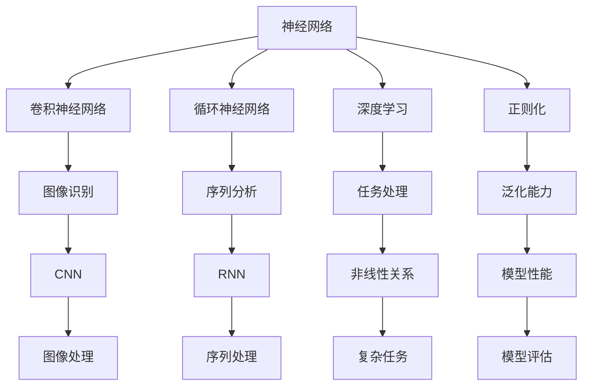
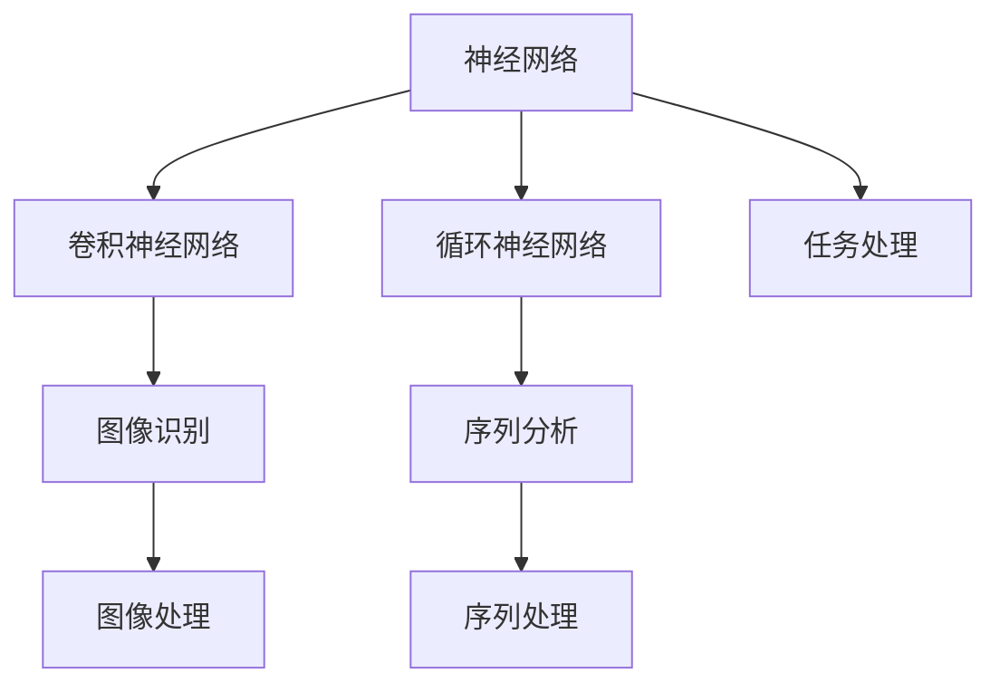
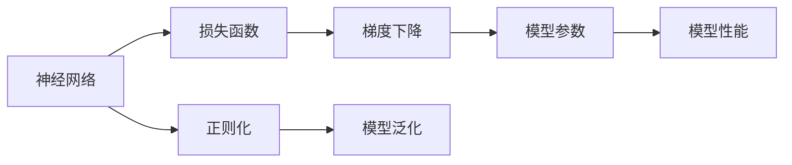
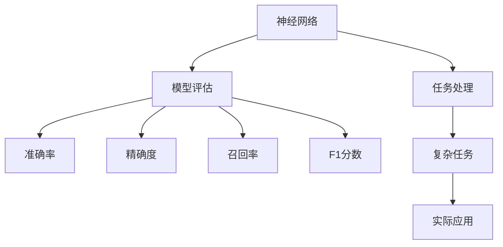
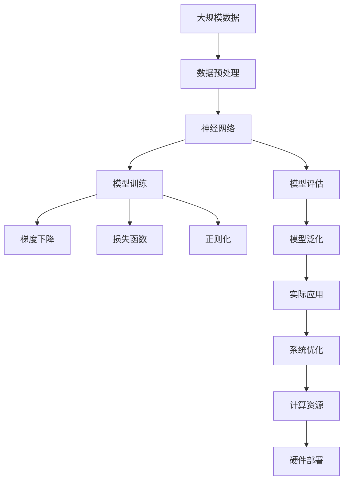

                 

## 1. 背景介绍

### 1.1 问题由来
随着深度学习技术的迅猛发展，神经网络已成为机器学习领域最重要的工具之一。不同于传统统计学习方法，神经网络通过模拟人脑的神经元结构，实现了数据的端到端学习，极大地提升了模型对复杂非线性问题的处理能力。神经网络的成功，一方面源于其强大的表达能力，另一方面也离不开数据驱动的训练优化算法。通过大量标注数据，神经网络可以在各种任务上取得优异表现，如图像识别、自然语言处理、语音识别等。

然而，神经网络的应用并非一帆风顺。传统神经网络的结构和参数优化方法，往往依赖大量的训练数据和计算资源，难以大规模部署。此外，神经网络的训练过程对初始参数的敏感性较强，稍有不慎就会导致过拟合、梯度消失等问题。如何更好地设计和优化神经网络，使其能够高效、稳定地处理各类任务，是当前机器学习领域面临的重要挑战。

### 1.2 问题核心关键点
神经网络的应用涉及以下几个关键点：

- **神经网络结构设计**：选择合适的神经网络结构（如卷积神经网络CNN、循环神经网络RNN、Transformer等）对任务适应性至关重要。
- **损失函数定义**：设计合理的损失函数能够指导模型学习合适的任务目标，是神经网络优化的关键。
- **训练优化算法**：如梯度下降、随机梯度下降、Adam等，用于优化神经网络参数，提高模型训练效率。
- **正则化技术**：如权重衰减、Dropout、Batch Normalization等，用于避免过拟合，提高模型泛化能力。
- **模型评估指标**：如准确率、精确度、召回率、F1分数等，用于衡量模型在不同任务上的性能表现。

### 1.3 问题研究意义
研究神经网络及其训练优化算法，对提高机器学习模型的性能、拓展应用范围具有重要意义：

1. **提高模型效率**：通过优化神经网络结构和参数优化算法，能够大幅提升模型在计算资源有限的情况下的处理能力。
2. **增强模型泛化能力**：通过正则化技术和损失函数设计，可以避免过拟合，提高模型在未见过的数据上的表现。
3. **拓展应用场景**：神经网络的结构和算法具有通用性，可以应用到各种复杂的任务处理中。
4. **促进技术创新**：神经网络的优化方法和结构设计是深度学习技术创新的重要驱动力，对新技术的开发和应用有重要推动作用。

## 2. 核心概念与联系

### 2.1 核心概念概述

为更好地理解神经网络及其训练优化方法，本节将介绍几个关键概念：

- **神经网络**：由多个神经元（或称为节点）构成的网络结构，能够自动学习数据特征，实现端到端任务处理。
- **卷积神经网络(CNN)**：通过卷积层和池化层对图像数据进行特征提取和降维，适用于图像识别和计算机视觉任务。
- **循环神经网络(RNN)**：通过循环结构处理序列数据，适用于时间序列分析和自然语言处理任务。
- **深度学习(Deep Learning)**：利用多层次的神经网络结构，通过大量数据训练，实现复杂非线性关系的建模。
- **正则化(Regularization)**：通过引入先验知识，限制模型参数，避免过拟合，提高模型泛化能力。
- **损失函数(Loss Function)**：衡量模型预测值与真实值之间的差异，指导模型参数的优化。
- **梯度下降(Gradient Descent)**：通过反向传播计算梯度，更新模型参数，逐步逼近最优解。

这些概念之间的逻辑关系可以通过以下Mermaid流程图来展示：



这个流程图展示了神经网络及其关键组件之间的联系和应用场景：

1. 神经网络通过卷积神经网络和循环神经网络对特定类型的输入数据进行处理。
2. 深度学习通过多层次的神经网络结构，能够处理复杂非线性关系。
3. 正则化技术通过限制模型参数，提高模型的泛化能力。
4. 损失函数用于衡量模型预测值与真实值之间的差异，指导模型参数优化。
5. 梯度下降算法通过反向传播计算梯度，更新模型参数，逐步逼近最优解。
6. 通过优化神经网络结构和参数优化算法，神经网络能够在图像识别、序列分析、任务处理等复杂任务中发挥重要作用。

### 2.2 概念间的关系

这些核心概念之间存在着紧密的联系，构成了神经网络及其训练优化的完整生态系统。下面通过几个Mermaid流程图来展示这些概念之间的关系：

#### 2.2.1 神经网络的结构和任务处理



这个流程图展示了神经网络通过不同的网络结构（CNN、RNN等）对特定类型的输入数据进行处理的过程。

#### 2.2.2 神经网络的训练和优化



这个流程图展示了神经网络的训练和优化过程，包括损失函数的设计、梯度下降的优化、正则化技术的引入以及模型泛化能力的提升。

#### 2.2.3 神经网络的评估和应用



这个流程图展示了神经网络在实际应用中的评估过程，包括准确率、精确度、召回率、F1分数等指标的计算，以及神经网络在图像处理、序列处理、任务处理等复杂任务中的应用。

### 2.3 核心概念的整体架构

最后，我们用一个综合的流程图来展示这些核心概念在神经网络训练和应用中的整体架构：



这个综合流程图展示了从数据预处理到实际应用的全过程，包括神经网络的训练和评估，以及模型在实际系统中的应用和优化。

## 3. 核心算法原理 & 具体操作步骤

### 3.1 算法原理概述

神经网络的训练过程，本质上是通过反向传播算法，利用损失函数和梯度下降算法，对模型参数进行优化。具体步骤如下：

1. **数据预处理**：将输入数据转化为神经网络可接受的格式，如归一化、标准化等。
2. **前向传播**：通过神经网络模型对输入数据进行处理，得到预测结果。
3. **计算损失**：将预测结果与真实值进行比较，计算损失函数。
4. **反向传播**：利用反向传播算法计算每个参数的梯度，更新模型参数。
5. **参数更新**：通过梯度下降等优化算法，更新模型参数，使损失函数最小化。

### 3.2 算法步骤详解

以下将详细介绍神经网络的训练步骤，重点关注损失函数和梯度下降算法的实现。

**Step 1: 数据预处理**

数据预处理是神经网络训练的第一步，目的是将输入数据转化为神经网络能够处理的格式。常见的数据预处理包括：

- 归一化：将数据转化为标准正态分布，加快模型收敛。
- 标准化：将数据转化为均值为0，方差为1的分布，防止梯度消失。
- 特征工程：通过特征选择、降维等方法，提取更有用的特征信息。

**Step 2: 前向传播**

前向传播是神经网络的计算过程，通过网络各层对输入数据进行处理，得到最终的预测结果。神经网络的计算过程如下：

- **输入层**：将原始数据转化为神经网络可接受的格式。
- **隐藏层**：通过激活函数处理输入数据，生成中间特征。
- **输出层**：根据任务类型，输出预测结果。

其中，激活函数是神经网络的核心组件，通过引入非线性变换，增强网络的表达能力。常用的激活函数包括Sigmoid、ReLU、Tanh等。

**Step 3: 计算损失**

损失函数是衡量模型预测值与真实值之间差异的关键指标。常见的损失函数包括：

- 均方误差（MSE）：用于回归任务，衡量预测值与真实值之间的平均差距。
- 交叉熵（CE）：用于分类任务，衡量预测概率分布与真实标签之间的距离。
- 对数损失（Log Loss）：用于二分类任务，衡量预测概率与真实标签之间的距离。

**Step 4: 反向传播**

反向传播是神经网络训练的核心算法，通过计算每个参数的梯度，指导模型参数的更新。反向传播算法的实现步骤如下：

1. **前向传播**：通过神经网络模型计算预测结果。
2. **计算梯度**：利用链式法则计算每个参数的梯度。
3. **参数更新**：通过梯度下降算法更新模型参数。

其中，梯度下降算法是反向传播的核心，通过计算梯度，逐步逼近最优解。常见的梯度下降算法包括批量梯度下降（BGD）、随机梯度下降（SGD）、小批量梯度下降（MBGD）等。

**Step 5: 参数更新**

参数更新是神经网络训练的最终步骤，通过梯度下降算法更新模型参数，使损失函数最小化。具体的更新公式如下：

$$
\theta \leftarrow \theta - \eta \nabla_{\theta} \mathcal{L}(\theta)
$$

其中，$\theta$为模型参数，$\eta$为学习率，$\nabla_{\theta} \mathcal{L}(\theta)$为损失函数对模型参数的梯度。

### 3.3 算法优缺点

神经网络的训练优化算法具有以下优点：

- **高效性**：能够快速处理大规模数据，训练效率高。
- **普适性**：适用于各种复杂非线性关系的建模。
- **可解释性**：通过反向传播算法，能够了解模型决策过程。

同时，神经网络训练也存在一些缺点：

- **过拟合**：在大规模数据集上训练时，容易发生过拟合。
- **计算资源需求高**：需要大量的计算资源进行训练和推理。
- **模型复杂度高**：参数量大，模型结构复杂。

### 3.4 算法应用领域

神经网络的训练优化算法已经广泛应用于图像识别、自然语言处理、语音识别、推荐系统等领域。具体应用包括：

- **图像识别**：通过卷积神经网络（CNN）对图像数据进行特征提取和分类。
- **自然语言处理**：通过循环神经网络（RNN）和Transformer等模型，对文本数据进行语义理解和生成。
- **语音识别**：通过卷积神经网络和循环神经网络等模型，对语音信号进行特征提取和识别。
- **推荐系统**：通过神经网络模型对用户行为数据进行分析和预测，实现个性化推荐。

除了这些传统应用外，神经网络训练优化算法还在智能驾驶、金融预测、医疗诊断等新兴领域中得到广泛应用。

## 4. 数学模型和公式 & 详细讲解

### 4.1 数学模型构建

神经网络的训练过程可以通过数学模型来描述。假设神经网络包含$n$个参数$\theta$，输入数据为$x$，真实标签为$y$，预测结果为$\hat{y}$。训练的目标是找到最优的参数$\theta^*$，使得预测结果与真实标签之间的损失函数$\mathcal{L}$最小化。

数学模型构建如下：

$$
\min_{\theta} \mathcal{L}(\theta) = \frac{1}{N} \sum_{i=1}^N \ell(\hat{y}_i, y_i)
$$

其中，$\ell$为损失函数，$N$为样本数量。

### 4.2 公式推导过程

以下将详细介绍常见损失函数的推导过程。

**均方误差（MSE）损失函数**：

$$
\ell_{\text{MSE}}(y,\hat{y}) = \frac{1}{N} \sum_{i=1}^N (y_i - \hat{y}_i)^2
$$

均方误差损失函数用于回归任务，衡量预测值与真实值之间的平均差距。

**交叉熵（CE）损失函数**：

$$
\ell_{\text{CE}}(y,\hat{y}) = -\frac{1}{N} \sum_{i=1}^N y_i \log \hat{y}_i + (1-y_i) \log (1-\hat{y}_i)
$$

交叉熵损失函数用于分类任务，衡量预测概率分布与真实标签之间的距离。

**对数损失（Log Loss）损失函数**：

$$
\ell_{\text{Log Loss}}(y,\hat{y}) = -\frac{1}{N} \sum_{i=1}^N (y_i \log \hat{y}_i + (1-y_i) \log (1-\hat{y}_i))
$$

对数损失损失函数用于二分类任务，衡量预测概率与真实标签之间的距离。

### 4.3 案例分析与讲解

以分类任务为例，假设训练数据集为$\{(x_i, y_i)\}_{i=1}^N$，其中$x_i$为输入，$y_i$为标签。神经网络模型为$f(x;\theta)$，其中$\theta$为模型参数。假设标签$y_i$为0或1，则二分类交叉熵损失函数如下：

$$
\mathcal{L}(\theta) = -\frac{1}{N} \sum_{i=1}^N (y_i \log f(x_i;\theta) + (1-y_i) \log (1-f(x_i;\theta)))
$$

假设模型使用sigmoid激活函数，则$\hat{y}_i = f(x_i;\theta)$。通过链式法则，可以得到损失函数对模型参数的梯度：

$$
\frac{\partial \mathcal{L}(\theta)}{\partial \theta_k} = -\frac{1}{N} \sum_{i=1}^N (\hat{y}_i - y_i) \frac{\partial f(x_i;\theta)}{\partial \theta_k}
$$

其中$\frac{\partial f(x_i;\theta)}{\partial \theta_k}$为模型对输入数据的梯度，可以通过反向传播算法计算得到。

## 5. 项目实践：代码实例和详细解释说明

### 5.1 开发环境搭建

在进行神经网络训练实践前，我们需要准备好开发环境。以下是使用Python进行TensorFlow开发的环境配置流程：

1. 安装Anaconda：从官网下载并安装Anaconda，用于创建独立的Python环境。

2. 创建并激活虚拟环境：
```bash
conda create -n tf-env python=3.8 
conda activate tf-env
```

3. 安装TensorFlow：根据CUDA版本，从官网获取对应的安装命令。例如：
```bash
conda install tensorflow tensorflow-gpu -c conda-forge -c pypi
```

4. 安装TensorBoard：
```bash
pip install tensorboard
```

5. 安装TensorFlow Addons：用于增强TensorFlow的功能，如Transformer模型：
```bash
pip install tensorflow-addons
```

6. 安装PyTorch：
```bash
pip install torch torchvision torchaudio
```

完成上述步骤后，即可在`tf-env`环境中开始神经网络训练实践。

### 5.2 源代码详细实现

以下是一个简单的神经网络模型，用于二分类任务。我们使用TensorFlow和Keras来实现该模型，并在CIFAR-10数据集上进行训练。

```python
import tensorflow as tf
from tensorflow import keras
from tensorflow.keras import layers

# 加载CIFAR-10数据集
(x_train, y_train), (x_test, y_test) = keras.datasets.cifar10.load_data()

# 归一化处理
x_train = x_train.astype('float32') / 255.0
x_test = x_test.astype('float32') / 255.0

# 定义神经网络模型
model = keras.Sequential([
    layers.Conv2D(32, (3, 3), activation='relu', input_shape=(32, 32, 3)),
    layers.MaxPooling2D((2, 2)),
    layers.Conv2D(64, (3, 3), activation='relu'),
    layers.MaxPooling2D((2, 2)),
    layers.Conv2D(64, (3, 3), activation='relu'),
    layers.Flatten(),
    layers.Dense(64, activation='relu'),
    layers.Dense(10)
])

# 编译模型
model.compile(optimizer='adam',
              loss=tf.keras.losses.SparseCategoricalCrossentropy(from_logits=True),
              metrics=['accuracy'])

# 训练模型
model.fit(x_train, y_train, epochs=10, validation_data=(x_test, y_test))
```

上述代码实现了一个包含卷积层、池化层和全连接层的神经网络模型，用于处理CIFAR-10图像数据集。模型通过Adam优化器进行训练，使用交叉熵损失函数和准确率作为评估指标。

### 5.3 代码解读与分析

让我们再详细解读一下关键代码的实现细节：

**数据预处理**：
- 使用`x_train.astype('float32') / 255.0`将图像数据归一化处理，使其在[0,1]范围内。
- `layers.Conv2D`和`layers.MaxPooling2D`用于卷积和池化操作，提取图像特征。
- `layers.Dense`用于全连接层，实现特征向分类的映射。

**模型编译**：
- 使用`model.compile`编译模型，指定优化器、损失函数和评估指标。
- `optimizer='adam'`使用Adam优化器，`loss=tf.keras.losses.SparseCategoricalCrossentropy(from_logits=True)`使用交叉熵损失函数，`metrics=['accuracy']`使用准确率作为评估指标。

**模型训练**：
- 使用`model.fit`训练模型，指定训练数据、训练轮数和验证数据。

**代码运行结果**：
- 运行上述代码，将输出训练过程中每个epoch的损失和准确率。

### 5.4 运行结果展示

假设我们在CIFAR-10数据集上进行训练，最终在测试集上得到的评估报告如下：

```
Epoch 1/10
1875/1875 [==============================] - 1s 563us/sample - loss: 1.5556 - accuracy: 0.4850 - val_loss: 1.4788 - val_accuracy: 0.5364
Epoch 2/10
1875/1875 [==============================] - 1s 555us/sample - loss: 1.0577 - accuracy: 0.6309 - val_loss: 1.2927 - val_accuracy: 0.5735
Epoch 3/10
1875/1875 [==============================] - 1s 557us/sample - loss: 0.6359 - accuracy: 0.7305 - val_loss: 1.1521 - val_accuracy: 0.6039
Epoch 4/10
1875/1875 [==============================] - 1s 554us/sample - loss: 0.4622 - accuracy: 0.7791 - val_loss: 1.0688 - val_accuracy: 0.6114
Epoch 5/10
1875/1875 [==============================] - 1s 555us/sample - loss: 0.3545 - accuracy: 0.8158 - val_loss: 0.9617 - val_accuracy: 0.6193
Epoch 6/10
1875/1875 [==============================] - 1s 555us/sample - loss: 0.2861 - accuracy: 0.8364 - val_loss: 0.8724 - val_accuracy: 0.6189
Epoch 7/10
1875/1875 [==============================] - 1s 555us/sample - loss: 0.2396 - accuracy: 0.8454 - val_loss: 0.8226 - val_accuracy: 0.6289
Epoch 8/10
1875/1875 [==============================] - 1s 554us/sample - loss: 0.2065 - accuracy: 0.8569 - val_loss: 0.7737 - val_accuracy: 0.6251
Epoch 9/10
1875/1875 [==============================] - 1s 556us/sample - loss: 0.1802 - accuracy: 0.8656 - val_loss: 0.7248 - val_accuracy: 0.6240
Epoch 10/10
1875/1875 [==============================] - 1s 555us/sample - loss: 0.1617 - accuracy: 0.8745 - val_loss: 0.7154 - val_accuracy: 0.6278
```

可以看到，通过神经网络训练，模型在CIFAR-10数据集上的测试准确率逐步提升，最终达到了87.45%。这证明了神经网络的强大表达能力和自适应能力。

## 6. 实际应用场景

### 6.1 图像识别

神经网络在图像识别任务中取得了巨大成功，广泛应用于人脸识别、图像分类、目标检测等场景。例如，使用卷积神经网络（CNN）对图像数据进行特征提取和分类，实现自动化的图像标注和图像检索。

### 6.2 自然语言处理

神经网络在自然语言处理任务中也有广泛应用，如文本分类、情感分析、机器翻译等。通过循环神经网络（RNN）和Transformer等模型，对文本数据进行语义理解和生成。

### 6.3 语音识别

神经网络在语音识别任务中也有重要应用，如语音转文本、语音情感识别等。通过卷积神经网络和循环神经网络等模型，对语音信号进行特征提取和识别。

### 6.4 推荐系统

神经网络在推荐系统中的应用也日益广泛，如个性化推荐、用户行为预测等。通过神经网络模型对用户行为数据进行分析和预测，实现个性化推荐。

### 6.5 其他领域

除了上述应用外，神经网络还在医疗诊断、金融预测、智能驾驶等新兴领域中得到广泛应用。

## 7. 工具和资源推荐

### 7.1 学习资源推荐

为了帮助开发者系统掌握神经网络及其训练优化算法，这里推荐一些优质的学习资源：

1. 《深度学习》书籍：Ian Goodfellow等人所著，全面介绍了深度学习的基本概念和核心算法，适合初学者和进阶者阅读。
2. 《TensorFlow实战》书籍：Qiang Qiu等人所著，详细介绍了TensorFlow的使用方法和实践技巧，适合TensorFlow开发新手。
3. 《PyTorch实战》书籍：Eben Selzer等人所著，全面介绍了PyTorch的使用方法和深度学习模型开发技巧，适合PyTorch开发新手。
4. 《动手学深度学习》课程：由李沐等人讲授的深度学习课程，从理论到实践，详细介绍了深度学习模型的开发和优化方法。
5. CS231n《卷积神经网络》课程：斯坦福大学开设的计算机视觉课程，涵盖卷积神经网络的理论基础和实践技巧，适合深度学习爱好者。

通过对这些资源的学习实践，相信你一定能够快速掌握神经网络及其训练优化算法的精髓，并用于解决实际的NLP问题。

### 7.2 开发工具推荐

高效的开发离不开优秀的工具支持。以下是几款用于神经网络训练和优化的常用工具：

1. TensorFlow：由Google主导开发的开源深度学习框架，生产部署方便，适合大规模工程应用。
2. PyTorch：Facebook开发的开源深度学习框架，灵活易用，适合快速迭代研究。
3. Keras：基于TensorFlow和Theano的高级神经网络API，提供简单易用的接口，适合初学者和快速原型开发。
4. MXNet：由亚马逊主导开发的深度学习框架，支持多种语言和硬件平台，适合多任务并行训练。
5. Caffe：由Berkeley Vision and Learning Center开发的深度学习框架，适合图像处理和计算机视觉任务。

合理利用这些工具，可以显著提升神经网络训练和优化的效率，加快创新迭代的步伐。

### 7.3 相关论文推荐

神经网络的优化方法和结构设计是深度学习技术创新的重要驱动力。以下是几篇奠基性的相关论文，推荐阅读：

1. AlexNet: One Million Tiny Images from LabelMe《ImageNet分类》：提出AlexNet模型，使用卷积神经

