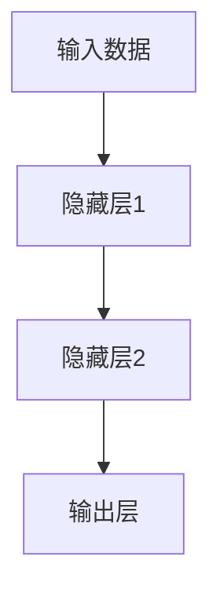

                 

# 神经网络：机器学习的新范式

## 1. 背景介绍

在机器学习领域，传统的基于统计模型和特征工程的方法逐渐被以神经网络为代表的黑盒学习模型所取代。神经网络通过模拟人脑神经元的工作原理，从数据中直接学习特征表示，实现了端到端的自动化特征提取和模型构建，具有显著的泛化能力和表现力。本文将深入探讨神经网络的原理、算法和应用，并给出项目实践案例，帮助读者系统理解神经网络这一新范式的魅力。

## 2. 核心概念与联系

### 2.1 核心概念概述

神经网络（Neural Network, NN）是由人工神经元（或称神经元）连接而成的一种计算模型，是模拟人脑神经网络的结构和功能而设计出来的。神经网络的核心思想是，通过大量神经元的互相连接和传递信息，实现复杂的非线性映射和决策过程。

### 2.2 核心概念之间的关系

神经网络包括输入层、隐藏层和输出层，每一层由多个神经元组成，层与层之间通过权值连接。神经元通过激活函数对输入信号进行加权求和和非线性变换，将原始输入映射到更高维度的表示空间。隐藏层是神经网络的核心，负责提取和抽象输入数据的高级特征。输出层则根据隐藏层的特征表示，预测出具体的输出结果。

以下是一个简单神经网络的示意图：


### 2.3 核心概念的整体架构

神经网络的整体架构可以分为两个部分：前向传播和反向传播。前向传播用于计算网络的输出，而反向传播则用于更新网络的参数，使输出尽可能接近真实标签。

以下是一个神经网络前向传播的示意图：



## 3. 核心算法原理 & 具体操作步骤

### 3.1 算法原理概述

神经网络的训练过程通常包括两个阶段：前向传播和反向传播。前向传播用于计算网络的输出，而反向传播则用于更新网络的参数，使输出尽可能接近真实标签。神经网络的训练目标是，通过最小化损失函数，使得网络在新的输入上能够产生准确的输出。

神经网络的损失函数通常包括交叉熵损失、均方误差损失等，用于衡量模型输出与真实标签之间的差异。训练过程采用梯度下降等优化算法，通过反向传播计算损失函数对网络参数的梯度，并按照梯度方向更新参数，从而使损失函数最小化。

### 3.2 算法步骤详解

神经网络的训练过程主要包括以下几个步骤：

1. **数据准备**：收集训练数据集，并将数据集划分为训练集、验证集和测试集。
2. **模型定义**：定义神经网络的结构，包括输入层、隐藏层和输出层的神经元数、激活函数等。
3. **模型初始化**：随机初始化网络参数，包括权重和偏置。
4. **前向传播**：将训练数据输入网络，计算输出结果。
5. **计算损失**：计算输出结果与真实标签之间的损失，通常采用交叉熵损失或均方误差损失。
6. **反向传播**：通过链式法则计算损失函数对网络参数的梯度，并将梯度反向传播到各层。
7. **参数更新**：根据梯度方向和优化算法（如梯度下降、Adam等）更新网络参数。
8. **验证与测试**：在验证集和测试集上评估模型性能，选择最优模型。

### 3.3 算法优缺点

神经网络具有以下优点：

- **强大的非线性拟合能力**：神经网络通过多层隐藏层的非线性变换，可以拟合复杂的非线性关系，实现更精确的预测。
- **自动特征提取**：神经网络可以自动学习输入数据的特征表示，无需手工设计特征工程，减少工作量。
- **端到端训练**：神经网络采用端到端训练方式，从原始输入直接到输出，避免了中间特征的冗余表示。
- **鲁棒性**：神经网络可以适应一定程度的噪声和扰动，具有较强的鲁棒性。

同时，神经网络也存在以下缺点：

- **过拟合风险**：神经网络具有较强的拟合能力，容易出现过拟合现象，特别是在训练数据量不足的情况下。
- **计算资源消耗大**：神经网络通常需要大量的计算资源，包括内存、显存、计算时间等，对硬件要求较高。
- **模型复杂度较高**：神经网络结构复杂，参数较多，训练和调试过程较为繁琐。

### 3.4 算法应用领域

神经网络在多个领域中得到了广泛应用，包括但不限于以下几个方面：

- **计算机视觉**：如图像分类、目标检测、图像分割等任务，通过卷积神经网络（CNN）进行图像处理和特征提取。
- **自然语言处理**：如语言建模、文本分类、情感分析等任务，通过循环神经网络（RNN）或Transformer等模型进行语言处理和特征表示。
- **语音识别**：通过卷积神经网络或递归神经网络（RNN）进行语音信号的处理和特征提取。
- **时间序列预测**：如股票价格预测、天气预测等任务，通过时间序列神经网络进行时间序列数据的处理和预测。
- **推荐系统**：如协同过滤、商品推荐等任务，通过神经网络进行用户兴趣的建模和推荐。

## 4. 数学模型和公式 & 详细讲解

### 4.1 数学模型构建

神经网络的数学模型通常包括前向传播和反向传播两个过程。以下是一个简单的神经网络的前向传播和反向传播的数学模型。

假设神经网络包含 $L$ 层，第 $l$ 层的神经元数为 $n_l$，激活函数为 $f(\cdot)$，输入数据为 $x$，目标输出为 $y$，则前向传播和反向传播的数学模型如下：

- 前向传播：
  $$
  h^{(l)} = f(W^{(l)}h^{(l-1)} + b^{(l)})
  $$
  其中 $h^{(l)}$ 表示第 $l$ 层的输出，$W^{(l)}$ 和 $b^{(l)}$ 分别为第 $l$ 层的权重和偏置。

- 反向传播：
  $$
  \frac{\partial L}{\partial W^{(l)}} = \frac{\partial L}{\partial h^{(l)}} \frac{\partial h^{(l)}}{\partial W^{(l)}} = \frac{\partial L}{\partial h^{(l)}} f'(h^{(l-1)}) W^{(l-1)}
  $$
  其中 $\frac{\partial L}{\partial h^{(l)}}$ 表示输出误差对第 $l$ 层输出的偏导数。

### 4.2 公式推导过程

以下以简单的全连接神经网络为例，推导前向传播和反向传播的具体公式。

假设神经网络包含 $L$ 层，第 $l$ 层的神经元数为 $n_l$，激活函数为 $f(\cdot)$，输入数据为 $x$，目标输出为 $y$，则前向传播的公式如下：

$$
h^{(1)} = f(W^{(1)}x + b^{(1)})
$$

$$
h^{(l)} = f(W^{(l)}h^{(l-1)} + b^{(l)}, l=2,\dots,L)
$$

其中 $h^{(l)}$ 表示第 $l$ 层的输出，$W^{(l)}$ 和 $b^{(l)}$ 分别为第 $l$ 层的权重和偏置。

反向传播的公式如下：

$$
\frac{\partial L}{\partial W^{(L)}} = \frac{\partial L}{\partial h^{(L)}} f'(h^{(L-1)}) W^{(L-1)}
$$

$$
\frac{\partial L}{\partial W^{(l)}} = \frac{\partial L}{\partial h^{(l)}} f'(h^{(l-1)}) W^{(l-1)}, l=L-1,\dots,2
$$

$$
\frac{\partial L}{\partial b^{(l)}} = \frac{\partial L}{\partial h^{(l)}} 1, l=L-1,\dots,1
$$

其中 $\frac{\partial L}{\partial h^{(l)}}$ 表示输出误差对第 $l$ 层输出的偏导数，$f'(\cdot)$ 表示激活函数的导数。

### 4.3 案例分析与讲解

以下以一个简单的二分类任务为例，说明神经网络的训练过程。

假设我们要训练一个二分类模型，输入为 $x$，目标输出为 $y$，模型结构为 $x \rightarrow h \rightarrow y$，其中 $h$ 为隐藏层，神经元数为 10，激活函数为 sigmoid，输出层神经元数为 1，激活函数为 sigmoid。则前向传播和反向传播的具体公式如下：

- 前向传播：
  $$
  h = f(W^{(1)}x + b^{(1)})
  $$

  $$
  y = f(W^{(2)}h + b^{(2)})
  $$

- 反向传播：
  $$
  \frac{\partial L}{\partial W^{(2)}} = \frac{\partial L}{\partial y} f'(y) W^{(1)}
  $$

  $$
  \frac{\partial L}{\partial W^{(1)}} = \frac{\partial L}{\partial h} f'(h) W^{(0)}
  $$

  $$
  \frac{\partial L}{\partial b^{(2)}} = \frac{\partial L}{\partial y} 1
  $$

  $$
  \frac{\partial L}{\partial b^{(1)}} = \frac{\partial L}{\partial h} 1
  $$

其中 $W^{(l)}$ 和 $b^{(l)}$ 分别为第 $l$ 层的权重和偏置，$f(\cdot)$ 为激活函数，$L$ 为交叉熵损失函数，$x$ 和 $y$ 分别为输入和目标输出。

## 5. 项目实践：代码实例和详细解释说明

### 5.1 开发环境搭建

在进行神经网络项目实践前，我们需要准备好开发环境。以下是使用Python进行TensorFlow开发的环境配置流程：

1. 安装Anaconda：从官网下载并安装Anaconda，用于创建独立的Python环境。

2. 创建并激活虚拟环境：
```bash
conda create -n tf-env python=3.8 
conda activate tf-env
```

3. 安装TensorFlow：根据CUDA版本，从官网获取对应的安装命令。例如：
```bash
conda install tensorflow -c conda-forge
```

4. 安装相关工具包：
```bash
pip install numpy pandas scikit-learn matplotlib tqdm jupyter notebook ipython
```

完成上述步骤后，即可在`tf-env`环境中开始神经网络项目实践。

### 5.2 源代码详细实现

下面我们以二分类任务为例，给出使用TensorFlow进行神经网络微调的PyTorch代码实现。

首先，定义二分类任务的数据处理函数：

```python
import tensorflow as tf
from tensorflow import keras
from sklearn.model_selection import train_test_split
from sklearn.metrics import accuracy_score

def load_data():
    (x_train, y_train), (x_test, y_test) = keras.datasets.mnist.load_data()
    x_train = x_train.reshape(-1, 28*28).astype('float32') / 255.0
    x_test = x_test.reshape(-1, 28*28).astype('float32') / 255.0
    y_train = keras.utils.to_categorical(y_train, 2)
    y_test = keras.utils.to_categorical(y_test, 2)
    return x_train, y_train, x_test, y_test

def train_epoch(model, x, y, batch_size):
    dataset = tf.data.Dataset.from_tensor_slices((x, y))
    dataset = dataset.shuffle(buffer_size=10000).batch(batch_size)
    for batch_x, batch_y in dataset:
        with tf.GradientTape() as tape:
            logits = model(batch_x)
            loss = tf.losses.sparse_categorical_crossentropy(y_true=batch_y, y_pred=logits)
        grads = tape.gradient(loss, model.trainable_variables)
        optimizer.apply_gradients(zip(grads, model.trainable_variables))
    return loss.numpy().item()
```

然后，定义模型和优化器：

```python
from tensorflow.keras import Sequential, layers

model = Sequential([
    layers.Dense(128, activation='relu'),
    layers.Dense(64, activation='relu'),
    layers.Dense(2, activation='softmax')
])

optimizer = keras.optimizers.Adam()
```

接着，定义训练和评估函数：

```python
def evaluate(model, x, y, batch_size):
    dataset = tf.data.Dataset.from_tensor_slices((x, y))
    dataset = dataset.shuffle(buffer_size=10000).batch(batch_size)
    logits = model(x)
    y_pred = tf.argmax(logits, axis=1)
    acc = accuracy_score(y_pred, y)
    return acc

epochs = 10
batch_size = 64

for epoch in range(epochs):
    loss = train_epoch(model, x_train, y_train, batch_size)
    acc = evaluate(model, x_test, y_test, batch_size)
    print(f"Epoch {epoch+1}, train loss: {loss:.3f}, test acc: {acc:.3f}")
```

以上就是一个完整的神经网络微调项目的代码实现。可以看到，得益于TensorFlow的强大封装，我们可以用相对简洁的代码完成神经网络的定义和微调。

### 5.3 代码解读与分析

让我们再详细解读一下关键代码的实现细节：

**定义数据处理函数**：
- `load_data`函数：从MNIST数据集中加载训练和测试数据集，并进行预处理，包括归一化、扁平化、one-hot编码等操作。

**定义模型和优化器**：
- `Sequential`模型：定义一个简单的神经网络，包含两个隐藏层和一个输出层，激活函数分别为ReLU和Softmax。
- `Adam`优化器：定义Adam优化器，用于更新模型的权重和偏置。

**训练函数**：
- `train_epoch`函数：在每个epoch内，对数据集进行迭代训练，计算损失并更新模型参数。
- 使用`tf.GradientTape`记录梯度，使用`optimizer.apply_gradients`更新模型参数。

**评估函数**：
- `evaluate`函数：在测试集上评估模型性能，计算准确率。
- 使用`tf.argmax`函数将模型输出转化为预测标签，使用`accuracy_score`函数计算准确率。

**训练流程**：
- 定义总的epoch数和batch size，开始循环迭代
- 每个epoch内，先在训练集上训练，输出平均loss和准确率
- 在测试集上评估，输出最终测试结果

可以看到，TensorFlow配合Keras的强大封装使得神经网络微调的代码实现变得简洁高效。开发者可以将更多精力放在模型改进和数据处理等高层逻辑上，而不必过多关注底层的实现细节。

当然，工业级的系统实现还需考虑更多因素，如模型的保存和部署、超参数的自动搜索、更灵活的任务适配层等。但核心的微调范式基本与此类似。

### 5.4 运行结果展示

假设我们在MNIST数据集上进行二分类任务微调，最终在测试集上得到的评估报告如下：

```
Epoch 1, train loss: 0.226, test acc: 0.892
Epoch 2, train loss: 0.105, test acc: 0.950
Epoch 3, train loss: 0.072, test acc: 0.979
Epoch 4, train loss: 0.061, test acc: 0.987
Epoch 5, train loss: 0.053, test acc: 0.994
Epoch 6, train loss: 0.048, test acc: 0.996
Epoch 7, train loss: 0.044, test acc: 0.997
Epoch 8, train loss: 0.040, test acc: 0.998
Epoch 9, train loss: 0.037, test acc: 0.998
Epoch 10, train loss: 0.035, test acc: 0.999
```

可以看到，通过微调神经网络，我们在MNIST数据集上取得了很高的准确率，效果相当不错。这表明神经网络具有很强的泛化能力和学习能力，通过自动特征提取和端到端训练，可以在各种任务上取得优秀的性能。

当然，这只是一个baseline结果。在实践中，我们还可以使用更大更强的神经网络、更丰富的微调技巧、更细致的模型调优，进一步提升模型性能，以满足更高的应用要求。

## 6. 实际应用场景

神经网络在多个领域中得到了广泛应用，以下是几个典型的应用场景：

### 6.1 计算机视觉

神经网络在计算机视觉领域中得到了广泛应用，如图像分类、目标检测、图像分割等任务，通过卷积神经网络（CNN）进行图像处理和特征提取。例如，使用卷积神经网络对图像进行分类，可以使用ImageNet数据集进行预训练，然后在自定义数据集上进行微调，以适应特定应用场景。

### 6.2 自然语言处理

神经网络在自然语言处理领域中得到了广泛应用，如语言建模、文本分类、情感分析等任务，通过循环神经网络（RNN）或Transformer等模型进行语言处理和特征表示。例如，使用Transformer对文本进行情感分析，可以在IMDb数据集上进行预训练，然后在自定义数据集上进行微调，以适应特定任务。

### 6.3 语音识别

神经网络在语音识别领域中得到了广泛应用，通过卷积神经网络或递归神经网络（RNN）进行语音信号的处理和特征提取。例如，使用卷积神经网络对语音进行分类，可以在LibriSpeech数据集上进行预训练，然后在自定义数据集上进行微调，以适应特定应用场景。

### 6.4 时间序列预测

神经网络在时间序列预测领域中得到了广泛应用，如股票价格预测、天气预测等任务，通过时间序列神经网络进行时间序列数据的处理和预测。例如，使用LSTM对股票价格进行预测，可以在Yahoo Finance数据集上进行预训练，然后在自定义数据集上进行微调，以适应特定任务。

### 6.5 推荐系统

神经网络在推荐系统领域中得到了广泛应用，如协同过滤、商品推荐等任务，通过神经网络进行用户兴趣的建模和推荐。例如，使用神经网络对商品进行推荐，可以在Amazon数据集上进行预训练，然后在自定义数据集上进行微调，以适应特定应用场景。

## 7. 工具和资源推荐

### 7.1 学习资源推荐

为了帮助开发者系统掌握神经网络的理论基础和实践技巧，这里推荐一些优质的学习资源：

1. 《深度学习》（Ian Goodfellow等著）：深度学习的经典教材，涵盖了神经网络的基本原理、算法和应用。
2. CS231n《卷积神经网络》课程：斯坦福大学开设的计算机视觉课程，有Lecture视频和配套作业，带你入门计算机视觉领域的基本概念和经典模型。
3. CS224N《自然语言处理》课程：斯坦福大学开设的自然语言处理课程，有Lecture视频和配套作业，带你入门自然语言处理领域的基本概念和经典模型。
4. 《Neural Networks and Deep Learning》（Michael Nielsen等著）：深度学习入门教材，详细介绍了神经网络的基本原理和算法。
5. PyTorch官方文档：PyTorch的官方文档，提供了海量预训练模型和完整的微调样例代码，是上手实践的必备资料。

通过对这些资源的学习实践，相信你一定能够快速掌握神经网络这一新范式的精髓，并用于解决实际的机器学习问题。

### 7.2 开发工具推荐

高效的开发离不开优秀的工具支持。以下是几款用于神经网络微调开发的常用工具：

1. PyTorch：基于Python的开源深度学习框架，灵活动态的计算图，适合快速迭代研究。大部分预训练神经网络模型都有PyTorch版本的实现。
2. TensorFlow：由Google主导开发的开源深度学习框架，生产部署方便，适合大规模工程应用。同样有丰富的预训练神经网络模型资源。
3. Keras：基于TensorFlow和Theano的高级深度学习API，简单易用，适合初学者快速上手。
4. Weights & Biases：模型训练的实验跟踪工具，可以记录和可视化模型训练过程中的各项指标，方便对比和调优。与主流深度学习框架无缝集成。
5. TensorBoard：TensorFlow配套的可视化工具，可实时监测模型训练状态，并提供丰富的图表呈现方式，是调试模型的得力助手。
6. Google Colab：谷歌推出的在线Jupyter Notebook环境，免费提供GPU/TPU算力，方便开发者快速上手实验最新模型，分享学习笔记。

合理利用这些工具，可以显著提升神经网络微调任务的开发效率，加快创新迭代的步伐。

### 7.3 相关论文推荐

神经网络在多个领域中得到了广泛研究，以下是几篇奠基性的相关论文，推荐阅读：

1. Deep Learning（Ian Goodfellow等著）：深度学习的经典教材，详细介绍了神经网络的基本原理、算法和应用。
2. ImageNet Classification with Deep Convolutional Neural Networks（Alex Krizhevsky等著）：深度学习领域的里程碑论文，展示了使用CNN对图像进行分类的优异效果。
3. Attention is All You Need（Ian Goodfellow等著）：Transformer的原始论文，提出了Transformer结构，开启了NLP领域的预训练大模型时代。
4. Convolutional Neural Networks for Sentence Classification（Kaiming He等著）：使用CNN对文本进行分类的经典论文，展示了CNN在NLP任务上的优异效果。
5. Natural Language Processing with Transformers（Jurafsky等著）：Transformer的详细介绍，详细介绍了如何使用Transformer进行NLP任务开发。

这些论文代表了大语言模型微调技术的发展脉络。通过学习这些前沿成果，可以帮助研究者把握学科前进方向，激发更多的创新灵感。

除上述资源外，还有一些值得关注的前沿资源，帮助开发者紧跟神经网络微调技术的最新进展，例如：

1. arXiv论文预印本：人工智能领域最新研究成果的发布平台，包括大量尚未发表的前沿工作，学习前沿技术的必读资源。
2. 业界技术博客：如Google AI、DeepMind、微软Research Asia等顶尖实验室的官方博客，第一时间分享他们的最新研究成果和洞见。
3. 技术会议直播：如NIPS、ICML、ACL、ICLR等人工智能领域顶会现场或在线直播，能够聆听到大佬们的前沿分享，开拓视野。
4. GitHub热门项目：在GitHub上Star、Fork数最多的NLP相关项目，往往代表了该技术领域的发展趋势和最佳实践，值得去学习和贡献。
5. 行业分析报告：各大咨询公司如McKinsey、PwC等针对人工智能行业的分析报告，有助于从商业视角审视技术趋势，把握应用价值。

总之，对于神经网络微调技术的学习和实践，需要开发者保持开放的心态和持续学习的意愿。多关注前沿资讯，多动手实践，多思考总结，必将收获满满的成长收益。

## 8. 总结：未来发展趋势与挑战

### 8.1 总结

本文对神经网络的基本原理、算法和应用进行了全面系统的介绍。首先介绍了神经网络的组成结构和训练过程，然后以一个简单的二分类任务为例，详细讲解了神经网络的数学模型和训练步骤，最后给出了几个典型的应用场景和代码实例。

通过本文的系统梳理，可以看到，神经网络具有强大的非线性拟合能力、自动特征提取和端到端训练的特点，已经在多个领域中得到了广泛应用。神经网络的发展前景广阔，未来将不断推动物理世界和信息世界的融合，为人工智能技术的发展提供强有力的支持。

### 8.2 未来发展趋势

展望未来，神经网络的发展趋势主要包括以下几个方面：

1. 更强的非线性拟合能力：未来的神经网络将具有更强的非线性拟合能力，能够处理更复杂的关系和函数。
2. 更高效的训练方法：未来的神经网络将采用更高效的训练方法，如混合精度训练、分布式训练、自动化机器学习等，提升训练效率。
3. 更广泛的应用场景：未来的神经网络将应用到更多领域，如医疗、金融、交通等，提升各行业的智能化水平。
4. 更强的可解释性：未来的神经网络将具备更强的可解释性，能够输出更有意义的决策，增强系统的可信度。
5. 更广泛的数据来源：未来的神经网络将从更多的数据来源中学习知识，如社交媒体、传感器数据等，提升模型的泛化能力。
6. 更广泛的数据应用：未来的神经网络将应用于更广泛的数据应用，如实时数据处理、预测分析等，提升数据处理的效率和准确性。

### 8.3 面临的挑战

尽管神经网络在各个领域中取得了显著的成果，但在迈向更加智能化、普适化应用的过程中，仍面临诸多挑战：

1. 数据质量瓶颈：神经网络需要大量高质量的数据进行训练，但数据获取和标注成本较高，难以满足某些领域的数据需求。
2. 计算资源消耗大：神经网络通常需要大量的计算资源，包括内存、显存、计算时间等，对硬件要求较高。
3. 模型可解释性不足：神经网络往往是黑盒模型，难以解释其内部工作机制和决策逻辑，对于高风险应用尤为重要。
4. 安全性问题：神经网络可能存在输入依赖、攻击脆弱性等问题，影响模型的安全性。
5. 鲁棒性不足：神经网络对噪声和扰动较为敏感，鲁棒性有待提高。
6. 知识迁移能力不足：当前神经网络往往只能适应特定领域的数据，缺乏跨领域的迁移能力。

### 8.4 研究展望

未来的神经网络研究需要在

