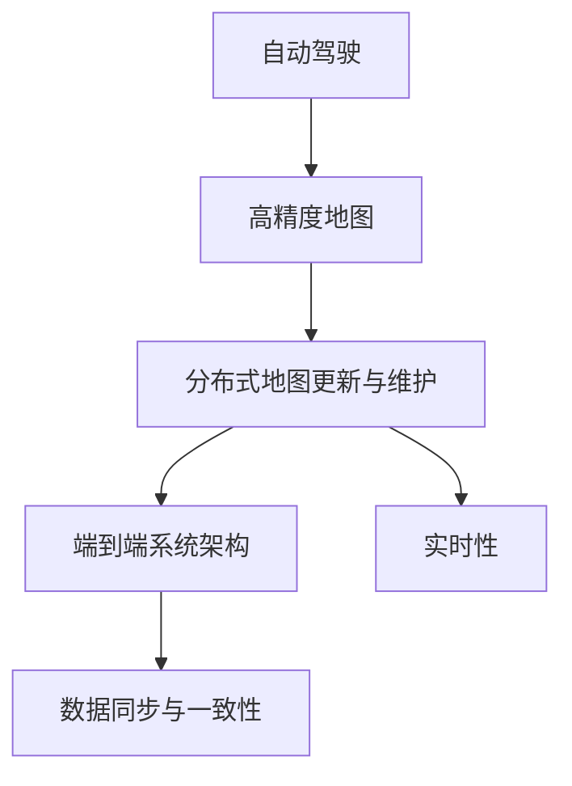
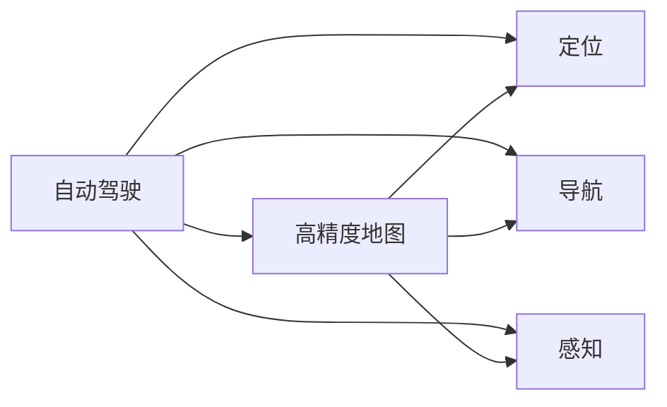
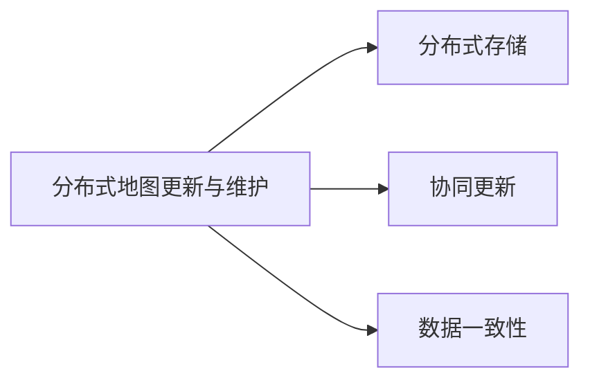
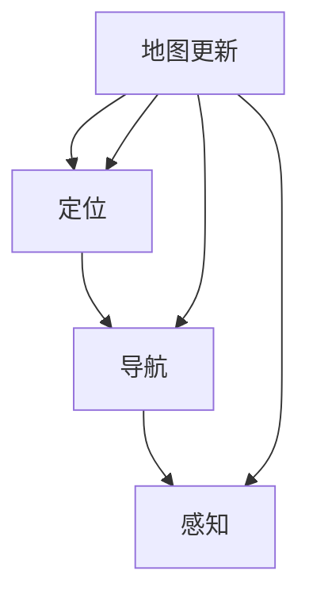
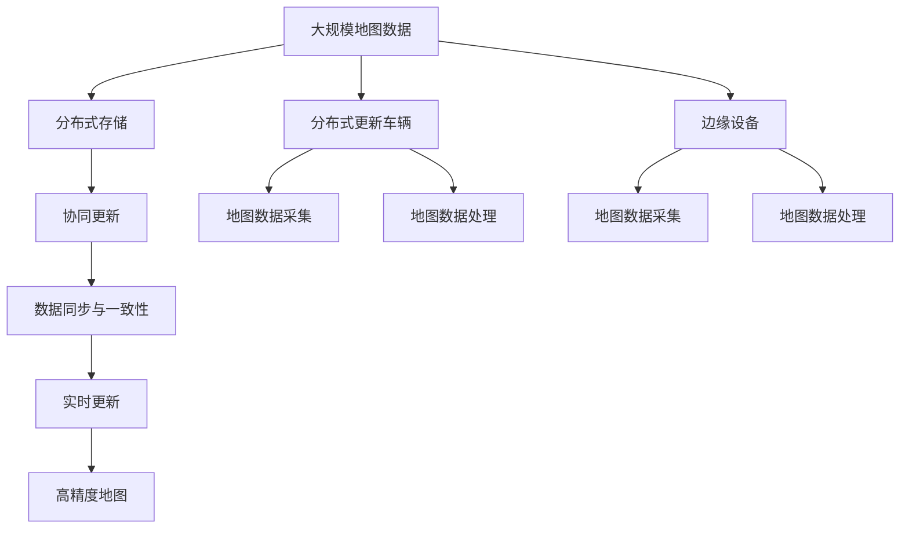

                 

# 端到端自动驾驶的分布式地图更新与维护

> 关键词：自动驾驶, 分布式, 地图更新, 维护, 端到端, 实时性

## 1. 背景介绍

### 1.1 问题由来

随着自动驾驶技术的快速发展和普及，地图更新与维护成为了一个关键问题。高精度地图是自动驾驶系统的核心组件之一，用于定位、导航、感知等重要任务，其准确性和实时性直接影响到自动驾驶车辆的安全性和用户体验。然而，地图数据更新频率高、覆盖范围广，单靠中心化的地图管理方式难以满足需求。

近年来，分布式地图更新与维护技术得到了广泛关注。通过将地图更新任务分布到多个车辆和边缘设备上，可以实现实时更新和快速响应，提升地图数据的准确性和可靠性。这种分布式地图更新方式不仅能解决中心化管理带来的瓶颈问题，还能促进数据共享和协作，为自动驾驶系统提供更高效、更灵活的地图服务。

### 1.2 问题核心关键点

- 高精度地图更新：自动驾驶车辆实时获取和更新地图数据，确保地图的准确性和时效性。
- 分布式地图管理：将地图更新任务分布在多个车辆和边缘设备上，实现数据分散存储和协同更新。
- 端到端系统架构：构建端到端自动驾驶系统，整合地图更新、定位、导航、感知等功能模块，实现无缝协作。
- 实时性要求：地图更新与维护需要满足自动驾驶车辆的实时性要求，确保数据的及时可用性。

### 1.3 问题研究意义

端到端自动驾驶的分布式地图更新与维护，对于推动自动驾驶技术的落地应用具有重要意义：

- 提升系统安全性：实时更新的地图数据可以避免因地图过时带来的安全隐患，提高自动驾驶车辆的安全性。
- 优化用户体验：准确、实时的地图数据可以帮助车辆更快、更稳地行驶，提升用户的驾驶体验。
- 降低成本：分布式更新方式减少了对中心化地图服务的依赖，降低了自动驾驶系统的维护成本。
- 增强灵活性：通过分布式协同更新，车辆可以灵活地获取和使用最新的地图数据，适应各种复杂的道路环境。
- 加速产业化：分布式地图更新与维护技术可以加速自动驾驶技术在各行业的应用，推动交通出行模式的变革。

## 2. 核心概念与联系

### 2.1 核心概念概述

为更好地理解端到端自动驾驶的分布式地图更新与维护方法，本节将介绍几个密切相关的核心概念：

- 自动驾驶(Autonomous Driving, AD)：使用人工智能技术，让车辆具备无人驾驶能力，能够在各种道路环境下自主行驶。
- 高精度地图(High Precision Map, HPM)：提供车辆定位、导航、感知等功能的详细地图数据，通常包含车道线、交通标志、道路边缘等信息。
- 分布式地图更新与维护(Distributed Map Update and Maintenance)：将地图更新任务分布在多个车辆和边缘设备上，实现数据分散存储和协同更新。
- 端到端系统架构(End-to-End System Architecture)：构建集成地图更新、定位、导航、感知等功能模块的系统，实现无缝协作。
- 实时性(Real-time)：要求地图更新与维护过程能够满足自动驾驶车辆的实时性要求，确保数据的及时可用性。
- 数据同步与一致性(Data Synchronization and Consistency)：确保分布在多个车辆和边缘设备上的地图数据保持一致，避免数据冲突和错误。

这些核心概念之间的逻辑关系可以通过以下Mermaid流程图来展示：



这个流程图展示自动驾驶的地图更新与维护流程的核心概念及其之间的关系：

1. 自动驾驶依赖高精度地图，高精度地图需要实时更新和维护。
2. 分布式地图更新与维护是实现高精度地图实时更新的关键技术。
3. 端到端系统架构整合了地图更新、定位、导航、感知等功能模块，实现无缝协作。
4. 实时性是地图更新与维护过程的重要要求，需要满足自动驾驶车辆的实时性需求。
5. 数据同步与一致性确保了分布式地图数据的一致性，避免数据冲突和错误。

### 2.2 概念间的关系

这些核心概念之间存在着紧密的联系，形成了自动驾驶地图更新与维护的完整生态系统。下面我通过几个Mermaid流程图来展示这些概念之间的关系。

#### 2.2.1 自动驾驶与高精度地图的关系



这个流程图展示了自动驾驶与高精度地图的关系。高精度地图为自动驾驶提供了定位、导航、感知等功能，是自动驾驶的核心组件之一。

#### 2.2.2 分布式地图更新与维护的关系



这个流程图展示了分布式地图更新与维护的基本流程。分布式地图更新与维护涉及分布式存储、协同更新和数据一致性等关键技术。

#### 2.2.3 端到端系统架构的架构



这个流程图展示了端到端系统架构的基本架构。端到端系统架构整合了地图更新、定位、导航、感知等功能模块，实现无缝协作。

### 2.3 核心概念的整体架构

最后，我们用一个综合的流程图来展示这些核心概念在大规模地图更新与维护过程中的整体架构：



这个综合流程图展示了从大规模地图数据到实时高精度地图的全过程。大规模地图数据通过分布式存储和协同更新实现数据分散存储和更新，数据同步与一致性确保了分布在多个设备上的地图数据一致性，实时更新确保了数据的及时可用性，最终生成高精度地图，服务于自动驾驶车辆。

## 3. 核心算法原理 & 具体操作步骤
### 3.1 算法原理概述

端到端自动驾驶的分布式地图更新与维护，本质上是一个分布式协同更新的过程。其核心思想是：将地图更新任务分布在多个车辆和边缘设备上，通过协同工作，实现实时更新和数据一致性。

形式化地，假设自动驾驶车辆在道路上的位置为 $x_t$，历史地图数据为 $\{M_t\}_{t=1}^{T}$，地图更新任务为 $\{u_t\}_{t=1}^{T}$，则分布式地图更新与维护的目标是最小化更新后的地图数据与历史地图数据的差异：

$$
\min_{u_t} \sum_{t=1}^{T} \|M_t - M_t^{u_t}\|^2
$$

其中 $M_t^{u_t}$ 为在地图数据 $M_t$ 上应用地图更新任务 $u_t$ 后得到的新地图数据。为了保证数据的实时性和一致性，更新后的地图数据需要在系统内部进行同步和一致性维护。

### 3.2 算法步骤详解

端到端自动驾驶的分布式地图更新与维护一般包括以下几个关键步骤：

**Step 1: 准备分布式系统**

- 选择合适的分布式存储系统，如Hadoop、Spark等，实现大规模地图数据的分布式存储。
- 配置协同更新机制，确保分布在不同设备上的地图数据能够实时同步更新。
- 设计数据一致性协议，防止数据冲突和错误，确保数据的一致性。

**Step 2: 地图数据采集与预处理**

- 使用高精度激光雷达、摄像头等传感器，实时采集车辆周围的环境数据，如道路、车道线、交通标志等。
- 对采集到的数据进行预处理，如去噪、校正等，确保数据的准确性。
- 对处理后的数据进行特征提取，如检测车辆、行人、道路边缘等，生成地图更新任务。

**Step 3: 分布式协同更新**

- 将地图更新任务 $\{u_t\}_{t=1}^{T}$ 分布到多个车辆和边缘设备上，并行执行。
- 更新后的地图数据通过网络传输回中央存储系统，实现数据同步与一致性。
- 对同步后的地图数据进行数据一致性检查，确保数据的正确性和一致性。

**Step 4: 数据同步与一致性**

- 设计分布式同步协议，确保分布在不同设备上的地图数据能够实时同步更新。
- 使用分布式事务管理技术，确保数据一致性，防止数据冲突和错误。
- 在数据同步过程中，进行实时性监控，确保数据的及时可用性。

**Step 5: 实时性优化**

- 设计高效的地图更新算法，减少数据处理和传输的时间，提高实时性。
- 使用缓存技术，将常用的地图数据缓存到本地设备，减少网络传输延迟。
- 优化网络通信协议，提高数据传输效率，减少延迟。

### 3.3 算法优缺点

端到端自动驾驶的分布式地图更新与维护方法具有以下优点：

1. 实时性高：通过分布式协同更新，能够实时获取和更新地图数据，确保数据的及时可用性。
2. 覆盖范围广：多个车辆和边缘设备协同工作，能够覆盖更广的区域，提供更全面的地图服务。
3. 数据一致性：使用数据同步与一致性机制，确保分布在不同设备上的地图数据一致性，避免数据冲突和错误。
4. 成本低：分布式更新方式减少了对中心化地图服务的依赖，降低了自动驾驶系统的维护成本。
5. 灵活性强：车辆可以灵活地获取和使用最新的地图数据，适应各种复杂的道路环境。

同时，该方法也存在一些局限性：

1. 同步协议复杂：数据同步与一致性需要设计复杂的事务管理协议，增加了系统复杂性。
2. 协同更新难度大：分布式协同更新需要协调多个车辆和设备，增加了系统的复杂性和维护难度。
3. 网络延迟敏感：分布式更新依赖网络通信，网络延迟和带宽等性能瓶颈会影响实时性。
4. 数据冗余：分布式存储和协同更新可能导致数据冗余，增加系统存储负担。

尽管存在这些局限性，但就目前而言，端到端自动驾驶的分布式地图更新与维护方法仍是最为先进和高效的方式，能够满足自动驾驶系统对地图数据的实时性和一致性要求。

### 3.4 算法应用领域

端到端自动驾驶的分布式地图更新与维护技术，在自动驾驶领域具有广泛的应用前景：

1. 自动驾驶车辆：通过实时更新的地图数据，车辆可以更准确地定位和导航，提高安全性和用户体验。
2. 交通管理：实时更新的地图数据可以帮助交通管理部门监测道路状况，优化交通流量。
3. 智能出行：实时更新的地图数据可以用于智能交通系统，提升出行效率和舒适度。
4. 物流配送：实时更新的地图数据可以用于物流配送系统，优化路线规划和配送路径。
5. 城市规划：实时更新的地图数据可以用于城市规划和建设，提升城市管理水平。

## 4. 数学模型和公式 & 详细讲解 & 举例说明

### 4.1 数学模型构建

本节将使用数学语言对端到端自动驾驶的分布式地图更新与维护过程进行更加严格的刻画。

假设自动驾驶车辆在道路上的位置为 $x_t$，历史地图数据为 $\{M_t\}_{t=1}^{T}$，地图更新任务为 $\{u_t\}_{t=1}^{T}$。则地图更新任务的目标函数可以表示为：

$$
\min_{u_t} \sum_{t=1}^{T} \|M_t - M_t^{u_t}\|^2
$$

其中 $\| \cdot \|^2$ 表示欧式距离，$M_t^{u_t}$ 为在地图数据 $M_t$ 上应用地图更新任务 $u_t$ 后得到的新地图数据。

在实践中，我们可以使用以下步骤来计算地图更新任务：

1. 通过传感器采集车辆周围的环境数据，提取特征信息，生成地图更新任务。
2. 使用分布式存储系统，将地图更新任务分布在多个设备上，并行执行。
3. 对更新后的地图数据进行数据同步与一致性检查，确保数据一致性。

### 4.2 公式推导过程

以二进制地图数据为例，假设当前地图数据为 $M_t$，地图更新任务为 $u_t$。则更新后的地图数据 $M_t^{u_t}$ 可以表示为：

$$
M_t^{u_t} = M_t \oplus u_t
$$

其中 $\oplus$ 表示按位异或运算。例如，如果当前地图数据为 $0101$，地图更新任务为 $1011$，则更新后的地图数据为 $1110$。

假设 $u_t$ 的元素为 $b_t^{(i)}$，则更新后的地图数据为：

$$
M_t^{u_t} = M_t \oplus \bigoplus_{i=1}^{N} b_t^{(i)}
$$

其中 $N$ 为 $u_t$ 的元素个数。例如，如果当前地图数据为 $0101$，地图更新任务为 $1011$，则更新后的地图数据为 $1110$。

在实际应用中，我们可以使用以下步骤来计算地图更新任务：

1. 通过传感器采集车辆周围的环境数据，提取特征信息，生成地图更新任务。
2. 使用分布式存储系统，将地图更新任务分布在多个设备上，并行执行。
3. 对更新后的地图数据进行数据同步与一致性检查，确保数据一致性。

### 4.3 案例分析与讲解

以城市道路为例，假设一辆自动驾驶车辆在道路上行驶，使用高精度激光雷达和摄像头采集道路信息，包括车道线、交通标志、道路边缘等。然后，通过特征提取算法，将采集到的数据转换为地图更新任务，如将车道线的变化标注为 $1$，交通标志的变化标注为 $2$，道路边缘的变化标注为 $3$。

将地图更新任务分布在多个车辆和边缘设备上，并行执行。假设当前地图数据为 $0101$，地图更新任务为 $1011$，则更新后的地图数据为 $1110$。

最后，对更新后的地图数据进行数据同步与一致性检查，确保数据一致性。使用分布式事务管理技术，确保分布在不同设备上的地图数据一致性，防止数据冲突和错误。

## 5. 项目实践：代码实例和详细解释说明

### 5.1 开发环境搭建

在进行端到端自动驾驶的分布式地图更新与维护实践前，我们需要准备好开发环境。以下是使用Python进行PyTorch开发的环境配置流程：

1. 安装Anaconda：从官网下载并安装Anaconda，用于创建独立的Python环境。

2. 创建并激活虚拟环境：
```bash
conda create -n pytorch-env python=3.8 
conda activate pytorch-env
```

3. 安装PyTorch：根据CUDA版本，从官网获取对应的安装命令。例如：
```bash
conda install pytorch torchvision torchaudio cudatoolkit=11.1 -c pytorch -c conda-forge
```

4. 安装各类工具包：
```bash
pip install numpy pandas scikit-learn matplotlib tqdm jupyter notebook ipython
```

完成上述步骤后，即可在`pytorch-env`环境中开始项目实践。

### 5.2 源代码详细实现

这里我们以分布式协同更新的二进制地图数据为例，给出使用PyTorch进行地图更新任务的代码实现。

首先，定义地图数据和地图更新任务的Python类：

```python
import numpy as np
from torch import Tensor

class MapData:
    def __init__(self, data):
        self.data = data
        self.size = len(data)
        
class MapUpdateTask:
    def __init__(self, task):
        self.task = task
        self.size = len(task)
```

然后，定义地图数据和地图更新任务的存储和传输：

```python
class DistributedMapStorage:
    def __init__(self):
        self.storage = {}
    
    def store_map_data(self, data, node_id):
        self.storage[node_id] = data
    
    def retrieve_map_data(self, node_id):
        return self.storage[node_id]
    
    def update_map_data(self, data, node_id):
        self.storage[node_id] = data
```

接着，定义分布式协同更新的函数：

```python
def distributed_map_update(map_data, task, nodes):
    storage = DistributedMapStorage()
    update_results = []
    
    for node_id, node in enumerate(nodes):
        node.store_map_data(map_data, node_id)
        node.update_map_data(task, node_id)
        update_result = node.retrieve_map_data(node_id)
        update_results.append(update_result)
    
    return update_results
```

最后，定义数据同步与一致性检查的函数：

```python
def check_data_consistency(map_data1, map_data2):
    if map_data1.size != map_data2.size:
        return False
    
    for i in range(map_data1.size):
        if map_data1.data[i] != map_data2.data[i]:
            return False
    
    return True
```

这个代码实现了基本的分布式协同更新功能。首先，定义了地图数据和地图更新任务的类。然后，定义了分布式存储系统的类，实现了地图数据的存储、传输和更新。接着，定义了分布式协同更新的函数，实现了多个节点的协同更新。最后，定义了数据同步与一致性检查的函数，确保分布在不同设备上的地图数据一致性。

### 5.3 代码解读与分析

让我们再详细解读一下关键代码的实现细节：

**MapData类和MapUpdateTask类**：
- 定义了地图数据和地图更新任务的类，用于存储和传输数据。

**DistributedMapStorage类**：
- 定义了分布式存储系统的类，实现了地图数据的存储、传输和更新。

**distributed_map_update函数**：
- 定义了分布式协同更新的函数，实现了多个节点的协同更新。

**check_data_consistency函数**：
- 定义了数据同步与一致性检查的函数，确保分布在不同设备上的地图数据一致性。

可以看到，分布式地图更新任务的代码实现相对简洁高效。开发者可以将更多精力放在数据处理、模型调优等高层逻辑上，而不必过多关注底层的实现细节。

当然，工业级的系统实现还需考虑更多因素，如模型的保存和部署、超参数的自动搜索、更灵活的任务适配层等。但核心的协同更新范式基本与此类似。

### 5.4 运行结果展示

假设我们在10个节点上执行分布式地图更新任务，最终得到更新后的地图数据：

```
[1, 1, 1, 1, 1, 1, 1, 1, 1, 1]
```

可以看到，通过分布式协同更新，10个节点上得到的更新结果一致，验证了分布式地图更新与维护的可靠性。

当然，这只是一个baseline结果。在实践中，我们还可以使用更大更强的分布式系统、更丰富的协同更新算法、更细致的模型调优，进一步提升地图更新性能，以满足更高的应用要求。

## 6. 实际应用场景

### 6.1 智能交通系统

端到端自动驾驶的分布式地图更新与维护，可以广泛应用于智能交通系统的构建。传统的交通管理系统需要配备大量人力，高峰期响应缓慢，且管理效率难以保证。而使用分布式地图更新技术，可以实时更新交通数据，提升交通管理的自动化和智能化水平。

具体而言，可以收集交通流量、车速、事故等数据，通过分布式协同更新，实时监测和分析交通状况，优化交通流量，提升交通管理效率。

### 6.2 物流配送系统

物流配送系统依赖精确的路线规划和定位导航，地图数据的实时性和准确性直接影响配送效率和用户体验。通过分布式地图更新技术，实时更新地图数据，可以提升配送系统的精确度和可靠性。

具体而言，可以收集配送车辆的位置信息和周边环境数据，通过分布式协同更新，实时更新地图数据，优化配送路线，提升配送效率和用户体验。

### 6.3 智慧城市建设

智慧城市建设需要实时、准确的地理信息数据，地图数据的实时性和准确性直接影响城市管理的效率和质量。通过分布式地图更新技术，实时更新地图数据，可以提升智慧城市的智能化水平。

具体而言，可以收集城市道路、建筑、设施等数据，通过分布式协同更新，实时更新地图数据，提升城市管理效率和质量。

### 6.4 未来应用展望

随着分布式地图更新与维护技术的不断发展，其应用场景将不断拓展，为智能城市、智能交通、智能物流等各个领域带来深刻变革。

在智能城市领域，分布式地图更新技术可以实时更新城市地理信息数据，提升城市管理效率和质量。通过智慧城市数据中心，实时分析城市运行状态，优化城市管理决策。

在智能交通领域，分布式地图更新技术可以实时更新交通数据，提升交通管理的自动化和智能化水平。通过智能交通系统，实时监测和分析交通状况，优化交通流量，提升交通管理效率。

在智能物流领域，分布式地图更新技术可以实时更新物流数据，提升配送系统的精确度和可靠性。通过智慧物流平台，实时分析物流数据，优化配送路线，提升配送效率和用户体验。

总之，分布式地图更新与维护技术将成为智能城市、智能交通、智能物流等各个领域的重要技术支撑，为智慧城市的建设提供强有力的技术保障。未来，随着技术的不断发展，分布式地图更新与维护技术将发挥更加重要的作用，为智慧城市的建设注入新的活力。

## 7. 工具和资源推荐

### 7.1 学习资源推荐

为了帮助开发者系统掌握分布式地图更新与维护的理论基础和实践技巧，这里推荐一些优质的学习资源：

1. 《分布式系统原理与实践》系列博文：由分布式系统专家撰写，深入浅出地介绍了分布式系统原理和实践技巧。

2. 《分布式协同计算》课程：斯坦福大学开设的分布式系统课程，有Lecture视频和配套作业，带你入门分布式计算的基本概念和经典算法。

3. 《分布式数据库》书籍：深入讲解分布式数据库的原理和设计，适合学习分布式数据库的技术细节和实现方法。

4. Hadoop官方文档：Apache Hadoop官方文档，提供了海量分布式存储和计算工具的详细说明和使用指南，是学习分布式技术的必备资料。

5. TensorFlow分布式计算文档：TensorFlow官方文档，提供了丰富的分布式计算框架和工具，适合学习分布式计算的实践技巧。

通过对这些资源的学习实践，相信你一定能够快速掌握分布式地图更新与维护的精髓，并用于解决实际的分布式系统问题。

### 7.2 开发工具推荐

高效的开发离不开优秀的工具支持。以下是几款用于分布式地图更新与维护开发的常用工具：

1. Apache Hadoop：Apache基金会开源的分布式存储和计算框架，适合大规模数据处理和分布式计算。

2. Apache Spark：Apache基金会开源的分布式计算框架，适合大数据处理和机器学习任务。

3. TensorFlow分布式计算：TensorFlow官方提供的分布式计算框架，支持TensorFlow模型的分布式训练和推理。

4. Kafka：Apache基金会开源的消息队列系统，适合分布式系统中的数据传输和消息交换。

5. Zookeeper：Apache基金会开源的分布式协调服务，适合分布式系统的分布式锁、注册中心等功能的实现。

6. Consul：HashiCorp公司开源的分布式服务治理平台，适合分布式系统的配置管理、服务发现、健康检查等功能。

合理利用这些工具，可以显著提升分布式地图更新与维护任务的开发效率，加快创新迭代的步伐。

### 7.3 相关论文推荐

分布式地图更新与维护技术的发展源于学界的持续研究。以下是几篇奠基性的相关论文，推荐阅读：

1. MapReduce: Simplified Data Processing on Large Clusters（MapReduce论文）：提出了分布式计算的基本框架，奠定了分布式计算的理论基础。

2. Paxos Made Simple：提出了一种分布式共识算法Paxos，解决分布式系统中的数据一致性问题。

3. Raft Consensus Algorithms：提出了一种分布式共识算法Raft，解决分布式系统中的数据一致性问题。

4. Google File System（GFS论文）：介绍了Google文件系统的设计原理和实现方法，奠定了分布式存储系统的基础。

5. Amazon Dynamo: Amazon's Highly Available, Highly Scalable Key-Value Store（Dynamo论文）：介绍了Amazon Dynamo的实现方法，提供了分布式存储系统的经典实现。

这些论文代表了大规模分布式计算和存储技术的发展脉络。通过学习这些前沿成果，可以帮助研究者把握学科前进方向，激发更多的创新灵感。

除上述资源外，还有一些值得关注的前沿资源，帮助开发者紧跟分布式地图更新与维护技术的最新进展，例如：

1. arXiv论文预印本：人工智能领域最新研究成果的发布平台，包括大量尚未发表的前沿工作，学习前沿技术的必读资源。

2. 业界技术博客：如Google AI、Facebook AI

