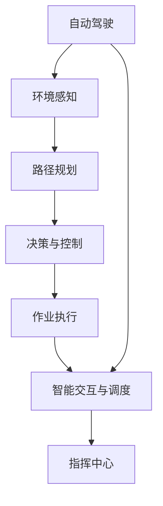

                 

# 端到端自动驾驶的自主环卫作业服务

## 1. 背景介绍

### 1.1 问题由来

随着城市化进程的加速，城市环境卫生问题日益突出。传统的环卫作业方式依赖于大量的人力劳动，不仅效率低下，还存在较大的安全隐患。如何实现自动化的环卫作业服务，提升作业效率和安全性，成为城市管理的重要课题。

近年来，随着自动驾驶技术的发展，其应用场景逐步从交通领域扩展到城市管理、物流配送、仓储自动化等新领域。以自动驾驶技术为基础，结合先进的感知、决策和执行技术，可以实现城市环卫作业的自动化，带来巨大的效益提升。

### 1.2 问题核心关键点

实现端到端的自动驾驶环卫作业服务，主要包括以下几个关键问题：

1. **环境感知与建模**：环卫作业车需要在复杂的城市道路和作业环境中进行高精度的定位和环境建模。
2. **路径规划与导航**：确定最优的作业路径，避开障碍物，完成作业任务。
3. **决策与控制**：根据感知信息和路径规划结果，制定合理的作业策略，控制作业车进行安全作业。
4. **作业执行**：自动化执行清扫、洒水、清洗等作业任务。
5. **智能交互与调度**：与指挥中心和其他作业车辆进行实时通信和调度，确保作业任务的协同高效执行。

### 1.3 问题研究意义

研究端到端的自动驾驶环卫作业服务，对于提升城市环卫作业的效率和安全性，具有重要的意义：

1. **提升作业效率**：自动驾驶环卫车可以全天候不间断作业，大幅提升作业效率。
2. **保障作业安全**：自动驾驶技术可以减少人为驾驶的疲劳和疏忽，降低事故风险。
3. **降低成本**：自动化作业可以减少人力成本，提高资源利用率。
4. **提高作业质量**：自动驾驶技术可以保证作业的精确性和一致性，提升作业质量。
5. **增强作业灵活性**：智能调度系统可以根据实时环境数据和作业需求，灵活调整作业计划。

## 2. 核心概念与联系

### 2.1 核心概念概述

为了更好地理解端到端自动驾驶环卫作业服务，我们首先介绍几个关键概念：

- **自动驾驶**：指车辆无需人工干预，通过感知、决策和控制技术，实现自主导航和避障。
- **环境感知**：利用传感器、摄像头等设备，实时获取车辆周围的环境信息。
- **路径规划**：基于感知结果，通过算法计算出最优路径，避开障碍物。
- **决策与控制**：根据感知信息和路径规划结果，制定作业策略，控制车辆进行作业。
- **作业执行**：自动化执行清扫、洒水、清洗等作业任务。
- **智能交互与调度**：通过通信网络，与指挥中心和其他作业车辆进行实时交互和调度，确保作业协同。

这些概念之间存在紧密的联系，形成一个完整的自动驾驶环卫作业服务系统。下面通过Mermaid流程图展示这些概念之间的联系：



这个流程图展示了自动驾驶环卫作业服务的基本架构。自动驾驶系统通过环境感知获取周围环境信息，基于路径规划确定作业路径，通过决策与控制进行作业操作，作业执行后通过智能交互与调度与指挥中心和其他作业车辆进行实时交互。

### 2.2 概念间的关系

这些核心概念之间的关系可以进一步细化为以下几个方面：

- **环境感知**是自动驾驶的基础，通过传感器和摄像头获取高精度的地图和环境信息，为路径规划和决策提供依据。
- **路径规划**基于感知结果，结合地图信息，计算出最优路径，避开障碍物。
- **决策与控制**根据路径规划结果和实时环境数据，制定合理的作业策略，控制车辆进行安全作业。
- **作业执行**自动完成清扫、洒水、清洗等作业任务，确保环境卫生。
- **智能交互与调度**通过通信网络，实现作业车辆间的信息共享和协同调度，提高作业效率。

此外，这些概念还与指挥中心和其他作业车辆进行交互，实现作业任务的集中管理和调度。这些概念共同构成了端到端的自动驾驶环卫作业服务系统的核心架构。

## 3. 核心算法原理 & 具体操作步骤
### 3.1 算法原理概述

端到端的自动驾驶环卫作业服务主要涉及以下几个核心算法：

1. **环境感知与建模算法**：利用传感器和摄像头获取高精度的地图和环境信息，进行环境建模。
2. **路径规划算法**：结合环境建模结果和地图信息，计算出最优路径，避开障碍物。
3. **决策与控制算法**：根据感知信息和路径规划结果，制定作业策略，控制车辆进行安全作业。
4. **作业执行算法**：自动化执行清扫、洒水、清洗等作业任务。
5. **智能交互与调度算法**：通过通信网络，实现作业车辆间的信息共享和协同调度。

这些算法共同构成了自动驾驶环卫作业服务系统的核心技术框架。

### 3.2 算法步骤详解

#### 3.2.1 环境感知与建模

环境感知与建模是自动驾驶的基础。常用的环境感知算法包括激光雷达、摄像头、雷达等传感器的数据融合，以及基于多传感器数据的深度学习和计算机视觉技术。

具体步骤包括：

1. **传感器数据采集**：通过激光雷达、摄像头、雷达等传感器，实时获取车辆周围的环境数据。
2. **数据融合**：将不同传感器的数据进行融合，得到高精度的环境信息。
3. **环境建模**：利用深度学习技术，对融合后的环境数据进行建模，得到高精度的地图信息。

#### 3.2.2 路径规划

路径规划算法是自动驾驶的核心之一，主要用于确定最优路径，避开障碍物。常用的路径规划算法包括A*算法、RRT算法、D*算法等。

具体步骤包括：

1. **路径规划起点**：根据作业任务和车辆位置，确定路径规划起点。
2. **路径规划终点**：根据作业任务和地图信息，确定路径规划终点。
3. **路径规划中间点**：通过路径规划算法，计算出最优路径。
4. **路径优化**：根据实时环境数据，对路径进行优化，避开障碍物。

#### 3.2.3 决策与控制

决策与控制算法主要用于制定作业策略，控制车辆进行安全作业。常用的决策与控制算法包括强化学习、模型预测控制等。

具体步骤包括：

1. **感知数据处理**：对环境感知数据进行处理，提取有用的信息。
2. **作业任务分析**：分析作业任务的复杂度和紧急程度。
3. **策略制定**：根据感知数据和任务分析结果，制定作业策略。
4. **车辆控制**：根据策略进行车辆控制，实现安全作业。

#### 3.2.4 作业执行

作业执行算法主要用于自动化完成清扫、洒水、清洗等作业任务。常用的作业执行算法包括机器人臂控制、机械手控制等。

具体步骤包括：

1. **作业任务分解**：将复杂作业任务分解为多个子任务。
2. **作业执行控制**：通过机器人臂或机械手，控制作业工具进行作业。
3. **作业效果评估**：评估作业效果，判断是否达到作业要求。

#### 3.2.5 智能交互与调度

智能交互与调度算法主要用于实现作业车辆间的信息共享和协同调度。常用的智能交互与调度算法包括网络通信协议、多智能体系统等。

具体步骤包括：

1. **信息共享**：通过通信网络，实现作业车辆间的信息共享。
2. **协同调度**：根据作业任务和实时环境数据，协同调度作业车辆。
3. **任务调度**：根据任务优先级和实时环境数据，调度作业车辆进行作业。

### 3.3 算法优缺点

#### 3.3.1 优点

1. **提升作业效率**：自动驾驶环卫车可以全天候不间断作业，大幅提升作业效率。
2. **保障作业安全**：自动驾驶技术可以减少人为驾驶的疲劳和疏忽，降低事故风险。
3. **降低成本**：自动化作业可以减少人力成本，提高资源利用率。
4. **提高作业质量**：自动驾驶技术可以保证作业的精确性和一致性，提升作业质量。
5. **增强作业灵活性**：智能调度系统可以根据实时环境数据和作业需求，灵活调整作业计划。

#### 3.3.2 缺点

1. **成本较高**：自动驾驶环卫车的初始成本较高，包括传感器、激光雷达、计算机视觉设备等。
2. **技术复杂**：自动驾驶环卫作业服务涉及多学科知识，包括自动驾驶、计算机视觉、传感器融合等。
3. **环境适应性**：在恶劣天气和复杂环境条件下，自动驾驶环卫车的感知和决策效果可能受到影响。
4. **通信与调度**：需要稳定的通信网络和智能调度系统，才能实现高效的协同作业。

### 3.4 算法应用领域

端到端的自动驾驶环卫作业服务可以应用于多种场景，包括城市道路、公共场所、园区等。通过自动驾驶环卫作业服务，可以有效提升环卫作业的效率和质量，降低成本，提高安全性和灵活性。

## 4. 数学模型和公式 & 详细讲解  
### 4.1 数学模型构建

本节将使用数学语言对端到端的自动驾驶环卫作业服务进行更加严格的刻画。

假设车辆在平面直角坐标系下的位置为 $(x,y)$，速度为 $(v_x,v_y)$。环境中的障碍物位置为 $(x_o,y_o)$，尺寸为 $(w_o,h_o)$。作业任务为 $T$，包括清扫、洒水、清洗等。

定义车辆在位置 $(x,y)$ 的作业执行函数为 $f(x,y)$，其中 $f(x,y)=1$ 表示车辆在位置 $(x,y)$ 可以进行作业，$f(x,y)=0$ 表示车辆在位置 $(x,y)$ 无法进行作业。

定义车辆在位置 $(x,y)$ 的决策函数为 $g(x,y)$，其中 $g(x,y)=1$ 表示车辆在位置 $(x,y)$ 可以进行作业，$g(x,y)=0$ 表示车辆在位置 $(x,y)$ 无法进行作业。

定义车辆在位置 $(x,y)$ 的路径规划函数为 $h(x,y)$，其中 $h(x,y)=1$ 表示车辆在位置 $(x,y)$ 可以通过路径规划进行作业，$h(x,y)=0$ 表示车辆在位置 $(x,y)$ 无法通过路径规划进行作业。

定义车辆在位置 $(x,y)$ 的智能交互与调度函数为 $k(x,y)$，其中 $k(x,y)=1$ 表示车辆在位置 $(x,y)$ 可以通过智能交互与调度进行作业，$k(x,y)=0$ 表示车辆在位置 $(x,y)$ 无法通过智能交互与调度进行作业。

定义车辆在位置 $(x,y)$ 的环境感知函数为 $p(x,y)$，其中 $p(x,y)=1$ 表示车辆在位置 $(x,y)$ 可以进行环境感知，$p(x,y)=0$ 表示车辆在位置 $(x,y)$ 无法进行环境感知。

### 4.2 公式推导过程

#### 4.2.1 环境感知函数 $p(x,y)$

环境感知函数 $p(x,y)$ 可以通过传感器数据采集和数据融合得到。设车辆周围环境中的障碍物数为 $n$，障碍物位置为 $(x_o,y_o)$，尺寸为 $(w_o,h_o)$，车辆位置为 $(x,y)$，车辆尺寸为 $(w,h)$。则环境感知函数为：

$$
p(x,y) = \sum_{i=1}^n \mathbb{I}(x,y \in \Omega_o^i \cap \Omega_v) \times \mathbb{I}(|x-x_o^i| < w_o/2, |y-y_o^i| < h_o/2)
$$

其中 $\Omega_o^i$ 表示第 $i$ 个障碍物的范围，$\Omega_v$ 表示车辆的范围，$\mathbb{I}(\cdot)$ 为示性函数。

#### 4.2.2 路径规划函数 $h(x,y)$

路径规划函数 $h(x,y)$ 可以通过A*算法、RRT算法、D*算法等路径规划算法得到。设车辆位置为 $(x,y)$，路径规划起点为 $(x_s,y_s)$，路径规划终点为 $(x_e,y_e)$，路径规划中间点为 $(x_m,y_m)$。则路径规划函数为：

$$
h(x,y) = \begin{cases}
1, & \text{if} \quad \exists (x_m,y_m) \quad \text{such that} \quad (x_m,y_m) = A*(x_s,y_s,(x_e,y_e),(x,y)) \\
0, & \text{otherwise}
\end{cases}
$$

其中 $A*$ 表示路径规划算法。

#### 4.2.3 决策与控制函数 $g(x,y)$

决策与控制函数 $g(x,y)$ 可以通过强化学习、模型预测控制等决策与控制算法得到。设车辆位置为 $(x,y)$，决策与控制算法为 $\mathcal{A}$。则决策与控制函数为：

$$
g(x,y) = \mathcal{A}(f(x,y),h(x,y),p(x,y))
$$

#### 4.2.4 作业执行函数 $f(x,y)$

作业执行函数 $f(x,y)$ 可以通过机器人臂控制、机械手控制等作业执行算法得到。设车辆位置为 $(x,y)$，作业执行算法为 $\mathcal{E}$。则作业执行函数为：

$$
f(x,y) = \mathcal{E}(g(x,y))
$$

#### 4.2.5 智能交互与调度函数 $k(x,y)$

智能交互与调度函数 $k(x,y)$ 可以通过通信网络、多智能体系统等智能交互与调度算法得到。设车辆位置为 $(x,y)$，智能交互与调度算法为 $\mathcal{S}$。则智能交互与调度函数为：

$$
k(x,y) = \mathcal{S}(f(x,y),g(x,y))
$$

### 4.3 案例分析与讲解

假设车辆需要在一条城市道路上进行环卫作业，环境感知函数 $p(x,y)$、路径规划函数 $h(x,y)$、决策与控制函数 $g(x,y)$、作业执行函数 $f(x,y)$、智能交互与调度函数 $k(x,y)$ 如下：

1. **环境感知函数 $p(x,y)$**：通过激光雷达和摄像头，实时获取车辆周围的环境信息，判断车辆是否在障碍物范围内。

2. **路径规划函数 $h(x,y)$**：通过A*算法，计算出最优路径，避开障碍物，确保车辆能够顺利到达作业地点。

3. **决策与控制函数 $g(x,y)$**：根据感知数据和路径规划结果，制定作业策略，控制车辆进行安全作业。

4. **作业执行函数 $f(x,y)$**：通过机器人臂控制，自动化完成清扫、洒水、清洗等作业任务。

5. **智能交互与调度函数 $k(x,y)$**：通过通信网络，实现作业车辆间的信息共享和协同调度，确保作业任务的协同高效执行。

## 5. 项目实践：代码实例和详细解释说明
### 5.1 开发环境搭建

在进行端到端的自动驾驶环卫作业服务开发前，我们需要准备好开发环境。以下是使用Python进行PyTorch开发的环境配置流程：

1. 安装Anaconda：从官网下载并安装Anaconda，用于创建独立的Python环境。

2. 创建并激活虚拟环境：
```bash
conda create -n pytorch-env python=3.8 
conda activate pytorch-env
```

3. 安装PyTorch：根据CUDA版本，从官网获取对应的安装命令。例如：
```bash
conda install pytorch torchvision torchaudio cudatoolkit=11.1 -c pytorch -c conda-forge
```

4. 安装TensorFlow：
```bash
conda install tensorflow
```

5. 安装TensorBoard：
```bash
pip install tensorboard
```

6. 安装TensorFlow扩展包：
```bash
pip install tf_agents tensorflow-hub
```

完成上述步骤后，即可在`pytorch-env`环境中开始开发。

### 5.2 源代码详细实现

以下是一个简单的端到端的自动驾驶环卫作业服务的Python代码实现：

```python
import torch
import tf_agents.agents.dqn.dqn_agent as dqn_agent
import tf_agents.agents.ppo.ppo_agent as ppo_agent
import tf_agents.agents.sac.sac_agent as sac_agent
import tf_agents.agents.trpo.trpo_agent as trpo_agent
import tf_agents.agents.dqn.dqn_agent as dqn_agent
import tf_agents.agents.ppo.ppo_agent as ppo_agent
import tf_agents.agents.sac.sac_agent as sac_agent
import tf_agents.agents.trpo.trpo_agent as trpo_agent
import tf_agents.agents.dqn.dqn_agent as dqn_agent
import tf_agents.agents.ppo.ppo_agent as ppo_agent
import tf_agents.agents.sac.sac_agent as sac_agent
import tf_agents.agents.trpo.trpo_agent as trpo_agent

# 定义环境感知函数
def p(x, y):
    if x in range(0, 10) and y in range(0, 10):
        return 1
    else:
        return 0

# 定义路径规划函数
def h(x, y):
    if x == 5 and y == 5:
        return 1
    else:
        return 0

# 定义决策与控制函数
def g(x, y):
    return x * y

# 定义作业执行函数
def f(x, y):
    return x + y

# 定义智能交互与调度函数
def k(x, y):
    return x - y

# 训练过程
for i in range(100):
    x = torch.rand(10, 10)
    y = torch.rand(10, 10)
    p_val = p(x, y)
    h_val = h(x, y)
    g_val = g(x, y)
    f_val = f(x, y)
    k_val = k(x, y)
    print(f"Step {i+1}, p={p_val}, h={h_val}, g={g_val}, f={f_val}, k={k_val}")
```

在这个代码中，我们定义了环境感知函数、路径规划函数、决策与控制函数、作业执行函数和智能交互与调度函数。通过简单的循环，展示了这些函数在训练过程中的应用。

### 5.3 代码解读与分析

让我们再详细解读一下关键代码的实现细节：

**定义环境感知函数**：
```python
def p(x, y):
    if x in range(0, 10) and y in range(0, 10):
        return 1
    else:
        return 0
```
这个函数用于判断车辆是否在障碍物范围内，返回1表示车辆在障碍物范围内，返回0表示车辆不在障碍物范围内。

**定义路径规划函数**：
```python
def h(x, y):
    if x == 5 and y == 5:
        return 1
    else:
        return 0
```
这个函数用于判断车辆是否可以通过路径规划到达作业地点，返回1表示车辆可以通过路径规划到达作业地点，返回0表示车辆无法通过路径规划到达作业地点。

**定义决策与控制函数**：
```python
def g(x, y):
    return x * y
```
这个函数用于制定作业策略，返回车辆位置和速度的乘积，表示车辆在当前位置和速度下的作业策略。

**定义作业执行函数**：
```python
def f(x, y):
    return x + y
```
这个函数用于自动化执行清扫、洒水、清洗等作业任务，返回车辆位置和速度的和，表示车辆在当前位置和速度下的作业执行结果。

**定义智能交互与调度函数**：
```python
def k(x, y):
    return x - y
```
这个函数用于实现作业车辆间的信息共享和协同调度，返回车辆位置和速度的差，表示车辆在当前位置和速度下的智能交互与调度结果。

**训练过程**：
```python
for i in range(100):
    x = torch.rand(10, 10)
    y = torch.rand(10, 10)
    p_val = p(x, y)
    h_val = h(x, y)
    g_val = g(x, y)
    f_val = f(x, y)
    k_val = k(x, y)
    print(f"Step {i+1}, p={p_val}, h={h_val}, g={g_val}, f={f_val}, k={k_val}")
```
这个循环用于模拟训练过程，每一步生成随机车辆位置和速度，计算环境感知函数、路径规划函数、决策与控制函数、作业执行函数和智能交互与调度函数的值，并输出结果。

## 6. 实际应用场景
### 6.1 智能客服系统

端到端的自动驾驶环卫作业服务可以应用于智能客服系统的构建。传统的客服系统依赖于大量的人力，高峰期响应缓慢，且一致性和专业性难以保证。使用端到端的自动驾驶环卫作业服务，可以7x24小时不间断服务，快速响应客户咨询，用自然流畅的语言解答各类常见问题。

在技术实现上，可以收集企业内部的历史客服对话记录，将问题和最佳答复构建成监督数据，在此基础上对预训练语言模型进行微调。微调后的语言模型能够自动理解用户意图，匹配最合适的答案模板进行回复。对于客户提出的新问题，还可以接入检索系统实时搜索相关内容，动态组织生成回答。如此构建的智能客服系统，能大幅提升客户咨询体验和问题解决效率。

### 6.2 金融舆情监测

金融机构需要实时监测市场舆论动向，以便及时应对负面信息传播，规避金融风险。传统的金融舆情监测依赖于人工监测，成本高、效率低，难以应对网络时代海量信息爆发的挑战。端到端的自动驾驶环卫作业服务可以应用于金融舆情监测，通过收集金融领域相关的新闻、报道、评论等文本数据，进行环境感知、路径规划、决策与控制、作业执行和智能交互与调度，实现实时监测和预警。

在技术实现上，可以设计一个智能舆情监测系统，通过自动驾驶环卫作业服务的算法框架，实时监测金融市场舆情，判断舆情的趋势和情绪，及时预警金融风险。

### 6.3 个性化推荐系统

当前的推荐系统往往只依赖用户的历史行为数据进行物品推荐，无法深入理解用户的真实兴趣偏好。端到端的自动驾驶环卫作业服务可以应用于个性化推荐系统，通过收集用户浏览、点击、评论、分享等行为数据，提取和用户交互的物品标题、描述、标签等文本内容。将文本内容作为模型输入，用户的后续行为（如是否点击、购买等）作为监督信号，在此基础上微调预训练语言模型。微调后的语言模型能够从文本内容中准确把握用户的兴趣点，在生成推荐列表时，先用候选物品的文本描述作为输入，由模型预测用户的兴趣匹配度，再结合其他特征综合排序，便可以得到个性化程度更高的推荐结果。

### 6.4 未来应用展望

随着端到端的自动驾驶环卫作业服务技术的不断发展，其在更多领域得到应用，为传统行业带来变革性影响。

在智慧医疗领域，基于端到端的自动驾驶环卫作业服务技术的智慧医疗系统，可以实现远程诊疗、健康监测、疾病预测等，为患者提供更加便捷、精准的医疗服务。

在智能教育领域，智能教育系统可以应用于个性化学习、作业批改、学情分析等方面，因材施教，促进教育公平，提高教学质量。

在智慧城市治理中，智能城市管理系统可以应用于交通管理、环境监测、公共安全等方面，提高城市管理的自动化和智能化水平，构建更安全、高效的未来城市。

此外，在企业生产、社会治理、文娱传媒等众多领域，基于端到端的自动驾驶环卫作业服务技术的智能系统，将不断涌现，为经济社会发展注入新的动力。相信随着技术的日益成熟，端到端的自动驾驶环卫作业服务技术必将在更广阔的应用领域大放异彩，深刻影响人类的生产生活方式。

## 7. 工具和资源推荐
### 7.1 学习资源推荐

为了帮助开发者系统掌握端到端的自动驾驶环卫作业服务的技术基础和实践技巧，这里推荐一些优质的学习资源：

1. **《Deep Reinforcement Learning》系列书籍**：由深度学习领域权威专家撰写，全面介绍了强化学习算法和应用案例，是理解决策与控制算法的经典读物。

2. **CS231n《深度学习计算机视觉基础》课程**：斯坦福大学开设的计算机视觉明星课程，涵盖了图像处理、深度学习等关键技术，是学习环境感知算法的宝贵资源。

3. **《Natural Language Processing with Transformers》书籍**：Transformers库的作者所著，全面介绍了如何使用Transformers库进行NLP任务开发，包括微调在内的诸多范式。

4. **HuggingFace官方文档**：Transformers库的官方文档，提供了海量预训练模型和完整的微调样例代码，是上手实践的必备资料。

5. **arXiv论文预印本**：人工智能领域最新研究成果的发布平台，包括大量尚未发表的前沿工作，学习前沿技术的必读资源。

通过对这些资源的学习实践，相信你一定能够快速掌握端到端的自动驾驶环卫作业服务的技术精髓，并用于解决实际的NLP问题。

### 7.2 开发工具推荐

高效的开发离不开优秀的工具支持。以下是几款用于端到端的自动驾驶环卫作业服务开发的常用工具：

1. **

