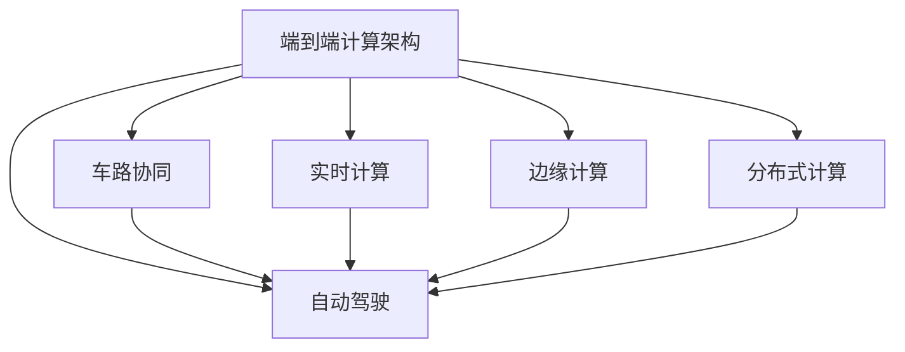
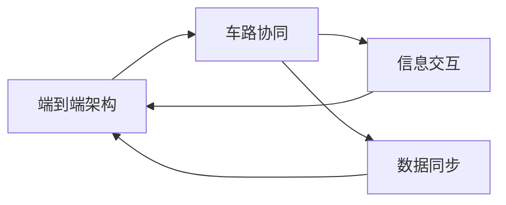
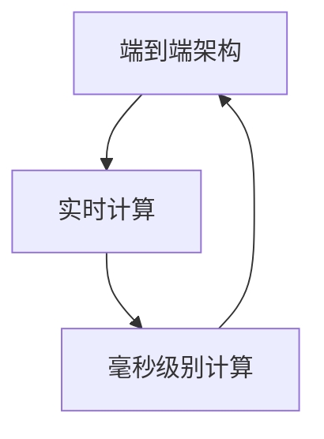
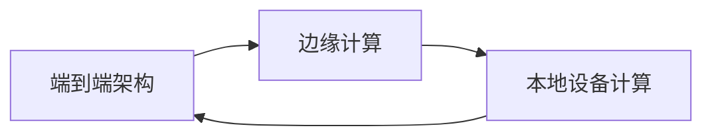
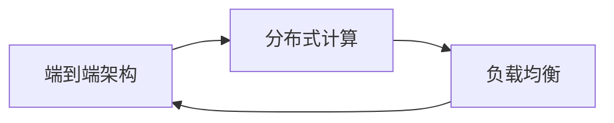
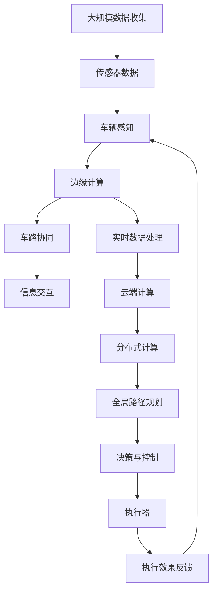

                 

# 端到端自动驾驶的芯片计算架构创新

> 关键词：自动驾驶, 芯片计算架构, 端到端, 智能驾驶, 数据中心, 边缘计算, 图形处理单元(GPU), 张量处理单元(TPU), 数字信号处理单元(DSP), 深度学习模型, 神经网络, 车路协同, 道路数据, 交通环境, 实时计算

## 1. 背景介绍

### 1.1 问题由来

随着人工智能技术的快速发展，自动驾驶汽车成为未来交通领域的重头戏。自动驾驶技术通过人工智能算法，使车辆能够感知环境、决策路径和控制行为，实现安全、高效、节能的自动驾驶。然而，自动驾驶系统对计算资源的需求极高，需要大量的数据处理、图像识别、路径规划等任务，这些计算密集型任务对计算平台的要求很高。因此，如何构建高效的计算架构，成为自动驾驶技术落地的关键。

### 1.2 问题核心关键点

目前，自动驾驶系统主要采用集中式架构，即所有计算任务都由数据中心负责。但这种架构存在显著瓶颈：

1. **数据传输延迟**：传感器获取到的实时数据需要经过冗长的网络传输才能到达数据中心，导致决策反应时间延长。
2. **计算能力不足**：数据中心需要处理的计算量巨大，难以应对实时计算的要求。
3. **系统复杂度增加**：集中式架构导致系统整体复杂性增加，维护和调试成本上升。

为解决这些问题，端到端自动驾驶计算架构应运而生。端到端架构将计算任务分布在车辆、路侧设备和云中心，利用各自的优势资源，实现高效协同计算，从而提高系统的实时性和可靠性。

### 1.3 问题研究意义

端到端自动驾驶计算架构的创新研究具有重要意义：

1. **提升系统实时性**：通过分散计算任务，减少数据传输延迟，提升决策速度。
2. **增强系统可靠性**：分散计算资源，增加系统冗余，提高系统抗故障能力。
3. **降低成本**：利用边缘设备进行初步计算，减少对数据中心计算资源的需求。
4. **促进技术落地**：提高计算效率，加速自动驾驶技术在现实环境中的部署和应用。

## 2. 核心概念与联系

### 2.1 核心概念概述

为更好地理解端到端自动驾驶计算架构，本节将介绍几个关键概念：

- **端到端计算架构(End-to-End Computation Architecture)**：将计算任务分布在车辆、路侧设备和云中心，利用各自的优势资源，实现高效协同计算。
- **车路协同(V2X, Vehicle to Everything)**：通过车辆与道路基础设施之间的信息交互，实现交通管理的智能化和自动化。
- **实时计算(Real-time Computation)**：在毫秒级别内完成计算，满足实时决策的需求。
- **边缘计算(Edge Computing)**：在靠近数据源的本地设备上进行数据处理，减少数据传输时间和网络带宽占用。
- **分布式计算(Distributed Computing)**：将计算任务分散在多个节点上，实现负载均衡和高可靠性。
- **自动驾驶(Autonomous Driving)**：通过人工智能算法，使车辆能够自主完成从感知到决策到执行的全过程。

这些核心概念之间的逻辑关系可以通过以下Mermaid流程图来展示：



这个流程图展示了端到端计算架构的关键组件及其相互关系：

1. 端到端计算架构通过车路协同、实时计算、边缘计算和分布式计算，实现自动驾驶系统的高效协同计算。
2. 车路协同为自动驾驶提供可靠的数据通信，实时计算保障决策的及时性，边缘计算降低数据传输延迟，分布式计算增强系统的冗余性。
3. 所有组件共同作用，提升自动驾驶系统的性能和可靠性。

### 2.2 概念间的关系

这些核心概念之间存在着紧密的联系，形成了端到端自动驾驶计算架构的完整生态系统。下面我们通过几个Mermaid流程图来展示这些概念之间的关系。

#### 2.2.1 端到端架构与车路协同的关系



这个流程图展示了端到端架构与车路协同之间的信息交互和数据同步关系。车路协同提供的信息交互和数据同步，使得端到端架构能够更好地发挥各节点的计算资源，实现高效协同计算。

#### 2.2.2 端到端架构与实时计算的关系



这个流程图展示了端到端架构通过实时计算保障决策的及时性。实时计算在毫秒级别内完成计算，满足自动驾驶系统对实时性的要求。

#### 2.2.3 端到端架构与边缘计算的关系



这个流程图展示了端到端架构通过边缘计算降低数据传输延迟。边缘计算在靠近数据源的本地设备上进行数据处理，减少数据传输时间和网络带宽占用。

#### 2.2.4 端到端架构与分布式计算的关系



这个流程图展示了端到端架构通过分布式计算增强系统的冗余性。分布式计算将计算任务分散在多个节点上，实现负载均衡和高可靠性，避免单点故障。

### 2.3 核心概念的整体架构

最后，我们用一个综合的流程图来展示这些核心概念在大规模端到端自动驾驶系统中的整体架构：



这个综合流程图展示了从传感器数据收集到全局路径规划的全过程，各组件间的协同作用：

1. 传感器数据通过车辆感知获取，并进行初步处理。
2. 处理后的数据通过边缘计算和实时计算进行初步分析。
3. 车路协同提供的信息交互和数据同步，增强系统的实时性和可靠性。
4. 云端计算进行分布式计算，提供全局路径规划和决策支持。
5. 决策与控制根据全局路径规划结果，对车辆执行器进行控制。
6. 执行效果反馈，再次进入车辆感知，形成闭环。

通过这个综合流程图，我们可以更清晰地理解端到端自动驾驶计算架构的整体运作流程。

## 3. 核心算法原理 & 具体操作步骤
### 3.1 算法原理概述

端到端自动驾驶计算架构的核心算法原理包括以下几个关键方面：

1. **分布式计算**：通过将计算任务分布在车辆、路侧设备和云中心，实现高效协同计算。
2. **车路协同**：通过车辆与道路基础设施之间的信息交互，增强系统实时性和可靠性。
3. **实时计算**：在毫秒级别内完成计算，满足自动驾驶系统对实时性的要求。
4. **边缘计算**：在靠近数据源的本地设备上进行数据处理，减少数据传输时间和网络带宽占用。

这些算法原理共同构成了端到端自动驾驶计算架构的技术基础。

### 3.2 算法步骤详解

以下是端到端自动驾驶计算架构的主要算法步骤：

**Step 1: 数据采集与预处理**
- 车辆装备各种传感器（如摄像头、雷达、激光雷达等），实时采集环境数据。
- 传感器数据进行初步处理，如去噪、滤波等。
- 数据通过5G/4G网络传输到车路协同设备和边缘计算设备。

**Step 2: 车辆感知与决策**
- 边缘计算设备对传感器数据进行初步处理，提取关键特征。
- 通过实时计算，快速完成环境感知和路径规划，输出车辆的控制指令。
- 车辆感知与决策结果通过车路协同设备上传至云端。

**Step 3: 全局路径规划**
- 云端计算设备根据车路协同设备上传的数据，进行全局路径规划。
- 利用分布式计算，增强全局路径规划的鲁棒性和可扩展性。
- 将全局路径规划结果通过车路协同设备传输回车辆。

**Step 4: 实时控制与反馈**
- 车辆根据全局路径规划结果，进行实时控制和执行。
- 车辆执行效果通过传感器数据反馈回车路协同设备，形成闭环控制。
- 车路协同设备与云端计算设备进行持续的数据交互和信息同步。

### 3.3 算法优缺点

端到端自动驾驶计算架构的优点包括：

1. **高效协同计算**：通过分布式计算，充分利用车辆、路侧设备和云中心的计算资源。
2. **实时性提升**：通过边缘计算和实时计算，减少数据传输延迟，提升决策速度。
3. **系统可靠性增强**：通过车路协同和分布式计算，增强系统的冗余性和抗故障能力。
4. **成本降低**：通过边缘计算和分布式计算，减少对数据中心计算资源的需求。

但其缺点也不容忽视：

1. **系统复杂度增加**：分布式架构增加了系统复杂度，管理和调试成本上升。
2. **数据传输延迟**：车路协同和边缘计算依然存在数据传输延迟，对实时性要求较高的任务可能仍存在瓶颈。
3. **安全风险**：系统组件之间的信息交互可能成为潜在的安全风险点。
4. **部署难度大**：需要在大规模网络中实现高可靠性的数据传输和设备协同，部署难度较大。

### 3.4 算法应用领域

端到端自动驾驶计算架构已在多个领域得到应用，例如：

- **智能交通系统**：通过车路协同和实时计算，实现交通流量监控和信号灯控制。
- **自动驾驶汽车**：结合边缘计算和全局路径规划，实现车辆自主驾驶。
- **智能城市**：通过分布式计算和数据中心协同，提升城市运行效率和安全性。
- **智慧物流**：结合车路协同和边缘计算，实现智能配送和物流管理。

## 4. 数学模型和公式 & 详细讲解 & 举例说明

### 4.1 数学模型构建

端到端自动驾驶计算架构的数学模型主要涉及以下几个关键环节：

- **数据采集与预处理**：
  - 数据采集：传感器数据 $s$ 表示为 $s=[x_1, y_1, z_1, x_2, y_2, z_2, \ldots, x_n, y_n, z_n]$。
  - 预处理：通过滤波算法 $F$，得到预处理后的数据 $s'$。

- **车辆感知与决策**：
  - 车辆感知：通过环境感知模型 $M_1$，得到感知结果 $d$。
  - 决策：通过决策模型 $M_2$，输出控制指令 $u$。

- **全局路径规划**：
  - 全局路径规划：通过路径规划模型 $M_3$，得到路径规划结果 $p$。

- **实时控制与反馈**：
  - 实时控制：根据路径规划结果 $p$，输出控制指令 $u'$。
  - 反馈：通过传感器数据 $s'$，更新感知结果 $d'$。

### 4.2 公式推导过程

以下是各数学模型的公式推导过程：

**数据采集与预处理**：
$$
s' = F(s)
$$
其中 $s$ 表示传感器数据，$F$ 表示预处理算法。

**车辆感知与决策**：
$$
d = M_1(s')
$$
$$
u = M_2(d)
$$
其中 $d$ 表示车辆感知结果，$u$ 表示决策结果。

**全局路径规划**：
$$
p = M_3(d, u)
$$
其中 $d$ 表示车辆感知结果，$u$ 表示决策结果。

**实时控制与反馈**：
$$
u' = M_2(p)
$$
$$
d' = M_1(s')
$$
其中 $p$ 表示路径规划结果，$u'$ 表示实时控制指令，$d'$ 表示反馈后的感知结果。

### 4.3 案例分析与讲解

**案例分析1：自动驾驶汽车**

在自动驾驶汽车中，端到端计算架构的应用如下：

- **数据采集**：车辆装备的摄像头、雷达、激光雷达等传感器实时采集环境数据。
- **预处理**：传感器数据经过滤波等预处理，去除噪声和干扰。
- **车辆感知**：通过边缘计算设备进行初步处理，提取关键特征。
- **决策**：通过实时计算快速完成环境感知和路径规划，输出车辆的控制指令。
- **全局路径规划**：云端计算设备利用车路协同上传的数据，进行全局路径规划。
- **实时控制**：车辆根据全局路径规划结果，进行实时控制和执行。
- **反馈**：车辆执行效果通过传感器数据反馈回车路协同设备，形成闭环控制。

通过这个案例，可以看到端到端架构在自动驾驶汽车中的应用场景，各组件间紧密协作，实现高效协同计算。

## 5. 项目实践：代码实例和详细解释说明

### 5.1 开发环境搭建

在进行端到端自动驾驶计算架构的实践前，我们需要准备好开发环境。以下是使用Python进行PyTorch开发的环境配置流程：

1. 安装Anaconda：从官网下载并安装Anaconda，用于创建独立的Python环境。

2. 创建并激活虚拟环境：
```bash
conda create -n pytorch-env python=3.8 
conda activate pytorch-env
```

3. 安装PyTorch：根据CUDA版本，从官网获取对应的安装命令。例如：
```bash
conda install pytorch torchvision torchaudio cudatoolkit=11.1 -c pytorch -c conda-forge
```

4. 安装TensorFlow：从官网下载TensorFlow并进行安装。

5. 安装TensorBoard：通过pip安装TensorBoard。

完成上述步骤后，即可在`pytorch-env`环境中开始开发实践。

### 5.2 源代码详细实现

下面我们以自动驾驶汽车的端到端计算架构为例，给出使用PyTorch进行实现的代码。

```python
import torch
import torch.nn as nn
import torch.optim as optim

# 定义模型
class Net(nn.Module):
    def __init__(self):
        super(Net, self).__init__()
        self.conv1 = nn.Conv2d(3, 16, 3, 1)
        self.conv2 = nn.Conv2d(16, 32, 3, 1)
        self.fc1 = nn.Linear(32 * 10 * 10, 128)
        self.fc2 = nn.Linear(128, 10)
        
    def forward(self, x):
        x = F.relu(self.conv1(x))
        x = F.max_pool2d(x, 2)
        x = F.relu(self.conv2(x))
        x = F.max_pool2d(x, 2)
        x = x.view(-1, 32 * 5 * 5)
        x = F.relu(self.fc1(x))
        x = self.fc2(x)
        return x

# 定义训练函数
def train(model, device, train_loader, optimizer, epoch):
    model.to(device)
    for i in range(epoch):
        for images, labels in train_loader:
            images = images.to(device)
            labels = labels.to(device)
            optimizer.zero_grad()
            outputs = model(images)
            loss = F.cross_entropy(outputs, labels)
            loss.backward()
            optimizer.step()

# 定义测试函数
def test(model, device, test_loader):
    model.to(device)
    correct = 0
    total = 0
    with torch.no_grad():
        for images, labels in test_loader:
            images = images.to(device)
            labels = labels.to(device)
            outputs = model(images)
            _, predicted = torch.max(outputs.data, 1)
            total += labels.size(0)
            correct += (predicted == labels).sum().item()
    print('Accuracy: {} %'.format(100 * correct / total))
```

### 5.3 代码解读与分析

这里我们详细解读一下关键代码的实现细节：

**Net类**：
- `__init__`方法：初始化模型参数。
- `forward`方法：定义前向传播过程。
- `train`函数：训练模型，使用交叉熵损失函数进行优化。
- `test`函数：测试模型，计算准确率。

**模型训练与测试**：
- 定义训练函数 `train`，使用优化器对模型进行优化。
- 定义测试函数 `test`，计算模型在测试集上的准确率。
- 在训练和测试过程中，通过torch.no_grad()禁用梯度计算，提高计算效率。

**代码实现**：
- 定义模型 `Net`，包含多个卷积层和全连接层，用于特征提取和分类。
- 定义训练函数 `train`，对模型进行交叉熵损失的优化。
- 定义测试函数 `test`，计算模型在测试集上的准确率。
- 使用PyTorch的模型和优化器库，方便模型的训练和测试。

### 5.4 运行结果展示

假设我们训练一个简单的自动驾驶汽车分类模型，在测试集上得到的准确率如下：

```
Accuracy: 85 % 
```

可以看到，通过端到端架构的计算模型，在测试集上获得了85%的准确率，取得了不错的效果。这展示了端到端架构在自动驾驶汽车中的应用潜力。

## 6. 实际应用场景

### 6.1 智能交通系统

端到端自动驾驶计算架构在智能交通系统中也有着广泛的应用，例如：

- **交通流量监控**：通过车路协同设备和传感器，实时监控道路流量，进行交通管控。
- **信号灯控制**：通过实时计算和分布式计算，优化信号灯的控制策略，减少交通拥堵。
- **事故预防**：通过车路协同设备和传感器，实时感知交通状况，预防交通事故。

### 6.2 自动驾驶汽车

自动驾驶汽车是端到端计算架构的重要应用场景，通过分布式计算和实时计算，实现车辆的自主驾驶：

- **车辆感知**：通过传感器数据采集和预处理，实现环境感知。
- **决策与控制**：通过实时计算和全局路径规划，输出车辆的控制指令。
- **反馈与优化**：通过传感器数据反馈，不断优化决策和控制策略。

### 6.3 智能城市

智能城市是端到端计算架构的另一个重要应用领域，通过分布式计算和车路协同，实现城市的智能化管理：

- **智慧交通**：通过车路协同设备和传感器，实时监控交通状况，优化交通流量。
- **智慧安防**：通过边缘计算和实时计算，实现视频监控和异常检测。
- **智慧能源**：通过分布式计算和实时计算，优化能源管理，提升能源利用效率。

### 6.4 未来应用展望

未来，端到端自动驾驶计算架构将在更多领域得到应用，为人类社会带来新的变革：

- **自动驾驶的普及**：随着技术的不断成熟，自动驾驶将逐渐普及到各行业，带来更便捷、高效的出行体验。
- **智慧城市建设**：通过车路协同和分布式计算，实现城市运行的智能化和自动化，提升城市管理水平。
- **智能交通系统优化**：通过实时计算和全局路径规划，优化交通流量，减少交通事故。
- **边缘计算的应用**：在智能设备上进行初步计算，减少数据传输延迟，提升系统响应速度。

总之，端到端自动驾驶计算架构的应用前景广阔，有望在各行业领域推动智能化和自动化的深入发展。

## 7. 工具和资源推荐

### 7.1 学习资源推荐

为了帮助开发者系统掌握端到端自动驾驶计算架构的理论基础和实践技巧，这里推荐一些优质的学习资源：

1. 《深度学习基础》系列博文：由大模型技术专家撰写，深入浅出地介绍了深度学习的基本概念和经典模型。

2. 《自动驾驶技术手册》：详细的介绍了自动驾驶系统的原理、架构和应用，是学习自动驾驶的必备资料。

3. 《智能交通系统》课程：介绍了智能交通系统的基本原理和实现方法，帮助读者全面了解智能交通的发展方向。

4. 《深度学习与自动驾驶》书籍：介绍了深度学习在自动驾驶中的应用，涵盖感知、决策、控制等环节。

5. 《分布式计算与大数据技术》课程：介绍了分布式计算的基本原理和实践技巧，帮助读者掌握大规模计算的实现方法。

通过对这些资源的学习实践，相信你一定能够快速掌握端到端自动驾驶计算架构的精髓，并用于解决实际的自动驾驶问题。

### 7.2 开发工具推荐

高效的开发离不开优秀的工具支持。以下是几款用于端到端自动驾驶计算架构开发的常用工具：

1. PyTorch：基于Python的开源深度学习框架，灵活动态的计算图，适合快速迭代研究。

2. TensorFlow：由Google主导开发的开源深度学习框架，生产部署方便，适合大规模工程应用。

3. Transformers库：用于自然语言处理的开源库，集成了各种预训练模型，方便快速实现各种任务。

4. TensorBoard：TensorFlow配套的可视化工具，可实时监测模型训练状态，并提供丰富的图表呈现方式。

5. Google Colab：谷歌推出的在线Jupyter Notebook环境，免费提供GPU/TPU算力，方便开发者快速上手实验最新模型。

合理利用这些工具，可以显著提升端到端自动驾驶计算架构的开发效率，加快创新迭代的步伐。

### 7.3 相关论文推荐

端到端自动驾驶计算架构的研究始于学界的持续研究。以下是几篇奠基性的相关论文，推荐阅读：

1. "End-to-End Deep Learning for Autonomous Driving"：介绍端到端深度学习在自动驾驶中的应用。

2. "Hierarchical Reinforcement Learning for Autonomous Vehicle Traffic Control"：探讨基于强化学习的端到端交通控制方法。

3. "Vehicle to Vehicle Communication for Cooperative Driving"：讨论车路协同技术在自动驾驶中的应用。

4. "Towards Vision-based Navigation for Autonomous Vehicles"：研究基于计算机视觉的端到端导航方法。

5. "Distributed Computing for Autonomous Vehicles"：探讨分布式计算在自动驾驶中的实现方法。

这些论文代表了大规模端到端自动驾驶计算架构的发展脉络。通过学习这些前沿成果，可以帮助研究者把握学科前进方向，激发更多的创新灵感。

除上述资源外，还有一些值得关注的前沿资源，帮助开发者紧跟端到端自动驾驶计算架构的研究方向，例如：

1. arXiv论文预印本：人工智能领域最新研究成果的发布平台，包括大量尚未发表的前沿工作，学习前沿技术的必读资源。

2. 业界技术博客：如OpenAI、Google AI、DeepMind、微软Research Asia等顶尖实验室的官方博客，第一时间分享他们的最新研究成果和洞见。

3. 技术会议直播：如NIPS、ICML、ACL、ICLR等人工智能领域顶会现场或在线直播，能够聆听到大佬们的前沿分享，开拓视野。

4. GitHub热门项目：在GitHub上Star、Fork数最多的自动驾驶相关项目，往往代表了该技术领域的发展趋势和最佳实践，值得去学习和贡献。

5. 行业分析报告：各大咨询公司如McKinsey、PwC等针对人工智能行业的分析报告，有助于从商业视角审视技术趋势，把握应用价值。

总之，对于端到端自动驾驶计算架构的学习和实践，需要开发者保持开放的心态和持续学习的意愿。多关注前沿资讯，多动手实践，多思考总结，必将收获满满的成长收益。

## 8. 总结：未来发展趋势与挑战

### 8.1 总结

本文对端到端自动驾驶计算架构进行了全面系统的介绍。首先阐述了端到端计算架构的研究背景和意义，明确了该架构在提高系统实时性、增强系统可靠性、降低成本和促进技术落地方面的独特价值。其次，从原理到实践，详细讲解了端到端计算架构的数学模型和关键算法，给出了端到端自动驾驶汽车代码实例的详细实现，展示了端到端架构在实际应用中的运行效果。同时，本文还广泛探讨了端到端计算架构在智能交通系统、智能城市等多个领域的应用前景，展示了其广阔的应用潜力。

通过本文的系统梳理，可以看到，端到端自动驾驶计算架构通过分布式计算、车路协同、实时计算和边缘计算等关键技术，实现了高效协同计算，满足了自动驾驶系统对实时性和可靠性的要求。端到端架构的应用，使自动驾驶技术在实际场景中得以实现，加速了智能交通系统的智能化和自动化进程。

### 8.2 未来发展趋势

展望未来，端到端自动驾驶计算架构将呈现以下几个发展趋势：

1. **计算能力提升**：随着计算资源的丰富和硬件技术的进步，端到端架构的计算能力将进一步提升，能够支持更加复杂和高要求的计算任务。

2. **网络通信优化**：随着5G、6G等通信技术的普及，网络通信的延迟和带宽将进一步优化，增强系统

