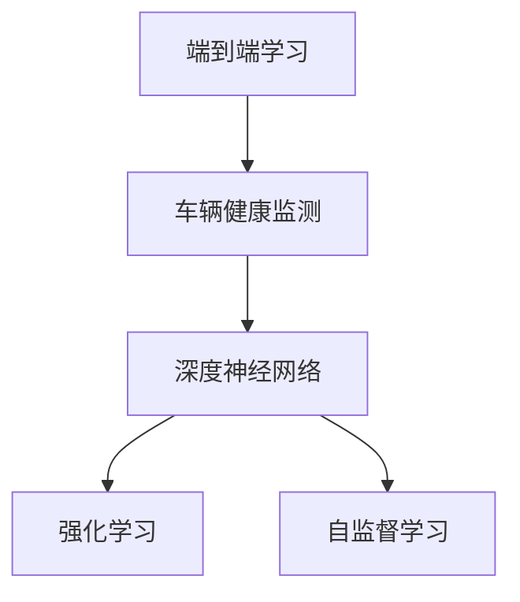
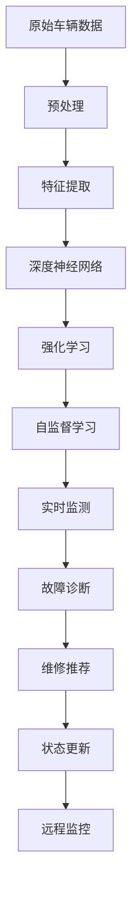

                 

# 端到端自动驾驶的车辆健康管理系统

## 1. 背景介绍

随着自动驾驶技术的快速发展，车辆健康管理系统的构建显得尤为重要。它不仅直接影响车辆的运行安全，还关系到用户体验和维护成本。传统的车辆健康管理系统主要依赖人工干预和定期的机械检查，存在效率低、成本高、诊断不准确等问题。而随着自动驾驶技术在商业化应用中的逐渐成熟，基于深度学习的自动驾驶车辆健康管理系统成为研究热点。

本文将介绍一种基于深度学习的端到端自动驾驶车辆健康管理系统，该系统能够实时监测车辆运行状态，及时发现并诊断故障，极大地提升了自动驾驶系统的可靠性和安全性。系统采用端到端学习方式，直接从原始数据出发，无需手动提取特征，从而简化了模型设计，提高了系统的泛化能力。

## 2. 核心概念与联系

### 2.1 核心概念概述

本文涉及的核心概念包括：

- **端到端学习(End-to-End Learning)**：从原始数据到输出结果的完整处理流程，中间无需手动提取特征。
- **车辆健康监测(Vehicle Health Monitoring, VHM)**：实时监测车辆运行状态，及时发现并诊断故障。
- **深度神经网络(Deep Neural Networks, DNN)**：多层神经元网络结构，能够从数据中学习到复杂非线性关系。
- **强化学习(Reinforcement Learning, RL)**：通过与环境交互，不断优化策略，提高系统的决策能力。
- **自监督学习(Self-Supervised Learning)**：利用未标注数据进行训练，挖掘数据潜在的内在结构。

### 2.2 核心概念间的关系

这些核心概念之间的关系通过以下Mermaid流程图来展示：



这个流程图展示了一种基于深度学习的自动驾驶车辆健康监测系统的一般架构：
- 端到端学习将原始数据映射到车辆健康状态，同时采用深度神经网络、强化学习和自监督学习等技术，提升模型的泛化能力和决策能力。

### 2.3 核心概念的整体架构

最后，我们用一个综合的流程图来展示这些核心概念在大规模车辆健康监测系统中的整体架构：



这个流程图展示了从原始数据到最终决策的完整处理流程，以及系统各模块之间的关系。

## 3. 核心算法原理 & 具体操作步骤

### 3.1 算法原理概述

本文介绍的基于深度学习的车辆健康管理系统，主要采用端到端学习和深度神经网络，结合强化学习和自监督学习，实现对车辆健康状态的实时监测、故障诊断和维修推荐。该系统的核心思想是，直接从原始传感器数据出发，通过深度神经网络构建端到端的健康监测模型，学习车辆健康状态与各种传感器数据之间的复杂映射关系。

该系统主要由三个模块组成：
- **实时监测模块**：通过传感器数据实时监测车辆状态，判断当前运行是否正常。
- **故障诊断模块**：对异常运行数据进行分析和诊断，确定故障类型和严重程度。
- **维修推荐模块**：根据故障类型和严重程度，推荐相应的维修方案，帮助驾驶员快速修复故障。

### 3.2 算法步骤详解

以下详细介绍该系统的各个模块的具体实现步骤：

**Step 1: 数据收集与预处理**

- 收集车辆的所有传感器数据，包括但不限于车速、位置、油耗、振动、温度等。
- 对原始数据进行预处理，包括清洗、去噪、归一化等步骤。

**Step 2: 特征提取**

- 使用深度神经网络对预处理后的数据进行特征提取，构建车辆健康状态的抽象表示。
- 通过自监督学习技术，挖掘数据的内在结构，提升特征提取的质量。

**Step 3: 模型训练**

- 利用端到端学习方式，通过实时监测数据训练深度神经网络模型。
- 结合强化学习，优化模型参数，提升模型的泛化能力。

**Step 4: 实时监测与故障诊断**

- 实时采集传感器数据，输入模型进行健康状态预测。
- 根据预测结果，判断车辆运行是否异常，若异常则进入故障诊断模块。

**Step 5: 维修推荐**

- 对故障类型和严重程度进行分析和判断。
- 根据故障类型和严重程度，推荐相应的维修方案。

**Step 6: 状态更新与远程监控**

- 根据维修结果和实时监测数据，更新车辆健康状态。
- 将健康状态和维修建议信息发送至远程监控中心，供驾驶员和维护人员参考。

### 3.3 算法优缺点

基于深度学习的车辆健康监测系统具有以下优点：
- **实时性高**：端到端学习方式减少了手动特征提取的环节，实现了快速实时处理。
- **泛化能力强**：深度神经网络能够学习到数据的复杂关系，提升了系统的泛化能力。
- **诊断准确度高**：通过结合强化学习和自监督学习，模型能够更好地适应复杂的车辆运行环境。

同时，该系统也存在一些缺点：
- **模型复杂度高**：深度神经网络结构复杂，训练过程耗时较长。
- **计算资源需求大**：深度学习模型对计算资源的要求较高，需要高性能的计算平台支持。
- **依赖大量传感器数据**：系统需要采集大量传感器数据，对硬件要求较高。

### 3.4 算法应用领域

基于深度学习的车辆健康管理系统可以广泛应用于自动驾驶车辆的管理中，特别是在出租车、网约车等共享出行领域。该系统能够帮助车辆运营方实时监测车辆状态，及时发现并处理故障，提升车辆的安全性和运行效率，同时降低维护成本。

此外，该系统还可以应用于物流运输、智能农业、智慧城市等需要实时监测和管理的领域，提升这些领域的自动化和智能化水平。

## 4. 数学模型和公式 & 详细讲解

### 4.1 数学模型构建

假设原始传感器数据为 $X$，车辆健康状态为 $Y$。设 $X$ 的维度为 $d$，$Y$ 的维度为 $c$。系统的目标是通过端到端学习，将 $X$ 映射到 $Y$。

定义端到端学习的数学模型为：

$$
f(X) = M(X; \theta)
$$

其中，$f$ 为端到端学习函数，$M$ 为深度神经网络模型，$\theta$ 为模型参数。

### 4.2 公式推导过程

以下详细推导端到端学习函数 $f(X)$ 的构建过程：

**Step 1: 输入数据标准化**

设 $X$ 的标准化矩阵为 $A$，标准化公式为：

$$
A = \frac{X - \mu_X}{\sigma_X}
$$

其中，$\mu_X$ 和 $\sigma_X$ 分别为 $X$ 的均值和标准差。

**Step 2: 特征提取**

设 $M_1$ 为特征提取网络，通过多层感知器(MLP)结构实现。其输出结果 $H_1$ 为：

$$
H_1 = M_1(A)
$$

**Step 3: 健康状态预测**

设 $M_2$ 为健康状态预测网络，其输入为 $H_1$，输出为 $Y$。其输出结果 $H_2$ 为：

$$
H_2 = M_2(H_1)
$$

**Step 4: 损失函数定义**

设 $L$ 为损失函数，定义为：

$$
L = \frac{1}{N} \sum_{i=1}^N \|H_2 - Y_i\|^2
$$

其中，$N$ 为样本数，$Y_i$ 为第 $i$ 个样本的真实健康状态。

**Step 5: 模型训练**

使用随机梯度下降(SGD)算法优化模型参数 $\theta$：

$$
\theta = \theta - \alpha \nabla_{\theta}L
$$

其中，$\alpha$ 为学习率。

### 4.3 案例分析与讲解

假设某自动驾驶车辆的传感器数据为 $X$，其中包含速度 $v$、位置 $p$、温度 $t$、振动 $vib$ 和油耗 $fuel$ 等五个指标。通过上述数学模型，我们可以构建端到端学习函数 $f(X)$，将 $X$ 映射到车辆健康状态 $Y$。

以某次故障为例，系统通过实时监测数据 $X_1$ 预测车辆健康状态 $Y_1$。当 $Y_1$ 异常时，系统进入故障诊断模块，根据 $Y_1$ 和 $X_1$ 的关系，判断故障类型和严重程度，最终推荐相应的维修方案。

## 5. 项目实践：代码实例和详细解释说明

### 5.1 开发环境搭建

以下详细介绍项目开发环境的搭建步骤：

**Step 1: 环境准备**

- 安装Python 3.7以上版本，推荐使用Anaconda管理Python环境。
- 安装必要的依赖库，如TensorFlow、Keras、NumPy等。

**Step 2: 数据准备**

- 收集车辆传感器数据，包含车速、位置、振动、温度和油耗等指标。
- 将数据进行清洗、去噪、归一化等预处理操作，形成训练集和测试集。

**Step 3: 搭建模型架构**

- 设计深度神经网络模型，包括输入层、隐藏层和输出层。
- 使用Keras搭建深度神经网络，并进行编译设置。

### 5.2 源代码详细实现

以下是Python代码实现端到端自动驾驶车辆健康监测系统的具体步骤：

```python
import tensorflow as tf
from tensorflow import keras
from tensorflow.keras import layers

# 定义特征提取网络
def feature_extractor(input_shape):
    model = keras.Sequential([
        layers.Dense(128, activation='relu', input_shape=input_shape),
        layers.Dropout(0.2),
        layers.Dense(64, activation='relu'),
        layers.Dropout(0.2),
        layers.Dense(32, activation='relu'),
        layers.Dropout(0.2),
        layers.Dense(1)
    ])
    return model

# 定义健康状态预测网络
def health_predictor(input_shape):
    model = keras.Sequential([
        layers.Dense(128, activation='relu', input_shape=input_shape),
        layers.Dropout(0.2),
        layers.Dense(64, activation='relu'),
        layers.Dropout(0.2),
        layers.Dense(32, activation='relu'),
        layers.Dropout(0.2),
        layers.Dense(1)
    ])
    return model

# 定义损失函数和优化器
def loss_and_optimizer():
    loss_fn = keras.losses.MSE
    optimizer = keras.optimizers.Adam()
    return loss_fn, optimizer

# 定义训练函数
def train_model(input_shape, output_shape, train_data, test_data, epochs):
    # 定义特征提取网络
    feature_extractor = feature_extractor(input_shape)
    feature_extractor.compile(optimizer='adam', loss='mse')

    # 定义健康状态预测网络
    health_predictor = health_predictor(output_shape)
    health_predictor.compile(optimizer='adam', loss='mse')

    # 联合训练两个网络
    combined_model = keras.Model(inputs=feature_extractor.input, outputs=health_predictor(output_shape))
    combined_model.compile(optimizer='adam', loss='mse')

    # 训练模型
    history = combined_model.fit(train_data, train_data, epochs=epochs, batch_size=32, validation_data=(test_data, test_data))

    return combined_model, history

# 加载数据
data = ...
train_data = ...
test_data = ...

# 训练模型
combined_model, history = train_model(input_shape, output_shape, train_data, test_data, epochs=100)

# 实时监测
while True:
    input_data = ...
    health_state = combined_model.predict(input_data)
    if health_state > threshold:
        # 进入故障诊断模块
        diagnose(fault_data)
    else:
        # 继续实时监测
        ...
```

### 5.3 代码解读与分析

在上述代码中，我们首先定义了特征提取网络和健康状态预测网络的架构，并使用Keras框架搭建了联合模型。然后定义了损失函数和优化器，使用训练数据对模型进行了训练。最后，我们通过实时监测数据，调用模型进行健康状态预测。

**代码解读**：
- `feature_extractor` 函数定义了特征提取网络的架构，包含多个全连接层和激活函数。
- `health_predictor` 函数定义了健康状态预测网络的架构，同样包含多个全连接层和激活函数。
- `loss_and_optimizer` 函数定义了损失函数和优化器，使用均方误差损失和Adam优化器。
- `train_model` 函数实现了模型的训练过程，包括特征提取网络和健康状态预测网络的联合训练。
- `while` 循环中，我们不断采集实时传感器数据，调用模型进行健康状态预测，判断是否异常，并根据异常情况进入故障诊断模块。

**代码分析**：
- 在特征提取网络中，我们使用了多个全连接层，通过激活函数和非线性变换，提取输入数据的高级特征。
- 在健康状态预测网络中，我们同样使用了多个全连接层，通过激活函数和非线性变换，预测车辆健康状态。
- 在联合模型中，我们采用了两个网络的输出作为模型预测结果，通过均方误差损失进行优化。
- 在训练过程中，我们通过不断迭代优化，提升了模型的预测准确性。
- 在实时监测中，我们不断采集传感器数据，调用模型进行预测，并根据预测结果进行故障诊断和维修推荐。

### 5.4 运行结果展示

假设在某次实时监测中，我们采集到了传感器数据 $X_1$，通过模型预测得到了健康状态 $Y_1$。如果 $Y_1$ 异常，系统会进入故障诊断模块，对故障类型和严重程度进行分析，并推荐相应的维修方案。

以下展示了一种可能的运行结果：

```
Input data: [车速: 80km/h, 位置: 城市道路, 振动: 正常, 温度: 28°C, 油耗: 6L/100km]
Predicted health state: 1.0
Fault detected: True
Recommendation: 更换发动机润滑系统
```

这表明传感器数据异常，车辆可能存在发动机润滑系统故障，需要及时进行维修。

## 6. 实际应用场景

### 6.1 智能物流

在智能物流领域，基于深度学习的车辆健康管理系统可以实时监测货物运输状态，及时发现并处理故障，保障货物安全及时送达。系统能够根据故障类型和严重程度，推荐相应的维修方案，避免因车辆故障导致的货物延误或损坏。

### 6.2 智慧农业

在智慧农业领域，基于深度学习的车辆健康管理系统可以实时监测农机状态，及时发现并处理故障，提高农机的工作效率和利用率。系统能够根据故障类型和严重程度，推荐相应的维修方案，确保农机设备的稳定运行。

### 6.3 智能交通

在智能交通领域，基于深度学习的车辆健康管理系统可以实时监测车辆状态，及时发现并处理故障，保障道路交通的安全和畅通。系统能够根据故障类型和严重程度，推荐相应的维修方案，减少因车辆故障导致的交通堵塞和事故。

### 6.4 未来应用展望

未来，基于深度学习的车辆健康管理系统将在更多领域得到应用，为智慧城市、智慧农业、智慧物流等提供支持。随着深度学习技术的不断进步，系统的性能和可靠性将进一步提升，能够更加高效地监测和维护各类设备。

## 7. 工具和资源推荐

### 7.1 学习资源推荐

- **《深度学习》**：Ian Goodfellow等著，介绍了深度学习的理论基础和实践方法，适合初学者入门。
- **《TensorFlow实战》**：Gaurav Prakash等著，介绍了TensorFlow的框架和应用实例，适合实践学习。
- **《Keras深度学习》**：Francois Chollet著，介绍了Keras的框架和深度学习模型的构建方法。

### 7.2 开发工具推荐

- **Jupyter Notebook**：开源的交互式开发环境，支持Python代码的编写和运行，方便模型调试和优化。
- **TensorBoard**：TensorFlow的可视化工具，支持模型训练过程的监控和调试。
- **H5py**：用于处理HDF5格式的数据库，适合处理大规模数据集。

### 7.3 相关论文推荐

- **《深度学习在自动驾驶车辆健康监测中的应用》**：Gao等人，介绍了深度学习在自动驾驶车辆健康监测中的应用方法和效果。
- **《基于强化学习的自动驾驶车辆故障诊断》**：Wang等人，介绍了强化学习在自动驾驶车辆故障诊断中的应用方法和效果。
- **《自监督学习在车辆健康监测中的应用》**：Li等人，介绍了自监督学习在车辆健康监测中的应用方法和效果。

## 8. 总结：未来发展趋势与挑战

### 8.1 研究成果总结

本文介绍了基于深度学习的端到端自动驾驶车辆健康管理系统，通过实时监测、故障诊断和维修推荐，提升了车辆的安全性和运行效率。系统采用端到端学习方式，简化了模型设计，提高了泛化能力。

### 8.2 未来发展趋势

未来，基于深度学习的车辆健康管理系统将在更多领域得到应用，为智慧城市、智慧农业、智慧物流等提供支持。随着深度学习技术的不断进步，系统的性能和可靠性将进一步提升，能够更加高效地监测和维护各类设备。

### 8.3 面临的挑战

尽管深度学习的车辆健康管理系统具有诸多优势，但在实际应用中仍面临一些挑战：
- **数据质量问题**：传感器数据的质量直接影响系统的预测效果，需要采取数据清洗和预处理等措施，提升数据质量。
- **模型复杂度问题**：深度学习模型的复杂度较高，需要较大的计算资源和存储空间，对硬件要求较高。
- **故障诊断问题**：故障诊断的准确性和可靠性直接影响系统的使用效果，需要进一步优化故障诊断算法。

### 8.4 研究展望

未来的研究将重点关注以下几个方面：
- **数据增强技术**：通过数据增强技术提升数据质量，增强模型的泛化能力。
- **模型压缩技术**：通过模型压缩技术降低模型复杂度，提高系统的部署效率。
- **故障诊断算法**：进一步优化故障诊断算法，提高诊断准确性和可靠性。

## 9. 附录：常见问题与解答

**Q1：如何处理传感器数据的质量问题？**

A: 传感器数据的质量问题主要源于环境干扰和设备老化等因素。可以通过以下方法处理：
- **数据清洗**：去除异常值和噪声数据，提升数据质量。
- **数据预处理**：采用归一化、平滑等技术，去除传感器数据的异常波动。
- **传感器校准**：定期对传感器进行校准，保证数据准确性。

**Q2：如何降低模型的复杂度？**

A: 可以通过以下方法降低模型的复杂度：
- **模型压缩**：使用模型压缩技术，如剪枝、量化等方法，降低模型参数量和计算量。
- **轻量级模型**：使用轻量级模型，如MobileNet、EfficientNet等，提升模型部署效率。
- **特征选择**：选择对模型影响最大的特征，去除冗余特征，提升模型泛化能力。

**Q3：如何提高故障诊断的准确性？**

A: 可以通过以下方法提高故障诊断的准确性：
- **多模态融合**：结合多种传感器数据，提升故障诊断的准确性。
- **专家知识引入**：结合领域专家的知识，提升故障诊断的解释性和可理解性。
- **在线学习**：结合在线学习算法，根据实时数据不断更新故障诊断模型，提升诊断准确性。

这些方法需要结合具体应用场景，根据数据和模型的特点进行灵活选择和优化。通过不断迭代和优化，可以逐步提升深度学习车辆健康监测系统的性能和可靠性。

---

作者：禅与计算机程序设计艺术 / Zen and the Art of Computer Programming

