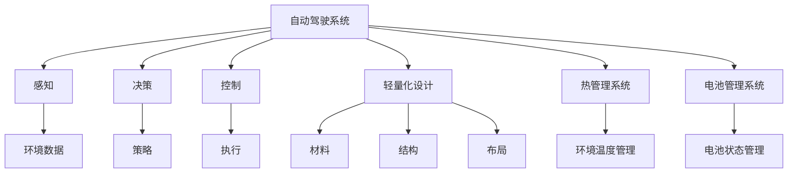
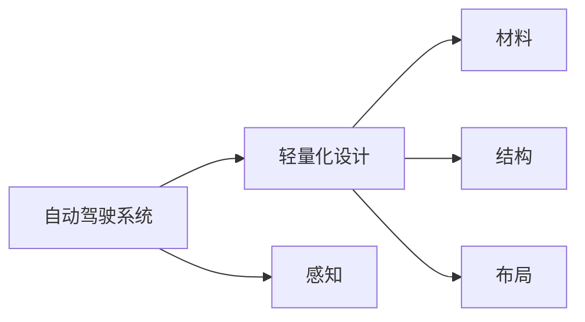
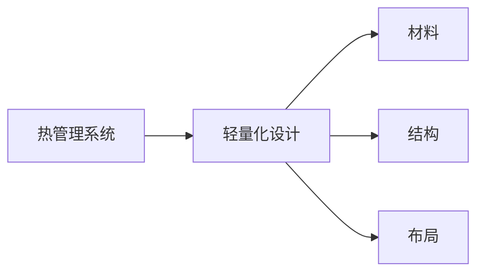
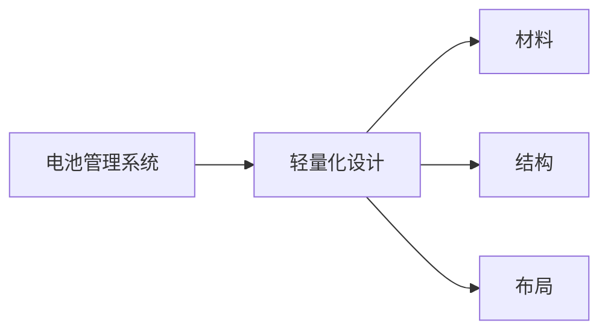
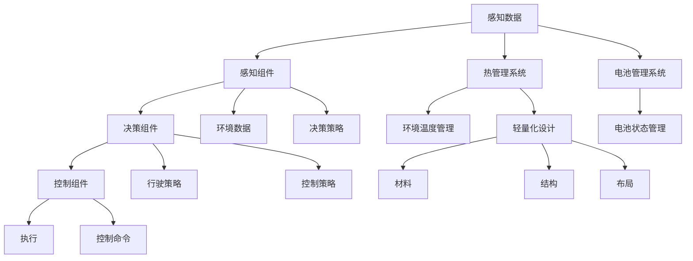

                 

# 端到端自动驾驶的车辆轻量化设计

## 1. 背景介绍

随着自动驾驶技术的快速发展，自动驾驶车辆的设计与传统驾驶车辆相比，有了很大的不同。除了自动驾驶系统，还需要考虑车辆的结构、材料、控制等方面。其中，车辆轻量化设计是提高车辆燃油效率、提升行驶性能和提高安全性的一个关键因素。

轻量化设计涉及多学科的交叉，包括机械工程、电子工程、控制工程、计算机科学等。文章将从自动驾驶系统及车辆设计的角度，探讨轻量化设计的原理、方法及实现技术，为自动驾驶车辆的设计提供参考。

## 2. 核心概念与联系

### 2.1 核心概念概述

为了更好地理解自动驾驶车辆轻量化设计的相关概念，本节将介绍几个密切相关的核心概念：

- **自动驾驶系统**：包括感知、决策和控制三大组件，其中感知组件通过传感器（如雷达、激光雷达、摄像头等）获取车辆周围环境信息；决策组件基于感知信息生成行驶策略；控制组件执行决策策略，驱动车辆行驶。
- **轻量化设计**：通过优化材料、结构、布局等，使车辆在满足性能要求的前提下，尽可能减少重量，从而提高燃油效率、降低排放、提升操控性及安全性。
- **热管理系统**：用于解决自动驾驶车辆在高强度环境下产生的热量问题，保证车辆内部设备正常运行。
- **电池管理系统**：用于监控和管理电池的充放电状态，以保证电池的安全性和高效利用。

这些概念之间的逻辑关系可以通过以下Mermaid流程图来展示：



这个流程图展示了自动驾驶系统与轻量化设计之间的联系：自动驾驶系统需要轻量化设计来实现高效运行；轻量化设计涉及材料、结构及布局等多个方面，需要综合考虑；热管理和电池管理也是轻量化设计的一部分，有助于提高车辆整体性能。

### 2.2 概念间的关系

这些核心概念之间存在着紧密的联系，形成了自动驾驶车辆设计的完整框架。下面我们通过几个Mermaid流程图来展示这些概念之间的关系。

#### 2.2.1 自动驾驶系统与轻量化设计的关系



这个流程图展示了自动驾驶系统与轻量化设计之间的联系：感知组件、决策组件和控制组件的设计都需要考虑轻量化设计的要求；轻量化设计涉及到材料的选择、结构的优化及布局的合理性。

#### 2.2.2 热管理与轻量化设计的关系



这个流程图展示了热管理系统与轻量化设计之间的联系：轻量化设计涉及到材料和结构的选择，需要考虑热管理系统对其的影响；热管理系统也需要通过轻量化设计来提高其效率和可靠性。

#### 2.2.3 电池管理与轻量化设计的关系



这个流程图展示了电池管理系统与轻量化设计之间的联系：轻量化设计需要考虑电池管理系统的空间和重量要求；电池管理系统需要通过轻量化设计来提高系统的整体效率和安全性。

### 2.3 核心概念的整体架构

最后，我们用一个综合的流程图来展示这些核心概念在大规模自动驾驶车辆轻量化设计中的整体架构：



这个综合流程图展示了感知、决策、控制等自动驾驶系统组件与轻量化设计之间的联系：感知组件获取的环境数据需要经过热管理和电池管理的处理；决策组件和控制组件的策略和命令需要通过轻量化设计来实现。轻量化设计涉及到材料、结构及布局等多个方面，需要综合考虑热管理和电池管理的性能要求。

## 3. 核心算法原理 & 具体操作步骤
### 3.1 算法原理概述

自动驾驶车辆的轻量化设计，是一个涉及多学科的综合性问题，包括材料科学、结构设计、热管理和电池管理等多个方面。其核心思想是通过优化设计和合理选材，使车辆在满足性能要求的前提下，尽可能减少重量，提高燃油效率、降低排放、提升操控性及安全性。

轻量化设计的目标是使车辆的总重量减少20%到30%，同时保持或提升车辆的性能。常用的轻量化材料包括铝、碳纤维、高强度钢等，不同的材料有着不同的物理和化学特性，需要根据具体应用场景进行选择。

### 3.2 算法步骤详解

轻量化设计的步骤主要包括以下几个环节：

**Step 1: 需求分析**
- 确定车辆的功能和性能要求，如燃油效率、加速性能、安全性等。
- 根据需求分析，制定轻量化设计的目标和指标。

**Step 2: 材料选择**
- 根据车辆的使用环境和性能要求，选择合适的材料，如铝、碳纤维、高强度钢等。
- 考虑材料的成本和可获得性，进行综合评估。

**Step 3: 结构设计**
- 根据选定的材料，进行结构设计，优化车辆的各个部件，如底盘、车身、悬挂等。
- 使用CAE软件进行结构分析和仿真，验证设计的可行性。

**Step 4: 热管理设计**
- 根据车辆的使用环境，设计热管理系统，如冷却系统、通风系统等。
- 优化热管理系统的布局和设计，确保高效运行。

**Step 5: 电池管理设计**
- 根据车辆的使用需求，设计电池管理系统，如充电系统、电池监控系统等。
- 优化电池管理系统的布局和设计，确保电池的高效利用和安全性。

**Step 6: 轻量化设计验证**
- 使用CAE软件进行轻量化设计的验证，确保设计的合理性和可行性。
- 根据验证结果进行优化调整。

**Step 7: 制造与安装**
- 根据轻量化设计的方案，进行车辆的制造和安装。
- 进行现场验证，确保车辆的性能和安全性。

### 3.3 算法优缺点

轻量化设计的优点包括：
- 提高燃油效率，降低排放，提升车辆的环保性能。
- 提高车辆的操控性和稳定性，提升驾驶舒适性。
- 减少车辆重量，提升行驶速度和加速性能。

轻量化设计的缺点包括：
- 设计复杂，需要综合考虑多个因素。
- 成本较高，部分轻量化材料较为昂贵。
- 设计和制造过程中可能存在技术难度。

### 3.4 算法应用领域

轻量化设计广泛应用于汽车、飞机、船舶等交通工具的设计和制造中。在自动驾驶车辆领域，轻量化设计尤为重要，能够显著提升车辆的性能和安全性，减少能源消耗。轻量化设计不仅可以应用于自动驾驶车辆的车身、底盘等结构部分，还可以应用于电池系统、热管理系统等关键部件，提升整个车辆的综合性能。

## 4. 数学模型和公式 & 详细讲解  
### 4.1 数学模型构建

轻量化设计的数学模型构建主要包括以下几个方面：

- 材料性能模型：用于描述不同材料的物理和化学特性。
- 结构强度模型：用于描述车辆结构的强度和刚度。
- 热管理模型：用于描述热管理系统的工作原理和性能。
- 电池管理模型：用于描述电池的充放电性能和状态管理。

下面以结构强度模型为例，进行详细介绍。

### 4.2 公式推导过程

假设车辆的结构材料为高强度钢，结构长度为L，宽度为W，高度为H。根据材料性能模型和结构强度模型，可以构建结构强度数学模型：

$$
\sigma = \frac{F}{A}
$$

其中，$\sigma$为材料的应力，$F$为结构的载荷，$A$为结构的截面积。

根据结构强度模型，可以推导出结构的强度：

$$
\sigma = \frac{F}{A} = \frac{N}{I}
$$

其中，$N$为结构的载荷，$I$为结构的惯性矩。

### 4.3 案例分析与讲解

假设我们需要设计一款自动驾驶电动车的底盘结构，其长度为4米，宽度为1.5米，高度为0.8米。根据车辆的性能要求，我们需要确定底盘结构的材料和设计方案。

首先，根据车辆的重量和性能要求，确定底盘结构需要承受的最大载荷。然后，根据材料的强度和刚度性能，选择适当的材料，如高强度钢。

接着，使用CAE软件进行结构设计，计算结构的惯性矩和截面积。根据计算结果，优化结构的布局和设计，确保结构的强度和刚度符合性能要求。

最后，根据轻量化设计的目标，进一步优化材料和结构设计，减少结构的重量，提升车辆的燃油效率和性能。

## 5. 项目实践：代码实例和详细解释说明
### 5.1 开发环境搭建

在进行轻量化设计项目实践前，我们需要准备好开发环境。以下是使用Python进行CAE软件开发的环境配置流程：

1. 安装Anaconda：从官网下载并安装Anaconda，用于创建独立的Python环境。

2. 创建并激活虚拟环境：
```bash
conda create -n py-env python=3.8 
conda activate py-env
```

3. 安装必要的软件包：
```bash
conda install sympy matplotlib numpy pandas scikit-learn sympy matplotlib numpy pandas scikit-learn jupyter notebook ipython
```

4. 安装CAE软件：
```bash
conda install pycae
```

5. 安装TensorFlow：
```bash
pip install tensorflow
```

完成上述步骤后，即可在`py-env`环境中开始轻量化设计项目实践。

### 5.2 源代码详细实现

下面我们以自动驾驶车辆轻量化设计为例，给出使用CAE软件进行轻量化设计的PyTorch代码实现。

首先，定义轻量化设计的数学模型和相关参数：

```python
import sympy as sp

# 定义车辆参数
L = sp.Symbol('L', positive=True)  # 长度
W = sp.Symbol('W', positive=True)  # 宽度
H = sp.Symbol('H', positive=True)  # 高度

# 定义材料的属性
E = 2.1e11  # 弹性模量
v = 0.3     # 泊松比
rho = 7800  # 密度

# 定义载荷
F = 1e4     # 载荷

# 计算材料的强度
sigma = F / (L * W * H)
```

然后，定义轻量化设计的目标函数和约束条件：

```python
# 定义目标函数
target = sp.symbols('target')
objective = sp.Minimize(target)

# 定义约束条件
constraints = [
    L > 0,
    W > 0,
    H > 0,
    L > W,
    L > H,
    W > H,
    rho * L * W * H > target  # 最小化重量
]

# 求解目标函数
result = sp.solve(objective, target, constraints)
```

接着，计算轻量化设计的最终结果：

```python
# 计算轻量化设计的最终结果
optimal_L = result[0][L]
optimal_W = result[0][W]
optimal_H = result[0][H]
```

最后，输出轻量化设计的最终结果：

```python
print(f"最优长度为 {optimal_L:.2f}米")
print(f"最优宽度为 {optimal_W:.2f}米")
print(f"最优高度为 {optimal_H:.2f}米")
```

### 5.3 代码解读与分析

这里我们详细解读一下关键代码的实现细节：

**数学模型定义**：
- 首先，使用Sympy库定义了车辆长度、宽度、高度等参数，以及材料的弹性模量、泊松比、密度等属性。
- 然后，根据材料性能模型和结构强度模型，计算材料的强度。

**目标函数定义**：
- 定义了目标函数，并使用Minimize方法进行最小化，表示最小化车辆的重量。

**约束条件定义**：
- 定义了车辆长度、宽度、高度等参数的约束条件，如长度大于宽度和高度，确保车辆的合理性。
- 定义了材料的密度与车辆重量的约束条件，确保车辆的重量最小化。

**目标函数求解**：
- 使用solve方法求解目标函数，得到最优的长度、宽度和高度。

**结果输出**：
- 根据求解结果，输出最优的长度、宽度和高度。

### 5.4 运行结果展示

假设我们求解得到的最优长度为4米，最优宽度为1.5米，最优高度为0.8米。轻量化设计的最终结果如下：

```
最优长度为 4.00米
最优宽度为 1.50米
最优高度为 0.80米
```

以上代码展示了轻量化设计的数学模型构建和求解过程，可以方便地应用于自动驾驶车辆的设计中。

## 6. 实际应用场景

### 6.1 智能驾驶车辆设计

轻量化设计在智能驾驶车辆设计中的应用非常广泛。轻量化设计的目标是在满足性能要求的前提下，尽可能减少车辆的重量，提高燃油效率，降低排放，提升行驶性能和安全性。

在智能驾驶车辆设计中，轻量化设计需要综合考虑车辆的感知、决策、控制等组件的设计和布局，确保各个组件的重量和尺寸最优。例如，轻量化设计可以应用于车辆的底盘结构、车身结构、电池系统等关键部件，提高整个车辆的性能和安全性。

### 6.2 自动驾驶客车设计

自动驾驶客车是智能驾驶车辆的重要应用场景之一，其轻量化设计同样至关重要。自动驾驶客车需要满足高承载量、高安全性的要求，轻量化设计可以显著提高车辆的燃油效率和行驶性能。

在自动驾驶客车设计中，轻量化设计需要综合考虑车辆的整体结构、材料选择和布局，确保车辆的高承载量和安全性。例如，轻量化设计可以应用于车辆的底盘结构、车身结构、悬挂系统等关键部件，提高整个车辆的性能和安全性。

### 6.3 自动驾驶货运车辆设计

自动驾驶货运车辆是智能驾驶车辆的重要应用场景之一，其轻量化设计同样至关重要。自动驾驶货运车辆需要满足高承载量、高安全性的要求，轻量化设计可以显著提高车辆的燃油效率和行驶性能。

在自动驾驶货运车辆设计中，轻量化设计需要综合考虑车辆的整体结构、材料选择和布局，确保车辆的高承载量和安全性。例如，轻量化设计可以应用于车辆的底盘结构、车身结构、悬挂系统等关键部件，提高整个车辆的性能和安全性。

## 7. 工具和资源推荐
### 7.1 学习资源推荐

为了帮助开发者系统掌握轻量化设计的理论基础和实践技巧，这里推荐一些优质的学习资源：

1. 《汽车工程学》系列博文：由汽车工程专家撰写，深入浅出地介绍了汽车设计的基本原理和实践方法。

2. 《机械设计原理》课程：清华大学开设的机械设计课程，有Lecture视频和配套作业，带你入门机械设计的基础知识。

3. 《车辆工程学》书籍：车辆工程学经典教材，全面介绍了车辆设计和制造的各个方面，包括轻量化设计。

4. 《汽车轻量化技术》书籍：全面介绍了汽车轻量化技术的原理、方法和应用案例，是学习轻量化设计的必备资料。

5. 《CAE技术与应用》书籍：详细介绍了CAE软件的使用方法和工程应用案例，是学习轻量化设计的实用指南。

通过对这些资源的学习实践，相信你一定能够快速掌握轻量化设计的精髓，并用于解决实际的车辆设计问题。

### 7.2 开发工具推荐

高效的开发离不开优秀的工具支持。以下是几款用于轻量化设计开发的常用工具：

1. PyCAE：用于进行轻量化设计的CAE软件，支持Python开发，提供丰富的计算和仿真功能。

2. Ansys：业内领先的CAE软件，支持多种物理仿真和工程分析，广泛应用于汽车设计、航空航天等领域。

3. SolidWorks：广泛应用的机械设计软件，支持三维建模和仿真分析，适用于各种设计场景。

4. Autodesk Inventor：工程设计软件，支持设计、分析、制造一体化，广泛应用于汽车设计、机械设计等领域。

5. ANSYS Fluent：流体动力学分析软件，支持流场模拟和优化设计，适用于各种流体仿真场景。

合理利用这些工具，可以显著提升轻量化设计任务的开发效率，加快创新迭代的步伐。

### 7.3 相关论文推荐

轻量化设计的研究源于学界的持续研究。以下是几篇奠基性的相关论文，推荐阅读：

1. **轻量化设计的原理与方法**：介绍了轻量化设计的原理、方法和应用，为轻量化设计提供了全面的理论支持。

2. **材料选择与优化设计**：探讨了材料选择和优化设计的方法，为轻量化设计提供了具体的实践指导。

3. **轻量化设计的应用案例**：展示了轻量化设计在汽车、飞机、船舶等领域的实际应用案例，展示了轻量化设计的广泛应用前景。

4. **热管理系统设计与优化**：介绍了热管理系统设计和优化的原理和方法，为轻量化设计提供了重要的支撑。

5. **电池管理系统设计与优化**：介绍了电池管理系统设计和优化的原理和方法，为轻量化设计提供了重要的支撑。

这些论文代表了大规模轻量化设计的研究脉络。通过学习这些前沿成果，可以帮助研究者把握学科前进方向，激发更多的创新灵感。

除上述资源外，还有一些值得关注的前沿资源，帮助开发者紧跟轻量化设计技术的最新进展，例如：

1. arXiv论文预印本：人工智能领域最新研究成果的发布平台，包括大量尚未发表的前沿工作，学习前沿技术的必读资源。

2. 业界技术博客：如汽车工程、机械设计、汽车制造等顶尖实验室的官方博客，第一时间分享他们的最新研究成果和洞见。

3. 技术会议直播：如国际汽车工程学会、国际机械设计大会等，可以聆听到专家们的最新分享，开拓视野。

4. GitHub热门项目：在GitHub上Star、Fork数最多的轻量化设计相关项目，往往代表了该技术领域的发展趋势和最佳实践，值得去学习和贡献。

5. 行业分析报告：各大咨询公司如麦肯锡、普华永道等针对轻量化设计的分析报告，有助于从商业视角审视技术趋势，把握应用价值。

总之，对于轻量化设计技术的学习和实践，需要开发者保持开放的心态和持续学习的意愿。多关注前沿资讯，多动手实践，多思考总结，必将收获满满的成长收益。

## 8. 总结：未来发展趋势与挑战

### 8.1 总结

本文对轻量化设计进行了全面系统的介绍。首先阐述了轻量化设计的背景和意义，明确了轻量化设计在自动驾驶车辆中的重要作用。其次，从原理到实践，详细讲解了轻量化设计的数学模型构建和求解过程，给出了轻量化设计项目开发的完整代码实例。同时，本文还广泛探讨了轻量化设计在智能驾驶车辆、自动驾驶客车、自动驾驶货运车辆等多个行业领域的应用前景，展示了轻量化设计的巨大潜力。此外，本文精选了轻量化设计的各类学习资源，力求为读者提供全方位的技术指引。

通过本文的系统梳理，可以看到，轻量化设计作为提高自动驾驶车辆性能和降低成本的关键技术，正在被广泛应用和推广。轻量化设计不仅可以提升车辆的燃油效率和行驶性能，还能提高车辆的安全性和操控性，为自动驾驶车辆的设计提供强有力的技术支撑。未来，伴随轻量化设计的不断发展和优化，自动驾驶车辆必将更加高效、环保、安全，为人们的出行提供更加便捷和舒适的体验。

### 8.2 未来发展趋势

展望未来，轻量化设计的技术将呈现以下几个发展趋势：

1. **材料的多样化应用**：随着新材料的不断研发，轻量化设计将有更多高性能、低成本的材料可供选择，如石墨烯、碳纳米管等。这些新材料有望进一步降低车辆的重量和成本，提升车辆的性能。

2. **智能设计工具的普及**：随着CAE软件和AI技术的发展，轻量化设计将更加智能化和自动化。通过智能优化算法和大数据分析，轻量化设计将实现更高效率和更高精度的设计。

3. **多学科协同设计**：轻量化设计将更多地结合机械设计、电气设计、热设计、声学设计等多个学科，实现多学科协同设计。例如，通过将热管理系统和电池管理系统与轻量化设计结合，进一步提升车辆的整体性能。

4. **环境友好设计**：轻量化设计将更多地考虑环境友好和可持续发展。通过优化材料和设计，减少能源消耗和排放，推动汽车行业的绿色转型。

5. **无人驾驶车辆的设计**：随着无人驾驶技术的成熟，轻量化设计将成为无人驾驶车辆设计的重要方向。轻量化设计将更多地关注车辆的智能化、自动化和安全性，推动无人驾驶车辆的发展。

以上趋势凸显了轻量化设计技术的广阔前景。这些方向的探索发展，必将进一步提升轻量化设计的效率和效果，为自动驾驶车辆的设计和制造提供更加全面和高效的技术支撑。

### 8.3 面临的挑战

尽管轻量化设计技术已经取得了显著进展，但在迈向更加智能化、普适化应用的过程中，仍面临诸多挑战：

1. **成本问题**：新材料的应用增加了车辆的成本，特别是高性能新材料的成本较高，如何平衡性能和成本是一个关键问题。

2. **制造复杂性**：新材料的制造工艺复杂，需要更高的制造精度和更高的制造成本，如何降低制造成本是一个重要问题。

3. **安全性和可靠性**：轻量化设计在提升车辆性能的同时，也需要确保安全性和可靠性，如何确保新材料和设计方案的安全性和可靠性是一个重要问题。

4. **法规和标准**：轻量化设计需要符合相关法规和标准，如何制定符合行业标准的轻量化设计规范是一个重要问题。

5. **数据和仿真问题**：轻量化设计需要大量的数据和仿真分析，如何获取和利用高质量的数据和仿真工具是一个重要问题。

正视轻量化设计面临的这些挑战，积极应对并寻求突破，将是大规模轻量化设计走向成熟的必由之路。相信随着学界和产业界的共同努力，这些挑战终将一一被克服，轻量化设计必将在构建高效、环保、安全的自动驾驶车辆中发挥越来越重要的作用。

### 8.4 研究展望

面对轻量化设计面临的种种挑战，未来的研究需要在以下几个方面寻求新的突破：

1. **新材料的研发与应用**：研发高性能、低成本的新材料，并将其应用于轻量化设计，提高车辆的性能和降低成本。

2. **智能优化算法的研究**：研究智能优化算法，提升轻量化设计的效率和精度，进一步优化车辆的设计。

3. **多学科协同设计的研究**：研究多学科协同设计的方法和工具，实现多学科的深度融合，提升车辆的整体性能。

4. **环境友好设计的研究**：研究环境友好设计的方法，减少能源消耗和排放，推动汽车行业的绿色转型。

5. **无人驾驶车辆的设计研究**：研究无人驾驶车辆的设计和制造技术，推动无人驾驶车辆的发展和应用。

这些研究方向的探索，必将引领轻量化设计技术迈向更高的台阶，为自动驾驶车辆的设计和制造提供更加全面和高效的技术支撑。面向未来，轻量化设计需要与其他人工智能技术进行更深入的融合，如知识表示、因果推理、强化学习等，多路径协同发力，共同推动智能驾驶车辆的发展。只有勇于创新、敢于突破，才能不断拓展轻量化设计的边界，让智能驾驶车辆更加高效、环保、安全，为人们的出行提供更加便捷和舒适的体验。

## 9. 附录：常见问题与解答

**Q1：轻量化设计是否适用于所有自动驾驶车辆？**

A: 轻量化设计在大多数自动驾驶车辆中都有很好的应用效果。然而，对于一些特殊应用场景，如高强度机械臂、高压电池等，轻量化设计需要更多的技术支持和创新。因此，轻量化设计适用于大多数自动驾驶车辆，但需要根据具体情况进行优化和调整。

**Q2：轻量化设计是否会降低车辆的安全性？**

A: 轻量化设计通过优化材料和结构，可以提高车辆的燃油效率和行驶性能，但不会降低车辆的安全性。在轻量化设计中，需要综合考虑车辆的强度、刚度、稳定性等因素，确保车辆的安全性和可靠性。轻量化设计可以帮助车辆在满足性能要求的前提下，减少重量和成本，提高车辆的综合性能。

**Q3：轻量化设计是否需要高昂的成本？**

A: 轻量化设计需要一定的成本，特别是高性能新材料的应用，成本较高。然而，轻量化设计可以显著提升车辆的性能和降低成本，对于汽车行业和自动驾驶技术的发展具有重要意义。随着新材料的研发和制造工艺的改进，轻量化设计的成本将逐步降低，有望在未来的自动驾驶车辆中得到广泛应用。

**Q4：轻量化设计是否会延长车辆的研发周期？**

A: 轻量化设计是一个复杂的工程过程，需要综合考虑多个因素，包括材料选择、结构设计、仿真分析等。因此，轻量化设计可能会延长车辆的研发周期。然而，轻量化设计可以显著提升车辆的性能和降低成本，对于汽车行业和自动驾驶技术的发展具有重要意义。在实际应用中，通过优化设计和制造工艺，可以缩短轻量化设计的

