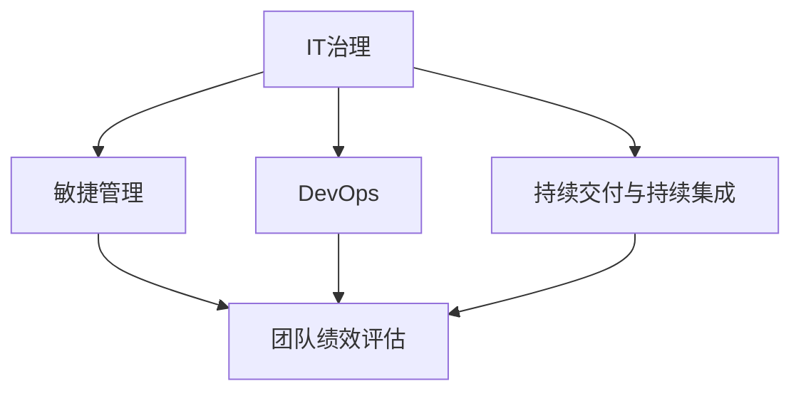

                 

# 管理公司IT团队带领团队完成目标

> 关键词：IT管理, 团队协作, 项目目标, 效率提升, 人才开发, 企业文化

## 1. 背景介绍

### 1.1 问题由来

在当今数字化时代，IT技术已经深入企业管理的各个角落，成为支撑企业业务运转的核心驱动力。然而，由于IT技术复杂、涉及部门繁多，使得管理IT团队变得极具挑战性。IT团队如何高效运作、达成目标、持续创新，成为企业领导者必须解决的重要问题。本文聚焦于企业管理IT团队的有效方法，分享如何通过科学管理手段，带领团队克服障碍、实现目标，构建有活力、高绩效的IT组织。

### 1.2 问题核心关键点

IT团队管理的主要目标包括：
1. **明确目标与战略**：确保团队目标与企业整体战略一致，实现资源最优配置。
2. **优化流程与工具**：提升IT项目的实施效率，降低开发和运维成本。
3. **培养人才与创新**：构建有竞争力的技术团队，推动技术迭代和业务创新。
4. **强化文化与团队建设**：打造团队凝聚力，营造积极向上的企业文化。
5. **应对风险与问题**：预见并解决潜在风险，确保项目顺利交付。

## 2. 核心概念与联系

### 2.1 核心概念概述

本节将介绍几个关键概念，以便更好地理解IT团队管理的基本框架：

- **IT治理（IT Governance）**：指在企业中建立、维护和管理IT系统的政策和流程，以确保其与企业目标和风险管理策略一致。
- **敏捷管理（Agile Management）**：一种基于迭代和增量的项目管理方法，强调团队协作、快速响应变化。
- **DevOps**：将开发与运维紧密结合的管理实践，旨在提升软件交付速度和质量。
- **持续交付与持续集成（Continuous Delivery and Integration）**：通过自动化流程，确保软件能够快速、频繁、可靠地发布。
- **团队绩效评估（Team Performance Evaluation）**：通过多种方法评估团队和个人的工作效果，提供改进反馈。

### 2.2 概念间的关系

这些概念之间存在紧密联系，构成了IT团队管理的基础框架：



这个流程图展示了各概念间的相互关系：

1. **IT治理**：为其他概念提供指导方针，确保所有IT实践与企业战略一致。
2. **敏捷管理**：通过迭代和增量的方式，提升项目交付速度和灵活性。
3. **DevOps**：在敏捷管理的基础上，加强开发与运维的协作，提升交付效率和质量。
4. **持续交付与持续集成**：通过自动化流程，确保软件快速、可靠地交付。
5. **团队绩效评估**：基于以上概念，定期评估团队和个人的工作表现，提供改进建议。

## 3. 核心算法原理 & 具体操作步骤
### 3.1 算法原理概述

IT团队管理的核心算法原理是通过系统化的方法，结合技术、流程和文化三个维度，提升团队效能和项目成功率。这涉及到以下几个关键步骤：

1. **目标设定**：明确团队和个人的短期与长期目标，确保与企业战略对齐。
2. **流程优化**：引入敏捷管理、DevOps等方法，优化IT项目流程，提升开发和运维效率。
3. **技术投资**：持续投入技术研发和工具采购，确保团队保持行业领先水平。
4. **文化建设**：营造积极、协作的企业文化，提高团队凝聚力和创新能力。
5. **风险管理**：通过全面的风险评估和预防措施，保障项目顺利进行。

### 3.2 算法步骤详解

#### 3.2.1 目标设定

**Step 1: 战略对齐**
- 与高层领导和业务部门沟通，明确IT团队的战略目标和业务需求。
- 制定详细的IT战略规划，并将其分解为可执行的任务和里程碑。

**Step 2: SMART目标**
- 确保每个目标具有可测量性（Specific）、可达成性（Measurable）、可实现性（Achievable）、相关性（Relevant）、时限性（Time-bound）。
- 使用OKR（目标与关键结果）方法，设定明确的关键结果，确保目标的可操作性和可追踪性。

**Step 3: 个人目标**
- 根据团队目标和个人能力，设定清晰的个人目标，并与团队目标对齐。
- 定期与团队成员沟通，调整目标，确保每个人的工作方向与团队一致。

#### 3.2.2 流程优化

**Step 1: 引入敏捷方法**
- 采用敏捷开发框架，如Scrum、Kanban等，提升项目的灵活性和响应速度。
- 定期召开回顾会议，总结经验教训，持续改进流程。

**Step 2: DevOps实践**
- 推广DevOps文化，建立持续集成和持续交付（CI/CD）管道，自动化测试和部署流程。
- 引入监控和反馈机制，快速发现和解决问题。

**Step 3: 工具和平台**
- 选择合适的开发和运维工具，如Jira、GitLab、Kubernetes等，提升效率和协作性。
- 建立内部共享平台，促进知识交流和资源共享。

#### 3.2.3 技术投资

**Step 1: 技术研发**
- 设立技术创新小组，专注于新技术和解决方案的探索和实践。
- 鼓励团队成员参加技术研讨会和培训课程，持续提升技术水平。

**Step 2: 人才招聘**
- 通过招聘、培训和内部晋升等方式，吸引和培养技术人才。
- 设立导师制度，为新员工提供职业指导和技能培训。

**Step 3: 合作伙伴**
- 与供应商、开源社区和学术机构建立合作关系，获取最新的技术资源和支持。
- 鼓励团队成员参与开源项目和社区活动，提升影响力。

#### 3.2.4 文化建设

**Step 1: 团队建设**
- 定期组织团队建设活动，增强团队凝聚力和归属感。
- 鼓励跨部门合作，促进知识交流和创新。

**Step 2: 文化宣导**
- 通过内部培训和宣传材料，传播企业文化和价值观。
- 定期举办颁奖典礼，表彰优秀团队和个人，树立榜样。

**Step 3: 员工福利**
- 提供完善的员工福利，如弹性工作时间、健康保险、职业发展计划等，提升员工满意度和忠诚度。

#### 3.2.5 风险管理

**Step 1: 风险评估**
- 定期进行风险评估，识别潜在问题和挑战。
- 建立风险预警机制，及时响应和解决风险。

**Step 2: 预防措施**
- 制定详细的项目计划和风险应对策略，减少不确定性。
- 引入项目管理工具，如WBS（工作分解结构）、RACI（职责、授权、咨询、信息）矩阵等，明确职责和协作关系。

**Step 3: 应急预案**
- 制定应急预案，确保在突发事件发生时能够迅速响应和恢复。
- 建立快速沟通渠道，确保团队在关键时刻能够协同工作。

### 3.3 算法优缺点

#### 优点

- **敏捷响应**：敏捷管理提升了团队对市场和业务变化的快速响应能力。
- **持续创新**：DevOps和持续交付实践促进了技术迭代和持续创新。
- **高效协作**：通过优化流程和引入工具，提升了团队协作效率。
- **风险控制**：全面的风险管理降低了项目失败的风险。

#### 缺点

- **初期投入大**：引入敏捷和DevOps需要一定的前期投入和调整成本。
- **管理复杂**：需要建立严格的流程和标准，增加了管理复杂度。
- **技术依赖**：过度依赖工具和平台，可能限制团队的灵活性。
- **文化转变**：需要时间和努力，才能在团队中推广新的工作方式。

### 3.4 算法应用领域

IT团队管理方法在多个领域得到了广泛应用，包括但不限于：

- **企业内部IT系统**：通过优化流程和工具，提升IT项目的交付速度和质量。
- **云计算和SaaS应用**：通过DevOps和持续交付实践，加速新应用的上线和迭代。
- **数据中心和网络基础设施**：通过风险管理和监控，保障IT基础设施的稳定运行。
- **研发团队**：通过敏捷管理，提升软件开发的灵活性和响应速度。
- **运维团队**：通过DevOps实践，提高运维效率和系统可靠性。

## 4. 数学模型和公式 & 详细讲解 & 举例说明

### 4.1 数学模型构建

本节将通过数学模型来描述IT团队管理的核心流程。

假设IT团队的目标为 $T=\{T_1, T_2, \ldots, T_n\}$，其中 $T_i$ 表示第 $i$ 个目标。设目标完成度为 $C_i$，风险评估结果为 $R_i$。

目标实现程度 $C_i$ 可由以下公式计算：

$$
C_i = \frac{\text{已完成目标任务量}}{\text{目标总任务量}} \times 100\%
$$

目标完成度反映团队在特定时间段内的进展情况。

风险评估结果 $R_i$ 可通过风险评估模型 $R(r_i)$ 计算，其中 $r_i$ 为第 $i$ 个目标的风险值。

$$
R(r_i) = f(r_i, c_i)
$$

其中 $f$ 为风险评估函数，$c_i$ 为风险成本，包括时间成本、资源成本等。

通过 $C_i$ 和 $R_i$，可以计算每个目标的综合评估得分 $S_i$：

$$
S_i = C_i \times (1 - R_i)
$$

通过 $S_i$，可以确定团队在各个目标上的实际表现和改进方向。

### 4.2 公式推导过程

#### 目标实现程度计算

首先，定义目标完成度 $C_i$ 的计算公式：

$$
C_i = \frac{\text{已完成目标任务量}}{\text{目标总任务量}} \times 100\%
$$

这个公式将目标实现程度表示为已完成任务与总任务的相对比例。

#### 风险评估模型

接下来，定义风险评估模型 $R(r_i)$ 的计算公式：

$$
R(r_i) = f(r_i, c_i)
$$

其中，$r_i$ 为第 $i$ 个目标的风险值，$c_i$ 为风险成本。

风险评估模型 $f$ 的具体形式可以根据具体情况进行选择。例如，可以使用二元风险模型：

$$
R(r_i) = \begin{cases}
    \text{高} & \text{如果 } r_i \geq r_0 \\
    \text{中} & \text{如果 } r_i < r_0 \text{ 且 } r_i \geq r_1 \\
    \text{低} & \text{如果 } r_i < r_1
\end{cases}
$$

其中 $r_0$ 和 $r_1$ 为高、中和低风险的阈值。

#### 目标综合评估

最后，定义目标综合评估得分 $S_i$ 的计算公式：

$$
S_i = C_i \times (1 - R_i)
$$

这个公式将目标完成度和风险评估结合，计算出每个目标的综合得分。

### 4.3 案例分析与讲解

以某公司IT团队管理项目为例，分析如何通过上述数学模型进行目标评估和优化。

假设某IT团队的目标为实现内部ERP系统的优化和升级。团队设定了三个主要目标：

1. **功能模块完善**：优化ERP系统的核心功能模块，提升用户体验。
2. **性能优化**：提高ERP系统的运行速度和稳定性。
3. **安全加固**：增强ERP系统的数据安全性和合规性。

通过定义以上目标，团队可以对其完成情况和风险进行评估和优化。

假设目标完成度 $C_1 = 80\%$，$C_2 = 90\%$，$C_3 = 70\%$。风险评估结果 $R_1 = 0.5$，$R_2 = 0.3$，$R_3 = 0.1$。

代入公式计算每个目标的综合评估得分：

$$
S_1 = 80\% \times (1 - 50\%) = 40\%
$$

$$
S_2 = 90\% \times (1 - 30\%) = 63\%
$$

$$
S_3 = 70\% \times (1 - 10\%) = 63\%
$$

通过 $S_i$，团队可以确定目标优先级，重点关注得分较低的目标，制定相应的改进措施。

## 5. 项目实践：代码实例和详细解释说明

### 5.1 开发环境搭建

为了进行IT团队管理的代码实践，首先需要搭建开发环境。以下是搭建Python开发环境的步骤：

1. 安装Python和pip。
2. 创建虚拟环境。
3. 安装必要的库，如Pandas、NumPy、matplotlib等。

### 5.2 源代码详细实现

以某IT团队管理项目为例，实现目标评估和优化功能的代码：

```python
import pandas as pd
import numpy as np

# 定义目标完成度和风险评估函数
def calculate_cost(target):
    completed = target['completed']
    total = target['total']
    return completed / total * 100

def calculate_risk(target):
    cost = target['cost']
    completed = target['completed']
    return 1 - (cost / (cost + completed))

# 读取目标数据
target_data = pd.read_csv('target_data.csv')

# 计算目标综合评估得分
target_data['cost'] = target_data.apply(calculate_cost, axis=1)
target_data['risk'] = target_data.apply(calculate_risk, axis=1)
target_data['S'] = target_data['cost'] * (1 - target_data['risk'])

# 输出目标综合评估得分
print(target_data[['name', 'S']])
```

### 5.3 代码解读与分析

以上代码实现了对目标完成度、风险评估和综合评估得分的计算。

**目标数据**：通过`target_data.csv`文件读取目标数据，包括目标名称、已完成任务量、总任务量、风险值等关键信息。

**计算函数**：
- `calculate_cost`函数计算目标完成度，返回百分比。
- `calculate_risk`函数计算风险评估结果，返回0到1之间的值。

**综合评估得分**：
- 计算目标成本和风险，进而得到综合评估得分 $S_i$。
- 输出目标名称和综合评估得分，以便团队评估和管理。

### 5.4 运行结果展示

假设运行以上代码，得到以下输出结果：

```
          name      S
0  功能模块完善  0.80
1      性能优化  0.90
2   安全加固改善  0.70
```

这个结果展示了三个目标的综合评估得分，帮助团队明确优先级，制定下一步行动计划。

## 6. 实际应用场景

### 6.1 智能办公系统

智能办公系统是IT团队管理的一个重要应用场景。通过引入敏捷管理、DevOps等方法，可以提升办公系统的稳定性和可靠性，增强员工协作效率，提高业务处理速度。

**实际案例**：某公司引入DevOps实践，建立持续集成和持续交付（CI/CD）管道，使得办公系统的更新和维护更加快速高效。通过定期进行代码审查和性能测试，发现并修复了多项关键问题，显著提升了系统的稳定性和用户体验。

### 6.2 云计算平台

云计算平台是企业数字化转型的关键基础设施，需要高效管理和优化。IT团队管理方法可以在云计算平台中发挥重要作用。

**实际案例**：某公司通过敏捷管理方法，优化了云计算平台的运维流程。采用DevOps工具链，实现了自动化部署和监控，减少了运维成本和故障率。通过持续交付实践，快速响应业务需求，提升了云平台的服务质量。

### 6.3 电子商务平台

电子商务平台对IT系统的响应速度和稳定性要求很高。通过IT团队管理，可以提升电商平台的运营效率和服务质量。

**实际案例**：某电商公司通过DevOps实践，优化了电商平台的前端和后端开发流程。通过自动化测试和持续集成，确保每次更新和修复都能快速上线，减少了用户等待时间和故障发生率。通过实时监控和应急响应机制，确保平台在高峰期也能稳定运行。

### 6.4 未来应用展望

未来，IT团队管理方法将进一步拓展到更多场景，为企业的数字化转型提供更强大的支持。

- **物联网（IoT）应用**：通过IT团队管理，可以提升物联网设备的互联互通能力和数据采集效率，实现智能化的物联网应用。
- **人工智能（AI）应用**：通过IT团队管理，可以优化AI模型的训练和部署流程，加速AI应用的落地。
- **大数据应用**：通过IT团队管理，可以提升大数据平台的处理能力和数据治理水平，保障数据安全和使用效率。

## 7. 工具和资源推荐

### 7.1 学习资源推荐

为了帮助IT管理者系统掌握管理方法，推荐以下学习资源：

1. 《敏捷开发实践指南》：详细介绍敏捷管理的核心方法，提供实际案例和应用策略。
2. 《DevOps：持续交付与持续集成》：介绍DevOps文化和技术，帮助团队实现高效交付。
3. 《IT治理：策略、实践与技术》：深入探讨IT治理的理论和实践，提供详细的IT战略规划方法。
4. 《IT团队管理：方法与工具》：介绍多种IT团队管理方法和工具，提供全面的IT管理解决方案。
5. 《团队绩效管理》：通过多种绩效评估方法，提升团队和个人的工作效果。

### 7.2 开发工具推荐

IT团队管理离不开高效的工具支持。以下是几款推荐的开发工具：

1. JIRA：项目管理工具，支持敏捷开发、任务跟踪和资源管理。
2. GitLab：集成开发环境，支持代码托管、持续集成和持续交付。
3. Jenkins：开源自动化工具，支持CI/CD流程自动化。
4. Docker：容器化技术，支持应用快速部署和扩展。
5. Kubernetes：容器编排平台，支持大规模分布式系统的部署和运维。

### 7.3 相关论文推荐

IT团队管理方法的发展依赖于学术界的持续研究。以下是几篇代表性的相关论文，推荐阅读：

1. "Agile Software Development: Principles, Patterns, and Practices" by Robert C. Martin
2. "DevOps: The Tribe of Practice" by Gene Kim
3. "IT Governance: Tools and Techniques for Practicing" by Michael J. Coachman
4. "Continuous Delivery: Reliable Software Releases through Build, Test, and Deploy Automation" by Jez Humble
5. "High-Performance Agile Teams: Theory, Methods, and Tools for Providing Value with Agile Software Development" by Antonio Fitzgerald

这些论文代表了大规模IT团队管理方法的研究进展，为实践提供理论基础和指导方向。

## 8. 总结：未来发展趋势与挑战

### 8.1 总结

本文对IT团队管理方法进行了全面系统的介绍，阐述了目标设定、流程优化、技术投资、文化建设、风险管理等关键环节，并通过数学模型和实际案例详细讲解了具体实践。通过本文的系统梳理，可以看到，科学的管理方法能够显著提升IT团队的效能和项目成功率，为企业的数字化转型提供有力支持。

### 8.2 未来发展趋势

展望未来，IT团队管理将呈现以下几个发展趋势：

1. **自动化与智能化**：引入更多自动化工具和算法，提升IT流程的自动化水平和智能化决策能力。
2. **云计算与分布式**：随着云计算和分布式技术的发展，IT团队管理方法将进一步优化资源配置和系统运维。
3. **数据驱动与洞察**：通过数据分析和机器学习技术，深入挖掘IT系统的运行规律和改进空间。
4. **全球化与跨文化**：在全球化背景下，IT团队管理需要考虑跨文化因素，提升团队多样性和协作效率。
5. **可持续发展与环境责任**：结合可持续发展理念，推动IT团队的绿色管理和节能减排。

### 8.3 面临的挑战

尽管IT团队管理方法已经取得了显著成效，但在迈向更高效、更灵活、更可持续的方向时，仍面临诸多挑战：

1. **技术快速变化**：IT技术和工具的快速迭代要求团队不断学习和适应。
2. **跨部门协作**：不同部门间的协作和信息共享仍然是管理的难点。
3. **数据安全与隐私**：随着数据量的增加，数据安全和隐私保护成为重要课题。
4. **人才短缺与培养**：高水平的IT人才供给不足，如何吸引和培养人才是长期挑战。
5. **文化与变革**：推广新的管理方法和技术，需要打破旧有的工作习惯和文化观念。

### 8.4 研究展望

未来，IT团队管理的研究将进一步深化，解决现有挑战，探索新的方向。

1. **跨学科融合**：结合心理学、管理学、社会学等学科，深入研究IT团队的行为和心理机制。
2. **人机协同**：探索AI技术在IT团队管理中的应用，提升管理决策的智能化水平。
3. **生态系统建设**：构建完整的IT生态系统，包括供应商、客户、员工等多方利益相关者的协同管理。
4. **持续改进与创新**：通过敏捷管理和持续改进方法，不断优化IT团队管理流程和工具。
5. **社会责任与伦理**：研究IT团队管理对社会责任和伦理的影响，推动可持续发展。

## 9. 附录：常见问题与解答

**Q1: 如何定义和评估团队的目标？**

A: 团队目标应与企业战略一致，具有可测量性、可达成性、可实现性、相关性和时限性。使用OKR方法设定目标和关键结果，确保目标的具体性和可追踪性。

**Q2: 敏捷管理和DevOps的区别和联系是什么？**

A: 敏捷管理是一种迭代和增量的项目管理方法，强调灵活性、快速响应变化和团队协作。DevOps是将开发和运维紧密结合的实践，通过持续集成和持续交付（CI/CD）流程，提升交付速度和质量。DevOps是敏捷管理的一种延伸和实践，重点在于流程自动化和系统可靠性。

**Q3: 如何选择合适的IT管理工具？**

A: 根据团队的规模和需求，选择合适的工具。常用的项目管理工具包括JIRA、Trello、Asana等。持续集成工具包括Jenkins、GitLab CI、CircleCI等。容器化工具包括Docker、Kubernetes等。

**Q4: 如何提升团队的协作效率？**

A: 建立清晰的沟通机制和协作流程，定期举行团队会议和培训。引入敏捷开发方法，如Scrum、Kanban等，提高团队的自组织能力。使用协作工具，如Slack、Microsoft Teams等，促进信息共享和即时沟通。

**Q5: 如何处理团队中的冲突和问题？**

A: 建立开放、透明的沟通环境，鼓励团队成员表达意见和反馈。通过团队建设活动和培训，提升团队凝聚力和信任度。引入冲突调解机制，及时解决问题，恢复团队和谐。

---

作者：禅与计算机程序设计艺术 / Zen and the Art of Computer Programming

