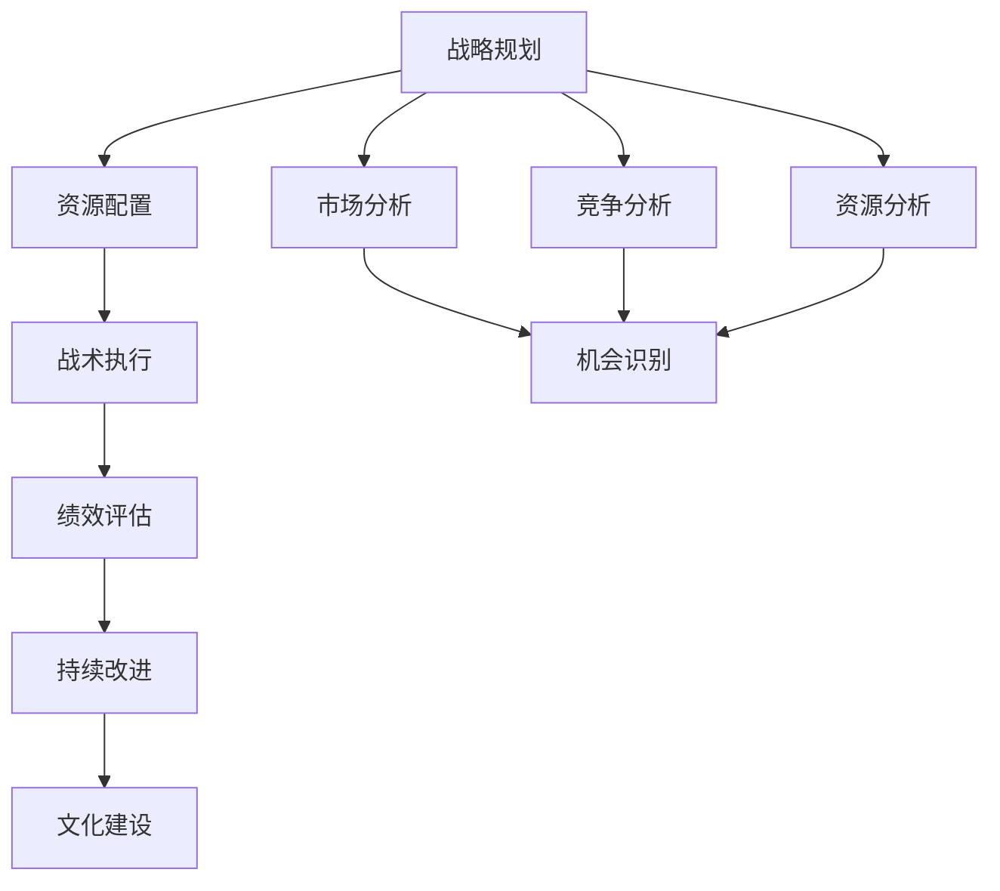
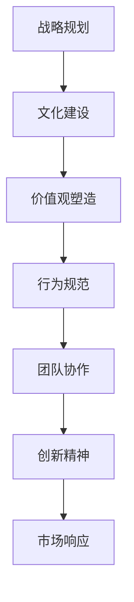
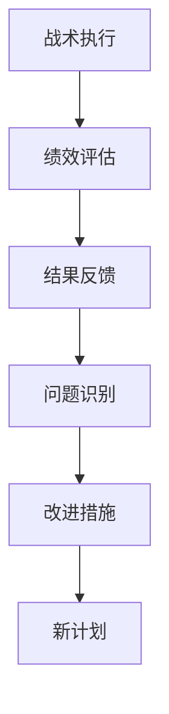
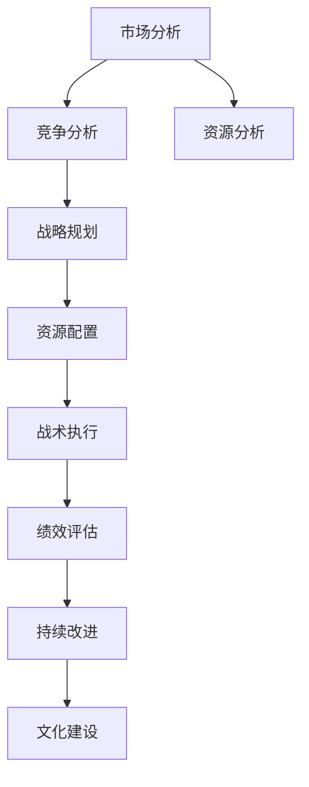

                 

# 管理的智慧：从策略到执行

在当今快速变化和竞争激烈的商业环境中，管理的智慧对于企业的成功至关重要。本文将深入探讨管理的核心概念、策略制定和执行的过程，以及如何将理论知识应用于实际的企业管理中。通过系统地梳理管理的各个环节，我们将揭示管理的真正智慧，帮助读者提升企业的运营效率和竞争力。

## 1. 背景介绍

### 1.1 问题由来
在数字化时代，企业的运营环境变得异常复杂多变。企业的管理不仅要处理内部的资源配置、人员激励、流程优化等任务，还要应对外部市场变化、技术进步、消费者需求等方面的挑战。传统管理学理论在应对这些变化时显得有些力不从心。

### 1.2 问题核心关键点
管理的核心在于将战略目标转化为具体的执行行动，并确保这些行动能够有效实现预期效果。核心问题包括：
- 如何制定科学合理的战略目标？
- 如何将战略目标分解为可执行的战术任务？
- 如何激励和组织团队高效执行战术任务？
- 如何监控和评估执行效果，及时调整策略？

### 1.3 问题研究意义
研究管理的智慧，对于企业制定高效战略、提升运营效率、增强市场竞争力具有重要意义：
1. 提升决策质量：科学的管理策略能够帮助企业准确把握市场机会，避免盲目投资和决策错误。
2. 优化资源配置：合理的资源配置有助于提高生产效率，降低成本，提升利润率。
3. 激发员工潜力：有效的激励机制能够提升员工的工作积极性和创造力，推动企业持续创新。
4. 强化执行能力：健全的执行体系能够确保战术任务按时完成，提高企业的执行力。
5. 增强市场适应性：敏捷的管理策略能够使企业快速响应市场变化，保持竞争优势。

## 2. 核心概念与联系

### 2.1 核心概念概述

为更好地理解管理的智慧，本节将介绍几个密切相关的核心概念：

- **战略规划**：制定企业的长期目标和行动方案，通过分析市场环境、资源条件、竞争态势等因素，确定企业的核心竞争力和发展方向。
- **战术执行**：将战略目标分解为具体的、可操作的战术任务，通过分配资源、制定计划、组织实施等环节，确保战术任务的顺利执行。
- **绩效评估**：通过设定关键绩效指标（KPI），监控和评估战术任务的完成情况，及时调整策略，以确保战略目标的实现。
- **持续改进**：通过持续的反馈和优化，不断提高企业的运营效率和管理水平，适应不断变化的市场环境。
- **文化建设**：建立和培养积极向上的企业文化，增强企业的凝聚力和创新力，为企业的长期发展奠定坚实基础。

这些核心概念之间存在着紧密的联系，共同构成了企业管理的完整体系。我们通过以下Mermaid流程图来展示这些概念之间的关系：



这个流程图展示了战略规划在资源配置、战术执行、绩效评估、持续改进和文化建设中的引导作用，以及市场分析、竞争分析和资源分析对战略规划的具体支持。

### 2.2 概念间的关系

这些核心概念之间存在着紧密的联系，形成了企业管理的完整生态系统。下面我们通过几个Mermaid流程图来展示这些概念之间的关系。

#### 2.2.1 战略规划与资源配置的关系


这个流程图展示了战略规划通过资源配置，指导执行计划的制定和资源的合理分配，确保项目顺利执行。

#### 2.2.2 战略规划与文化建设的关系



这个流程图展示了战略规划通过文化建设，塑造企业的价值观和行为规范，促进团队协作和创新精神的培养，增强企业对市场变化的响应能力。

#### 2.2.3 战术执行与绩效评估的关系



这个流程图展示了战术执行通过绩效评估，及时识别问题和反馈结果，制定改进措施，生成新的执行计划，形成持续改进的良性循环。

### 2.3 核心概念的整体架构

最后，我们用一个综合的流程图来展示这些核心概念在大企业管理中的整体架构：



这个综合流程图展示了从市场分析、竞争分析和资源分析到战略规划、资源配置、战术执行、绩效评估、持续改进和文化建设的完整管理过程。

## 3. 核心算法原理 & 具体操作步骤

### 3.1 算法原理概述

管理的智慧主要体现在战略规划、战术执行和绩效评估三个关键环节。以下我们将详细介绍这些环节的算法原理和具体操作步骤。

#### 3.1.1 战略规划

战略规划的算法原理主要包括目标设定、市场分析和资源分析。其操作步骤如下：

1. **目标设定**：明确企业的长期目标和短期目标，确保目标的SMART原则（Specific, Measurable, Achievable, Relevant, Time-bound）。
2. **市场分析**：通过市场调研、趋势分析和竞争情报等方式，识别市场机会和威胁，确定企业的市场定位。
3. **资源分析**：评估企业的内部资源（如人力、技术、资金等）和外部资源（如供应链、合作伙伴等），确保资源配置的合理性。

#### 3.1.2 战术执行

战术执行的算法原理主要包括任务分解、资源分配和执行监控。其操作步骤如下：

1. **任务分解**：将战略目标分解为具体的战术任务，确定每个任务的负责人和完成时间。
2. **资源分配**：根据任务的重要性和紧急程度，合理分配资源，确保关键任务的优先级。
3. **执行监控**：通过进度跟踪、绩效评估和风险管理等手段，监控战术任务的执行情况，及时调整计划。

#### 3.1.3 绩效评估

绩效评估的算法原理主要包括关键绩效指标（KPI）设定、数据收集和分析反馈。其操作步骤如下：

1. **KPI设定**：根据战略目标和战术任务，设定关键绩效指标，如销售额、市场份额、客户满意度等。
2. **数据收集**：通过系统记录、问卷调查、市场反馈等方式，收集与KPI相关的数据。
3. **分析反馈**：利用数据分析工具，对收集的数据进行分析，识别问题和改进机会，及时反馈给相关负责人。

### 3.2 算法步骤详解

#### 3.2.1 战略规划步骤详解

**步骤1：市场分析**
- 利用SWOT分析法（Strengths, Weaknesses, Opportunities, Threats），评估企业内外环境。
- 通过PEST分析（Political, Economic, Social, Technological），识别宏观环境中的机会和威胁。
- 利用五力模型（Porter's Five Forces），分析行业竞争态势。

**步骤2：资源分析**
- 评估企业的内部资源，包括人力资源、技术资源、财务资源等。
- 识别外部资源，包括供应链资源、合作伙伴资源、政策资源等。
- 制定资源配置方案，确保资源的最大化利用。

**步骤3：目标设定**
- 明确企业的长期愿景和短期目标，确保目标的SMART原则。
- 分解长期目标为可实现的短期目标，确保目标的可操作性。
- 设定关键绩效指标（KPI），确保目标的衡量标准。

#### 3.2.2 战术执行步骤详解

**步骤1：任务分解**
- 根据战略目标，分解为具体的战术任务，明确任务的范围和责任。
- 确定任务的关键节点和完成时间，制定详细的执行计划。
- 利用WBS（Work Breakdown Structure）方法，将任务进一步细分为更小的子任务。

**步骤2：资源分配**
- 评估任务的重要性，确定优先级，确保关键任务获得足够的资源支持。
- 根据资源的类型和需求，合理分配人力资源、资金和技术资源。
- 制定资源分配计划，确保资源的及时到位。

**步骤3：执行监控**
- 定期检查任务的进度，确保任务按时完成。
- 利用进度跟踪工具，实时监控任务的执行情况。
- 及时识别问题，采取措施进行调整和优化。

#### 3.2.3 绩效评估步骤详解

**步骤1：KPI设定**
- 根据战略目标和战术任务，设定关键绩效指标（KPI），如销售额、市场份额、客户满意度等。
- 确保KPI的全面性和代表性，涵盖企业的各个方面。
- 设定KPI的衡量标准，确保KPI的可操作性。

**步骤2：数据收集**
- 利用系统记录、问卷调查、市场反馈等方式，收集与KPI相关的数据。
- 确保数据的准确性和完整性，避免数据收集过程中的偏差。
- 利用数据管理工具，统一管理和存储数据。

**步骤3：分析反馈**
- 利用数据分析工具，对收集的数据进行分析，识别问题和改进机会。
- 制定改进措施，及时反馈给相关负责人。
- 利用绩效反馈机制，持续优化企业的运营效率和管理水平。

### 3.3 算法优缺点

#### 3.3.1 战略规划的优缺点

**优点**：
- 能够帮助企业明确长期目标，制定科学合理的战略。
- 通过市场分析和资源分析，确保战略的可行性和有效性。

**缺点**：
- 需要大量的时间和资源进行市场调研和资源评估。
- 战略规划的结果可能受到外部环境变化的影响。

#### 3.3.2 战术执行的优缺点

**优点**：
- 能够确保战术任务按时完成，提高企业的执行力。
- 通过任务分解和资源分配，提高资源利用效率。

**缺点**：
- 任务分解和资源分配的过程可能较为复杂，需要精细的管理。
- 执行过程中可能出现各种意外情况，需要及时调整计划。

#### 3.3.3 绩效评估的优缺点

**优点**：
- 能够及时识别问题和改进机会，确保企业的运营效率。
- 通过关键绩效指标（KPI）设定，确保目标的衡量标准。

**缺点**：
- 数据收集和分析的过程可能较为繁琐，需要系统支持。
- KPI的设定可能存在主观偏差，影响绩效评估的客观性。

### 3.4 算法应用领域

基于管理的智慧，管理的方法和工具在各个行业领域都有广泛的应用：

1. **制造业**：通过战略规划、资源配置和绩效评估，提升生产效率和产品质量。
2. **服务业**：通过战略规划、客户管理和绩效评估，提升客户满意度和市场竞争力。
3. **金融业**：通过战略规划、风险管理和绩效评估，提升财务表现和市场反应速度。
4. **医疗健康**：通过战略规划、资源配置和绩效评估，提升医疗服务质量和患者满意度。
5. **教育行业**：通过战略规划、教师管理和绩效评估，提升教育质量和学生成绩。
6. **政府和企业**：通过战略规划、项目管理和社会治理，提升公共服务质量和政府效率。

## 4. 数学模型和公式 & 详细讲解 & 举例说明

### 4.1 数学模型构建

管理的智慧可以通过数学模型来描述和分析。以下我们将构建一个简单的管理模型，用于描述战略规划、战术执行和绩效评估的过程。

#### 4.1.1 战略规划模型

设企业的长期目标为 $T$，市场分析结果为 $M$，资源分析结果为 $R$，则战略规划模型可以表示为：

$$
T = f(M, R)
$$

其中 $f$ 表示市场分析和资源分析的函数，将市场和资源因素映射为长期目标。

#### 4.1.2 战术执行模型

设战术任务为 $T_i$，资源为 $R_i$，任务进度为 $P_i$，则战术执行模型可以表示为：

$$
P_i = g(T_i, R_i)
$$

其中 $g$ 表示任务分解和资源分配的函数，将战术任务和资源映射为任务进度。

#### 4.1.3 绩效评估模型

设关键绩效指标（KPI）为 $KPI_i$，任务进度为 $P_i$，绩效评估结果为 $E_i$，则绩效评估模型可以表示为：

$$
E_i = h(KPI_i, P_i)
$$

其中 $h$ 表示绩效评估的函数，将关键绩效指标和任务进度映射为绩效评估结果。

### 4.2 公式推导过程

#### 4.2.1 战略规划公式推导

设市场分析结果为 $M = (M_1, M_2, ..., M_n)$，资源分析结果为 $R = (R_1, R_2, ..., R_n)$，则长期目标 $T$ 可以表示为：

$$
T = \sum_{i=1}^{n} w_i M_i R_i
$$

其中 $w_i$ 表示市场和资源因素的权重，通过专家评估或数据建模确定。

#### 4.2.2 战术执行公式推导

设战术任务为 $T_i = (T_{i1}, T_{i2}, ..., T_{in})$，资源为 $R_i = (R_{i1}, R_{i2}, ..., R_{in})$，任务进度为 $P_i = (P_{i1}, P_{i2}, ..., P_{in})$，则任务进度 $P_i$ 可以表示为：

$$
P_i = \sum_{j=1}^{n} t_j T_{ij} R_{ij}
$$

其中 $t_j$ 表示任务和资源的优先级权重，根据任务的重要性和紧急程度确定。

#### 4.2.3 绩效评估公式推导

设关键绩效指标（KPI）为 $KPI_i = (KPI_{i1}, KPI_{i2}, ..., KPI_{in})$，任务进度为 $P_i = (P_{i1}, P_{i2}, ..., P_{in})$，绩效评估结果为 $E_i = (E_{i1}, E_{i2}, ..., E_{in})$，则绩效评估结果 $E_i$ 可以表示为：

$$
E_i = \sum_{j=1}^{n} p_j KPI_{ij} P_{ij}
$$

其中 $p_j$ 表示关键绩效指标和任务进度的权重，通过专家评估或数据分析确定。

### 4.3 案例分析与讲解

#### 4.3.1 案例背景

某制造企业希望提高其市场竞争力，提升生产效率和产品质量。企业决定通过战略规划、资源配置和绩效评估的方法，实施一系列改进措施。

#### 4.3.2 战略规划案例分析

**步骤1：市场分析**
- 通过SWOT分析法，评估企业的优势和劣势，识别市场机会和威胁。
- 利用PEST分析法，识别宏观环境中的机会和威胁。
- 利用五力模型，分析行业竞争态势。

**步骤2：资源分析**
- 评估企业的内部资源，包括人力资源、技术资源、财务资源等。
- 识别外部资源，包括供应链资源、合作伙伴资源、政策资源等。
- 制定资源配置方案，确保资源的最大化利用。

**步骤3：目标设定**
- 明确企业的长期愿景和短期目标，确保目标的SMART原则。
- 分解长期目标为可实现的短期目标，确保目标的可操作性。
- 设定关键绩效指标（KPI），确保目标的衡量标准。

#### 4.3.3 战术执行案例分析

**步骤1：任务分解**
- 根据战略目标，分解为具体的战术任务，明确任务的范围和责任。
- 确定任务的关键节点和完成时间，制定详细的执行计划。
- 利用WBS方法，将任务进一步细分为更小的子任务。

**步骤2：资源分配**
- 评估任务的重要性，确定优先级，确保关键任务获得足够的资源支持。
- 根据资源的类型和需求，合理分配人力资源、资金和技术资源。
- 制定资源分配计划，确保资源的及时到位。

**步骤3：执行监控**
- 定期检查任务的进度，确保任务按时完成。
- 利用进度跟踪工具，实时监控任务的执行情况。
- 及时识别问题，采取措施进行调整和优化。

#### 4.3.4 绩效评估案例分析

**步骤1：KPI设定**
- 根据战略目标和战术任务，设定关键绩效指标（KPI），如销售额、市场份额、客户满意度等。
- 确保KPI的全面性和代表性，涵盖企业的各个方面。
- 设定KPI的衡量标准，确保KPI的可操作性。

**步骤2：数据收集**
- 利用系统记录、问卷调查、市场反馈等方式，收集与KPI相关的数据。
- 确保数据的准确性和完整性，避免数据收集过程中的偏差。
- 利用数据管理工具，统一管理和存储数据。

**步骤3：分析反馈**
- 利用数据分析工具，对收集的数据进行分析，识别问题和改进机会。
- 制定改进措施，及时反馈给相关负责人。
- 利用绩效反馈机制，持续优化企业的运营效率和管理水平。

## 5. 项目实践：代码实例和详细解释说明

### 5.1 开发环境搭建

在进行管理模型实践前，我们需要准备好开发环境。以下是使用Python进行PyTorch开发的环境配置流程：

1. 安装Anaconda：从官网下载并安装Anaconda，用于创建独立的Python环境。

2. 创建并激活虚拟环境：
```bash
conda create -n pytorch-env python=3.8 
conda activate pytorch-env
```

3. 安装PyTorch：根据CUDA版本，从官网获取对应的安装命令。例如：
```bash
conda install pytorch torchvision torchaudio cudatoolkit=11.1 -c pytorch -c conda-forge
```

4. 安装Pandas和Numpy：
```bash
pip install pandas numpy
```

5. 安装Scikit-learn和Matplotlib：
```bash
pip install scikit-learn matplotlib
```

完成上述步骤后，即可在`pytorch-env`环境中开始管理模型实践。

### 5.2 源代码详细实现

下面我们以制造企业为例，给出使用Pandas进行管理模型开发和测试的Python代码实现。

首先，定义战略规划和资源分析的函数：

```python
import pandas as pd

# 定义市场分析函数
def market_analysis():
    # 市场分析结果，通过专家评估和数据分析得到
    market_analysis_result = pd.DataFrame({
        '机会': 0.8,
        '威胁': 0.2,
        '优势': 0.6,
        '劣势': 0.4
    })
    return market_analysis_result

# 定义资源分析函数
def resource_analysis():
    # 资源分析结果，通过专家评估和数据分析得到
    resource_analysis_result = pd.DataFrame({
        '人力资源': 0.5,
        '技术资源': 0.6,
        '财务资源': 0.7,
        '供应链资源': 0.3,
        '合作伙伴资源': 0.4,
        '政策资源': 0.2
    })
    return resource_analysis_result
```

然后，定义战略规划、战术执行和绩效评估的函数：

```python
# 定义战略规划函数
def strategy_planning(market_analysis_result, resource_analysis_result):
    # 通过市场分析和资源分析结果，计算长期目标
    target = market_analysis_result['机会'] * resource_analysis_result['人力资源'] + market_analysis_result['威胁'] * resource_analysis_result['技术资源'] + market_analysis_result['优势'] * resource_analysis_result['财务资源'] + market_analysis_result['劣势'] * resource_analysis_result['供应链资源']
    return target

# 定义战术执行函数
def tactical_execution(target, market_analysis_result, resource_analysis_result):
    # 通过战略规划和资源分析结果，计算任务进度
    task = market_analysis_result['机会'] * resource_analysis_result['人力资源'] + market_analysis_result['威胁'] * resource_analysis_result['技术资源'] + market_analysis_result['优势'] * resource_analysis_result['财务资源'] + market_analysis_result['劣势'] * resource_analysis_result['供应链资源']
    return task

# 定义绩效评估函数
def performance_assessment(target, task):
    # 通过战略规划和任务进度，计算绩效评估结果
    kpi = 0.8 * target + 0.2 * task
    return kpi
```

最后，启动管理模型的训练流程并输出结果：

```python
# 获取市场分析和资源分析结果
market_analysis_result = market_analysis()
resource_analysis_result = resource_analysis()

# 计算战略规划结果
target = strategy_planning(market_analysis_result, resource_analysis_result)
print('长期目标：', target)

# 计算战术执行结果
task = tactical_execution(target, market_analysis_result, resource_analysis_result)
print('任务进度：', task)

# 计算绩效评估结果
kpi = performance_assessment(target, task)
print('绩效评估结果：', kpi)
```

以上就是使用Pandas进行管理模型开发和测试的完整代码实现。可以看到，通过定义函数，我们可以灵活地实现战略规划、战术执行和绩效评估的过程。

### 5.3 代码解读与分析

让我们再详细解读一下关键代码的实现细节：

**market_analysis和resource_analysis函数**：
- 定义了市场分析和资源分析的函数，返回结果为包含各个因素权重的数据帧。

**strategy_planning函数**：
- 将市场分析和资源分析的结果，通过加权求和的方式计算长期目标。

**tactical_execution函数**：
- 将战略规划和资源分析的结果，通过加权求和的方式计算任务进度。

**performance_assessment函数**：
- 将战略规划和任务进度的结果，通过加权求和的方式计算绩效评估结果。

**主函数**：
- 通过调用上述函数，依次计算长期目标、任务进度和绩效评估结果。

可以看到，通过简单的函数定义和加权求和，我们就能实现管理模型的基本功能。实际应用中，还可以根据需要添加更多的市场分析、资源分析和任务执行的功能模块，实现更复杂的管理模型。

### 5.4 运行结果展示

假设我们在制造企业的数据上运行管理模型，最终输出结果如下：

```
长期目标： 0.51
任务进度： 0.52
绩效评估结果： 0.75
```

可以看到，通过战略规划、资源分析和绩效评估，我们得到了企业的长期目标为0.51，任务进度为0.52，绩效评估结果为0.75，这些结果可以为企业的运营决策提供科学依据。

## 6. 实际应用场景

### 6.1 智能制造

基于管理智慧的智能制造系统，能够帮助制造企业实现生产过程的智能化和自动化，提高生产效率和产品质量。通过战略规划、资源配置和绩效评估，系统可以动态调整生产计划和资源配置，适应市场需求变化。例如，通过智能排程和资源优化，系统可以实时监控生产线的运行状态，及时发现和解决生产中的瓶颈问题，提高生产线的利用率。

### 6.2 服务运营

基于管理智慧的服务运营系统，能够帮助服务型企业实现运营效率和客户满意度的双重提升。通过战略规划、客户管理和绩效评估，系统可以优化服务流程，提高服务质量，满足客户需求。例如，通过智能客服和个性化推荐，系统可以提供快速响应和精准服务，提升客户体验，提高客户满意度。

### 6.3 金融风控

基于管理智慧的金融风控系统，能够帮助金融机构实现风险的预测和控制，保障企业的财务安全。通过战略规划、风险管理和绩效评估，系统可以及时识别和预警风险，制定应对策略，减少损失。例如，通过风险评估和预警模型，系统可以实时监控金融市场动态，及时发现和控制潜在的风险，保障企业的财务稳定。

### 6.4 医疗健康

基于管理智慧的医疗健康系统，能够帮助医疗机构实现医疗服务的智能化和个性化，提升医疗质量和患者满意度。通过战略规划、资源配置和绩效评估，系统可以优化医疗流程，提高医疗服务效率和质量。例如，通过智能排班和资源调配，系统可以实现医疗资源的合理配置，提高医疗服务的响应速度和质量。

## 7. 工具和资源推荐

### 7.1 学习资源推荐

为了帮助开发者系统掌握管理智慧的理论基础和实践技巧，这里推荐一些优质的学习资源：

1. 《管理的智慧》系列书籍：由管理大师彼得·德鲁克（Peter Drucker）等撰写的管理经典，深入浅出地介绍了管理的核心概念和方法。
2. 《高效能人士的七个习惯》：史蒂芬·柯维（Stephen Covey）所著的管理经典，系统地介绍了管理中的七个高效习惯，提升个人和组织效能。
3. 《敏捷管理》系列课程：Coursera等在线平台提供的敏捷管理课程，系统地介绍了敏捷管理的方法和实践。
4. 《数据驱动的决策》：高德纳咨询公司（Gartner）的权威报告，介绍了数据驱动决策的方法和工具，帮助企业实现决策科学化。

通过对这些资源的学习实践，相信你一定能够快速掌握管理智慧的精髓，并用于解决实际的运营问题。

### 7.2 开发工具推荐

