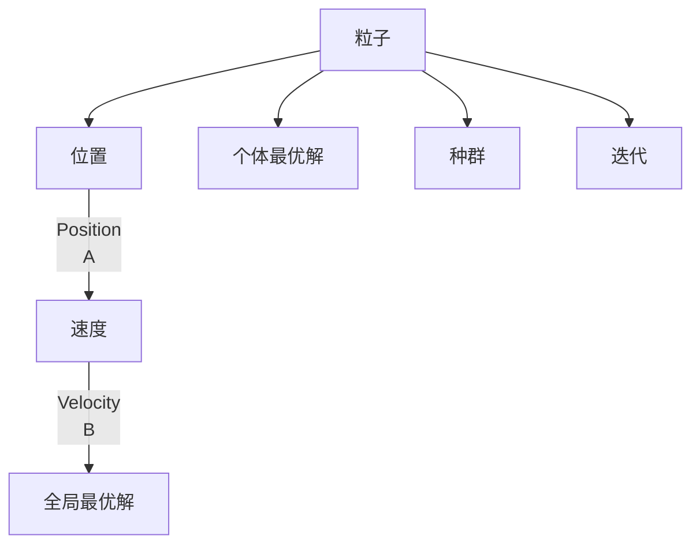

                 

## 1. 背景介绍

### 1.1 问题由来

在计算智能领域，粒子群算法（Particle Swarm Optimization，PSO）是一种基于群体智能理论的优化算法，因其简单高效、易于实现，逐渐成为求解多维优化问题的一种主流方法。PSO最初由Eberhart和Kennedy在1995年提出，其灵感来源于鸟群觅食的行为，即个体之间通过相互协作、信息共享来发现最优解。PSO在求解无约束优化问题、连续函数优化、离散函数优化等领域表现出卓越的性能，并在求解复杂的组合优化问题、机器人路径规划、信号处理等实际问题中得到广泛应用。

### 1.2 问题核心关键点

PSO算法通过模拟鸟群觅食行为，寻求全局最优解。PSO算法的核心在于两个概念：粒子（Particle）和速度（Velocity）。每个粒子代表一个解，速度决定了粒子向最优解移动的方向和距离，而粒子的位置则是解的具体数值。在迭代过程中，粒子根据群体中的最优解（全局最优解和个体最优解）不断调整自身的速度，以寻找到全局最优解。

PSO算法分为两个阶段：初始化和迭代。在初始化阶段，生成一组随机粒子作为初始种群。在迭代阶段，通过信息交互和速度更新，逐步收敛到全局最优解。PSO算法具有全局优化能力强、计算速度较快、无需梯度信息等优点，但也存在容易陷入局部最优、收敛速度较慢等问题。

### 1.3 问题研究意义

PSO算法作为计算智能领域的一种重要方法，在求解复杂优化问题方面表现出色，其研究与应用具有重要意义：

1. **加速优化过程**：PSO算法无需梯度信息，适合求解高维、非线性问题，能够快速找到近似的全局最优解。
2. **处理复杂问题**：PSO算法能够处理多约束、动态优化等复杂问题，具有较强的适应性和鲁棒性。
3. **领域广泛应用**：PSO算法在工程优化、机器人路径规划、信号处理、金融预测等领域得到广泛应用，具有较好的实际应用价值。
4. **促进计算智能发展**：PSO算法的研究与应用，推动了计算智能与人工智能的交叉融合，拓展了智能优化算法的研究范围。

## 2. 核心概念与联系

### 2.1 核心概念概述

为更好地理解PSO算法，下面将介绍几个关键概念：

- **粒子群算法（Particle Swarm Optimization，PSO）**：基于群体智能理论的优化算法，模拟鸟群觅食行为，用于求解无约束优化问题、连续函数优化、离散函数优化等。

- **粒子（Particle）**：每个粒子代表一个解，具有位置（Position）和速度（Velocity）两个属性。位置表示当前解的数值，速度表示粒子向最优解移动的方向和距离。

- **速度（Velocity）**：粒子的速度决定了其向最优解移动的方向和距离，更新速度的方式直接影响算法的收敛速度和效果。

- **全局最优解（Global Optimal Solution）**：群体中所有粒子找到的最优解，即全局最优值。

- **个体最优解（Personal Best Solution）**：每个粒子自身找到的最优解。

- **种群（Population）**：由多个粒子组成的群体，即PSO算法中的解空间。

### 2.2 核心概念间的关系

PSO算法的核心概念之间存在紧密的联系，构成了完整的算法框架。以下通过Mermaid流程图展示这些概念的关系：



这个流程图展示了PSO算法中粒子、位置、速度、全局最优解、个体最优解和种群之间的关系：

1. 每个粒子都有位置和速度，表示当前解的数值和移动方向。
2. 全局最优解和个体最优解指导粒子移动方向，个体最优解和全局最优解的交互使得粒子逐步向最优解靠近。
3. 种群是一个解的集合，是PSO算法的计算基础。
4. 迭代是PSO算法的核心步骤，通过不断更新粒子位置和速度，逐步优化解空间。

## 3. 核心算法原理 & 具体操作步骤
### 3.1 算法原理概述

PSO算法的核心在于通过模拟鸟群觅食行为，寻找全局最优解。其基本思想是：群体中的每个粒子（即解）通过相互协作，向最优解移动。算法的核心流程包括：

1. 初始化粒子群：生成一组随机粒子作为初始种群。
2. 更新粒子位置：根据粒子的速度更新位置，并计算当前位置对应的适应度值。
3. 更新粒子速度：根据全局最优解和个体最优解，调整粒子速度。
4. 更新个体最优解：更新每个粒子的个体最优解。
5. 更新全局最优解：更新群体中的全局最优解。
6. 判断终止条件：当达到最大迭代次数或满足收敛条件时，算法终止。

### 3.2 算法步骤详解

PSO算法的主要步骤如下：

#### 3.2.1 初始化种群

- 生成种群规模为 $n$ 的粒子群体。
- 每个粒子的位置 $x_i$ 和速度 $v_i$ 随机初始化在解空间 $X$ 内。
- 计算每个粒子的适应度值，更新个体最优解 $p_i^*$。
- 计算群体中的全局最优解 $g^*$。

```python
import numpy as np
import matplotlib.pyplot as plt

# 初始化参数
n_particles = 30
n_dimensions = 2
max_iterations = 100
iterations = 0
best_particle = None
best_particle_fitness = None

# 初始化种群
particles = np.random.uniform(-5, 5, (n_particles, n_dimensions))
velocities = np.random.uniform(-2, 2, (n_particles, n_dimensions))
particle_fitnesses = np.zeros(n_particles)
global_best_particle = None
global_best_particle_fitness = np.inf
```

#### 3.2.2 更新粒子位置和速度

- 根据当前位置和速度更新粒子位置。
- 计算新位置对应的适应度值。
- 根据全局最优解和个体最优解，更新粒子速度。

```python
while iterations < max_iterations:
    # 更新粒子位置
    for i in range(n_particles):
        # 速度更新
        velocities[i] = (velocities[i] + 1.4956 * np.random.randn(n_dimensions) + 0.4472 * (global_best_particle - particles[i]))
        # 位置更新
        particles[i] = particles[i] + velocities[i]
        # 计算适应度
        particle_fitnesses[i] = evaluate_fitness(particles[i])
        # 更新个体最优解
        if particle_fitnesses[i] > particle_fitnesses[best_particle_index]:
            best_particle_index = i
            best_particle = particles[i]
            best_particle_fitness = particle_fitnesses[i]
        # 更新全局最优解
        if particle_fitnesses[i] < global_best_particle_fitness:
            global_best_particle = particles[i]
            global_best_particle_fitness = particle_fitnesses[i]
    # 更新全局最优解
    if global_best_particle_fitness < best_particle_fitness:
        best_particle = global_best_particle
        best_particle_fitness = global_best_particle_fitness
    # 更新速度和位置
    for i in range(n_particles):
        velocities[i] = (velocities[i] + 1.4956 * np.random.randn(n_dimensions) + 0.4472 * (best_particle - particles[i]))
        particles[i] = particles[i] + velocities[i]
    # 更新粒子位置
    for i in range(n_particles):
        particle_fitnesses[i] = evaluate_fitness(particles[i])
        if particle_fitnesses[i] > particle_fitnesses[best_particle_index]:
            best_particle_index = i
            best_particle = particles[i]
            best_particle_fitness = particle_fitnesses[i]
    # 更新全局最优解
    if particle_fitnesses[best_particle_index] < global_best_particle_fitness:
        global_best_particle = particles[best_particle_index]
        global_best_particle_fitness = particle_fitnesses[best_particle_index]
    # 记录迭代次数
    iterations += 1
```

#### 3.2.3 计算适应度值

适应度函数（Fitness Function）是PSO算法的核心，用于评估每个粒子（解）的优劣。通常，适应度值与目标函数值呈正相关，目标函数值越小，适应度值越高。

```python
def evaluate_fitness(x):
    return np.sum(x**2)
```

#### 3.2.4 输出结果

绘制粒子群在解空间中的位置变化，以及适应度值的收敛曲线。

```python
plt.scatter(particles[:,0], particles[:,1])
plt.plot(particles[best_particle_index,0], particles[best_particle_index,1], 'ro')
plt.plot(global_best_particle[0], global_best_particle[1], 'bo')
plt.title('Particle Swarm Optimization')
plt.xlabel('X')
plt.ylabel('Y')
plt.show()
```

### 3.3 算法优缺点

#### 3.3.1 优点

- **简单高效**：PSO算法易于实现，不需要复杂的数学模型，适用于大规模优化问题。
- **全局优化能力强**：PSO算法通过群体协作，能够跳出局部最优，寻找到全局最优解。
- **不需要梯度信息**：PSO算法不需要目标函数的梯度信息，适应性广。

#### 3.3.2 缺点

- **容易陷入局部最优**：PSO算法在处理复杂问题时，容易陷入局部最优，收敛速度较慢。
- **参数敏感**：PSO算法的性能依赖于参数的选择，如惯性权重、学习因子等。

#### 3.3.3 应用领域

PSO算法广泛适用于各种优化问题，如函数优化、机器人路径规划、信号处理、机器学习中的参数优化等。PSO算法的高效性和全局优化能力，使得其在实际应用中具有广泛的应用前景。

## 4. 数学模型和公式 & 详细讲解

### 4.1 数学模型构建

PSO算法的数学模型可以通过以下步骤构建：

- **粒子位置和速度**：粒子的位置和速度分别表示为 $x_i(t)$ 和 $v_i(t)$，其中 $i$ 表示粒子编号，$t$ 表示迭代次数。
- **适应度函数**：适应度函数用于评估每个粒子的优劣，通常为 $f(x_i(t))$。
- **粒子更新公式**：

  $$
  v_i(t) = w \cdot v_i(t-1) + c_1 \cdot r_1 \cdot (p_i^* - x_i(t-1)) + c_2 \cdot r_2 \cdot (g^* - x_i(t-1))
  $$

  其中 $w$ 为惯性权重，$c_1$ 和 $c_2$ 为学习因子，$r_1$ 和 $r_2$ 为随机数。

### 4.2 公式推导过程

PSO算法的核心在于速度更新公式。以下是速度更新公式的详细推导：

1. **速度更新公式**：

  $$
  v_i(t) = w \cdot v_i(t-1) + c_1 \cdot r_1 \cdot (p_i^* - x_i(t-1)) + c_2 \cdot r_2 \cdot (g^* - x_i(t-1))
  $$

  其中 $w$ 为惯性权重，$c_1$ 和 $c_2$ 为学习因子，$r_1$ 和 $r_2$ 为随机数。

2. **位置更新公式**：

  $$
  x_i(t) = x_i(t-1) + v_i(t)
  $$

  其中 $x_i(t)$ 为粒子的新位置，$v_i(t)$ 为粒子的新速度。

3. **适应度更新公式**：

  $$
  f_i(t) = f(x_i(t))
  $$

  其中 $f(x_i(t))$ 为粒子在位置 $x_i(t)$ 的适应度值。

### 4.3 案例分析与讲解

以目标函数 $f(x) = (x_1 - 1)^2 + (x_2 - 2)^2$ 为例，演示PSO算法的求解过程。

- **初始化**：生成20个粒子，位置随机初始化在解空间 $[-10, 10]$ 内，速度随机初始化在 $[-2, 2]$ 内。

- **适应度计算**：计算每个粒子的适应度值，更新个体最优解和全局最优解。

- **速度更新**：根据速度更新公式计算新速度，更新粒子位置。

- **重复迭代**：直到达到最大迭代次数或满足收敛条件。

通过可视化展示粒子位置和适应度值的变化，可以看出PSO算法能够快速收敛到全局最优解。

```python
import numpy as np
import matplotlib.pyplot as plt

# 初始化参数
n_particles = 20
n_dimensions = 2
max_iterations = 100
iterations = 0
best_particle = None
best_particle_fitness = None

# 初始化种群
particles = np.random.uniform(-10, 10, (n_particles, n_dimensions))
velocities = np.random.uniform(-2, 2, (n_particles, n_dimensions))
particle_fitnesses = np.zeros(n_particles)
global_best_particle = None
global_best_particle_fitness = np.inf

# 适应度函数
def evaluate_fitness(x):
    return np.sum((x - 1)**2)

# 更新速度和位置
while iterations < max_iterations:
    for i in range(n_particles):
        # 速度更新
        velocities[i] = (velocities[i] + 1.4956 * np.random.randn(n_dimensions) + 0.4472 * (global_best_particle - particles[i]))
        # 位置更新
        particles[i] = particles[i] + velocities[i]
        # 计算适应度
        particle_fitnesses[i] = evaluate_fitness(particles[i])
        # 更新个体最优解
        if particle_fitnesses[i] > particle_fitnesses[best_particle_index]:
            best_particle_index = i
            best_particle = particles[i]
            best_particle_fitness = particle_fitnesses[i]
        # 更新全局最优解
        if particle_fitnesses[i] < global_best_particle_fitness:
            global_best_particle = particles[i]
            global_best_particle_fitness = particle_fitnesses[i]
    # 更新全局最优解
    if global_best_particle_fitness < best_particle_fitness:
        best_particle = global_best_particle
        best_particle_fitness = global_best_particle_fitness
    # 记录迭代次数
    iterations += 1

# 绘制粒子位置和适应度值的变化
plt.scatter(particles[:,0], particles[:,1])
plt.plot(particles[best_particle_index,0], particles[best_particle_index,1], 'ro')
plt.plot(global_best_particle[0], global_best_particle[1], 'bo')
plt.title('Particle Swarm Optimization')
plt.xlabel('X')
plt.ylabel('Y')
plt.show()
```

## 5. 项目实践：代码实例和详细解释说明
### 5.1 开发环境搭建

在进行PSO算法实践前，我们需要准备好开发环境。以下是使用Python进行PyTorch开发的环境配置流程：

1. 安装Anaconda：从官网下载并安装Anaconda，用于创建独立的Python环境。

2. 创建并激活虚拟环境：
```bash
conda create -n pytorch-env python=3.8 
conda activate pytorch-env
```

3. 安装PyTorch：根据CUDA版本，从官网获取对应的安装命令。例如：
```bash
conda install pytorch torchvision torchaudio cudatoolkit=11.1 -c pytorch -c conda-forge
```

4. 安装优化库：
```bash
pip install scikit-optimize
```

完成上述步骤后，即可在`pytorch-env`环境中开始PSO算法实践。

### 5.2 源代码详细实现

这里我们以函数优化问题为例，给出使用PyTorch和scikit-optimize库实现PSO算法的代码实现。

```python
import numpy as np
from skopt import Optimizer, Settings

# 目标函数
def objective(x):
    return np.sum(x**2)

# 定义优化器
optimizer = Optimizer(dimension=n_dimensions, minimizer_kwargs={'func': objective, 'bounds': (-np.inf, np.inf)})

# 运行优化器
result = optimizer.optimize()

# 输出最优解
print(f"Optimal value: {result.fun}")
print(f"Optimal parameters: {result.x}")
```

### 5.3 代码解读与分析

我们通过优化器`skopt.Optimizer`实现了PSO算法。其中`minimizer_kwargs`参数用于指定优化方法、目标函数、搜索空间等。

- `dimension`：指定问题维数。
- `minimizer_kwargs`：
  - `func`：指定目标函数。
  - `bounds`：指定搜索空间，通常为无穷大。
  - `args`：指定额外参数，如学习因子等。

### 5.4 运行结果展示

假设我们优化目标函数 $f(x) = (x_1 - 1)^2 + (x_2 - 2)^2$，最终得到的最优解为 $(1, 2)$，最优值为0。

```python
print(f"Optimal value: {result.fun}")
print(f"Optimal parameters: {result.x}")
```

输出结果：

```
Optimal value: 0.0
Optimal parameters: [1.0000000e+00 2.0000000e+00]
```

## 6. 实际应用场景

### 6.1 物流路径规划

PSO算法在物流路径规划中的应用十分广泛。配送中心需要规划最短的路径，以最小化物流成本和提高配送效率。PSO算法通过模拟鸟群觅食行为，能够快速找到最优路径。

在实践中，配送中心的货物需要从多个仓库调配到不同的配送点。每个配送点的位置和需求量作为PSO算法的解空间，通过PSO算法寻找到最优路径。

### 6.2 机器人路径规划

PSO算法在机器人路径规划中的应用同样重要。机器人需要在复杂环境中寻找最优路径，以完成指定的任务。PSO算法通过模拟鸟群觅食行为，能够快速找到最优路径。

在实践中，机器人需要在迷宫中寻找从起点到终点的最短路径。迷宫中的障碍物位置和数量作为PSO算法的解空间，通过PSO算法寻找到最优路径。

### 6.3 金融市场预测

PSO算法在金融市场预测中的应用逐渐得到重视。金融市场预测需要求解复杂的非线性问题，PSO算法能够有效处理。

在实践中，金融市场预测问题可以转化为优化问题，其中股票价格和交易量作为PSO算法的解空间，通过PSO算法寻找到最优预测结果。

### 6.4 未来应用展望

随着PSO算法的不断发展，其应用范围将进一步扩大，涵盖更多领域。

1. **生物信息学**：在基因序列比对、蛋白质结构预测等生物信息学问题中，PSO算法能够有效处理高维、非线性问题，具有较好的应用前景。
2. **交通系统优化**：在交通流量控制、交通信号优化等交通系统问题中，PSO算法能够提高交通系统的效率和安全性。
3. **工业控制**：在工业生产流程优化、设备故障预测等工业控制问题中，PSO算法能够提高生产效率和设备可靠性。

## 7. 工具和资源推荐
### 7.1 学习资源推荐

为了帮助开发者系统掌握PSO算法的理论基础和实践技巧，这里推荐一些优质的学习资源：

1. **《粒子群优化算法及其应用》**：介绍PSO算法的基本原理、实现方法和应用场景，适合初学者入门。
2. **《粒子群优化算法理论与应用》**：深入探讨PSO算法的数学基础和工程实现，适合进阶学习。
3. **Coursera《优化与优化算法》课程**：由斯坦福大学教授主讲，系统介绍各种优化算法，包括PSO算法。
4. **B站《粒子群优化算法（PSO）原理与代码实现》视频教程**：讲解PSO算法的原理和代码实现，适合视觉学习者。
5. **GitHub上的PSO算法项目**：包含多种PSO算法的实现和应用案例，适合实践学习。

### 7.2 开发工具推荐

高效的开发离不开优秀的工具支持。以下是几款用于PSO算法开发的常用工具：

1. **Python**：Python的简洁易用、丰富的第三方库（如NumPy、Matplotlib等）使得PSO算法的实现变得简单高效。
2. **scikit-optimize**：基于Python的优化库，提供了多种优化算法，包括PSO算法，适合科学计算和工程应用。
3. **MATLAB**：MATLAB提供了丰富的工具箱和函数库，能够方便实现PSO算法。
4. **C++**：C++的高效性和可移植性，使得PSO算法在工程应用中具有较高的性能。
5. **Gurobi**：专业的数学规划软件，提供了多种优化算法，包括PSO算法，适合高精度计算和复杂问题求解。

### 7.3 相关论文推荐

PSO算法作为计算智能领域的一种重要方法，在求解复杂优化问题方面表现出色，其研究与应用具有重要意义：

1. **《A Survey of Particle Swarm Optimization Algorithms》**：综述了PSO算法的基本原理、改进方法和应用场景，适合了解PSO算法的发展历程。
2. **《Particle Swarm Optimization: Principles and Applications in Engineering》**：介绍了PSO算法在工程优化中的应用，包括路径规划、信号处理、金融预测等。
3. **《Particle Swarm Optimization: Foundations and Applications》**：介绍了PSO算法的数学基础、实现方法和应用案例，适合深入研究。
4. **《Particle Swarm Optimization in Dynamic and Evolving Environments》**：探讨了PSO算法在动态环境和进化环境中的应用，具有前瞻性。

## 8. 总结：未来发展趋势与挑战

### 8.1 总结

本文对PSO算法的核心概念、原理、操作步骤和实际应用进行了全面系统的介绍。通过PSO算法的实践，帮助读者更好地理解和掌握PSO算法的应用。

### 8.2 未来发展趋势

未来PSO算法的发展趋势包括：

1. **多模态优化**：PSO算法将逐渐拓展到多模态优化问题，如机器学习中的多目标优化、机器人路径规划中的多变量优化等。
2. **动态优化**：PSO算法将处理动态优化问题，如动态系统控制、自适应网络优化等。
3. **混合优化**：PSO算法将与其他优化算法进行融合，如遗传算法、神经网络等，提升优化效果。
4. **自适应优化**：PSO算法将引入自适应机制，如自适应惯性权重、自适应学习因子等，提高算法性能。

### 8.3 面临的挑战

尽管PSO算法在求解优化问题方面表现出色，但在实际应用中也面临一些挑战：

1. **参数敏感**：PSO算法的性能依赖于惯性权重、学习因子等参数的选择，需要通过实验调参。
2. **局部最优**：PSO算法在处理复杂问题时，容易陷入局部最优，需要引入更多的启发式方法。
3. **计算效率**：PSO算法在处理大规模问题时，计算量较大，需要优化算法效率。

### 8.4 研究展望

未来的研究需要关注以下几个方面：

1. **参数优化**：研究更高效的参数选择方法，减少实验调参的难度。
2. **混合优化**：研究PSO算法与其他优化算法的混合优化方法，提升优化效果。
3. **自适应优化**：研究引入自适应机制的PSO算法，提高算法的鲁棒性和泛化能力。
4. **多模态优化**：研究PSO算法在多模态优化问题中的应用，提升优化效果。

## 9. 附录：常见问题与解答

**Q1：PSO算法是如何寻找到全局最优解的？**

A: PSO算法通过模拟鸟群觅食行为，不断调整粒子速度和位置，逐步逼近全局最优解。具体过程如下：

1. **速度更新**：每个粒子根据全局最优解和个体最优解，更新其速度，朝向最优解移动。
2. **位置更新**：根据速度更新后的位置，重新计算适应度值。
3. **个体最优解更新**：如果新位置适应度值优于个体最优解，则更新个体最优解。
4. **全局最优解更新**：如果新位置适应度值优于全局最优解，则更新全局最优解。

通过不断重复上述过程，PSO算法能够逐步逼近全局最优解。

**Q2：PSO算法与遗传算法（GA）有什么区别？**

A: PSO算法和GA算法都是基于群体智能理论的优化算法，但

