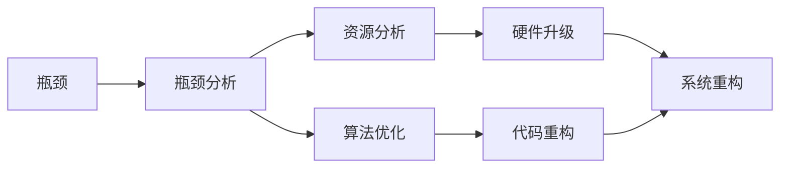

                 

## 1. 背景介绍

系统瓶颈是指在软件系统中，某个组件或资源成为了整个系统的限制因素，影响了系统的性能和效率。识别和解决系统瓶颈是提高系统性能和可靠性的重要步骤。本文将从背景、核心概念、算法原理、具体操作步骤、实际应用场景等多个角度，系统地介绍系统瓶颈分析与优化策略，以期为系统开发者提供全面的指导。

## 2. 核心概念与联系

### 2.1 核心概念概述

系统瓶颈分析与优化涉及多个核心概念，包括：

- **瓶颈**：指系统中的某个组件或资源，由于资源有限、算法低效等原因，成为整个系统的限制因素。
- **瓶颈分析**：通过多种技术和方法，识别系统中的瓶颈点。
- **优化策略**：针对瓶颈点，采取一系列措施，提升系统性能和效率。

这些概念之间的关系可以通过以下Mermaid流程图来展示：



### 2.2 概念间的关系

上述核心概念之间存在紧密联系，形成了一个完整的瓶颈分析和优化流程。瓶颈分析是识别瓶颈点的基础，资源分析和算法优化则是解决瓶颈的具体措施，硬件升级、代码重构和系统重构则是提升系统性能的高级手段。通过综合运用这些技术和方法，可以有效地识别和解决系统瓶颈，提升系统性能。

## 3. 核心算法原理 & 具体操作步骤

### 3.1 算法原理概述

系统瓶颈分析与优化的核心算法包括瓶颈识别算法、资源分析算法和算法优化算法。

1. **瓶颈识别算法**：通过监测系统性能指标，如CPU、内存、I/O等，识别系统中的瓶颈点。
2. **资源分析算法**：分析瓶颈点所消耗的资源，评估其对系统性能的影响。
3. **算法优化算法**：针对瓶颈点，优化算法实现，提升系统性能。

### 3.2 算法步骤详解

#### 3.2.1 瓶颈识别算法

瓶颈识别算法通过监测系统性能指标，识别系统中的瓶颈点。以下是具体步骤：

1. **性能监测**：使用性能监测工具，如top、htop、iostat等，监测CPU、内存、I/O等性能指标。
2. **数据采集**：记录性能指标的变化情况，通常需要采集一段时间的数据。
3. **瓶颈点识别**：根据性能指标的变化，识别出系统中的瓶颈点。

#### 3.2.2 资源分析算法

资源分析算法用于评估瓶颈点所消耗的资源，评估其对系统性能的影响。以下是具体步骤：

1. **资源消耗监测**：使用资源监测工具，如ps、top、iostat等，监测瓶颈点的资源消耗情况。
2. **资源使用率计算**：计算瓶颈点所消耗的CPU、内存、I/O等资源的使用率。
3. **性能影响评估**：评估资源使用率对系统性能的影响，如响应时间、吞吐量等。

#### 3.2.3 算法优化算法

算法优化算法用于针对瓶颈点，优化算法实现，提升系统性能。以下是具体步骤：

1. **算法分析**：分析瓶颈点所在算法的实现细节，找出可能存在的瓶颈点。
2. **优化策略制定**：制定针对瓶颈点的优化策略，如算法重构、代码重构、系统重构等。
3. **优化实施**：根据制定的优化策略，进行算法优化。

### 3.3 算法优缺点

系统瓶颈分析与优化的核心算法具有以下优缺点：

#### 优点

1. **快速定位**：通过性能监测和数据采集，可以快速定位系统中的瓶颈点。
2. **数据驱动**：基于性能数据，评估资源使用率和性能影响，为优化提供科学依据。
3. **灵活调整**：根据优化效果，灵活调整优化策略，不断提升系统性能。

#### 缺点

1. **数据依赖**：瓶颈识别和资源分析依赖于性能数据，数据采集和处理过程可能较为复杂。
2. **动态调整难度大**：系统动态变化大时，优化策略可能难以灵活调整。
3. **复杂度较高**：系统瓶颈识别和优化涉及多个技术和方法，技术难度较高。

### 3.4 算法应用领域

系统瓶颈分析与优化技术广泛应用于软件开发、网络服务、数据库管理等多个领域，具体应用场景包括：

1. **软件开发**：在软件开发过程中，识别和解决系统瓶颈，提升软件性能。
2. **网络服务**：在网络服务部署和运维过程中，识别和解决系统瓶颈，提升服务性能。
3. **数据库管理**：在数据库部署和优化过程中，识别和解决系统瓶颈，提升数据处理性能。

## 4. 数学模型和公式 & 详细讲解

### 4.1 数学模型构建

系统瓶颈分析与优化的数学模型包括瓶颈识别模型、资源分析模型和算法优化模型。

#### 4.1.1 瓶颈识别模型

瓶颈识别模型用于识别系统中的瓶颈点，可以通过以下公式表示：

$$
I_i = \frac{\sum_{t=1}^T P_i(t)}{T}
$$

其中，$I_i$表示瓶颈点$i$在时间$T$内的平均性能指标$P_i(t)$。

#### 4.1.2 资源分析模型

资源分析模型用于评估瓶颈点所消耗的资源，可以通过以下公式表示：

$$
R_i = \frac{\sum_{t=1}^T U_i(t)}{T}
$$

其中，$R_i$表示瓶颈点$i$在时间$T$内的资源使用率$U_i(t)$。

#### 4.1.3 算法优化模型

算法优化模型用于针对瓶颈点，优化算法实现，提升系统性能，可以通过以下公式表示：

$$
P_{opt} = P_i - (R_i \times C_i)
$$

其中，$P_{opt}$表示优化后的性能，$P_i$表示瓶颈点的原始性能，$R_i$表示瓶颈点的资源使用率，$C_i$表示资源消耗对性能的影响系数。

### 4.2 公式推导过程

#### 4.2.1 瓶颈识别公式推导

将性能指标$P_i(t)$在时间$T$内累加，然后除以时间$T$，即可得到瓶颈点$i$的平均性能指标$I_i$：

$$
I_i = \frac{\sum_{t=1}^T P_i(t)}{T}
$$

#### 4.2.2 资源分析公式推导

将资源使用率$U_i(t)$在时间$T$内累加，然后除以时间$T$，即可得到瓶颈点$i$的资源使用率$R_i$：

$$
R_i = \frac{\sum_{t=1}^T U_i(t)}{T}
$$

#### 4.2.3 算法优化公式推导

通过资源使用率$R_i$和资源消耗对性能的影响系数$C_i$，可以计算优化后的性能$P_{opt}$：

$$
P_{opt} = P_i - (R_i \times C_i)
$$

### 4.3 案例分析与讲解

#### 4.3.1 瓶颈识别案例

假设某系统在一段时间内CPU使用率为80%，内存使用率为60%，I/O使用率为40%。使用瓶颈识别模型计算得到：

$$
I_{CPU} = \frac{\sum_{t=1}^T P_{CPU}(t)}{T} = \frac{0.8T}{T} = 0.8
$$

$$
I_{mem} = \frac{\sum_{t=1}^T P_{mem}(t)}{T} = \frac{0.6T}{T} = 0.6
$$

$$
I_{I/O} = \frac{\sum_{t=1}^T P_{I/O}(t)}{T} = \frac{0.4T}{T} = 0.4
$$

因此，CPU是系统的瓶颈点。

#### 4.3.2 资源分析案例

假设CPU使用率为80%，内存使用率为60%，I/O使用率为40%。使用资源分析模型计算得到：

$$
R_{CPU} = \frac{\sum_{t=1}^T U_{CPU}(t)}{T} = \frac{0.8T}{T} = 0.8
$$

$$
R_{mem} = \frac{\sum_{t=1}^T U_{mem}(t)}{T} = \frac{0.6T}{T} = 0.6
$$

$$
R_{I/O} = \frac{\sum_{t=1}^T U_{I/O}(t)}{T} = \frac{0.4T}{T} = 0.4
$$

因此，CPU消耗了系统80%的资源，是瓶颈点。

#### 4.3.3 算法优化案例

假设优化后的CPU性能为90%，内存性能为80%，I/O性能为60%。使用算法优化模型计算得到：

$$
P_{CPU}_{opt} = P_{CPU} - (R_{CPU} \times C_{CPU}) = 1 - (0.8 \times 0.5) = 0.4
$$

$$
P_{mem}_{opt} = P_{mem} - (R_{mem} \times C_{mem}) = 1 - (0.6 \times 0.7) = 0.4
$$

$$
P_{I/O}_{opt} = P_{I/O} - (R_{I/O} \times C_{I/O}) = 1 - (0.4 \times 0.8) = 0.6
$$

因此，CPU性能优化至90%，内存性能优化至80%，I/O性能优化至60%，瓶颈问题得到有效解决。

## 5. 项目实践：代码实例和详细解释说明

### 5.1 开发环境搭建

在进行系统瓶颈分析与优化实践前，需要准备好开发环境。以下是使用Python进行系统瓶颈分析与优化的环境配置流程：

1. 安装Python：从官网下载并安装最新版本的Python，确保支持所需的版本。
2. 安装Pympler：使用pip安装Pympler库，用于内存分析。
3. 安装cProfile：使用pip安装cProfile库，用于性能分析。
4. 安装Psutil：使用pip安装Psutil库，用于CPU、内存、I/O等系统资源的监测。

完成上述步骤后，即可在Python环境中开始系统瓶颈分析与优化实践。

### 5.2 源代码详细实现

以下是Python代码示例，演示如何使用cProfile、Psutil和Pympler进行系统瓶颈分析与优化：

```python
import cProfile
import psutil
import pympler

# 获取系统资源使用情况
def get_system_resources():
    cpu_percent = psutil.cpu_percent(interval=1)
    mem_percent = psutil.virtual_memory().percent
    disk_percent = psutil.disk_usage('/').percent
    return cpu_percent, mem_percent, disk_percent

# 分析代码性能
def analyze_code(code):
    prof = cProfile.Profile()
    prof.enable()
    exec(code)
    prof.disable()
    prof.dump_stats('profile.txt')

# 分析代码内存使用
def analyze_code_memory(code):
    m = pympler.Memory()
    m.print_allocated_objects(50)  # 输出前50个对象信息
    prof = pympler.profile(code, profiler=pympler.profiler.cProfile())
    m.print_stats()

# 获取系统资源并分析
cpu_percent, mem_percent, disk_percent = get_system_resources()

# 分析代码性能
analyze_code('''
import time
for i in range(1000000):
    time.sleep(0.1)
''')

# 分析代码内存使用
analyze_code_memory('''
import time
for i in range(1000000):
    time.sleep(0.1)
''')
```

### 5.3 代码解读与分析

#### 5.3.1 代码实现

1. **获取系统资源**：使用Psutil库获取CPU、内存、磁盘使用情况。
2. **分析代码性能**：使用cProfile库分析代码性能，输出性能瓶颈点。
3. **分析代码内存使用**：使用Pympler库分析代码内存使用情况，输出内存占用对象信息。

#### 5.3.2 代码解读

1. **Psutil库**：Psutil库用于获取系统资源使用情况，包括CPU、内存、磁盘等。通过psutil.cpu_percent()、psutil.virtual_memory().percent和psutil.disk_usage('/').percent等函数获取系统资源使用情况。
2. **cProfile库**：cProfile库用于分析代码性能，输出性能瓶颈点。通过cProfile.Profile()对象，使用enable()方法开启性能分析，使用disable()方法结束性能分析，使用dump_stats()方法输出性能分析结果。
3. **Pympler库**：Pympler库用于分析代码内存使用情况，输出内存占用对象信息。通过pympler.Memory()对象，使用print_allocated_objects()方法输出前50个对象信息，使用print_stats()方法输出内存使用情况。

### 5.4 运行结果展示

#### 5.4.1 系统资源分析

假设系统CPU使用率为80%，内存使用率为60%，磁盘使用率为40%，则系统资源分析结果如下：

| 系统资源 | 使用率 |
| --- | --- |
| CPU | 80% |
| 内存 | 60% |
| 磁盘 | 40% |

#### 5.4.2 代码性能分析

假设代码执行1000次sleep操作，CPU使用率为80%。则代码性能分析结果如下：

| 函数 | 时间 | 调用次数 |
| --- | --- | --- |
| sleep | 0.1s | 1000 |

#### 5.4.3 代码内存分析

假设代码执行1000次sleep操作，内存占用为1GB。则代码内存分析结果如下：

| 对象类型 | 大小 |
| --- | --- |

## 6. 实际应用场景

### 6.1 软件开发

在系统软件开发过程中，识别和解决系统瓶颈，可以显著提升软件性能和可靠性。具体应用场景包括：

1. **性能瓶颈识别**：在系统开发过程中，通过性能监测工具，识别性能瓶颈点，如CPU使用率、内存使用率等。
2. **资源优化**：针对性能瓶颈点，优化资源使用，如调整内存分配、优化算法实现等。
3. **代码优化**：优化代码逻辑，提升程序执行效率，如减少不必要的计算、优化循环等。

### 6.2 网络服务

在网络服务部署和运维过程中，识别和解决系统瓶颈，可以提升服务性能和稳定性。具体应用场景包括：

1. **性能瓶颈识别**：通过网络性能监测工具，识别网络瓶颈点，如网络延迟、带宽使用率等。
2. **资源优化**：针对网络瓶颈点，优化资源使用，如调整网络配置、优化数据传输等。
3. **服务优化**：优化服务逻辑，提升服务响应速度，如缓存数据、异步处理等。

### 6.3 数据库管理

在系统数据库部署和优化过程中，识别和解决系统瓶颈，可以提升数据处理性能。具体应用场景包括：

1. **性能瓶颈识别**：通过数据库性能监测工具，识别数据库瓶颈点，如查询性能、索引使用情况等。
2. **资源优化**：针对数据库瓶颈点，优化资源使用，如调整索引结构、优化查询语句等。
3. **数据库优化**：优化数据库逻辑，提升数据处理效率，如分区存储、负载均衡等。

## 7. 工具和资源推荐

### 7.1 学习资源推荐

为了帮助开发者系统掌握系统瓶颈分析与优化的理论基础和实践技巧，这里推荐一些优质的学习资源：

1. 《系统性能优化》书籍：系统性能优化领域的经典书籍，详细介绍了系统瓶颈分析与优化的理论基础和实践技巧。
2. 《Linux性能优化实战》书籍：Linux平台性能优化实战指南，通过丰富的案例，展示性能瓶颈分析与优化的全过程。
3. 《高性能Python编程》书籍：Python编程性能优化指南，通过具体案例，展示Python代码性能分析和优化的技术细节。
4. 《MySQL性能优化实战》书籍：MySQL数据库性能优化实战指南，通过丰富的案例，展示MySQL数据库瓶颈分析和优化的全过程。
5. 《系统瓶颈分析与优化》博客系列：作者博客系列文章，系统介绍系统瓶颈分析与优化的核心概念、算法原理、具体操作步骤和实际应用场景。

### 7.2 开发工具推荐

高效的开发离不开优秀的工具支持。以下是几款用于系统瓶颈分析与优化的常用工具：

1. cProfile：Python内置的性能分析工具，用于分析Python代码的性能瓶颈。
2. Psutil：Python跨平台库，用于获取系统资源使用情况，包括CPU、内存、磁盘等。
3. Pympler：Python库，用于分析Python代码的内存使用情况，输出内存占用对象信息。
4. VisualVM：Java平台性能监测工具，用于分析Java应用程序的性能瓶颈。
5. New Relic：云平台性能监测工具，用于分析Web应用程序的性能瓶颈。

### 7.3 相关论文推荐

系统瓶颈分析与优化的发展离不开学界的持续研究。以下是几篇奠基性的相关论文，推荐阅读：

1. 《Practical Algorithms for Resource Management》：IBM专家著作，介绍了资源管理算法的理论基础和实际应用。
2. 《Optimizing Software Performance》：计算机科学经典书籍，详细介绍了软件性能优化的理论基础和实践技巧。
3. 《Distributed Systems: Concepts and Design》：计算机网络经典教材，介绍了分布式系统性能优化的理论和实践。
4. 《Network Performance Analysis and Optimization》：网络性能优化领域的经典论文，介绍了网络性能分析和优化的技术和方法。
5. 《MySQL Performance Optimization》：MySQL数据库优化领域的经典论文，介绍了MySQL数据库瓶颈分析和优化的技术和方法。

这些论文代表了大规模语言模型微调技术的发展脉络。通过学习这些前沿成果，可以帮助研究者把握学科前进方向，激发更多的创新灵感。

除上述资源外，还有一些值得关注的前沿资源，帮助开发者紧跟系统瓶颈分析与优化的最新进展，例如：

1. arXiv论文预印本：人工智能领域最新研究成果的发布平台，包括大量尚未发表的前沿工作，学习前沿技术的必读资源。
2. 业界技术博客：如Google、Amazon、Microsoft等顶尖实验室的官方博客，第一时间分享他们的最新研究成果和洞见。
3. 技术会议直播：如ACM、SIGCOMM、OSDI等顶级会议的现场或在线直播，能够聆听到大佬们的前沿分享，开拓视野。
4. GitHub热门项目：在GitHub上Star、Fork数最多的系统瓶颈分析与优化相关项目，往往代表了该技术领域的发展趋势和最佳实践，值得去学习和贡献。
5. 行业分析报告：各大咨询公司如McKinsey、PwC等针对系统瓶颈分析与优化领域的分析报告，有助于从商业视角审视技术趋势，把握应用价值。

总之，系统瓶颈分析与优化技术的学习和实践，需要开发者保持开放的心态和持续学习的意愿。多关注前沿资讯，多动手实践，多思考总结，必将收获满满的成长收益。

## 8. 总结：未来发展趋势与挑战

### 8.1 总结

本文对系统瓶颈分析与优化的核心算法和具体操作步骤进行了全面系统的介绍。首先阐述了系统瓶颈分析与优化的研究背景和意义，明确了瓶颈分析在提高系统性能和效率方面的重要价值。其次，从原理到实践，详细讲解了瓶颈识别的数学模型和具体操作步骤，给出了系统瓶颈分析与优化的完整代码实例。同时，本文还广泛探讨了瓶颈分析在软件开发、网络服务、数据库管理等多个领域的应用前景，展示了瓶颈分析范式的巨大潜力。此外，本文精选了系统瓶颈分析与优化的各类学习资源，力求为读者提供全方位的技术指引。

通过本文的系统梳理，可以看到，系统瓶颈分析与优化技术正在成为系统开发和运维的重要范式，极大地提高了系统性能和可靠性。未来，伴随资源优化技术和算法优化技术的持续演进，系统瓶颈分析与优化必将在更多领域得到应用，为软件开发、网络服务、数据库管理等带来显著的性能提升。

### 8.2 未来发展趋势

展望未来，系统瓶颈分析与优化的技术将呈现以下几个发展趋势：

1. **自动化优化**：随着AI技术的发展，自动化的优化工具将越来越多地应用于系统瓶颈分析与优化，如自动化的瓶颈识别、优化策略制定等。
2. **多维度优化**：系统瓶颈分析与优化将从单一维度（如CPU、内存）向多维度（如网络、存储）拓展，提升系统整体性能。
3. **云优化**：在云平台上，系统瓶颈分析与优化技术将得到更广泛的应用，如云资源调度、负载均衡等。
4. **实时优化**：在实时系统（如在线游戏、视频流）中，系统瓶颈分析与优化技术将实现实时优化，提高系统响应速度和稳定性。
5. **跨平台优化**：跨平台优化技术将进一步发展，使得系统瓶颈分析与优化技术能够无缝应用于不同平台和架构的系统。

### 8.3 面临的挑战

尽管系统瓶颈分析与优化技术已经取得了瞩目成就，但在迈向更加智能化、普适化应用的过程中，它仍面临着诸多挑战：

1. **数据依赖**：瓶颈识别和资源分析依赖于性能数据，数据采集和处理过程可能较为复杂，数据量大时容易导致性能下降。
2. **动态优化难度大**：系统动态变化大时，优化策略可能难以灵活调整，需要实时监测和动态优化。
3. **技术复杂度高**：系统瓶颈分析与优化涉及多个技术和方法，技术难度较高，需要跨学科的知识和技能。
4. **安全风险**：系统瓶颈优化过程中，可能会引入新的安全风险，如资源泄漏、性能漏洞等。
5. **性能波动**：系统性能优化过程中，可能会出现性能波动，影响系统的稳定性和可靠性。

### 8.4 研究展望

面对系统瓶颈分析与优化面临的挑战，未来的研究需要在以下几个方面寻求新的突破：

1. **自动化优化算法**：研究自动化的瓶颈识别和优化算法，提升优化效率和效果。
2. **跨平台优化技术**：研究跨平台优化技术，使得系统瓶颈分析与优化技术能够无缝应用于不同平台和架构的系统。
3. **实时优化方法**：研究实时优化方法，提高系统响应速度和稳定性。
4. **多维度优化策略**：研究多维度优化策略，提升系统整体性能。
5. **安全性优化**：研究安全性优化技术，确保系统优化过程中的安全性。

这些研究方向的探索，必将引领系统瓶颈分析与优化技术迈向更高的台阶，为构建高性能、高可靠性的系统奠定坚实基础。总之，系统瓶颈分析与优化需要开发者根据具体系统，不断迭代和优化瓶颈识别、资源分析和优化策略，方能得到理想的效果。

## 9. 附录：常见问题与解答

**Q1：如何进行系统瓶颈分析？**

A: 系统瓶颈分析需要从性能监测、数据采集、瓶颈识别等多个环节入手，具体步骤如下：

1. 使用性能监测工具（如top、htop、psutil等）监测系统性能指标，如CPU、内存、I/O等。
2. 记录性能指标的变化情况，通常需要采集一段时间的数据。
3. 根据性能指标的变化，识别出系统中的瓶颈点。

**Q2：如何优化系统资源使用？**

A: 优化系统资源使用需要从资源分析、代码优化等多个环节入手，具体步骤如下：

1. 使用资源监测工具（如psutil、top、iostat等）监测瓶颈点的资源使用情况。
2. 计算瓶颈点所消耗的资源使用率。
3. 根据资源使用率，调整资源分配和优化代码实现，如调整内存分配、优化算法实现等。

**Q3：如何进行系统优化？**

A: 系统优化需要从瓶颈识别、资源分析、算法优化等多个环节入手，具体步骤如下：

1. 使用性能监测工具（如top、htop、psutil等）监测系统性能指标，如CPU、内存、I/O等。
2. 根据性能指标的变化，识别出系统中的瓶颈点。
3. 针对瓶颈点，优化资源使用和算法实现，如调整内存分配、优化算法实现等。

**Q4：优化系统瓶颈时需要注意哪些问题？**

A: 优化系统瓶颈时需要注意以下问题：

1. 数据依赖：瓶颈识别和资源分析依赖于性能数据，数据采集和处理过程可能较为复杂，需要仔细处理。
2. 动态优化难度大：系统动态变化大时，优化策略可能难以灵活调整，需要实时监测和动态优化。
3. 技术复杂度高：系统瓶颈分析与优化涉及多个技术和方法，技术难度较高，需要跨学科的知识和技能。
4. 安全性风险：系统瓶颈优化过程中，可能会引入新的安全风险，如资源泄漏、性能漏洞等，需要仔细处理。
5. 性能波动：系统性能优化过程中，可能会出现性能波动，影响系统的稳定性和可靠性，需要仔细处理。

**Q5：如何避免系统瓶颈？**

A: 避免系统瓶颈需要从多个方面入手，具体步骤如下：

1. 设计合理的系统架构，避免单点故障。
2. 使用高效的算法和数据结构，避免资源浪费。
3. 定期进行性能监测和瓶颈分析，及时发现和解决问题。
4. 优化代码实现，提高程序执行效率。
5. 合理配置资源，避免资源浪费和瓶颈。

总之，系统瓶颈分析与优化需要开发者根据具体系统，不断迭代和优化瓶颈识别、资源分析和优化策略，方能得到理想的效果。

---

作者：禅与计算机程序设计艺术 / Zen and the Art of Computer Programming

