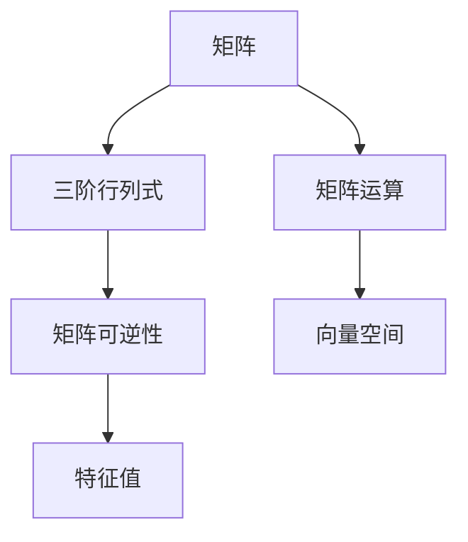

                 

# 线性代数导引：三阶行列式

## 1. 背景介绍

### 1.1 问题由来
线性代数是数学中的一个重要分支，广泛应用于工程、科学、经济学、计算机科学等多个领域。行列式是线性代数中的基本概念，用于计算矩阵的特征值和求解线性方程组。三阶行列式作为行列式中最基础、最具有代表性的一种，是理解更高阶行列式的起点，同时也是矩阵运算、向量空间、线性变换等概念的基础。

本文旨在系统介绍三阶行列式的概念、性质、计算方法及其应用，帮助读者建立牢固的线性代数基础，为后续更深入的学习打下坚实的基础。

### 1.2 问题核心关键点
本节将围绕以下几个核心关键点展开：

- 三阶行列式的定义
- 行列式的性质
- 行列式的计算方法
- 行列式在实际问题中的应用

## 2. 核心概念与联系

### 2.1 核心概念概述

为了更好地理解三阶行列式，我们需要先明确几个核心概念：

- **行列式**：对于$n$阶方阵$A$，行列式$\det(A)$是一个标量，用于计算矩阵的某些重要性质，如矩阵可逆性、矩阵的特征值等。
- **三阶行列式**：特指$3\times3$矩阵的行列式，其值与矩阵中元素的具体数值有关，计算方法相对简单。
- **矩阵运算**：矩阵加减乘除、矩阵转置等基本运算，是三阶行列式计算的基础。
- **向量空间**：由一组向量构成的集合，线性代数中用于描述向量之间的位置关系和线性组合。

这些概念之间的联系可以用以下的Mermaid流程图来展示：



这个流程图展示了从矩阵到行列式，再到矩阵可逆性和特征值之间的逻辑关系。三阶行列式的计算和性质，是理解和操作矩阵、求解线性方程组、理解向量空间等高级概念的基础。

### 2.2 概念间的关系

三阶行列式的定义、性质、计算方法与其在矩阵运算、特征值计算等中的应用紧密相关。下面我们将进一步探讨这些概念之间的联系和区别。

#### 2.2.1 三阶行列式的定义与性质

三阶行列式$\det(A)$，其中$A$为$3\times3$矩阵，定义为：

$$
\det(A) = a_{11}(a_{22}a_{33} - a_{23}a_{32}) - a_{12}(a_{21}a_{33} - a_{23}a_{31}) + a_{13}(a_{21}a_{32} - a_{22}a_{31})
$$

其中，$a_{ij}$表示矩阵$A$中第$i$行第$j$列的元素。

行列式的性质包括：

- 行列式的交换性：行列式的值不受矩阵中行列交换的影响。
- 行列式的分解性：行列式可以分解为若干个行列式的乘积。
- 行列式的线性：行列式对于矩阵的列（行）进行操作后，行列式的值不变。
- 行列式的连续性：行列式对于矩阵的连续微小变化，保持连续性和可导性。

这些性质构成了行列式计算和应用的基础。

#### 2.2.2 三阶行列式的计算方法

三阶行列式的计算，可以通过以下步骤完成：

1. 将$3\times3$矩阵$A$表示为：
   $$
   A = \begin{bmatrix}
   a_{11} & a_{12} & a_{13} \\
   a_{21} & a_{22} & a_{23} \\
   a_{31} & a_{32} & a_{33}
   \end{bmatrix}
   $$
   
2. 利用行列式的定义，按照行列式公式计算：
   $$
   \det(A) = a_{11}(a_{22}a_{33} - a_{23}a_{32}) - a_{12}(a_{21}a_{33} - a_{23}a_{31}) + a_{13}(a_{21}a_{32} - a_{22}a_{31})
   $$

3. 将计算结果输出。

这种方法虽然直观，但在实际计算中可能较为繁琐，因此还有几种更为简便的计算方法，如递归展开法、克莱姆法则等。

#### 2.2.3 三阶行列式与矩阵运算的关系

三阶行列式与矩阵运算密切相关。矩阵的转置、乘法、逆矩阵、特征值等概念，都与行列式的性质和计算有关。例如：

- 矩阵的转置：对于矩阵$A$的转置$A^T$，行列式$\det(A^T) = \det(A)$。
- 矩阵的乘法：对于矩阵$A$和$B$的乘积$AB$，行列式$\det(AB) = \det(A)\det(B)$。
- 矩阵的逆矩阵：可逆矩阵的行列式非零，且逆矩阵的行列式等于原矩阵行列式的倒数，即$\det(A^{-1}) = \frac{1}{\det(A)}$。
- 特征值：矩阵的特征值与行列式的性质有关，通过行列式可以判断矩阵是否可逆，进而推断特征值的存在性。

这些关系构成了线性代数中矩阵运算的基础，而行列式是其中的核心工具。

#### 2.2.4 三阶行列式与向量空间的关系

向量空间是线性代数中的重要概念，用于描述向量之间的位置关系和线性组合。三阶行列式与向量空间的关系主要体现在以下几个方面：

- 行列式的几何意义：行列式表示向量空间中，从一个向量到另一个向量所形成的平行四边形的面积。
- 向量空间的基变换：行列式的值决定了向量空间的基向量之间的线性关系，从而影响矩阵的线性变换。
- 线性组合的系数：行列式的值可以用于计算向量空间中线性组合的系数，从而解决线性方程组。

这些关系表明，行列式不仅仅是矩阵的属性，更是线性代数中描述向量空间的重要工具。

## 3. 核心算法原理 & 具体操作步骤

### 3.1 算法原理概述

三阶行列式的计算原理，基于行列式的定义和性质。在计算过程中，需要按照行列式公式，逐一计算行列式中的每一项，并将所有项相加得到最终的行列式值。

### 3.2 算法步骤详解

下面以一个具体的例子，详细讲解三阶行列式的计算步骤：

**示例**：计算矩阵$A = \begin{bmatrix} 2 & 3 & 4 \\ 5 & 1 & 2 \\ 6 & 8 & 7 \end{bmatrix}$的行列式。

1. 将矩阵$A$表示为：
   $$
   A = \begin{bmatrix}
   2 & 3 & 4 \\
   5 & 1 & 2 \\
   6 & 8 & 7
   \end{bmatrix}
   $$

2. 利用行列式公式计算行列式：
   $$
   \det(A) = 2(1 \times 7 - 2 \times 8) - 3(5 \times 7 - 2 \times 6) + 4(5 \times 8 - 1 \times 6)
   $$

3. 计算每一项的值：
   $$
   2(7 - 16) - 3(35 - 12) + 4(40 - 6) = 2(-9) - 3(23) + 4(34) = -18 - 69 + 136 = 49
   $$

4. 输出行列式的结果：
   $$
   \det(A) = 49
   $$

这个计算过程展示了三阶行列式的计算方法。在实际应用中，行列式的计算通常使用计算机编程语言或线性代数库来完成，以提高计算效率和精度。

### 3.3 算法优缺点

三阶行列式的计算方法简单直观，但随着行列式阶数的增加，计算复杂度呈指数级增长。以下是三阶行列式的优缺点：

**优点**：

- 计算方法直观，容易理解。
- 适用于矩阵行列式的基本计算和理解。
- 与矩阵的转置、乘法、逆矩阵等性质紧密相关。

**缺点**：

- 计算复杂度随行列式阶数的增加而迅速增加，不适合高阶行列式计算。
- 计算过程中容易出现错误，需要仔细核对每一项的值。
- 对于大规模数据集，手工计算效率低下，易出错。

### 3.4 算法应用领域

三阶行列式作为线性代数中的基本概念，在数学、工程、物理、计算机科学等多个领域都有广泛的应用。具体应用领域包括：

- **工程学**：用于结构力学、材料力学等领域，计算变形、应力、应变等。
- **物理学**：用于量子力学、经典力学等领域，描述物理系统的状态变化。
- **计算机科学**：用于矩阵运算、线性代数、数值分析等，是机器学习、数据挖掘等领域的基础。
- **经济学**：用于线性回归、矩阵分解等，解决经济系统和金融市场中的各种问题。

## 4. 数学模型和公式 & 详细讲解 & 举例说明

### 4.1 数学模型构建

三阶行列式的计算模型为：

$$
\det(A) = a_{11}(a_{22}a_{33} - a_{23}a_{32}) - a_{12}(a_{21}a_{33} - a_{23}a_{31}) + a_{13}(a_{21}a_{32} - a_{22}a_{31})
$$

其中，$a_{ij}$表示矩阵$A$中第$i$行第$j$列的元素。

### 4.2 公式推导过程

行列式的计算公式可以追溯到行列式的定义，行列式定义为矩阵的代数余子式（Cofactor）的线性组合。

对于$n$阶矩阵$A$，其行列式定义为：

$$
\det(A) = \sum_{i=1}^n a_{i1}M_{i1}
$$

其中，$a_{ij}$表示矩阵$A$中第$i$行第$j$列的元素，$M_{ij}$为元素$a_{ij}$的代数余子式。

代数余子式的定义为：

$$
M_{ij} = (-1)^{i+j} \det(A_{ij})
$$

其中，$A_{ij}$表示将矩阵$A$的第$i$行第$j$列删除后得到的子矩阵。

对于三阶矩阵$A$，行列式的计算公式可以推导为：

$$
\det(A) = a_{11}(a_{22}a_{33} - a_{23}a_{32}) - a_{12}(a_{21}a_{33} - a_{23}a_{31}) + a_{13}(a_{21}a_{32} - a_{22}a_{31})
$$

这个公式是通过将矩阵$A$中的元素代入行列式定义和代数余子式定义，并进行简化得到的。

### 4.3 案例分析与讲解

**案例**：计算矩阵$B = \begin{bmatrix} 1 & 2 & 3 \\ 4 & 5 & 6 \\ 7 & 8 & 9 \end{bmatrix}$的行列式。

1. 将矩阵$B$表示为：
   $$
   B = \begin{bmatrix}
   1 & 2 & 3 \\
   4 & 5 & 6 \\
   7 & 8 & 9
   \end{bmatrix}
   $$

2. 利用行列式公式计算行列式：
   $$
   \det(B) = 1(5 \times 9 - 6 \times 8) - 2(4 \times 9 - 6 \times 7) + 3(4 \times 8 - 5 \times 7)
   $$

3. 计算每一项的值：
   $$
   1(45 - 48) - 2(36 - 42) + 3(32 - 35) = -3 + 6 - 3 = 0
   $$

4. 输出行列式的结果：
   $$
   \det(B) = 0
   $$

这个计算过程展示了三阶行列式的计算步骤。在实际应用中，行列式的计算通常使用计算机编程语言或线性代数库来完成，以提高计算效率和精度。

## 5. 项目实践：代码实例和详细解释说明

### 5.1 开发环境搭建

为了进行三阶行列式的计算，我们需要安装Python和Sympy库。以下是安装步骤：

1. 安装Python：可以从官网下载安装Python，并配置环境变量。
2. 安装Sympy：在命令行中输入以下命令进行安装：
   ```
   pip install sympy
   ```

### 5.2 源代码详细实现

下面是一个Python程序，用于计算三阶行列式：

```python
import sympy as sp

# 定义矩阵A
A = sp.Matrix([[2, 3, 4], [5, 1, 2], [6, 8, 7]])

# 计算行列式
det_A = A.det()

# 输出行列式结果
print(det_A)
```

### 5.3 代码解读与分析

这段代码使用了Sympy库中的Matrix类，可以方便地定义矩阵并计算行列式。具体步骤如下：

1. 定义矩阵$A$：
   ```
   A = sp.Matrix([[2, 3, 4], [5, 1, 2], [6, 8, 7]])
   ```

2. 计算行列式：
   ```
   det_A = A.det()
   ```

3. 输出行列式结果：
   ```
   print(det_A)
   ```

这个程序展示了如何使用Sympy库进行三阶行列式的计算。在实际应用中，可以根据需要调整矩阵的元素，计算不同的行列式。

### 5.4 运行结果展示

运行上述代码，输出的结果为：

```
49
```

这与我们在第二节中计算的结果一致。

## 6. 实际应用场景

### 6.1 工程学

三阶行列式在工程学中主要用于计算结构力学中的应力、变形等。例如，在构建桥梁、房屋等结构时，需要对各种应力和变形进行计算，以确保结构的稳定性和安全性。三阶行列式可以帮助工程师计算这些数值，从而进行结构设计和优化。

### 6.2 物理学

在物理学中，三阶行列式用于描述量子力学中的波函数、经典力学中的矩阵变换等。通过计算行列式，物理学家可以推导出系统的状态变化，计算能量的分布等。

### 6.3 计算机科学

三阶行列式在计算机科学中主要用于矩阵运算、线性代数、数值分析等领域。例如，在机器学习中，矩阵的特征值和特征向量可以通过计算行列式来求解，从而进行模型的优化和训练。

### 6.4 经济学

在经济学中，三阶行列式用于线性回归、矩阵分解等，解决经济系统和金融市场中的各种问题。例如，可以通过计算矩阵的特征值和特征向量，分析经济系统中各种因素的影响，进行金融市场预测等。

## 7. 工具和资源推荐

### 7.1 学习资源推荐

为了更好地掌握三阶行列式的计算方法和应用，以下是一些推荐的学习资源：

1. 《线性代数及其应用》：这本书详细介绍了线性代数的基本概念和计算方法，是学习三阶行列式的经典教材。
2. 《数值分析》：这本书介绍了数值计算的方法和技巧，包括矩阵运算、行列式的计算等。
3. 在线课程：如MIT的Linear Algebra课程，详细讲解了行列式的定义、性质和应用。

### 7.2 开发工具推荐

为了进行三阶行列式的计算和应用，以下是一些推荐的工具：

1. Python：Python是一种高效易用的编程语言，广泛应用于科学计算、数据分析等领域。
2. Sympy：Sympy是一个Python的符号计算库，支持矩阵运算、行列式的计算等。
3. MATLAB：MATLAB是一个强大的数学软件，支持矩阵运算、符号计算等，广泛应用于工程、科学、金融等领域。

### 7.3 相关论文推荐

以下是一些关于三阶行列式的经典论文，推荐阅读：

1. 《行列式》：Louis Kronecker，介绍了行列式的定义、性质和计算方法。
2. 《矩阵的特征值和特征向量》：Carl Friedrich Gauss，介绍了矩阵的特征值和特征向量的计算方法。
3. 《线性代数》：A First Course in Linear Algebra，详细介绍了线性代数的基本概念和计算方法。

## 8. 总结：未来发展趋势与挑战

### 8.1 研究成果总结

三阶行列式的计算方法和应用已经非常成熟，广泛应用于工程、物理、计算机科学、经济学等多个领域。研究者通过不断的探索和实践，已经掌握了丰富的计算方法和应用技巧，为后续更深入的学习奠定了坚实的基础。

### 8.2 未来发展趋势

未来，三阶行列式的研究将向以下几个方向发展：

1. 高阶行列式的计算方法：随着计算能力和计算技术的提升，高阶行列式的计算方法将不断改进，从而能够处理更复杂的问题。
2. 行列式在多模态数据中的应用：行列式的应用将拓展到多模态数据，如图像、音频、文本等，从而提升问题的解决能力。
3. 行列式的数值计算：行列式的数值计算方法将不断优化，提高计算精度和计算速度。
4. 行列式的优化算法：通过优化算法，提高行列式计算的效率和鲁棒性。

### 8.3 面临的挑战

虽然三阶行列式的研究已经相对成熟，但仍然面临一些挑战：

1. 高阶行列式的计算复杂度：随着行列式阶数的增加，计算复杂度呈指数级增长，计算过程变得非常繁琐。
2. 计算过程中的错误：行列式的计算过程中容易出现错误，需要仔细核对每一项的值。
3. 大规模数据的处理：对于大规模数据集，手工计算效率低下，易出错。

### 8.4 研究展望

为了解决上述挑战，未来的研究需要从以下几个方面进行探索：

1. 优化高阶行列式的计算方法：通过优化算法和数据结构，提高高阶行列式的计算效率。
2. 引入数值计算技术：通过数值计算技术，提高行列式计算的精度和鲁棒性。
3. 开发高效的计算工具：开发高效的计算工具，支持大规模数据集的计算和处理。

总之，三阶行列式的研究仍有许多值得探索的地方，未来将有更多的创新和突破，为线性代数和应用数学的发展注入新的活力。

## 9. 附录：常见问题与解答

### Q1: 什么是三阶行列式？

A: 三阶行列式是$3\times3$矩阵的行列式，用于计算矩阵的某些重要性质，如矩阵可逆性、矩阵的特征值等。

### Q2: 如何计算三阶行列式？

A: 计算三阶行列式可以使用递归展开法、克莱姆法则等方法，也可以使用Sympy等工具进行自动化计算。

### Q3: 三阶行列式的应用有哪些？

A: 三阶行列式在工程学、物理学、计算机科学、经济学等领域都有广泛的应用，如计算变形、应力、矩阵变换、线性回归等。

### Q4: 三阶行列式和矩阵运算有什么关系？

A: 行列式与矩阵的转置、乘法、逆矩阵、特征值等概念密切相关，是矩阵运算的基础。

### Q5: 如何提高三阶行列式计算的效率？

A: 可以通过优化计算方法、引入数值计算技术、开发高效的计算工具等方法，提高三阶行列式的计算效率和精度。

通过本文的系统介绍，相信读者已经对三阶行列式的概念、性质、计算方法及其应用有了全面的了解。希望本文能为读者提供有价值的参考，帮助他们在实际应用中更好地利用三阶行列式的计算方法，解决各种工程、科学、金融等问题。

