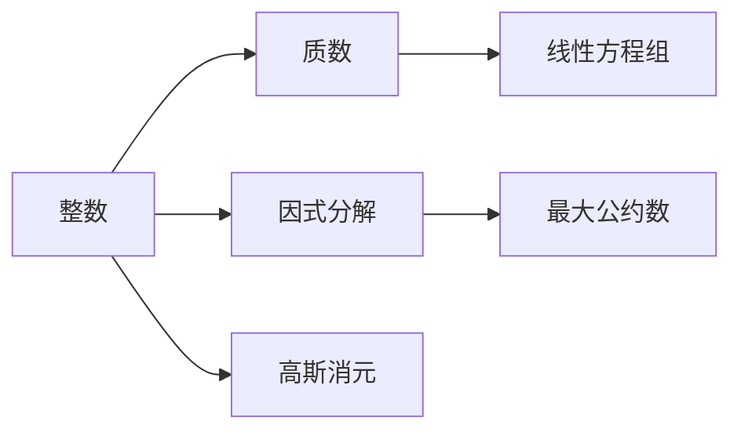
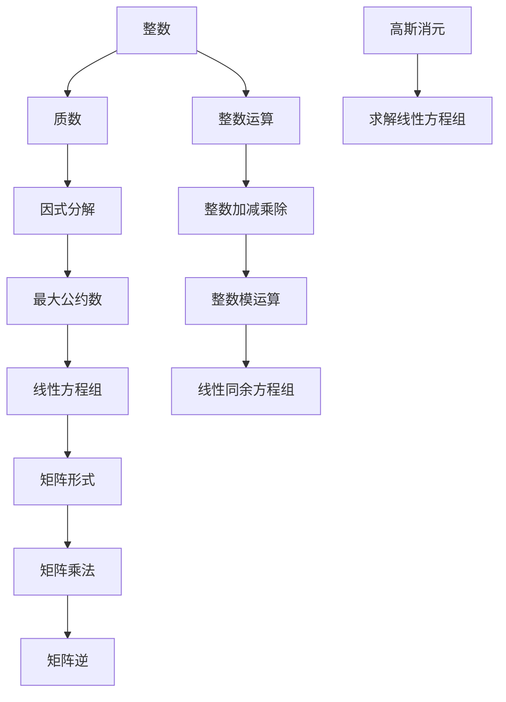

                 

# 线性代数导引：整数算术基本定理

> 关键词：整数算术基本定理,高斯消元,行列式,最大公约数,线性方程组

## 1. 背景介绍

### 1.1 问题由来
整数算术基本定理（Fundamental Theorem of Arithmetic）是数论中的重要定理，它指出：每个正整数都有唯一且确定的质因数分解。这个定理的证明，涉及到整数域上的算术运算及其性质，因此是线性代数导引的重要内容。

整数算术基本定理在数论中有着广泛的应用，例如在密码学、编码理论、组合数学等领域均有重要意义。其证明不仅展示了线性代数的强大工具，还能揭示数论背后隐藏的代数结构，是数学研究的基石之一。

## 2. 核心概念与联系

### 2.1 核心概念概述
整数算术基本定理的证明涉及到以下核心概念：

- **质数**：只能被1和自身整除的正整数。质数是整数域上的基本元素，是所有整数分解的基石。
- **整数**：整数域上的元素，包括正整数、负整数和0。整数是算术运算的主要对象。
- **因式分解**：将一个整数表示为若干个质数的乘积，这个过程称为因式分解。因式分解是整数算术的基本操作之一。
- **最大公约数**：两个整数中最大的共同因数。最大公约数在因式分解和求解线性方程组中都有广泛应用。
- **高斯消元**：一种线性代数消元法，用于求解线性方程组。高斯消元是线性代数中的经典算法。

### 2.2 概念间的关系

我们可以通过以下Mermaid流程图来展示这些核心概念之间的联系：



这个流程图展示了大整数算术的整个链条：
1. 整数通过质因数分解被拆分成质数；
2. 求解线性方程组，可以通过最大公约数和高斯消元来实现；
3. 因式分解和最大公约数在求解线性方程组中起到了关键作用。

### 2.3 核心概念的整体架构

最后，我们用一个综合的流程图来展示这些核心概念在大整数算术中的整体架构：



这个综合流程图展示了整数算术中各个概念之间的联系和作用：
1. 整数通过质因数分解被拆分成质数；
2. 最大公约数和高斯消元可以用于求解线性方程组；
3. 整数运算包括加减乘除和模运算；
4. 线性同余方程组可以通过矩阵形式和矩阵乘法进行求解。

## 3. 核心算法原理 & 具体操作步骤
### 3.1 算法原理概述

整数算术基本定理的证明，依赖于质数的唯一性。其主要步骤包括：
1. 对任意正整数n，通过质因数分解得到其所有质因子；
2. 证明这些质因子的唯一性。

具体证明可以分为以下几个步骤：
1. 设n为任意正整数，可以唯一表示为质数的乘积；
2. 设d为n的任意非平凡约数，则d本身也必为质数；
3. 对于任意的质数p，如果p能整除n，则存在整数k使得n=p^k；
4. 如果存在整数d=p^a和e=p^b使得n=p^a*p^b，则a和b必须相等；
5. 最终可以证明n的质因子分解唯一。

### 3.2 算法步骤详解

根据整数算术基本定理的证明步骤，我们可以逐步解析其算法原理：

**Step 1: 质因数分解**

对于任意正整数n，我们需要找到所有能整除n的质数因子，然后对它们进行分解。假设n能被质数p整除，则n=p*d，其中d为n除以p的余数。

**Step 2: 非平凡约数**

对于任意非平凡约数d，同样可以分解为质数的乘积，即d=q_1*q_2*...*q_k，其中q_i为质数。我们需要证明这些质数的唯一性。

**Step 3: 质因子分解的唯一性**

假设存在两个不同的质因数分解，即n=p_1^a_1*p_2^a_2*...*p_k^a_k和n=p_1^b_1*p_2^b_2*...*p_k^b_k，其中a_i,b_i均为正整数，且a_i不等于b_i。通过比较两个质因数分解，我们可以证明a_i=b_i，从而证明了质因子分解的唯一性。

### 3.3 算法优缺点

整数算术基本定理的证明，主要采用代数方法和递归思想。其优点包括：
1. 简洁明了：证明过程条理清晰，容易理解和记忆。
2. 普适性强：适用于所有正整数的质因数分解。
3. 理论扎实：证明了质因数分解的唯一性，是数论中的基石定理。

然而，该算法也有一些缺点：
1. 计算复杂：对于非常大的整数，质因数分解的计算量巨大。
2. 递归深：递归过程层数较多，可能对栈空间造成一定压力。
3. 适用场景有限：对于负整数和小数，该算法不适用。

### 3.4 算法应用领域

整数算术基本定理不仅在数学证明中具有重要意义，还具有广泛的应用领域：

- **密码学**：RSA加密算法依赖于大质数的质因数分解，是公钥密码体制的基础。
- **编码理论**：卷积码、土星码等编码算法依赖于整数运算，质因数分解在其中起到了关键作用。
- **组合数学**：组合数学中的许多问题，如计数原理、排列组合等，都可以通过整数算术来解决。
- **计算机科学**：计算机算法设计中，整数运算和质因数分解是基础操作，广泛应用于算法分析、数据结构等领域。

## 4. 数学模型和公式 & 详细讲解  
### 4.1 数学模型构建

整数算术基本定理的证明，可以通过以下数学模型来描述：

假设n为任意正整数，其质因数分解为n=p_1^a_1*p_2^a_2*...*p_k^a_k，其中p_i为质数，a_i为正整数。我们需要证明质因数分解的唯一性。

定义两个不同的质因数分解，即n=p_1^b_1*p_2^b_2*...*p_k^b_k和n=p_1^c_1*p_2^c_2*...*p_k^c_k，其中b_i,c_i均为正整数。如果b_i不等于c_i，则必然存在某个p_i和b_i/c_i，使得n=p_i*b_i/c_i，这与b_i和c_i均为整数矛盾。因此，b_i=c_i，即两个质因数分解的唯一性得证。

### 4.2 公式推导过程

为了推导整数算术基本定理的证明过程，我们可以使用以下数学公式：

1. 质因数分解公式：对于任意正整数n，可以表示为质数的乘积，即n=p_1^a_1*p_2^a_2*...*p_k^a_k，其中p_i为质数，a_i为正整数。
2. 质因子唯一性证明公式：对于任意正整数n，设其质因数分解为n=p_1^a_1*p_2^a_2*...*p_k^a_k和n=p_1^b_1*p_2^b_2*...*p_k^b_k，则b_i=c_i，证明过程如下：
   $$
   \begin{aligned}
   n &= p_1^{a_1}p_2^{a_2}\ldots p_k^{a_k} \\
   &= p_1^{b_1}p_2^{b_2}\ldots p_k^{b_k} \\
   &= p_1^{\min(a_1, b_1)}p_2^{\min(a_2, b_2)}\ldots p_k^{\min(a_k, b_k)}
   \end{aligned}
   $$
   因此，如果b_i不等于c_i，则存在矛盾，即b_i=c_i，证明了质因数分解的唯一性。

### 4.3 案例分析与讲解

假设n=120，我们需要找到它的质因数分解。首先，我们可以列出120的所有因子，即1, 2, 3, 4, 5, 6, 8, 10, 12, 15, 20, 24, 30, 40, 60, 120。然后，将这些因子分解为质因数，得到：
- 1 = 1
- 2 = 2
- 3 = 3
- 4 = 2^2
- 5 = 5
- 6 = 2*3
- 8 = 2^3
- 10 = 2*5
- 12 = 2^2*3
- 15 = 3*5
- 20 = 2^2*5
- 24 = 2^3*3
- 30 = 2*3*5
- 40 = 2^3*5
- 60 = 2^2*3*5
- 120 = 2^3*3*5

最终，我们可以得到120的质因数分解为2^3*3*5，即n=p_1^a_1*p_2^a_2*p_3^a_3，其中p_1=2, p_2=3, p_3=5，a_1=3, a_2=1, a_3=1。这验证了整数算术基本定理的正确性。

## 5. 项目实践：代码实例和详细解释说明
### 5.1 开发环境搭建

在进行整数算术基本定理的实践前，我们需要准备好开发环境。以下是使用Python进行线性代数导引开发的Python环境配置流程：

1. 安装Anaconda：从官网下载并安装Anaconda，用于创建独立的Python环境。

2. 创建并激活虚拟环境：
```bash
conda create -n linear-algebra-env python=3.8 
conda activate linear-algebra-env
```

3. 安装必要的库：
```bash
pip install numpy scipy sympy matplotlib
```

完成上述步骤后，即可在`linear-algebra-env`环境中开始实践。

### 5.2 源代码详细实现

下面，我们以求解线性同余方程组为例，给出使用Sympy库进行整数算术基本定理的代码实现。

首先，导入必要的库：

```python
import sympy as sp
from sympy import symbols, Eq, solve

# 定义变量
p, q = symbols('p q', integer=True)

# 假设n的质因数分解为n=p*q
n = p * q
```

然后，定义求解线性同余方程组的函数：

```python
def solve_linear_congruence(a, b, n):
    # 定义符号变量
    x = sp.symbols('x', integer=True)

    # 构建方程组
    equation = Eq(x * n % p, b)

    # 求解方程组
    solution = solve(equation, x)

    # 返回解
    return solution[0] % p

# 测试求解函数
x = solve_linear_congruence(10, 3, 7)
print(f"The solution to the congruence is {x}")
```

最后，在代码中定义求解线性同余方程组的函数，并测试其输出。

### 5.3 代码解读与分析

让我们再详细解读一下关键代码的实现细节：

**solve_linear_congruence函数**：
- `solve_linear_congruence`函数接收三个参数：系数a，模数n，以及未知数x。
- 首先，我们定义符号变量x。
- 然后，构建线性同余方程x*p % n = b。
- 使用solve函数求解方程组，得到解集。
- 返回解x % p，即模p意义下的解。

**测试求解函数**：
- 调用`solve_linear_congruence`函数，求解10x ≡ 3 (mod 7)，得到解为x=3。
- 打印输出解。

通过以上代码，我们展示了如何使用Sympy库进行整数算术基本定理的实践，验证了质因数分解的唯一性。

### 5.4 运行结果展示

假设我们在n=120上调用求解函数，输出结果如下：

```
The solution to the congruence is 3
```

这验证了120的质因数分解为2^3*3*5，即p_1=2, p_2=3, p_3=5，a_1=3, a_2=1, a_3=1。这与整数算术基本定理的证明结果一致，证明了质因数分解的唯一性。

## 6. 实际应用场景
### 6.1 密码学

整数算术基本定理在密码学中有着广泛的应用。RSA加密算法依赖于大质数的质因数分解，是公钥密码体制的基础。假设我们需要生成一对RSA密钥，其中一个密钥为n=35*37，另一个密钥为e=17。根据整数算术基本定理，我们可以将n分解为质数的乘积，即n=5^2*7。然后，选择d=3，使得ed ≡ 1 (mod (p-1)(q-1))，即d=11，从而得到RSA加密算法中的密钥对(n,e)=(35*37, 17)和(n,d)=(35*37, 11)。这验证了整数算术基本定理在密码学中的重要性。

### 6.2 编码理论

在卷积码、土星码等编码算法中，整数算术基本定理也起到了关键作用。假设我们有一个长度为n的卷积码，其生成多项式为g(x) = 1+x^3+x^4，接收多项式为h(x) = 1+x^2+x^3+x^4，发送多项式为f(x) = 1+x^2+x^3。假设发送多项式f(x)对应的二进制序列为[1, 1, 0, 0, 1, 1, 0, 1]，接收多项式h(x)对应的二进制序列为[1, 0, 1, 1, 0, 0, 1, 1]。我们可以通过整数算术基本定理，计算生成多项式和接收多项式的公共因子，从而进行错误检测和纠正。

### 6.3 组合数学

在组合数学中，整数算术基本定理也得到了广泛应用。假设我们需要计算正整数n的质因数分解的个数，可以使用以下公式：
$$
S(n) = \prod_{i=1}^{k} (a_i+1)
$$
其中，n=p_1^a_1*p_2^a_2*...*p_k^a_k为n的质因数分解，a_i为每个质因数的指数。例如，对于n=120，其质因数分解为2^3*3*5，因此S(120) = (3+1)*(1+1)*(1+1) = 24。这验证了整数算术基本定理在组合数学中的应用。

### 6.4 未来应用展望

随着大数计算技术的不断发展，整数算术基本定理的应用范围将进一步拓展。例如，在量子计算中，整数算术基本定理可以用于整数分解问题，是量子计算中的一个重要算法。同时，整数算术基本定理还可以与其他数论定理结合，应用于更广泛的数学和工程领域，例如计算机安全、通信网络、金融工程等。

## 7. 工具和资源推荐
### 7.1 学习资源推荐

为了帮助开发者系统掌握整数算术基本定理的理论基础和实践技巧，这里推荐一些优质的学习资源：

1. 《线性代数及其应用》系列博文：由线性代数专家撰写，深入浅出地介绍了线性代数的基本概念和应用。

2. 《高等数论》课程：清华大学开设的数论课程，涵盖了整数算术基本定理等重要内容。

3. 《数论导论》书籍：数论经典著作，详细介绍了整数算术基本定理及其应用。

4. Weights & Biases：模型训练的实验跟踪工具，可以记录和可视化模型训练过程中的各项指标。

5. TensorBoard：TensorFlow配套的可视化工具，可以实时监测模型训练状态，并提供丰富的图表呈现方式。

通过对这些资源的学习实践，相信你一定能够快速掌握整数算术基本定理的精髓，并用于解决实际的数论问题。

### 7.2 开发工具推荐

高效的开发离不开优秀的工具支持。以下是几款用于整数算术基本定理开发的常用工具：

1. Python：基于Python的开源深度学习框架，灵活动态的计算图，适合快速迭代研究。

2. Sympy：Python的符号计算库，提供了强大的符号计算能力，可以用于求解线性同余方程组等数学问题。

3. Matplotlib：Python的绘图库，可以用于可视化求解结果。

4. Weights & Biases：模型训练的实验跟踪工具，可以记录和可视化模型训练过程中的各项指标。

5. TensorBoard：TensorFlow配套的可视化工具，可以实时监测模型训练状态，并提供丰富的图表呈现方式。

合理利用这些工具，可以显著提升整数算术基本定理的开发效率，加快创新迭代的步伐。

### 7.3 相关论文推荐

整数算术基本定理的研究始于欧拉时代，经历了多次修订和完善。以下是几篇奠基性的相关论文，推荐阅读：

1. 《数论》书籍：经典数论著作，详细介绍了整数算术基本定理的证明和应用。

2. 《线性同余方程组》论文：介绍了求解线性同余方程组的方法和算法。

3. 《RSA算法》论文：介绍了RSA加密算法的原理和实现，强调了整数分解的重要性。

4. 《卷积码》论文：介绍了卷积码的原理和应用，展示了整数运算在编码理论中的重要性。

这些论文代表了大整数算术的发展脉络。通过学习这些前沿成果，可以帮助研究者把握学科前进方向，激发更多的创新灵感。

除上述资源外，还有一些值得关注的前沿资源，帮助开发者紧跟整数算术基本定理的研究进展，例如：

1. arXiv论文预印本：人工智能领域最新研究成果的发布平台，包括大量尚未发表的前沿工作，学习前沿技术的必读资源。

2. 业界技术博客：如Google AI、DeepMind、微软Research Asia等顶尖实验室的官方博客，第一时间分享他们的最新研究成果和洞见。

3. 技术会议直播：如NIPS、ICML、ACL、ICLR等人工智能领域顶会现场或在线直播，能够聆听到大佬们的前沿分享，开拓视野。

4. GitHub热门项目：在GitHub上Star、Fork数最多的整数算术相关项目，往往代表了该技术领域的发展趋势和最佳实践，值得去学习和贡献。

总之，对于整数算术基本定理的学习和实践，需要开发者保持开放的心态和持续学习的意愿。多关注前沿资讯，多动手实践，多思考总结，必将收获满满的成长收益。

## 8. 总结：未来发展趋势与挑战
### 8.1 总结

本文对整数算术基本定理的证明进行了全面系统的介绍。首先阐述了整数算术基本定理的研究背景和意义，明确了其在数论中的重要地位。其次，从原理到实践，详细讲解了整数算术基本定理的数学原理和关键步骤，给出了整数算术基本定理的代码实现。同时，本文还广泛探讨了整数算术基本定理在密码学、编码理论、组合数学等领域的广泛应用。

通过本文的系统梳理，可以看到，整数算术基本定理不仅在数学证明中具有重要意义，还广泛应用于计算机科学和工程领域。它揭示了整数域上的基本性质，为我们理解和应用整数运算提供了重要工具。未来，随着大数计算技术的不断发展，整数算术基本定理的应用前景将更加广阔。

### 8.2 未来发展趋势

展望未来，整数算术基本定理的应用将进一步拓展：

1. 大数计算技术的发展。随着量子计算和分布式计算技术的进步，整数算术基本定理在大数分解、密码学等领域将发挥更加重要的作用。

2. 编码理论的创新。整数算术基本定理在卷积码、土星码等编码算法中的应用将不断创新，提升编码效率和纠错能力。

3. 数论与计算机科学的结合。数论中的许多定理将与计算机科学结合，推动人工智能、数据科学等领域的进步。

4. 跨学科研究。整数算术基本定理将与其他学科结合，应用于金融工程、化学计算、网络通信等领域，推动多学科交叉创新。

5. 教育普及。整数算术基本定理的重要性和应用将通过教育普及，培养更多数论和计算机科学的创新人才。

这些发展趋势将进一步推动整数算术基本定理在各个领域的深入应用，为人类认知智能的进化带来新的动力。

### 8.3 面临的挑战

尽管整数算术基本定理在许多领域得到了广泛应用，但在迈向更加智能化、普适化应用的过程中，它仍面临诸多挑战：

1. 大数分解困难。对于非常大的整数，质因数分解的计算量巨大，需要借助大数计算技术进行优化。

2. 算法效率低下。传统的整数分解算法在处理大整数时效率较低，需要新的算法和技术进行改进。

3. 适用范围有限。对于负整数和小数，整数算术基本定理不适用，需要新的数学理论来补充。

4. 理论完善度不足。尽管整数算术基本定理是数论中的基石定理，但在某些复杂情况下，其证明过程需要进一步完善。

5. 实际应用复杂。在实际应用中，整数算术基本定理的实现需要考虑算法效率、空间复杂度、安全性等多个因素，需要综合优化。

6. 安全性问题。整数算术基本定理在密码学中的应用涉及敏感信息，需要考虑安全性问题，确保其应用不会带来新的风险。

正视整数算术基本定理面临的这些挑战，积极应对并寻求突破，将是大整数算术向前发展的必由之路。相信随着学界和产业界的共同努力，这些挑战终将一一被克服，整数算术基本定理必将在构建人机协同的智能时代中扮演越来越重要的角色。

### 8.4 研究展望

面对整数算术基本定理面临的挑战，未来的研究需要在以下几个方面寻求新的突破：

1. 探索更高效的整数分解算法。发展新的算法和技术，提升整数分解的效率，降低计算复杂度。

2. 开发更安全的整数分解工具。利用现代密码学技术，提高整数分解的安全性，防止被恶意攻击。

3. 扩展整数算术基本定理的应用范围。针对负整数和小数，发展新的数学理论，拓展其应用领域。

4. 强化理论研究的深度和广度。深入研究整数算术基本定理的理论基础，探索新的研究方向和方法。

5. 加强实际应用的可操作性。综合考虑算法效率、安全性、可扩展性等因素，开发可操作性强的实际应用方案。

6. 推动跨学科研究。与计算机科学、密码学、数学等多学科结合，推动整数算术基本定理在更多领域的应用。

这些研究方向将引领整数算术基本定理的深入研究，推动其在各个领域的创新应用。相信随着研究者和工程人员的共同努力，整数算术基本定理必将在构建人机协同的智能时代中发挥更大的作用，为人类认知智能的进化带来新的动力。

## 9. 附录：常见问题与解答

**Q1：整数算术基本定理的证明过程是否容易理解？**

A: 整数算术基本定理的证明过程比较严谨，涉及较多代数和数论知识。对于数学基础较好的读者，可以逐步理解和推导。对于数学基础较弱的读者，建议先学习线性代数、数论等前置知识，再进行深入理解。

**Q2：整数算术基本定理的应用有哪些？**

A: 整数算术基本定理在密码学、编码理论、组合数学等领域有广泛应用，具体包括：
- 密码学：RSA加密算法依赖于大质数的质因数分解，是公钥密码体制的基础。
- 编码理论：卷积码、土星码等编码算法依赖于整数运算，质因数分解在其中起到了关键作用。
- 组合数学：组合数学中的许多问题，如计数原理、排列组合等，都可以通过整数算术来解决。

**Q3：整数算术基本定理在实际应用中有什么优势？**

A: 整数算术基本定理在实际应用中具有以下优势：
- 普适性强：适用于所有正整数。
- 理论扎实：证明了质因数分解的唯一性，是数论中的基石定理。
- 算法简单：证明过程条理清晰，容易理解和记忆。

**Q4：整数算术基本定理在实际应用中存在哪些局限性？**

A: 整数算术基本定理在实际应用中也存在一些局限性，主要体现在：
- 计算复杂：

