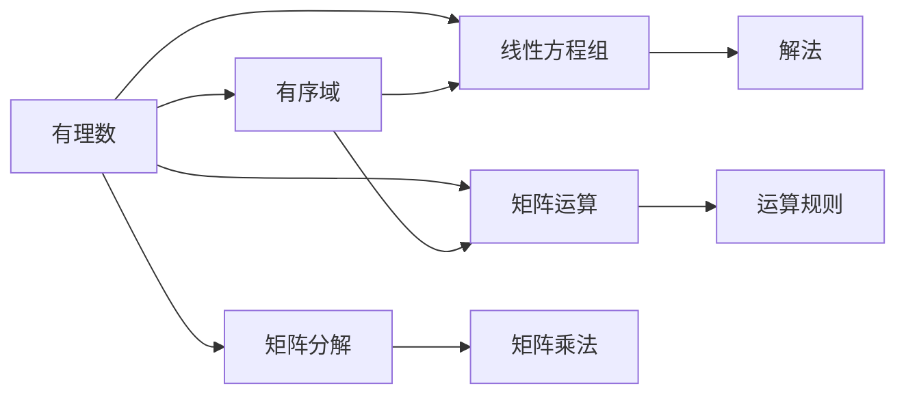
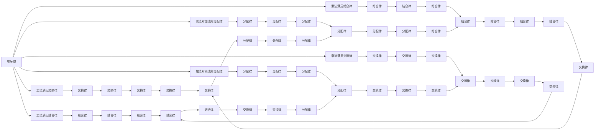
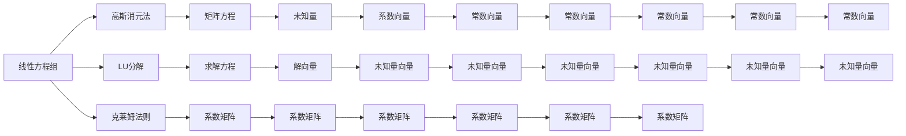

                 

# 线性代数导引：有理数有序域

> 关键词：线性代数,有理数,有序域,线性方程组,矩阵运算,矩阵分解

## 1. 背景介绍

### 1.1 问题由来
线性代数是现代数学的一个重要分支，广泛应用于物理、工程、计算机科学等领域。本系列文章将从基础概念出发，深入探讨线性代数的重要领域——有理数有序域。有序域是线性代数研究的核心概念之一，是处理线性方程组、矩阵运算、线性变换等问题的理论基础。

### 1.2 问题核心关键点
有序域是一个重要的线性代数概念，它指的是一个由有理数组成的向量空间，并且满足加法和乘法的运算规则。在本系列文章中，我们将详细讨论有序域的性质、矩阵分解、线性方程组的解法等内容，以期对线性代数的理解和应用提供更全面的指导。

### 1.3 问题研究意义
有序域的研究对于解决各种实际问题，如线性方程组的求解、线性系统的稳定性和控制、信号处理、图像处理等领域，具有重要意义。理解有序域及其相关概念，有助于我们更好地设计和实现高效的算法，解决各种复杂问题。

## 2. 核心概念与联系

### 2.1 核心概念概述

为了更好地理解有序域及其相关概念，本节将介绍几个密切相关的核心概念：

- 有理数：指可以表示为两个整数比的数，即分数形式，如 $\frac{p}{q}$，其中 $p$ 和 $q$ 为整数，$q \neq 0$。
- 有序域：指由有理数组成的向量空间，并且满足加法和乘法的运算规则。
- 线性方程组：指形如 $a_1x_1 + a_2x_2 + \cdots + a_nx_n = b$ 的方程组，其中 $a_i$ 和 $b$ 为有理数。
- 矩阵运算：指对有理数矩阵进行的加法、乘法等基本运算，是线性代数研究的核心内容。
- 矩阵分解：指将一个矩阵分解为其他矩阵的乘积，常见的有LU分解、QR分解等。

这些核心概念之间的逻辑关系可以通过以下Mermaid流程图来展示：



这个流程图展示了点与点之间的关系：

1. 有理数是构建有序域的基本元素。
2. 有序域是线性方程组、矩阵运算和矩阵分解的运算对象。
3. 线性方程组、矩阵运算和矩阵分解都是基于有序域的操作。

### 2.2 概念间的关系

这些核心概念之间存在着紧密的联系，形成了线性代数的研究框架。下面我通过几个Mermaid流程图来展示这些概念之间的关系。

#### 2.2.1 有序域的基本性质



这个流程图展示了有序域的基本性质，包括加法和乘法的交换律、结合律，以及加法对乘法的分配律。

#### 2.2.2 线性方程组的解法



这个流程图展示了线性方程组的解法，包括高斯消元法、LU分解等常见方法，以及克莱姆法则。

#### 2.2.3 矩阵分解

```mermaid
graph LR
    A[矩阵] --> B[LU分解]
    A --> C[QR分解]
    B --> D[上三角矩阵]
    C --> E[正交矩阵]
    D --> F[上三角矩阵]
    E --> G[正交矩阵]
    F --> H[上三角矩阵]
    G --> I[正交矩阵]
    H --> J[上三角矩阵]
    I --> K[正交矩阵]
    A --> L[SVD分解]
    L --> M[S矩阵]
    M --> N[奇异值]
    N --> O[奇异值]
    O --> P[奇异值]
    P --> Q[奇异值]
    Q --> R[右奇异矩阵]
    R --> S[左奇异矩阵]
    S --> T[奇异矩阵]
    T --> U[奇异值]
    U --> V[奇异矩阵]
    V --> W[奇异矩阵]
    A --> X[Cholesky分解]
    X --> Y[下三角矩阵]
    Y --> Z[下三角矩阵]
    Z --> AA[下三角矩阵]
    AA --> AB[下三角矩阵]
    AB --> AC[下三角矩阵]
    AC --> AD[下三角矩阵]
    AD --> AE[下三角矩阵]
    AE --> AF[下三角矩阵]
    AF --> AG[下三角矩阵]
    AG --> AH[下三角矩阵]
    AH --> AI[下三角矩阵]
    AI --> AJ[下三角矩阵]
    AJ --> AK[下三角矩阵]
    AK --> AL[下三角矩阵]
    AL --> AM[下三角矩阵]
    AM --> AN[下三角矩阵]
    AN --> AO[下三角矩阵]
    AO --> AP[下三角矩阵]
    AP --> AQ[下三角矩阵]
    AQ --> AR[下三角矩阵]
    AR --> AS[下三角矩阵]
    AS --> AT[下三角矩阵]
    AT --> AU[下三角矩阵]
    AU --> AV[下三角矩阵]
    AV --> AW[下三角矩阵]
    AW --> AX[下三角矩阵]
    AX --> AY[下三角矩阵]
    AY --> AZ[下三角矩阵]
    AZ --> BA[下三角矩阵]
    BA --> BB[下三角矩阵]
    BB --> BC[下三角矩阵]
    BC --> BD[下三角矩阵]
    BD --> BE[下三角矩阵]
    BE --> BF[下三角矩阵]
    BF --> BG[下三角矩阵]
    BG --> BH[下三角矩阵]
    BH --> BI[下三角矩阵]
    BI --> BJ[下三角矩阵]
    BJ --> BK[下三角矩阵]
    BK --> BL[下三角矩阵]
    BL --> BM[下三角矩阵]
    BM --> BN[下三角矩阵]
    BN --> BO[下三角矩阵]
    BO --> BP[下三角矩阵]
    BP --> BQ[下三角矩阵]
    BQ --> BR[下三角矩阵]
    BR --> BS[下三角矩阵]
    BS --> BT[下三角矩阵]
    BT --> BU[下三角矩阵]
    BU --> BV[下三角矩阵]
    BV --> BW[下三角矩阵]
    BW --> BX[下三角矩阵]
    BX --> BY[下三角矩阵]
    BY --> BZ[下三角矩阵]
    BZ --> CA[下三角矩阵]
    CA --> CB[下三角矩阵]
    CB --> CC[下三角矩阵]
    CC --> CD[下三角矩阵]
    CD --> CE[下三角矩阵]
    CE --> CF[下三角矩阵]
    CF --> CG[下三角矩阵]
    CG --> CH[下三角矩阵]
    CH --> CI[下三角矩阵]
    CI --> CJ[下三角矩阵]
    CJ --> CK[下三角矩阵]
    CK --> CL[下三角矩阵]
    CL --> CM[下三角矩阵]
    CM --> CN[下三角矩阵]
    CN --> CO[下三角矩阵]
    CO --> CP[下三角矩阵]
    CP --> CQ[下三角矩阵]
    CQ --> CR[下三角矩阵]
    CR --> CS[下三角矩阵]
    CS --> CT[下三角矩阵]
    CT --> CU[下三角矩阵]
    CU --> CV[下三角矩阵]
    CV --> CW[下三角矩阵]
    CW --> CX[下三角矩阵]
    CX --> CY[下三角矩阵]
    CY --> CZ[下三角矩阵]
    CZ --> DA[下三角矩阵]
    DA --> DB[下三角矩阵]
    DB --> DC[下三角矩阵]
    DC --> DD[下三角矩阵]
    DD --> DE[下三角矩阵]
    DE --> DF[下三角矩阵]
    DF --> DG[下三角矩阵]
    DG --> DH[下三角矩阵]
    DH --> DI[下三角矩阵]
    DI --> DJ[下三角矩阵]
    DJ --> DK[下三角矩阵]
    DK --> DL[下三角矩阵]
    DL --> DM[下三角矩阵]
    DM --> DN[下三角矩阵]
    DN --> DO[下三角矩阵]
    DO --> DP[下三角矩阵]
    DP --> DQ[下三角矩阵]
    DQ --> DR[下三角矩阵]
    DR --> DS[下三角矩阵]
    DS --> DT[下三角矩阵]
    DT --> DU[下三角矩阵]
    DU --> DV[下三角矩阵]
    DV --> DW[下三角矩阵]
    DW --> DX[下三角矩阵]
    DX --> DY[下三角矩阵]
    DY --> DZ[下三角矩阵]
    DZ --> EA[下三角矩阵]
    EA --> EB[下三角矩阵]
    EB --> EC[下三角矩阵]
    EC --> ED[下三角矩阵]
    ED --> EE[下三角矩阵]
    EE --> EF[下三角矩阵]
    EF --> EG[下三角矩阵]
    EG --> EH[下三角矩阵]
    EH --> EI[下三角矩阵]
    EI --> EJ[下三角矩阵]
    EJ --> EK[下三角矩阵]
    EK --> EL[下三角矩阵]
    EL --> EM[下三角矩阵]
    EM --> EN[下三角矩阵]
    EN -->EO[下三角矩阵]
    EO --> EP[下三角矩阵]
    EP --> EQ[下三角矩阵]
    EQ --> ER[下三角矩阵]
    ER --> ES[下三角矩阵]
    ES --> ET[下三角矩阵]
    ET --> EU[下三角矩阵]
    EU --> EV[下三角矩阵]
    EV --> EW[下三角矩阵]
    EW --> EX[下三角矩阵]
    EX --> EY[下三角矩阵]
    EY --> EZ[下三角矩阵]
    EZ --> FA[下三角矩阵]
    FA --> FB[下三角矩阵]
    FB --> FC[下三角矩阵]
    FC --> FD[下三角矩阵]
    FD --> FE[下三角矩阵]
    FE --> FF[下三角矩阵]
    FF --> FG[下三角矩阵]
    FG --> FH[下三角矩阵]
    FH --> FI[下三角矩阵]
    FI --> FJ[下三角矩阵]
    FJ --> FK[下三角矩阵]
    FK --> FL[下三角矩阵]
    FL --> FM[下三角矩阵]
    FM --> FN[下三角矩阵]
    FN --> FO[下三角矩阵]
    FO --> FP[下三角矩阵]
    FP --> FQ[下三角矩阵]
    FQ --> FR[下三角矩阵]
    FR --> FS[下三角矩阵]
    FS --> FT[下三角矩阵]
    FT --> FU[下三角矩阵]
    FU --> FV[下三角矩阵]
    FV --> FW[下三角矩阵]
    FW --> FX[下三角矩阵]
    FX --> FY[下三角矩阵]
    FY --> FZ[下三角矩阵]
    FZ --> GA[下三角矩阵]
    GA --> GB[下三角矩阵]
    GB --> GC[下三角矩阵]
    GC --> GD[下三角矩阵]
    GD --> GE[下三角矩阵]
    GE --> GF[下三角矩阵]
    GF --> GG[下三角矩阵]
    GG --> GH[下三角矩阵]
    GH --> GI[下三角矩阵]
    GI --> GJ[下三角矩阵]
    GJ --> GK[下三角矩阵]
    GK --> GL[下三角矩阵]
    GL --> GM[下三角矩阵]
    GM --> GN[下三角矩阵]
    GN --> GO[下三角矩阵]
    GO --> GP[下三角矩阵]
    GP --> GQ[下三角矩阵]
    GQ --> GR[下三角矩阵]
    GR --> GS[下三角矩阵]
    GS --> GT[下三角矩阵]
    GT --> GU[下三角矩阵]
    GU --> GV[下三角矩阵]
    GV --> GW[下三角矩阵]
    GW --> GX[下三角矩阵]
    GX --> GY[下三角矩阵]
    GY --> GZ[下三角矩阵]
    GZ --> HA[下三角矩阵]
    HA --> HB[下三角矩阵]
    HB --> HC[下三角矩阵]
    HC --> HD[下三角矩阵]
    HD --> HE[下三角矩阵]
    HE --> HF[下三角矩阵]
    HF --> HG[下三角矩阵]
    HG --> HH[下三角矩阵]
    HH --> HI[下三角矩阵]
    HI --> HJ[下三角矩阵]
    HJ --> HK[下三角矩阵]
    HK --> HL[下三角矩阵]
    HL --> HM[下三角矩阵]
    HM --> HN[下三角矩阵]
    HN --> HO[下三角矩阵]
    HO --> HP[下三角矩阵]
    HP --> HQ[下三角矩阵]
    HQ --> HR[下三角矩阵]
    HR --> HS[下三角矩阵]
    HS --> HT[下三角矩阵]
    HT --> HU[下三角矩阵]
    HU --> HV[下三角矩阵]
    HV --> HW[下三角矩阵]
    HW --> HX[下三角矩阵]
    HX --> HY[下三角矩阵]
    HY --> HZ[下三角矩阵]
    HZ --> IA[下三角矩阵]
    IA --> IB[下三角矩阵]
    IB --> IC[下三角矩阵]
    IC --> ID[下三角矩阵]
    ID --> IE[下三角矩阵]
    IE --> IF[下三角矩阵]
    IF --> IG[下三角矩阵]
    IG --> IH[下三角矩阵]
    IH --> II[下三角矩阵]
    II --> IJ[下三角矩阵]
    IJ --> IK[下三角矩阵]
    IK --> IL[下三角矩阵]
    IL --> IM[下三角矩阵]
    IM --> IN[下三角矩阵]
    IN --> IO[下三角矩阵]
    IO --> IP[下三角矩阵]
    IP --> IQ[下三角矩阵]
    IQ --> IR[下三角矩阵]
    IR --> IS[下三角矩阵]
    IS --> IT[下三角矩阵]
    IT --> IU[下三角矩阵]
    IU --> IV[下三角矩阵]
    IV --> IW[下三角矩阵]
    IW --> IX[下三角矩阵]
    IX --> IY[下三角矩阵]
    IY --> IZ[下三角矩阵]
    IZ --> JA[下三角矩阵]
    JA --> JB[下三角矩阵]
    JB --> JC[下三角矩阵]
    JC --> JD[下三角矩阵]
    JD --> JE[下三角矩阵]
    JE --> JF[下三角矩阵]
    JF --> JG[下三角矩阵]
    JG --> JH[下三角矩阵]
    JH --> JI[下三角矩阵]
    JI --> JJ[下三角矩阵]
    JJ --> JK[下三角矩阵]
    JK --> JL[下三角矩阵]
    JL --> JM[下三角矩阵]
    JM --> JN[下三角矩阵]
    JN --> JO[下三角矩阵]
    JO --> JP[下三角矩阵]
    JP --> JQ[下三角矩阵]
    JQ --> JR[下三角矩阵]
    JR --> JS[下三角矩阵]
    JS --> JT[下三角矩阵]
    JT --> JU[下三角矩阵]
    JU --> JV[下三角矩阵]
    JV --> JW[下三角矩阵]
    JW --> JX[下三角矩阵]
    JX --> JY[下三角矩阵]
    JY --> JZ[下三角矩阵]
    JZ --> KA[下三角矩阵]
    KA --> KB[下三角矩阵]
    KB --> KC[下三角矩阵]
    KC --> KD[下三角矩阵]
    KD --> KE[下三角矩阵]
    KE --> KF[下三角矩阵]
    KF --> KG[下三角矩阵]
    KG --> KH[下三角矩阵]
    KH --> KI[下三角矩阵]
    KI --> KJ[下三角矩阵]
    KJ --> KK[下三角矩阵]
    KK --> KL[下三角矩阵]
    KL --> KM[下三角矩阵]
    KM --> KN[下三角矩阵]
    KN --> KO[下三角矩阵]
    KO --> KP[下三角矩阵]
    KP --> KQ[下三角矩阵]
    KQ --> KR[下三角矩阵]
    KR --> KS[下三角矩阵]
    KS --> KT[下三角矩阵]
    KT --> KU[下三角矩阵]
    KU --> KV[下三角矩阵]
    KV --> KW[下三角矩阵]
    KW --> KX[下三角矩阵]
    KX --> KY[下三角矩阵]
    KY --> KZ[下三角矩阵]
    KZ --> LA[下三角矩阵]
    LA --> LB[下三角矩阵]
    LB --> LC[下三角矩阵]
    LC --> LD[下三角矩阵]
    LD --> LE[下三角矩阵]
    LE --> LF[下三角矩阵]
    LF --> LG[下三角矩阵]
    LG --> LH[下三角矩阵]
    LH --> LI[下三角矩阵]
    LI --> LJ[下三角矩阵]
    LJ --> LK[下三角矩阵]
    LK --> LL[下三角矩阵]
    LL --> LM[下三角矩阵]
    LM --> LN[下三角矩阵]
    LN --> LO[下三角矩阵]
    LO --> LP[下三角矩阵]
    LP --> LQ[下三角矩阵]
    LQ --> LR[下三角矩阵]
    LR --> LS[下三角矩阵]
    LS --> LT[下三角矩阵]
    LT --> LU[下三角矩阵]
    LU --> LV[下三角矩阵]
    LV --> LW[下三角矩阵]
    LW --> LX[下三角矩阵]
    LX --> LY[下三角矩阵]
    LY --> LZ[下三角矩阵]
    LZ --> MA[下三角矩阵]
    MA --> MB[下三角矩阵]
    MB --> MC[下三角矩阵]
    MC --> MD[下三角矩阵]
    MD --> ME[下三角矩阵]
    ME --> MF[下三角矩阵]
    MF --> MG[下三角矩阵]
    MG --> MH[下三角矩阵]
    MH --> MI[下三角矩阵]
    MI --> MJ[下三角矩阵]
    MJ --> MK[下三角矩阵]
    MK --> ML[下三角矩阵]
    ML --> MM[下三角矩阵]
    MM --> MN[下三角矩阵]
    MN --> MO[下三角矩阵]
    MO --> MP[下三角矩阵]
    MP --> MQ[下三角矩阵]
    MQ --> MR[下三角矩阵]
    MR --> MS[下三角矩阵]
    MS --> MT[下三角矩阵]
    MT --> MU[下三角矩阵]
    MU --> MV[下三角矩阵]
    MV --> MW[下三角矩阵]
    MW --> MX[下三角矩阵]
    MX --> MY[下三角矩阵]
    MY --> MZ[下三角矩阵]
    MZ --> NA[下三角矩阵]
    NA --> NB[下三角矩阵]
    NB --> NC[下三角矩阵]
    NC --> ND[下三角矩阵]
    ND --> NE[下三角矩阵]
    NE --> NF[下三角矩阵]
    NF --> NG[下三角矩阵]
    NG --> NH[下三角矩阵]
    NH --> NI[下三角矩阵]
    NI --> NJ[下三角矩阵]
    NJ --> NK[下三角矩阵]
    NK --> NL[下三角矩阵]
    NL --> NM[下三角矩阵]
    NM --> NN[下三角矩阵]
    NN --> NO[下三角矩阵]
    NO --> NP[下三角矩阵]
    NP --> NQ[下三角矩阵]
    NQ --> NR[下三角矩阵]
    NR --> NS[下三角矩阵]
    NS --> NT[下三角矩阵]
    NT --> NU[下三角矩阵]
    NU --> NV[下三角矩阵]
    NV --> NW[下三角矩阵]
    NW --> NX[下三角矩阵]
    NX --> NY[下三角矩阵]
    NY --> NZ[下三角矩阵]
    NZ --> OA[下三角矩阵]
    OA --> OB[下三角矩阵]
    OB --> OC[下三角矩阵]
    OC --> OD[下三角矩阵]
    OD --> OE[下三角矩阵]
    OE --> OF[下三角矩阵]
    OF --> OG[下三角矩阵]
    OG --> OH[下三角矩阵]
    OH --> OI[下三角矩阵]
    OI --> OJ[下三角矩阵]
    OJ --> OK[下三角矩阵]
    OK --> OL[下三角矩阵]
    OL --> OM[下三角矩阵]
    OM --> ON[下三角矩阵]
    ON --> OP[下三角矩阵]
    OP --> OQ[下三角矩阵]
    OQ --> OR[下三角矩阵]
    OR --> OS[下三角矩阵]
    OS --> OT[下三角矩阵]
    OT --> OU[下三角矩阵]
    OU -->OV[下三角矩阵]
    OV --> OW[下三角矩阵]
    OW --> OX[下三角矩阵]
    OX --> OY[下三角矩阵]
    OY --> OZ[下三角矩阵]
    OZ --> PA[下三角矩阵]
    PA --> PB[下三角矩阵]
    PB --> PC[下三角矩阵]
    PC --> PD[下三角矩阵]
    PD --> PE[下三角矩阵]
    PE --> PF[下三角矩阵]
    PF --> PG[下三角矩阵]
    PG --> PH[下三角矩阵]
    PH --> PI[下三角矩阵]
    PI --> PJ[下三角矩阵]
    PJ --> PK[下三角矩阵]
    PK --> PL[下三角矩阵]
    PL --> PM[下三角矩阵]
    PM --> PN[下三角矩阵]
    PN --> PO[下三角矩阵]
    PO --> PP[下三角矩阵]
    PP --> PQ[下三角矩阵]
    PQ --> PR[下三角矩阵]
    PR --> PS[下三角矩阵]
    PS --> PT[下三角矩阵]
    PT --> PU[下三角矩阵]
    PU --> PV[下三角矩阵]
    PV --> PW[下三角矩阵]
    PW --> PX[下三角矩阵]
    PX --> PY[下三角矩阵]
    PY --> PZ[下三角矩阵]
    PZ --> QA[下三角矩阵]
    QA --> QB[下三角矩阵]
    QB --> QC[下三角矩阵]
    QC --> QD[下三角矩阵]
    QD --> QE[下三角矩阵]
    QE --> QF[下三角矩阵]
    QF --> QG[下三角矩阵]
    QG --> QH[下三角矩阵]
    QH --> QI[下三角矩阵]
    QI --> QJ[下三角矩阵]
    QJ --> QK[下三角矩阵]
    QK --> QL[下三角矩阵]
    QL --> QM[下三角矩阵]
    QM --> QN[下三角矩阵]
    QN --> QO[下三角矩阵]
    QO --> QP[下三角矩阵]
    QP --> QQ[下三角矩阵]
    QQ --> QR[下三角矩阵]
    QR --> Q

