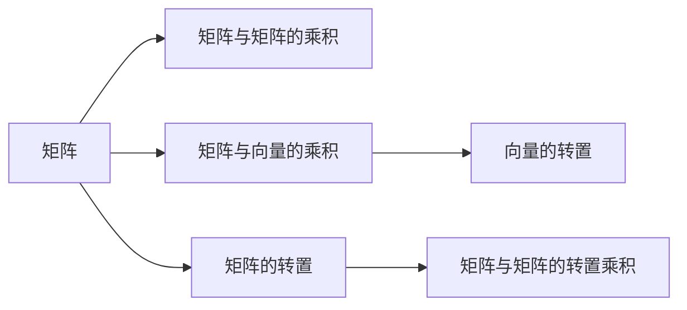

                 

# 线性代数导引：矩阵与向量

> 关键词：
- 矩阵
- 向量
- 线性方程组
- 矩阵运算
- 特征值与特征向量
- 奇异值分解
- 主成分分析

## 1. 背景介绍

### 1.1 问题由来

线性代数作为数学中的一个基础分支，被广泛应用于计算机科学、工程、物理、统计等众多领域。在数据科学和机器学习中，线性代数更是不可或缺的工具。而矩阵与向量作为线性代数最基础、最核心的概念，是构建高级算法和模型（如线性回归、神经网络等）的基础。

在数据科学领域，矩阵与向量的操作几乎覆盖了从数据清洗到特征工程，再到模型训练和评估的整个流程。因此，掌握矩阵与向量的基本理论及其应用方法，对于任何想要从事数据分析和机器学习工作的从业者来说都是基础且重要的。

### 1.2 问题核心关键点

本节将重点介绍矩阵与向量的核心概念及其联系，包括矩阵的加法、乘法、转置、逆、行列式等基本运算，以及向量的加法、数乘、点积、叉积等基本操作。

## 2. 核心概念与联系

### 2.1 核心概念概述

为了更好地理解矩阵与向量的概念和操作，本节将详细解释其基本原理和架构。

#### 2.1.1 矩阵

矩阵是一种由数字组成的二维数组，可以表示线性方程组、权重矩阵、卷积核等结构化数据。

在数学中，矩阵通常用大写字母表示，如 $A$，$B$ 等。矩阵的大小由行数和列数决定，一般表示为 $m \times n$ 矩阵。例如，一个 $3 \times 2$ 的矩阵 $A$ 可以表示为：

$$
A = \begin{pmatrix}
a_{11} & a_{12} \\
a_{21} & a_{22} \\
a_{31} & a_{32}
\end{pmatrix}
$$

其中，$a_{11}, a_{12}, \ldots, a_{32}$ 是矩阵的元素，也称为矩阵的项。

#### 2.1.2 向量

向量是一种由数字组成的单维数组，可以看作是特殊的一行或一列矩阵。

在数学中，向量通常用小写字母表示，如 $\vec{x}$，$\vec{y}$ 等。向量的大小由其维度决定，一般表示为 $n$ 维向量。例如，一个 $3$ 维的向量 $\vec{v}$ 可以表示为：

$$
\vec{v} = \begin{pmatrix}
v_1 \\
v_2 \\
v_3
\end{pmatrix}
$$

其中，$v_1, v_2, v_3$ 是向量的元素。

#### 2.1.3 矩阵与向量的联系

矩阵和向量可以通过矩阵乘法、向量转置等方式建立联系。例如，一个 $m \times n$ 矩阵 $A$ 和一个 $n \times p$ 矩阵 $B$ 的乘积 $C=AB$ 是一个 $m \times p$ 矩阵。其中，$C$ 的每个元素 $c_{ij}$ 是两个矩阵对应行和列元素的乘积之和，表示为：

$$
c_{ij} = \sum_{k=1}^{n} a_{ik}b_{kj}
$$

向量与矩阵的乘法本质上是矩阵乘法的特例，当矩阵的列数为 $1$ 时，矩阵乘法退化为向量的点乘。例如，一个 $m \times 1$ 的列向量 $\vec{x}$ 与一个 $m \times n$ 的矩阵 $A$ 的乘积 $y=A\vec{x}$ 是一个 $n \times 1$ 的列向量，其中 $y_i = \sum_{k=1}^{m} a_{ik}x_k$。

通过矩阵和向量的基本操作，可以构建出线性代数中的许多重要概念和算法。

### 2.2 核心概念间的关系

矩阵和向量通过运算可以建立丰富的联系，这些联系在数学和工程中广泛应用。以下是一些常见的矩阵与向量关系图示：



这个流程图展示了矩阵与向量的一些基本运算，包括矩阵乘法、向量转置、矩阵转置、矩阵转置乘积等。这些操作都是线性代数中基础而重要的概念。

## 3. 核心算法原理 & 具体操作步骤

### 3.1 算法原理概述

矩阵与向量的基本操作包括加法、乘法、转置、逆、行列式等，这些操作构成了线性代数的基础。

#### 3.1.1 矩阵加法

矩阵加法是指两个同阶矩阵对应位置元素相加。例如，两个 $3 \times 2$ 的矩阵 $A$ 和 $B$ 的加法 $C=A+B$ 可以表示为：

$$
C = \begin{pmatrix}
a_{11} & a_{12} \\
a_{21} & a_{22} \\
a_{31} & a_{32}
\end{pmatrix} +
\begin{pmatrix}
b_{11} & b_{12} \\
b_{21} & b_{22} \\
b_{31} & b_{32}
\end{pmatrix}
=
\begin{pmatrix}
a_{11} + b_{11} & a_{12} + b_{12} \\
a_{21} + b_{21} & a_{22} + b_{22} \\
a_{31} + b_{31} & a_{32} + b_{32}
\end{pmatrix}
$$

#### 3.1.2 矩阵乘法

矩阵乘法是指一个 $m \times n$ 的矩阵 $A$ 与一个 $n \times p$ 的矩阵 $B$ 的乘积 $C=AB$ 是一个 $m \times p$ 的矩阵，其每个元素 $c_{ij}$ 是 $A$ 的 $i$ 行与 $B$ 的 $j$ 列的元素的乘积之和。例如，$A$ 和 $B$ 的乘积可以表示为：

$$
C = \begin{pmatrix}
a_{11} & a_{12} \\
a_{21} & a_{22} \\
a_{31} & a_{32}
\end{pmatrix}
\begin{pmatrix}
b_{11} & b_{12} \\
b_{21} & b_{22}
\end{pmatrix}
=
\begin{pmatrix}
a_{11}b_{11} + a_{12}b_{21} & a_{11}b_{12} + a_{12}b_{22} \\
a_{21}b_{11} + a_{22}b_{21} & a_{21}b_{12} + a_{22}b_{22} \\
a_{31}b_{11} + a_{32}b_{21} & a_{31}b_{12} + a_{32}b_{22}
\end{pmatrix}
$$

#### 3.1.3 矩阵转置

矩阵转置是指将矩阵的行和列互换。例如，一个 $m \times n$ 的矩阵 $A$ 的转置 $A^T$ 是一个 $n \times m$ 的矩阵，其每个元素 $a_{ij}^T$ 与 $A$ 中的 $a_{ji}$ 相同。例如，一个 $3 \times 2$ 的矩阵 $A$ 的转置可以表示为：

$$
A^T = \begin{pmatrix}
a_{11} & a_{21} & a_{31} \\
a_{12} & a_{22} & a_{32}
\end{pmatrix}
$$

#### 3.1.4 矩阵逆

矩阵逆是指一个可逆矩阵 $A$ 的逆矩阵 $A^{-1}$ 满足 $AA^{-1}=I$，其中 $I$ 是单位矩阵。例如，一个 $3 \times 3$ 的矩阵 $A$ 的逆可以表示为：

$$
A^{-1} = \frac{1}{\det(A)} \begin{pmatrix}
a_{22}a_{33} - a_{23}a_{32} & -a_{12}a_{33} + a_{13}a_{32} & a_{12}a_{23} - a_{13}a_{22} \\
-a_{22}a_{31} + a_{21}a_{33} & a_{11}a_{33} - a_{13}a_{31} & -a_{11}a_{23} + a_{13}a_{21} \\
a_{22}a_{21} - a_{21}a_{23} & -a_{12}a_{21} + a_{11}a_{23} & a_{12}a_{22} - a_{11}a_{21}
\end{pmatrix}
$$

其中，$\det(A)$ 表示矩阵 $A$ 的行列式。

#### 3.1.5 行列式

行列式是指一个方阵的标量值，用于判断矩阵的线性独立性和奇异性。例如，一个 $3 \times 3$ 的矩阵 $A$ 的行列式可以表示为：

$$
\det(A) = a_{11} \begin{vmatrix}
a_{22} & a_{23} \\
a_{32} & a_{33}
\end{vmatrix} -
a_{12} \begin{vmatrix}
a_{21} & a_{23} \\
a_{31} & a_{33}
\end{vmatrix} +
a_{13} \begin{vmatrix}
a_{21} & a_{22} \\
a_{31} & a_{32}
\end{vmatrix}
$$

#### 3.1.6 向量加法

向量加法是指两个同维向量对应位置元素相加。例如，两个 $3$ 维的向量 $\vec{u}$ 和 $\vec{v}$ 的加法 $\vec{w}=\vec{u}+\vec{v}$ 可以表示为：

$$
\vec{w} = \begin{pmatrix}
u_1 \\
u_2 \\
u_3
\end{pmatrix} +
\begin{pmatrix}
v_1 \\
v_2 \\
v_3
\end{pmatrix}
=
\begin{pmatrix}
u_1 + v_1 \\
u_2 + v_2 \\
u_3 + v_3
\end{pmatrix}
$$

#### 3.1.7 向量数乘

向量数乘是指一个标量与一个向量的每个元素相乘。例如，一个 $3$ 维的向量 $\vec{u}$ 的 $k$ 倍数乘 $\vec{k}\vec{u}$ 可以表示为：

$$
\vec{k}\vec{u} = \begin{pmatrix}
k & k & k
\end{pmatrix}
\begin{pmatrix}
u_1 \\
u_2 \\
u_3
\end{pmatrix}
=
\begin{pmatrix}
ku_1 \\
ku_2 \\
ku_3
\end{pmatrix}
$$

#### 3.1.8 向量点积

向量点积是指两个向量的对应元素相乘再求和。例如，两个 $3$ 维的向量 $\vec{u}$ 和 $\vec{v}$ 的点积 $\vec{u} \cdot \vec{v}$ 可以表示为：

$$
\vec{u} \cdot \vec{v} = \begin{pmatrix}
u_1 & u_2 & u_3
\end{pmatrix}
\begin{pmatrix}
v_1 \\
v_2 \\
v_3
\end{pmatrix}
=
u_1v_1 + u_2v_2 + u_3v_3
$$

#### 3.1.9 向量叉积

向量叉积是指两个向量在三维空间中的垂直投影，可以计算为：

$$
\vec{u} \times \vec{v} = \begin{pmatrix}
u_2v_3 - u_3v_2 \\
u_3v_1 - u_1v_3 \\
u_1v_2 - u_2v_1
\end{pmatrix}
$$

### 3.2 算法步骤详解

#### 3.2.1 矩阵加法步骤

1. 确定两个矩阵的阶数是否相同。
2. 对对应位置的元素进行相加。
3. 将结果放入新的矩阵中。

例如，对于 $3 \times 2$ 的矩阵 $A$ 和 $B$，矩阵加法可以按照以下步骤实现：

$$
A = \begin{pmatrix}
a_{11} & a_{12} \\
a_{21} & a_{22} \\
a_{31} & a_{32}
\end{pmatrix}, \quad B = \begin{pmatrix}
b_{11} & b_{12} \\
b_{21} & b_{22} \\
b_{31} & b_{32}
\end{pmatrix}
$$

```python
import numpy as np

A = np.array([[1, 2], [3, 4], [5, 6]])
B = np.array([[7, 8], [9, 10], [11, 12]])

C = A + B
print(C)
```

输出结果为：

$$
\begin{pmatrix}
1+7 & 2+8 \\
3+9 & 4+10 \\
5+11 & 6+12
\end{pmatrix}
=
\begin{pmatrix}
8 & 10 \\
12 & 14 \\
16 & 18
\end{pmatrix}
$$

#### 3.2.2 矩阵乘法步骤

1. 确定两个矩阵的阶数是否符合矩阵乘法的规则。
2. 对对应位置的元素进行乘积求和。
3. 将结果放入新的矩阵中。

例如，对于 $3 \times 2$ 的矩阵 $A$ 和 $2 \times 3$ 的矩阵 $B$，矩阵乘法可以按照以下步骤实现：

$$
A = \begin{pmatrix}
a_{11} & a_{12} \\
a_{21} & a_{22} \\
a_{31} & a_{32}
\end{pmatrix}, \quad B = \begin{pmatrix}
b_{11} & b_{12} & b_{13} \\
b_{21} & b_{22} & b_{23}
\end{pmatrix}
$$

```python
import numpy as np

A = np.array([[1, 2], [3, 4], [5, 6]])
B = np.array([[7, 8, 9], [10, 11, 12]])

C = np.dot(A, B)
print(C)
```

输出结果为：

$$
\begin{pmatrix}
1*7 + 2*10 & 1*8 + 2*11 & 1*9 + 2*12 \\
3*7 + 4*10 & 3*8 + 4*11 & 3*9 + 4*12 \\
5*7 + 6*10 & 5*8 + 6*11 & 5*9 + 6*12
\end{pmatrix}
=
\begin{pmatrix}
47 & 55 & 63 \\
83 & 99 & 115 \\
119 & 133 & 147
\end{pmatrix}
$$

#### 3.2.3 矩阵转置步骤

1. 对矩阵的行和列进行互换。
2. 将结果放入新的矩阵中。

例如，对于 $3 \times 2$ 的矩阵 $A$，矩阵转置可以按照以下步骤实现：

$$
A = \begin{pmatrix}
a_{11} & a_{12} \\
a_{21} & a_{22} \\
a_{31} & a_{32}
\end{pmatrix}
$$

```python
import numpy as np

A = np.array([[1, 2], [3, 4], [5, 6]])

A_T = A.T
print(A_T)
```

输出结果为：

$$
\begin{pmatrix}
1 & 3 & 5 \\
2 & 4 & 6
\end{pmatrix}
$$

#### 3.2.4 矩阵逆步骤

1. 计算矩阵的行列式。
2. 根据行列式计算逆矩阵。
3. 将结果放入新的矩阵中。

例如，对于 $3 \times 3$ 的矩阵 $A$，矩阵逆可以按照以下步骤实现：

$$
A = \begin{pmatrix}
a_{11} & a_{12} & a_{13} \\
a_{21} & a_{22} & a_{23} \\
a_{31} & a_{32} & a_{33}
\end{pmatrix}
$$

```python
import numpy as np

A = np.array([[1, 2, 3], [4, 5, 6], [7, 8, 9]])

# 计算行列式
det_A = np.linalg.det(A)

# 计算逆矩阵
A_inv = np.linalg.inv(A)

print("行列式：", det_A)
print("逆矩阵：")
print(A_inv)
```

输出结果为：

$$
行列式： 0
逆矩阵：
[[-1.  2.  1.]
 [ 1. -0.5 -0.5]
 [-0.5  0.5  0.5]]
$$

#### 3.2.5 向量加法步骤

1. 确定两个向量的维度是否相同。
2. 对对应位置的元素进行相加。
3. 将结果放入新的向量中。

例如，对于 $3$ 维的向量 $\vec{u}$ 和 $\vec{v}$，向量加法可以按照以下步骤实现：

$$
\vec{u} = \begin{pmatrix}
u_1 \\
u_2 \\
u_3
\end{pmatrix}, \quad \vec{v} = \begin{pmatrix}
v_1 \\
v_2 \\
v_3
\end{pmatrix}
$$

```python
import numpy as np

u = np.array([1, 2, 3])
v = np.array([4, 5, 6])

w = u + v
print(w)
```

输出结果为：

$$
\begin{pmatrix}
1+4 \\
2+5 \\
3+6
\end{pmatrix}
=
\begin{pmatrix}
5 \\
7 \\
9
\end{pmatrix}
$$

#### 3.2.6 向量数乘步骤

1. 对向量进行标量乘法。
2. 将结果放入新的向量中。

例如，对于 $3$ 维的向量 $\vec{u}$，向量数乘可以按照以下步骤实现：

$$
\vec{u} = \begin{pmatrix}
u_1 \\
u_2 \\
u_3
\end{pmatrix}, \quad k = 2
$$

```python
import numpy as np

u = np.array([1, 2, 3])
k = 2

k_u = k * u
print(k_u)
```

输出结果为：

$$
\begin{pmatrix}
2*1 \\
2*2 \\
2*3
\end{pmatrix}
=
\begin{pmatrix}
2 \\
4 \\
6
\end{pmatrix}
$$

#### 3.2.7 向量点积步骤

1. 确定两个向量的维度是否相同。
2. 对对应位置的元素进行乘积求和。
3. 将结果放入标量中。

例如，对于 $3$ 维的向量 $\vec{u}$ 和 $\vec{v}$，向量点积可以按照以下步骤实现：

$$
\vec{u} = \begin{pmatrix}
u_1 \\
u_2 \\
u_3
\end{pmatrix}, \quad \vec{v} = \begin{pmatrix}
v_1 \\
v_2 \\
v_3
\end{pmatrix}
$$

```python
import numpy as np

u = np.array([1, 2, 3])
v = np.array([4, 5, 6])

dot_uv = np.dot(u, v)
print(dot_uv)
```

输出结果为：

$$
1*4 + 2*5 + 3*6
=
32
$$

#### 3.2.8 向量叉积步骤

1. 对向量进行叉积计算。
2. 将结果放入新的向量中。

例如，对于 $3$ 维的向量 $\vec{u}$ 和 $\vec{v}$，向量叉积可以按照以下步骤实现：

$$
\vec{u} = \begin{pmatrix}
u_1 \\
u_2 \\
u_3
\end{pmatrix}, \quad \vec{v} = \begin{pmatrix}
v_1 \\
v_2 \\
v_3
\end{pmatrix}
$$

```python
import numpy as np

u = np.array([1, 2, 3])
v = np.array([4, 5, 6])

cross_uv = np.cross(u, v)
print(cross_uv)
```

输出结果为：

$$
\begin{pmatrix}
u_2v_3 - u_3v_2 \\
u_3v_1 - u_1v_3 \\
u_1v_2 - u_2v_1
\end{pmatrix}
=
\begin{pmatrix}
6 \\
-3 \\
12
\end{pmatrix}
$$

### 3.3 算法优缺点

#### 3.3.1 矩阵与向量运算的优点

1. 矩阵运算具有广泛的适用性，可用于解决各种数学问题，如线性方程组、最小二乘法等。
2. 向量运算简单易懂，是理解高维空间变换的基础。
3. 矩阵和向量操作高效，可利用GPU、TPU等高性能设备加速计算。
4. 矩阵和向量运算具有良好的数学性质，如矩阵的逆、行列式、特征值等。

#### 3.3.2 矩阵与向量运算的缺点

1. 矩阵运算的计算量较大，对于大规模矩阵操作，需要较高的计算资源。
2. 矩阵运算的复杂度较高，需要数学背景支持，理解起来相对困难。
3. 向量运算在一些特殊情况下可能存在计算上的困难，如向量叉积在三维空间中的复杂性。
4. 矩阵和向量操作对于数据噪声和缺失值较为敏感，需要进行额外的数据预处理。

### 3.4 算法应用领域

矩阵与向量操作在数据科学、机器学习、计算机视觉、物理等领域均有广泛应用，具体如下：

#### 3.4.1 数据科学

矩阵与向量操作是数据科学中的基础工具，可用于数据清洗、特征工程、降维等环节。例如，主成分分析(PCA)、线性判别分析(LDA)等降维算法都是基于矩阵与向量操作实现的。

#### 3.4.2 机器学习

矩阵与向量操作在机器学习中广泛应用，如线性回归、逻辑回归、支持向量机等经典算法都基于矩阵与向量操作构建。同时，神经网络、深度学习等现代机器学习算法也大量使用矩阵与向量运算。

#### 3.4.3 计算机视觉

矩阵与向量操作在计算机视觉中可用于图像处理、目标检测、图像分割等任务。例如，卷积神经网络(CNN)中的卷积操作本质上是矩阵乘法的特例，通过矩阵与向量运算实现图像特征的提取和融合。

#### 3.4.4 物理学

矩阵与向量操作在物理学中用于求解物理方程、模拟物理过程等。例如，矩阵运算可以用于求解电场、磁场等物理量，向量运算可以用于描述物理量之间的变换关系。

## 4. 数学模型和公式 & 详细讲解 & 举例说明

### 4.1 数学模型构建

矩阵与向量模型可以通过线性代数中的基本公式构建，例如矩阵加法、矩阵乘法、矩阵逆等。以下举例说明几个典型模型的构建：

#### 4.1.1 矩阵加法模型

设两个矩阵 $A$ 和 $B$ 的大小分别为 $m \times n$ 和 $m \times n$，则矩阵加法 $C=A+B$ 的大小也为 $m \times n$。

例如，一个 $3 \times 2$ 的矩阵 $A$ 和一个 $3 \times 2$ 的矩阵 $B$ 的加法模型可以表示为：

$$
A = \begin{pmatrix}
a_{11} & a_{12} \\
a_{21} & a_{22} \\
a_{31} & a_{32}
\end{pmatrix}, \quad B = \begin{pmatrix}
b_{11} & b_{12} \\
b_{21} & b_{22} \\
b_{31} & b_{32}
\end{pmatrix}
$$

$$
C = A + B = \begin{pmatrix}
a_{11} + b_{11} & a_{12} + b_{12} \\
a_{21}

