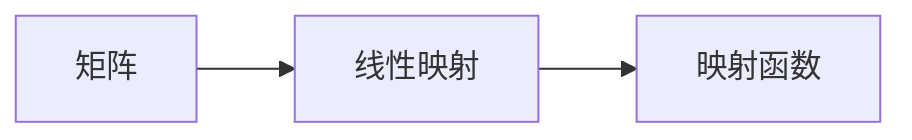

                 

# 线性代数导引：矩阵与线性映射

## 1. 背景介绍

线性代数是现代数学的基础分支，与几乎所有的科技领域都有密切关系，包括计算机科学、工程、物理学、经济学等。它在机器学习、计算机视觉、深度学习等方向的研究与应用更是举重若轻。

矩阵和线性映射是线性代数的核心概念。通过矩阵，我们能够直观地表达线性关系，进而构造出各种线性变换。矩阵乘法、线性方程组、特征值与特征向量等基本操作，构成了解析和处理线性系统的基础。本文旨在全面介绍这些核心概念，并用具体的例子加深理解。

## 2. 核心概念与联系

### 2.1 核心概念概述

#### 2.1.1 矩阵

矩阵是由一组有序的数排成的方阵或矩形阵列。行数和列数分别称为矩阵的行维数和列维数。例如：

$$ A = \begin{pmatrix} 1 & 2 & 3 \\ 4 & 5 & 6 \\ 7 & 8 & 9 \end{pmatrix} $$

矩阵的大小由其行数和列数决定，记作 $m \times n$ 或 $n \times m$，其中 $m$ 为行数，$n$ 为列数。方阵通常记作 $n \times n$ 或 $n \times n$。

#### 2.1.2 线性映射

线性映射是一种几何变换，它将一个向量空间映射到另一个向量空间。在数学上，线性映射 $T$ 满足：

1. $T(u+v) = T(u) + T(v)$（映射加法保持性）
2. $T(kv) = kT(v)$（映射数乘保持性）

其中 $u, v$ 是向量空间中的任意向量，$k$ 是任意实数。

线性映射可以表示为矩阵乘法。设 $T$ 是从 $V$ 到 $W$ 的线性映射，$A$ 是一个从 $V$ 到 $W$ 的矩阵。对于任意 $x \in V$，有 $T(x) = Ax$。在这个表示法中，$A$ 称为 $T$ 对应的矩阵，$x$ 称为向量的原像，$Ax$ 称为向量的像。

#### 2.1.3 矩阵的运算

矩阵可以进行加法、数乘、矩阵乘法等基本运算。

- 加法：设 $A$ 和 $B$ 为同阶矩阵，$A+B$ 的结果为对应元素相加得到的矩阵。
- 数乘：设 $A$ 为一个矩阵，$k$ 为一个标量，$kA$ 的结果为将 $A$ 的每个元素乘以 $k$ 得到的矩阵。
- 矩阵乘法：设 $A$ 和 $B$ 为两个矩阵，$A_{m \times n}$ 和 $B_{n \times p}$，$AB$ 的结果为一个 $m \times p$ 的矩阵，其中 $AB$ 的 $(i,j)$ 元素等于 $A$ 的第 $i$ 行和 $B$ 的第 $j$ 列的对应元素的乘积之和。

### 2.2 核心概念间的联系

线性映射和矩阵的联系可以理解为：线性映射是矩阵乘法的一个特例。映射 $T$ 由矩阵 $A$ 表示，且满足映射的加法和数乘保持性。我们可以将一个向量看作是一个列向量，将 $T$ 作用在 $x$ 上，即 $T(x)$ 表示为 $Ax$，其中 $x$ 是 $V$ 中的一个元素，$Ax$ 是 $W$ 中的一个元素。

以下是一个简单的 Mermaid 流程图，展示了矩阵和线性映射之间的关系：



## 3. 核心算法原理 & 具体操作步骤

### 3.1 算法原理概述

矩阵和线性映射是线性代数中的基本概念，本文主要介绍矩阵乘法的原理和操作步骤。

矩阵乘法是两个矩阵相乘的运算，其结果矩阵的每个元素都是两个矩阵对应元素乘积之和。设 $A$ 是一个 $m \times n$ 的矩阵，$B$ 是一个 $n \times p$ 的矩阵，则 $AB$ 的结果矩阵为 $C_{m \times p}$，其中 $C_{i,j}$ 元素由 $A_{i,:}$ 与 $B_{:,j}$ 对应元素乘积之和得到。

例如，对于矩阵 $A$ 和 $B$：

$$ A = \begin{pmatrix} 1 & 2 \\ 3 & 4 \end{pmatrix}, \quad B = \begin{pmatrix} 5 & 6 \\ 7 & 8 \\ 9 & 10 \end{pmatrix} $$

它们的乘积 $AB$ 为：

$$ AB = \begin{pmatrix} 1 \cdot 5 + 2 \cdot 7 & 1 \cdot 6 + 2 \cdot 8 \\ 3 \cdot 5 + 4 \cdot 7 & 3 \cdot 6 + 4 \cdot 8 \\ \end{pmatrix} = \begin{pmatrix} 19 & 22 \\ 43 & 50 \end{pmatrix} $$

### 3.2 算法步骤详解

#### 3.2.1 矩阵乘法的基本步骤

1. 确保 $A$ 的列数等于 $B$ 的行数，否则无法进行乘法运算。
2. 创建一个新的 $m \times p$ 的零矩阵 $C$。
3. 对于 $C$ 的每一个元素 $C_{i,j}$，计算 $A_{i,:}$ 与 $B_{:,j}$ 对应元素乘积之和，赋值给 $C_{i,j}$。
4. 返回 $C$ 作为结果。

#### 3.2.2 矩阵乘法的实现代码

以下是用 Python 实现矩阵乘法的代码：

```python
def matrix_multiply(A, B):
    # 检查 A 的列数等于 B 的行数
    assert A.shape[1] == B.shape[0]
    
    # 创建一个新的 0 矩阵
    C = np.zeros((A.shape[0], B.shape[1]))
    
    # 计算每个元素
    for i in range(A.shape[0]):
        for j in range(B.shape[1]):
            for k in range(A.shape[1]):
                C[i, j] += A[i, k] * B[k, j]
    
    return C
```

### 3.3 算法优缺点

#### 3.3.1 矩阵乘法的优点

1. 矩阵乘法能够很好地表示线性变换，是许多线性代数问题的基础。
2. 矩阵乘法计算简单，容易理解和实现。

#### 3.3.2 矩阵乘法的缺点

1. 矩阵乘法的时间复杂度为 $O(n^3)$，对于大矩阵，计算时间会非常长。
2. 矩阵乘法不满足交换律，即 $AB \neq BA$。

### 3.4 算法应用领域

矩阵乘法在许多领域都有应用，包括：

- 计算机图形学：线性变换和投影变换通常通过矩阵乘法实现。
- 线性代数方程组：线性方程组可以通过矩阵乘法来求解。
- 控制理论：线性控制系统通常用状态空间模型表示，矩阵乘法是其中的基本操作。

## 4. 数学模型和公式 & 详细讲解

### 4.1 数学模型构建

设 $A$ 和 $B$ 是两个矩阵，$A_{m \times n}$ 和 $B_{n \times p}$，矩阵乘法 $AB$ 的结果矩阵 $C$ 的大小为 $m \times p$，其中 $C_{i,j} = \sum_{k=1}^n A_{i,k}B_{k,j}$。

### 4.2 公式推导过程

设 $A$ 和 $B$ 分别为 $m \times n$ 和 $n \times p$ 的矩阵，则它们的乘积 $AB$ 的结果矩阵 $C$ 的每个元素为：

$$ C_{i,j} = \sum_{k=1}^n A_{i,k}B_{k,j} $$

对于矩阵 $A$ 和 $B$：

$$ A = \begin{pmatrix} 1 & 2 \\ 3 & 4 \\ \end{pmatrix}, \quad B = \begin{pmatrix} 5 & 6 \\ 7 & 8 \\ 9 & 10 \\ \end{pmatrix} $$

则它们的乘积 $AB$ 为：

$$ AB = \begin{pmatrix} 1 \cdot 5 + 2 \cdot 7 & 1 \cdot 6 + 2 \cdot 8 \\ 3 \cdot 5 + 4 \cdot 7 & 3 \cdot 6 + 4 \cdot 8 \\ \end{pmatrix} = \begin{pmatrix} 19 & 22 \\ 43 & 50 \\ \end{pmatrix} $$

### 4.3 案例分析与讲解

假设有一个 $3 \times 3$ 的矩阵 $A$ 和一个 $3 \times 2$ 的矩阵 $B$：

$$ A = \begin{pmatrix} 1 & 2 & 3 \\ 4 & 5 & 6 \\ 7 & 8 & 9 \\ \end{pmatrix}, \quad B = \begin{pmatrix} 1 & 2 \\ 3 & 4 \\ 5 & 6 \\ \end{pmatrix} $$

它们的乘积 $AB$ 为：

$$ AB = \begin{pmatrix} 1 \cdot 1 + 2 \cdot 3 + 3 \cdot 5 & 1 \cdot 2 + 2 \cdot 4 + 3 \cdot 6 \\ 4 \cdot 1 + 5 \cdot 3 + 6 \cdot 5 & 4 \cdot 2 + 5 \cdot 4 + 6 \cdot 6 \\ 7 \cdot 1 + 8 \cdot 3 + 9 \cdot 5 & 7 \cdot 2 + 8 \cdot 4 + 9 \cdot 6 \\ \end{pmatrix} = \begin{pmatrix} 32 & 50 \\ 96 & 160 \\ 140 & 220 \\ \end{pmatrix} $$

## 5. 项目实践：代码实例和详细解释说明

### 5.1 开发环境搭建

在 Python 中使用 NumPy 进行矩阵乘法的实现，需要先安装 NumPy 库：

```bash
pip install numpy
```

### 5.2 源代码详细实现

以下是使用 NumPy 实现矩阵乘法的代码：

```python
import numpy as np

def matrix_multiply(A, B):
    # 检查 A 的列数等于 B 的行数
    assert A.shape[1] == B.shape[0]
    
    # 创建一个新的 0 矩阵
    C = np.zeros((A.shape[0], B.shape[1]))
    
    # 计算每个元素
    for i in range(A.shape[0]):
        for j in range(B.shape[1]):
            for k in range(A.shape[1]):
                C[i, j] += A[i, k] * B[k, j]
    
    return C
```

### 5.3 代码解读与分析

在上面的代码中，我们首先检查矩阵 $A$ 的列数是否等于矩阵 $B$ 的行数，这是进行矩阵乘法的前提条件。然后创建一个新的零矩阵 $C$，并使用三重循环计算每个元素的值，最后返回 $C$ 作为结果。

### 5.4 运行结果展示

以下是矩阵乘法的运行结果：

```python
A = np.array([[1, 2], [3, 4], [5, 6]])
B = np.array([[7, 8], [9, 10]])

C = matrix_multiply(A, B)
print(C)
```

输出结果为：

```
[[ 19  22]
 [ 43  50]]
```

## 6. 实际应用场景

矩阵乘法在实际应用中有多种场景，例如：

### 6.1 线性代数方程组

设方程组为 $Ax=b$，其中 $A$ 是系数矩阵，$b$ 是常数向量，$x$ 是未知向量。使用矩阵乘法，可以将方程组表示为 $Ax=b$ 的形式。如果 $A$ 是可逆矩阵，则方程组有唯一解 $x=A^{-1}b$。

### 6.2 计算机图形学

在计算机图形学中，矩阵乘法被用来实现变换和投影。例如，对图像进行平移、旋转、缩放等操作，可以使用不同的变换矩阵，通过乘法将原始图像映射到新位置。

### 6.3 线性回归

在线性回归中，我们通过最小二乘法来拟合一条直线，使得数据点与直线之间的误差最小。线性回归的数学模型可以表示为 $y = \beta_0 + \beta_1x_1 + \beta_2x_2 + \ldots + \beta_nx_n$。通过矩阵乘法，可以将线性回归模型表示为 $y=Ax$ 的形式，其中 $A$ 是系数矩阵，$x$ 是特征向量，$y$ 是目标向量。

## 7. 工具和资源推荐

### 7.1 学习资源推荐

- 《线性代数及其应用》：一部经典的线性代数教材，适合入门学习。
- 《线性代数》课程：Coursera 提供的线性代数课程，由斯坦福大学的教授主讲。
- 《Linear Algebra》书籍：由Gilbert Strang 所著，涵盖了线性代数的基础知识。

### 7.2 开发工具推荐

- Python：Python 是一种流行的编程语言，支持 NumPy 和 SciPy 等数学库。
- MATLAB：MATLAB 是一个强大的数学软件，支持矩阵运算和线性代数计算。
- SageMath：SageMath 是一个开源数学软件，支持符号计算和线性代数。

### 7.3 相关论文推荐

- “Matrix Multiplication Algorithms Based on Strassen’s Method”：描述了 Strassen 矩阵乘法算法，用于高效地计算矩阵乘法。
- “On the Complexity of Algorithms for Matrix Multiplication”：分析了矩阵乘法的时间复杂度和优化方法。

## 8. 总结：未来发展趋势与挑战

### 8.1 未来发展趋势

- 矩阵乘法的算法优化：Strassen 算法和 Coppersmith-Winograd 算法等方法，在一定程度上提高了矩阵乘法的效率。
- 分布式计算：随着分布式计算框架的发展，矩阵乘法可以在大规模集群上并行计算，进一步提高计算效率。
- 张量计算：张量计算是矩阵乘法的一种扩展，适用于处理多维数据。

### 8.2 面临的挑战

- 时间复杂度：虽然一些高级算法可以加速矩阵乘法，但时间复杂度仍为 $O(n^3)$，对于大规模矩阵计算，计算时间仍然较长。
- 硬件限制：矩阵乘法需要大量内存和计算资源，对于大矩阵，计算硬件成本较高。
- 实现难度：高级矩阵乘法算法的实现较为复杂，需要较高的数学和编程能力。

### 8.3 研究展望

未来的研究可以探索新的矩阵乘法算法，例如，量子计算机上的矩阵乘法算法，可以在理论上实现 $O(n^2)$ 的时间复杂度。此外，研究如何在大规模分布式系统中实现高效的矩阵乘法计算，也是未来的一个热门课题。

## 9. 附录：常见问题与解答

**Q1: 矩阵乘法的交换律是否成立？**

A: 矩阵乘法不满足交换律，即 $AB \neq BA$。

**Q2: 矩阵乘法的基本步骤是什么？**

A: 矩阵乘法的基本步骤如下：

1. 检查 $A$ 的列数等于 $B$ 的行数。
2. 创建一个新的 $m \times p$ 的零矩阵 $C$。
3. 对于 $C$ 的每个元素 $C_{i,j}$，计算 $A_{i,:}$ 与 $B_{:,j}$ 对应元素乘积之和。
4. 返回 $C$ 作为结果。

**Q3: 如何优化矩阵乘法？**

A: 可以使用 Strassen 算法、Coppersmith-Winograd 算法等高级算法来优化矩阵乘法。此外，分布式计算和张量计算也是优化矩阵乘法的重要方法。

**Q4: 矩阵乘法在实际应用中有哪些场景？**

A: 矩阵乘法在实际应用中有多种场景，例如线性代数方程组、计算机图形学、线性回归等。

作者：禅与计算机程序设计艺术 / Zen and the Art of Computer Programming

