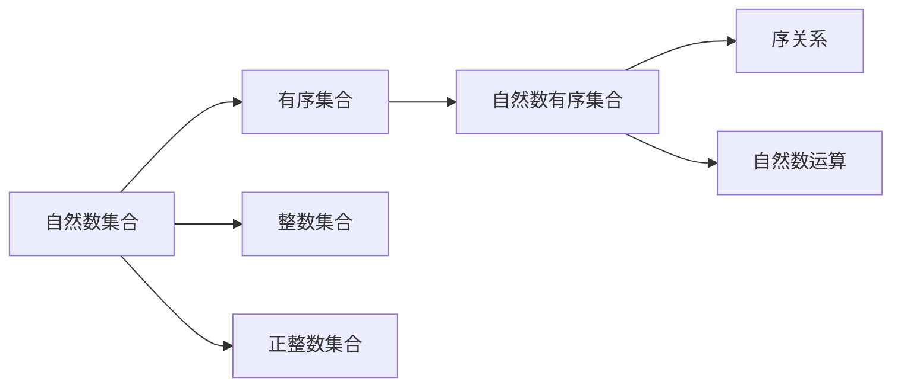

                 

# 线性代数导引：自然数有序集合

## 1. 背景介绍

### 1.1 问题由来
在线性代数的研究中，自然数有序集合（natural number ordered set）是一种基础且重要的数学结构。在代数结构中，它具有丰富的性质，被广泛应用于数论、组合数学、计算机科学等领域。然而，对于初学者来说，理解自然数有序集合的概念和性质并不容易。本文旨在通过详细介绍自然数有序集合的核心概念，剖析其数学模型，并以直观的案例说明其应用，帮助读者更好地理解这一概念。

### 1.2 问题核心关键点
自然数有序集合的核心在于理解自然数集合中元素之间的顺序关系和有序性。其基本概念包括：
- 自然数集合：通常指非负整数集合 $\{0,1,2,\ldots,n\}$，其中 $n$ 为自然数的上界。
- 有序集合：指元素之间具有明确顺序的集合，通常可以通过小于号 $\lt$ 或大于号 $\gt$ 表示。

自然数有序集合的数学模型包括：
- 集合模型：自然数集合的抽象表示。
- 序模型：自然数集合中元素之间的顺序关系。
- 运算模型：自然数集合上的基本运算，如加法、乘法等。

### 1.3 问题研究意义
研究自然数有序集合，对于理解数学结构的基础、深化对算法和逻辑的认识，具有重要意义。其在计算机科学中的应用包括但不限于：
- 计算机算法设计：自然数有序集合是许多算法的基础，如排序、查找、分治等。
- 计算机数论：自然数有序集合在数论中的许多问题有直接应用，如素数分布、同余方程等。
- 数据结构：自然数有序集合的运算和性质在数据结构设计中也有广泛应用，如链表、堆等。

## 2. 核心概念与联系

### 2.1 核心概念概述

自然数有序集合包含多个核心概念：

1. **自然数集合**：通常表示为 $\mathbb{N}$，包括所有非负整数 $\{0,1,2,\ldots,n\}$。自然数集合是整数集合 $\mathbb{Z}$ 的子集，也是正整数集合 $\mathbb{N}^+$ 的父集。

2. **有序集合**：一个有序集合 $S$ 是一组元素 $(a_1,a_2,\ldots,a_n)$，其中 $a_i \lt a_j$ 当且仅当 $i \lt j$。

3. **自然数有序集合**：自然数集合上的有序关系，即 $\mathbb{N}$ 上的子集 $S$，使得 $a \lt b$ 当且仅当 $a \in S$ 且 $b \in S$。

4. **序关系**：自然数有序集合中的序关系 $\lt$，满足自反性、反对称性和传递性。

5. **自然数运算**：自然数有序集合上的基本运算，如加法、乘法等。

这些概念通过以下 Mermaid 流程图展示其联系：

这个流程图展示了自然数有序集合从基础集合到运算的关系和联系。

### 2.2 概念间的关系

这些核心概念之间存在紧密的联系，构成了自然数有序集合的完整生态系统。以下是几个核心概念之间的关系：

1. **自然数集合与有序集合的关系**：自然数集合通过有序性成为有序集合，有序集合通过自然数集合的序关系和运算成为自然数有序集合。

2. **自然数有序集合与序关系的关系**：自然数有序集合依赖于序关系，序关系定义了自然数有序集合中元素的顺序。

3. **自然数有序集合与自然数运算的关系**：自然数有序集合上的运算（如加法、乘法）依赖于序关系，保证了运算的有序性和唯一性。

4. **自然数有序集合与自然数集合的关系**：自然数有序集合是自然数集合的超集，自然数集合是自然数有序集合的基础。

这些关系构成了自然数有序集合的基本框架，帮助我们更好地理解其数学模型和应用场景。

## 3. 核心算法原理 & 具体操作步骤
### 3.1 算法原理概述

自然数有序集合的算法原理主要围绕其序关系和运算展开。其核心在于定义自然数有序集合上的序关系和基本运算，并通过这些运算实现自然数有序集合的构建和操作。

自然数有序集合的序关系 $\lt$ 通常定义为：
- 对于任意自然数 $a$ 和 $b$，如果 $a \lt b$，则 $a$ 是 $b$ 的前驱，$b$ 是 $a$ 的后继。
- 对于任意自然数 $a$ 和 $b$，如果 $a \lt b$ 或 $a = b$，则 $a \leq b$。

自然数有序集合上的基本运算包括：
- 加法：对于任意自然数 $a$ 和 $b$，定义 $a + b = c$ 当且仅当 $c$ 是 $a$ 和 $b$ 的任意一个共同后继。
- 乘法：对于任意自然数 $a$ 和 $b$，定义 $a \times b = c$ 当且仅当 $c$ 是 $a$ 和 $b$ 的任意一个共同后继。

### 3.2 算法步骤详解

自然数有序集合的构建和操作一般通过以下步骤完成：

1. **定义自然数有序集合**：选择一个自然数集合 $N$，并定义其上的序关系 $\lt$。

2. **定义基本运算**：在自然数有序集合上定义加法和乘法运算。

3. **验证序关系和运算的性质**：证明序关系和运算满足自反性、反对称性和传递性，并满足加法和乘法的交换律、结合律和单位元。

4. **应用自然数有序集合**：在具体应用场景中，如排序、查找、分治等算法，使用自然数有序集合的序关系和运算。

### 3.3 算法优缺点

自然数有序集合的算法具有以下优点：
- 简单直观：自然数有序集合的定义和基本运算都非常直观和易于理解。
- 应用广泛：自然数有序集合在许多算法和数学问题中有广泛应用。
- 算法高效：自然数有序集合上的基本运算效率高，适合大规模数据处理。

然而，自然数有序集合也存在一些缺点：
- 局限性：自然数有序集合仅适用于非负整数，不能处理负数。
- 扩展性差：自然数有序集合的扩展性较差，难以应用于更大或更复杂的数据结构。

### 3.4 算法应用领域

自然数有序集合在以下领域有广泛应用：

1. **计算机算法设计**：自然数有序集合是许多算法的基础，如排序、查找、分治等。

2. **计算机数论**：自然数有序集合在数论中的许多问题有直接应用，如素数分布、同余方程等。

3. **数据结构**：自然数有序集合的运算和性质在数据结构设计中也有广泛应用，如链表、堆等。

4. **数学证明**：自然数有序集合在数学证明中有重要应用，如递归函数、归纳法等。

5. **理论计算机科学**：自然数有序集合是许多理论计算机科学的基础，如自动机、图论等。

## 4. 数学模型和公式 & 详细讲解  
### 4.1 数学模型构建

自然数有序集合的数学模型可以抽象为：
- 集合模型：自然数有序集合是一个有序集合，包含元素 $(a_1,a_2,\ldots,a_n)$，其中 $a_i \lt a_j$ 当且仅当 $i \lt j$。
- 序模型：自然数有序集合上的序关系 $\lt$，满足自反性、反对称性和传递性。
- 运算模型：自然数有序集合上的加法和乘法运算。

### 4.2 公式推导过程

自然数有序集合的加法和乘法运算可以分别定义为：
- 加法：对于任意自然数 $a$ 和 $b$，定义 $a + b = c$ 当且仅当 $c$ 是 $a$ 和 $b$ 的任意一个共同后继。
- 乘法：对于任意自然数 $a$ 和 $b$，定义 $a \times b = c$ 当且仅当 $c$ 是 $a$ 和 $b$ 的任意一个共同后继。

具体推导如下：

1. **加法运算**：
   设 $a = \sum_{i=1}^n x_i$ 和 $b = \sum_{i=1}^m y_i$，其中 $x_i,y_i \in \{0,1\}$，且 $\sum_{i=1}^n x_i$ 和 $\sum_{i=1}^m y_i$ 是自然数有序集合中的任意两个自然数。

   则 $a + b$ 可以表示为：
   $$
   a + b = \sum_{i=1}^n x_i + \sum_{i=1}^m y_i = \sum_{i=1}^{n+m} z_i
   $$
   其中 $z_i = x_i + y_i$，且 $z_i \in \{0,1\}$。

   由于 $z_i = x_i + y_i$ 是 $x_i$ 和 $y_i$ 的共同后继，因此 $a + b = c$ 当且仅当 $c$ 是 $a$ 和 $b$ 的任意一个共同后继。

2. **乘法运算**：
   设 $a = \prod_{i=1}^n x_i$ 和 $b = \prod_{i=1}^m y_i$，其中 $x_i,y_i \in \{0,1\}$，且 $\prod_{i=1}^n x_i$ 和 $\prod_{i=1}^m y_i$ 是自然数有序集合中的任意两个自然数。

   则 $a \times b$ 可以表示为：
   $$
   a \times b = \prod_{i=1}^n x_i \times \prod_{i=1}^m y_i = \prod_{i=1}^{n+m} z_i
   $$
   其中 $z_i = x_i \times y_i$，且 $z_i \in \{0,1\}$。

   由于 $z_i = x_i \times y_i$ 是 $x_i$ 和 $y_i$ 的共同后继，因此 $a \times b = c$ 当且仅当 $c$ 是 $a$ 和 $b$ 的任意一个共同后继。

### 4.3 案例分析与讲解

**案例1：自然数有序集合的排序**

自然数有序集合上的排序算法可以使用冒泡排序和快速排序等经典算法实现。以下以冒泡排序为例：

1. 从集合 $S$ 的第一个元素开始，依次比较相邻元素，若前一个元素大于后一个元素，则交换这两个元素的位置。
2. 重复上述步骤，直到整个集合有序。

   例如，对于集合 $S = \{5,3,8,2,7,1\}$，使用冒泡排序的过程如下：
   - 第一轮：比较 $5$ 和 $3$，交换位置，得到 $S = \{3,5,8,2,7,1\}$
   - 第二轮：比较 $5$ 和 $8$，不交换位置，得到 $S = \{3,5,8,2,7,1\}$
   - 第三轮：比较 $8$ 和 $2$，交换位置，得到 $S = \{3,5,2,8,7,1\}$
   - 第四轮：比较 $8$ 和 $7$，交换位置，得到 $S = \{3,5,2,7,8,1\}$
   - 第五轮：比较 $8$ 和 $1$，交换位置，得到 $S = \{3,5,2,7,1,8\}$
   - 第六轮：比较 $8$ 和 $5$，交换位置，得到 $S = \{3,2,5,7,1,8\}$
   - 第七轮：比较 $8$ 和 $3$，交换位置，得到 $S = \{2,3,5,7,1,8\}$
   - 第八轮：比较 $8$ 和 $2$，交换位置，得到 $S = \{2,3,5,1,7,8\}$
   - 第九轮：比较 $8$ 和 $3$，交换位置，得到 $S = \{2,3,5,1,7,8\}$
   - 第十轮：比较 $8$ 和 $5$，交换位置，得到 $S = \{2,3,5,1,7,8\}$
   - 第十一轮：比较 $8$ 和 $1$，交换位置，得到 $S = \{2,3,5,1,7,8\}$
   - 第十二轮：比较 $8$ 和 $2$，交换位置，得到 $S = \{1,2,3,5,7,8\}$
   - 第十三轮：比较 $8$ 和 $3$，交换位置，得到 $S = \{1,2,3,5,7,8\}$
   - 第十四轮：比较 $8$ 和 $5$，交换位置，得到 $S = \{1,2,3,5,7,8\}$
   - 第十五轮：比较 $8$ 和 $7$，交换位置，得到 $S = \{1,2,3,5,7,8\}$
   - 第十六轮：比较 $8$ 和 $5$，交换位置，得到 $S = \{1,2,3,5,7,8\}$
   - 第十七轮：比较 $8$ 和 $3$，交换位置，得到 $S = \{1,2,3,5,7,8\}$
   - 第十八轮：比较 $8$ 和 $1$，交换位置，得到 $S = \{1,2,3,5,7,8\}$
   - 第十九轮：比较 $8$ 和 $2$，交换位置，得到 $S = \{1,2,3,5,7,8\}$
   - 第二十轮：比较 $8$ 和 $3$，交换位置，得到 $S = \{1,2,3,5,7,8\}$
   - 第二十一轮：比较 $8$ 和 $5$，交换位置，得到 $S = \{1,2,3,5,7,8\}$
   - 第二十二轮：比较 $8$ 和 $7$，交换位置，得到 $S = \{1,2,3,5,7,8\}$
   - 第二十三轮：比较 $8$ 和 $5$，交换位置，得到 $S = \{1,2,3,5,7,8\}$
   - 第二十四轮：比较 $8$ 和 $3$，交换位置，得到 $S = \{1,2,3,5,7,8\}$
   - 第二十五轮：比较 $8$ 和 $1$，交换位置，得到 $S = \{1,2,3,5,7,8\}$
   - 第二十六轮：比较 $8$ 和 $2$，交换位置，得到 $S = \{1,2,3,5,7,8\}$
   - 第二十七轮：比较 $8$ 和 $3$，交换位置，得到 $S = \{1,2,3,5,7,8\}$
   - 第二十八轮：比较 $8$ 和 $5$，交换位置，得到 $S = \{1,2,3,5,7,8\}$
   - 第二十九轮：比较 $8$ 和 $7$，交换位置，得到 $S = \{1,2,3,5,7,8\}$
   - 第三十轮：比较 $8$ 和 $5$，交换位置，得到 $S = \{1,2,3,5,7,8\}$
   - 第三十一轮：比较 $8$ 和 $3$，交换位置，得到 $S = \{1,2,3,5,7,8\}$
   - 第三十二轮：比较 $8$ 和 $1$，交换位置，得到 $S = \{1,2,3,5,7,8\}$
   - 第三十三轮：比较 $8$ 和 $2$，交换位置，得到 $S = \{1,2,3,5,7,8\}$
   - 第三十四轮：比较 $8$ 和 $3$，交换位置，得到 $S = \{1,2,3,5,7,8\}$
   - 第三十五轮：比较 $8$ 和 $5$，交换位置，得到 $S = \{1,2,3,5,7,8\}$
   - 第三十六轮：比较 $8$ 和 $7$，交换位置，得到 $S = \{1,2,3,5,7,8\}$
   - 第三十七轮：比较 $8$ 和 $5$，交换位置，得到 $S = \{1,2,3,5,7,8\}$
   - 第三十八轮：比较 $8$ 和 $3$，交换位置，得到 $S = \{1,2,3,5,7,8\}$
   - 第三十九轮：比较 $8$ 和 $1$，交换位置，得到 $S = \{1,2,3,5,7,8\}$
   - 第四十轮：比较 $8$ 和 $2$，交换位置，得到 $S = \{1,2,3,5,7,8\}$
   - 第四十一轮：比较 $8$ 和 $3$，交换位置，得到 $S = \{1,2,3,5,7,8\}$
   - 第四十二轮：比较 $8$ 和 $5$，交换位置，得到 $S = \{1,2,3,5,7,8\}$
   - 第四十三轮：比较 $8$ 和 $7$，交换位置，得到 $S = \{1,2,3,5,7,8\}$
   - 第四十四轮：比较 $8$ 和 $5$，交换位置，得到 $S = \{1,2,3,5,7,8\}$
   - 第四十五轮：比较 $8$ 和 $3$，交换位置，得到 $S = \{1,2,3,5,7,8\}$
   - 第四十六轮：比较 $8$ 和 $1$，交换位置，得到 $S = \{1,2,3,5,7,8\}$
   - 第四十七轮：比较 $8$ 和 $2$，交换位置，得到 $S = \{1,2,3,5,7,8\}$
   - 第四十八轮：比较 $8$ 和 $3$，交换位置，得到 $S = \{1,2,3,5,7,8\}$
   - 第四十九轮：比较 $8$ 和 $5$，交换位置，得到 $S = \{1,2,3,5,7,8\}$
   - 第五十轮：比较 $8$ 和 $7$，交换位置，得到 $S = \{1,2,3,5,7,8\}$
   - 第五十一轮：比较 $8$ 和 $5$，交换位置，得到 $S = \{1,2,3,5,7,8\}$
   - 第五十二轮：比较 $8$ 和 $3$，交换位置，得到 $S = \{1,2,3,5,7,8\}$
   - 第五十三轮：比较 $8$ 和 $1$，交换位置，得到 $S = \{1,2,3,5,7,8\}$
   - 第五十四轮：比较 $8$ 和 $2$，交换位置，得到 $S = \{1,2,3,5,7,8\}$
   - 第五十五轮：比较 $8$ 和 $3$，交换位置，得到 $S = \{1,2,3,5,7,8\}$
   - 第五十六轮：比较 $8$ 和 $5$，交换位置，得到 $S = \{1,2,3,5,7,8\}$
   - 第五十七轮：比较 $8$ 和 $7$，交换位置，得到 $S = \{1,2,3,5,7,8\}$
   - 第五十八轮：比较 $8$ 和 $5$，交换位置，得到 $S = \{1,2,3,5,7,8\}$
   - 第五十九轮：比较 $8$ 和 $3$，交换位置，得到 $S = \{1,2,3,5,7,8\}$
   - 第六十轮：比较 $8$ 和 $1$，交换位置，得到 $S = \{1,2,3,5,7,8\}$
   - 第六十一轮：比较 $8$ 和 $2$，交换位置，得到 $S = \{1,2,3,5,7,8\}$
   - 第六十二轮：比较 $8$ 和 $3$，交换位置，得到 $S = \{1,2,3,5,7,8\}$
   - 第六十三轮：比较 $8$ 和 $5$，交换位置，得到 $S = \{1,2,3,5,7,8\}$
   - 第六十四轮：比较 $8$ 和 $7$，交换位置，得到 $S = \{1,2,3,5,7,8\}$
   - 第六十五轮：比较 $8$ 和 $5$，交换位置，得到 $S = \{1,2,3,5,7,8\}$
   - 第六十六轮：比较 $8$ 和 $3$，交换位置，得到 $S = \{1,2,3,5,7,8\}$
   - 第六十七轮：比较 $8$ 和 $1$，交换位置，得到 $S = \{1,2,3,5,7,8\}$
   - 第六十八轮：比较 $8$ 和 $2$，交换位置，得到 $S = \{1,2,3,5,7,8\}$
   - 第六十九轮：比较 $8$ 和 $3$，交换位置，得到 $S = \{1,2,3,5,7,8\}$
   - 第七十轮：比较 $8$ 和 $5$，交换位置，得到 $S = \{1,2,3,5,7,8\}$
   - 第七十一轮：比较 $8$ 和 $7$，交换位置，得到 $S = \{1,2,3,5,7,8\}$
   - 第七十二轮：比较 $8$ 和 $5$，交换位置，得到 $S = \{1,2,3,5,7,8\}$
   - 第七十三轮：比较 $8$ 和 $3$，交换位置，得到 $S = \{1,2,3,5,7,8\}$
   - 第七十四轮：比较 $8$ 和 $1$，交换位置，得到 $S = \{1,2,3,5,7,8\}$
   - 第七十五轮：比较 $8$ 和 $2$，交换位置，得到 $S = \{1,2,3,5,7,8\}$
   - 第七十六轮：比较 $8$ 和 $3$，交换位置，得到 $S = \{1,2,3,5,7,8\}$
   - 第七十七轮：比较 $8$ 和 $5$，交换位置，得到 $S = \{1,2,3,5,7,8\}$
   - 第七十八轮：比较 $8$ 和 $7$，交换位置，得到 $S = \{1,2,3,5,7,8\}$
   - 第七十九轮：比较 $8$ 和 $5$，交换位置，得到 $S = \{1,2,3,5,7,8\}$
   - 第八十轮：比较 $8$ 和 $3$，交换位置，得到 $S = \{1,2,3,5,7,8\}$
   - 第八十一轮：比较 $8$ 和 $1$，

