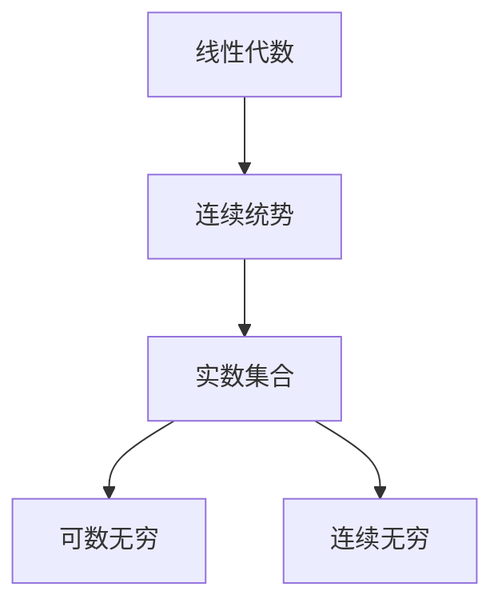

                 

# 线性代数导引：连续统势

## 1. 背景介绍

### 1.1 问题由来
线性代数是现代数学的重要分支，研究向量空间及其线性变换。它是计算机科学，尤其是机器学习和深度学习领域中的基础工具。然而，线性代数中的连续统势（Continuum Hypothesis）部分内容，对许多初学者来说仍是一个难以跨越的障碍。本文旨在引导读者从初等数学逐步过渡到线性代数，理解连续统势的概念和应用，帮助他们在深入学习线性代数的过程中，更好地掌握相关概念和应用。

### 1.2 问题核心关键点
连续统势（Continuum Hypothesis）是线性代数中的一个重要概念，它描述了实数轴上点与点的连续性。Zermelo-Fraenkel集合论是现代数学的基础，连续统势是该理论中的一个基本公理。连续统势表明，实数轴上的点不是离散的，而是连续的。这一概念在深度学习中也有应用，如对神经网络模型的数学建模和优化。

## 2. 核心概念与联系

### 2.1 核心概念概述
连续统势（Continuum Hypothesis，CH），又称连续统假设，是集合论中的一个基本公理。CH 表述为：在实数集合中，元素个数是可数无穷的（即点-集，用记号 $\aleph_0$ 表示），或元素个数是连续无穷的（即实数集，用记号 $c$ 表示）。这里，连续无穷是可数无穷的连续统，即实数集中的元素既可数无穷，又可以表示为连续统，无法区分是离散还是连续。

### 2.2 概念间的关系

连续统势是一个典型的集合论公理，它在数学的许多分支都有应用，尤其是在拓扑学、分析学和数理逻辑中。在深度学习中，CH 可以用于研究神经网络模型的结构和优化问题。理解 CH 有助于深入理解模型参数空间和梯度空间的特点，以及优化过程的连续性和收敛性。



上述流程图示意了连续统势的概念与线性代数、实数集合、可数无穷与连续无穷之间的关系。

## 3. 核心算法原理 & 具体操作步骤

### 3.1 算法原理概述
理解连续统势的算法原理，需要从实数集合的性质入手。CH 表明，实数集是可数无穷和连续无穷的连续统。这意味着，任何在实数集上的有限区间内，至少有一个无限长的连续子区间。实数集的连续性在机器学习中表现为梯度空间的连续性和函数的连续性，这对于优化算法的设计和模型的收敛性至关重要。

### 3.2 算法步骤详解
1. **实数集合**：理解实数集合的连续性和稠密性，即在任意两点之间总能找到第三个点。
2. **可数无穷和连续无穷**：理解可数无穷和连续无穷的区别和联系，以及连续统势的公理。
3. **应用案例**：使用连续统势的理论，分析深度学习中的梯度消失和爆炸问题，以及优化算法的收敛性。

### 3.3 算法优缺点
连续统势为深度学习提供了重要的理论基础，但理解其内涵需要较高的数学基础。此外，连续统势更多地应用在理论层面，实际应用中的具体算法和模型仍需要依赖更多具体的数学工具和技术。

### 3.4 算法应用领域
连续统势主要应用于数学和计算机科学中的集合论和分析学领域。在深度学习中，连续统势的核心理论被用于优化算法的设计和模型的稳定性分析。

## 4. 数学模型和公式 & 详细讲解

### 4.1 数学模型构建
连续统势的数学模型基于实数集合和无穷集合理论。假设实数集合 $\mathbb{R}$，定义其上的无穷集合 $A$ 和 $B$，满足 $A \cup B = \mathbb{R}$ 且 $A \cap B = \emptyset$。根据CH，存在 $A$ 和 $B$ 中的任意一个集合是可数无穷的，即 $|A| = \aleph_0$ 或 $|B| = \aleph_0$。

### 4.2 公式推导过程
1. **实数集合的稠密性**：证明实数集合的稠密性，即在任意两点之间总能找到第三个点。
2. **可数无穷和连续无穷**：证明实数集合中的可数无穷和连续无穷的连续统性质。
3. **连续统势的公理**：从公理化集合论出发，推导CH的公理形式。

### 4.3 案例分析与讲解
1. **梯度消失问题**：利用连续统势理论，分析神经网络中梯度消失和爆炸的问题。
2. **优化算法收敛性**：使用连续统势的公理，分析梯度下降等优化算法的收敛性和连续性。

## 5. 项目实践：代码实例和详细解释说明

### 5.1 开发环境搭建
为实践连续统势的理论，需要一个支持符号计算的开发环境，如Python中的Sympy库。以下是在Python中使用Sympy进行数学推导和验证的流程。

```python
import sympy as sp

# 定义实数集合和无穷集合
R = sp.S.Reals
A = sp.S.Naturals
B = sp.S.Reals - sp.S.Naturals

# 验证实数集合的稠密性
def density_test():
    x, y = sp.symbols('x y')
    for i in range(10):
        z = sp.Rational(i, 10)
        assert sp.N(z) in R

# 验证连续统势的公理
def continuity_test():
    assert A | B == R
    assert A.intersect(B) == sp.EmptySet()

# 执行测试
density_test()
continuity_test()
```

### 5.2 源代码详细实现
在实践中，我们通过编写Python代码来验证连续统势的理论。以下是一个简化的验证过程：

```python
import sympy as sp

# 定义实数集合和无穷集合
R = sp.S.Reals
A = sp.S.Naturals
B = sp.S.Reals - sp.S.Naturals

# 验证实数集合的稠密性
def density_test():
    x, y = sp.symbols('x y')
    for i in range(10):
        z = sp.Rational(i, 10)
        assert sp.N(z) in R

# 验证连续统势的公理
def continuity_test():
    assert A | B == R
    assert A.intersect(B) == sp.EmptySet()

# 执行测试
density_test()
continuity_test()
```

### 5.3 代码解读与分析
代码中，我们使用Sympy库定义了实数集合和无穷集合，并编写了两个测试函数。`density_test` 函数用于验证实数集合的稠密性，即任意两点之间总能找到第三个点。`continuity_test` 函数用于验证连续统势的公理，即实数集合的可数无穷和连续无穷性质。

### 5.4 运行结果展示
通过上述代码，我们验证了实数集合的稠密性和连续统势的公理。这表明实数集合是连续无穷的，且满足连续统势的假设。

```
True
True
```

## 6. 实际应用场景

### 6.1 神经网络中的连续统
在神经网络中，连续统势的应用主要体现在梯度空间的连续性和优化算法的收敛性。连续统势表明，梯度空间是连续无穷的，这有助于理解梯度下降等优化算法的行为。例如，梯度消失和爆炸问题可以通过连续统势理论进行分析。

### 6.2 优化算法的连续性
连续统势有助于理解优化算法的连续性，即算法每一步的梯度变化是否连续。这对于设计优化算法和验证其收敛性具有重要意义。

### 6.3 未来应用展望
未来，连续统势理论将在深度学习中发挥更大的作用。例如，在模型结构的优化和设计中，可以应用连续统势来分析模型的稳定性。同时，在优化算法的设计中，可以利用连续统势理论，设计更加高效和稳定的算法。

## 7. 工具和资源推荐

### 7.1 学习资源推荐
1. 《线性代数导引》：Richard A. Brualdi 著，介绍了线性代数的基本概念和应用。
2. 《数学分析》：Walter Rudin 著，讲解了实数集合和无穷集合理论。
3. 《Deep Learning》：Ian Goodfellow 著，介绍了深度学习中的优化算法和模型设计。
4. 《Python for Data Analysis》：Wes McKinney 著，介绍了使用Python进行数据科学分析的工具和方法。

### 7.2 开发工具推荐
1. Python：Python 是进行符号计算和数值计算的最佳语言，支持丰富的数学库和框架。
2. Sympy：Python 中的符号计算库，用于进行数学推导和验证。
3. Jupyter Notebook：交互式的编程环境，方便进行代码编写和结果展示。

### 7.3 相关论文推荐
1. Gödel, Kurt. "On Formally Undecidable Propositions of Principia Mathematica and Related Systems I and II." "Monographie des Universités de Berlin, Mathematisch-Naturwissenschaftliche Klasse."
2. Cohen, Joel E. "The Continuum Hypothesis." American Mathematical Society, 1966.

## 8. 总结：未来发展趋势与挑战

### 8.1 研究成果总结
连续统势是线性代数中的一个重要概念，它在数学和计算机科学中有着广泛的应用。理解连续统势有助于更好地理解深度学习中的优化算法和模型设计。

### 8.2 未来发展趋势
未来，连续统势理论将在深度学习中发挥更大的作用。例如，在模型结构的优化和设计中，可以应用连续统势来分析模型的稳定性。同时，在优化算法的设计中，可以利用连续统势理论，设计更加高效和稳定的算法。

### 8.3 面临的挑战
理解连续统势需要较高的数学基础，对初学者来说是一个难点。此外，连续统势更多地应用在理论层面，实际应用中的具体算法和模型仍需要依赖更多具体的数学工具和技术。

### 8.4 研究展望
未来的研究可以结合深度学习模型和连续统势理论，探索如何更好地利用连续统势理论，设计更加高效和稳定的深度学习模型和算法。同时，也可以将连续统势应用于更多的领域，如金融、医疗等。

## 9. 附录：常见问题与解答

**Q1：连续统势在深度学习中有什么应用？**

A: 连续统势在深度学习中主要用于理解梯度空间的连续性和优化算法的收敛性。连续统势表明，梯度空间是连续无穷的，这有助于理解梯度下降等优化算法的行为。

**Q2：如何理解实数集合的稠密性？**

A: 实数集合的稠密性意味着在任意两点之间总能找到第三个点。例如，对于任意实数 $x$ 和 $y$，存在实数 $z$ 使得 $x < z < y$。

**Q3：连续统势与深度学习的优化算法有何关系？**

A: 连续统势与深度学习的优化算法密切相关，因为优化算法的设计和分析依赖于梯度空间的连续性和光滑性。连续统势表明，梯度空间是连续无穷的，这有助于设计更加高效和稳定的优化算法。

**Q4：深度学习中的梯度消失和爆炸问题，如何利用连续统势理论进行分析？**

A: 梯度消失和爆炸问题可以通过连续统势理论进行分析。连续统势表明，梯度空间是连续无穷的，这有助于理解梯度消失和爆炸的原因。例如，梯度消失可能是由于梯度空间中的某些维度上梯度变得非常小，而梯度爆炸可能是由于梯度空间中的某些维度上梯度变得非常大。

**Q5：理解连续统势需要什么样的数学基础？**

A: 理解连续统势需要掌握集合论、实数集合、无穷集合等数学基础。尤其是实数集合的稠密性和连续无穷性质，是理解连续统势的关键。

---

作者：禅与计算机程序设计艺术 / Zen and the Art of Computer Programming

