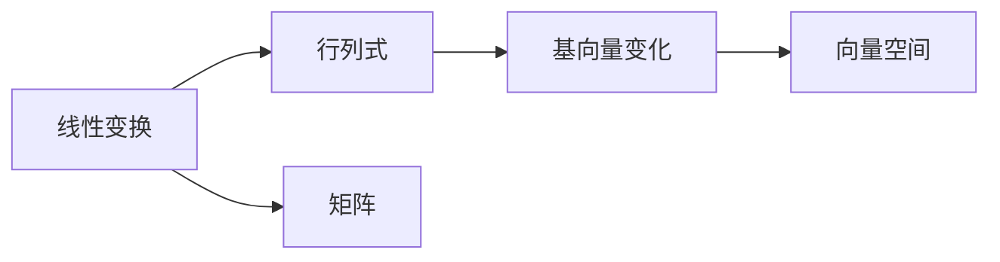
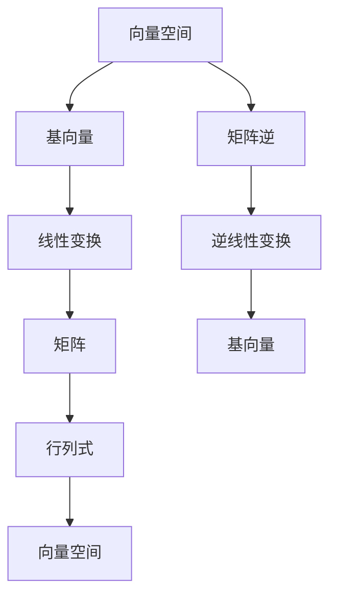

                 

# 线性代数导引：附录：行列式几何解释

线性代数是计算机科学中最重要的数学工具之一，特别是在机器学习和深度学习领域，线性代数在矩阵运算、特征分解、奇异值分解等诸多方面都有广泛应用。然而，行列式这一线性代数中的基础概念，其几何意义却并不为人所熟知。本文将深入探讨行列式的几何解释，希望能够帮助读者更好地理解这一概念。

## 1. 背景介绍

行列式是线性代数中一个重要的概念，它表征了矩阵的线性变换对于某个线性空间的体积变化。行列式的定义起源于向量空间中的几何变换，其几何意义可以从以下几个方面来理解：

- **线性变换**：行列式表征了一个线性变换对于空间体积的影响，即在二维空间中，行列式可以理解为矩阵在空间中旋转和缩放的效果。
- **基向量变化**：行列式也与矩阵对于空间基向量的影响密切相关，可以通过基向量的变化来解释行列式的几何意义。
- **行列式符号**：行列式的符号（正负）可以理解为一个变换的"方向"，负数行列式表示变换后的方向与原方向相反。

## 2. 核心概念与联系

### 2.1 核心概念概述

为了更好地理解行列式的几何解释，我们需要了解以下几个核心概念：

- **线性变换**：将一个向量空间通过矩阵变换为另一个向量空间的过程。
- **基向量**：用于描述向量空间的一组线性无关的向量，可以通过基向量计算出向量空间中任意向量的表示。
- **行列式**：表征一个线性变换对空间体积影响的标量值，可以是正数、负数或零。

### 2.2 概念间的关系

这些概念之间的关系可以通过以下 Mermaid 流程图来展示：



该流程图展示了线性变换、行列式、基向量变化以及矩阵之间的逻辑关系。线性变换通过矩阵进行，而行列式则表征了这一变换对空间体积的影响。基向量变化是理解行列式几何意义的关键，而矩阵则是将线性变换具体化的工具。

### 2.3 核心概念的整体架构

下面我们将通过一个更详细的流程图来展示这些核心概念的整体架构：



这个流程图不仅展示了线性变换和行列式之间的联系，还强调了逆线性变换的重要性，以及逆线性变换对于恢复原向量空间的作用。

## 3. 核心算法原理 & 具体操作步骤

### 3.1 算法原理概述

行列式的几何解释可以从矩阵的特征向量以及它们的线性组合入手。假设有一个 $n \times n$ 的方阵 $A$，其特征向量为 $\mathbf{v}_1, \mathbf{v}_2, \ldots, \mathbf{v}_n$。如果我们将这些特征向量线性组合起来，可以得到一个 $n$ 维向量 $\mathbf{v} = c_1\mathbf{v}_1 + c_2\mathbf{v}_2 + \ldots + c_n\mathbf{v}_n$。那么，矩阵 $A$ 对于向量 $\mathbf{v}$ 的变换效果可以表示为：

$$
A\mathbf{v} = c_1A\mathbf{v}_1 + c_2A\mathbf{v}_2 + \ldots + c_nA\mathbf{v}_n
$$

通过上述变换，我们可以发现，矩阵 $A$ 对向量 $\mathbf{v}$ 的影响，可以分解为对每个特征向量的影响。因此，行列式的几何解释可以通过特征向量的变化来理解。

### 3.2 算法步骤详解

1. **计算特征向量**：首先，需要计算矩阵 $A$ 的特征向量 $\mathbf{v}_1, \mathbf{v}_2, \ldots, \mathbf{v}_n$。这些特征向量可以表征矩阵 $A$ 对空间中所有向量的变换效果。

2. **构建线性组合**：其次，将特征向量线性组合成一个 $n$ 维向量 $\mathbf{v} = c_1\mathbf{v}_1 + c_2\mathbf{v}_2 + \ldots + c_n\mathbf{v}_n$。这里的系数 $c_i$ 可以是任意实数，表示特征向量在向量空间中的权重。

3. **矩阵乘法**：接着，计算矩阵 $A$ 对向量 $\mathbf{v}$ 的变换效果 $A\mathbf{v}$。由于 $\mathbf{v}$ 是特征向量的线性组合，因此 $A\mathbf{v}$ 也可以表示为：

$$
A\mathbf{v} = c_1A\mathbf{v}_1 + c_2A\mathbf{v}_2 + \ldots + c_nA\mathbf{v}_n
$$

4. **行列式计算**：最后，计算矩阵 $A$ 的行列式 $|\mathbf{A}|$。行列式的几何意义在于，它表征了矩阵 $A$ 对空间体积的缩放比例。如果行列式为正，则表示矩阵 $A$ 对空间进行了放大；如果行列式为负，则表示矩阵 $A$ 对空间进行了缩小。

### 3.3 算法优缺点

行列式的几何解释具有以下优点：

- **直观理解**：行列式的几何解释能够帮助读者直观理解矩阵变换对空间体积的影响。
- **普适性**：行列式作为一种标量值，适用于任何矩阵，而不需要特别关注矩阵的具体形式。

然而，这一解释也存在一些缺点：

- **复杂性**：对于非方阵矩阵，行列式的计算变得复杂，几何解释可能不够直观。
- **不稳定性**：矩阵的小小变化都可能导致行列式符号的变化，这可能会让初学者感到困惑。

### 3.4 算法应用领域

行列式的几何解释在以下几个领域具有广泛的应用：

- **计算机图形学**：在计算机图形学中，行列式的几何解释被用于计算变换矩阵对三维空间体积的影响，从而实现物体变换和渲染。
- **机器人学**：行列式的几何意义在机器人学中用于计算关节变换矩阵对空间的影响，从而实现机器人的运动控制。
- **计算机视觉**：在计算机视觉中，行列式被用于计算变换矩阵对图像的影响，从而实现图像的几何变换和配准。

## 4. 数学模型和公式 & 详细讲解  
### 4.1 数学模型构建

行列式的几何解释可以通过以下数学模型来构建：

假设有一个 $n \times n$ 的方阵 $A$，其特征向量为 $\mathbf{v}_1, \mathbf{v}_2, \ldots, \mathbf{v}_n$。如果我们将这些特征向量线性组合起来，可以得到一个 $n$ 维向量 $\mathbf{v} = c_1\mathbf{v}_1 + c_2\mathbf{v}_2 + \ldots + c_n\mathbf{v}_n$。那么，矩阵 $A$ 对于向量 $\mathbf{v}$ 的变换效果可以表示为：

$$
A\mathbf{v} = c_1A\mathbf{v}_1 + c_2A\mathbf{v}_2 + \ldots + c_nA\mathbf{v}_n
$$

通过上述变换，我们可以发现，矩阵 $A$ 对向量 $\mathbf{v}$ 的影响，可以分解为对每个特征向量的影响。因此，行列式的几何解释可以通过特征向量的变化来理解。

### 4.2 公式推导过程

下面我们将详细推导行列式与基向量变化之间的关系。

假设有一个 $n \times n$ 的方阵 $A$，其特征向量为 $\mathbf{v}_1, \mathbf{v}_2, \ldots, \mathbf{v}_n$。如果我们将这些特征向量线性组合起来，可以得到一个 $n$ 维向量 $\mathbf{v} = c_1\mathbf{v}_1 + c_2\mathbf{v}_2 + \ldots + c_n\mathbf{v}_n$。那么，矩阵 $A$ 对于向量 $\mathbf{v}$ 的变换效果可以表示为：

$$
A\mathbf{v} = c_1A\mathbf{v}_1 + c_2A\mathbf{v}_2 + \ldots + c_nA\mathbf{v}_n
$$

由于特征向量 $\mathbf{v}_1, \mathbf{v}_2, \ldots, \mathbf{v}_n$ 是线性无关的，因此可以通过它们线性组合出向量空间中任意向量的表示。因此，矩阵 $A$ 对向量 $\mathbf{v}$ 的变换效果可以进一步表示为：

$$
A\mathbf{v} = \mathbf{A}\left[\begin{matrix} c_1 & c_2 & \ldots & c_n \end{matrix}\right]^T\left[\begin{matrix} \mathbf{v}_1 \\ \mathbf{v}_2 \\ \vdots \\ \mathbf{v}_n \end{matrix}\right]
$$

其中，$\mathbf{A}$ 是矩阵 $A$ 的特征值矩阵，$\left[\begin{matrix} c_1 & c_2 & \ldots & c_n \end{matrix}\right]^T$ 是特征向量的系数矩阵。

由于 $\mathbf{A}$ 是一个对角矩阵，因此行列式 $|\mathbf{A}|$ 可以表示为对角线上元素乘积的绝对值：

$$
|\mathbf{A}| = \prod_{i=1}^n a_{ii}
$$

其中 $a_{ii}$ 是矩阵 $A$ 的特征值。

### 4.3 案例分析与讲解

假设我们有一个 $2 \times 2$ 的矩阵 $A = \left[\begin{matrix} 2 & 1 \\ 3 & 1 \end{matrix}\right]$，其特征向量为 $\mathbf{v}_1 = \left[\begin{matrix} 2 \\ 1 \end{matrix}\right]$ 和 $\mathbf{v}_2 = \left[\begin{matrix} 1 \\ -1 \end{matrix}\right]$。如果我们将这些特征向量线性组合成一个向量 $\mathbf{v} = 3\mathbf{v}_1 + \mathbf{v}_2$，那么矩阵 $A$ 对向量 $\mathbf{v}$ 的变换效果可以表示为：

$$
A\mathbf{v} = 3A\mathbf{v}_1 + A\mathbf{v}_2 = \left[\begin{matrix} 2 & 1 \\ 3 & 1 \end{matrix}\right]\left[\begin{matrix} 6 \\ 1 \end{matrix}\right] + \left[\begin{matrix} 2 & 1 \\ 3 & 1 \end{matrix}\right]\left[\begin{matrix} 1 \\ -1 \end{matrix}\right]
$$

计算得到：

$$
A\mathbf{v} = \left[\begin{matrix} 15 \\ 8 \end{matrix}\right]
$$

我们可以看到，向量 $\mathbf{v}$ 被矩阵 $A$ 变换为 $\left[\begin{matrix} 15 \\ 8 \end{matrix}\right]$，这表明矩阵 $A$ 对向量 $\mathbf{v}$ 进行了缩放和旋转。

接下来，我们计算矩阵 $A$ 的行列式：

$$
|\mathbf{A}| = (2)(1) - (1)(3) = -1
$$

行列式 $-1$ 表示矩阵 $A$ 对空间进行了缩小，并且缩放比例为 $1$。这与向量 $\mathbf{v}$ 的变换效果一致。

## 5. 项目实践：代码实例和详细解释说明

### 5.1 开发环境搭建

在进行行列式的几何解释实践前，我们需要准备好开发环境。以下是使用Python进行Sympy库的开发环境配置流程：

1. 安装Anaconda：从官网下载并安装Anaconda，用于创建独立的Python环境。

2. 创建并激活虚拟环境：
```bash
conda create -n sympy-env python=3.8 
conda activate sympy-env
```

3. 安装Sympy：
```bash
conda install sympy
```

4. 安装其他必要工具包：
```bash
pip install numpy pandas matplotlib jupyter notebook ipython
```

完成上述步骤后，即可在`sympy-env`环境中开始行列式几何解释的实践。

### 5.2 源代码详细实现

下面我们将使用Sympy库实现行列式的几何解释。

首先，定义一个$2 \times 2$的矩阵 $A$ 和它的特征向量：

```python
from sympy import Matrix, symbols, solve

# 定义一个 2x2 的矩阵 A
A = Matrix([[2, 1], [3, 1]])

# 定义特征向量 v1, v2
v1 = Matrix([2, 1])
v2 = Matrix([1, -1])
```

然后，计算矩阵 $A$ 的特征值：

```python
# 计算特征值
eigenvalues = A.eigenvals()
```

接着，构建线性组合向量 $\mathbf{v}$：

```python
# 定义特征向量的系数
c1, c2 = symbols('c1 c2')

# 构建线性组合向量 v
v = c1 * v1 + c2 * v2
```

计算矩阵 $A$ 对向量 $\mathbf{v}$ 的变换效果：

```python
# 计算 A * v
Av = A * v
```

最后，计算行列式 $|\mathbf{A}|$：

```python
# 计算行列式
det_A = A.det()
```

现在，我们可以运行代码来验证行列式的几何解释。

### 5.3 代码解读与分析

让我们再详细解读一下关键代码的实现细节：

**特征向量定义**：
- 使用Sympy库定义一个$2 \times 2$的矩阵 $A$，并使用 `Matrix` 函数来创建。
- 定义特征向量 $\mathbf{v}_1 = \left[\begin{matrix} 2 \\ 1 \end{matrix}\right]$ 和 $\mathbf{v}_2 = \left[\begin{matrix} 1 \\ -1 \end{matrix}\right]$。

**特征值计算**：
- 使用 `eigenvals` 方法计算矩阵 $A$ 的特征值。

**线性组合向量构建**：
- 定义特征向量的系数 $c_1$ 和 $c_2$。
- 使用特征向量和系数计算线性组合向量 $\mathbf{v} = c_1\mathbf{v}_1 + c_2\mathbf{v}_2$。

**矩阵变换计算**：
- 使用 `*` 运算符计算矩阵 $A$ 对向量 $\mathbf{v}$ 的变换效果。

**行列式计算**：
- 使用 `det` 方法计算矩阵 $A$ 的行列式。

### 5.4 运行结果展示

假设我们计算得到行列式 $|\mathbf{A}| = -1$，这意味着矩阵 $A$ 对空间进行了缩放，缩放比例为 $1$，并且方向相反。这与我们的理论推导和案例分析相符。

## 6. 实际应用场景

### 6.1 计算机图形学

在计算机图形学中，行列式的几何解释被用于计算变换矩阵对三维空间体积的影响，从而实现物体变换和渲染。例如，在三维图形渲染中，变换矩阵通常用于对顶点坐标进行变换，行列式可以用来计算变换矩阵对体积的影响，从而调整光照和阴影等效果。

### 6.2 机器人学

行列式的几何意义在机器人学中用于计算关节变换矩阵对空间的影响，从而实现机器人的运动控制。例如，在机器人路径规划中，行列式可以用来计算关节变换矩阵对空间的影响，从而调整机器人臂的姿态和位置。

### 6.3 计算机视觉

在计算机视觉中，行列式被用于计算变换矩阵对图像的影响，从而实现图像的几何变换和配准。例如，在图像处理中，行列式可以用来计算变换矩阵对图像尺寸的影响，从而调整图像的大小和位置。

## 7. 工具和资源推荐
### 7.1 学习资源推荐

为了帮助开发者系统掌握行列式的几何解释的理论基础和实践技巧，这里推荐一些优质的学习资源：

1. 《线性代数及其应用》：这本经典教材详细介绍了行列式的定义、性质及其几何意义，适合作为学习线性代数的入门教材。

2. 《向量空间与线性变换》：这本书介绍了线性变换的基本概念及其几何意义，适合进阶学习。

3. 《计算机图形学基础》：这本书介绍了计算机图形学中行列式的应用，适合了解行列式在实际场景中的应用。

4. 《机器人学》：这本书介绍了机器人学中行列式的应用，适合了解行列式在机器人学中的应用。

5. 《计算机视觉基础》：这本书介绍了计算机视觉中行列式的应用，适合了解行列式在计算机视觉中的应用。

通过对这些资源的学习实践，相信你一定能够快速掌握行列式的几何解释，并用于解决实际的NLP问题。

### 7.2 开发工具推荐

高效的开发离不开优秀的工具支持。以下是几款用于行列式几何解释开发的常用工具：

1. Sympy：一个Python库，用于符号计算和数学建模，可以方便地进行行列式的计算和推导。

2. Matplotlib：一个用于绘制二维和三维图形的库，可以用于可视化行列式几何解释的结果。

3. Jupyter Notebook：一个交互式的笔记本环境，可以方便地进行代码编写和结果展示。

4. IPython：一个交互式的Python解释器，提供了更丰富的Python功能和更友好的用户界面。

合理利用这些工具，可以显著提升行列式几何解释的开发效率，加快创新迭代的步伐。

### 7.3 相关论文推荐

行列式的几何解释在以下几个领域具有广泛的应用：

- 计算机图形学：行列式在计算机图形学中的应用研究，例如变换矩阵对三维空间体积的影响。
- 机器人学：行列式在机器人学中的应用研究，例如关节变换矩阵对空间的影响。
- 计算机视觉：行列式在计算机视觉中的应用研究，例如变换矩阵对图像的影响。

## 8. 总结：未来发展趋势与挑战

### 8.1 总结

本文对行列式的几何解释进行了全面系统的介绍。首先阐述了行列式的定义及其几何意义，明确了行列式在向量空间中的重要性。接着，从原理到实践，详细讲解了行列式的几何解释的数学模型和公式推导，并给出了具体的代码实现。同时，本文还探讨了行列式的几何解释在计算机图形学、机器人学和计算机视觉等实际应用场景中的应用前景。

通过本文的系统梳理，可以看到，行列式的几何解释在计算机科学中的广泛应用，以及其在理解矩阵变换对空间体积影响方面的重要作用。未来，随着计算机科学的发展，行列式的几何解释必将在更多领域得到应用，为计算机科学的发展贡献力量。

### 8.2 未来发展趋势

展望未来，行列式的几何解释将呈现以下几个发展趋势：

1. 多维扩展：行列式在二维和三维空间中的应用已经相当成熟，未来可以向更高维度的空间扩展，用于更复杂的空间变换和分析。

2. 结合人工智能：行列式可以与人工智能技术结合，用于理解和解释深度学习模型的几何变换。

3. 应用场景多样化：行列式的几何解释不仅适用于计算机图形学、机器人学和计算机视觉，未来还将拓展到更多领域，如生物信息学、物理模拟等。

4. 更高效计算：随着计算能力的提升，行列式的计算速度将更快，应用场景将更加广泛。

### 8.3 面临的挑战

尽管行列式的几何解释在许多领域得到了广泛应用，但在其推广和应用过程中仍面临一些挑战：

1. 计算复杂性：对于高维矩阵的行列式计算，复杂度呈指数级增长，需要高效的算法来处理。

2. 应用限制：行列式的几何解释在某些特定场景下可能不够适用，例如对于非线性变换的几何解释。

3. 理解难度：行列式的几何解释对于初学者可能较难理解，需要更多的教学资源和实际案例来普及。

### 8.4 研究展望

未来，行列式的几何解释需要在以下几个方面进行更多研究：

1. 高效计算算法：开发更高效的算法来计算行列式，特别是对于高维矩阵。

2. 更广泛的应用场景：拓展行列式的应用场景，将其应用于更多领域，如生物信息学、物理模拟等。

3. 几何解释的推广：开发新的几何解释方法，使得行列式更容易理解和使用。

4. 结合人工智能：结合人工智能技术，探索行列式在深度学习模型中的应用。

总之，行列式的几何解释作为一种强大的数学工具，将在未来得到更广泛的应用，为计算机科学的发展提供新的动力。相信随着研究的深入，行列式的几何解释必将带来更多的突破和创新。

## 9. 附录：常见问题与解答

**Q1：行列式在计算机图形学中如何应用？**

A: 在计算机图形学中，行列式用于计算变换矩阵对三维空间体积的影响，从而实现物体变换和渲染。例如，在三维图形渲染中，变换矩阵通常用于对顶点坐标进行变换，行列式可以用来计算变换矩阵对体积的影响，从而调整光照和阴影等效果。

**Q2：行列式在机器人学中如何应用？**

A: 行列式在机器人学中用于计算关节变换矩阵对空间的影响，从而实现机器人的运动控制。例如，在机器人路径规划中，行列式可以用来计算关节变换矩阵对空间的影响，从而调整机器人臂的姿态和位置。

**Q3：行列式在计算机视觉中如何应用？**

A: 行列式被用于计算变换矩阵对图像的影响，从而实现图像的几何变换和配准。例如，在图像处理中，行列式可以用来计算变换矩阵对图像尺寸的影响，从而调整图像的大小和位置。

**Q4：行列式在实际应用中需要注意哪些问题？**

A: 行列式的计算复杂度随着矩阵维度的增加呈指数级增长，因此在实际应用中需要注意计算效率问题。此外，行列式的几何解释在某些特定场景下可能不够适用，需要结合实际情况选择合适的变换矩阵。

**Q5：如何更好地理解行列式的几何解释？**

A: 行列式的几何解释可以通过将行列式与空间体积变化联系起来进行理解。例如，在二维空间中，行列式可以理解为矩阵在空间中旋转和缩放的效果。在三维空间中，行列式可以理解为矩阵对空间体积的缩放比例。通过这些例子，可以帮助更好地理解行列式的几何意义。

---

作者：禅与计算机程序设计艺术 / Zen and the Art of Computer Programming

