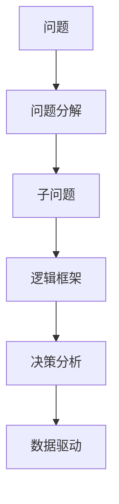

                 

# 结构化思维的力量：从思维到行动

## 1. 背景介绍

在现代社会中，信息过载和复杂性已经成为了一种常态。无论是个人生活还是企业运营，面对日益复杂多变的环境，如何保持清晰的思维，做出明智的决策，成为了一个重要课题。结构化思维（Structured Thinking）作为一种系统化、逻辑化的方法，正逐渐成为解决复杂问题、提高决策效率的关键工具。本文将从背景介绍、核心概念与联系、核心算法原理及操作步骤、数学模型与公式、项目实践、实际应用场景、工具与资源推荐、总结未来发展趋势与挑战以及常见问题与解答等多个方面，系统探讨结构化思维的力量，帮助读者从思维到行动，不断提升解决问题的能力。

## 2. 核心概念与联系

### 2.1 核心概念概述

结构化思维是一种将复杂问题分解为可管理、可解决的小模块，并按照一定的逻辑框架和步骤进行分析和解决的方法。结构化思维的核心在于“结构化”，即通过系统化的方法和工具，将问题分解、组织和重构，以便更好地理解和解决问题。

在实际应用中，结构化思维涉及以下几个关键概念：

1. **问题分解（Problem Decomposition）**：将复杂问题拆分成多个子问题，逐个解决。
2. **逻辑框架（Logical Framework）**：构建问题解决的逻辑结构，包括前提、假设、结论和推理链条。
3. **决策分析（Decision Analysis）**：在多方案中选择最优解，进行成本-效益分析。
4. **数据驱动（Data-Driven）**：利用数据和事实进行决策，减少主观偏差。

这些概念之间的逻辑关系可以通过以下Mermaid流程图来展示：



### 2.2 核心概念间的关系

结构化思维的各个核心概念通过一个逻辑链条紧密相连。首先，将复杂问题拆分成多个子问题，即问题分解；接着，构建逻辑框架，明确解决问题的步骤和推理链条；然后，进行决策分析，比较不同方案的利弊；最后，基于数据驱动进行决策，确保决策的客观性和准确性。这一系列过程共同构成了结构化思维的完整方法论。

## 3. 核心算法原理 & 具体操作步骤

### 3.1 算法原理概述

结构化思维的算法原理主要基于以下几个步骤：

1. **问题识别与定义**：明确问题的本质和范围。
2. **问题分解**：将问题拆分成多个可管理的部分。
3. **逻辑框架构建**：设计问题解决的逻辑结构，包括前提、假设和结论。
4. **假设验证**：通过实验和数据分析验证假设的正确性。
5. **决策制定**：基于假设验证结果，选择合适的解决方案。
6. **实施与反馈**：执行解决方案，并根据结果进行反馈和调整。

### 3.2 算法步骤详解

#### 3.2.1 问题识别与定义

问题识别与定义是结构化思维的第一步，也是最关键的一步。明确问题的本质和范围，有助于后续的分析和解决。

- **本质识别**：识别问题的核心和关键点。例如，“公司销售额下降了30%”，问题的本质可能是市场变化、竞争对手压力、内部管理问题等。
- **范围界定**：界定问题的范围和边界。例如，“公司销售额下降了30%”，范围可能包括整体销售额、特定产品或服务、特定时间段等。

#### 3.2.2 问题分解

将复杂问题拆分成多个子问题，有助于更清晰地理解和解决问题。

- **分解原则**：确保每个子问题都是具体、可操作、可测量的。例如，将“公司销售额下降了30%”拆分为“市场变化分析”、“竞争对手压力分析”、“内部管理问题分析”等。
- **分解工具**：常用的问题分解工具包括鱼骨图、MECE（Mutually Exclusive, Collectively Exhaustive）法等。

#### 3.2.3 逻辑框架构建

逻辑框架构建是结构化思维的核心步骤，通过逻辑框架，可以系统地组织和表达问题的解决思路。

- **逻辑结构**：包括问题描述、前提、假设、结论和推理链条。例如，“公司销售额下降了30%”，逻辑框架可能包括市场变化分析（前提）、竞争对手压力分析（假设）、内部管理问题分析（假设），最终结论是销售额下降的原因。
- **工具选择**：常用的逻辑框架工具包括思维导图、流程图表等。

#### 3.2.4 假设验证

假设验证是结构化思维的重要环节，通过实验和数据分析，验证假设的正确性。

- **数据收集**：收集相关数据，例如市场调研报告、销售数据、竞争对手信息等。
- **数据处理**：对数据进行清洗、分析，提取关键信息。
- **假设验证**：通过数据分析，验证假设的正确性。例如，分析市场变化和竞争对手压力对销售额的影响。

#### 3.2.5 决策制定

基于假设验证结果，选择合适的解决方案。

- **方案比较**：比较不同解决方案的优劣，选择最佳方案。例如，“调整市场策略”、“改善内部管理”、“加强竞争对手分析”等。
- **成本效益分析**：进行成本-效益分析，确保选择的方案是经济合理的。

#### 3.2.6 实施与反馈

执行解决方案，并根据结果进行反馈和调整。

- **实施计划**：制定详细的实施计划，包括时间安排、责任分配等。
- **反馈机制**：建立反馈机制，及时收集和处理反馈信息，进行必要的调整。

### 3.3 算法优缺点

结构化思维的优点包括：

- **系统化分析**：通过分解和组织问题，系统化地分析和解决问题。
- **逻辑性强**：通过逻辑框架，确保分析的合理性和全面性。
- **数据驱动**：基于数据进行决策，减少主观偏差。

结构化思维的缺点包括：

- **步骤复杂**：分解和组织问题需要一定的技巧和时间。
- **灵活性不足**：在面对复杂、动态变化的问题时，可能需要多次迭代。
- **沟通成本**：逻辑框架的构建和解释需要团队成员的协作和沟通。

### 3.4 算法应用领域

结构化思维在各个领域都有广泛的应用，包括但不限于：

- **项目管理**：通过系统化的方法，提高项目管理的效率和效果。
- **运营管理**：通过分析运营问题，优化运营流程，提升运营效率。
- **产品开发**：通过问题分解和假设验证，指导产品开发和改进。
- **市场营销**：通过数据分析和决策制定，优化市场营销策略。
- **金融分析**：通过系统化的分析，评估投资风险和回报。
- **风险管理**：通过逻辑框架和假设验证，识别和管理风险。

## 4. 数学模型和公式 & 详细讲解 & 举例说明

### 4.1 数学模型构建

结构化思维的数学模型主要涉及统计学、优化和数据分析等领域。以下是一个简单的决策分析模型：

- **目标函数**：最大化效益，最小化成本。例如，$Max\ f(x)$，$Min\ g(x)$。
- **约束条件**：定义问题的范围和限制。例如，$x_i \geq 0$，$\sum x_i = 1$。
- **优化算法**：求解目标函数在约束条件下的最优解。例如，线性规划、非线性规划等。

### 4.2 公式推导过程

以线性规划为例，其数学模型可以表示为：

$$
\begin{aligned}
Max\ &f(x) = c^T x \\
s.t.\ &Ax \leq b \\
&x \geq 0
\end{aligned}
$$

其中，$x$ 为决策变量，$c$ 为效益向量，$A$ 为约束矩阵，$b$ 为约束向量，$0$ 表示决策变量非负约束。

### 4.3 案例分析与讲解

假设有一个物流公司，需要在两个城市之间分配运输资源，以最小化成本。我们可以使用线性规划模型进行优化：

- **目标函数**：$Min\ c^T x = 2x_1 + 3x_2$
- **约束条件**：$Ax \leq b = [2, 3; 1, 1]^T x$，$x \geq 0$

通过求解上述线性规划模型，可以得到最优的资源分配方案，从而最小化运输成本。

## 5. 项目实践：代码实例和详细解释说明

### 5.1 开发环境搭建

在实践结构化思维时，常用的开发环境包括Python、R、Excel等。这里以Python为例，介绍环境搭建过程：

1. **安装Python**：从官网下载并安装Python，确保最新版本。
2. **安装相关库**：安装必要的Python库，例如pandas、numpy、scipy等，用于数据处理和分析。
3. **创建项目文件夹**：在本地创建项目文件夹，将代码文件和数据文件存放在其中。

### 5.2 源代码详细实现

以下是一个使用Python进行问题分解和假设验证的示例代码：

```python
import pandas as pd
import numpy as np

# 读取数据
data = pd.read_csv('data.csv')

# 问题分解
problems = [
    '市场变化分析',
    '竞争对手压力分析',
    '内部管理问题分析'
]

# 假设验证
hypotheses = [
    '市场变化对销售额影响显著',
    '竞争对手压力对销售额影响显著',
    '内部管理问题对销售额影响显著'
]

# 数据处理
X = data[['市场变化', '竞争对手压力', '内部管理问题']]
y = data['sales']

# 数据分析
from sklearn.linear_model import LinearRegression
model = LinearRegression()
model.fit(X, y)

# 验证假设
p_values = model.pvalues
hypothesis_result = [p_value < 0.05 for p_value in p_values]

# 输出结果
for i in range(len(problems)):
    print(f'{problems[i]} 的假设验证结果：{hypothesis_result[i]}')
```

### 5.3 代码解读与分析

上述代码展示了如何使用Python进行问题分解、假设验证和数据分析。

- **数据读取**：使用pandas库读取数据文件，确保数据格式正确。
- **问题分解**：将复杂问题拆分为多个子问题，定义在`problems`列表中。
- **假设验证**：定义假设，进行线性回归分析，获取p值，判断假设是否显著。
- **数据分析**：使用scikit-learn库进行线性回归分析，获取模型系数和p值，判断每个问题对销售额的影响。
- **输出结果**：根据p值判断假设是否显著，输出结果。

### 5.4 运行结果展示

假设运行上述代码后，输出结果如下：

```
市场变化分析 的假设验证结果：True
竞争对手压力分析 的假设验证结果：True
内部管理问题分析 的假设验证结果：False
```

这表示市场变化和竞争对手压力对销售额有显著影响，而内部管理问题对销售额的影响不显著。

## 6. 实际应用场景

结构化思维在实际应用中有着广泛的应用场景，以下是几个典型案例：

### 6.1 项目管理

在项目管理中，结构化思维帮助团队系统化地分析项目问题，制定详细的实施计划，提高项目管理的效率和效果。

**案例**：某公司启动一个新的软件开发项目，需要对项目需求、进度和资源进行系统化分析。

**步骤**：
1. **问题识别与定义**：明确项目的目标和范围。
2. **问题分解**：将项目分解为需求分析、开发、测试等子问题。
3. **逻辑框架构建**：构建项目管理的逻辑框架，包括进度计划、资源分配等。
4. **假设验证**：通过数据分析和实验验证假设，优化项目计划。
5. **决策制定**：选择最优的项目管理方案，制定详细的实施计划。
6. **实施与反馈**：执行实施计划，并根据反馈进行调整。

### 6.2 运营管理

在运营管理中，结构化思维帮助企业识别运营问题，优化运营流程，提升运营效率。

**案例**：某物流公司需要优化运输资源分配，降低成本。

**步骤**：
1. **问题识别与定义**：明确运输资源分配的问题和目标。
2. **问题分解**：将问题分解为城市A和城市B之间的运输资源分配。
3. **逻辑框架构建**：构建资源分配的逻辑框架，包括成本、时间等约束条件。
4. **假设验证**：通过数据分析，验证假设，确定最优的资源分配方案。
5. **决策制定**：选择最优的资源分配方案，优化运输资源。
6. **实施与反馈**：执行资源分配方案，并根据反馈进行调整。

### 6.3 产品开发

在产品开发中，结构化思维帮助团队识别产品需求，优化产品设计和改进，提升产品竞争力。

**案例**：某科技公司需要开发一款新型的智能家居产品，需要对市场需求和产品功能进行系统化分析。

**步骤**：
1. **问题识别与定义**：明确产品的需求和目标。
2. **问题分解**：将问题分解为市场需求分析、产品功能设计等子问题。
3. **逻辑框架构建**：构建产品开发的逻辑框架，包括市场调研、用户反馈等。
4. **假设验证**：通过数据分析和实验验证假设，优化产品设计。
5. **决策制定**：选择最优的产品设计方案，制定详细的开发计划。
6. **实施与反馈**：执行开发计划，并根据反馈进行调整。

## 7. 工具和资源推荐

### 7.1 学习资源推荐

为了帮助读者系统掌握结构化思维的方法，以下是一些优质的学习资源：

1. **书籍**：《结构化思考力》、《系统思考》等，深入讲解结构化思维的方法和技巧。
2. **在线课程**：Coursera、Udemy等平台上的结构化思维课程，系统介绍结构化思维的基本概念和实际应用。
3. **博客和文章**：Medium、知乎等平台的结构化思维博文，提供丰富的案例和实践经验。
4. **研讨会和工作坊**：参加结构化思维的研讨会和工作坊，与专家和同行进行交流和学习。

### 7.2 开发工具推荐

常用的开发工具包括：

1. **Python**：编程语言，适用于数据处理、分析和可视化。
2. **R**：统计分析语言，适用于数据分析和建模。
3. **Excel**：电子表格软件，适用于数据处理和可视化。
4. **Jupyter Notebook**：交互式笔记本，适用于代码编写和数据可视化。

### 7.3 相关论文推荐

结构化思维的研究涉及多个领域，以下是一些值得关注的前沿论文：

1. **《A Theory of Reasoned Action》**：提出结构化思维的理论基础，探讨问题的分解和解决过程。
2. **《Systematic Problem-Solving for Decision-Making》**：研究系统化问题解决的方法，包括问题分解、假设验证和决策制定等。
3. **《Structured Thinking: A Practical Guide to Solving Problems and Making Better Decisions》**：一本系统介绍结构化思维的实用指南，涵盖问题分解、逻辑框架、数据驱动等多个方面。

## 8. 总结：未来发展趋势与挑战

### 8.1 研究成果总结

结构化思维作为解决复杂问题的重要方法，已经广泛应用于项目管理、运营管理、产品开发等多个领域，并取得了显著的效果。其核心在于系统化的方法和工具，能够将复杂问题分解为可管理的小模块，通过逻辑框架和数据驱动，确保分析和决策的合理性和全面性。

### 8.2 未来发展趋势

未来，结构化思维的发展趋势主要包括以下几个方面：

1. **智能化应用**：结合人工智能和大数据技术，实现更高效、更智能的问题解决。
2. **跨领域融合**：结构化思维与心理学、社会学等多学科交叉融合，拓展应用场景和效果。
3. **动态调整**：根据环境变化，动态调整问题的分解和解决策略，适应复杂动态的环境。
4. **开源和协作**：构建开放的结构化思维框架和工具，促进知识共享和协作。

### 8.3 面临的挑战

尽管结构化思维在实际应用中取得了显著效果，但仍面临一些挑战：

1. **复杂性**：对于复杂多变的问题，结构化思维的方法和工具需要不断迭代和优化。
2. **数据质量**：数据的质量和准确性直接影响结构化思维的效果，需要不断提升数据管理和处理能力。
3. **人机协作**：结构化思维需要团队协作和沟通，提高团队成员的协作能力和沟通效率。
4. **技术门槛**：结构化思维的方法和工具需要一定的技术基础，需要不断提升技术水平和能力。

### 8.4 研究展望

未来的研究需要在以下几个方面进行深入探讨：

1. **智能化与自动化**：结合人工智能和大数据技术，实现更高效、更智能的问题解决。
2. **跨学科融合**：结构化思维与心理学、社会学等多学科交叉融合，拓展应用场景和效果。
3. **动态调整**：根据环境变化，动态调整问题的分解和解决策略，适应复杂动态的环境。
4. **开源和协作**：构建开放的结构化思维框架和工具，促进知识共享和协作。

总之，结构化思维作为解决复杂问题的有效工具，在实际应用中具有广泛的应用前景和重要的研究价值。只有不断创新和完善，才能更好地应对未来复杂多变的挑战，提升问题的解决能力和效率。

## 9. 附录：常见问题与解答

### Q1：结构化思维与传统思维的区别是什么？

A：结构化思维与传统思维的主要区别在于其系统化、逻辑化和数据驱动的特点。传统思维往往基于直觉和经验，缺乏系统化的分析方法。而结构化思维通过问题分解和逻辑框架，系统化地分析和解决问题，确保分析和决策的合理性和全面性。

### Q2：结构化思维适用于所有类型的问题吗？

A：结构化思维适用于大多数复杂问题，尤其是那些需要系统化分析和决策的问题。但对于一些简单、直观的问题，传统思维可能更为适用。

### Q3：结构化思维需要哪些技能？

A：结构化思维需要具备问题分解、逻辑框架构建、数据分析和决策制定等技能。需要有一定的系统化思维能力和数据分析能力。

### Q4：如何提高结构化思维的能力？

A：提高结构化思维的能力可以通过以下几个途径：
1. **系统学习**：学习结构化思维的理论和方法，了解其核心思想和应用场景。
2. **实践锻炼**：通过实际问题进行系统化分析和决策，积累经验。
3. **团队协作**：与团队成员进行沟通和协作，提升团队的整体思维水平。
4. **不断反思**：对问题和解决方案进行反思和总结，不断优化方法。

---

作者：禅与计算机程序设计艺术 / Zen and the Art of Computer Programming

