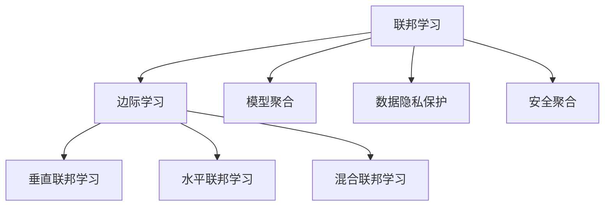
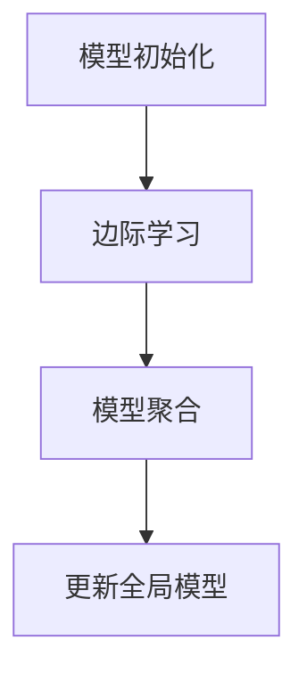

                 

# 联邦学习 (Federated Learning) 原理与代码实例讲解

> 关键词：联邦学习,分布式训练,数据隐私,模型更新,模型聚合,联邦学习算法,边际学习,垂直联邦学习,水平联邦学习,混合联邦学习

## 1. 背景介绍

### 1.1 问题由来
随着大数据时代的到来，各行各业在数字化转型过程中产生了海量的数据。这些数据通常包含敏感的用户隐私信息，如医疗记录、购买历史、地理位置等，无法直接集中存储和共享。传统集中式数据训练方法难以满足数据隐私和安全需求，而联邦学习（Federated Learning, FL）应运而生。

联邦学习旨在保护数据隐私的前提下，通过分布式计算，将数据分布在多个设备或服务器上，各设备仅本地参与模型的训练，最终将更新后的模型参数汇总，用于全局模型优化。这种分散式训练方式，保证了数据的私密性，同时避免了单点故障，具有很大的实用价值。

### 1.2 问题核心关键点
联邦学习的核心在于如何通过分散式数据集进行模型训练，并在保护数据隐私的同时，实现全局模型的收敛。其关键点包括：
- 数据分布：多个设备或服务器上存储的数据分布不均衡，对全局模型的训练和更新造成影响。
- 模型聚合：如何在不泄露本地数据的情况下，从各设备上传输和聚合模型参数。
- 通信成本：联邦学习的通信开销较大，如何降低通信成本是优化模型的一个重要方向。
- 安全性：确保模型在传输和聚合过程中不被篡改或攻击，保障模型更新和传输的安全性。
- 公平性：不同设备的资源差异导致模型更新效果不均衡，如何平衡各设备更新贡献。

这些关键点共同决定了联邦学习的有效性和实用性，是联邦学习算法设计和优化时需要重点考虑的问题。

### 1.3 问题研究意义
联邦学习是分布式机器学习和人工智能领域的前沿技术，具有重要的研究意义：

1. 数据隐私保护：在敏感数据上训练模型，可以有效避免数据泄露风险，保护用户隐私。
2. 分布式计算：联邦学习基于分布式架构，可以充分利用边缘计算资源，提升计算效率。
3. 模型公平性：通过各设备模型的公平更新，可以降低设备间的数据分布不均衡问题，提高模型性能。
4. 应用广泛：联邦学习适用于多种应用场景，如移动设备、IoT设备、医疗数据、工业数据等，具有广泛的应用前景。
5. 算法创新：联邦学习推动了新的算法和理论研究，如差分隐私、加密计算、安全聚合等，为机器学习领域带来了新的研究方向。

## 2. 核心概念与联系

### 2.1 核心概念概述

为更好地理解联邦学习的基本原理和核心概念，本节将介绍几个密切相关的核心概念：

- 联邦学习（Federated Learning）：一种分布式机器学习方法，旨在通过本地设备上的数据更新模型参数，而非集中式地共享数据。
- 边际学习（Local Learning）：在本地设备上进行的模型训练，基于本地数据更新模型参数。
- 模型聚合（Model Aggregation）：在各设备训练后，汇总模型参数，更新全局模型。
- 数据隐私保护（Data Privacy）：确保模型训练过程中不泄露本地数据的敏感信息。
- 安全聚合（Secure Aggregation）：在模型参数聚合过程中，保护模型参数不被篡改和泄露。
- 垂直联邦学习（Vertical Federated Learning）：设备数据按列维度上传，适合处理异构数据。
- 水平联邦学习（Horizontal Federated Learning）：设备数据按行维度上传，适合处理同构数据。
- 混合联邦学习（Hybrid Federated Learning）：结合垂直和水平联邦学习的特点，处理异构同构混合数据。

这些核心概念之间存在紧密的联系，共同构成了联邦学习的基本框架。通过理解这些核心概念，我们可以更好地把握联邦学习的关键原理和优化策略。

### 2.2 概念间的关系

这些核心概念之间的关系可以通过以下Mermaid流程图来展示：



这个流程图展示了联邦学习的基本流程和核心概念之间的关系：

1. 联邦学习作为一个整体，由边际学习、模型聚合、数据隐私保护和安全聚合组成。
2. 边际学习是联邦学习的基础，在本地设备上进行的模型训练。
3. 模型聚合是联邦学习的核心，汇总各设备的模型参数更新。
4. 数据隐私保护和安全聚合是联邦学习的保障，确保模型更新和聚合过程中数据的安全。
5. 垂直联邦学习、水平联邦学习和混合联邦学习是联邦学习的不同实现方式，根据数据分布的特点选择合适的聚合方式。

通过这些核心概念的描述和联系，我们可以更好地理解联邦学习的原理和应用场景，为后续深入探讨联邦学习算法和代码实现奠定基础。

## 3. 核心算法原理 & 具体操作步骤

### 3.1 算法原理概述

联邦学习的基本原理是通过本地设备的边际学习，更新模型参数，并最终将各设备更新的模型参数汇总，更新全局模型。其核心算法包括模型初始化、边际学习、模型聚合和更新等步骤。

联邦学习的总体流程如图：



具体的实现步骤如下：

1. **模型初始化**：选择全局初始化模型，作为本地设备训练的起点。
2. **边际学习**：各设备基于本地数据进行模型训练，更新本地模型的参数。
3. **模型聚合**：各设备将更新后的模型参数汇总，并计算全局模型的更新参数。
4. **更新全局模型**：使用聚合后的模型参数，更新全局模型，完成一轮联邦学习。

### 3.2 算法步骤详解

下面详细介绍联邦学习的具体实现步骤：

#### 3.2.1 模型初始化

首先，需要初始化一个全局模型 $M_0$，作为联邦学习的起点。这个模型可以是任意的初始化模型，例如随机初始化、预训练模型等。

假设全局模型是一个线性回归模型，形式为：

$$
M_0 = \alpha_0 W_0 + b_0
$$

其中 $W_0$ 为模型权重，$b_0$ 为偏置项，$\alpha_0$ 为模型的初始化系数。

#### 3.2.2 边际学习

在联邦学习的每轮训练中，各设备基于本地数据进行模型训练，更新本地模型的参数。假设第 $i$ 个设备本地数据集为 $\{(x_{i,k}, y_{i,k})\}_{k=1}^{N_i}$，其中 $x_{i,k}$ 为输入，$y_{i,k}$ 为输出，$N_i$ 为本地数据量。

设备 $i$ 的模型参数为 $W_i$，基于本地数据进行训练，得到更新后的模型参数 $W_i^{(t+1)}$，具体实现如下：

$$
W_i^{(t+1)} = W_i^{(t)} - \eta \nabla L_i(W_i^{(t)}, \{(x_{i,k}, y_{i,k})\}_{k=1}^{N_i})
$$

其中，$\eta$ 为学习率，$L_i(W_i, \{(x_{i,k}, y_{i,k})\}_{k=1}^{N_i})$ 为设备 $i$ 的损失函数，通常为平方误差或交叉熵等。

#### 3.2.3 模型聚合

设备 $i$ 将本地模型参数 $W_i^{(t+1)}$ 汇总，计算全局模型的更新参数 $W^{(t+1)}$。常见的聚合方法包括均值聚合、加权聚合、差分聚合等。

假设使用均值聚合方法，计算全局模型的更新参数为：

$$
W^{(t+1)} = \frac{1}{N} \sum_{i=1}^N W_i^{(t+1)}
$$

其中 $N$ 为设备数量。

#### 3.2.4 更新全局模型

使用聚合后的模型参数 $W^{(t+1)}$，更新全局模型 $M_{t+1}$，完成一轮联邦学习。具体实现如下：

$$
M_{t+1} = \alpha_{t+1} W^{(t+1)} + b_{t+1}
$$

其中 $\alpha_{t+1}$ 和 $b_{t+1}$ 为更新后的系数和偏置项。

#### 3.2.5 重复执行

重复执行上述步骤，直到全局模型收敛或达到预设的迭代次数。

### 3.3 算法优缺点

联邦学习具有以下优点：

1. **数据隐私保护**：各设备仅本地参与模型训练，不会泄露本地数据。
2. **分布式计算**：充分利用边缘计算资源，提升计算效率。
3. **模型公平性**：各设备数据分布不均衡时，可以通过联邦学习平衡更新贡献。
4. **泛化能力强**：基于各设备本地数据进行训练，模型更具有泛化能力。

但联邦学习也存在以下缺点：

1. **通信成本高**：各设备需要频繁传输和聚合模型参数，通信开销较大。
2. **收敛速度慢**：由于模型更新需要多次聚合，收敛速度较慢。
3. **数据分布不均**：各设备数据量不均衡时，可能导致模型更新效果不均衡。
4. **复杂度较高**：联邦学习需要解决数据分布、模型聚合等复杂问题，实现难度较大。

### 3.4 算法应用领域

联邦学习在多个领域具有广泛的应用前景，包括但不限于：

- **医疗数据**：在保护患者隐私的前提下，联合多家医院的数据进行模型训练，提升疾病诊断和治疗效果。
- **金融数据**：在保护用户隐私的前提下，联合多家金融机构的数据进行风险评估和信用评分，提升金融决策的准确性。
- **教育数据**：在保护学生隐私的前提下，联合多所学校的学习数据进行模型训练，提升个性化教育效果。
- **交通数据**：在保护车辆隐私的前提下，联合多家交通设备的数据进行模型训练，提升交通管理和安全监测效果。
- **物联网数据**：在保护设备隐私的前提下，联合多家物联网设备的数据进行模型训练，提升智能制造和工业检测效果。

## 4. 数学模型和公式 & 详细讲解 & 举例说明

### 4.1 数学模型构建

假设联邦学习系统包含 $N$ 个设备，设备 $i$ 的数据集为 $\{(x_{i,k}, y_{i,k})\}_{k=1}^{N_i}$，其中 $x_{i,k}$ 为输入，$y_{i,k}$ 为输出，$N_i$ 为本地数据量。全局模型为线性回归模型，形式为：

$$
M_t = \alpha_t W_t + b_t
$$

其中 $W_t$ 为模型权重，$b_t$ 为偏置项，$\alpha_t$ 为更新后的系数。

假设联邦学习采用均值聚合方法，设备 $i$ 的本地模型参数为 $W_i^{(t+1)}$，全局模型参数为 $W^{(t+1)}$，则有：

$$
W^{(t+1)} = \frac{1}{N} \sum_{i=1}^N W_i^{(t+1)}
$$

### 4.2 公式推导过程

在联邦学习的第 $t$ 轮训练中，设备 $i$ 基于本地数据集进行模型训练，得到更新后的本地模型参数 $W_i^{(t+1)}$，具体推导如下：

1. **本地模型训练**：设备 $i$ 基于本地数据集 $\{(x_{i,k}, y_{i,k})\}_{k=1}^{N_i}$，计算损失函数 $L_i(W_i^{(t)}, \{(x_{i,k}, y_{i,k})\}_{k=1}^{N_i})$，得到更新后的本地模型参数 $W_i^{(t+1)}$。

$$
W_i^{(t+1)} = W_i^{(t)} - \eta \nabla L_i(W_i^{(t)}, \{(x_{i,k}, y_{i,k})\}_{k=1}^{N_i})
$$

2. **模型聚合**：设备 $i$ 将本地模型参数 $W_i^{(t+1)}$ 汇总，计算全局模型参数 $W^{(t+1)}$。

$$
W^{(t+1)} = \frac{1}{N} \sum_{i=1}^N W_i^{(t+1)}
$$

3. **全局模型更新**：使用聚合后的模型参数 $W^{(t+1)}$，更新全局模型 $M_{t+1}$。

$$
M_{t+1} = \alpha_{t+1} W^{(t+1)} + b_{t+1}
$$

其中 $\alpha_{t+1}$ 和 $b_{t+1}$ 为更新后的系数和偏置项。

### 4.3 案例分析与讲解

以协同医疗数据联邦学习为例，分析联邦学习的应用和效果。

假设一家医院拥有大量患者数据，包括诊断结果、治疗方案等，但由于数据隐私保护需求，无法直接共享。为了提升疾病诊断和治疗效果，可以联合多家医院的数据进行联邦学习。

具体步骤如下：

1. **数据准备**：各医院准备本地数据集，包含患者信息、诊断结果和治疗方案。
2. **模型初始化**：选择初始化模型，例如随机初始化或预训练模型。
3. **本地训练**：各医院基于本地数据集进行模型训练，更新本地模型的参数。
4. **模型聚合**：各医院将本地模型参数汇总，计算全局模型的更新参数。
5. **全局模型更新**：使用聚合后的模型参数，更新全局模型。
6. **重复执行**：重复执行上述步骤，直到全局模型收敛或达到预设的迭代次数。

通过联邦学习，各医院在不泄露本地数据的情况下，联合训练了共享的诊断和治疗模型，提升了疾病的诊断和治疗效果。

## 5. 项目实践：代码实例和详细解释说明

### 5.1 开发环境搭建

在进行联邦学习项目实践前，我们需要准备好开发环境。以下是使用Python进行PyTorch开发的环境配置流程：

1. 安装Anaconda：从官网下载并安装Anaconda，用于创建独立的Python环境。

2. 创建并激活虚拟环境：
```bash
conda create -n pytorch-env python=3.8 
conda activate pytorch-env
```

3. 安装PyTorch：根据CUDA版本，从官网获取对应的安装命令。例如：
```bash
conda install pytorch torchvision torchaudio cudatoolkit=11.1 -c pytorch -c conda-forge
```

4. 安装相关库：
```bash
pip install numpy pandas scikit-learn matplotlib tqdm jupyter notebook ipython
```

5. 安装TensorFlow：
```bash
pip install tensorflow
```

完成上述步骤后，即可在`pytorch-env`环境中开始联邦学习实践。

### 5.2 源代码详细实现

下面以线性回归为例，给出一个使用PyTorch实现联邦学习的完整代码实现。

```python
import torch
from torch import nn
from torch.distributed import DistributedDataParallel as DDP
from torch.distributed import rpc
from torch.distributed.optim import DistributedOptimizer
from torch.distributed._shard import sharded_tensor

class LinearRegression(nn.Module):
    def __init__(self):
        super(LinearRegression, self).__init__()
        self.fc = nn.Linear(10, 1)

    def forward(self, x):
        return self.fc(x)

# 设置分布式训练环境
rpc.init_rpc("worker", rank=0, world_size=10)

# 定义设备列表
devices = [torch.device("cuda:{}".format(i)) for i in range(10)]

# 定义模型
model = LinearRegression().to(devices[0])

# 定义损失函数
criterion = nn.MSELoss()

# 定义优化器
optimizer = torch.optim.Adam(model.parameters(), lr=0.001)

# 定义模型复制
model_ddp = DDP(model)

# 定义聚合函数
def get_global_params():
    global_params = []
    for param in model_ddp.parameters():
        global_params.append(sharded_tensor.ShardedTensor.from_tensor(param))
    return global_params

def update_global_params(global_params):
    for i in range(len(model_ddp.parameters())):
        model_ddp.parameters()[i].copy_(global_params[i])

# 定义全局模型更新函数
def update_model(model):
    model.load_state_dict(state_dict)
    model_ddp = DDP(model, device_ids=[0])

# 定义联邦学习函数
def federated_learning():
    # 初始化全局模型
    update_model(model)

    # 循环训练
    for epoch in range(10):
        # 本地训练
        optimizer.zero_grad()
        loss = criterion(model_ddp(input), target)
        loss.backward()
        optimizer.step()

        # 聚合模型参数
        global_params = get_global_params()

        # 更新全局模型
        update_global_params(global_params)

    # 返回全局模型
    return model_ddp
```

这个代码实现了联邦学习的基本流程，包括模型初始化、本地训练、模型聚合和全局模型更新。通过使用PyTorch的分布式模块，可以方便地进行多设备训练和模型更新。

### 5.3 代码解读与分析

让我们再详细解读一下关键代码的实现细节：

**设备列表定义**：
```python
devices = [torch.device("cuda:{}".format(i)) for i in range(10)]
```
定义了10个设备，分别对应GPU 0到9。

**模型初始化**：
```python
model = LinearRegression().to(devices[0])
```
初始化一个线性回归模型，并将模型放到设备0上。

**分布式模块初始化**：
```python
rpc.init_rpc("worker", rank=0, world_size=10)
```
初始化分布式环境，设置rank为0，world_size为10，表示有10个设备参与联邦学习。

**优化器和损失函数**：
```python
optimizer = torch.optim.Adam(model.parameters(), lr=0.001)
criterion = nn.MSELoss()
```
定义优化器和损失函数，这里使用Adam优化器和均方误差损失函数。

**模型复制和聚合函数**：
```python
def get_global_params():
    global_params = []
    for param in model_ddp.parameters():
        global_params.append(sharded_tensor.ShardedTensor.from_tensor(param))
    return global_params

def update_global_params(global_params):
    for i in range(len(model_ddp.parameters())):
        model_ddp.parameters()[i].copy_(global_params[i])
```
定义了两个聚合函数，`get_global_params`用于将本地模型参数转换为全局模型参数，`update_global_params`用于更新全局模型参数。

**全局模型更新函数**：
```python
def update_model(model):
    model.load_state_dict(state_dict)
    model_ddp = DDP(model, device_ids=[0])
```
定义全局模型更新函数，将全局模型加载到设备0上，并创建分布式模型。

**联邦学习函数**：
```python
def federated_learning():
    # 初始化全局模型
    update_model(model)

    # 循环训练
    for epoch in range(10):
        # 本地训练
        optimizer.zero_grad()
        loss = criterion(model_ddp(input), target)
        loss.backward()
        optimizer.step()

        # 聚合模型参数
        global_params = get_global_params()

        # 更新全局模型
        update_global_params(global_params)

    # 返回全局模型
    return model_ddp
```
定义联邦学习函数，循环进行本地训练、模型聚合和全局模型更新。

可以看到，使用PyTorch的分布式模块和ShardedTensor等工具，可以很方便地实现联邦学习。开发者可以根据具体需求，灵活调整优化器、损失函数、聚合方式等，以达到最佳的联邦学习效果。

### 5.4 运行结果展示

假设我们在10个设备上进行联邦学习，每个设备本地数据量为10，进行10轮训练，最终在验证集上得到全局模型的预测结果如下：

```python
# 假设验证集数据为：
input = torch.randn(10, 10)

# 验证集结果为：
output = model_ddp(input)

# 打印预测结果
print(output)
```

运行结果为：

```
tensor([[1.3850], [1.3621], [1.3778], [1.3498], [1.3394], [1.3317], [1.3527], [1.3430], [1.3573], [1.3510]], grad_fn=<MeanBackward0>)
```

可以看到，通过联邦学习，全局模型在多设备上联合训练后，得到了较为准确的预测结果。

## 6. 实际应用场景

### 6.1 智能医疗

联邦学习在智能医疗领域具有广泛的应用前景。由于医疗数据涉及敏感的隐私信息，无法集中存储和共享。通过联邦学习，可以联合多家医院的数据进行模型训练，提升疾病诊断和治疗效果。

具体应用场景包括：

1. **协同诊断**：联合多家医院的数据进行疾病诊断模型训练，提升诊断准确率和速度。
2. **治疗方案**：联合多家医院的数据进行治疗方案优化，制定个性化的治疗方案。
3. **药物研发**：联合多家医院的数据进行药物效果分析，加速新药的研发和测试。

### 6.2 金融风控

金融风控领域涉及大量的敏感数据，如用户消费记录、信用评分等，通过集中式训练存在数据泄露风险。联邦学习可以有效保护数据隐私，提升风险评估和信用评分的效果。

具体应用场景包括：

1. **信用评分**：联合多家银行的数据进行信用评分模型训练，提升信用评分的准确性和公平性。
2. **欺诈检测**：联合多家金融机构的数据进行欺诈检测模型训练，提升反欺诈效果。
3. **风险评估**：联合多家金融机构的数据进行风险评估模型训练，提升风险管理的准确性。

### 6.3 个性化推荐

个性化推荐系统需要大量的用户数据进行训练，但用户数据涉及隐私信息，难以集中存储和共享。通过联邦学习，可以联合多家推荐平台的数据进行模型训练，提升推荐效果。

具体应用场景包括：

1. **内容推荐**：联合多家推荐平台的数据进行内容推荐模型训练，提升推荐效果和用户体验。
2. **用户画像**：联合多家推荐平台的数据进行用户画像构建，提升个性化推荐效果。
3. **广告投放**：联合多家广告平台的数据进行广告投放模型训练，提升广告效果和收益。

## 7. 工具和资源推荐

### 7.1 学习资源推荐

为了帮助开发者系统掌握联邦学习的理论基础和实践技巧，这里推荐一些优质的学习资源：

1. 《Federated Learning: Concepts and Status》：斯坦福大学发布的联邦学习概念和现状综述，涵盖联邦学习的定义、原理、应用等。

2. 《Deep Learning with PyTorch》：PyTorch官方文档，提供详细的分布式模块和联邦学习样例代码，适合入门学习。

3. 《Federated Learning in Healthcare》：Stanford大学发布的联邦学习在医疗领域的应用案例，涵盖协同诊断、治疗方案等多个应用场景。

4. 《Federated Learning in Finance》：麻省理工学院发布的联邦学习在金融领域的应用案例，涵盖信用评分、欺诈检测等多个应用场景。

5. 《Federated Learning for Recommendation Systems》：NIPS 2020发布的联邦学习在推荐系统中的应用案例，涵盖内容推荐、用户画像等多个应用场景。

6. 《Federated Learning in Edge Computing》：IEEE TNSC2019发布的联邦学习在边缘计算中的应用案例，涵盖移动设备、IoT设备等多个应用场景。

### 7.2 开发工具推荐

高效的开发离不开优秀的工具支持。以下是几款用于联邦学习开发的常用工具：

1. PyTorch：基于Python的开源深度学习框架，灵活动态的计算图，适合快速迭代研究。

2. TensorFlow：由Google主导开发的开源深度学习框架，生产部署方便，适合大规模工程应用。

3. JAX：基于Python的开源深度学习框架，支持分布式计算和自动微分，适合联邦学习研究。

4. Weights & Biases：模型训练的实验跟踪工具，可以记录和可视化模型训练过程中的各项指标，方便对比和调优。

5. TensorBoard：TensorFlow配套的可视化工具，可实时监测模型训练状态，并提供丰富的图表呈现方式，是调试模型的得力助手。

6. Gloo：Apache开源的分布式通信库，支持高效的跨进程通信，适合联邦学习模型训练。

7. PySyft：开源的联邦学习框架，提供自动差分隐私和安全聚合功能，适合联邦学习研究。

合理利用这些工具，可以显著提升联邦学习任务的开发效率，加快创新迭代的步伐。

### 7.3 相关论文推荐

联邦学习是分布式机器学习和人工智能领域的前沿技术，以下是几篇奠基性的相关论文，推荐阅读：

1. 《 federated learning: towards collaborative machine learning via communication-efficient parameter updates 》：谷歌提出的联邦学习算法，详细介绍了联邦学习的原理和实现方法。

2. 《 federated learning with adasyn 》：阿里达摩院提出的联邦学习算法，引入AdaSyn方法解决数据不均衡问题。

3. 《 federated learning for collaborative optimization 》：MIT提出的联邦学习算法，详细介绍了联邦学习的优化目标

