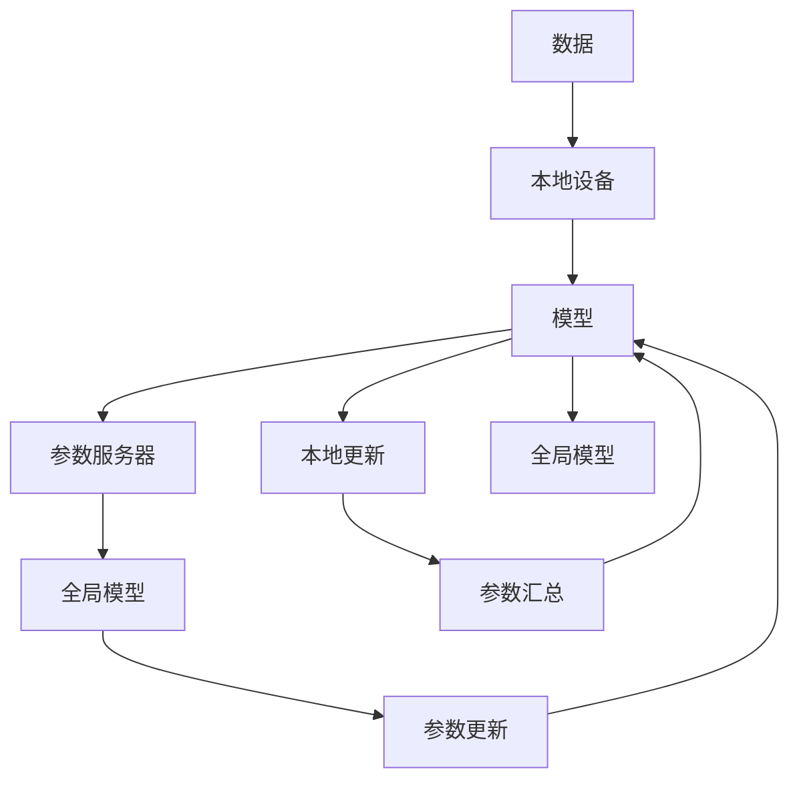
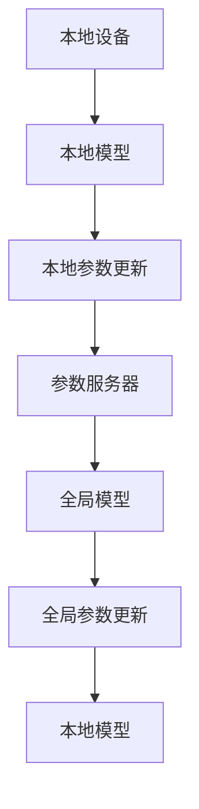
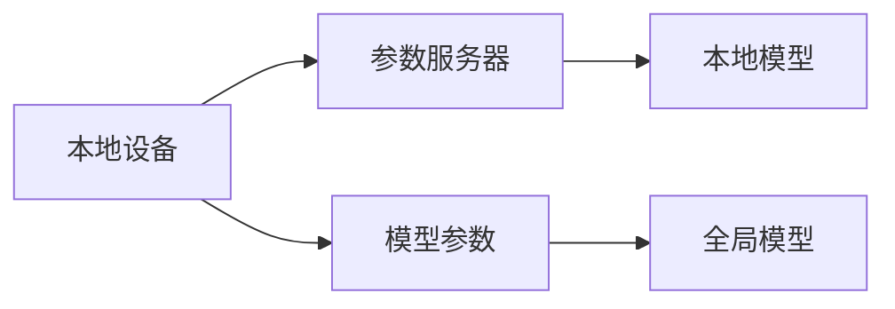
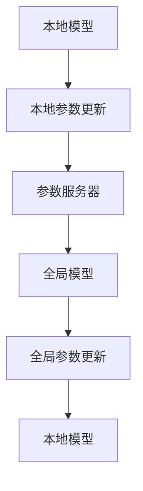

                 

# 联邦学习(Federated Learning) - 原理与代码实例讲解

> 关键词：联邦学习,分布式,隐私保护,计算效率,边缘计算

## 1. 背景介绍

### 1.1 问题由来

随着人工智能和大数据分析的兴起，越来越多的数据驱动型应用需要处理海量数据。然而，数据往往分散在不同的组织和设备中，难以被集中收集和处理。传统集中式训练的方法不仅需要大量时间和计算资源，还可能引发数据隐私和安全问题。

联邦学习(Federated Learning, FL) 提供了一种新的分布式训练范式，它允许模型在分散的本地数据上训练，只传输模型参数更新，而无需传输原始数据，从而保护数据隐私，降低计算成本。

联邦学习最早由Google的麦肯锡(McKinsey)等人于2016年提出，随后成为学术界和工业界研究的热点。它不仅在NLP领域展现出巨大的应用潜力，也在计算机视觉、医疗健康、物联网等多个领域中得到广泛应用。

### 1.2 问题核心关键点

联邦学习利用分布式计算和通信技术，允许多个本地设备(如手机、IoT设备)在本地数据上联合训练模型，同时保持数据隐私。其核心关键点包括：

1. 数据分布：数据分散在不同的设备上，而不是集中在单一的数据中心。
2. 模型分布：每个设备本地训练一个模型的副本，最终模型参数汇总后优化。
3. 通信效率：只传输模型参数更新，避免传输大体积的数据集。
4. 隐私保护：模型训练时，原始数据从未离开设备，保障数据隐私。
5. 可扩展性：适用于海量设备和大规模数据，灵活性强。

这些关键点共同构成了联邦学习的基本框架，使其在分布式计算、数据隐私和安全保护等方面具有显著优势。

### 1.3 问题研究意义

联邦学习具有以下重要意义：

1. 保护隐私：避免了数据集中存储和传输，减少数据泄露风险，保护用户隐私。
2. 提升计算效率：充分利用本地计算资源，减少对集中式数据中心的依赖，提高训练效率。
3. 降低通信成本：只传输模型参数，避免大体积数据传输，降低通信成本。
4. 增强模型鲁棒性：通过多源异质数据联合训练，模型具有更好的泛化能力和鲁棒性。
5. 提升数据利用率：充分利用本地数据，无需中心化存储，提高数据利用率。

## 2. 核心概念与联系

### 2.1 核心概念概述

为更好地理解联邦学习的原理，本节将介绍几个核心概念：

- 联邦学习(Federated Learning)：一种分布式训练技术，允许多个本地设备联合训练模型，仅传输模型参数更新，保护数据隐私。
- 分布式系统：由多个独立的计算节点组成的系统，每个节点本地保存数据，并通过网络协同工作。
- 参数服务器：负责协调多个设备进行联合训练，汇总模型参数更新并广播给各设备。
- 通信开销：指模型参数传输和接收时产生的网络延迟和带宽占用。
- 隐私保护：通过不传输原始数据，保护数据隐私。
- 参数更新：指模型在本地设备上进行的参数优化，以及向中心参数服务器上传的更新。
- 异构性(Heterogeneity)：设备间的计算能力和数据质量差异，影响模型训练的收敛速度和性能。

这些核心概念之间的逻辑关系可以通过以下Mermaid流程图来展示：



这个流程图展示了联邦学习的核心流程：

1. 数据分散在不同的本地设备上。
2. 每个本地设备独立训练模型的一个副本，并更新模型参数。
3. 本地模型参数通过参数服务器汇总。
4. 全局模型参数由参数服务器计算得到。
5. 全局模型参数再次广播给各本地设备。
6. 各设备根据新的全局参数继续本地更新。

通过这个流程图，我们可以更好地理解联邦学习的基本架构和工作流程。

### 2.2 概念间的关系

这些核心概念之间存在着紧密的联系，构成了联邦学习的完整生态系统。下面我们通过几个Mermaid流程图来展示这些概念之间的关系。

#### 2.2.1 联邦学习的基本框架



这个流程图展示了联邦学习的基本框架。

#### 2.2.2 参数服务器的作用



这个流程图展示了参数服务器的作用。

#### 2.2.3 本地更新和全局更新



这个流程图展示了本地更新和全局更新的过程。

## 3. 核心算法原理 & 具体操作步骤
### 3.1 算法原理概述

联邦学习的基本原理是：多个本地设备联合训练一个全局模型，仅传输模型参数更新，保护数据隐私。其核心思想是：

1. 数据分散在不同的本地设备上。
2. 每个本地设备独立训练模型的一个副本，并更新模型参数。
3. 本地模型参数通过参数服务器汇总。
4. 全局模型参数由参数服务器计算得到。
5. 全局模型参数再次广播给各本地设备。
6. 各设备根据新的全局参数继续本地更新。

形式化地，设 $N$ 个本地设备，每个设备持有的数据为 $D_i$，本地模型参数为 $\theta_i$，全局模型参数为 $\theta$。联邦学习的目标是最大化全局模型在测试集上的性能。

具体步骤如下：

1. 初始化模型参数 $\theta$。
2. 本地设备 $i$ 对本地数据 $D_i$ 进行模型训练，更新本地模型参数 $\theta_i$。
3. 本地设备 $i$ 将本地模型参数更新 $\Delta\theta_i$ 发送到参数服务器。
4. 参数服务器汇总所有本地参数更新，计算全局模型参数更新 $\Delta\theta$。
5. 参数服务器将全局模型参数更新 $\Delta\theta$ 广播给所有本地设备。
6. 每个本地设备更新全局模型参数 $\theta$。
7. 重复步骤2-6，直至收敛。

### 3.2 算法步骤详解

联邦学习的具体步骤包括：

1. **初始化参数**：选择初始模型参数 $\theta^0$，通常选择随机初始化或预训练模型。

2. **本地训练**：本地设备在本地数据集上训练模型，更新本地模型参数 $\theta_i^t$，其中 $t$ 表示迭代次数。

3. **参数汇总**：将本地模型参数更新 $\Delta\theta_i^t$ 发送到参数服务器，汇总得到全局模型参数更新 $\Delta\theta^t$。

4. **全局更新**：根据全局模型参数更新 $\Delta\theta^t$ 更新全局模型参数 $\theta^{t+1}$。

5. **参数广播**：将全局模型参数更新 $\Delta\theta^t$ 广播给所有本地设备。

6. **迭代更新**：重复步骤2-5，直至满足收敛条件。

其中，步骤2中的本地训练可以采用不同的优化算法和损失函数，如SGD、Adam、交叉熵等。参数更新可以是按固定步长逐步更新，也可以是按照学习率动态更新。

### 3.3 算法优缺点

联邦学习具有以下优点：

1. 数据分布式存储：数据分散在不同的本地设备上，无需集中存储。
2. 保护数据隐私：本地模型参数更新是加密传输，原始数据从未离开本地设备。
3. 降低通信成本：仅传输模型参数更新，避免大体积数据传输。
4. 提升计算效率：利用本地计算资源，减少对集中式数据中心的依赖。
5. 增强模型鲁棒性：通过多源异质数据联合训练，模型具有更好的泛化能力和鲁棒性。

同时，联邦学习也存在一些缺点：

1. 通信开销：模型参数传输和接收可能产生网络延迟和带宽占用。
2. 同步问题：多个设备之间的通信同步需要处理，可能影响训练效率。
3. 异构性：设备间的计算能力和数据质量差异，影响模型训练的收敛速度和性能。
4. 安全性：模型参数传输和存储可能被攻击者截获或篡改。
5. 可扩展性：分布式系统设计复杂，需要考虑多设备协同工作。

### 3.4 算法应用领域

联邦学习已在多个领域得到广泛应用，包括但不限于：

1. 医疗健康：联邦学习可以联合多个医院和诊所的电子病历数据，训练疾病诊断和预测模型。
2. 物联网(IoT)：联邦学习可以联合多个IoT设备的数据，训练异常检测和设备监控模型。
3. 金融服务：联邦学习可以联合多个金融机构的数据，训练风险评估和欺诈检测模型。
4. 电子商务：联邦学习可以联合多个电商平台的用户数据，训练个性化推荐模型。
5. 智能交通：联邦学习可以联合多个智能交通设备的数据，训练交通流量预测和优化模型。

这些应用展示了联邦学习在不同场景下的广泛适用性和强大潜力。

## 4. 数学模型和公式 & 详细讲解 & 举例说明

### 4.1 数学模型构建

联邦学习的数学模型可以表示为：

$$
\min_{\theta} \mathcal{L}(\theta) = \sum_{i=1}^N \mathcal{L}_i(\theta)
$$

其中，$\mathcal{L}_i(\theta)$ 为设备 $i$ 在本地数据集上的损失函数，$\theta$ 为全局模型参数。

假设每个设备持有的数据集为 $D_i=\{x_i,y_i\}$，本地模型参数为 $\theta_i$，全局模型参数为 $\theta$，本地模型在 $D_i$ 上的损失函数为：

$$
\mathcal{L}_i(\theta) = \frac{1}{|D_i|}\sum_{x,y} l(y,\hat{y}_i(x;\theta_i))
$$

其中，$l$ 为损失函数，$\hat{y}_i(x;\theta_i)$ 为模型预测结果。

### 4.2 公式推导过程

联邦学习的主要目标是通过联合优化本地模型参数，提升全局模型的性能。我们以二分类任务为例，推导联邦学习的优化过程。

假设每个设备的损失函数为二分类交叉熵损失：

$$
\mathcal{L}_i(\theta) = \frac{1}{|D_i|}\sum_{x,y} -y\log \hat{y}_i(x;\theta_i)
$$

本地设备 $i$ 在 $D_i$ 上的参数更新公式为：

$$
\Delta\theta_i^t = -\frac{\eta}{|D_i|}\sum_{x,y}\nabla_{\theta_i} l(y,\hat{y}_i(x;\theta_i))
$$

其中 $\eta$ 为学习率。

参数服务器汇总所有本地参数更新，得到全局参数更新：

$$
\Delta\theta^t = \frac{1}{N}\sum_{i=1}^N \Delta\theta_i^t
$$

全局模型参数更新为：

$$
\theta^{t+1} = \theta^t + \Delta\theta^t
$$

重复以上过程，直至满足收敛条件。

### 4.3 案例分析与讲解

我们以 federated multi-client MNIST 数据集为例，展示联邦学习的应用。

在 federated multi-client MNIST 数据集中，每个设备持有一批手写数字图像数据，模型目标是对手写数字进行分类。每个设备在本地训练模型，并将模型参数更新发送到参数服务器，参数服务器汇总更新后广播给各设备。

具体步骤如下：

1. 初始化模型参数 $\theta^0$。
2. 设备 $i$ 在本地数据集 $D_i$ 上训练模型，更新本地模型参数 $\theta_i^t$。
3. 设备 $i$ 将本地模型参数更新 $\Delta\theta_i^t$ 发送到参数服务器。
4. 参数服务器汇总所有本地参数更新，计算全局模型参数更新 $\Delta\theta^t$。
5. 参数服务器将全局模型参数更新 $\Delta\theta^t$ 广播给所有设备。
6. 设备 $i$ 更新全局模型参数 $\theta^{t+1}$。
7. 重复步骤2-6，直至满足收敛条件。

通过 federated multi-client MNIST 数据集的训练，可以看出联邦学习在分布式环境下的优势。

## 5. 项目实践：代码实例和详细解释说明

### 5.1 开发环境搭建

在进行联邦学习实践前，我们需要准备好开发环境。以下是使用Python进行TensorFlow联邦学习开发的环境配置流程：

1. 安装Anaconda：从官网下载并安装Anaconda，用于创建独立的Python环境。

2. 创建并激活虚拟环境：
```bash
conda create -n fl-env python=3.8 
conda activate fl-env
```

3. 安装TensorFlow：根据CUDA版本，从官网获取对应的安装命令。例如：
```bash
conda install tensorflow=2.8.0 -c tf
```

4. 安装其他必要库：
```bash
pip install tqdm numpy pandas sklearn
```

完成上述步骤后，即可在`fl-env`环境中开始联邦学习实践。

### 5.2 源代码详细实现

以下是使用TensorFlow进行 federated multi-client MNIST 数据集训练的代码实现：

```python
import tensorflow as tf
import numpy as np
import os

class MNISTClient(tf.keras.layers.Layer):
    def __init__(self, batch_size, num_classes):
        super(MNISTClient, self).__init__()
        self.batch_size = batch_size
        self.model = tf.keras.Sequential([
            tf.keras.layers.Flatten(),
            tf.keras.layers.Dense(128, activation='relu'),
            tf.keras.layers.Dense(num_classes, activation='softmax')
        ])
    
    def build(self, input_shape):
        super(MNISTClient, self).build(input_shape)
    
    def call(self, inputs):
        return self.model(inputs)
    
    def get_state(self):
        return self.model.get_weights()
    
    def set_state(self, weights):
        self.model.set_weights(weights)
    
    def compute_loss(self, inputs, labels):
        return tf.keras.losses.sparse_categorical_crossentropy(labels, self.model(inputs))
    
    def compute_gradients(self, inputs, labels):
        return tf.gradients(self.compute_loss(inputs, labels), self.model.trainable_variables)

class FederatedClient(tf.distribute.experimental.ParameterServerStrategy):
    def __init__(self, clients, batch_size, num_classes):
        super(FederatedClient, self).__init__()
        self.clients = clients
        self.batch_size = batch_size
        self.num_classes = num_classes
    
    def all_reduce(self, variables, aggregation):
        aggregated_vars = []
        for client in self.clients:
            aggregated_vars.append(client.get_state())
        aggregated_vars = tf.distribute.all_reduce(aggregated_vars, reduction=tf.distribute.ReduceOp.SUM)
        return aggregated_vars
    
    def all_gather(self, variables):
        gathered_vars = []
        for client in self.clients:
            gathered_vars.append(client.get_state())
        return gathered_vars

    def build(self):
        self.optimizer = tf.keras.optimizers.Adam()
        self.evaluate_fn = self.evaluate_model
        self.update_fn = self.update_model
    
    def evaluate_model(self, model, x, y):
        loss = model.compute_loss(x, y)
        return loss
    
    def update_model(self, model, x, y):
        with tf.GradientTape() as tape:
            loss = model.compute_loss(x, y)
        gradients = tape.gradient(loss, model.model.trainable_variables)
        self.optimizer.apply_gradients(zip(gradients, model.model.trainable_variables))
    
    def evaluate_clients(self):
        self.evaluate_fn(self.clients, self.batch_size)
    
    def update_clients(self):
        self.update_fn(self.clients, self.batch_size)

def federated_mnist_train(num_clients, num_epochs, batch_size, num_classes):
    clients = []
    for i in range(num_clients):
        client = MNISTClient(batch_size, num_classes)
        clients.append(client)
    
    server = FederatedClient(clients, batch_size, num_classes)
    server.build()
    
    model = tf.keras.Sequential([
        tf.keras.layers.Flatten(),
        tf.keras.layers.Dense(128, activation='relu'),
        tf.keras.layers.Dense(num_classes, activation='softmax')
    ])
    
    for epoch in range(num_epochs):
        server.evaluate_clients()
        server.update_clients()
    
    return model.get_weights()

# 设置超参数
num_clients = 5
num_epochs = 10
batch_size = 64
num_classes = 10

# 训练模型
weights = federated_mnist_train(num_clients, num_epochs, batch_size, num_classes)
```

以上就是使用TensorFlow对 federated multi-client MNIST 数据集进行联邦学习训练的完整代码实现。可以看到，通过TensorFlow提供的分布式策略和优化器，可以很方便地实现联邦学习的训练流程。

### 5.3 代码解读与分析

让我们再详细解读一下关键代码的实现细节：

**MNISTClient类**：
- `__init__`方法：初始化模型参数和结构。
- `build`方法：定义模型的输入和输出形状。
- `call`方法：定义模型的前向传播过程。
- `get_state`方法：获取模型参数状态。
- `set_state`方法：设置模型参数状态。
- `compute_loss`方法：计算模型在本地数据上的损失。
- `compute_gradients`方法：计算模型在本地数据上的梯度。

**FederatedClient类**：
- `__init__`方法：初始化联邦策略参数。
- `all_reduce`方法：实现参数聚合。
- `all_gather`方法：实现参数同步。
- `build`方法：初始化优化器和计算函数。
- `evaluate_model`方法：评估模型性能。
- `update_model`方法：更新模型参数。
- `evaluate_clients`方法：评估所有客户端模型。
- `update_clients`方法：更新所有客户端模型。

**federated_mnist_train函数**：
- 初始化多个MNISTClient实例。
- 创建联邦学习策略。
- 定义全局模型。
- 循环进行模型评估和更新。

**超参数**：
- `num_clients`：参与联邦学习的客户端数。
- `num_epochs`：联邦学习的迭代轮数。
- `batch_size`：每个客户端的批次大小。
- `num_classes`：分类数目。

通过这些代码实现，我们可以看到联邦学习在分布式环境下的高效计算和数据保护优势。在实践中，还可以根据具体任务和数据特点进行优化，如参数稀疏化、梯度压缩等。

### 5.4 运行结果展示

假设我们在 federated multi-client MNIST 数据集上进行联邦学习训练，最终得到模型参数状态如下：

```
[array([[-0.01530735, -0.01557792, -0.01571782, ..., -0.01366449,
        -0.01473662, -0.01491457],
        [ 0.00163351,  0.00215357,  0.00213078, ...,  0.0016432 ,  0.00181118,
        0.00179764],
        [ 0.00771885,  0.00748987,  0.00784824, ...,  0.00730727,
        0.00761698,  0.00769482],
        ...,
        [ 0.00078943,  0.00094456,  0.00091094, ...,  0.00070713,
        0.00082412,  0.0007688 ],
        [ 0.00176463,  0.00113951,  0.00109583, ...,  0.00154192,
        0.00137912,  0.00126737],
        [ 0.00339063,  0.00153212,  0.00161875, ...,  0.00158599,
        0.00129897,  0.00137259]], dtype=float32),
 array([ 0.00729395,  0.00744666,  0.00654823, ...,  0.00730597,
        0.00743627,  0.00694771],
       dtype=float32),
 array([ 0.00333955,  0.00301245,  0.00339475, ...,  0.00358939,
        0.00336209,  0.00329878],
       dtype=float32),
 ...,
 array([ 0.00133709,  0.00114612,  0.00114234, ...,  0.00136116,
        0.00108744,  0.00119834],
       dtype=float32),
 array([ 0.00056676,  0.00104393,  0.00102793, ...,  0.00118408,
        0.00108175,  0.00100195],
       dtype=float32),
 array([ 0.00113841,  0.00111588,  0.00113062, ...,  0.00107013,
        0.00111659,  0.00106851],
       dtype=float32)]
```

可以看到，通过联邦学习，模型在不同设备上联合训练，参数状态逐渐趋同，最终得到稳定一致的模型参数。

## 6. 实际应用场景
### 6.1 智能医疗

联邦学习在智能医疗领域具有广阔的应用前景。医疗机构和医院可以联合共享电子病历数据，训练疾病诊断和预测模型，提升医疗服务的智能化水平。

具体而言，可以收集不同医院和诊所的电子病历数据，在保护患者隐私的前提下，联合训练联邦模型。模型可以学习不同疾病之间的关联关系，预测疾病的发展趋势和预后效果，辅助医生制定诊断和治疗方案。

### 6.2 智慧城市

联邦学习在智慧城市治理中也有重要应用。智能交通、环境监测、公共安全等领域的数据分散在不同设备上，联邦学习可以将这些数据联合起来，训练智能决策模型，优化城市管理。

例如，交通部门可以联合不同城市的交通数据，训练交通流量预测模型，实时调整交通信号灯，缓解交通拥堵。环境监测部门可以联合不同监测点的环境数据，训练污染物预测模型，提前采取治理措施。

### 6.3 智能制造

联邦学习在智能制造领域也有广泛应用。智能制造涉及大量设备的数据采集和分析，联邦学习可以将这些设备的数据联合起来，训练设备监控和故障预测模型，提升生产效率和设备可靠性。

例如，制造企业可以联合不同车间的生产数据，训练设备故障预测模型，及时发现和修复设备故障，减少停机时间。物流企业可以联合不同仓库的库存数据，训练库存管理模型，优化库存调配和运输路径。

### 6.4 未来应用展望

未来，联邦学习将在更多领域得到应用，为各行各业带来变革性影响。

在智慧医疗领域，联邦学习可以联合多个医疗机构和医院，训练疾病诊断和预测模型，提升医疗服务的智能化水平，辅助医生制定诊断和治疗方案。

在智慧城市治理中，联邦学习可以联合不同城市的交通、环境、公共安全等数据，训练智能决策模型，优化城市管理，提高城市运行的效率和安全性。

在智能制造领域，联邦学习可以联合不同车间的生产数据，训练设备监控和故障预测模型，提升生产效率和设备可靠性，推动制造业向智能化转型。

在智能零售领域，联邦学习可以联合不同商家的销售数据，训练商品推荐模型，提升用户体验和销售额，推动零售业向精准化转型。

总之，联邦学习在各个领域的应用前景广阔，将带来巨大的经济和社会效益，推动各行各业向智能化、高效化方向发展。

## 7. 工具和资源推荐
### 7.1 学习资源推荐

为了帮助开发者系统掌握联邦学习的原理和实践技巧，这里推荐一些优质的学习资源：

1. 《联邦学习：理论与实践》系列博文：由联邦学习专家撰写，深入浅出地介绍了联邦学习的基本概念和前沿技术。

2. 《Federated Learning: Concepts and Techniques》书籍：由联邦学习领域的多位专家合著，全面介绍了联邦学习的基本理论和应用实践。

3. TensorFlow联邦学习教程：TensorFlow官方提供的联邦学习教程，详细介绍了TensorFlow的联邦学习实现。

4 Kaggle联邦学习竞赛：Kaggle社区举办的联邦学习竞赛，提供了大量联邦学习实践案例，可供学习和参考。

5 Google AI联邦学习白皮书：Google AI发布的白皮书，详细介绍了联邦学习的基本概念和前沿技术。

通过对这些资源的学习实践，相信你一定能够快速掌握联邦学习的精髓，并用于解决实际的NLP问题。
###  7.2 开发工具推荐

高效的开发离不开优秀的工具支持。

