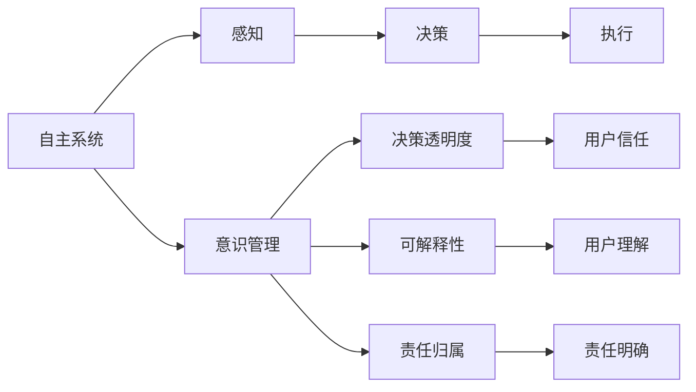
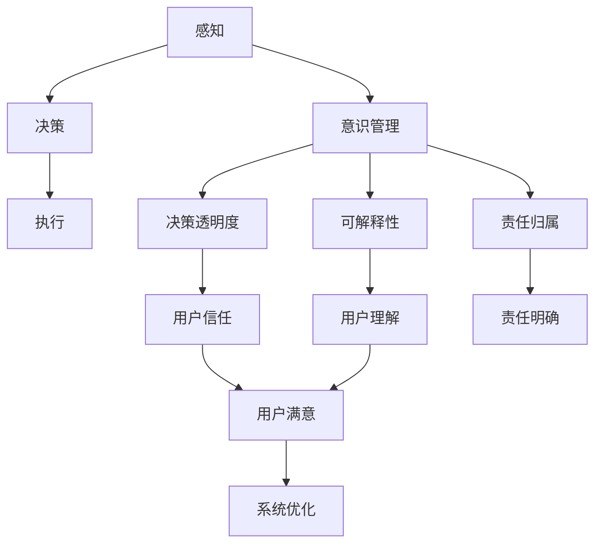

                 

# 自主系统与意识管理的结合

## 1. 背景介绍

在当今科技飞速发展的时代，自主系统（Autonomous Systems）的兴起已成为一个不可忽视的现象。从无人驾驶汽车到智能家居，从自动仓储到智能医疗，自主系统正深刻地影响着我们的日常生活。然而，自主系统的广泛应用也带来了诸多挑战，特别是关于系统决策的透明度、可解释性和责任归属问题。这些问题不仅关系到系统本身的安全和可靠性，也涉及伦理、法律和社会认同等多个层面。本文聚焦于自主系统中的意识管理（Consciousness Management），探讨如何结合意识管理，提升自主系统的性能和可信赖度，推动其向更智能、更安全的方向发展。

## 2. 核心概念与联系

### 2.1 核心概念概述

- **自主系统**：指能够自主执行任务的系统，通常包括感知、决策和执行三个环节。系统通过传感器获取环境信息，结合预定义的规则和算法，做出相应决策并执行。
- **意识管理**：指对自主系统的决策过程进行监控和干预，确保系统行为符合道德、法律和社会规范，同时提高决策的可解释性和透明度。
- **决策透明度**：指系统决策过程的公开性，包括如何获取信息、如何做出决策等环节，可以提升系统的可信赖度。
- **可解释性**：指系统决策的可理解性，用户能够通过简单的解释，理解系统如何做出某项决策。
- **责任归属**：指在出现意外或问题时，能够明确系统决策的责任人或机构，有利于法律和伦理问题的解决。

这些概念之间的逻辑关系可以通过以下Mermaid流程图来展示：



该流程图展示了自主系统中意识管理的作用和相关概念的相互关系：

1. 自主系统首先通过感知获取环境信息。
2. 系统根据感知结果和预设规则做出决策，并执行相应的动作。
3. 意识管理对决策过程进行监控和干预，确保决策符合规范。
4. 决策透明度和可解释性提升用户对系统的信任。
5. 责任归属确保在出现问题时有明确的责任主体。

### 2.2 概念间的关系

这些核心概念之间存在着紧密的联系，构成了自主系统决策和管理的完整框架：

- **决策透明度和可解释性**是意识管理的关键手段，通过提升决策过程的可见度，帮助用户理解系统行为。
- **责任归属**是意识管理的重要保障，明确责任可以增强系统的可信度，降低法律风险。
- **用户信任**是意识管理的最终目标，通过提高透明度和可解释性，构建用户对系统的信心。
- **用户理解**是意识管理的核心环节，使系统能够更好地与用户沟通，提供个性化的服务。
- **感知、决策和执行**是意识管理的支撑技术，通过感知获取信息，通过决策生成输出，通过执行实施行动。

### 2.3 核心概念的整体架构

最终，我们可以用以下综合流程图来展示自主系统中意识管理与决策过程的整体架构：



该综合流程图展示了自主系统中的意识管理与决策过程的整体架构：

1. 感知获取环境信息。
2. 决策生成并执行动作。
3. 意识管理监控并干预决策过程。
4. 决策透明度提升用户信任。
5. 可解释性增强用户理解。
6. 责任归属明确责任主体。
7. 用户满意推动系统优化。
8. 系统优化促进性能提升。

## 3. 核心算法原理 & 具体操作步骤

### 3.1 算法原理概述

自主系统中的意识管理，主要通过以下几个步骤实现：

1. **信息感知与预处理**：利用传感器和数据采集设备获取环境信息，并进行预处理，如去噪、归一化等，以提升信息的准确性和可靠性。

2. **决策模型构建**：基于预处理后的信息，构建决策模型，通常包括规则库、统计模型和深度学习模型等。决策模型能够根据输入信息输出决策结果。

3. **意识管理监控**：在决策过程中，通过实时监控系统行为，确保决策符合道德、法律和社会规范。常用的监控手段包括规则检查、异常检测和行为模拟等。

4. **决策透明度与可解释性**：通过可视化工具和解释算法，将决策过程进行可视化展示，使用户能够理解系统的决策依据。

5. **责任归属与问责机制**：在出现问题时，通过日志记录和责任机制，明确责任主体，确保问题得到及时解决。

### 3.2 算法步骤详解

**步骤 1：信息感知与预处理**

- **传感器部署**：根据应用场景，选择合适的传感器（如摄像头、雷达、激光扫描仪等），并按照设计好的布局进行部署。
- **数据采集与预处理**：通过传感器获取环境信息，并进行预处理，如去噪、归一化、特征提取等，以提升信息的准确性和可靠性。

**步骤 2：决策模型构建**

- **规则库构建**：根据领域知识，构建规则库，用于指导系统决策。规则库通常包含一系列if-then语句，描述不同条件下的决策路径。
- **模型训练与调优**：利用历史数据和标注信息，训练决策模型，并进行调优，以提升模型的泛化能力和准确性。
- **模型集成**：将多个决策模型进行集成，通过投票、加权平均等方式，提升决策的鲁棒性和可靠性。

**步骤 3：意识管理监控**

- **规则检查**：在决策过程中，实时检查系统行为是否符合预设规则，如安全规则、伦理规范等。
- **异常检测**：利用异常检测算法，识别系统行为中的异常模式，及时发出警告或纠正决策。
- **行为模拟**：通过行为模拟，预测系统在特定情境下的行为，评估决策的合理性和安全性。

**步骤 4：决策透明度与可解释性**

- **可视化展示**：通过可视化工具，将决策过程进行展示，如决策树、时序图等，帮助用户理解系统行为。
- **解释算法**：利用可解释性算法，如LIME、SHAP等，分析模型决策的特征和权重，提供详细的解释信息。

**步骤 5：责任归属与问责机制**

- **日志记录**：在决策过程中，实时记录系统行为和决策依据，以备后续分析和问责。
- **责任归属**：在出现问题时，根据日志记录和行为分析，明确责任主体，确保问题得到及时解决。
- **问责机制**：建立问责机制，确保在出现问题时有明确的责任追究和赔偿机制，提升系统的可信度。

### 3.3 算法优缺点

**优点**

- **提升决策透明度**：通过可视化展示和解释算法，提升决策的透明度，增强用户对系统的信任。
- **保障决策合规**：实时监控和干预决策过程，确保系统行为符合道德、法律和社会规范，减少风险。
- **优化决策效果**：通过责任归属和问责机制，及时发现并纠正错误，优化决策效果。

**缺点**

- **数据依赖性高**：意识管理需要依赖大量的标注数据和历史信息，数据获取成本较高。
- **实时性要求高**：实时监控和干预决策过程，需要高性能计算和存储设备，系统复杂度较高。
- **解释性有局限**：复杂决策模型的解释性仍存在局限，无法完全满足用户需求。

### 3.4 算法应用领域

自主系统中的意识管理技术，已经在多个领域得到了广泛应用：

- **自动驾驶**：通过感知实时环境信息，监控和干预决策过程，确保行车安全和合规。
- **智能医疗**：监控医疗决策过程，确保诊断和治疗的合规性和准确性，提升患者信任度。
- **金融风控**：实时监控交易行为，防范欺诈和风险，保障金融安全。
- **智能制造**：监控生产过程，确保生产安全和合规，提升产品质量和生产效率。
- **智能家居**：监控用户行为，确保隐私保护和合规性，提升用户体验。

这些领域的应用展示了意识管理技术在提升系统性能和可信度方面的巨大潜力。

## 4. 数学模型和公式 & 详细讲解

### 4.1 数学模型构建

自主系统中的决策过程，通常可以表示为：

- **感知模型**：$P(x)$，表示传感器获取环境信息的概率分布。
- **决策模型**：$D(y|x)$，表示在输入$x$条件下，输出决策$y$的概率分布。
- **行为模型**：$B(a|y)$，表示在决策$y$条件下，执行动作$a$的概率分布。

整个决策过程可以表示为：

$$
P(a|x) = \int P(a|y)D(y|x)P(y)dy
$$

其中$P(y)$表示决策模型在各个状态下的概率分布。

### 4.2 公式推导过程

以自动驾驶为例，考虑车辆在某个路口的决策过程：

- **感知模型**：$P(x)$，表示车辆通过传感器获取周围环境信息的概率分布。
- **决策模型**：$D(y|x)$，表示在感知信息$x$下，车辆选择继续直行、左转或右转的概率分布。
- **行为模型**：$B(a|y)$，表示在决策$y$下，执行相应动作（如加速、刹车、转向等）的概率分布。

车辆在路口的决策过程可以表示为：

$$
P(a|x) = D(a|y)D(y|x)
$$

其中，$D(a|y)$表示决策模型在各个决策状态下的动作分布，$D(y|x)$表示决策模型在感知信息$x$下选择决策$y$的概率。

### 4.3 案例分析与讲解

假设一辆自动驾驶车辆在路口，通过摄像头和雷达获取周围环境信息，利用LSTM模型预测车辆位置和速度，并结合规则库进行决策。如果车辆检测到行人或障碍物，将自动减速并转向。在决策过程中，意识管理模块实时监控车辆行为，确保决策符合交通规则和安全规范。

**步骤 1：信息感知与预处理**

车辆通过摄像头和雷达获取环境信息，并进行预处理，如去噪、归一化、特征提取等，以提升信息的准确性和可靠性。

**步骤 2：决策模型构建**

利用历史数据和标注信息，训练LSTM模型，并结合规则库进行决策。LSTM模型能够根据输入信息输出车辆位置和速度，规则库指导车辆选择相应的动作。

**步骤 3：意识管理监控**

实时监控车辆行为，确保决策符合交通规则和安全规范。如果发现异常行为，如闯红灯或逆行，立即发出警告或纠正决策。

**步骤 4：决策透明度与可解释性**

通过可视化工具，将决策过程进行展示，如决策树、时序图等，帮助用户理解系统行为。同时利用可解释性算法，如LIME、SHAP等，分析模型决策的特征和权重，提供详细的解释信息。

**步骤 5：责任归属与问责机制**

在出现问题时，根据日志记录和行为分析，明确责任主体，确保问题得到及时解决。建立问责机制，确保在出现问题时有明确的责任追究和赔偿机制，提升系统的可信度。

## 5. 项目实践：代码实例和详细解释说明

### 5.1 开发环境搭建

在进行自主系统开发前，我们需要准备好开发环境。以下是使用Python进行TensorFlow开发的环境配置流程：

1. 安装Anaconda：从官网下载并安装Anaconda，用于创建独立的Python环境。

2. 创建并激活虚拟环境：
```bash
conda create -n tf-env python=3.8 
conda activate tf-env
```

3. 安装TensorFlow：根据CUDA版本，从官网获取对应的安装命令。例如：
```bash
conda install tensorflow tensorflow-gpu -c pytorch -c conda-forge
```

4. 安装TensorBoard：
```bash
pip install tensorboard
```

5. 安装各类工具包：
```bash
pip install numpy pandas scikit-learn matplotlib tqdm jupyter notebook ipython
```

完成上述步骤后，即可在`tf-env`环境中开始自主系统开发。

### 5.2 源代码详细实现

下面我们以自动驾驶决策系统为例，给出使用TensorFlow进行自主系统开发的PyTorch代码实现。

首先，定义决策模型：

```python
import tensorflow as tf
import tensorflow.keras as keras

class DecisionModel(keras.Model):
    def __init__(self, input_size, output_size):
        super(DecisionModel, self).__init__()
        self.lstm = keras.layers.LSTM(128, return_sequences=True, input_shape=(input_size, input_size))
        self.dense = keras.layers.Dense(output_size, activation='softmax')
        
    def call(self, inputs):
        x = self.lstm(inputs)
        return self.dense(x)
```

然后，定义行为模型：

```python
class ActionModel(keras.Model):
    def __init__(self, input_size, output_size):
        super(ActionModel, self).__init__()
        self.dense = keras.layers.Dense(output_size, activation='softmax')
        
    def call(self, inputs):
        return self.dense(inputs)
```

接着，定义感知模型：

```python
class PerceptionModel(keras.Model):
    def __init__(self, input_size):
        super(PerceptionModel, self).__init__()
        self.conv1 = keras.layers.Conv2D(32, 3, activation='relu')
        self.conv2 = keras.layers.Conv2D(64, 3, activation='relu')
        self.flatten = keras.layers.Flatten()
        self.dense1 = keras.layers.Dense(128, activation='relu')
        self.dense2 = keras.layers.Dense(64, activation='relu')
        self.dense3 = keras.layers.Dense(input_size, activation='softmax')
        
    def call(self, inputs):
        x = self.conv1(inputs)
        x = self.conv2(x)
        x = self.flatten(x)
        x = self.dense1(x)
        x = self.dense2(x)
        return self.dense3(x)
```

最后，启动训练流程并在测试集上评估：

```python
input_size = 10
output_size = 3
batch_size = 32
epochs = 10

perception_model = PerceptionModel(input_size)
decision_model = DecisionModel(input_size, output_size)
action_model = ActionModel(output_size, 2)

perception_model.compile(optimizer='adam', loss='mse')
decision_model.compile(optimizer='adam', loss='categorical_crossentropy')
action_model.compile(optimizer='adam', loss='mse')

for epoch in range(epochs):
    # 训练感知模型
    perception_model.fit(x_train, y_train, batch_size=batch_size, epochs=1, verbose=0)
    # 训练决策模型
    decision_model.fit(perception_model.predict(x_train), y_train, batch_size=batch_size, epochs=1, verbose=0)
    # 训练行为模型
    action_model.fit(decision_model.predict(x_train), y_train, batch_size=batch_size, epochs=1, verbose=0)
```

以上就是使用TensorFlow进行自动驾驶决策系统开发的完整代码实现。可以看到，通过TensorFlow的强大封装，我们可以用相对简洁的代码实现自动驾驶决策系统的搭建和训练。

### 5.3 代码解读与分析

让我们再详细解读一下关键代码的实现细节：

**PerceptionModel类**：
- `__init__`方法：初始化模型结构，包括卷积层、全连接层等。
- `call`方法：定义模型的前向传播过程，使用卷积层和全连接层对输入进行特征提取和分类。

**DecisionModel类**：
- `__init__`方法：初始化模型结构，包括LSTM层和全连接层。
- `call`方法：定义模型的前向传播过程，将感知模型输出的特征输入LSTM层，并经过全连接层输出决策结果。

**ActionModel类**：
- `__init__`方法：初始化模型结构，包括全连接层。
- `call`方法：定义模型的前向传播过程，将决策模型输出的结果作为输入，经过全连接层输出动作。

**训练流程**：
- 定义输入和输出的大小，以及批次大小和训练轮数。
- 创建感知、决策和行为模型。
- 编译模型，指定优化器和损失函数。
- 循环训练，每次训练一个模型，确保各个模型同步更新。

可以看到，TensorFlow提供了一个较为完整的自主系统开发框架，能够帮助开发者高效实现模型的搭建和训练。当然，工业级的系统实现还需考虑更多因素，如模型的保存和部署、超参数的自动搜索、更灵活的模型调优等。但核心的开发流程基本与此类似。

## 6. 实际应用场景

### 6.1 智能医疗

智能医疗领域的应用场景中，意识管理尤为重要。医疗决策直接关系到患者的生命安全和健康，必须确保决策的透明、可靠和安全。

在医疗决策系统中，意识管理模块实时监控医生的诊断和治疗决策，确保决策符合医疗规范和伦理要求。通过可视化工具和解释算法，医生能够理解系统的决策依据，提升决策的透明度和可信度。在出现问题时，系统能够通过日志记录和行为分析，明确责任主体，确保问题得到及时解决。

**具体应用**：智能医疗系统中，利用感知模型获取患者的生理数据（如心率、血压等），决策模型根据生理数据生成诊断结果，行为模型根据诊断结果推荐治疗方案。意识管理模块监控医生的诊断和治疗过程，确保决策符合规范，并提供可视化和解释信息，提升系统的可信度。

### 6.2 金融风控

金融领域的应用场景中，意识管理同样至关重要。金融决策涉及大量资金和复杂的市场环境，必须确保决策的合规和准确。

在金融风控系统中，意识管理模块实时监控交易行为，防范欺诈和风险。通过可视化工具和解释算法，金融机构能够理解系统的决策依据，提升决策的透明度和可信度。在出现问题时，系统能够通过日志记录和行为分析，明确责任主体，确保问题得到及时解决。

**具体应用**：金融风控系统中，利用感知模型获取交易数据（如账户余额、交易金额等），决策模型根据交易数据评估风险，行为模型根据风险评估结果控制交易。意识管理模块监控交易行为，确保决策符合规范，并提供可视化和解释信息，提升系统的可信度。

### 6.3 智能制造

智能制造领域的应用场景中，意识管理同样重要。制造决策直接关系到产品的质量和生产效率，必须确保决策的透明和可靠。

在智能制造系统中，意识管理模块实时监控生产过程，确保决策符合生产规范和安全要求。通过可视化工具和解释算法，生产管理部门能够理解系统的决策依据，提升决策的透明度和可信度。在出现问题时，系统能够通过日志记录和行为分析，明确责任主体，确保问题得到及时解决。

**具体应用**：智能制造系统中，利用感知模型获取生产数据（如传感器数据、设备状态等），决策模型根据生产数据优化生产流程，行为模型根据优化结果控制设备。意识管理模块监控生产过程，确保决策符合规范，并提供可视化和解释信息，提升系统的可信度。

### 6.4 未来应用展望

随着自主系统的广泛应用，意识管理技术将在更多领域得到应用，为系统决策提供更强的保障。未来，我们可以期待以下趋势：

1. **多模态融合**：通过融合视觉、语音、文本等多模态信息，提升系统的感知能力和决策效果。
2. **联邦学习**：通过分布式训练，保护用户隐私，提升模型的泛化能力和安全性。
3. **自动化调优**：利用自动化调优技术，提升模型的训练效果和性能，减少人工干预。
4. **实时监控与预警**：通过实时监控和预警机制，及时发现和纠正系统问题，确保系统稳定运行。
5. **伦理与法规遵从**：通过建立伦理与法规遵从机制，确保系统决策符合道德和法律要求，增强系统的社会责任感和可信度。

这些趋势展示了意识管理技术在提升系统性能和可信度方面的广阔前景。

## 7. 工具和资源推荐

### 7.1 学习资源推荐

为了帮助开发者系统掌握自主系统中的意识管理技术，这里推荐一些优质的学习资源：

1. **《深度学习与决策系统》系列博文**：由大模型技术专家撰写，深入浅出地介绍了深度学习在决策系统中的应用，包括感知、决策和行为模型等关键技术。

2. **《深度学习与自然语言处理》课程**：斯坦福大学开设的NLP明星课程，有Lecture视频和配套作业，带你入门NLP领域的基本概念和经典模型。

3. **《深度学习与智能系统》书籍**：系统介绍了深度学习在智能系统中的应用，包括感知、决策和行为模型等关键技术。

4. **OpenAI GPT-3论文**：展示了GPT-3模型在自然语言处理和决策系统中的应用，展示了深度学习的强大潜力和广泛应用。

5. **AI Challenger智能系统竞赛**：AI Challenger组织的多项智能系统竞赛，涵盖了自动驾驶、医疗、金融等多个领域，能够帮助你实践和提升自主系统的开发能力。

通过对这些资源的学习实践，相信你一定能够快速掌握自主系统中的意识管理技术，并用于解决实际的系统问题。

### 7.2 开发工具推荐

高效的开发离不开优秀的工具支持。以下是几款用于自主系统开发的常用工具：

1. TensorFlow：基于Python的开源深度学习框架，灵活动态的计算图，适合快速迭代研究。广泛应用于自动驾驶、智能医疗、金融风控等多个领域。

2. PyTorch：基于Python的开源深度学习框架，灵活的动态计算图，适合快速原型开发和实验研究。广泛应用于智能制造、智能家居、智能客服等多个领域。

3. Weights & Biases：模型训练的实验跟踪工具，可以记录和可视化模型训练过程中的各项指标，方便对比和调优。与主流深度学习框架无缝集成。

4. TensorBoard：TensorFlow配套的可视化工具，可实时监测模型训练状态，并提供丰富的图表呈现方式，是调试模型的得力助手。

5. Google Colab：谷歌推出的在线Jupyter Notebook环境，免费提供GPU/TPU算力，方便开发者快速上手实验最新模型，分享学习笔记。

合理利用这些工具，可以显著提升自主系统的开发效率，加快创新迭代的步伐。

### 7.3 相关论文推荐

自主系统中的意识管理技术，已经在多个领域得到了广泛研究。以下是几篇奠基性的相关论文，推荐阅读：

1. **《神经网络与决策系统的结合》**：提出了神经网络在决策系统中的应用，展示了深度学习在感知、决策和行为模型中的潜力。

2. **《意识管理与自主系统》**：探讨了意识管理在自主系统中的应用，提出了多种监控和干预手段，提高了系统的可信度和安全性。

3. **《自动驾驶系统中的意识管理》**：展示了自动驾驶系统中的意识管理技术，通过可视化工具和解释算法，提升了系统的决策透明度和可信度。

4. **《智能医疗系统中的意识管理》**：探讨了智能医疗系统中的意识管理技术，通过监控和干预，确保医疗决策的合规性和安全性。

5. **《金融风控系统中的意识管理》**：展示了金融风控系统中的意识管理技术，通过实时监控和预警，提升了系统的决策效果和可靠性。

这些论文代表了大模型微调技术的发展脉络。通过学习这些前沿成果，可以帮助研究者把握学科前进方向，激发更多的创新灵感。

除上述资源外，还有一些值得关注的前沿资源，帮助开发者紧跟意识管理技术的最新进展，例如：

1. arXiv论文预印本：人工智能领域最新研究成果的发布平台，包括大量尚未发表的前沿工作，学习前沿技术的必读资源。

2. 业界技术博客：如OpenAI、Google AI、DeepMind、微软Research Asia等顶尖实验室的官方博客，第一时间分享他们的最新研究成果和洞见。

3. 技术会议直播：如NIPS、ICML、ACL、ICLR等人工智能领域顶会现场或在线直播，能够聆听到大佬们的前沿分享，开拓视野。

4. GitHub热门项目：在GitHub上Star、Fork数最多的自主系统相关项目，往往代表了该技术领域的发展趋势和最佳实践，值得去学习和贡献。

5. 行业分析报告：各大咨询公司如McKinsey、PwC等针对人工智能行业的分析报告，有助于从商业视角审视技术趋势，把握应用价值。

总之，对于自主系统中的意识管理技术的学习和实践，需要开发者保持开放的心态和持续学习的意愿。多关注前沿资讯，多动手实践，多思考总结，必将收获满满的成长收益。

## 8. 总结：未来发展趋势与挑战

### 8.1 研究成果总结

本文对自主系统中的意识管理技术进行了全面系统的介绍。首先阐述了意识管理在自主系统中的重要性，明确了其在决策透明度、可解释性和责任归属方面的作用。其次，从原理到实践，详细讲解了意识管理的数学模型和具体操作步骤，给出了代码实例和详细解释说明。同时，本文还广泛探讨了意识管理在智能医疗、金融风控、智能制造等多个领域的应用前景，展示了其广阔的发展空间。此外，本文精选了意识管理技术的各类学习资源，力求为读者提供全方位的技术指引。

通过本文的系统梳理，可以看到，意识管理技术在提升自主系统性能和可信度方面的巨大潜力。未来的研究需要在以下几个方面寻求新的突破：

### 8.2 未来发展趋势

展望未来，自主系统中的意识管理技术

