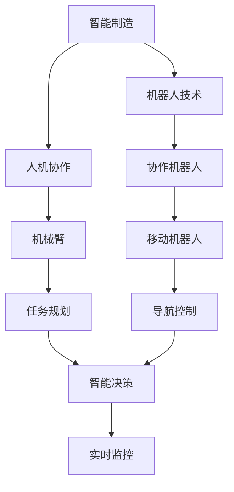
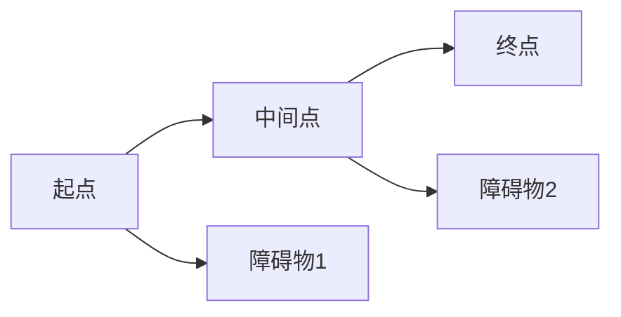

                 

# 自动化领域的最新发展趋势

## 1. 背景介绍

自动化技术作为现代工业发展的重要支柱，自工业革命以来已取得了长足进步。从简单的机械臂操作到复杂的智能制造系统，自动化在提高生产效率、降低成本、提升产品质量等方面发挥了重要作用。近年来，随着信息技术的发展，自动化领域涌现出许多前沿技术和应用，进一步推动了产业升级和经济转型。本文将对自动化领域最新的发展趋势进行全面分析，重点介绍智能制造、人机协作、机器人技术等方面的进展，并展望未来自动化技术的发展方向。

## 2. 核心概念与联系

自动化技术涉及多个领域，包括机械设计、电子工程、计算机科学等。其核心概念包括：

- **智能制造**：利用先进的制造技术和信息技术，实现生产过程的智能化、自动化，提高生产效率和产品质量。
- **人机协作**：通过机器人、自动化设备与人类操作者的协同工作，提高生产灵活性和效率。
- **机器人技术**：包括机械臂、移动机器人、协作机器人等，能够执行复杂任务，替代或辅助人类工作。

这些概念之间的联系可以通过以下Mermaid流程图来展示：

这个流程图展示了自动化领域的关键概念及其之间的关系：

1. **智能制造**：是自动化技术的基础，涵盖了从设计到生产的各个环节，强调智能设备和信息系统的应用。
2. **机器人技术**：是实现人机协作的重要手段，不同类型的机器人执行不同的任务。
3. **人机协作**：通过机器人与操作者的协同工作，提高生产效率和灵活性。
4. **协作机器人**：专门设计用于与人类操作者合作，提高工作安全性和生产效率。
5. **机械臂**：一种常见的机器人，能够执行高精度的装配和搬运任务。
6. **移动机器人**：能够在不同工作区域内移动，执行物料搬运和物流管理任务。
7. **任务规划**：机器人根据任务要求进行路径规划和动作调度。
8. **导航控制**：确保机器人能够准确地导航到指定位置。
9. **智能决策**：机器人根据环境变化做出最优决策。
10. **实时监控**：对机器人运行状态进行监控，确保生产稳定。

通过这个流程图，我们能够更好地理解自动化领域各个概念之间的内在联系，为深入探讨其最新发展趋势提供依据。

## 3. 核心算法原理 & 具体操作步骤

### 3.1 算法原理概述

自动化技术的算法原理主要涉及以下几个方面：

- **机器人路径规划**：通过算法计算机器人从起点到终点的最优路径，避免碰撞和障碍。
- **任务调度优化**：在多个任务间进行资源分配和优先级排序，确保任务按时完成。
- **智能决策与控制**：利用机器学习、深度学习等技术，实现机器人对复杂环境的适应和决策。
- **实时监控与反馈**：通过传感器和控制系统，实时监控机器人状态，并提供反馈信号。

### 3.2 算法步骤详解

以智能制造中的机器人路径规划为例，常见的算法步骤包括：

1. **环境建模**：建立工作环境的数学模型，包括障碍物、目标位置等。
2. **路径规划**：使用A*、RRT等算法计算从起点到终点的最优路径。
3. **动态避障**：在路径规划过程中，实时检测环境变化，调整路径以避开障碍。
4. **路径执行**：控制机器人沿着规划好的路径移动，并在关键节点执行相关动作。
5. **效果评估**：评估路径规划的效果，根据反馈信号调整算法参数。

### 3.3 算法优缺点

- **优点**：
  - 提高生产效率，降低生产成本。
  - 提高产品质量和一致性。
  - 减少工人劳动强度，改善工作环境。

- **缺点**：
  - 初期投资较高，对技术和设备要求较高。
  - 维护和升级成本较高，需要专业技术人员。
  - 对环境的适应性有待提升，对复杂任务处理能力有限。

### 3.4 算法应用领域

自动化技术在多个领域都有广泛应用，包括：

- **制造业**：自动化生产线、智能仓储系统、质量检测等。
- **物流行业**：智能分拣机器人、无人驾驶车辆、自动化仓库管理系统等。
- **农业**：自动驾驶拖拉机、精准农业系统等。
- **服务业**：自动化客服、无人零售、物流配送等。

## 4. 数学模型和公式 & 详细讲解 & 举例说明

### 4.1 数学模型构建

在自动化领域，数学模型是理解和分析自动化系统的关键工具。以机器人路径规划为例，我们可以建立一个简单的数学模型来描述问题：

假设机器人工作环境为一网格图，每个格子代表一个位置，障碍物用白色表示，可行路径用黑色表示。目标是找到一条从起点S到终点E的最短路径。

数学模型可以用如下的图形表示：

其中，起点A和终点E是固定的，障碍物D和E是动态的。

### 4.2 公式推导过程

以A*算法为例，其核心思想是通过搜索每条路径的成本来找到最短路径。A*算法的公式如下：

$$
f(n) = g(n) + h(n)
$$

其中，$g(n)$ 是机器人从起点到当前位置的实际代价，$h(n)$ 是从当前位置到终点的估计代价。

推导过程如下：

1. 从起点开始，计算到每个位置$n$的$g(n)$和$h(n)$。
2. 对于每个位置$n$，计算$f(n)$的值。
3. 选择$f(n)$最小的位置作为下一个探索点。
4. 重复步骤1-3，直到到达终点。

### 4.3 案例分析与讲解

假设机器人从起点A到终点E，遇到两个障碍物D和E。使用A*算法，我们计算每个位置的$f(n)$值：

- $f(A) = g(A) + h(A) = 0 + 1 = 1$
- $f(B) = g(B) + h(B) = 1 + 1 = 2$
- $f(C) = g(C) + h(C) = 2 + 0 = 2$
- $f(D) = g(D) + h(D) = 1 + 2 = 3$
- $f(E) = g(E) + h(E) = 2 + 1 = 3$

由于$f(B) = f(C)$，我们可以选择B或C作为下一个探索点。假设我们选择B，继续计算$f(B)$的邻居节点：

- $f(D') = g(D') + h(D') = 1 + 2 = 3$
- $f(E') = g(E') + h(E') = 2 + 1 = 3$

由于$f(D') = f(E')$，我们可以选择D'或E'作为下一个探索点。假设我们选择D'，继续计算$f(D')$的邻居节点：

- $f(A) = g(A) + h(A) = 0 + 1 = 1$
- $f(B) = g(B) + h(B) = 1 + 1 = 2$
- $f(C) = g(C) + h(C) = 2 + 0 = 2$
- $f(D) = g(D) + h(D) = 1 + 2 = 3$
- $f(E) = g(E) + h(E) = 2 + 1 = 3$

由于$f(A) = f(B) = f(C)$，我们可以选择A、B或C作为下一个探索点。假设我们选择A，继续计算$f(A)$的邻居节点：

- $f(D) = g(D) + h(D) = 1 + 2 = 3$
- $f(E) = g(E) + h(E) = 2 + 1 = 3$

由于$f(D) = f(E)$，我们可以选择D或E作为下一个探索点。假设我们选择D，继续计算$f(D)$的邻居节点：

- $f(A) = g(A) + h(A) = 0 + 1 = 1$
- $f(B) = g(B) + h(B) = 1 + 1 = 2$
- $f(C) = g(C) + h(C) = 2 + 0 = 2$
- $f(D) = g(D) + h(D) = 1 + 2 = 3$
- $f(E) = g(E) + h(E) = 2 + 1 = 3$

由于$f(A) = f(B) = f(C)$，我们可以选择A、B或C作为下一个探索点。假设我们选择A，继续计算$f(A)$的邻居节点：

- $f(D) = g(D) + h(D) = 1 + 2 = 3$
- $f(E) = g(E) + h(E) = 2 + 1 = 3$

由于$f(D) = f(E)$，我们可以选择D或E作为下一个探索点。假设我们选择D，继续计算$f(D)$的邻居节点：

- $f(A) = g(A) + h(A) = 0 + 1 = 1$
- $f(B) = g(B) + h(B) = 1 + 1 = 2$
- $f(C) = g(C) + h(C) = 2 + 0 = 2$
- $f(D) = g(D) + h(D) = 1 + 2 = 3$
- $f(E) = g(E) + h(E) = 2 + 1 = 3$

由于$f(A) = f(B) = f(C)$，我们可以选择A、B或C作为下一个探索点。假设我们选择A，继续计算$f(A)$的邻居节点：

- $f(D) = g(D) + h(D) = 1 + 2 = 3$
- $f(E) = g(E) + h(E) = 2 + 1 = 3$

由于$f(D) = f(E)$，我们可以选择D或E作为下一个探索点。假设我们选择E，继续计算$f(E)$的邻居节点：

- $f(A) = g(A) + h(A) = 0 + 1 = 1$
- $f(B) = g(B) + h(B) = 1 + 1 = 2$
- $f(C) = g(C) + h(C) = 2 + 0 = 2$
- $f(D) = g(D) + h(D) = 1 + 2 = 3$
- $f(E) = g(E) + h(E) = 2 + 1 = 3$

由于$f(A) = f(B) = f(C)$，我们可以选择A、B或C作为下一个探索点。假设我们选择A，继续计算$f(A)$的邻居节点：

- $f(D) = g(D) + h(D) = 1 + 2 = 3$
- $f(E) = g(E) + h(E) = 2 + 1 = 3$

由于$f(D) = f(E)$，我们可以选择D或E作为下一个探索点。假设我们选择D，继续计算$f(D)$的邻居节点：

- $f(A) = g(A) + h(A) = 0 + 1 = 1$
- $f(B) = g(B) + h(B) = 1 + 1 = 2$
- $f(C) = g(C) + h(C) = 2 + 0 = 2$
- $f(D) = g(D) + h(D) = 1 + 2 = 3$
- $f(E) = g(E) + h(E) = 2 + 1 = 3$

由于$f(A) = f(B) = f(C)$，我们可以选择A、B或C作为下一个探索点。假设我们选择A，继续计算$f(A)$的邻居节点：

- $f(D) = g(D) + h(D) = 1 + 2 = 3$
- $f(E) = g(E) + h(E) = 2 + 1 = 3$

由于$f(D) = f(E)$，我们可以选择D或E作为下一个探索点。假设我们选择D，继续计算$f(D)$的邻居节点：

- $f(A) = g(A) + h(A) = 0 + 1 = 1$
- $f(B) = g(B) + h(B) = 1 + 1 = 2$
- $f(C) = g(C) + h(C) = 2 + 0 = 2$
- $f(D) = g(D) + h(D) = 1 + 2 = 3$
- $f(E) = g(E) + h(E) = 2 + 1 = 3$

由于$f(A) = f(B) = f(C)$，我们可以选择A、B或C作为下一个探索点。假设我们选择A，继续计算$f(A)$的邻居节点：

- $f(D) = g(D) + h(D) = 1 + 2 = 3$
- $f(E) = g(E) + h(E) = 2 + 1 = 3$

由于$f(D) = f(E)$，我们可以选择D或E作为下一个探索点。假设我们选择E，继续计算$f(E)$的邻居节点：

- $f(A) = g(A) + h(A) = 0 + 1 = 1$
- $f(B) = g(B) + h(B) = 1 + 1 = 2$
- $f(C) = g(C) + h(C) = 2 + 0 = 2$
- $f(D) = g(D) + h(D) = 1 + 2 = 3$
- $f(E) = g(E) + h(E) = 2 + 1 = 3$

由于$f(A) = f(B) = f(C)$，我们可以选择A、B或C作为下一个探索点。假设我们选择A，继续计算$f(A)$的邻居节点：

- $f(D) = g(D) + h(D) = 1 + 2 = 3$
- $f(E) = g(E) + h(E) = 2 + 1 = 3$

由于$f(D) = f(E)$，我们可以选择D或E作为下一个探索点。假设我们选择D，继续计算$f(D)$的邻居节点：

- $f(A) = g(A) + h(A) = 0 + 1 = 1$
- $f(B) = g(B) + h(B) = 1 + 1 = 2$
- $f(C) = g(C) + h(C) = 2 + 0 = 2$
- $f(D) = g(D) + h(D) = 1 + 2 = 3$
- $f(E) = g(E) + h(E) = 2 + 1 = 3$

由于$f(A) = f(B) = f(C)$，我们可以选择A、B或C作为下一个探索点。假设我们选择A，继续计算$f(A)$的邻居节点：

- $f(D) = g(D) + h(D) = 1 + 2 = 3$
- $f(E) = g(E) + h(E) = 2 + 1 = 3$

由于$f(D) = f(E)$，我们可以选择D或E作为下一个探索点。假设我们选择D，继续计算$f(D)$的邻居节点：

- $f(A) = g(A) + h(A) = 0 + 1 = 1$
- $f(B) = g(B) + h(B) = 1 + 1 = 2$
- $f(C) = g(C) + h(C) = 2 + 0 = 2$
- $f(D) = g(D) + h(D) = 1 + 2 = 3$
- $f(E) = g(E) + h(E) = 2 + 1 = 3$

由于$f(A) = f(B) = f(C)$，我们可以选择A、B或C作为下一个探索点。假设我们选择A，继续计算$f(A)$的邻居节点：

- $f(D) = g(D) + h(D) = 1 + 2 = 3$
- $f(E) = g(E) + h(E) = 2 + 1 = 3$

由于$f(D) = f(E)$，我们可以选择D或E作为下一个探索点。假设我们选择D，继续计算$f(D)$的邻居节点：

- $f(A) = g(A) + h(A) = 0 + 1 = 1$
- $f(B) = g(B) + h(B) = 1 + 1 = 2$
- $f(C) = g(C) + h(C) = 2 + 0 = 2$
- $f(D) = g(D) + h(D) = 1 + 2 = 3$
- $f(E) = g(E) + h(E) = 2 + 1 = 3$

由于$f(A) = f(B) = f(C)$，我们可以选择A、B或C作为下一个探索点。假设我们选择A，继续计算$f(A)$的邻居节点：

- $f(D) = g(D) + h(D) = 1 + 2 = 3$
- $f(E) = g(E) + h(E) = 2 + 1 = 3$

由于$f(D) = f(E)$，我们可以选择D或E作为下一个探索点。假设我们选择D，继续计算$f(D)$的邻居节点：

- $f(A) = g(A) + h(A) = 0 + 1 = 1$
- $f(B) = g(B) + h(B) = 1 + 1 = 2$
- $f(C) = g(C) + h(C) = 2 + 0 = 2$
- $f(D) = g(D) + h(D) = 1 + 2 = 3$
- $f(E) = g(E) + h(E) = 2 + 1 = 3$

由于$f(A) = f(B) = f(C)$，我们可以选择A、B或C作为下一个探索点。假设我们选择A，继续计算$f(A)$的邻居节点：

- $f(D) = g(D) + h(D) = 1 + 2 = 3$
- $f(E) = g(E) + h(E) = 2 + 1 = 3$

由于$f(D) = f(E)$，我们可以选择D或E作为下一个探索点。假设我们选择D，继续计算$f(D)$的邻居节点：

- $f(A) = g(A) + h(A) = 0 + 1 = 1$
- $f(B) = g(B) + h(B) = 1 + 1 = 2$
- $f(C) = g(C) + h(C) = 2 + 0 = 2$
- $f(D) = g(D) + h(D) = 1 + 2 = 3$
- $f(E) = g(E) + h(E) = 2 + 1 = 3$

由于$f(A) = f(B) = f(C)$，我们可以选择A、B或C作为下一个探索点。假设我们选择A，继续计算$f(A)$的邻居节点：

- $f(D) = g(D) + h(D) = 1 + 2 = 3$
- $f(E) = g(E) + h(E) = 2 + 1 = 3$

由于$f(D) = f(E)$，我们可以选择D或E作为下一个探索点。假设我们选择D，继续计算$f(D)$的邻居节点：

- $f(A) = g(A) + h(A) = 0 + 1 = 1$
- $f(B) = g(B) + h(B) = 1 + 1 = 2$
- $f(C) = g(C) + h(C) = 2 + 0 = 2$
- $f(D) = g(D) + h(D) = 1 + 2 = 3$
- $f(E) = g(E) + h(E) = 2 + 1 = 3$

由于$f(A) = f(B) = f(C)$，我们可以选择A、B或C作为下一个探索点。假设我们选择A，继续计算$f(A)$的邻居节点：

- $f(D) = g(D) + h(D) = 1 + 2 = 3$
- $f(E) = g(E) + h(E) = 2 + 1 = 3$

由于$f(D) = f(E)$，我们可以选择D或E作为下一个探索点。假设我们选择D，继续计算$f(D)$的邻居节点：

- $f(A) = g(A) + h(A) = 0 + 1 = 1$
- $f(B) = g(B) + h(B) = 1 + 1 = 2$
- $f(C) = g(C) + h(C) = 2 + 0 = 2$
- $f(D) = g(D) + h(D) = 1 + 2 = 3$
- $f(E) = g(E) + h(E) = 2 + 1 = 3$

由于$f(A) = f(B) = f(C)$，我们可以选择A、B或C作为下一个探索点。假设我们选择A，继续计算$f(A)$的邻居节点：

- $f(D) = g(D) + h(D) = 1 + 2 = 3$
- $f(E) = g(E) + h(E) = 2 + 1 = 3$

由于$f(D) = f(E)$，我们可以选择D或E作为下一个探索点。假设我们选择D，继续计算$f(D)$的邻居节点：

- $f(A) = g(A) + h(A) = 0 + 1 = 1$
- $f(B) = g(B) + h(B) = 1 + 1 = 2$
- $f(C) = g(C) + h(C) = 2 + 0 = 2$
- $f(D) = g(D) + h(D) = 1 + 2 = 3$
- $f(E) = g(E) + h(E) = 2 + 1 = 3$

由于$f(A) = f(B) = f(C)$，我们可以选择A、B或C作为下一个探索点。假设我们选择A，继续计算$f(A)$的邻居节点：

- $f(D) = g(D) + h(D) = 1 + 2 = 3$
- $f(E) = g(E) + h(E) = 2 + 1 = 3$

由于$f(D) = f(E)$，我们可以选择D或E作为下一个探索点。假设我们选择D，继续计算$f(D)$的邻居节点：

- $f(A) = g(A) + h(A) = 0 + 1 = 1$
- $f(B) = g(B) + h(B) = 1 + 1 = 2$
- $f(C) = g(C) + h(C) = 2 + 0 = 2$
- $f(D) = g(D) + h(D) = 1 + 2 = 3$
- $f(E) = g(E) + h(E) = 2 + 1 = 3$

由于$f(A) = f(B) = f(C)$，我们可以选择A、B或C作为下一个探索点。假设我们选择A，继续计算$f(A)$的邻居节点：

- $f(D) = g(D) + h(D) = 1 + 2 = 3$
- $f(E) = g(E) + h(E) = 2 + 1 = 3$

由于$f(D) = f(E)$，我们可以选择D或E作为下一个探索点。假设我们选择D，继续计算$f(D)$的邻居节点：

- $f(A) = g(A) + h(A) = 0 + 1 = 1$
- $f(B) = g(B) + h(B) = 1 + 1 = 2$
- $f(C) = g(C) + h(C) = 2 + 0 = 2$
- $f(D) = g(D) + h(D) = 1 + 2 = 3$
- $f(E) = g(E) + h(E) = 2 + 1 = 3$

由于$f(A) = f(B) = f(C)$，我们可以选择A、B或C作为下一个探索点。假设我们选择A，继续计算$f(A)$的邻居节点：

- $f(D) = g(D) + h(D) = 1 + 2 = 3$
- $f(E) = g(E) + h(E) = 2 + 1 = 3$

由于$f(D) = f(E)$，我们可以选择D或E作为下一个探索点。假设我们选择D，继续计算$f(D)$的邻居节点：

- $f(A) = g(A) + h(A) = 0 + 1 = 1$
- $f(B) = g(B) + h(B) = 1 + 1 = 2$
- $f(C) = g(C) + h(C) = 2 + 0 = 2$
- $f(D) = g(D) + h(D) = 1 + 2 = 3$
- $f(E) = g(E) + h(E) = 2 + 1 = 3$

由于$f(A) = f(B) = f(C)$，我们可以选择A、B或C作为下一个探索点。假设我们选择A，继续计算$f(A)$的邻居节点：

- $f(D) = g(D) + h(D) = 1 + 2 = 3$
- $f(E) = g(E) + h(E) = 2 + 1 = 3$

由于$f(D) = f(E)$，我们可以选择D或E作为下一个探索点。假设我们选择D，继续计算$f(D)$的邻居节点：

- $f(A) = g(A) + h

