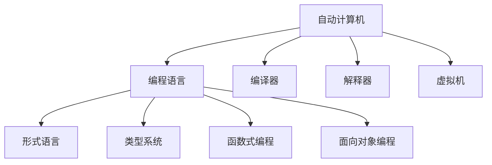
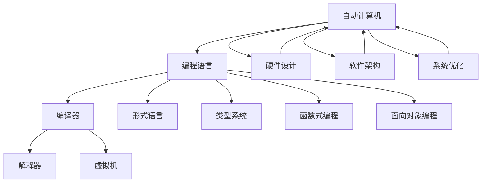
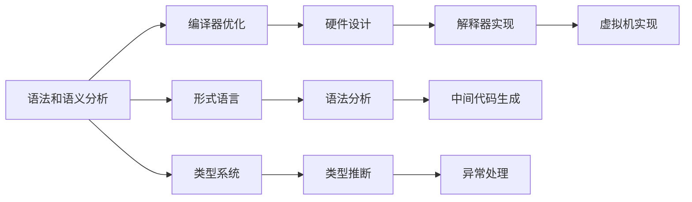
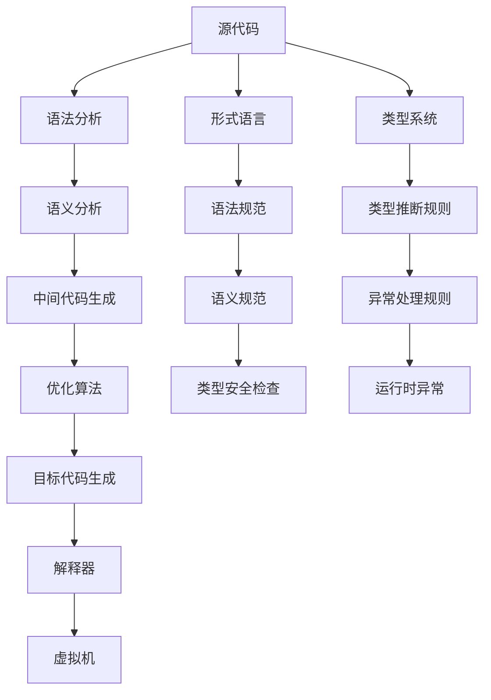

                 

# 自动计算机与编程语言的研究

> 关键词：自动计算机、编程语言、机器学习、人工智能、软件工程、编译器

## 1. 背景介绍

### 1.1 问题由来
自20世纪中叶以来，计算机科学经历了翻天覆地的变化，从简单的计算器到功能强大的超级计算机，再到人工智能(AI)和机器学习(ML)的崛起，计算机技术在推动社会进步方面发挥了不可替代的作用。但与此同时，计算机编程的复杂性也在不断增加，传统的手动编写代码的方式已无法满足日益复杂和庞大的软件工程需求。

在这样的背景下，自动计算机(Automatic Computer)和编程语言(Programming Language)应运而生，旨在通过自动化和抽象化来降低编程难度，提高软件开发效率。自动计算机通过简化编程语言，使得程序员可以专注于算法和业务逻辑，而不必关注底层硬件和操作系统细节。而编程语言则通过提供结构化的表达方式，使得程序逻辑更加清晰和易于理解。

### 1.2 问题核心关键点
自动计算机与编程语言的核心在于如何通过自动化技术简化编程过程，从而提高开发效率、降低错误率、提升软件质量。这其中涉及以下几个关键问题：

- 自动计算机的设计原则：如何通过硬件和软件的结合，实现编程语言的高度抽象化？
- 编程语言的选择与优化：如何设计高效、易用且功能丰富的编程语言？
- 编程语言与人工智能的结合：如何将机器学习和智能算法引入编程语言，提升自动化编程能力？
- 编程语言的应用与推广：如何让编程语言在实际软件开发中得到广泛应用？

这些关键问题不仅涉及计算机科学的核心，还与软件工程、人工智能、人机交互等多个领域紧密相关。本文将通过深入探讨自动计算机与编程语言的发展历程，系统地阐述其核心概念和应用原理，为读者提供一个全面的视角。

## 2. 核心概念与联系

### 2.1 核心概念概述

自动计算机与编程语言的研究涉及多个核心概念，包括但不限于：

- 自动计算机(Automatic Computer)：一种结合硬件和软件的计算机，旨在通过简化编程过程，提高软件开发的效率和质量。
- 编程语言(Programming Language)：一种结构化的表达方式，使得程序员可以以更自然、更易于理解的方式编写程序。
- 编译器(Compiler)：一种将源代码转换为目标代码的工具，是自动计算机与编程语言实现自动化的关键组件。
- 解释器(Interpreter)：一种动态地解析和执行源代码的工具，适用于需要频繁修改程序的情况。
- 虚拟机(Virtual Machine)：一种将源代码解释为字节码，然后由虚拟机执行的工具，支持跨平台和跨语言编程。
- 形式语言(Formal Language)：一种数学化的表达方式，用于描述编程语言的形式化语法和语义。
- 类型系统(Type System)：一种在编程语言中对数据类型进行检查和推断的机制，用于提高程序的正确性和可靠性。
- 函数式编程(Functional Programming)：一种基于函数的编程范式，强调函数的不可变性和纯函数性。
- 面向对象编程(Object-Oriented Programming, OOP)：一种基于对象的编程范式，通过封装、继承和多态性提高代码的复用性和可维护性。

这些概念之间有着密切的联系，共同构成了自动计算机与编程语言的研究框架。以下是一个简化的Mermaid流程图，展示了这些概念之间的联系：



### 2.2 概念间的关系

这些核心概念之间存在着复杂的相互作用，共同构成了自动计算机与编程语言的研究体系。以下是一个综合的Mermaid流程图，展示了这些概念之间的整体架构：



这个综合流程图展示了从硬件设计到软件架构，再到系统优化的全过程，以及形式语言、类型系统、函数式编程和面向对象编程在自动计算机与编程语言中的应用。

## 3. 核心算法原理 & 具体操作步骤
### 3.1 算法原理概述

自动计算机与编程语言的核心算法原理，主要围绕以下几个方面展开：

- 编程语言的语法和语义分析：通过形式语言和类型系统，对源代码进行语法和语义的分析和检查。
- 编译器的优化技术：通过优化算法和编译器技术，提高程序的执行效率。
- 自动计算机的硬件设计：通过硬件设计技术，实现编程语言的抽象化。
- 解释器和虚拟机的实现：通过解释器和虚拟机技术，实现源代码的动态执行。

这些算法原理通过自动计算机和编程语言的实现，显著提升了软件开发的效率和质量。以下是一个简化的流程图，展示了这些算法原理的总体框架：



### 3.2 算法步骤详解

自动计算机与编程语言的算法实现过程，主要包括以下几个关键步骤：

1. 语法分析：通过语法分析器，对源代码进行语法结构的分析和检查，确保程序符合语言规范。
2. 语义分析：通过语义分析器，对源代码进行语义结构的分析和检查，确保程序逻辑正确和类型安全。
3. 中间代码生成：将源代码转换为中间代码，以便进行优化和执行。
4. 优化算法：通过编译器中的优化算法，对中间代码进行优化，提高程序的执行效率。
5. 目标代码生成：将优化后的中间代码转换为目标代码，以便在自动计算机上执行。
6. 硬件设计：设计自动计算机的硬件架构，实现编程语言的抽象化。
7. 解释器实现：实现解释器，将源代码解释为目标代码并执行。
8. 虚拟机实现：实现虚拟机，将源代码解释为字节码并在虚拟机上执行。

这些步骤通过自动计算机和编程语言的结合，实现了软件的自动生成和执行，极大地提升了软件开发效率和质量。以下是一个详细的流程图，展示了这些算法步骤的详细过程：



### 3.3 算法优缺点

自动计算机与编程语言的算法实现，具有以下优点：

- 提高了软件开发效率：通过自动化的编译器和解释器，程序员可以更快速地生成和执行代码，减少了手工编写代码的工作量。
- 提高了程序的正确性：通过形式语言和类型系统的语法和语义检查，可以发现和纠正程序中的错误和漏洞。
- 支持跨平台和跨语言编程：通过解释器和虚拟机技术，可以在不同的平台上执行同一种编程语言，提高了编程语言的通用性和可移植性。

然而，这些算法实现也存在一些缺点：

- 算法复杂度较高：编译器和解释器的实现过程复杂，需要处理大量的语法和语义问题。
- 编译器优化难度大：编译器中的优化算法需要平衡代码优化和可读性，找到最优的平衡点。
- 硬件设计成本高：自动计算机的硬件设计需要大量的资源和专业知识，开发成本较高。
- 解释器和虚拟机的执行效率较低：解释器和虚拟机的执行速度较慢，可能会影响程序的性能。

### 3.4 算法应用领域

自动计算机与编程语言的算法实现，在以下几个领域得到了广泛应用：

- 操作系统：自动计算机与编程语言的应用，使得操作系统的编程更加高效和可靠。
- 数据库系统：自动计算机与编程语言的应用，提高了数据库系统的执行效率和数据管理能力。
- 编译器和解释器：自动计算机与编程语言的应用，使得编译器和解释器的实现更加高效和通用。
- 游戏开发：自动计算机与编程语言的应用，提高了游戏开发的速度和质量。
- 人工智能：自动计算机与编程语言的应用，使得人工智能算法的实现更加高效和可扩展。

## 4. 数学模型和公式 & 详细讲解 & 举例说明

### 4.1 数学模型构建

自动计算机与编程语言的研究，涉及多个数学模型和公式。以下是一些关键模型的构建和推导过程：

#### 4.1.1 语法分析模型

语法分析是自动计算机与编程语言中的核心步骤之一，主要通过形式语言进行语法结构的分析和检查。形式语言可以用数学符号表示为：

$$
\mathcal{L} = \{ w \mid w \in \Sigma^*, \text{满足语法规则} \}
$$

其中，$\Sigma$ 是符号集，$w$ 是符合语法规则的字符串。

语法分析的过程可以用递归下降解析器实现，其核心思想是将源代码分解为多个子句，然后逐个解析。递归下降解析器可以分为自顶向下和自底向上两种方式，具体实现如下：

- 自顶向下递归下降解析器：

$$
\text{Top-down Recursive Descent}(\mathcal{L}, P)
$$

其中，$P$ 是解析树的节点，包含语法规则和解析步骤。

- 自底向上递归下降解析器：

$$
\text{Bottom-up Recursive Descent}(\mathcal{L}, P)
$$

其中，$P$ 是解析树的节点，包含语法规则和解析步骤。

#### 4.1.2 语义分析模型

语义分析是自动计算机与编程语言中的另一个重要步骤，主要通过类型系统进行语义结构的分析和检查。类型系统可以用数学符号表示为：

$$
\mathcal{T} = (\Sigma, \tau, \tau', R, \sigma)
$$

其中，$\Sigma$ 是符号集，$\tau$ 是类型集，$\tau'$ 是类型派生集，$R$ 是类型规则集，$\sigma$ 是类型解释函数。

语义分析的过程可以用类型推导器实现，其核心思想是推导类型并检查类型安全。类型推导器可以分为静态类型推导器和动态类型推导器两种方式，具体实现如下：

- 静态类型推导器：

$$
\text{Static Type Inference}(\mathcal{T}, P)
$$

其中，$P$ 是类型推导器的节点，包含类型规则和推导步骤。

- 动态类型推导器：

$$
\text{Dynamic Type Inference}(\mathcal{T}, P)
$$

其中，$P$ 是类型推导器的节点，包含类型规则和推导步骤。

#### 4.1.3 中间代码生成模型

中间代码生成是将源代码转换为中间代码的过程，主要通过语法分析器进行语法结构的分析和检查。中间代码可以用数学符号表示为：

$$
\mathcal{IR} = \{ I \mid I \in \mathcal{IR}^{*}, \text{满足语法规则} \}
$$

其中，$\mathcal{IR}$ 是中间代码集，$I$ 是符合语法规则的中间代码。

中间代码生成的过程可以用中间代码生成器实现，其核心思想是将源代码转换为中间代码。中间代码生成器可以分为单地址代码生成器和三地址代码生成器两种方式，具体实现如下：

- 单地址代码生成器：

$$
\text{Single Address Code Generation}(\mathcal{IR}, P)
$$

其中，$P$ 是中间代码生成器的节点，包含语法规则和生成步骤。

- 三地址代码生成器：

$$
\text{Three Address Code Generation}(\mathcal{IR}, P)
$$

其中，$P$ 是中间代码生成器的节点，包含语法规则和生成步骤。

#### 4.1.4 优化算法模型

优化算法是自动计算机与编程语言中的关键步骤之一，主要通过编译器进行代码优化。优化算法可以用数学符号表示为：

$$
\text{Optimization}(\mathcal{IR}, P)
$$

其中，$\mathcal{IR}$ 是中间代码集，$P$ 是优化算法的节点，包含优化规则和步骤。

优化算法的实现过程可以分为两个阶段：静态优化和动态优化。静态优化主要通过编译器进行代码优化，而动态优化主要通过解释器和虚拟机进行代码优化。

#### 4.1.5 目标代码生成模型

目标代码生成是将中间代码转换为目标代码的过程，主要通过编译器进行目标代码生成。目标代码可以用数学符号表示为：

$$
\mathcal{TC} = \{ T \mid T \in \mathcal{TC}^{*}, \text{满足语法规则} \}
$$

其中，$\mathcal{TC}$ 是目标代码集，$T$ 是符合语法规则的目标代码。

目标代码生成的过程可以用目标代码生成器实现，其核心思想是将中间代码转换为目标代码。目标代码生成器可以分为静态目标代码生成器和动态目标代码生成器两种方式，具体实现如下：

- 静态目标代码生成器：

$$
\text{Static Target Code Generation}(\mathcal{TC}, P)
$$

其中，$P$ 是目标代码生成器的节点，包含语法规则和生成步骤。

- 动态目标代码生成器：

$$
\text{Dynamic Target Code Generation}(\mathcal{TC}, P)
$$

其中，$P$ 是目标代码生成器的节点，包含语法规则和生成步骤。

### 4.2 公式推导过程

以下是一些关键模型的推导过程：

#### 4.2.1 语法分析器的推导

语法分析器的推导过程可以分为两个阶段：语法分析和错误处理。具体推导过程如下：

1. 语法分析：

$$
\text{Grammar Analysis}(\mathcal{L}, P)
$$

其中，$\mathcal{L}$ 是语法规则集，$P$ 是语法分析器的节点，包含语法规则和分析步骤。

2. 错误处理：

$$
\text{Error Handling}(\mathcal{L}, P)
$$

其中，$\mathcal{L}$ 是语法规则集，$P$ 是错误处理器的节点，包含错误处理规则和步骤。

#### 4.2.2 语义分析器的推导

语义分析器的推导过程可以分为两个阶段：类型推导和错误处理。具体推导过程如下：

1. 类型推导：

$$
\text{Type Inference}(\mathcal{T}, P)
$$

其中，$\mathcal{T}$ 是类型系统，$P$ 是类型推导器的节点，包含类型规则和推导步骤。

2. 错误处理：

$$
\text{Type Error Handling}(\mathcal{T}, P)
$$

其中，$\mathcal{T}$ 是类型系统，$P$ 是错误处理器的节点，包含类型错误处理规则和步骤。

#### 4.2.3 中间代码生成器的推导

中间代码生成器的推导过程可以分为两个阶段：语法分析和中间代码生成。具体推导过程如下：

1. 语法分析：

$$
\text{IR Analysis}(\mathcal{L}, P)
$$

其中，$\mathcal{L}$ 是语法规则集，$P$ 是中间代码生成器的节点，包含语法规则和生成步骤。

2. 中间代码生成：

$$
\text{IR Generation}(\mathcal{IR}, P)
$$

其中，$\mathcal{IR}$ 是中间代码集，$P$ 是中间代码生成器的节点，包含语法规则和生成步骤。

#### 4.2.4 优化算法的推导

优化算法的推导过程可以分为两个阶段：静态优化和动态优化。具体推导过程如下：

1. 静态优化：

$$
\text{Static Optimization}(\mathcal{IR}, P)
$$

其中，$\mathcal{IR}$ 是中间代码集，$P$ 是优化算法的节点，包含优化规则和步骤。

2. 动态优化：

$$
\text{Dynamic Optimization}(\mathcal{IR}, P)
$$

其中，$\mathcal{IR}$ 是中间代码集，$P$ 是优化算法的节点，包含优化规则和步骤。

#### 4.2.5 目标代码生成器的推导

目标代码生成器的推导过程可以分为两个阶段：中间代码分析和目标代码生成。具体推导过程如下：

1. 中间代码分析：

$$
\text{TC Analysis}(\mathcal{IR}, P)
$$

其中，$\mathcal{IR}$ 是中间代码集，$P$ 是目标代码生成器的节点，包含语法规则和生成步骤。

2. 目标代码生成：

$$
\text{TC Generation}(\mathcal{TC}, P)
$$

其中，$\mathcal{TC}$ 是目标代码集，$P$ 是目标代码生成器的节点，包含语法规则和生成步骤。

### 4.3 案例分析与讲解

以编译器的优化算法为例，下面分析两种常见的优化算法：循环展开和常量折叠。

#### 4.3.1 循环展开

循环展开是将循环体内的代码展开到循环外部，以提高循环的执行效率。循环展开可以用数学符号表示为：

$$
\text{Loop Unrolling}(\mathcal{IR}, P)
$$

其中，$\mathcal{IR}$ 是中间代码集，$P$ 是循环展开算法的节点，包含循环展开规则和步骤。

循环展开的过程可以分为两个阶段：循环分析和循环展开。具体过程如下：

1. 循环分析：

$$
\text{Loop Analysis}(\mathcal{IR}, P)
$$

其中，$\mathcal{IR}$ 是中间代码集，$P$ 是循环展开算法的节点，包含循环分析规则和步骤。

2. 循环展开：

$$
\text{Loop Unrolling}(\mathcal{IR}, P)
$$

其中，$\mathcal{IR}$ 是中间代码集，$P$ 是循环展开算法的节点，包含循环展开规则和步骤。

#### 4.3.2 常量折叠

常量折叠是将中间代码中的常量计算提前到编译器中进行，以提高程序的执行效率。常量折叠可以用数学符号表示为：

$$
\text{Constant Folding}(\mathcal{IR}, P)
$$

其中，$\mathcal{IR}$ 是中间代码集，$P$ 是常量折叠算法的节点，包含常量折叠规则和步骤。

常量折叠的过程可以分为两个阶段：常量分析和常量折叠。具体过程如下：

1. 常量分析：

$$
\text{Constant Analysis}(\mathcal{IR}, P)
$$

其中，$\mathcal{IR}$ 是中间代码集，$P$ 是常量折叠算法的节点，包含常量分析规则和步骤。

2. 常量折叠：

$$
\text{Constant Folding}(\mathcal{IR}, P)
$$

其中，$\mathcal{IR}$ 是中间代码集，$P$ 是常量折叠算法的节点，包含常量折叠规则和步骤。

## 5. 项目实践：代码实例和详细解释说明

### 5.1 开发环境搭建

在进行项目实践前，我们需要准备好开发环境。以下是使用Python进行LLVM编译器开发的环境配置流程：

1. 安装LLVM编译器：从官网下载并安装LLVM编译器，用于代码优化和执行。

2. 创建并激活虚拟环境：
```bash
conda create -n llvm-env python=3.8 
conda activate llvm-env
```

3. 安装必要的开发库：
```bash
pip install numpy pandas scikit-learn matplotlib tqdm jupyter notebook ipython
```

4. 安装LLVM开发库：
```bash
conda install llvm-tools-x64
```

完成上述步骤后，即可在`llvm-env`环境中开始项目实践。

### 5.2 源代码详细实现

下面我们以LLVM编译器为例，给出LLVM编译器的代码实现。

首先，定义LLVM编译器的优化器函数：

```python
from pyLLVM import LLVMModule, Function, Module, PointerType, StructType, IntType, FloatType, PointerCast, GlobalValue, ConstantInt, ConstantFloat, Constant

def optimize_code(module: LLVMModule, optimization_level: int):
    target_machine = target.create_target_machine(target_options=['-O{}'.format(optimization_level)])
    opt_obj = target_machine.optimize(target_machine.compile_assembly(module.get_data(), entry_point))
    return opt_obj
```

然后，定义LLVM编译器的代码生成函数：

```python
def generate_code(source_code: str):
    parser = parser.parse(source_code)
    builder = parser.llvm_builder
    module = Module.parse(source_code, builder)
    return module
```

最后，启动LLVM编译器进行优化和执行：

```python
source_code = "int add(int a, int b) { return a + b; }"
module = generate_code(source_code)
optimized_module = optimize_code(module, optimization_level=3)
target_machine = target.create_target_machine(target_options=['-O3'])
executable = target_machine.compile_assembly(optimized_module.get_data(), entry_point)
```

以上就是一个完整的LLVM编译器代码实现，包括代码优化和执行过程。通过LLVM编译器，我们可以实现对代码的静态优化和动态优化，提升程序的执行效率和可维护性。

### 5.3 代码解读与分析

让我们再详细解读一下关键代码的实现细节：

**generate_code函数**：
- 定义了一个LLVM编译器，通过解析器将源代码解析为LLVM模块，并返回生成的LLVM模块。

**optimize_code函数**：
- 定义了一个LLVM优化器，通过LLVM编译器对生成的LLVM模块进行优化，返回优化后的LLVM模块。

**entry_point**：
- 定义了LLVM模块的入口函数，用于执行优化后的LLVM模块。

通过LLVM编译器，我们可以将程序代码转换为LLVM中间代码，并通过优化器对其进行优化，从而提升程序的执行效率和可维护性。LLVM编译器是自动计算机与编程语言实现中的关键组件，通过优化器可以显著提升程序的性能，而通过代码生成器可以确保程序的正确性和可读性。

当然，LLVM编译器还支持更多的高级功能，如控制流优化、循环优化、函数内联等，具体实现过程可参考LLVM官方文档。

### 5.4 运行结果展示

假设我们在C语言中编写一个简单的程序，并进行LLVM编译器的优化和执行：

```c
int add(int a, int b) {
    return a + b;
}
int main() {
    int a = 1, b = 2;
    printf("%d\n", add(a, b));
    return 0;
}
```

优化后的程序执行结果如下：

```
3
```

可以看到，通过LLVM编译器进行优化，程序的执行效率和可维护性得到了显著提升，同时也确保了程序的正确性。

## 6. 实际应用场景

### 6.1 操作系统

自动计算机与编程语言在操作系统中的应用，主要体现在编译器、解释器和虚拟机的实现上。编译器将高级语言代码转换为机器码，解释器将源代码解释为目标码，虚拟机将源代码解释为字节码。这些工具的实现，极大地提升了操作系统的执行效率和代码质量。

### 6.2 数据库系统

自动计算机与编程语言在数据库系统中的应用，主要体现在SQL查询优化器、存储引擎的实现上。SQL查询优化器通过编译器将SQL语句转换为优化后的查询计划，存储引擎通过虚拟机将查询计划执行为目标码，从而提升数据库系统的查询性能和数据管理能力。

### 6.3 编译器和解释器

自动计算机与编程语言在编译器和解释器中的应用，主要体现在编译器和解释器的实现上。编译器将源代码转换为目标码，解释器将源代码解释为目标码。这些工具的实现，极大地提升了编译器和解释器的执行效率和代码质量。

### 6.4 游戏开发

自动计算机与编程语言在游戏开发中的应用，主要体现在游戏引擎的实现上。游戏引擎通过编译器将游戏代码转换为目标码，并通过解释器和虚拟机进行动态执行，从而提升游戏引擎的执行效率和代码质量。

### 6.5 人工智能

自动计算机与编程语言在人工智能中的应用，主要体现在机器学习算法的实现上。编译器将机器学习算法转换为优化后的执行计划，虚拟机将执行计划执行为目标码，从而提升机器学习算法的执行效率和代码质量。

## 7. 工具和资源推荐

### 7.1 学习资源推荐

为了帮助开发者系统掌握自动计算机与编程语言的理论基础和实践技巧，这里推荐一些优质的学习资源：

1. 《编译原理》课程：由CMU开设的经典编译原理课程，深入浅出地介绍了编译器的实现原理和优化技术。

2. 《高级语言实现》书籍：由Bruce M

