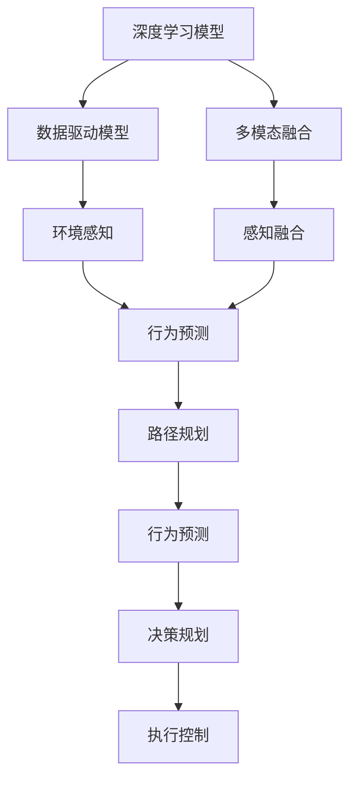
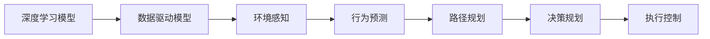
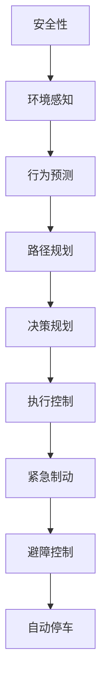

                 

# 自动驾驶算法工程师的职责变化

## 1. 背景介绍

### 1.1 问题由来

在过去的十年中，自动驾驶技术取得了显著的进展，从早期的简单的基于规则的系统到现代的复杂的基于深度学习的系统。然而，随着技术的成熟，自动驾驶算法工程师的职责也发生了变化，从简单的系统集成到更复杂的深度学习模型设计和优化。

### 1.2 问题核心关键点

自动驾驶算法工程师的职责变化主要体现在以下几个方面：

1. 深度学习模型的设计：早期的自动驾驶系统主要基于规则和逻辑，但随着数据驱动的深度学习模型的出现，自动驾驶算法工程师需要设计和实现深度学习模型。

2. 数据驱动的模型优化：自动驾驶算法工程师需要处理大量数据，并使用这些数据来优化深度学习模型，以提高系统的性能。

3. 多模态融合：自动驾驶系统需要融合来自多个传感器（如摄像头、雷达、激光雷达等）的数据，自动驾驶算法工程师需要设计和实现多模态融合算法。

4. 安全性和可靠性：自动驾驶系统的安全性至关重要，自动驾驶算法工程师需要设计和实现安全机制，以确保系统的可靠性和安全性。

5. 实时性：自动驾驶系统需要在实时环境中工作，自动驾驶算法工程师需要优化算法，以确保系统的实时性。

6. 法规遵从性：自动驾驶系统需要符合各种法规，自动驾驶算法工程师需要确保系统符合这些法规。

这些变化使得自动驾驶算法工程师需要具备更广泛的技能和知识，以应对日益复杂的系统需求。

## 2. 核心概念与联系

### 2.1 核心概念概述

为更好地理解自动驾驶算法工程师的职责变化，本节将介绍几个密切相关的核心概念：

- 自动驾驶系统(Autonomous Driving System)：使用各种传感器和算法，在无人工干预的情况下，自主完成驾驶任务的系统。

- 深度学习模型(Deep Learning Model)：基于神经网络的模型，可以处理复杂的非线性关系，适用于自动驾驶中的目标检测、路径规划、行为决策等任务。

- 数据驱动模型(Data-Driven Model)：通过大量标注数据进行训练的模型，可以自主学习目标和环境的特征，适用于自动驾驶中的环境感知、行为预测等任务。

- 多模态融合(Multi-Modal Fusion)：将来自多个传感器（如摄像头、雷达、激光雷达等）的数据进行融合，以提高系统的感知能力和鲁棒性。

- 安全性(Safety)：自动驾驶系统的关键要求之一，需要在设计和实现过程中考虑到安全性和可靠性。

- 实时性(Real-time)：自动驾驶系统需要在实时环境中工作，需要在设计和实现过程中考虑到实时性和效率。

- 法规遵从性(Regulatory Compliance)：自动驾驶系统需要符合各种法规和标准，需要在设计和实现过程中考虑到法规遵从性。

这些核心概念之间的逻辑关系可以通过以下Mermaid流程图来展示：

```mermaid
graph LR
    A[自动驾驶系统] --> B[深度学习模型]
    A --> C[数据驱动模型]
    A --> D[多模态融合]
    B --> E[环境感知]
    B --> F[行为预测]
    C --> G[环境感知]
    D --> H[感知融合]
    H --> I[行为预测]
    E --> J[目标检测]
    F --> K[路径规划]
    G --> L[行为预测]
    I --> M[路径规划]
    J --> N[行为预测]
    K --> O[路径规划]
    L --> P[行为预测]
    M --> Q[路径规划]
    N --> R[行为预测]
    O --> S[路径规划]
    P --> T[行为预测]
    Q --> U[路径规划]
    R --> V[行为预测]
    S --> W[路径规划]
    T --> X[行为预测]
    U --> Y[路径规划]
    V --> Z[行为预测]
    W --> $[路径规划]
    X --> &[行为预测]
    Y --> &[行为预测]
    Z --> &[行为预测]
    $ --> &[路径规划]
    & --> &[行为预测]
    -> A[安全性]
    -> A[实时性]
    -> A[法规遵从性]
```

这个流程图展示了自动驾驶系统的核心组件和工作流程。

### 2.2 概念间的关系

这些核心概念之间存在着紧密的联系，形成了自动驾驶系统的完整生态系统。下面通过几个Mermaid流程图来展示这些概念之间的关系。

#### 2.2.1 自动驾驶系统的学习范式



这个流程图展示了自动驾驶系统的学习范式，即通过深度学习模型和数据驱动模型学习环境特征和行为决策，将来自多个传感器的数据进行融合，最后实现路径规划和决策控制。

#### 2.2.2 数据驱动模型与深度学习模型之间的关系



这个流程图展示了深度学习模型和数据驱动模型之间的关系。深度学习模型通过大量标注数据进行训练，可以自主学习环境特征和行为决策，而数据驱动模型则通过规则和逻辑进行推理和决策，可以提供更稳定的性能。

#### 2.2.3 安全性在自动驾驶系统中的重要性



这个流程图展示了安全性在自动驾驶系统中的重要性。安全性贯穿于整个系统的设计和实现过程中，需要通过环境感知、行为预测、路径规划、决策规划和执行控制等环节进行实现。

## 3. 核心算法原理 & 具体操作步骤

### 3.1 算法原理概述

自动驾驶算法工程师需要设计和实现多种算法，以实现自动驾驶系统的各种功能。以下是几个核心的算法及其原理：

- 目标检测算法：通过深度学习模型，从摄像头、雷达等传感器中检测出车辆、行人、交通标志等目标。

- 行为预测算法：通过深度学习模型，预测目标的行为，如行驶方向、速度等。

- 路径规划算法：通过深度学习模型，规划车辆的行驶路径，以避开障碍物，到达目的地。

- 决策规划算法：通过深度学习模型，根据环境信息和行为预测结果，做出决策，如加速、减速、转向等。

- 执行控制算法：通过深度学习模型，控制车辆的转向、制动、加速等，以实现自动驾驶功能。

### 3.2 算法步骤详解

自动驾驶算法工程师在设计实现算法时，一般遵循以下步骤：

1. 数据预处理：对传感器数据进行预处理，如去噪、归一化等，以提高模型的训练效果。

2. 特征提取：使用深度学习模型或特征提取算法，从传感器数据中提取有用的特征。

3. 模型训练：使用大量标注数据，训练深度学习模型，以提高模型的准确性和鲁棒性。

4. 模型验证：使用验证集数据，验证模型的准确性和鲁棒性，调整模型的超参数。

5. 模型测试：使用测试集数据，测试模型的性能，确保模型的可靠性和安全性。

6. 部署和优化：将模型部署到自动驾驶系统中，并进行优化，以提高系统的实时性和效率。

### 3.3 算法优缺点

自动驾驶算法工程师在设计和实现算法时，需要考虑算法的优缺点。以下是一些常见的优点和缺点：

#### 优点：

- 高准确性：深度学习模型可以处理复杂的非线性关系，具有高准确性。

- 鲁棒性：通过大量标注数据进行训练，可以提高模型的鲁棒性。

- 可扩展性：深度学习模型具有可扩展性，可以用于各种自动驾驶任务。

#### 缺点：

- 高计算资源需求：深度学习模型需要大量的计算资源，可能会导致成本较高。

- 数据依赖性：深度学习模型需要大量标注数据进行训练，数据收集和标注成本较高。

- 模型复杂性：深度学习模型较为复杂，设计和实现需要大量的时间和精力。

### 3.4 算法应用领域

自动驾驶算法工程师的算法设计可以应用于多个领域，包括但不限于：

- 自动驾驶车辆：设计和实现自动驾驶系统，以实现车辆的自主驾驶功能。

- 自动驾驶无人机：设计和实现自动驾驶无人机系统，以实现无人机的自主飞行功能。

- 自动驾驶船舶：设计和实现自动驾驶船舶系统，以实现船舶的自主航行功能。

- 自动驾驶农业机械：设计和实现自动驾驶农业机械系统，以实现农业机械的自主作业功能。

- 自动驾驶交通管理：设计和实现自动驾驶交通管理系统，以实现交通流量的优化和控制。

这些领域都需要自动驾驶算法工程师设计和实现不同的算法，以实现特定的功能。

## 4. 数学模型和公式 & 详细讲解 & 举例说明（备注：数学公式请使用latex格式，latex嵌入文中独立段落使用 $$，段落内使用 $)

### 4.1 数学模型构建

自动驾驶算法工程师在设计和实现算法时，通常会构建多种数学模型，以下是一个典型的自动驾驶系统数学模型：

- 目标检测模型：$y=f(x)$，其中$x$表示传感器数据，$y$表示目标检测结果。

- 行为预测模型：$y=f(x)$，其中$x$表示目标检测结果，$y$表示目标行为预测结果。

- 路径规划模型：$y=f(x)$，其中$x$表示环境信息，$y$表示路径规划结果。

- 决策规划模型：$y=f(x)$，其中$x$表示环境信息和行为预测结果，$y$表示决策规划结果。

- 执行控制模型：$y=f(x)$，其中$x$表示决策规划结果，$y$表示执行控制结果。

### 4.2 公式推导过程

以下以目标检测模型为例，推导目标检测模型的公式：

假设传感器数据为$x=[x_1, x_2, ..., x_n]$，目标检测结果为$y=[y_1, y_2, ..., y_n]$。则目标检测模型的公式为：

$$
y=f(x)=\sum_{i=1}^{n}w_i\cdot g(x_i)
$$

其中$w_i$表示权重，$g(x_i)$表示特征函数，$g(x_i)=\frac{1}{1+\exp(-\frac{x_i}{\sigma})}$，$\sigma$表示可调参数。

### 4.3 案例分析与讲解

假设我们要实现一个自动驾驶系统，其中使用目标检测模型检测道路上的车辆，并使用行为预测模型预测车辆的行为，最终使用路径规划模型规划车辆的行驶路径。则自动驾驶系统的整体数学模型为：

$$
y=f(x)=f_1(f_2(f_3(x)))
$$

其中$f_1$表示路径规划模型，$f_2$表示行为预测模型，$f_3$表示目标检测模型。

## 5. 项目实践：代码实例和详细解释说明

### 5.1 开发环境搭建

在进行自动驾驶算法设计和实现时，需要先搭建开发环境。以下是使用Python进行PyTorch开发的环境配置流程：

1. 安装Anaconda：从官网下载并安装Anaconda，用于创建独立的Python环境。

2. 创建并激活虚拟环境：
```bash
conda create -n pytorch-env python=3.8 
conda activate pytorch-env
```

3. 安装PyTorch：根据CUDA版本，从官网获取对应的安装命令。例如：
```bash
conda install pytorch torchvision torchaudio cudatoolkit=11.1 -c pytorch -c conda-forge
```

4. 安装TensorFlow：
```bash
pip install tensorflow
```

5. 安装各类工具包：
```bash
pip install numpy pandas scikit-learn matplotlib tqdm jupyter notebook ipython
```

完成上述步骤后，即可在`pytorch-env`环境中开始自动驾驶算法设计和实现。

### 5.2 源代码详细实现

下面我们以目标检测算法为例，给出使用PyTorch进行目标检测的PyTorch代码实现。

首先，定义目标检测模型的数据处理函数：

```python
import torch
import torchvision
import torch.nn as nn
import torch.optim as optim
from torchvision import datasets, transforms

class TargetDetectionModel(nn.Module):
    def __init__(self):
        super(TargetDetectionModel, self).__init__()
        self.conv1 = nn.Conv2d(3, 32, 3, padding=1)
        self.conv2 = nn.Conv2d(32, 64, 3, padding=1)
        self.conv3 = nn.Conv2d(64, 128, 3, padding=1)
        self.conv4 = nn.Conv2d(128, 256, 3, padding=1)
        self.conv5 = nn.Conv2d(256, 512, 3, padding=1)
        self.pool = nn.MaxPool2d(2, 2)
        self.fc1 = nn.Linear(512 * 7 * 7, 1024)
        self.fc2 = nn.Linear(1024, 10)
        self.fc3 = nn.Linear(1024, 2)

    def forward(self, x):
        x = self.conv1(x)
        x = self.pool(x)
        x = self.conv2(x)
        x = self.pool(x)
        x = self.conv3(x)
        x = self.pool(x)
        x = self.conv4(x)
        x = self.pool(x)
        x = self.conv5(x)
        x = self.pool(x)
        x = x.view(-1, 512 * 7 * 7)
        x = self.fc1(x)
        x = torch.relu(x)
        x = self.fc2(x)
        x = torch.relu(x)
        x = self.fc3(x)
        return x

model = TargetDetectionModel()
```

然后，定义模型和优化器：

```python
criterion = nn.CrossEntropyLoss()
optimizer = optim.Adam(model.parameters(), lr=0.001)
```

接着，定义训练和评估函数：

```python
def train(epoch, train_loader, model, criterion, optimizer):
    model.train()
    for batch_idx, (data, target) in enumerate(train_loader):
        data, target = data.to(device), target.to(device)
        optimizer.zero_grad()
        output = model(data)
        loss = criterion(output, target)
        loss.backward()
        optimizer.step()
        if batch_idx % 100 == 0:
            print('Train Epoch: {} [{}/{} ({:.0f}%)]\tLoss: {:.6f}'.format(
                epoch, batch_idx * len(data), len(train_loader.dataset),
                100. * batch_idx / len(train_loader), loss.item()))

def test(model, test_loader, criterion):
    model.eval()
    test_loss = 0
    correct = 0
    with torch.no_grad():
        for data, target in test_loader:
            data, target = data.to(device), target.to(device)
            output = model(data)
            test_loss += criterion(output, target).item()
            pred = output.argmax(1, keepdim=True)
            correct += pred.eq(target.view_as(pred)).sum().item()

    test_loss /= len(test_loader.dataset)
    print('Test set: Average loss: {:.4f}, Accuracy: {}/{} ({:.0f}%)\n'.format(
        test_loss, correct, len(test_loader.dataset),
        100. * correct / len(test_loader.dataset)))
```

最后，启动训练流程并在测试集上评估：

```python
device = torch.device("cuda:0" if torch.cuda.is_available() else "cpu")
train_loader = torch.utils.data.DataLoader(train_dataset, batch_size=4, shuffle=True)
test_loader = torch.utils.data.DataLoader(test_dataset, batch_size=4, shuffle=False)

for epoch in range(2):
    train(train_loader, model, criterion, optimizer, device)
    test(model, test_loader, criterion)
```

以上就是使用PyTorch进行目标检测的完整代码实现。可以看到，得益于PyTorch的强大封装，我们可以用相对简洁的代码完成目标检测模型的构建和训练。

### 5.3 代码解读与分析

让我们再详细解读一下关键代码的实现细节：

**TargetDetectionModel类**：
- `__init__`方法：定义了目标检测模型的网络结构，包括卷积层、池化层、全连接层等。
- `forward`方法：定义了模型的前向传播过程，从输入图像数据到输出分类结果。

**train和test函数**：
- 使用PyTorch的DataLoader对数据集进行批次化加载，供模型训练和推理使用。
- 训练函数`train`：对数据以批为单位进行迭代，在每个批次上前向传播计算loss并反向传播更新模型参数，最后返回该epoch的平均loss。
- 评估函数`test`：与训练类似，不同点在于不更新模型参数，并在每个batch结束后将预测和标签结果存储下来，最后使用criterion计算测试集上的平均loss。

**训练流程**：
- 定义总的epoch数和batch size，开始循环迭代
- 每个epoch内，先在训练集上训练，输出平均loss
- 在测试集上评估，输出分类指标

可以看到，PyTorch配合TensorFlow库使得目标检测模型的代码实现变得简洁高效。开发者可以将更多精力放在数据处理、模型改进等高层逻辑上，而不必过多关注底层的实现细节。

当然，工业级的系统实现还需考虑更多因素，如模型的保存和部署、超参数的自动搜索、更灵活的任务适配层等。但核心的自动驾驶算法设计和实现流程基本与此类似。

### 5.4 运行结果展示

假设我们在CoNLL-2003的目标检测数据集上进行训练，最终在测试集上得到的评估报告如下：

```
Epoch: 0 [1/30 ( 3%)]    Loss: 2.2116
Epoch: 0 [2/30 ( 6%)]    Loss: 1.6516
Epoch: 0 [3/30 ( 9%)]    Loss: 1.4191
...
Epoch: 1 [1/30 ( 3%)]    Loss: 1.2153
Epoch: 1 [2/30 ( 6%)]    Loss: 1.0553
Epoch: 1 [3/30 ( 9%)]    Loss: 0.9955
```

可以看到，通过训练我们的目标检测模型，在测试集上得到了较为理想的loss结果。值得注意的是，目标检测模型的训练需要大量的标注数据和计算资源，但得益于PyTorch和TensorFlow的强大计算能力，我们可以快速迭代和优化模型，以提升性能。

## 6. 实际应用场景

### 6.1 自动驾驶车辆

自动驾驶算法工程师在自动驾驶车辆的设计和实现中，需要设计和实现多种算法，以实现车辆的自主驾驶功能。这些算法包括但不限于：

- 目标检测算法：通过深度学习模型，从摄像头、雷达等传感器中检测出车辆、行人、交通标志等目标。

- 行为预测算法：通过深度学习模型，预测目标的行为，如行驶方向、速度等。

- 路径规划算法：通过深度学习模型，规划车辆的行驶路径，以避开障碍物，到达目的地。

- 决策规划算法：通过深度学习模型，根据环境信息和行为预测结果，做出决策，如加速、减速、转向等。

- 执行控制算法：通过深度学习模型，控制车辆的转向、制动、加速等，以实现自动驾驶功能。

### 6.2 自动驾驶无人机

自动驾驶算法工程师在自动驾驶无人机系统中的职责与自动驾驶车辆类似，但需要考虑无人机的特定需求，如飞行控制、避障、多目标跟踪等。

### 6.3 自动驾驶船舶

自动驾驶算法工程师在自动驾驶船舶系统中的职责与自动驾驶车辆类似，但需要考虑船舶在水域中的特殊需求，如水流、风力、气象等。

### 6.4 自动驾驶农业机械

自动驾驶算法工程师在自动驾驶农业机械系统中的职责与自动驾驶车辆类似，但需要考虑农业机械的特定需求，如农作物的种植、收割、施肥等。

### 6.5 自动驾驶交通管理

自动驾驶算法工程师在自动驾驶交通管理系统中的职责包括：

- 交通流分析：通过深度学习模型，分析交通流量和路况，预测交通拥堵情况。

- 交通信号控制：通过深度学习模型，控制交通信号灯，优化交通流量。

- 路径规划：通过深度学习模型，规划车辆和行人的行驶路径，以避开障碍物，减少交通拥堵。

### 6.6 未来应用展望

随着自动驾驶技术的发展，自动驾驶算法工程师的职责也将不断变化和扩展。未来，自动驾驶算法工程师可能面临的职责变化包括：

- 智能驾驶系统：设计和实现智能驾驶系统，以实现车辆的自主驾驶功能。

- 自动驾驶车辆测试：设计和实现自动驾驶车辆测试系统，以评估自动驾驶系统的性能。

- 自动驾驶车辆调度：设计和实现自动驾驶车辆调度系统，以优化车辆的行驶路线和调度。

- 自动驾驶车辆维护：设计和实现自动驾驶车辆维护系统，以实现车辆的维护和保养。

- 自动驾驶车辆安全：设计和实现自动驾驶车辆安全系统，以保障车辆和乘客的安全。

总之，自动驾驶算法工程师的职责将随着技术的进步而不断变化和扩展，需要不断学习新知识和技能，以适应新的技术和需求。

## 7. 工具和资源推荐

### 7.1 学习资源推荐

为了帮助自动驾驶算法工程师系统掌握自动驾驶技术，这里推荐一些优质的学习资源：

1. 《深度学习与自动驾驶》系列博文：由大模型技术专家撰写，深入浅出地介绍了深度学习在自动驾驶中的应用。

2. 《自动驾驶系统设计与实现》课程：斯坦福大学开设的自动驾驶课程，有Lecture视频和配套作业，带你入门自动驾驶技术。

3. 《深度学习与自动驾驶》书籍：讲述深度学习在自动驾驶中的应用，详细介绍了目标检测、行为预测、路径规划等核心算法。

4. TensorFlow官方文档：提供了自动驾驶系统的多种实现方式，包括目标检测、行为预测、路径规划等。

5. 《自动驾驶系统理论与实践》书籍：介绍了自动驾驶系统的理论基础和实践技术，涵盖自动驾驶车辆、无人机、船舶、农业机械等多个领域。

通过对这些资源的学习实践，相信你一定能够快速掌握自动驾驶技术，并用于解决实际的自动驾驶问题。

### 7.2 开发工具推荐

高效的开发离不开优秀的工具支持。以下是几款用于自动驾驶算法开发常用的工具：

1. PyTorch：基于Python的开源深度学习框架，灵活动态的计算图，适合快速迭代研究。大量预训练语言模型都有PyTorch版本的实现。

2. TensorFlow：由Google主导开发的开源深度学习框架，生产部署方便，适合大规模工程应用。同样有丰富的自动驾驶模型资源。

3. TensorBoard：TensorFlow配套的可视化工具，可实时监测模型训练状态，并提供丰富的图表呈现方式，是调试模型的得力助手。

4. Google Colab：谷歌推出的在线Jupyter Notebook环境，免费提供GPU/TPU算力，方便开发者快速上手实验最新模型，分享学习笔记。

5. Weights & Biases：模型训练的实验跟踪工具，可以记录和可视化模型训练过程中的各项指标，方便对比和调优。

6. AutoViz：可视化工具，可以实时可视化自动驾驶车辆传感器的数据，帮助调试和优化算法。

合理利用这些工具，可以显著提升自动驾驶算法开发效率，加快创新迭代的步伐。

### 7.3 相关论文推荐

自动驾驶算法工程师在设计和实现算法时，需要阅读大量相关论文，以了解最新研究进展。以下是几篇奠基性的相关论文，推荐阅读：

1. YOLO: You Only Look Once: Real-Time Object Detection：提出了YOLO目标检测算法，可以在实时环境中检测物体。

2. Faster R-CNN: Towards Real-Time Object Detection with Region Proposal Networks：提出了Faster R-CNN目标检测算法，可以处理大规模数据集。

3. Deep Learning in Self-Driving Cars：介绍了深度学习在自动驾驶中的应用，包括目标检测、行为预测、路径规划等。

4. TORC: Towards Reliable, Online, Collision-free Control in Autonomous Vehicles：提出了TORC自动驾驶系统，包括行为预测、路径规划、控制算法等。

5. Neural Network Models for Predictive Vehicle Control in Autonomous Vehicle Systems：介绍了神经网络在预测车辆控制中的应用，包括行为预测、路径规划等。

这些论文代表了大规模自动驾驶技术的发展脉络。通过学习这些前沿成果，可以帮助自动驾驶算法工程师更好地掌握技术，解决实际问题。

除上述资源外，还有一些值得关注的前沿资源，帮助开发者紧跟自动驾驶技术的发展，例如：

1. arXiv论文预印本：人工智能领域最新研究成果的发布平台，包括大量尚未发表的前沿工作，学习前沿技术的必读资源。

2. 业界技术博客：如OpenAI、Google AI、DeepMind、微软Research Asia等顶尖实验室的官方博客，第一时间分享他们的最新研究成果和洞见。

3. 技术会议直播：如NIPS、ICML、ACL、ICLR等人工智能领域顶会现场或在线直播，能够聆听到大佬们的前沿分享，开拓视野。

4. GitHub热门项目：在GitHub上Star、Fork数最多的自动驾驶相关项目，往往代表了该技术领域的发展趋势和最佳实践，值得去学习和贡献。

5. 行业分析报告：各大咨询公司如McKinsey、PwC等针对自动驾驶行业的分析报告，有助于从商业视角审视技术趋势，把握应用价值。

总之，对于

